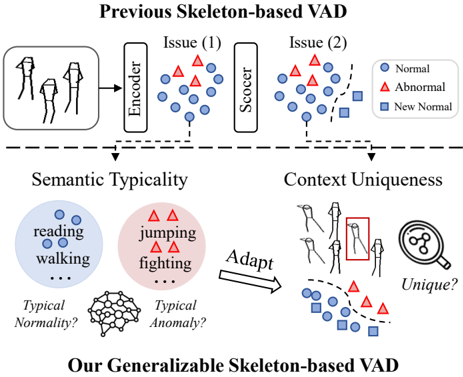
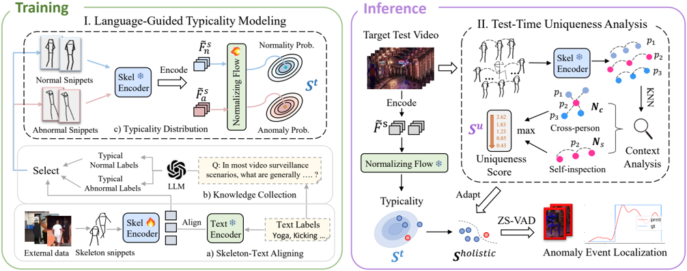
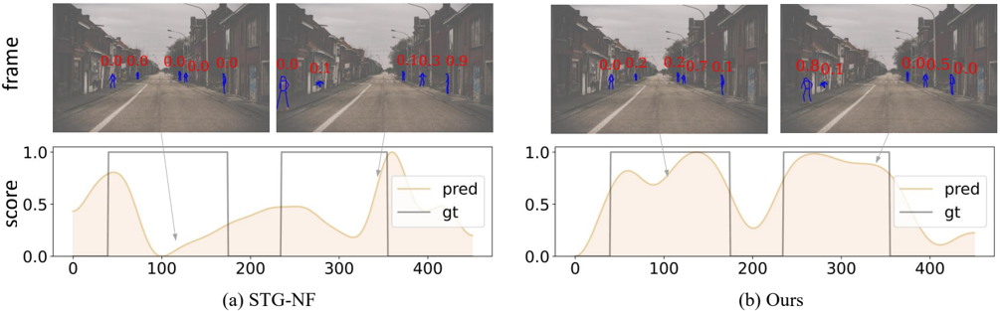
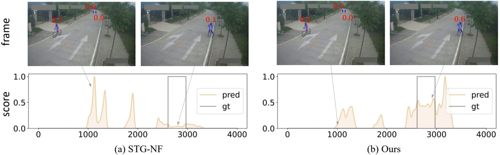

## Action Hints: Semantic Typicality and Context Uniqueness for Generalizable Skeleton-based Video Anomaly Detection

Canhui Tang, Sanping Zhou, Member, IEEE, Haoyue Shi, Le Wang, Senior Member, IEEE

Abstract—Zero-Shot Video Anomaly Detection (ZS-VAD) requires temporally localizing anomalies without target domain training data, which is a crucial task due to various practical concerns, e.g., data privacy or new surveillance deployments. Skeleton-based approach has inherent generalizable advantages in achieving ZS-VAD as it eliminates domain disparities both in background and human appearance. However, existing methods only learn low-level skeleton representation and rely on the domain-limited normality boundary, which cannot generalize well to new scenes with different normal and abnormal behavior patterns. In this paper, we propose a novel zero-shot video anomaly detection framework, unlocking the potential of skeleton data via action typicality and uniqueness learning. Firstly, we introduce a language-guided semantic typicality modeling module that projects skeleton snippets into action semantic space and distills LLM's knowledge of typical normal and abnormal behaviors during training. Secondly, we propose a test-time context uniqueness analysis module to finely analyze the spatio-temporal differences between skeleton snippets and then derive sceneadaptive boundaries. Without using any training samples from the target domain, our method achieves state-of-the-art results against skeleton-based methods on four large-scale VAD datasets: ShanghaiTech, UBnormal, NWPU, and UCF-Crime, featuring over 100 unseen surveillance scenes.

Index Terms—Video Anomaly Detection, Skeleton-based, Zeroshot, Action Semantic Typicality, Context Uniqueness.

## I. INTRODUCTION

Video Anomaly Detection (VAD) aims to temporally locate abnormal events, which has wide applications in the context of video surveillance and public safety [1], [2]. Current mainstream paradigms include one-class [3]–[7] and weakly supervised methods [2], [8], [9], which require abundant samples from the target video domain for training. However, in surveillance scenarios involving privacy or newly installed monitoring devices, training samples from the target domain are usually not available. Therefore, designing a Zero-Shot Video Anomaly Detection (ZS-VAD) method that can generalize to diverse target domains becomes necessary. Despite the recent extensive attention given to zero-shot image anomaly detection [10]–[14], the zero-shot setting in the complex surveillance video domain remains under-explored [15].

The challenges of ZS-VAD come from significant variations in visual appearance and human activities across different

This work was supported in part by National Science and Technology Major Project under Grant 2023ZD0121300, National Natural Science Foundation of China under Grants 62088102, U24A20325 and 12326608, and Fundamental Research Funds for the Central Universities under Grant XTR042021005. (Corresponding author: Sanping Zhou, E-mail: spzhou@mail.xjtu.edu.cn.)

Canhui Tang, Sanping Zhou, Haoyue Shi, and Le Wang are all with the National Key Laboratory of Human-Machine Hybrid Augmented Intelligence, National Engineering Research Center for Visual Information and Applications, and Institute of Artificial Intelligence and Robotics, Xi'an Jiaotong University, Shaanxi 710049, China.

Fig. 1. An illustration of skeleton-based VAD paradigm comparison. Previous approaches suffer from two main issues: (1) low-level representations and (2) domain-limited normal boundary. Our method enhances generalizability via action semantic typicality learning and context uniqueness analysis.

video domains. While frame/object-based methods [3], [4], [16] have been prominent in video anomaly detection, their performance will degrade when adapting to new scenes due to visual feature distribution shifts. In another view, skeletonbased methods [6], [17]–[19] utilize mature pose detection systems [20], [21] to obtain skeleton data, learn to encode features via self-supervision tasks [18], [19], and then calculate the anomaly score. They are effective for identifying human behavior anomalies, which are popular in the VAD task due to their superior efficiency and performance. skeletonbased methods also have inherent generalizable advantages in achieving ZS-VAD as it eliminates domain disparities both in background and human appearance.

However, as shown in Fig. 1, existing skeleton-based VAD methods still suffer from several limitations: (1) Low-level skeleton representations. They learn normal distribution of skeleton patterns using self-supervised tasks, such as skeleton prediction [19], reconstruction [18], or coordinate-based normalizing flows [6]. Without semantic supervision signals, such methods fail to capture higher-level action patterns, making them unable to distinguish novel anomaly patterns similar to normal patterns and sensitive to noise. (2) Domain-limited normality boundary. They blindly rely on training-datadefined normality boundaries, leading to the misclassification of unseen normal events as anomalies. Both limitations hinder their generalization to unseen scenes with varying normal and

abnormal patterns. This leads to a question: "Can we further unlock the potential of skeleton in ZS-VAD with generalizable representation learning and prior injection? "

To address this question, we reflect on how human observers judge normal and abnormal behavior in a new scenario. As shown in Fig. 1, we first identify the types of individual actions in the video and consider whether they are normal or abnormal based on our experiential knowledge of normality and abnormality, which is referred to as typicality. For instance, a pedestrian walking would be considered normal, while a fight or scuffle would be deemed abnormal. Secondly, for atypical normal or abnormal scenarios, we integrate the behaviors of all individuals in the video to observe if any individual's behavior significantly differs from others, as anomalies are usually rare and unique, referred to as context uniqueness.

Based on these complementary priors, we propose a novel skeleton-based zero-shot video anomaly detection framework, which captures both typical anomalies guided by language prior and unique anomalies in spatio-temporal contexts. First, we introduce a language-guided typicality modeling module to achieve high-level semantic understanding beyond previous low-level representations. Specifically, it projects skeleton snippets into language-aligned action semantic space and distills LLM's knowledge of typical normal and abnormal behaviors during training. Secondly, to derive scene-adaptive boundaries, we propose a context uniqueness analysis module at test time. It finely analyzes the spatio-temporal differences between skeleton snippets to get an adaptive understanding of target scene activities. Without using any training samples from the target domain, we achieve state-of-the-art results on four large-scale VAD datasets: ShanghaiTech [1], UBnormal [22], NWPU [23], UCF-Crime [2], featuring over 100 unseen surveillance scenes. Our contributions are as follows:

- We propose a skeleton-based video anomaly detection framework that learns action typicality and uniqueness, enabling generalization across diverse target scenes.
- We propose a language-guided typicality modeling module that projects skeleton snippets into a generalizable semantic space and distills LLM's knowledge of typical normal and abnormal behaviors during training.
- We propose a test-time uniqueness analysis module to finely analyze the spatio-temporal differences between skeleton snippets and derive scene-adaptive boundaries between normal and abnormal behavior.

The rest of this paper is organized as follows. We review the related work in Section II. Section III describes the technical details of our proposed method. Section IV presents the experiment details and results. Finally, we summarize the paper in Section V .

## II. RELATED WORK

Video anomaly detection. Most previous video anomaly detection studies can be grouped into frame-based [1], [2], [4], object-centric [3], [16], [24], and skeleton-based methods [6], [19], [25]. In this work, we focus on the skeleton-based methods, which detect anomalies in human activity based on preprocessed skeleton/pose data. Morais et al. [17] propose an anomaly detection method that uses an RNN network to learn the representation of pose snippets, with prediction errors serving as anomaly scores. GEPC [25] utilizes autoencoders to learn pose graph embeddings, generates soft assignments through clustering, and uses a Dirichlet process mixture to determine anomaly scores. To model normal diversity, MoCoDAD [19] leverages diffusion probabilistic models to generate multimodal future human poses. FG-Diff [26] guides the diffusion model with observed high-frequency information and prioritizes the reconstruction of low-frequency components, enabling more accurate and robust anomaly detection. STGNF [6] proposes a simple yet effective method by establishing normalized flow [27] from normal pose snippets to obtain normal boundaries. DA-Flow [28] proposes a lightweight dual attention module for capturing cross-dimension interaction relationships in spatio-temporal skeletal data. However, these methods rely on training with normal data from the target domain, while overlooking the semantic understanding of human behavior, which makes it difficult to ensure performance in scenarios where the target data is unavailable.

Zero-shot anomaly detection. Thanks to the development of vision-language models, zero-shot anomaly detection has received a lot of attention [10]–[12], [14], [29]–[31], especially in the field of image anomaly detection [32]. The pioneering work is WinCLIP [11], which utilizes CLIP [33]'s image-text matching capability to distinguish between unseen normal and abnormal anomalies. Building on that, AnomalyCLIP [14] proposes to learn object-agnostic text prompts that capture generic normal and abnormal patterns in an image. AdaCLIP [13] introduces two types of learnable prompts to enhance CLIP's generalization ability for anomaly detection. Despite the success in the image domain, only a few works [15], [34] have ventured into zero-shot video anomaly detection with underwhelming performance. Although recently [35] proposes to leverage large visual language models for zero-shot video anomaly detection, it requires multi-stage reasoning and the collaboration of multiple large models, making it less userfriendly. We aim to develop a lightweight, user-friendly, and easily deployable zero-shot anomaly detector starting from skeleton data. Our work shares some similarities with a recent study [36]. However, we emphasize that our approach differs significantly from [36] in the following ways: 1) Different tasks: It addresses abnormal action recognition, involving no more than two individuals in a short video, while ours requires temporally localizing abnormal events in real surveillance videos. 2) Novel perspective: We combine the action typicality and uniqueness priors to address zero-shot anomaly detection challenges in video surveillance scenes.

## III. METHOD

## A. Overview

The objective of ZS-VAD is to train one model that can generalize to diverse target domains. Formally, let V train be a training set from source video domain and {W test 1 , W
2 test W
2 , ..., W test N } be multiple test sets from target video domain. The test videos are annotated at the frame level with labels l i ∈ {0 , 1}, and the VAD model is required to

Fig. 2. Overview of our approach for skeleton-based zero-shot video anomaly detection. I. Language-guided typicality modeling in the training phase. It projects skeleton snippets into the action semantic space, collects typicality knowledge from LLM, and then effectively learns the typical distribution of normal and abnormal behavior. (Only the black dashed boxes are used during inference.) II. Test-time uniqueness analysis in the inference phase. It finely analyzes the spatio-temporal differences between skeleton snippets and derives scene-adaptive boundaries between normal and abnormal behavior.

predict each frame's anomaly score. In this work, we focus on the skeleton-based paradigm, as it is computation-friendly and can benefits ZS-VAD by reducing the domain gap in both background and appearance.

Fig. 2 overviews our proposed approach. Our model tackles the ZS-VAD problem from the perspective of action typicality and uniqueness learning. Firstly, to obtain a high-level semantic understanding, we propose a Language-Guided Typicality Modeling module that projects skeleton snippets into action semantic space and distills LLM's knowledge of typical normal and abnormal behaviors during training. Secondly, to get scene-adaptive decision boundaries, we propose a Test-Time Uniqueness Analysis module that finely analyzes the spatiotemporal differences between skeleton snippets. During inference on unseen VAD datasets, our model integrates typicality scores and uniqueness scores of human behavior to provide a holistic understanding of anomalies.

## B. Language-guided Typical Modeling

Unlike previous works that learn low-level skeleton representations via self-supervised tasks [6], [18], [19], this module aims to obtain a high-level semantic understanding of human behavior. It learns language-aligned action features and scenegeneric distributions of typical distribution with distillation of LLM's knowledge during training. Specifically, this module consists of skeleton-text alignment, typicality knowledge selection, and typicality distribution learning. During inference, it can predict typicality anomaly scores with only a lightweight skeleton encoder and a normalizing flow module.

Skeleton-text alignment. For achieving a generalizable semantic understanding of human behavior, we first propose to align the skeleton snippets with the corresponding semantic labels. For such skeleton-text pairs, we utilize external action recognition datasets (e.g., Kinect [37] as the training set instead of specific VAD datasets (e.g., ShanghaiTech). The raw skeleton data of an action video is typically formally represented as Xi ∈ R C×J×L×M , where C is the coordinate number, J is the joint number, L is the sequence length, and M is the pre-defined maximum number of persons, respectively. In addition, each video is annotated with a text label gi representing the action class, which can also be transformed into a one-hot class vector yi .

Compared to action recognition tasks [38]–[40] that only predict video-level categories, the VAD task is more finegrained, focusing on frame-level anomaly scores. Therefore, we decompose the original sequences into multiple short skeleton snippets Ai ∈ R C×J×T using a sliding window, and discard snippets that are composed of zeros, where T is the length of a snippet. For the snippets from the same action video, they share the same labels and undergo a normalization operation like STG-NF [6] to make different snippets independent. Inspired by the recent multimodal alignment works [41], [42], we then perform a skeleton-text alignment pretraining procedure to learn the discriminative representation. The procedure is built with a skeleton encoder E s and a text encoder E t , for generating skeleton features F s and text features F t , respectively. Additionally, the skeleton encoder also predicts a probability vector yˆ ˆ i using a fully-connected layer. The training loss consists of a KL divergence loss and a crossentropy classification loss following GAP [42]. This skeletontext alignment procedure effectively guides the projection of skeleton snippets into language-aligned action semantic space beyond previous VAD works [6], [18], [19] that learns lowlevel skeleton representation.

Typicality knowledge selection. In most video surveillance scenarios, some behaviors are generally considered normal or abnormal, which constitute a scene-generic set. Therefore, training a typicality-aware capability is one of the promising

TABLE I THE GENERATED TYPICALITY LABELS .

| Type     | Typicality action list   |
|----------|--------------------------|
| Normal   | Normal                   |
| Abnormal | Abnormal                 |

ways to achieve ZS-VAD. Thanks to the cutting-edge advancements of Large Language Models (LLMs), we propose to distill their prior knowledge about generic normality and abnormality during training. Based on the pre-trained skeletontext representation, we aim to use a LLM as our knowledge engine to collect typical normal and abnormal data from the massive skeleton snippets. In detail, we give the large model a prompt P: "In most video surveillance scenarios, what are generally considered as normal actions and abnormal actions among these actions (Please identify the 20 most typical normal actions and 20 most typical abnormal actions, ranked in order of decreasing typicality). The action list is &lt;T &gt;", where T refers to the set of all action class labels in the prepared action recognition dataset [37].

The large language model will respond with a list of typical normal action classes T
n T
n and a list of typical abnormal action classes T a , which can be formalized as:

<!-- formula-not-decoded -->

where T
n T
n and T a are the subsets of T , and OLLM denotes the offline LLM used for initial typicality label generation. Note that the LLM is only needed to be used once during training for auxiliary data selection, while inference is not.

After knowing the action categories of typicality, we first collect the data of these selected categories and then proceed to select the high-quality snippets from them. This is because 1) Some snippets contain noise, such as errors in pose detection and tracking. 2) In an abnormal action sequence, not all the snippets are abnormal. Therefore, we use the skeleton-text similarity score to select the high-quality skeleton snippets, which is formulated as:

<!-- formula-not-decoded -->

where M x refers to the selected snippets index, gi denotes the text label of snippet i, and β denotes the selection ratio. The superscript x represents n or a, indicating normal and abnormal, respectively. Using the index M x , we obtain the corresponding skeleton data A ˜ n and A ˜ a , as well as skeleton features F ˜ s n and F ˜ s a .

Typicality distribution learning. As shown in Fig. 2, after obtaining the data, we proceed to model the feature distribution of typical behavior. Normalizing Flow (NF) [27] provides a robust framework for modeling feature distributions, transforming this distribution through a series of invertible and differentiable operations. Consider a random variable X ∈ R D with target distribution pX(x), and a random variable Z follows a spherical multivariate Gaussian distribution. A bijective map f : X ↔ Z is then introduced, which is composed of a sequence of transformations: f1 ◦ f2 ◦ ... ◦ fK. According to the variable substitution formula, the log-likelihood of X can be expressed as:

<!-- formula-not-decoded -->

Using such a transformation, the feature distribution of typicality behavior is effectively modeled. Specifically, the bijective maps for the normal features and abnormal features are f : X n ↔ Zn Zn and f : X a ↔ Z a , respectively. Here, the log-likelihood of Zn Zn and Z a are as follows:

<!-- formula-not-decoded -->

where Con is a constant, and u n and u z are the centers of the Gaussian distributions (|u n − u z | ≫ 0), respectively. During training, the normalizing flow is optimized to increase the loglikelihood of the skeleton features F s with the following loss:

<!-- formula-not-decoded -->

During inference, the testing skeleton snippet F s i will be sent to the trained normalizing flow, outputting the typicality anomaly score as follows:

<!-- formula-not-decoded -->

where the normal skeletons will exhibit low S t i , while the anomalies will exhibit higher S t i . Our approach differs significantly from STG-NF [6]. It takes low-level skeleton coordinates as inputs and only learns implicit spatio-temporal features, which struggle to generalize to new datasets without the normality reference of training data from the target dataset. Differently, we use action semantics as a generalizable representation for normalizing flow input and leverage experiential typicality labels to learn domain-general boundaries between normal and abnormal behavior.

## C. Test-time Uniqueness Analysis

The goal of this component is to serve as a complementary perspective of typicality, deriving scene-adaptive boundaries by considering the context of the target scene. To this end, we propose a context uniqueness analysis module during the inference of the unseen VAD dataset.

Unlike action recognition datasets, surveillance videos contain richer contextual information, featuring longer temporal spans, larger numbers of people, and more diverse behavioral patterns. For such a video, H skeleton sequences {X1 , ..., X H } are extracted, where each sequence comprises L i -frame poses, represented as Xi = {P1 , ..., P L i }. Here, P t ∈ R J×2 comprises J keypoints, each defined by a pair of coordinate values. Targeted at frame-level anomaly scoring, the sequences are segmented into shorter skeleton snippets, denoted as A i ∈ R C×J×T , each of which is then individually scored based on its contextual information.

Spatio-temporal context. As shown in Fig. 2, to gain a fine-grained context understanding of the scene, we construct

two types of spatio-temporal context graphs: a cross-person graph G c and a self-inspection graph G s . The first graph is constructed by retrieving the feature nearest neighbors among the surrounding skeleton snippets, while the second one is constructed by retrieving the feature nearest neighbors from different time segments of the current person. In this way, we can filter out some unrelated activities and focus solely on behaviors related to the current individual. Given a skeleton snippet Ai with feature F s i , the cross-person graph is defined as G c i = {V
i c V
i
, E
i c E
i }, where V
i c V
i = {Ai , Nc Nc (Ai)} denotes the node set and E i c = {(i, j)| j ∈ Nc Nc } denotes the edge set. Besides, during the preprocessing of skeleton snippets, Aiis associated with a human trajectory index pi and timestamp ti . The neighborhood Nc Nc is formulated as:

<!-- formula-not-decoded -->

where d(·) represents the Euclidean distance, and D k c refers to the k-th smallest value for the cross-person distances. The second graph, which depicts self-inspection, is defined as G s i = {V
i s V
i
, E
i s E
i }, where V
i s V
i = {Ai , Ns Ns (Ai)} denotes the node set and E i s = {(i, j)| j ∈ Ns Ns ) denotes the edge set. Then, the neighborhood Ns Ns is formulated as:

<!-- formula-not-decoded -->

where D k s refers to the k-th smallest value for the selfinspection distances. α is a threshold that masks out a period of time before and after the current time window, as the individual's state tends to remain stable during adjacent periods.

Uniqueness scores. Since abnormal activities are rare, anomalies in real-world surveillance videos often differ from other activities in both spatial and temporal context, which is referred to as uniqueness. Based on the pre-trained discriminative skeleton features, uniqueness can be represented as the feature distances between a query node and other nodes in the built graph. Specifically, the uniqueness score S u for individual i is obtained by taking the larger one of the crossperson and self-inspection distances, formulated as follows:

<!-- formula-not-decoded -->

Holistic anomaly scoring. By integrating the complementary typicality S t i scores and the uniqueness scores S u i , our model can capture both typical anomalies in language prior and unique anomalies in spatio-temporal contexts. This helps gain a comprehensive understanding of anomalies in new scenes, where the holistic anomaly score of individual i is defined as:

<!-- formula-not-decoded -->

Finally, the frame-level anomaly scores are obtained by taking the highest score among all individuals within each frame. If any individual is considered anomalous, the entire frame is classified as anomalous. For frames where no individuals are detected, it is classified as a normal frame. In this condition, the anomaly score is assigned the minimum value among all scores in that video, following the approach in [6].

TABLE II THE DETAILS OF OUR ZERO -SHOT VIDEO ANOMALY DETECTION BENCHMARKS. EACH SNIPPET CONTAINS 16 FRAMES OF SKELETON DATA WITH A 1-FRAME INTERVAL , WHILE THE SNIPPETS OF UCF-CRIME* ARE SAMPLED WITH A 16-FRAME INTERVAL AS ITS VIDEOS ARE TOO LONG .

|                  | Resolution    |   Test Video 
 Num.  | Scenes 
 Num.    | Snippet
 Num.   |
|------------------|---------------|----------------------|------------------|-----------------|
| ShanghaiTech [1] | 480×856       |                 107  | 13               | 156,571         |
| UBnormal [22]    | 720×1280      |                 211  | 29               | 315,416         |
| NWPU [23]        | multiple      |                 242  | 43               | 723,490         |
| UCF-Crime [2]    | 240×320       |                 290  | >50              | 152,231*        |

## IV. EXPERIMENTS

## A. Dataset and Implementation Details

Dataset. The training of our model is conducted on the Kinect-400-skeleton dataset [37], [38], while the ZS-VAD capability of our model is evaluated on four large-scale VAD datasets: ShanghaiTech [1], UBnormal [22], NWPU [23] and UCF-Crime [2]. Note that we only use the test set of these four VAD datasets.

For the training of our model, we use the external Kinect400-skeleton [38] dataset. It is not intended for VAD tasks but for action recognition, which is gathered from YouTube videos covering 400 action classes. We utilize the preprocessed skeleton data obtained from ST-GCN [38] for training. For evaluation, we take four VAD-relevant datasets. Compared to some early VAD benchmarks [43], [44] that involve single scenes staged and captured at one location, the four datasets we evaluated are more extensive, encompassing a wider variety of scenes. Consequently, these four datasets are better suited for testing the model's zero-shot capabilities and assessing its cross-scenario performance. The details are summarized in Table II and the following descriptions. (1) ShanghaiTech. It is a widely-used benchmark for one-class video anomaly detection, which consists of 330 training videos and 107 test videos from 13 different scenes. (2) UBnormal. It is a synthetic dataset with virtual objects and real-world environments. It consists of 186 training videos and 211 test videos from 29 different scenes. (3) NWPU. It is a newly published dataset that contains some scene-dependent anomaly types. It comprises 305 training videos and 242 testing videos from 43 scenes. (4) UCF-Crime. It is a large-scale dataset with 1900 long untrimmed surveillance videos. The 290 testing videos are used for our evaluation.

Implementation Details. For a fair comparison, we directly use the skeleton data of ShanghaiTech and UBnormal from STG-NF [6]. For NWPU and UCF-Crime, as they do not have open-source skeleton data, we resort to utilizing AlphaPose [21] for data extraction. We use a segment window T = 16 and a stride of 1 to divide each sequence into snippets. Specifically, we use a stride of 16 for UCF-Crime because its videos are too long. For the backbone, we use multi-scale CTR-GCN [46] (2.1M) as the skeleton encoder and use a 4-layer feature normalizing flow [47] (2.9M) to model the normality probability. During training, we use the "ViT-B/32" CLIP [33] as the text encoder, and GPT-3.5-Turbo as our knowledge engine. During inference, these two models are

TABLE III ZERO -SHOT VIDEO ANOMALY DETECTION PERFORMANCE ON THE FOUR LARGE -SCALE DATASETS, SHANGHAITECH, UBNORMAL, NWPU, AND UCF-CRIME , WHERE THE SUBSCRIPT DENOTES THE NUMBER OF SCENES .

| Method                            | Training 
 VAD    | SHT13    | Testing Set
 UB29 NWPU43    | Testing Set
 UB29 NWPU43    | UCFC>50   |
|-----------------------------------|-------------------|----------|-----------------------------|-----------------------------|-----------|
| LVLM
 Imagebind [45] 
 LAVAD [35] | ✘                 | -        | -                           | -                           | 55.8      |
| LAVAD [35]                        | ✘                 | -        | -                           | -                           | 80.3      |
| Frame/Object
 HF2-VAD [4]         | SHT               | 76.2     | 59.5                        | 58.3                        | 52.9      |
| Jigsaw-VAD [3]                    | SHT               | 84.3     | 58.6                        | 61.1                        | 53.3      |
| Skeleton
 MocoDAD [19]            | SHT               | 77.6     | 67.0                        | 56.4                        | 51.8      |
| MocoDAD [19]                      | UB                | 76.0     | 68.4                        | 56.6                        | 52.0      |
| STG-NF [6]                        | SHT               | 85.9     | 68.8                        | 57.6                        | 51.6      |
| STG-NF [6]                        | UB                | 83.0     | 71.8                        | 57.9                        | 51.9      |
| Ours                              | ✘                 | 84.1     | 74.5                        | 57.9 
 62.1                 | 51.9
 627 |

removed. For the hyperparameters, the batch size is set to 1024, and the Adam optimizer is used with a learning rate of 0.0005. Additionally, β n , β a , k, and α are set to 90%, 10%, 16, and 4, respectively. For the evaluation metrics, we follow common practice [1], [2], [6] by using the micro-average frame-level AUC as the evaluation metric, which involves concatenating all frames and calculating the score.

## B. Main Results

We conduct a comprehensive comparison of the performance of ZS-VAD, comparing the frame-based/objectbased [3], [4], skeleton-based [6], [19], and LVLM-based methods [35], [45].

Comparison with frame/object-based methods. We use their open-source checkpoints trained on the ShanghaiTech to evaluate the zero-shot performance on the remaining three VAD datasets. As shown in Table III, their generalization capabilities on new scene datasets are relatively poor due to the influence of human appearance and background variations.

Comparison with skeleton-based methods. We use their open-source checkpoints trained on the ShanghaiTech or UBnormal to evaluate on the remaining three VAD datasets. The performance of prevalent skeleton-based methods is still underwhelming due to a lack of understanding of complex normal and abnormal behaviors without target training data. Compared with our baseline STG-NF, our proposed method improves the frame-level AUC-ROC by 1.1% on ShanghaiTech, 5.7% on UBnormal, 4.2% on NWPU, and 10.8% on UCF-Crime. We also compare their performance in the fullshot setting, where target domain data is used for training. Table IV shows that our zero-shot approach can achieve comparable or even superior results to SoTA full-shot performance. To evaluate our method under the popular full-shot setting, we train our normalizing flow only on VAD normal data to model the normal distribution and test it on the same domain. The results outperform state-of-the-art (SOTA) full-shot methods.

Comparison with LVLM-based methods. With the advancements in Large Vision-Language Models (LVLMs) [49]–

TABLE IV OUR ZERO -SHOT PERFORMANCE VS. SOTA FULL -SHOT PERFORMANCE . WE ALSO PROVIDE A VERSION NAMED OURS -FULL TO EVALUATE OUR METHOD UNDER THE POPULAR FULL -SHOT SETTING .

| Setting    | Method          | Training 
 VAD    | Testing
 HT UB   | Testing
 HT UB   |
|------------|-----------------|-------------------|------------------|------------------|
| Setting    | Method          | VAD               | SHT              | UB               |
| zero-shot  | Ours            | ✘                 | 84.1             | 74.5             |
| full-shot  | HF2-VAD [4]     | SHT / UB          | 76.2             | -                |
| full-shot  | Jigsaw-VAD [3]  | SHT / UB          | 84.3             | -                |
| full-shot  | g
 SSMTL++ [48] | SHT / UB          | 83.8             | 62.1             |
| full-shot  | GEPC [25]       | SHT / UB          | 76.1             | 53.4             |
| full-shot  | MocoDAD [19]    | SHT / UB          | 77.6             | 68.4             |
| full-shot  | STG-NF [6]      | SHT / UB          | 85.9             | 71.8             |
| full-shot  | FG-Diff [26]    | - / UB            | -                | 68.9             |
| full-shot  | Ours-full       | SHT / UB          | 86.0             | 78.2             |

TABLE V ABLATION EXPERIMENTS OF THE TYPICALITY MODELING MODULE .

| Experiments            | SHT    |   UB  |   NWPU  |   UCFC |
|------------------------|--------|-------|---------|--------|
| (a) ours w/o aligning  | 83.2   |  69.4 |    60.4 |   59.5 |
| (b) ours w/o selection | -      |  64.1 |    61.9 |   56.7 |
| (c) ours w/o NF        | 83.4   |  72.2 |    62.6 |   60.5 |
| (d) prompt score       | 81.3   |  64.4 |    61.5 |   61   |
| (e) ours               | 84.1   |  74.5 |    62.1 |   62.7 |

[51], LAVAD [35] proposes a zero-shot video anomaly detection (ZS-VAD) framework. However, it relies on multistage reasoning and the coordination of multiple large models with over 13 billion (B) parameters, posing challenges for widespread deployment. In contrast, we develop a lightweight zero-shot anomaly detector with a mere 5.0 million (M) parameters, just one in two thousand of LAVAD's parameters.

## C. Ablation Study

Ablation of typicality module. We conduct ablation experiments on the typicality modeling module with the following settings: (a) removing the aligning stage, training an STGNF [6] network with our typicality data; (b) removing the collection phase, training with VAD source data (SHT); (c) removing the normalizing flow and calculating typicality scores using k-nearest neighbors distance techniques. As shown in Table V, the model shows poor performance without the aligning stage, as it fails to learn generalizable and discriminative semantic representations. Moreover, performance deteriorates without the selection of typicality action knowledge, as the model can only learn a limited normality boundary from the VAD source data. Furthermore, without the normalizing flow (NF), the model also loses flexibility in modeling the distribution of typical behaviors.

Ablation of uniqueness module. We ablate the uniqueness scores and the holistic scores in this part. As demonstrated in Table VI, when only using the cross-person distance, the model can identify contextual anomalies with acceptable performance. When combined with the self-inspection score, the model can spot changes in motion states, aiding in detecting a wider range of anomalies. The reason for the suboptimal

Fig. 3. Example results of our method that succeed in capturing typical anomalies. STG-NF [6] fails to detect the "jumping in the street" event, while ours performs well through action typicality learning. Each individual (blue skeleton) has a predicted anomaly score (red font), where the frame-level score (orange line) is defined as the maximum among all individuals in that frame.

Fig. 4. Example results of our method that succeed in capturing unique anomalies. STG-NF misclassifies unseen normal events during periods where "riding" occurs as anomalies, whereas our method correctly identifies them as normal by recognizing their contextual similarity. Moreover, STG-NF fails to detect the "photographing in restricted areas" anomaly, while our approach successfully identifies it by recognizing a sudden change in the person's movement trajectory.

TABLE VI ABLATION STUDY OF THE UNIQUENESS ANALYSIS MODULE AND HOLISTIC ANOMALY SCORING .

| Typ.    | Cross    | Self    |   SHT  |   UB  |   NWPU  |   UCFC |
|---------|----------|---------|--------|-------|---------|--------|
| ✓       | ✓        |         |   81.9 |  73.2 |    62.1 |   59.6 |
| ✓       | ✓        |         |   81.9 |  62.9 |    60.7 |   59.9 |
| ✓       | ✓        |         |   67.8 |  60.1 |    61   |   62.6 |
| ✓       | ✓        |         |   82   |  64.5 |    61.7 |   61   |
| ✓       | ✓        | ✓       |   84.1 |  74.5 |    62.1 |   62.7 |

TABLE VII COMPARISON WITH PROMPT -BASED METHODS .

| Experiments          |   SHT  |   UB  |   NWPU  |   UCFC |
|----------------------|--------|-------|---------|--------|
| (a) normal prompts   |   81.3 |  64.4 |    61.5 |   61   |
| (b) abnormal prompts |   80.7 |  63.6 |    61   |   60.2 |
| (c) ensemble prompts |   80.7 |  63.9 |    61.1 |   61.3 |
| (d) ours             |   84.1 |  74.5 |    62.1 |   62.7 |

performance of uniqueness score on UBnormal is that UBnormal is a synthetic dataset where some videos contain only one person with relatively short movement durations, which does not align well with real surveillance video scenarios. By integrating both the typicality and uniqueness modules, our approach can achieve optimal performance.

Comparison with prompt-based methods. Since promptbased techniques have been popular in other zero-shot tasks [11], [36], we conduct experiments to compare our typicality module with theirs. To this end, we design typical normal prompts, typical abnormal prompts, and the ensemble prompts, then use the skeleton-prompt similarity as the anomaly score. In detail, we use a normal prompt list: ["usual", "normal", "daily", "stable", "safe"], and an abnormal prompt list ["danger", "violence", "suddenness", "unusual", "instability"]. The prompts are encoded into text features and compute similarity with the skeleton features, together with our uniqueness analysis. As shown in Table V (d) and Table VII, the results are suboptimal. Unlike various forms of text seen in CLIP image-text alignment, the current skeletontext alignment scheme has only encountered text of action class names, thus the alignment capability for prompt text is weak. Our method, on the other hand, distills LLM's

TABLE VIII ABLATION STUDIES OF THE BACKBONE NETWORKS. THE PERFORMANCE IS EVALUATED ON UBNORMAL / NWPU / UCF-CRIME DATASETS .

| Method                      | Backbone                           | Params.            | Performance        |
|-----------------------------|------------------------------------|--------------------|--------------------|
| Jigsaw [3]                  | 3D-Conv                            | 1.5M               | 58.6 / 61.1 / 53.3 |
| HF2-VAD [4]                 | MemAE+C-VAE                        | 36.4M              | 9.5 / 58.3 / 52.9  |
| STG-NF [4]                  | STG-NF                             | 0.7K               | 68.8 / 57.6 / 51.  |
| [] 
 STG-
 STG-CN 
 CTR-GCN | STG-NF 
 STG-CN + NF 
 TR-GCN + NF | 0.7K 
 4.1M 
 50M  | 0 / 60.1 / 58.5    |
| STG-CN + NF                 | TG-CN + NF                         | 73.1 / 61.3 / 61   | 0 / 60.1 / 58.5    |
| CTR-GCN + NF                | 5.0M                               | 74.5 / 62.1 / 62.7 | 0 / 60.1 / 58.5    |

knowledge and learns typicality distribution, avoiding directly using the skeleton-prompt similarity as anomaly scores.

Ablation of backbone. In this part, we ablate our backbone. For a fair comparison with our baseline STG-NF [6], we attempt to use STG-NF as the backbone. However, STGNF takes XY -coordinates as input, with only 2 dimensions, making it extremely lightweight yet difficult to learn highlevel features. We then use STG-NF to learn the typicality skeleton coordinate inputs to obtain the typicality score. (Note that the results in Table 3 (a) of the main paper also consider the uniqueness score, resulting in the higher performance). As shown in Table VIII, using STG-NF as our backbone still demonstrates better performance compared to vanilla STGNF, highlighting the effectiveness of our typicality training. In addition, when we switch our backbone from CTR-GCN [46] to STG-CN [38], the model becomes more lightweight and the performance remains good.

Hyper-parameter ablations. We ablate the nearest neighborhood (NN) number k and the masking threshold α in the uniqueness analysis module. As shown in Table IX, our method is robust for these two hyper-parameters. Choosing an appropriate k can filter out some unrelated activities and focus solely on behaviors related to the current skeleton snippets. In addition, taking the average of the k neighbors helps suppress noise, which also makes our model insensitive to α .

We also ablate the hyperparameters in the typicality knowledge selection step. As shown in Table X, the optimal values of β n and β a are 0.9 (90%) and 0.1 (10%), respectively. A smaller β a can enhance performance by filtering out noisy data and normal snippets within the anomalous sequences.

## D. Visualization Results

Fig. 3 presents the qualitative localization results of typical anomalies. STG-NF fails to detect the "jumping" anomaly due to its low-level skeleton representation, which is unable to distinguish between indiscernible anomaly patterns that are similar to normal patterns. Disturbed by the skeletal noise of frame 350, it erroneously identifies the anomaly's position. In contrast, our model maps the skeleton snippets to a highlevel space with generalizable and discriminative semantic information, allowing it to identify the anomaly based on our trained decision boundary. In surveillance scenarios lacking training samples, our model can still be effectively utilized to detect certain typical abnormal behaviors.

Fig. 4 shows the qualitative localization results of unique anomalies. Existing skeleton-based methods rely on the source

TABLE IX ABLATION RESULTS OF TWO MAIN HYPER -PARAMETER .

| (k, α)    |   SHT  |   UB  | (k, α)    |   SHT  |   UB |
|-----------|--------|-------|-----------|--------|------|
| (1, 1)    |   83.9 |  74.2 | (16, 1)   |   84.2 | 74.2 |
| (4, 1)    |   84.1 |  74.3 | (16, 2)   |   84.2 | 74.4 |
| (16, 1)   |   84.1 |  74.5 | (16, 3)   |   84   | 74.5 |
| (64, 1)   |   83.7 |  74.7 | (16, 4)   |   84.1 | 74.5 |

TABLE X HYPER -PARAMETER SENSITIVITY OF THE SELECTION RATIO .

| (β
 n
 , βa)    |   SHT  |   UB  | (β
 n
 , βa)    |   SHT  |   UB |
|-----------------|--------|-------|-----------------|--------|------|
| (0.1, 0.1)      |   82.8 |  68.3 | (0.9, 0.1)      |   84.1 | 74.5 |
| (0.3, 0.1)      |   83   |  70.9 | (0.9, 0.3)      |   84.1 | 73.3 |
| (0.5, 0.1)      |   83.4 |  74.1 | (0.9, 0.5)      |   84.1 | 72.3 |
| (0.7, 0.1)      |   83.9 |  74.3 | (0.9, 0.7)      |   83.5 | 72   |
| (0.9, 0.1)      |   84.1 |  74.5 | (0.9, 0.9)      |   82.5 | 71.8 |

normal data for training. When the source domain does not include some novel behavior that appears in the target domain, these behavior will be classified as anomalies. Consequently, STG-NF erroneously localizes the anomaly during time periods when "riding" is present. In contrast, our model can analyze the spatio-temporal differences and establish sceneadaptive decision boundaries. Since "riding" occurs multiple times in the video, its uniqueness score is low. On the other hand, "photographing at restricted areas" exhibits significant differences from the surrounding people's behavior and appears as a sudden change in the person's movement trajectory, resulting in a corresponding increase in its anomaly score.

## V. CONCLUSION

In this paper, we identify the advantages of the skeletonbased approach in ZS-VAD, and introduce a novel framework that can generalize to various target scenes with typicality and uniqueness learning. First, we propose a language-guided typicality modeling module that effectively learns the typical distribution of normal and abnormal behavior. Secondly, we propose a test-time uniqueness analysis module to derive scene-adaptive boundaries. Experiments demonstrate the effectiveness of our model. Limitations and future work: Our work aims to exploit the full potential of skeleton data in the ZS-VAD task, while the complex relationships between behaviors and scenes will be left for future work.

## REFERENCES

- [1] W. Liu, W. Luo, D. Lian, and S. Gao, "Future frame prediction for anomaly detection–a new baseline," in Proceedings of the IEEE conference on computer vision and pattern recognition, 2018, pp. 6536– 6545.
- [2] W. Sultani, C. Chen, and M. Shah, "Real-world anomaly detection in surveillance videos," in Proceedings of the IEEE conference on computer vision and pattern recognition, 2018, pp. 6479–6488.
- [3] G. Wang, Y. Wang, J. Qin, D. Zhang, X. Bao, and D. Huang, "Video anomaly detection by solving decoupled spatio-temporal jigsaw puzzles," in European Conference on Computer Vision. Springer, 2022, pp. 494–511.
- [4] Z. Liu, Y. Nie, C. Long, Q. Zhang, and G. Li, "A hybrid video anomaly detection framework via memory-augmented flow reconstruction and flow-guided frame prediction," in Proceedings of the IEEE/CVF international conference on computer vision, 2021, pp. 13 588–13 597.

- [5] C. Tang, S. Zhou, Y. Li, Y. Dong, and L. Wang, "Advancing pre-trained teacher: towards robust feature discrepancy for anomaly detection," arXiv preprint arXiv:2405.02068, 2024.
- [6] O. Hirschorn and S. Avidan, "Normalizing flows for human pose anomaly detection," in Proceedings of the IEEE/CVF International Conference on Computer Vision, 2023, pp. 13 545–13 554.
- [7] L. Wang, J. Tian, S. Zhou, H. Shi, and G. Hua, "Memory-augmented appearance-motion network for video anomaly detection," Pattern Recognition, vol. 138, p. 109335, 2023.
- [8] M. Cho, M. Kim, S. Hwang, C. Park, K. Lee, and S. Lee, "Look around for anomalies: weakly-supervised anomaly detection via context-motion relational learning," in Proceedings of the IEEE/CVF conference on computer vision and pattern recognition, 2023, pp. 12 137–12 146.
- [9] H. Shi, L. Wang, S. Zhou, G. Hua, and W. Tang, "Abnormal ratios guided multi-phase self-training for weakly-supervised video anomaly detection," IEEE Transactions on Multimedia, 2023.
- [10] Y. Liu, S. Li, Y. Zheng, Q. Chen, C. Zhang, and S. Pan, "Arc: A generalist graph anomaly detector with in-context learning," arXiv preprint arXiv:2405.16771, 2024.
- [11] J. Jeong, Y. Zou, T. Kim, D. Zhang, A. Ravichandran, and O. Dabeer, "Winclip: Zero-/few-shot anomaly classification and segmentation," in Proceedings of the IEEE/CVF Conference on Computer Vision and Pattern Recognition, 2023, pp. 19 606–19 616.
- [12] Z. Gu, B. Zhu, G. Zhu, Y. Chen, H. Li, M. Tang, and J. Wang, "Filo: Zero-shot anomaly detection by fine-grained description and highquality localization," arXiv preprint arXiv:2404.13671, 2024.
- [13] Y. Cao, J. Zhang, L. Frittoli, Y. Cheng, W. Shen, and G. Boracchi, "Adaclip: Adapting clip with hybrid learnable prompts for zero-shot anomaly detection," arXiv preprint arXiv:2407.15795, 2024.
- [14] Q. Zhou, G. Pang, Y. Tian, S. He, and J. Chen, "AnomalyCLIP: Objectagnostic prompt learning for zero-shot anomaly detection," in The Twelfth International Conference on Learning Representations, 2024.
- [15] A. Aich, K.-C. Peng, and A. K. Roy-Chowdhury, "Cross-domain video anomaly detection without target domain adaptation," in Proceedings of the IEEE/CVF Winter Conference on Applications of Computer Vision , 2023, pp. 2579–2591.
- [16] J. Micorek, H. Possegger, D. Narnhofer, H. Bischof, and M. Kozinski, "Mulde: Multiscale log-density estimation via denoising score matching for video anomaly detection," in Proceedings of the IEEE/CVF Conference on Computer Vision and Pattern Recognition, 2024, pp. 18 868– 18 877.
- [17] R. Morais, V. Le, T. Tran, B. Saha, M. Mansour, and S. Venkatesh, "Learning regularity in skeleton trajectories for anomaly detection in videos," in Proceedings of the IEEE/CVF conference on computer vision and pattern recognition, 2019, pp. 11 996–12 004.
- [18] S. Yu, Z. Zhao, H. Fang, A. Deng, H. Su, D. Wang, W. Gan, C. Lu, and W. Wu, "Regularity learning via explicit distribution modeling for skeletal video anomaly detection," IEEE Transactions on Circuits and Systems for Video Technology, 2023.
- [19] A. Flaborea, L. Collorone, G. M. D. Di Melendugno, S. D'Arrigo, B. Prenkaj, and F. Galasso, "Multimodal motion conditioned diffusion model for skeleton-based video anomaly detection," in Proceedings of the IEEE/CVF International Conference on Computer Vision, 2023, pp. 10 318–10 329.
- [20] Z. Cao, G. Hidalgo, T. Simon, S.-E. Wei, and Y. Sheikh, "Openpose: Realtime multi-person 2d pose estimation using part affinity fields," IEEE transactions on pattern analysis and machine intelligence, vol. 43, no. 1, pp. 172–186, 2019.
- [21] H.-S. Fang, J. Li, H. Tang, C. Xu, H. Zhu, Y. Xiu, Y.-L. Li, and C. Lu, "Alphapose: Whole-body regional multi-person pose estimation and tracking in real-time," IEEE Transactions on Pattern Analysis and Machine Intelligence, vol. 45, no. 6, pp. 7157–7173, 2022.
- [22] A. Acsintoae, A. Florescu, M.-I. Georgescu, T. Mare, P. Sumedrea, R. T. Ionescu, F. S. Khan, and M. Shah, "Ubnormal: New benchmark for supervised open-set video anomaly detection," in Proceedings of the IEEE/CVF conference on computer vision and pattern recognition, 2022, pp. 20 143–20 153.
- [23] C. Cao, Y. Lu, P. Wang, and Y. Zhang, "A new comprehensive benchmark for semi-supervised video anomaly detection and anticipation," in Proceedings of the IEEE/CVF conference on computer vision and pattern recognition, 2023, pp. 20 392–20 401.
- [24] S. Sun and X. Gong, "Hierarchical semantic contrast for scene-aware video anomaly detection," in Proceedings of the IEEE/CVF conference on computer vision and pattern recognition, 2023, pp. 22 846–22 856.
- [25] A. Markovitz, G. Sharir, I. Friedman, L. Zelnik-Manor, and S. Avidan, "Graph embedded pose clustering for anomaly detection," in Proceed-

ings of the IEEE/CVF Conference on Computer Vision and Pattern Recognition, 2020, pp. 10 539–10 547.

- [26] X. Tan, H. Wang, X. Geng, and L. Wang, "Frequency-guided diffusion model with perturbation training for skeleton-based video anomaly detection," arXiv preprint arXiv:2412.03044, 2024.
- [27] D. P. Kingma and P. Dhariwal, "Glow: Generative flow with invertible 1x1 convolutions," Advances in neural information processing systems , vol. 31, 2018.
- [28] R. Wu, Y. Chen, J. Xiao, B. Li, J. Fan, F. Dufaux, C. Zhu, and Y. Liu, "Da-flow: Dual attention normalizing flow for skeleton-based video anomaly detection," arXiv preprint arXiv:2406.02976, 2024.
- [29] A. Li, C. Qiu, M. Kloft, P. Smyth, M. Rudolph, and S. Mandt, "Zeroshot anomaly detection via batch normalization," Advances in Neural Information Processing Systems, vol. 36, 2024.
- [30] T. Aota, L. T. T. Tong, and T. Okatani, "Zero-shot versus manyshot: Unsupervised texture anomaly detection," in Proceedings of the IEEE/CVF Winter Conference on Applications of Computer Vision , 2023, pp. 5564–5572.
- [31] X. Chen, Y. Han, and J. Zhang, "A zero-/fewshot anomaly classification and segmentation method for cvpr 2023 vand workshop challenge tracks 1&amp;2: 1st place on zero-shot ad and 4th place on few-shot ad," arXiv preprint arXiv:2305.17382, vol. 2, no. 4, 2023.
- [32] A. Miyai, J. Yang, J. Zhang, Y. Ming, Y. Lin, Q. Yu, G. Irie, S. Joty, Y. Li, H. Li et al., "Generalized out-of-distribution detection and beyond in vision language model era: A survey," arXiv preprint arXiv:2407.21794, 2024.
- [33] A. Radford, J. W. Kim, C. Hallacy, A. Ramesh, G. Goh, S. Agarwal, G. Sastry, A. Askell, P. Mishkin, J. Clark et al., "Learning transferable visual models from natural language supervision," in International conference on machine learning. PMLR, 2021, pp. 8748–8763.
- [34] D. Guo, Y. Fu, and S. Li, "Ada-vad: Domain adaptable video anomaly detection," in Proceedings of the 2024 SIAM International Conference on Data Mining (SDM). SIAM, 2024, pp. 634–642.
- [35] L. Zanella, W. Menapace, M. Mancini, Y. Wang, and E. Ricci, "Harnessing large language models for training-free video anomaly detection," in Proceedings of the IEEE/CVF Conference on Computer Vision and Pattern Recognition, 2024, pp. 18 527–18 536.
- [36] F. Sato, R. Hachiuma, and T. Sekii, "Prompt-guided zero-shot anomaly action recognition using pretrained deep skeleton features," in Proceedings of the IEEE/CVF conference on computer vision and pattern recognition, 2023, pp. 6471–6480.
- [37] J. Carreira and A. Zisserman, "Quo vadis, action recognition? a new model and the kinetics dataset," in proceedings of the IEEE Conference on Computer Vision and Pattern Recognition, 2017, pp. 6299–6308.
- [38] S. Yan, Y. Xiong, and D. Lin, "Spatial temporal graph convolutional networks for skeleton-based action recognition," in Proceedings of the AAAI conference on artificial intelligence, vol. 32, no. 1, 2018.
- [39] X. Liu, S. Zhou, L. Wang, and G. Hua, "Parallel attention interaction network for few-shot skeleton-based action recognition," in Proceedings of the IEEE/CVF International Conference on Computer Vision, 2023, pp. 1379–1388.
- [40] Y. Wang, S. Zhou, K. Xia, and L. Wang, "Learning discriminative spatiotemporal representations for semi-supervised action recognition," arXiv preprint arXiv:2404.16416, 2024.
- [41] M. Wang, J. Xing, and Y. Liu, "Actionclip: A new paradigm for video action recognition," arXiv preprint arXiv:2109.08472, 2021.
- [42] W. Xiang, C. Li, Y. Zhou, B. Wang, and L. Zhang, "Generative action description prompts for skeleton-based action recognition," in Proceedings of the IEEE/CVF International Conference on Computer Vision, 2023, pp. 10 276–10 285.
- [43] C. Lu, J. Shi, and J. Jia, "Abnormal event detection at 150 fps in matlab," in Proceedings of the IEEE international conference on computer vision , 2013, pp. 2720–2727.
- [44] W. Li, V. Mahadevan, and N. Vasconcelos, "Anomaly detection and localization in crowded scenes," IEEE transactions on pattern analysis and machine intelligence, vol. 36, no. 1, pp. 18–32, 2013.
- [45] R. Girdhar, A. El-Nouby, Z. Liu, M. Singh, K. V. Alwala, A. Joulin, and I. Misra, "Imagebind: One embedding space to bind them all," in Proceedings of the IEEE/CVF Conference on Computer Vision and Pattern Recognition, 2023, pp. 15 180–15 190.
- [46] Y. Chen, Z. Zhang, C. Yuan, B. Li, Y. Deng, and W. Hu, "Channelwise topology refinement graph convolution for skeleton-based action recognition," in Proceedings of the IEEE/CVF international conference on computer vision, 2021, pp. 13 359–13 368.
- [47] X. Yao, R. Li, J. Zhang, J. Sun, and C. Zhang, "Explicit boundary guided semi-push-pull contrastive learning for supervised anomaly detection,"

in Proceedings of the IEEE/CVF Conference on Computer Vision and Pattern Recognition, 2023, pp. 24 490–24 499.

- [48] A. Barbalau, R. T. Ionescu, M.-I. Georgescu, J. Dueholm, B. Ramachandra, K. Nasrollahi, F. S. Khan, T. B. Moeslund, and M. Shah, "Ssmtl++: Revisiting self-supervised multi-task learning for video anomaly detection," Computer Vision and Image Understanding, vol. 229, p. 103656, 2023.
- [49] H. Liu, C. Li, Y. Li, and Y. J. Lee, "Improved baselines with visual instruction tuning," 2023.
- [50] S. Bai, K. Chen, X. Liu, J. Wang, W. Ge, S. Song, K. Dang, P. Wang, S. Wang, J. Tang et al., "Qwen2. 5-vl technical report," arXiv preprint arXiv:2502.13923, 2025.
- [51] C. Tang, Z. Han, H. Sun, S. Zhou, X. Zhang, X. Wei, Y. Yuan, J. Xu, and H. Sun, "Tspo: Temporal sampling policy optimization for longform video language understanding," arXiv preprint arXiv:2508.04369 , 2025.