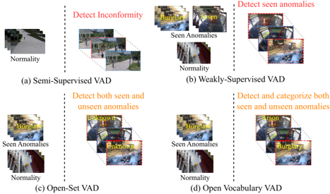
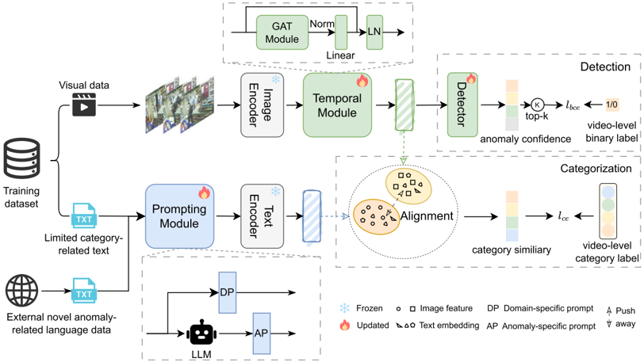
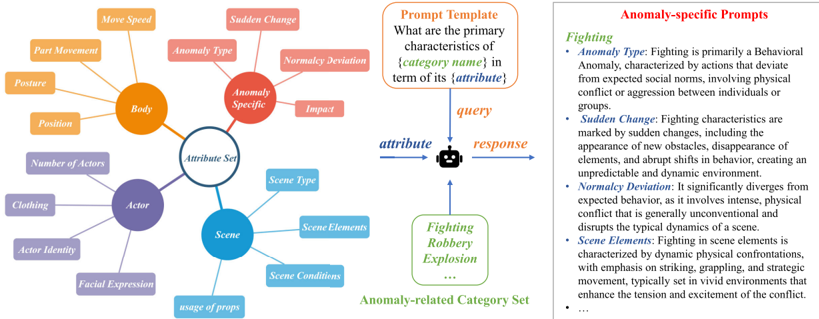
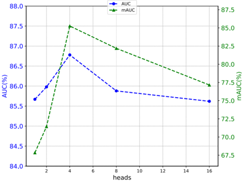
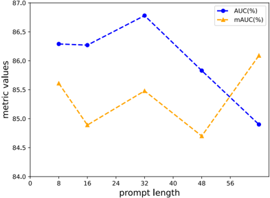
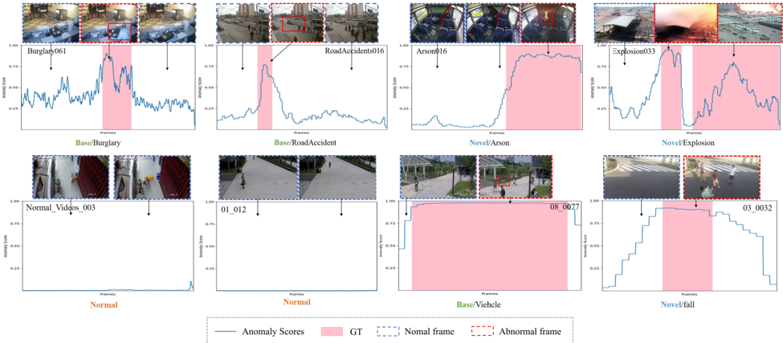
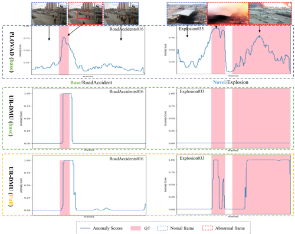
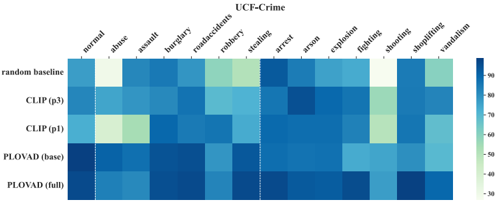
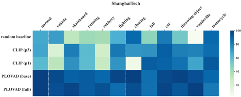

## PLOVAD: Prompting Vision-Language Models for Open Vocabulary Video Anomaly Detection

Chenting Xu , Ke Xu , Member, IEEE, Xinghao Jiang , Senior Member, IEEE , and Tanfeng Sun , Senior Member, IEEE

Abstract— Video anomaly detection (VAD) confronts significant challenges arising from data scarcity in real-world open scenarios, encompassing sparse annotations, labeling costs, and limitations on closed-set class definitions, particularly when scene diversity surpasses available training data. Although current weakly-supervised VAD methods offer partial alleviation, their inherent confinement to closed-set paradigms renders them inadequate in open-world contexts. Therefore, this paper explores open vocabulary video anomaly detection (OVVAD), leveraging abundant vision-related language data to detect and categorize both seen and unseen anomalies. To this end, we propose a robust framework, PLOVAD, designed to prompt tuning large-scale pretrained image-based vision-language models (I-VLMs) for the OVVAD task. PLOVAD consists of two main modules: the Prompting Module, featuring a learnable prompt to capture domain-specific knowledge and an anomaly-specific prompt crafted by a large language model (LLM) to capture semantic nuances and enhance generalization; and the Temporal Module, which integrates temporal information using graph attention network (GAT) stacking atop frame-wise visual features to address the transition from static images to videos. Extensive experiments on four benchmarks demonstrate the superior detection and categorization performance of our approach in the OVVAD task without bringing excessive parameters.

Index Terms— Anomaly detection, open vocabulary learning, weakly-supervised, prompt tuning.

## I. INTRODUCTION

V IDEO anomaly detection (VAD) plays a pivotal role in various domains including intelligent video surveillance, industrial monitoring, and healthcare. Its primary aim is to detect irregularities within video streams [1], thereby enhancing accident prevention, recognizing security threats, and preserving system integrity. Over recent years, VAD has experienced significant advancements, with numerous scholarly contributions continually enriching its methodologies and applications [2]. To address the scarcity of labeled data, traditional VAD methods can be broadly classified into two categories: semi-supervised VAD [3] and weakly-supervised

Received 10 July 2024; revised 16 October 2024, 10 November 2024, and 11 December 2024; accepted 7 January 2025. Date of publication 10 January 2025; date of current version 6 June 2025. This work was supported by the National Natural Science Foundation of China under Grant 62372295 and Grant 62272299. This article was recommended by Associate Editor G. Jeon. (Corresponding author: Ke Xu.)

The authors are with the National Engineering Laboratory on Information Content Analysis Techniques, School of Electronic Information and Electrical Engineering, Shanghai Jiao Tong University, Shanghai 200240, China (e-mail: xuchenting@sjtu.edu.cn; l13025816@sjtu.edu.cn; xhjiang@ sjtu.edu.cn; tfsun@sjtu.edu.cn).

Digital Object Identifier 10.1109/TCSVT.2025.3528108

VAD [4]. In the case of semi-supervised VAD [3] , [5] , [6] , [7] , [8] , [9] , [10] , [11] , [12] , [13] , [14] , [15], models are developed by learning the patterns of normal samples and identifying outlier samples as abnormal using solely normal training data. However, it is impossible to gather all normal samples within a dataset, thereby limiting these methods to primarily detecting low-level features such as disparities in appearance and speed. As a result, semi-supervised VAD methods often exhibit a high false alarm rate for normal events that have not been previously observed. To address the incorrect recognition of video anomalies, some researchers propose weakly-supervised methods that incorporate anomalous data and use only video-level labels for training, thereby reducing the cost of manual labeling. While weakly-supervised VAD methods [1] , [4] , [16] , [17] , [18] , [19] , [20] , [21] , [22] , [23] , [24] , [25] , [26] , [27] , [28] has shown notable performance by partially alleviating data labeling challenges and maintaining balanced detection capabilities, it inherently operates within closed-set environments. The constrained class definitions restrict their utility in openworld scenarios, where the spectrum of real-world anomaly types or concepts surpasses the coverage of the available training dataset.

Recent advancements in vision-language pre-training have led to the development of open vocabulary learning, which seeks to recognize categories beyond annotated label spaces by utilizing vision-related language data as auxiliary supervision [31]. The motivations to incorporate language data as auxiliary supervision are: 1) Language data necessitates less labeling effort, rendering it more cost-effective, with vision-related language being readily accessible. 2) Language data provides a broader vocabulary, enhancing scalability and generalizability. Open vocabulary settings are therefore more general, practical, and effective than weakly supervised settings (see Fig. 1 for a comparison of different VAD tasks). Additionally, image-based vision-language models (I-VLMs), exemplified by CLIP [32] and ALIGN [33], pre-train themselves on large-scale image-text pairs, demonstrate remarkable zero-shot performance on various vision tasks [34]. These models align images and language vocabularies within the same feature space, fulfilling the gap between visual and language data. Given the scarcity of VAD-related datasets and the extensive range of potential anomaly categories beyond the training sets currently accessible, language data presents itself as a more widely available and less costly alternative to video data. Wu et al. [30] first explored VAD in an open-vocabulary

1051-8215 © 2025 IEEE. All rights reserved, including rights for text and data mining, and training of artificial intelligence and similar technologies. Personal use is permitted, but republication/redistribution requires IEEE permission.

See https://www.ieee.org/publications/rights/index.html for more information.

Fig. 1. Comparison of different VAD tasks. Left side of the dashed line is in the training phase, and the right side is in the inference phase. (a) Semi-Supervised methods [3] identify outlier samples as abnormal using solely normal training data. (b) in the Weakly-Supervised settings [4], the model requires only video-level annotations, utilizes both normal and abnormal data while training, detecting seen anomalies in the closed-set. (c) in the open-set settings [29], the model only needs to detect unseen anomalies and mark them as "unknown". (d) in the open vocabulary settings [30], the model trained with seen anomalies can detect and categorize both seen and unseen anomalies.

setting, inspiring our work. However, their approach relies solely on a pre-trained CLIP model [32], without discussing I-VLMs for a more general framework, and requires additional fine-tuning with pseudo-anomaly video samples generated by large generative models. Consequently, this paper aims to investigate the open vocabulary video anomaly detection (OVVAD) problem and work on the detection and categorization of unseen anomaly classes by harnessing the capabilities of I-VLMs and scalable textual data.

Therefore, a question is posed: how can we best exploit the ability in the powerful I-VLMs, and effectively adapt them to solve the OVVAD task? Inspired by existing works on the adaptation of VLMs to downstream tasks [35] , [36] , [37], our focus is shifted to prompt tuning [38]. To this end, we propose a framework, named PLOVAD, to effectively leverage prompt tuning to mine the generalized knowledge from I-VLMs for OVVAD. Following previous works [30] , [39], the OVVAD task is deconstructed into two sub-tasks: detection and categorization. A learnable prompt, designed to encapsulate domain-specific knowledge, is proposed. This prompt is optimized during training, enabling a single instance of the visual backbone to effectively execute the detection sub-task within the specified domain dataset with minimal training parameters. To bridge the gap between image and video data, we further incorporate temporal information by appending a Temporal Module on top of frame-wise visual representation in the detection sub-task. Additionally, to enhance the generalization of the categorization sub-task, an anomalyspecific prompt crafted by a Large Language Model (LLM) with strong knowledge retention capabilities is employed. Our model effectively handles challenges in open vocabulary scenarios while efficiently conserving data resources. In summary, the main contributions of this paper are as follows:

- To address the challenges presented by data scarcity in real-world open scenarios, this study investigates the VAD
- problem within an open vocabulary setting. Scalable and cost-effective vision-related language data are utilized to enhance the proposed approach, thereby facilitating efficient detection and recognition of previously unseen anomalies while optimizing data utilization.
- We propose PLOVAD, a prompt tuning-based method designed to adapt large-scale pretrained I-VLMs for the OVVAD task. This approach enables the detection and categorization of both seen and previously unseen anomalies.
- A Prompting Module is devised to acquire both domain-specific and anomaly-specific knowledge tailored to the OVVAD task. Additionally, a GAT-based Temporal Module is designed to effectively integrate temporal information and address the transition from static images to video sequences.
- Extensive experiments on four challenging benchmark datasets: UCF-Crime, ShanghaiTech, XD-Violence and UBnormal, confirm that the proposed method excels in the OVVAD task, achieving superior detection and categorization performance without introducing excessive parameters.

## II. RELATED WORK

## A. Video Anomaly Detection

Weakly-supervised VAD [1] , [4] , [16] , [17] , [18] , [19] , [20] , [21] , [22] , [23] , [24] , [25] , [26] , [27] , [28] requires only videolevel annotations, substantially reducing the need for manual annotation and associated costs. Tian et al. [1] integrated self-attention blocks and pyramid dilated convolution layers to capture multi-scale temporal relations. Zhou et al. [19] incorporated dual memory units to simultaneously learn representations of normal and abnormal data, effectively regulating uncertainty. Fan et al. [24] introduced a snippet-level attention mechanism and proposed a multi-branch supervision module to more effectively explore the abnormal segments within the entire video. While many of the weakly-supervised approaches utilized video inputs encoded by pre-trained models such as C3D [40], I3D [41], a few works [20] , [21] , [26] incorporated CLIP [32]. Despite achieving commendable performance, these approaches primarily exploited CLIP's potent visual representation capability while overlooking its zero-shot capability. Although weakly-supervised VAD has exhibited impressive performance and effectively mitigates data labeling challenges, it inherently operates within closedset frameworks.

VAD inherently possesses an open-world requirement. Traditional weakly-supervised methods, while effective in detecting known anomalies, may falter when confronted with unseen anomalies. Zhu et al. [29] proposed an approach that integrates evidential deep learning (EDL) and normalizing flows (NFs) within a multiple instance learning (MIL) framework to address open-set VAD challenges. However, this method is not explicitly designed to identify specific anomaly types, which could offer more informative and actionable insights.

## B. Open Vocabulary Learning

Open vocabulary learning aims to recognize categories beyond annotated label spaces by leveraging vision-related language vocabulary data [31]. Many open vocabulary methods [35] , [42] , [43] effectively blur the distinction between closed-set and open-set scenarios through alignment learned in I-VLMs, making them highly suitable for practical applications. While it has been extensively applied to diverse downstream tasks, including video understanding [35] , [42] , [43] , [44], object detection [45], and semantic segmentation [46], its application in VAD remains relatively understudied. Wu et al. [30] explore VAD in the open vocabulary settings, but its categorization performance after additional fine-tuning with generated pseudo-anomaly video samples remains suboptimal. While open vocabulary VAD shares certain similarities with open vocabulary video understanding, it presents unique challenges, including a broader range of anomalies, limitations stemming from restricted datasets, and specific scenarios.

Open vocabulary action recognition [35] , [42] , [44] , [47] , [48] , [49] , [50] aims to classify unseen actions and is closely related to open vocabulary VAD. ActionCLIP [47] introduces the new perspective by emphasizing the semantic information of label texts instead of simply mapping into numerical values. Ju et al. [35] employ continuous vectors to prompt tuning pre-trained I-VLMs, bridging the domain gap from images to videos, while Rasheed et al. [42] introduce a video fine-tuned CLIP baseline. While anomalous actions constitute a subset of anomalies in VAD, the broader definition of anomalies is context-dependent.

## C. Prompt Tuning

Prompt tuning [38] is a strategy initially developed in the realm of NLP to tailor pre-trained language models (PLMs) [51] for specific downstream tasks. With meticulously designed prompt templates, PLMs exhibit robust few-shot or zero-shot generalization capabilities. Nonetheless, the creation of such templates necessitates substantial expertise, thereby restricting their adaptability. Recent research has expanded the scope of prompt tuning to encompass computer vision applications [35] , [45] , [46]. For example, CoOp [36] integrates learnable vectors by preappending category words, enabling the adaptation of CLIP to various recognition tasks. In this study, we explore prompt tuning techniques to address the OVVAD task.

## III. PRELIMINARY

## A. Image-Based Vision-Language Model

I-VLMs are typically pretrained using a large-scale corpus of image-text pairs. In this study, we leverage CLIP [32] as a foundational example for our research, with the understanding that the same techniques explored should be applicable to other I-VLMs as well. During the pretraining phase, each batch consists of image-text pairs. The image encoder f (.) and text encoder g(.) compute feature embeddings individually for images and texts. A cosine similarity matrix is then computed for all pairs. The training objective is to jointly optimize the image and text encoders by maximizing the similarity between correct pairs of associations and minimizing the similarity between incorrect pairs. During inference, CLIP classifies images in a zero-shot manner based on the similarity between image features f (x) and text features g(t). The text t is manually produced by filling class names into a predefined template, such as, "a photo of a [CLASS]". Finally, given an image x and text t, CLIP output prediction results for the given classes by:

<!-- formula-not-decoded -->

where ⊗ is cosine similarity. The sensitivity of I-VLMs to handcrafted prompt templates presents clear limitations on their efficient adaptation for novel downstream tasks, particularly in scenarios where expert knowledge may be challenging to condense or unavailable. Therefore, we consider automating such prompt design procedures, exploring efficient approaches to adapt the pre-trained I-VLMs for OVVAD tasks with minimal training requirements.

## B. Weakly-Supervised Video Anomaly Detection

Consider a set of weakly-labeled training videos V 
V = {vi , yi} |V| i=1 , where each video vi comprises a sequence of ni frames, and yi = {0 , 1} is the video-level label of video vi . If none of the frames in vi contain abnormal events, vi is defined as normal and yi = 0; otherwise, if at least one frame contains abnormal events, vi is defined as abnormal and yi = 1. The objective of the weakly-supervised video anomaly detection (WSVAD) task is to develop a detection model capable of predicting frame-level anomaly confidences using only video-level annotations.

In this paper, the Open Vocabulary Video Anomaly Detection (OVVAD) problem is explored under weak supervision, with weakly labeled datasets utilized.

## C. Open Vocabulary Video Anomaly Detection

Given a video dataset denoted as V = {vi ∈ R T×H×W×3 } N i=1 , the objective of open vocabulary video anomaly detection (OVVAD) is to develop a unified model 8OV capable of detecting and categorizing both base(seen) and novel(unseen) anomalies. Specifically, the model aims to predict the anomaly confidence for each frame and discern the video-level anomaly category for videos in which anomalies are detected. These categories are represented as textual descriptions T .

<!-- formula-not-decoded -->

During the training phase, the model is trained on pairs of (video, category label) belonging to the normal category C n , and the base (seen) anomaly categories C a base , denoted as {

V train , Y train 
∼ {C n , C a base }}. Conversely, during the testing phase, the model is evaluated on videos belonging to the normal category as well as both the base (seen) and novel (unseen) anomaly categories, represented as {

V test , Y test 
∼ {C n , C a base, C a novel }}. It is important to emphasize that C a base

Fig. 2. Overview of the proposed framework (PLOVAD). PLOVAD comprises two primary modules: the Temporal Module and the Prompting Module, catering to two sub-tasks: the detection sub-task and the categorization sub-task. The Temporal Module integrates temporal information using GAT stacking atop frame-wise visual features to address the transition from static images to videos. The Prompting Module is employed to formulate a domain-specific prompt (DP) to capture domain-specific knowledge and an anomaly-specific prompt (AP) crafted by a LLM to capture semantic nuances and enhance generalization.

and C a novel are mutually exclusive and together comprise the entire anomaly category set C a , where C a base ∪ C a novel = C a , C a base ∩ C a novel = ∅ .

## IV. METHODOLOGY

In this paper, we propose a framework, PLOVAD, designed to prompt tuning large-scale pretrained I-VLMs for the OVVAD task. The formulation of the OVVAD problem and the I-VLM is presented in Section III. In the subsequent sections, an overview of the framework will first be provided, followed by a detailed description of each module and process.

## A. Overall Framework

As illustrated in Fig. 2, PLOVAD comprises two primary modules: the Temporal Module and the Prompting Module, catering to two sub-tasks: the detection sub-task and the categorization sub-task. Our methodology leverages both visual and textual data extracted from the training dataset. Initially, we segment the videos (visual data) into frame snippets, which are subsequently processed through the image encoder of I-VLM to derive feature representations. Following this, these visual features are subjected to temporal modeling via the Temporal Module–an imperative step aimed at adapting the I-VLMs. The resultant features are then processed by a detector to generate frame-level anomaly confidence scores, primarily addressing the detection sub-task. Concurrently, the Prompting Module is employed to formulate language prompts designed to encapsulate domain-specific and anomaly-related knowledge. Corresponding text embeddings are then extracted after being fed into the text encoder of I-VLM. Notably, we augment our semantic space by utilizing additional readily available language data, not limited to the training dataset, to conceptualize novel (unseen) anomalies within an open vocabulary setting. The enriched text embeddings and the feature representations obtained from the Temporal Module are aligned within the same feature space through the cross-modal alignment mechanism. Subsequently, category similarities are computed to facilitate the categorization sub-task.

## B. Prompting Module

The objective is to guide the pretrained I-VLM to undertake the OVVAD task with minimal training, effectively detecting and recognizing both base(seen) and novel(unseen) anomalies. In this module, we develop two prompts: a domain-specific learnable prompt (DP) and an anomaly-specific prompt (AP) improve the generalization of the categorization sub-task. Both class labels of given training dataset and potential novel categories of anomalies are fed into the Module to generate prompts.

1) Domain-Specific Learnable Prompt: During training, both the image and text encoder of I-VLM are kept frozen, while the gradients flow solely through the text encoder to update the learnable prompt vectors. These learnable vectors ultimately construct domain-specific prompt templates, comprehensible to the text encoder, and generate desired query embeddings. Inspired by prior work [35] , [36] in the vision understanding field, we construct DP via feeding the tokenized category related text into the pretrained text encoder g(.) .

<!-- formula-not-decoded -->

where Tc Tc = {ti} |C| i=1 , with ti representing the text associated with the category ci (i.e.,"fighting"), preferring simplicity by using only the category name. 8token denotes the tokenizer of the I-VLM, and Ed ∈ R
|C|× F represents the corresponding

Fig. 3. Illustration of Anomaly-specific Prompt(AP) generation workflow. On the left, the process of defining the attribute set is visualized. The middle section depicts the querying process with LLMs, transforming anomaly-related categories and attributes into APs. On the right, we present sample snippets of the prompts generated.

generated text embedding. ek ∈ R D signifies the k-th prompt vector that learns domain information and is updated during training, with D as its vector dimension. ek is shared for all anomaly categories and is specific to the current task.

2) Anomaly-Specific Prompt: Obtaining expert annotations is both cost-prohibitive and labor-intensive, and it is also susceptible to individual biases, resulting in inconsistent outcomes. Therefore, we leverage the capabilities of LLMs, known for their extensive knowledge and versatility, to construct APs containing distinctive features for identifying specific anomaly categories. Inspired by prior LLM-prompting research [52] , [53], we construct anomalyspecific prompts.

The illustration of the generation workflow is shown in Fig. 3. Initially, the components of an anomaly are categorized into four fundamental aspects: Anomaly Specific Attributes , Scene , Actor and Body, and four most representive attributes are selected for each aspect, resulting in a set of 16 core attributes. For those anomalies that do not pertain to behavioral anomaly, which involve appearance changes in the environment or the sudden appearance of objects, the 8 core attributes from the two former aspects are considered. Building on the defined attributes, LLMs are employed to generate knowledge-rich descriptive sentences for each anomaly category, serving as the foundation for APs. Specifically, an LLM prompt template is devised: What are the primary characteristics of {category name} in term of its {attribute} . Subsequently, for each anomaly-related category, the template is populated with the category name and attributes, and then the LLM is queried to generate a suite of 16 (or 8) distinct anomaly-sepcific prompts.

Furthermore, for each anomaly-related category, we derive text embeddings from its distinct set of APs utilizing the frozen text encoder of I-VLM, and the average of these embeddings is then computed to serve as the final text embedding.

<!-- formula-not-decoded -->

where Ta Tai denotes the set of APs belonging to anomaly-related category ci. The extracted text embeddings for all anomaly-related categories are denoted as E a = {E ai } |C| i=1 .

## C. Temporal Module

Temporal Module is designed to capture the temporal dependencies on top of frame-wise visual representation extracted by the frozen image encode. This module serves as a critical intermediary step in adapting the I-VLM to videorelated tasks, bridging the gap between image and video data. We design Temporal Module building upon graph attention network(GAT) [54]. GAT incorporates masked self-attentional layers to overcome the limitations of prior graph modeling approaches that rely solely on graph convolution, which have been demonstrated to be more effective in addressing challenges in Anomalous Node Detection [55]. Mathematically, the formulation can be expressed as follows:

<!-- formula-not-decoded -->

X is the visual features inputted. Norm(.) denotes the normalization function, which in this paper is a combination of power normalization [56] and L2 normalization. Following the capture of temporal information via the GAT Module 8G AT (.), the resulting output is normalized. Then a linear layer fl(.) is applied, followed by residual connection and layer normalization L N, yielding the context feature X g .

1) GAT Module: The specifics of our GAT Module are delineated as follows. Firstly, to capture long-range dependencies based on the positional distance between each two frames, the distance adjacency matrix A is computed as:

<!-- formula-not-decoded -->

where the proximity relation between ith and jth frames is only determined by their relative temporal position. A closer temporal distance between two frames corresponds to a higher proximity relation score. α and β are hyperparameters to control the temporal distance. Additionally, we employ a masking strategy on A to constrain attention to frames exhibiting large

feature magnitudes:

<!-- formula-not-decoded -->

r is a hyperparameter to control the mask rate. Given the adjacency matrix A ′ , we input X = { ⃗x1 , x ⃗ 2 , . . . , x ⃗ n } into the GATConv layer to aggregate pertinent information from concerned neighbors (according to A ′ ) for x⃗ ⃗ i . Here, x ⃗ ⃗i ∈ R 1×d represents ith eigenvector and the output is denoted
⃗⃗⃗ as X o = { ⃗ x ′ 1
, ⃗ x ′ 2
, . . . , ⃗ x ′ n } , g
⃗ x ′ i ∈ R F . To ensure generalizability, only a single GATConv layer is utilized. The GATConv layer [54] leverages multi-head attention, detailed formulation is as follows:

<!-- formula-not-decoded -->

<!-- formula-not-decoded -->

Here, x ⃗ i undergoes a shared linear transformation via a weight vector W and engages the self-attention mechanism at x⃗ ⃗ j based on a shared self-attention function a, which is a single-layer feedforward neural network parameterized by weight vectors. The attention coefficient ai j is computed after normalization using softmax. Subsequently, x⃗
⃗ ⃗ i is updated to ⃗ x ′ i through a linear combination of neighboring node features followed by a nonlinear function activation function σ
⃗ . We employ a K-heads attention mechanism to calculate ⃗ x ′ i by:

<!-- formula-not-decoded -->

## D. Objective Function

In the detection pipeline, following prior weakly-supervised VAD works [1] , [19], the Top-K mechanism are employed to implement the MIL-based training. Specifically, the video-level prediction piis determined by averaging the top-k anomaly scores of the snippets in vi. By default, we set k = ⌊n//16 + 1⌋ for abnormal videos and k = 1 for normal videos, where n denotes the length of processed snippets used for batch training. The binary cross entropy loss lbce is then computed between video-level predictions and binary labels.

<!-- formula-not-decoded -->

Here, N is the number of videos, yiis the binary label for the vi .

In the categorization pipeline, cross-modal alignment serves as a pivotal component. Leveraging video features X g extracted from the Temporal Module and text embeddings E = {Ed , E a } from the Prompting Module, we conduct crossmodal alignment to ascertain the similarity logits S between snippets of each video vi and enriched categories.

<!-- formula-not-decoded -->

where f (.) is the image encoder of the I-VLM. To facilitate video-level categorization within weakly-supervised settings, we compute the mean value of the top-k similarity logits of snippets from vi as the video-level category similarity logits, with k consistent with the detection pipeline. The video-level similarity logits denoted as S v . Subsequently, a cross-entropy loss function is employed to determine the video-level categorization loss l ce.

<!-- formula-not-decoded -->

Here,Yi j is the ground truth label for vi and category c j , S v i j is the video-level similary logit for vi and c j , N is the number of videos, and |C| is the number of categories.

During training, the total loss function is defined as:

<!-- formula-not-decoded -->

Here, the coefficient λ is utilized to modulate the alignment loss. By optimizing this objective function, our model effectively captures nuanced anomaly semantics, enhancing its performance in both detection and categorization.

## E. Inference

For detection tasks, frame-wise anomaly scores are computed based on the input videos. A threshold τ can be set to activate alarms according to predefined sensitivity levels. For categorization task, our model computes video-level similarity logits across a provided category list via alignment. Specifically, we align the extracted visual features of input videos X g with the text embeddings Ed from the trained DP, and E a from predefined AP, to derive two distinct similarity logits. The highest logits corresponding to each category is retained. Subsequently, for each video, the category with the highest similarity logit across all provided categories is recognized as its most probable prediction category.

## V. EXPERIMENT

## A. Experiment Setup

Experiments are conducted on the UCF-Crime [4] , ShanghaiTech [57], XD-Violence [58], and UBnormal [59] datasets, with a primary focus on the open vocabulary setting under weak supervision, hereafter referred to simply as the open vocabulary setting for brevity.

1) Dataset: For the weakly-labeled datasets, video-level annotations are used for training, while frame-level annotations are employed for testing.

UCF-Crime [4] dataset comprises 1,900 surveillance videos with 13 real-world anomalies. In the weakly-supervised setting, it is divided into 1,610 training and 290 testing videos, utilizing video-level annotations for training and frame-level annotations for testing. In the open vocabulary setting, the 13 anomaly categories are further categorized into 6 base and 7 novel classes, with only the base classes included in the training set.

ShanghaiTech [57] dataset includes 437 videos from university campus surveillance cameras, depicting 130 abnormal events across 17 anomaly classes in 13 scenes. In the weaklysupervised setting, we follow the dataset configuration by Zhong et al. [16], with 238 training and 199 testing videos.

For the open vocabulary setting, we assigned names to 11 previously undefined classes in the original dataset based on text information from [39], splitting them into 5 base and 6 novel classes and restructuring the dataset accordingly.

XD-Violence [58] dataset is a weakly-supervised dataset consisting of 4,754 untrimmed videos across six anomaly categories, with 3,954 videos for training and 800 for testing. For the open vocabulary setting, the six anomaly categories are split into three base and three novel classes. To align with our model, which supports single-category identification, videos containing multiple categories are excluded.

UBnormal dataset [59] is a synthesized open-set benchmark comprising 543 videos across multiple virtual scenes. It defines seven types of normal events and 22 types of abnormal events. In its original structure, the anomalous event types in the test set differ from those in the training set. For the open vocabulary setting, we follow the original splits, classifying the 12 abnormal categories in the test set as novel classes and the remaining anomalies as base classes. As the UBnormal dataset lacks category labels, we manually annotate the anomaly videos to assess and report categorization performance.

For the OVVAD task, abnormal categories are systematically divided into two distinct groups: base categories and novel categories. During the training phase, only samples belonging to the base categories are utilized. Consistent with prevailing methodologies in open vocabulary learning, base categories predominantly comprise frequent and commonly occurring classes, while novel categories encompass the less frequent or rare classes. For the UCF-Crime dataset, the following categories are designated as base categories: abuse, assault, burglary, road accident, robbery, and stealing . Conversely, the remaining categories: arrest, arson, fighting, explosion, shooting, shoplifting, vandalism are categorized as novel categories, aligning with the approach delineated by Wu et al. [30]. For the ShanghaiTech dataset, categorization is based on the order of sample counts within the dataset. Specifically, the base categories include vehicle, skateboard, running, robbery, and fighting. Conversely, the novel categories comprise chasing, fall, car, throwing object, vaudeville, and monocycle. For the XD-Violence dataset, fighting, shooting, and car accident are considered as base categories, while the remaining three are classified as novel categories. UBnormal is used for open-set VAD, with test anomalies classified as novel categories and training anomalies as base categories. Test anomalies include running, having a seizure, lying down, shuffling, walking drunk, people and car accident, car crash, jumping, fire, smoke, jaywalking, and driving outside the lane . 2) Evaluation Metrics: Both detection and categorization performance are evaluated.

For detection, following previous works [1] , [4], the frame-level area under the ROC curve(AUC) is adopted as the evaluation metric for UCF-Crime, ShanghaiTech and UBnormal. A higher AUC indicates superior detection performance. For XD-Violence, we utilize AUC of the frame-level precision-recall curve (AP), following [58] .

For categorization, the Multi-class AUC for individual classes is computed, and their macro mean, termed mAUC, is derived as the evaluation metric. Multi-class AUC [60] is computed using the one-vs-rest approach, treating each class in turn as positive and others as negative.

<!-- formula-not-decoded -->

where K is the number of classes, AUCk is AUC for class k, considering class k as positive and others as negative. Additionally, Top-1 accuracy and Top-5 accuracy are utilized for the evaluation of categorization performance, in accordance with the standard evaluation protocol for video action classification [41] .

3) Implementation Details: In this study, CLIP [32] is leveraged as the foundational model, with the understanding that the techniques explored are applicable to other I-VLMs as well. The frozen image encoder and text encoder stem from pre-trained CLIP(ViT-B/16) model. The detector comprises two Conv1d layers and GeLU. Following [21], videos are segmented into 32 non-overlapping snippets, each with a length of 16 frames, and the middle frames are sampled. To accommodate the diverse durations of the videos, they are uniformly partitioned into T segments at equal intervals during training, as described in [16] . T is set to 200 for UCF-Crime, 120 for ShanghaiTech and 200 for XD-Violence. For the UBnormal dataset, each video is quite short and of approximately uniform length. We extract all frames and set T = 450. As for inference, all non-overlapping segments are employed. By default, we set α = 0 . 6 and β = 0 . 2 in Eq. 6. We set mask rate r in Eq. 7 to 0.9 for ShanghaiTech, UBnormal and XD-Violence, and to 0.55 for UCF-Crime. The GATConv layer employs a 4-heads attention. The prompt length of the learnable DP is 32. The hyperparameter λ in Eq. 14 defaults to 1. Training is conducted end-to-end using the Adam optimizer [61] with a batch size of 128. For the ShanghaiTech dataset, the learning rate is set to 5 × 10 − 4 , with a total of 60 epochs. For UCF-Crime, the learning rate is set to 1 × 10 − 3 with 50 epochs. Conversely, the learning rate for XD-Violence is set to 7 × 10 − 4 , with 50 total epochs, and 1 × 10 − 3 for UBnormal, with a total of 200 epochs. The experiments are conducted on a single RTX 3090 GPU.

## B. Comparison With the State-of-the-Art

Table I to Table VI present comparative results on detection and categorization performance against existing methods on four public benchmarks. Given that prior methods are tailored for closed-set VAD, our primary emphasis lies on open vocabulary setting comparisons.

For comparisons in the open vocabulary setting, several baselines are employed. CLIP: We employ a softmax function on the cosine similarities of the input frame feature with vectors aligned to the embedding of the textual prompt "a video from a CCTV camera of a {class}" using pretrained CLIP. For the binary detection task, any prediction associated with an anomaly class is considered abnormal. Random Baseline: This replicates our model's implementation but uses randomly initialized parameters. Specifically, the input tensor is populated using a Xavier uniform distribution [62] . We conducted five trials using different random seeds, with

TABLE I DETECTION PERFORMANCE COMPARISONS(AUC(%)) UNDER DIFFERENT SETTINGS ON UCF-CRIME AND SHANGHAITECH . † MEANS THE METHOD IS RE-IMPLEMENTED WITH CLIP FEATURE

|    |    |    |    |    |
|----|----|----|----|----|
|    |    |    |    |    |
|    |    |    |    |    |
|    |    |    |    |    |
|    |    |    |    |    |
|    |    |    |    |    |
|    |    |    |    |    |
|    |    |    |    |    |
|    |    |    |    |    |
|    |    |    |    |    |
|    |    |    |    |    |
|    |    |    |    |    |
|    |    |    |    |    |

the average performance across these trials reported as the final result. Methods with † are re-implemented with the CLIP features for fair comparison.

1) Comparison on Detection Performance: As shown in Table I, it is evident that existing methods exhibit superior performance in the weakly-supervised setting compared to the open vocabulary setting trained without the inclusion of novel anomaly samples, which underscore the significant challenges posed by open vocabulary settings in detection. Nevertheless, our model, trained exclusively on base samples in the open vocabulary setting, shows only a modest performance loss and outperforms most methods in the weakly-supervised setting, suggesting some generalizability of our approach.

As shown in Table I and Table II, our proposed approach exhibits notable advantages over state-of-the-art methods for both UCF-Crime and ShanghaiTech. It demonstrates robust capabilities in detecting both base and novel samples while being trained solely on base samples. Specifically, our method excels in the open vocabulary setting, rivaling top-performing models trained on the entire dataset. For example, our approach surpasses the leading weakly-supervised model, UR-DMU [19], by a margin of 1.97% in terms of AUC on the UCF-Crime dataset. Besides, our method demonstrates an improvement of 0.38% AUC comparing with Wu et al. [30] on the UCF-Crime dataset, with the harmonic mean of AUC on both base and novel samples being 0.28% higher. Furthermore, as shown in Table II, our proposed method demonstrates superior performance compared to RTFM [1] and UR-DMU [19]. Specifically, it achieves an improvement of 2.68% and 3.18% in AUC on the UCF-Crime dataset, and 0.35% and 0.21% on the ShanghaiTech dataset for novel samples, as evaluated using feature representations derived from CLIP. As shown in Table III, compared to the leading weakly-supervised model UR-DMU [19] on the XD-Violence dataset, our proposed method achieves a 9.53% improvement in APn Pn (AP for novel samples), with only a minor performance reduction on base samples. Overall, our method demonstrates improvements of 4.48% and 4.23% in HM (the harmonic mean of APb and APn Pn ), respectively, compared to Wu et al. [30] and UR-DMU [19] on the XD-Violence dataset. As shown in Table IV, our method achieves improvements of 1.50% and 1.41% in AUC compared to UR-DMU [19] and Wu et al. [30] on the UBnormal dataset. These results demonstrate the robust detection performance of our approach across all four public benchmarks.

2) Comparison on Categorization Performance: Given the limited prior research on the categorization problem within OVVAD, we contrast our model's categorization performance with two baseline methods across four benchmarks, as detailed in Table V and Table VI. As the UBnormal dataset includes only novel categories in its test set, we report the AUC for the entire test set. Our approach demonstrates marked improvement over the baselines across all three metrics, encompassing both base and novel categories. For instance, our method trained on base categories surpasses the zero-shot CLIP baseline by 6.21% on UCF-Crime, by 25.77% on ShanghaiTech and by 4.61% on XD-Violence as measured by mAUC on the test set, which includes both base and novel samples (denoted as "All"). Additionally, on UBnormal, our method surpasses the zero-shot CLIP baseline by 11.72% in mAUC on the test set. Furthermore, our method demonstrates significant improvements over the zero-shot CLIP baseline in both Top-1 and Top-5 Accuracy across base and novel categories in these datasets.

TABLE II

DETECTION PERFORMANCE COMPARISONS IN THE OPEN VOCABULARY SETTING UNDER WEAKLY-SUPERVISED ON UCF-CRIME AND SHANGHAITECH . ALL THESE METHODS USE CLIP FEATURE FOR FAIRNESS . AUCb(%) IS EVALUATED ONLY ON THE BASE SAMPLES AND AUC n (%) IS EVALUATED ONLY ON THE NOVEL SAMPLES . H M IS THE HARMONIC MEAN OF AUCb AND AUC n

|    |    |    |    |    |    |    |    |    |
|----|----|----|----|----|----|----|----|----|
|    |    |    |    |    |    |    |    |    |
|    |    |    |    |    |    |    |    |    |
|    |    |    |    |    |    |    |    |    |
|    |    |    |    |    |    |    |    |    |
|    |    |    |    |    |    |    |    |    |
|    |    |    |    |    |    |    |    |    |
|    |    |    |    |    |    |    |    |    |

TABLE III DETECTION PERFORMANCE COMPARISONS IN THE OPEN VOCABULARY SETTING ON XD-VIOLENCE . APb(%) IS EVALUATED ONLY ON THE BASE SAMPLES AND APn Pn (%) IS EVALUATED ONLY ON THE NOVEL SAMPLES . H M IS THE HARMONIC MEAN OF APb AND APn Pn

|    |    |    |    |    |
|----|----|----|----|----|
|    |    |    |    |    |
|    |    |    |    |    |
|    |    |    |    |    |
|    |    |    |    |    |
|    |    |    |    |    |
|    |    |    |    |    |

TABLE IV DETECTION PERFORMANCE COMPARISONS IN THE OPEN VOCABULARY SETTING ON UBNORMAL

|    |    |    |
|----|----|----|
|    |    |    |
|    |    |    |
|    |    |    |
|    |    |    |
|    |    |    |
|    |    |    |

## C. Ablation Studies

In this section, extensive ablation experiments are conducted to reveal the contributions of each component.

1) Contribution of the Temporal Module: As shown in Table VII, the integration of the Temporal Module results in a significant enhancement of detection performance across UCF-Crime and ShanghaiTech. Notably, it demonstrates marked improvement for novel anomaly categories without compromising generalization; for instance, an increase of 1.68% in AUC n on UCF-Crime and 6.36% on ShanghaiTech.

We further investigate the impact of the number of multi-heads in the GAT module within the Temporal Module. Fig. 4 indicates that performance peaks when utilizing four heads, after which it diminishes on UCF-Crime. Given the complexity of UCF-Crime, we suggest that a four-head attention mechanism effectively captures abundant temporal information. Accordingly, a four-head configuration is adopted for all datasets.

To evaluate the effectiveness of the GAT Module within the Temporal Module, we replaced it with a transformer, following the approach in [35]. As shown in Table VIII, our GAT Module

Fig. 4. Evaluation results of multiheads in the Temporal Module on UCF-Crime.

demonstrates superior generalization in the open vocabulary setting.

2) Contribution of the Prompting Module: In our experiment, the non-use of the Prompting Module (in Table VII) indicates that it does not participate in training (λ in Eq. 14 is set to 0). During inference, DP is randomly initialized and AP is utilized. As presented in Table VII, the integration of the Prompting Module markedly improves both the detection and categorization capabilities of our model. Specifically, the Prompting Module yields substantial gains in categorization performance, manifesting as increases of 12.95% in mAUC and 42.76% in top-5 accuracy for UCF-Crime, and 39.93% in mAUC and 83.75% in top-5 accuracy for ShanghaiTech, compared to our model that includes only the Temporal Module. The Prompting Module proves to be a foundational element in the categorization of both base and novel classes, as evaluated by three distinct metrics. Thus, we further investigate the influence of individual components within the Prompting Module on categorization performance. The module comprises two types of prompts: DP and AP. As depicted in Table IX , the combined use of DP and AP yields superior performance compared to their individual implementations.

Experiments were also conducted to evaluate the generation methods for DP and AP. Table X presents the categorization performance of CLIP using various manually crafted prompt templates, highlighting considerable variability in their efficacy. This underscores the importance of refining this process to achieve consistent and superior performance. In Table XI ,

TABLE V CATEGORIZATION PERFORMANCE COMPARISONS ON UCF-CRIME, SHANGHAITECH AND XD-VIOLENCE IN THE OPEN VOCABULARY SETTING

|    |    |    |    |    |    |    |    |    |    |    |
|----|----|----|----|----|----|----|----|----|----|----|
|    |    |    |    |    |    |    |    |    |    |    |
|    |    |    |    |    |    |    |    |    |    |    |
|    |    |    |    |    |    |    |    |    |    |    |
|    |    |    |    |    |    |    |    |    |    |    |
|    |    |    |    |    |    |    |    |    |    |    |
|    |    |    |    |    |    |    |    |    |    |    |
|    |    |    |    |    |    |    |    |    |    |    |
|    |    |    |    |    |    |    |    |    |    |    |
|    |    |    |    |    |    |    |    |    |    |    |
|    |    |    |    |    |    |    |    |    |    |    |

TABLE VI CATEGORIZATION PERFORMANCE COMPARISONS ON UBNORMAL IN THE OPEN VOCABULARY SETTING

Fig. 5. Evaluation results of prompt length of DP in the Prompting Module on UCF-Crime.

|    |    |    |    |
|----|----|----|----|
|    |    |    |    |
|    |    |    |    |
|    |    |    |    |

we replaced our learnable DP with the manually crafted template "p3" (identified as the top-performing template in Table X) and incorporated LLM-constructed anomaly-specific prompts with GPT-3.5. 1 Our method, which incorporates DP to focus on learning domain-specific knowledge, excels in both detection and categorization performance.

As illustrated in Fig. 5, the influence of prompt length of DP is examined. AUC improves with increasing length, peaking at 32 before gradually declining for UCF-Crime. Our model utilizes a prefix and postfix length of 16 when constructing DP. The optimal performance at a length of 32 suggests that this length provides a balanced and informative context for detection and categorization. However, extending beyond this length may introduce noise and complexity that outweigh the benefits of additional information, subsequently reducing detection performance.

In Table XII, we compare the performance of APs constructed using manually crafted prompts (p3 in Table X) and those generated by two distinct LLM models. The results

1 GPT-3.5 turbo: https://platform.openai.com/docs/models/gpt-3-5-turbo

demonstrate that our approach, constructed using LLMs, is both consistent and superior to manually crafted constructs. Moreover, the quality of LLM-generated prompts significantly influences categorization performance. Our model utilizes GLM-4, 2 which has excellent long-text capabilities, such as summarization, information extraction, complex reasoning, coding, and other application scenarios. As LLMs continue to evolve, an increasing number of improved options become available, enhancing the performance of this framework.

3) Analysis of the Execution Requirements: In order to evaluate the execution requirements, We conducted an experiment to compare the trainable parameters of our model with others. The trainable parameters of models remain constant regardless of the execution environment. Fewer trainable parameters lead to lower resource consumption and more efficient computation. In Table XIII, we present the number of trainable parameters and the detection performance under both the weakly-supervised and open vocabulary settings. The results using the CLIP feature are re-implemented for a fair comparison. It is observed that our open vocabulary model (PLOVAD), trained solely on the base set and benefiting from the prompt tuning paradigm, achieves significantly lower trainable parameters (4.044M) while demonstrating superior performance.

4) Analysis of Cross-Dataset Ability: To assess the generalization ability of the proposed method, we conduct experiments in a cross-dataset setup using UCF-Crime, XD-Violence, and UBnormal as examples. These datasets originate from distinct sources: UCF-Crime from surveillance videos, XD-Violence from movies and online videos, and UBnormal from synthesized virtual scenes with a wider range of abnormal events. As shown in Table XIV, our model exhibits only moderate performance loss in both detection and categorization when evaluated on models trained on other datasets (refer to each column), thereby validating the generalization capacity of our approach. Among the crossdataset results, UCF-Crime and XD-Violence demonstrate better mutual inference performance compared to UBnormal, possibly due to the overlap in their categories.

## D. Qualitative Results

To qualitatively validate the detection performance of the proposed method, as shown in Fig. 6, we visualize

2 GLM-4: https://open.bigmodel.cn/dev/howuse/glm4

TABLE VII ABLATIONS STUDIES WITH DIFFERENT DESIGNED MODULE ON UCF-CRIME AND SHANGHAITECH FOR DETECTION AND CATEGORIZATION

|    |    |    |    |    |    |    |    |    |    |    |    |    |    |    |
|----|----|----|----|----|----|----|----|----|----|----|----|----|----|----|
|    |    |    |    |    |    |    |    |    |    |    |    |    |    |    |
|    |    |    |    |    |    |    |    |    |    |    |    |    |    |    |
|    |    |    |    |    |    |    |    |    |    |    |    |    |    |    |
|    |    |    |    |    |    |    |    |    |    |    |    |    |    |    |
|    |    |    |    |    |    |    |    |    |    |    |    |    |    |    |
|    |    |    |    |    |    |    |    |    |    |    |    |    |    |    |
|    |    |    |    |    |    |    |    |    |    |    |    |    |    |    |
|    |    |    |    |    |    |    |    |    |    |    |    |    |    |    |

TABLE VIII ABLATION STUDY OF THE GAT MODULE: COMPARISON WITH TRANSFORMER REPLACEMENT

|    |    |    |
|----|----|----|
|    |    |    |
|    |    |    |
|    |    |    |

TABLE IX ABLATIONS STUDIES WITH DIFFERENT COMPONENTS IN PROMPTING MODULE ON UCF-CRIME FOR CATEGORIZATION

TABLE X CATEGORIZATION PERFORMANCE ON CLIP [32] WITH DIFFERENT MANUALLY CRAFTED PROMPT TEMPLATES

|    |    |    |    |    |    |    |    |    |    |
|----|----|----|----|----|----|----|----|----|----|
|    |    |    |    |    |    |    |    |    |    |
|    |    |    |    |    |    |    |    |    |    |
|    |    |    |    |    |    |    |    |    |    |
|    |    |    |    |    |    |    |    |    |    |

TABLE XI

|    |    |    |    |    |    |    |    |    |    |
|----|----|----|----|----|----|----|----|----|----|
|    |    |    |    |    |    |    |    |    |    |
|    |    |    |    |    |    |    |    |    |    |
|    |    |    |    |    |    |    |    |    |    |

ABLATION STUDY ON DP IN PROMPTING MODULE: COMPARING DETECTION AND CATEGORIZATION PERFORMANCE ON UCF-CRIME WHEN REPLACING DP WITH A FIXED PROMPT

|    |    |    |    |    |    |    |
|----|----|----|----|----|----|----|
|    |    |    |    |    |    |    |
|    |    |    |    |    |    |    |
|    |    |    |    |    |    |    |

TABLE XII ABLATION STUDY ON AP IN PROMPTING MODULE FOR CATEGORIZATION PERFORMANCE ON UCF-CRIME

|    |    |    |    |
|----|----|----|----|
|    |    |    |    |
|    |    |    |    |
|    |    |    |    |

the frame-level anomaly scores predicted by our model (PLOVAD) in the open vocabulary setting on the UCF-Crime and ShanghaiTech dataset. The top row and the first panel of the second row correspond to UCF-Crime, with the remaining panels representing ShanghaiTech. Our model trained with normal and base anomalies, consistently produces high

TABLE XIII ABLATION STUDY ON THE EXECUTION REQUIREMENTS ON THE UCF-CRIME DATASET

|    |    |    |    |    |
|----|----|----|----|----|
|    |    |    |    |    |
|    |    |    |    |    |
|    |    |    |    |    |
|    |    |    |    |    |
|    |    |    |    |    |

TABLE XIV CROSS-DATASET RESULTS (%) ON UCF-CRIME , XD-VIOLENCE , AND UBNORMAL

|    |    |    |    |    |    |    |
|----|----|----|----|----|----|----|
|    |    |    |    |    |    |    |
|    |    |    |    |    |    |    |
|    |    |    |    |    |    |    |
|    |    |    |    |    |    |    |

anomaly scores for anomalous frames on both base and novel anomalies, even when videos contain multiple disjointed abnormal segments (as shown in the sample of "Explosion"). Moreover, our model assigns low anomaly scores to normal videos, underscoring its ability to maintain a low false alarm rate.

Further, we compare our method with UR-DMU [19] , as shown in Fig. 7. The second row presents the results of UR-DMU when trained exclusively on base anomalies, while the third row shows results from training on the full set (including both base and novel anomalies). A comparison of these rows reveals that the well-performing weakly-supervised method struggles to effectively identify novel anomalies to a certain extent, as evidenced by the ineffective detection of videos belonging to the novel category "explosion" in Fig. 7 when trained without the corresponding visual data. Meanwhile, our model (as seen in the first row) demonstrates superior detection of novel anomalies without requiring training on the corresponding visual data, exhibiting enhanced performance in the open vocabulary setting compared to UR-DMU [19] .

We also present the qualitative results of the categorization performance. Fig. 8 and Fig. 9 present the heatmap of multi-class AUC values [60] for each class in the testing set of the UCF-Crime and ShanghaiTech datasets, respectively. The random baseline is our model initialized using the Xavier initialization method [62]. The second and third

Fig. 6. Qualitative results of the detection performance on UCF-Crime and ShanghaiTech. Pink region denotes ground-truth. "Base" denotes the kind of anomalies are seen when training, while the "Novel" are unseen.

Fig. 7. Qualitative results of the detection performance on UCF-Crime when compared with UR-DMU [19] method. Pink region denotes ground-truth. The left is the visualization result of a base sample, and the right is a novel sample. The first row represents our model (PLOVAD), which was trained exclusively on base anomalies. The second row represents UR-DMU trained under the same conditions as our model (PLOVAD). The third row depicts UR-DMU trained on the complete dataset, including both base and novel samples, where novel anomalies are included during training.

rows present the results of the CLIP baseline using the manually crafted prompts p3 and p1 (see Table X), respectively. "PLOVAD (full)" represents an additional experiment conducted to obtain a comprehensive analysis. This model is trained with both base and novel anomalies (denoted as "full"). In contrast, "PLOVAD (base)" refers to our proposed model, which is trained solely with base anomalies available in the open vocabulary setting. Our proposed method exhibits a pronounced advantage over the zero-shot CLIP baseline when applied to both UCF-Crime and ShanghaiTech datasets. Our method demonstrates proficiency in recognizing normal

Fig. 8. Qualitative results of categorization: visualization on the multi-class AUC values of each category on UCF-Crime. Cells shaded in darker blue indicate superior performance. The first column represents the normal samples, the 2nd to 7th columns correspond to the base anomalies, and the remaining columns pertain to the novel anomalies.

Fig. 9. Qualitative results of categorization: visualization on the multi-class AUC values of each category on ShanghaiTech. Cells shaded in darker blue indicate superior performance. The first column represents the normal samples, the 2nd to 6th columns correspond to the base anomalies, and the remaining columns pertain to the novel anomalies.

samples, along with the majority of base and novel categories. However, it encounters challenges with specific anomalies, such as "shooting" in the UCF-Crime dataset, which persists despite performance improvements for "fighting" when trained on the complete dataset. Additionally, identifying specific base anomalies like "abuse" and "assault" shows decreased performance with the inclusion of additional novel visual data, possibly due to increased visual noise. These observations

direct our attention towards refining visual representations in future investigations of the open vocabulary VAD task.

## VI. CONCLUSION

Video anomaly detection faces significant challenges in open vocabulary scenarios due to data scarcity and a broad spectrum of potential anomaly categories not represented in existing training sets. This study addresses these challenges by leveraging pretrained image-based vision-language models (I-VLMs) and scalable language data to detect and recognize previously unseen anomaly classes. We propose a framework named PLOVAD. which adapt pretrained I-VLMs for open vocabulary video anomaly detection (OVVAD) using a prompt tuning paradigm, transferring knowledge from known (base) classes to evaluate unseen (novel) classes. Additionally, we introduce a Temporal Module to bridge the image-video gap and a Prompting Module to generate domain-specific and anomaly-specific prompts. Extensive experiments on two public datasets demonstrate that the proposed model excels in the OVVAD tasks, achieving superior detection and categorization performance on both seen and unseen anomalies while training a limited number of free parameters. Our framework exhibits flexibility in the use of I-VLMs and LLMs. With the rapid advancement of vision-language pre-training and LLMs, increasingly powerful VLMs and LLMs are becoming available, thereby enhancing the potential of our framework.

In future work, we will explore the following directions:

- 1) During the experiment, it is observed that categorization performance on specific anomalies was ineffective and sometimes deteriorated when more visual data was introduced. This observation directs our attention toward refining visual representations in future investigations of the open vocabulary VAD task.
- 2) Investigating more complex scenarios in the open world, such as the occurrence of multiple types of anomalies within a single video, which presents a greater challenge.

## REFERENCES

- [1] Y. Tian, G. Pang, Y. Chen, R. Singh, J. W. Verjans, and G. Carneiro, "Weakly-supervised video anomaly detection with robust temporal feature magnitude learning," in Proc. IEEE/CVF Int. Conf. Comput. Vis. (ICCV), Oct. 2021, pp. 4975–4986.
- [2] P. Wu, C. Pan, Y. Yan, G. Pang, P. Wang, and Y. Zhang, "Deep learning for video anomaly detection: A review," 2024, arXiv:2409.05383 .
- [3] W. Liu, W. Luo, D. Lian, and S. Gao, "Future frame prediction for anomaly detection—A new baseline," in Proc. IEEE/CVF Conf. Comput. Vis. Pattern Recognit., Jun. 2018, pp. 6536–6545,
- [4] W. Sultani, C. Chen, and M. Shah, "Real-world anomaly detection in surveillance videos," in Proc. IEEE/CVF Conf. Comput. Vis. Pattern Recognit., Jun. 2018, pp. 6479–6488.
- [5] M. Hasan, J. Choi, J. Neumann, A. K. Roy-Chowdhury, and L. S. Davis, "Learning temporal regularity in video sequences," in Proc. IEEE Conf. Comput. Vis. Pattern Recognit. (CVPR), Jun. 2016, pp. 733–742.
- [6] J. Wang and A. Cherian, "GODS: Generalized one-class discriminative subspaces for anomaly detection," in Proc. IEEE/CVF Int. Conf. Comput. Vis. (ICCV), Oct. 2019, pp. 8200–8210.
- [7] M. Z. Zaheer, A. Mahmood, M. H. Khan, M. Segu, F. Yu, and S.-I. Lee, "Generative cooperative learning for unsupervised video anomaly detection," in Proc. IEEE/CVF Conf. Comput. Vis. Pattern Recognit. (CVPR) , Jun. 2022, pp. 14744–14754.
- [8] Z. Liu, Y. Nie, C. Long, Q. Zhang, and G. Li, "A hybrid video anomaly detection framework via memory-augmented flow reconstruction and flow-guided frame prediction," in Proc. IEEE/CVF Int. Conf. Comput. Vis. (ICCV), Oct. 2021, pp. 13588–13597.
- [9] J. T. Zhou, L. Zhang, Z. Fang, J. Du, X. Peng, and Y. Xiao, "Attentiondriven loss for anomaly detection in video surveillance," IEEE Trans. Circuits Syst. Video Technol., vol. 30, no. 12, pp. 4639–4647, Dec. 2020.
- [10] Y. Zhang, X. Nie, R. He, M. Chen, and Y. Yin, "Normality learning in multispace for video anomaly detection," IEEE Trans. Circuits Syst. Video Technol., vol. 31, no. 9, pp. 3694–3706, Sep. 2021.
- [11] Y. Lu, C. Cao, Y. Zhang, and Y. Zhang, "Learnable locality-sensitive hashing for video anomaly detection," IEEE Trans. Circuits Syst. Video Technol., vol. 33, no. 2, pp. 963–976, Feb. 2023.
- [12] S. Zhang et al., "Influence-aware attention networks for anomaly detection in surveillance videos," IEEE Trans. Circuits Syst. Video Technol. , vol. 32, no. 8, pp. 5427–5437, Aug. 2022.
- [13] Y. Zhong, X. Chen, Y. Hu, P. Tang, and F. Ren, "Bidirectional spatiotemporal feature learning with multiscale evaluation for video anomaly detection," IEEE Trans. Circuits Syst. Video Technol., vol. 32, no. 12, pp. 8285–8296, Dec. 2022.
- [14] D. Li, X. Nie, R. Gong, X. Lin, and H. Yu, "Multi-branch GAN-based abnormal events detection via context learning in surveillance videos," IEEE Trans. Circuits Syst. Video Technol., vol. 34, no. 5, pp. 3439–3450, May 2024.
- [15] H. Liu, L. He, M. Zhang, and F. Li, "VADiffusion: Compressed domain information guided conditional diffusion for video anomaly detection," IEEE Trans. Circuits Syst. Video Technol., vol. 34, no. 9, pp. 8398–8411, Sep. 2024.
- [16] J.-X. Zhong, N. Li, W. Kong, S. Liu, T. H. Li, and G. Li, "Graph convolutional label noise cleaner: Train a plug-and-play action classifier for anomaly detection," in Proc. IEEE/CVF Conf. Comput. Vis. Pattern Recognit. (CVPR), Jun. 2019, pp. 1237–1246.
- [17] S. Li, F. Liu, and L. Jiao, "Self-training multi-sequence learning with transformer for weakly supervised video anomaly detection," in Proc. AAAI Conf. Artif. Intell., vol. 36, no. 2, 2022, pp. 1395–1403.
- [18] J.-C. Wu, H.-Y. Hsieh, D.-J. Chen, C.-S. Fuh, and T.-L. Liu, "Selfsupervised sparse representation for video anomaly detection," in Proc. 17th Eur. Conf. Comput. Vis. Cham, Switzerland: Springer, 2022, pp. 729–745.
- [19] H. Zhou, J. Yu, and W. Yang, "Dual memory units with uncertainty regulation for weakly supervised video anomaly detection," in Proc. AAAI Conf. Artif. Intell., Jun. 2023, vol. 37, no. 3, pp. 3769–3777.
- [20] H. Lv, Z. Yue, Q. Sun, B. Luo, Z. Cui, and H. Zhang, "Unbiased multiple instance learning for weakly supervised video anomaly detection," in Proc. IEEE/CVF Conf. Comput. Vis. Pattern Recognit. (CVPR) , Jun. 2023, pp. 8022–8031.
- [21] H. K. Joo, K. Vo, K. Yamazaki, and N. Le, "CLIP-TSA: Clipassisted temporal self-attention for weakly-supervised video anomaly detection," in Proc. IEEE Int. Conf. Image Process. (ICIP), Oct. 2023, pp. 3230–3234.
- [22] T. Liu, C. Zhang, K.-M. Lam, and J. Kong, "Decouple and resolve: Transformer-based models for online anomaly detection from weakly labeled videos," IEEE Trans. Inf. Forensics Security, vol. 18, pp. 15–28, 2023.
- [23] Z. Yang, Y. Guo, J. Wang, D. Huang, X. Bao, and Y. Wang, "Towards video anomaly detection in the real world: A binarization embedded weakly-supervised network," IEEE Trans. Circuits Syst. Video Technol. , vol. 34, no. 5, pp. 4135–4140, May 2024.
- [24] Y. Fan, Y. Yu, W. Lu, and Y. Han, "Weakly-supervised video anomaly detection with snippet anomalous attention," IEEE Trans. Circuits Syst. Video Technol., vol. 34, no. 7, pp. 5480–5492, Jul. 2024.
- [25] H. Shi, L. Wang, S. Zhou, G. Hua, and W. Tang, "Abnormal ratios guided multi-phase self-training for weakly-supervised video anomaly detection," IEEE Trans. Multimedia, vol. 26, pp. 5575–5587, 2023.
- [26] P. Wu et al., "VadCLIP: Adapting vision-language models for weakly supervised video anomaly detection," in Proc. AAAI Conf. Artif. Intell. , Mar. 2024, vol. 38, no. 6, pp. 6074–6082.
- [27] Z. Yang, J. Liu, and P. Wu, "Text prompt with normality guidance for weakly supervised video anomaly detection," in Proc. IEEE/CVF Conf. Comput. Vis. Pattern Recognit. (CVPR), Jun. 2024, pp. 18899–18908.
- [28] P. Wu et al., "Weakly supervised video anomaly detection and localization with spatio-temporal prompts," in Proc. 32nd ACM Int. Conf. Multimedia, Oct. 2024, pp. 9301–9310.
- [29] Y. Zhu, W. Bao, and Q. Yu, "Towards open set video anomaly detection," in Proc. Eur. Conf. Comput. Vis. (ECCV), Oct. 2022, pp. 395–412.
- [30] P. Wu et al., "Open-vocabulary video anomaly detection," in Proc. IEEE/CVF Conf. Comput. Vis. Pattern Recognit. (CVPR), Jun. 2024, pp. 18297–18307.

- [31] J. Wu et al., "Towards open vocabulary learning: A survey," IEEE Trans. Pattern Anal. Mach. Intell., vol. 46, no. 7, pp. 5092–5113, Jul. 2024.
- [32] A. Radford et al., "Learning transferable visual models from natural language supervision," in Proc. Int. Conf. Mach. Learn., 2021, pp. 8748–8763.
- [33] C. Jia et al., "Scaling up visual and vision-language representation learning with noisy text supervision," in Proc. 38th Int. Conf. Mach. Learn. , vol. 139, 2021, pp. 4904–4916.
- [34] Q. Zhou, G. Pang, Y. Tian, S. He, and J. Chen, "AnomalyCLIP: Objectagnostic prompt learning for zero-shot anomaly detection," in Proc. 12th Int. Conf. Learn. Represent., Jan. 2023.
- [35] C. Ju, T. Han, K. Zheng, Y. Zhang, and W. Xie, "Prompting visuallanguage models for efficient video understanding," in Proc. Eur. Conf. Comput. Vis. Springer, 2022, pp. 105–124.
- [36] K. Zhou, J. Yang, C. C. Loy, and Z. Liu, "Learning to prompt for visionlanguage models," Int. J. Comput. Vis., vol. 130, no. 9, pp. 2337–2348, Sep. 2022.
- [37] K. Zhou, J. Yang, C. C. Loy, and Z. Liu, "Conditional prompt learning for vision-language models," in Proc. IEEE/CVF Conf. Comput. Vis. Pattern Recognit. (CVPR), Jun. 2022, pp. 16816–16825.
- [38] P. Liu, "Pre-train, prompt, and predict: A systematic survey of prompting methods in natural language processing," ACM Comput. Surv., vol. 55, no. 9, pp. 1–35, 2023.
- [39] L. Zanella, B. Liberatori, W. Menapace, F. Poiesi, Y. Wang, and E. Ricci, "Delving into CLIP latent space for video anomaly recognition," 2023, arXiv:2310.02835 .
- [40] D. Tran, L. Bourdev, R. Fergus, L. Torresani, and M. Paluri, "Learning spatiotemporal features with 3D convolutional networks," in Proc. IEEE Int. Conf. Comput. Vis., Aug. 2015, pp. 4489–4497.
- [41] J. Carreira and A. Zisserman, "Quo vadis, action recognition? A new model and the kinetics dataset," in Proc. IEEE Conf. Comput. Vis. Pattern Recognit. (CVPR), Jul. 2017, pp. 6299–6308.
- [42] H. Rasheed, M. U. Khattak, M. Maaz, S. Khan, and F. S. Khan, "Fine-tuned CLIP models are efficient video learners," in Proc. IEEE/CVF Conf. Comput. Vis. Pattern Recognit. (CVPR), Jun. 2023, pp. 6545–6554.
- [43] Z. Weng, X. Yang, A. Li, Z. Wu, and Y. Jiang, "Open-VCLIP: Transforming CLIP to an open-vocabulary video model via interpolated weight optimization," in Proc. Int. Conf. Mach. Learn., Jan. 2023, pp. 36978–36989.
- [44] W. Wu, Z. Sun, and W. Ouyang, "Revisiting classifier: Transferring vision-language models for video recognition," in Proc. AAAI Conf. Artif. Intell., Jun. 2023, vol. 37, no. 3, pp. 2847–2855.
- [45] Y. Du, F. Wei, Z. Zhang, M. Shi, Y. Gao, and G. Li, "Learning to prompt for open-vocabulary object detection with vision-language model," in Proc. IEEE/CVF Conf. Comput. Vis. Pattern Recognit. (CVPR), Jun. 2022, pp. 14084–14093.
- [46] M. Xu et al., "A simple baseline for open-vocabulary semantic segmentation with pre-trained vision-language model," in Proc. 17th Eur. Conf. Comput. Vis., Tel Aviv, Israel, Oct. 2022, pp. 736–753.
- [47] M. Wang, J. Xing, and Y. Liu, "ActionCLIP: A new paradigm for video action recognition," 2021, arXiv:2109.08472 .
- [48] H. Cheng et al., "DENOISER: Rethinking the robustness for openvocabulary action recognition," 2024, arXiv:2404.14890 .
- [49] T. Wu, S. Ge, J. Qin, G. Wu, and L. Wang, "Open-vocabulary spatiotemporal action detection," 2024, arXiv:2405.10832 .
- [50] K.-Y. Lin et al., "Rethinking CLIP-based video learners in cross-domain open-vocabulary action recognition," 2024, arXiv:2403.01560 .
- [51] T. Brown et al., "Language models are few-shot learners," in Proc. Adv. Neural Inf. Process. Syst., vol. 33, 2020, pp. 1877–1901.
- [52] M. Maniparambil, C. Vorster, D. Molloy, N. Murphy, K. McGuinness, and N. E. O'Connor, "Enhancing CLIP with GPT-4: Harnessing visual descriptions as prompts," in Proc. IEEE/CVF Int. Conf. Comput. Vis. Workshops (ICCVW), Oct. 2023, pp. 262–271.
- [53] C. Jia et al., "Generating action-conditioned prompts for openvocabulary video action recognition," 2023, arXiv:2312.02226 .
- [54] P. Velickovi ˇ ˇ c, G. Cucurull, A. Casanova, A. Romero, P. Lió, and ´ ´ Y. Bengio, "Graph attention networks," in Proc. Int. Conf. Learn. Represent., Jan. 2017.
- [55] X. Ma et al., "A comprehensive survey on graph anomaly detection with deep learning," IEEE Trans. Knowl. Data Eng., vol. 35, no. 12, pp. 12012–12038, Dec. 2021.
- [56] Z. Yu, J. Yu, J. Fan, and D. Tao, "Multi-modal factorized bilinear pooling with co-attention learning for visual question answering," in Proc. IEEE Int. Conf. Comput. Vis. (ICCV), Oct. 2017, pp. 1821–1830.
- [57] W. Luo, W. Liu, and S. Gao, "A revisit of sparse coding based anomaly detection in stacked RNN framework," in Proc. IEEE Int. Conf. Comput. Vis. (ICCV), Oct. 2017, pp. 341–349.
- [58] P. Wu et al., "Not only look, but also listen: Learning multimodal violence detection under weak supervision," in Proc. 16th Eur. Conf. Comput. Vis. (ECCV), Glasgow, U.K. Cham', Switzerland: Springer, Aug. 2020, pp. 322–339.
- [59] A. Acsintoae et al., "UBnormal: New benchmark for supervised openset video anomaly detection," in Proc. IEEE/CVF Conf. Comput. Vis. Pattern Recognit. (CVPR), Jun. 2022, pp. 20143–20153.
- [60] Z. Yang, Q. Xu, S. Bao, X. Cao, and Q. Huang, "Learning with multiclass AUC: Theory and algorithms," IEEE Trans. Pattern Anal. Mach. Intell., vol. 44, no. 11, pp. 7747–7763, Nov. 2022.
- [61] D. P. Kingma and J. Ba, "Adam: A method for stochastic optimization," in Proc. Int. Conf. Learn. Represent., Dec. 2014.
- [62] X. Glorot and Y. Bengio, "Understanding the difficulty of training deep feedforward neural networks," in Proc. 13th Int. Conf. Artif. Intell. Statist., 2010, pp. 249–256.

Chenting Xu received the B.S. degree in cyber science and engineering from Sichuan University, Chengdu, China, in 2023. She is currently pursuing the master's degree with the School of Electronic Information and Electrical Engineering, Shanghai Jiao Tong University, Shanghai, China. Her research interests include video understanding and abnormal events detection.

Ke Xu (Member, IEEE) received the Ph.D. degree in cyber space security from Shanghai Jiao Tong University, Shanghai, China, in 2019. He is currently an Associate Professor with the Institute of Cyber Space Security, School of Electronic Information and Electrical Engineering, Shanghai Jiao Tong University. His research interests include action recognition, gait recognition, and abnormal events detection.

Xinghao Jiang (Senior Member, IEEE) received the Ph.D. degree in electronic science and technology from Zhejiang University, Hangzhou, China, in 2003. He was a Visiting Scholar with New Jersey Institute of Technology, Newark, NJ, USA, from 2011 to 2012. He is currently a Professor with the School of Electronic Information and Electrical Engineering, Shanghai Jiao Tong University, Shanghai, China. His research interests include multimedia security, intelligent information processing, cyber information security, information hiding, and watermarking.

Tanfeng Sun (Senior Member, IEEE) received the Ph.D. degree in information and communication system from Jilin University, Changchun, China, in 2003. He had cooperated with Prof. Y. Q. Shi at New Jersey Institute of Technology, USA, as a Visiting Scholar, from July 2012 to December 2013. He is currently a Professor with the School of Electronic Information and Electrical Engineering, Shanghai Jiao Tong University, Shanghai, China. His research interests include digital forensics on video forgery, digital video steganography and steganalysis, and watermarking.