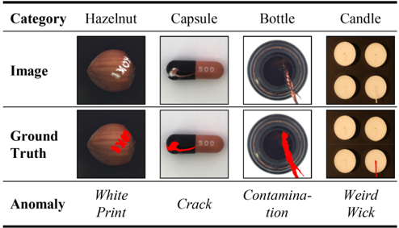
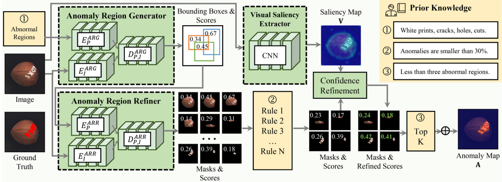
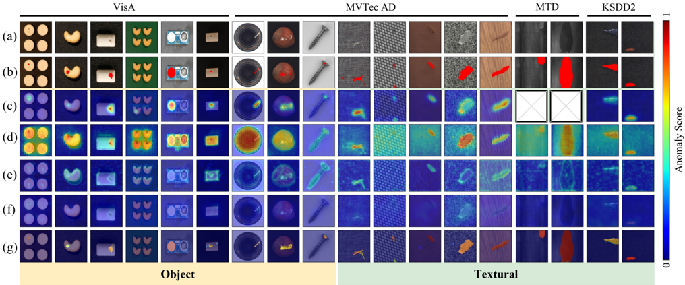
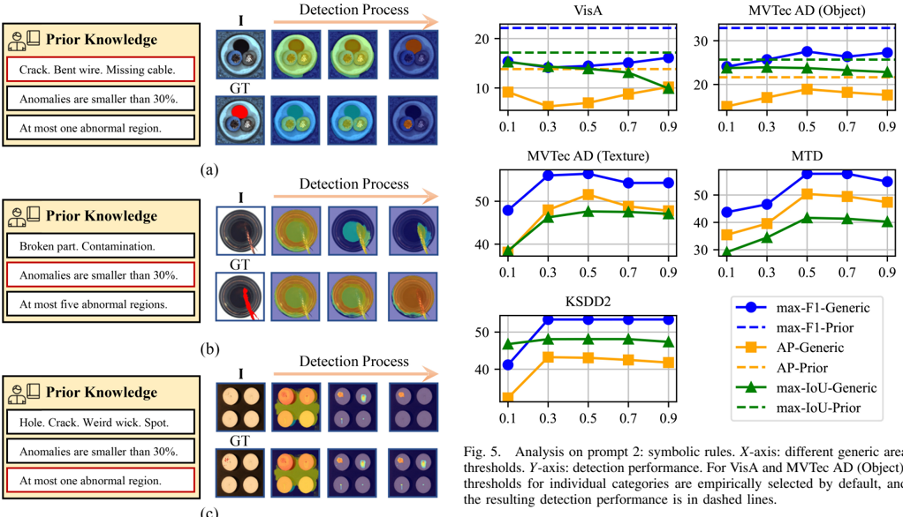
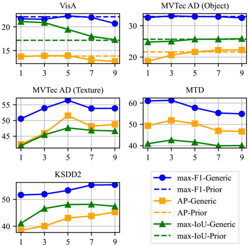
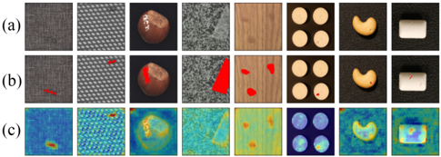
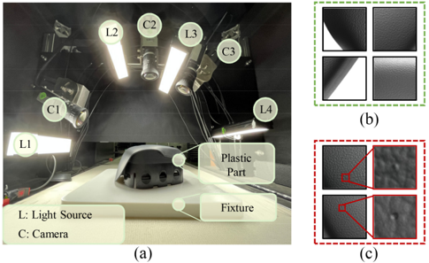
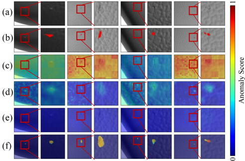
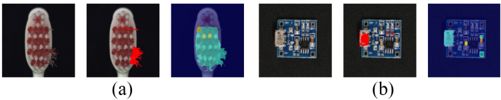

## Personalizing Vision-Language Models With Hybrid Prompts for Zero-Shot Anomaly Detection

Yunkang Cao , Graduate Student Member, IEEE, Xiaohao Xu, Yuqi Cheng , Student Member, IEEE , Chen Sun, Zongwei Du , Liang Gao , Senior Member, IEEE, and Weiming Shen , Fellow, IEEE

Abstract—Zero-shot anomaly detection (ZSAD) aims to develop a foundational model capable of detecting anomalies across arbitrary categories without relying on reference images. However, since "abnormality" is inherently defined in relation to "normality" within specific categories, detecting anomalies without reference images describing the corresponding normal context remains a significant challenge. As an alternative to reference images, this study explores the use of widely available product standards to characterize normal contexts and potential abnormal states. Specifically, this study introduces AnomalyVLM, which leverages generalized pretrained visionlanguage models (VLMs) to interpret these standards and detect anomalies. Given the current limitations of VLMs in comprehending complex textual information, AnomalyVLM generates hybrid prompts—comprising prompts for abnormal regions, symbolic rules, and region numbers—from the standards to facilitate more effective understanding. These hybrid prompts are incorporated into various stages of the anomaly detection process within the selected VLMs, including an anomaly region generator and an anomaly region refiner. By utilizing hybrid prompts, VLMs are personalized as anomaly detectors for specific categories, offering users flexibility and control in detecting anomalies across novel categories without the need for training data. Experimental results on four public industrial anomaly detection datasets, as well as a practical automotive part inspection task, highlight the superior performance and enhanced generalization capability of AnomalyVLM, especially in texture categories. An online demo of AnomalyVLM is available at https: //github.com/caoyunkang/Segment-Any-Anomaly.

Index Terms—Anomaly detection, vision-language model (VLM), zero-shot learning.

Received 3 December 2024; revised 19 January 2025; accepted 22 January 2025. Date of publication 13 February 2025; date of current version 18 March 2025. This work was supported in part by the Ministry of Industry and Information Technology of the People's Republic of China under Grant 2023ZY01089; in part by the China Scholarship Council (CSC) under Grant 202306160078; and in part by the HPC Platform of Huazhong University of Science and Technology where the computation is completed. This article was recommended by Associate Editor T. Xiang. (Corresponding author: Weiming Shen.)

Yunkang Cao, Yuqi Cheng, Zongwei Du, Liang Gao, and Weiming Shen are with the State Key Laboratory of Intelligent Manufacturing Equipment and Technology, Huazhong University of Science and Technology, Wuhan 430074, China (e-mail: cyk\_hust@hust.edu.cn; yuqicheng@hust.edu.cn; duzongwei@hust.edu.cn; gaoliang@hust.edu.cn; wshen@ieee.org).

Xiaohao Xu is with the Michigan Robotics, University of Michigan at Ann Arbor, Ann Arbor, MI 48109 USA (e-mail: xiaohaox@umich.edu).

Chen Sun is with the Department of Mechanical and Industrial Engineering, University of Toronto, Toronto, ON M5S 3G8, Canada (e-mail: chrn.sun@mail.utoronto.ca).

Color versions of one or more figures in this article are available at https://doi.org/10.1109/TCYB.2025.3536165.

Digital Object Identifier 10.1109/TCYB.2025.3536165

2168-2267 -c

## I. INTRODUCTION

A NOMALY detection for images plays a crucial role in industrial applications, including tasks, such as defective product identification [1] , [2] , [3] and industrial process monitoring [4] , [5]. Most existing methods follow a "closed-set" paradigm, relying on training data from specific product categories [6] , [7] , [8]. However, detecting anomalies in previously unseen categories is equally important, as collecting training samples for every category can be impractical [2] , [9]. For example, during early production stages, samples may not be available, yet accurate anomaly detection is still essential [2]. Furthermore, inspecting millions of product categories [9] makes data collection both costly and often infeasible. This article, therefore, investigates zero-shot anomaly detection (ZSAD), which aims to identify defects in unseen categories without relying on prior training data.

ZSAD faces significant challenges due to the contextdependent nature of anomalies. For example, white prints may be acceptable on capsules but indicate defects on hazelnuts (Fig. 1). This dependence on specific normal contexts complicates the development of generic ZSAD models, underscoring the importance of incorporating prior knowledge of product standards. Such knowledge often includes preproduction guidelines that describe normal conditions and potential defects. For instance, CAD models define normal product conditions, while experts predict likely defects based on production processes (e.g., painting may cause color inconsistencies). Notably, these standards are not derived from data but from expert insights established before production.

Typically presented in textual formats, these standards offer detailed descriptions of both normal and abnormal conditions. However, conventional anomaly detection methods [6] , [7] primarily rely on visual models, limiting their ability to interpret textual information. To address this limitation, some approaches [9] , [10] incorporate vision-language models (VLMs) [11] , [12] to leverage prior knowledge for ZSAD. These VLMs, extensively pretrained on visual and textual data, exhibit strong generalization capabilities and multimodal understanding [13] , [14]. Nevertheless, even state-of-the-art (SOTA) VLMs, such as ChatGPT [15], often struggle with complex, domain-specific standards, as evidenced by the suboptimal ZSAD performance of WinCLIP [9] .

To enhance VLMs' understanding of prior knowledge, this study introduces AnomalyVLM, a framework that personalizes VLMs for improved ZSAD performance by integrating hybrid prompts derived from prior knowledge. Specifically,

2025 IEEE. All rights reserved, including rights for text and data mining, and training of artificial intelligence and similar technologies. Personal use is permitted, but republication/redistribution requires IEEE permission.

Fig. 1. Motivation: "Abnormality" depends on the corresponding "normality" of given categories and varies across different categories.

AnomalyVLM employs two pretrained VLMs: 1) Grounding DINO [13] and 2) segment anything module (SAM) [16] as the anomaly region generator (ARG) and anomaly region refiner (ARR), respectively. ARG can identify potential anomaly regions under the guidance of textual prompts, while ARR can refine these regions for precise detection. The synergy between ARG and ARR enables effective ZSAD based on textual anomaly descriptions. To optimize the use of prior knowledge, AnomalyVLM derives three distinct prompts. The first prompt includes textual descriptions of potential anomaly regions, guiding VLMs to identify anomalies comprehensively. However, nonspecialized VLMs may misinterpret prompts, leading to false alarms. To mitigate this, AnomalyVLM incorporates two additional prompts: 1) symbolic rules to filter unlikely candidates based on anomaly characteristics and 2) an estimated maximum anomaly count to select the most confident detections. Additionally, given that VLM confidence scores may not align with anomaly severity, AnomalyVLM refines these scores using visual saliency, leveraging the distinct visual features of abnormal regions [17] .

Through these hybrid prompts, AnomalyVLM integrates prior knowledge into the detection process, achieving superior ZSAD performance. Unlike traditional models with fixed posttraining functionalities [6] , [7], AnomalyVLM is customizable and user-centric, enabling users to adapt the framework to diverse categories by adjusting prompts based on specific prior knowledge. Additionally, compared to existing generic ZSAD methods, the proposed approach more effectively exploits prior knowledge through the designed hybrid prompts. Experiments on four industrial anomaly detection datasets and a real-world automotive part inspection scenario validate AnomalyVLM's flexibility, generalization capabilities, and enhanced ZSAD performance. The contributions of this study are summarized as follows.

- 1) This study addresses the dependence of anomalies on normal contexts in ZSAD by incorporating prior knowledge through VLMs. It highlights the importance of integrating preproduction standards to overcome the challenge of ZSAD without reference images.
- 2) This study introduces AnomalyVLM, a novel framework that enhances ZSAD performance by deriving three distinct hybrid prompts from prior knowledge.

These prompts include textual descriptions of potential anomaly regions, symbolic rules to filter unlikely candidates, and an estimated maximum anomaly count, which help improve detection accuracy and reduce false positives.

- 3) AnomalyVLM demonstrates superior ZSAD performance, particularly for texture anomalies, and can even outperform PatchCore [6] in certain categories that rely on corresponding normal images for training, as detailed in Section IV-B .

## II. RELATED WORK

## A. Anomaly Detection

Anomaly detection methods aim to accurately pinpoint irregular patterns that deviate from normal patterns in given scenarios/categories. Existing anomaly detection methods can be categorized based on the combinations of training data [1] , [2] into semi-supervised [18], unsupervised [7] , [19] , [20], and few-shot methods [21] , [22] .

- 1) Semi-supervised anomaly detection methods require both normal and abnormal samples from target categories for training [23] , [24]. As abnormal samples are typically fewer than normal ones, these methods focus on modeling the normal data distribution, using abnormal samples to refine the decision boundary [25]. Techniques such as residual learning [18] and contrastive learning [26] have been explored to enhance performance.
- 2) Unsupervised anomaly detection methods, in contrast, rely solely on normal samples for training and have seen significant advancements in recent years. These methods heavily depend on the utilized embeddings, employing self-supervised learning [27] , [28] , [29] , [30] or pretrained neural networks [6] , [7] to derive descriptive embeddings for normal samples. Subsequently, approaches like reconstruction [31] , [32] , [33] , [34] , knowledge distillation [7] , [8] , [20], memory banks [6] , and flow models [19] , [35] , [36] are utilized to model normal embedding distributions. During inference, the distances between the test sample embeddings and the modeled normal distributions serve as anomaly scores. While these methods [35] , [36] achieve promising results, they still require large numbers of normal training samples.
- 3) Few-shot anomaly detection methods address scenarios with limited normal samples for training. For instance, RegAD [21] improves the compactness of normal embeddings by spatially aligning samples from the same categories, enabling reasonable detection performance with fewer samples. Similarly, PCSNet [37] promotes feature compactness through contrastive learning. More recently, AnomalyGPT [38] achieves superior few-shot anomaly detection performance by prompting the pretrained CLIP [12] .

Although the paradigms [18] , [35] , [38] mentioned above have demonstrated promising performance in anomaly detection, they operate in a close-set manner, limiting their applicability to categories present in the training sets.

Consequently, they fail to detect anomalies in novel categories lacking reference samples. To address this limitation, some ZSAD methods [9] , [39] , [40] were proposed. Early ZSAD methods [39] , [41] construct a knowledge graph and compute similarities between support and query samples for anomaly detection. In contrast, MAEDAY [42] employs a pretrained masked autoencoder to reconstruct the normal appearances of test samples, using reconstruction errors between the test and recovered samples to identify anomalies. More recently, WinCLIP [9] leverages CLIP [12] to compute similarities between image patches and manually defined textual prompts describing normal and abnormal states. Higher similarities to abnormal states are interpreted as increased abnormality. However, since prompts related to "normality" and "abnormality" are rarely present in the pretrained data [43] of CLIP, the pretrained CLIP may struggle to effectively distinguish between normal and abnormal patches. To address this issue, several methods [44] , [45] have been proposed to augment the given textual prompts. Nonetheless, these approaches are limited to short descriptions and fail to leverage complex prior knowledge. In contrast, this study aims to better utilize available prior knowledge to personalize off-the-shelf VLMs for anomaly detection in unseen categories.

## B. Vision Language Models

Numerous VLMs have emerged in the past several years, distinguished by their extensive parameters and typically trained on massive datasets like Laion-400M [43], demonstrating promising generalization capacity. An early milestone, CLIP [12], is trained on large-scale image–text pairs using contrastive learning and can compute similarities between images and texts, showcasing admirable zero-shot classification capabilities. Subsequent works further extend CLIP into other downstream tasks like video segmentation [46] and anomaly detection [9]. More recently, VLMs have been equipped with stronger vision-language understanding capacities, thanks to advanced training strategies [47] and more fine-grained annotated data. For example, BLIP [14] proposes utilizing noisy web data by bootstrapping the captions, where a captioner generates synthetic captions and a filter removes the noisy ones, thereby simultaneously achieving image–text retrieval and image captioning tasks. GroundingDINO [13] achieves referring object detection and can detect arbitrary objects through textual prompts. Furthermore, SAM [16] is trained for open-set segmentation and can accept point, rectangle, and mask prompts. With prompts derived from prior knowledge, SAM can effectively segment objects of interest in given images and has inspired many follow-up works [48]. The availability of these off-the-shelf VLMs and their integration has made a substantial contribution to the advancement of downstream tasks like ZSAD [9] .

## C. Prompt Engineering

Despite the generalization capabilities of current VLMs, their effectiveness remains limited in contexts with substantial domain disparities between target and training data, particularly in industrial anomaly detection. The collaborative integration of prior knowledge and VLMs has emerged as a standard solution to enhance VLM performance in such scenarios. This prior knowledge is typically incorporated into VLMs through prompt engineering [49] .

VLMs generally accept textual prompts [12] , [14] to adapt their functionality for image understanding. Users can thus leverage these VLMs for specific tasks by expressing prior knowledge in textual form. However, since prior knowledge cannot always be accurately conveyed through text alone, some VLMs are designed to accept more flexible prompts, such as point and mask prompts [16] used by SAM. Additionally, one of the most well-known VLMs, ChatGPT [15], accepts both image and text prompts. ChatGPT also supports multiround interactions, making it highly customizable for specific tasks.

Overall, prompt engineering is gaining popularity due to its user-centric nature. Users are not required to build models from scratch but instead adjust prompts to suit specific functionalities. In the context of ZSAD, this study derives hybrid prompts from prior knowledge, providing context about normalities and abnormalities in given categories, and addressing the dependence of anomalies on normal contexts. This approach enables anomaly detection across arbitrary categories without requiring references.

## III. METHOD

## A. Problem Definition

In the context of ZSAD, a model should be capable of detecting anomalies in an image I ∈ R h×w×3 from novel categories and generating the corresponding anomaly map A ∈ [0 , 1] h×w×1 . Given the dependence of anomalies on normal contexts, detecting anomalies without any reference to normal conditions is a challenging task. Therefore, this study leverages prior knowledge, such as predefined standards, as sources of normal contexts.

## B. Pipeline Overview

As shown in Fig. 2, this study employs two off-the-shelf VLMs for text-based anomaly region retrieval. Additionally, three prompts derived from prior knowledge are introduced to guide the process. These prompts enable the customization of the VLMs, allowing users to adapt them to specific categories. In this way, the approach enhances ZSAD performance without requiring additional training. The details of AnomalyVLM are provided below.

## C. Anomaly Region Generator

Certain VLMs [10] , [13] have gained the capability to identify objects within images based on textual prompts T . These user-defined prompts can guide VLMs in retrieving regions of interest within a given image I. This study employs a recently introduced VLM named GroundingDINO [13] as ARG to generate anomaly regions using textual prompts, such as generic prompts "anomaly." In particular, GroundingDINO is characterized as a text-guided open-set object detection model, pretrained on extensive language-vision datasets [43], and

Fig. 2. Pipeline overview of AnomalyVLM. AnomalyVLM integrates three prompts. First, ARG identifies potential abnormal regions at the bounding-box level within the testing image, guided by prompt 1. Subsequently, ARR enhances the bounding-box-level predictions to pixel-level masks. Prompt 2 facilitates the filtering of abnormal regions that do not adhere to specific symbolic rules. Next, the scores of the remaining masks are refined based on visual saliency. Finally, guided by prompt 3, candidates with the highest K scores are selected and amalgamated into the final predictions.

equipped with robust open-world detection capabilities. Thus, ARG can retrieve abnormal regions with textual prompts. ARG comprises three submodules, a prompt encoder E
P ARG E
P , an image encoder E
I ARG E
I , and a decoder D ARG P , I . First, ARG encodes the given textual prompts and the testing image via E
P ARG E
P and E
I ARG E
I , respectively. Then the encoded features are delivered to D ARG P , I , which utilizes cross-attention for region retrieval. The detection process of ARG is formulated as

<!-- formula-not-decoded -->

where R B denotes the resulting set of bounding boxes, and S for the corresponding confidence scores which denote the similarities to the given textual prompts.

## D. Anomaly Region Refiner

Since ARG can only produce bounding-box level predictions, this study further introduces ARR to refine the bounding-box-level anomaly region candidates R B into a set of pixel-level masks, represented as R. Specifically, an openworld visual segmentation model called SAM [16] is employed as ARR. SAM is trained on an extensive image segmentation dataset [16], consisting of one billion fine-grained masks, which equips SAM with the capability to generate high-quality masks in open-set segmentation scenarios. Similar to ARG, ARR also comprises three submodules, a prompt encoder E
P ARR E
P , an image encoder E
I ARR E
I , and a decoder D ARR P , I , where E
P ARR E
P accepts bounding boxes as prompts. Then in the region refinement process, ARR encodes the predicted bounding boxes and the testing image via E
P ARR E
P and E
I ARR E
I , respectively. Then the encoded features are delivered to D ARR P , I for mask prediction. The process is formulated as

<!-- formula-not-decoded -->

where R denotes pixel-level masks for candidates of abnormal regions. By combining ARG and ARR, users can input textual prompts to retrieve potential abnormal regions and obtain a set of pixel-level candidates R along with their associated confidence scores S. However, both ARR and ARG may encounter difficulties in interpreting complex textual prompts, which could limit the effective use of prior knowledge. To address this, this study derives three prompts from prior knowledge that can be more effectively integrated into the anomaly detection process.

## E. Prompt 1: Abnormal Regions

Existing ZSAD methods [9] typically employ generic textual prompts, such as "anomaly" or "defect," to instruct VLMs to detect anomalies in arbitrary categories. However, these generic prompts cannot accurately describe the candidates that need to be queried, since the underlying meanings of "anomaly" may vary from category to category, i.e. , the definition of abnormalities depends on corresponding normal contexts. Instead of generic prompts, the proposed AnomalyVLM allows users to input specific descriptions for potential abnormal regions within the testing category. For instance, users can enter "white prints, cracks, holes, cuts." for the hazelnut category, thereby translating the task of retrieving anomalies into retrieving regions with clearer meanings. These prompts are more intuitive than generic prompts. This way, VLMs can effectively retrieve all potential anomalies within an image. However, while these precise descriptions can enhance the detection rate of abnormal regions, they can also result in false alarms, as the utilized VLMs may inadequately comprehend the prompts. Two additional prompts are introduced to mitigate these false alarms.

## F. Prompt 2: Symbolic Rules

Prior knowledge can also provide more specific descriptions regarding abnormalities, such as their areas, positions, and colors, typically in the form of accurate numerical expressions. However, existing VLMs [13] exhibit limitations in their

ability to query regions based on the aforementioned specific anomaly property descriptions, which may be crucial for retrieving more faithful candidates. Hence, this study opts to express these descriptions as symbolic rules rather than textual prompts. In particular, this study develops predefined functions to compute the properties of abnormal region candidates. Then, AnomalyVLM can filter out candidates that do not meet user-given thresholds. Denoting these symbolic rules as {Rule 1, . . . , Rule N}, only those candidates that meet all rules are retained. This study implements a symbolic rule concerning areas for a simple evaluation, primarily focusing on the relative ratio between abnormal candidates and the inspected object, such as "Anomalies are smaller than 5% (of the object area)." Abnormal region candidates that do not conform to user-defined thresholds will be filtered out.

## G. Prompt 3: Region Numbers

Although symbolic rules have significantly aided in the reduction of false alarms, there might still be an abundance of potential candidates. Drawing from prior knowledge, the quantity of anomaly regions within an examined object is constrained, with regions exhibiting higher anomaly scores being more probable genuine anomalies. Hence, this study introduces a prompt about the estimated maximum number of abnormal regions within given categories. This way, the candidates with the highest top K confidence scores based on the image content are retained as final predictions. However, the confidence scores produced by ARG and ARR can only contribute to the similarities between selected regions and given textual prompts and cannot faithfully reveal the anomaly degrees. This study introduces a visual saliency-based confidence refinement strategy to make the confidence scores more representative of anomaly degrees.

Visual Saliency-Based Confidence Refinement: Visual saliency refers to the degree to which an object or region captures human observers' attention [50] , [51]. Typically, abnormal regions differ from their neighbors and exhibit greater visual saliency than normal regions [17]. Based on this concept, this study proposes computing visual saliency by measuring the distances between a query region and other regions, and then using the saliency map to refine confidence scores. Specifically, this study computes a saliency map (V) for the input image by calculating the average distances between the pixel features (F) and their N most similar features

<!-- formula-not-decoded -->

Here, (i , j) represents the pixel location, P(Fij) refers to the N most similar features of the corresponding pixel, and · , · denotes cosine similarity. Pretrained convolutional neural networks (CNNs) are used to extract image features to ensure feature descriptiveness. The saliency map indicates how distinct a region is from other regions. Then, this study utilizes the exponential average saliency values within the corresponding region masks to refine individual confidence scores

<!-- formula-not-decoded -->

where R denotes individual masks for candidates (1 for valid and 0 for invalid), and S r denotes the refined confidence scores that comprehensively consider both the confidence derived from the VLMs and the saliency of the region candidate.

## H. Anomaly Detection

The average values of the final retained candidates are then fused to detect anomalies. Formally, the anomaly map A is computed as follows:

<!-- formula-not-decoded -->

By incorporating two VLMs (ARG and ARR) along with three prompts derived from prior knowledge, AnomalyVLM computes anomaly maps for testing images from novel categories, effectively indicating the abnormality level of individual pixels. The user-centric design of AnomalyVLM offers flexibility and generality, enabling reliable ZSAD.

## IV. EXPERIMENTS

In this section, the performance of AnomalyVLM is evaluated on four widely used anomaly detection datasets. The impact of hybrid prompts is also assessed. Subsequently, the practical applicability of the proposed method is demonstrated using a real-world automotive plastic part inspection dataset. Finally, this study explores the advantages and limitations of AnomalyVLM and provides insights into potential avenues for future research.

## A. Experimental Setup

- 1) Datasets: This study leverages four anomaly detection datasets to assess the performance of ZSAD. In particular, this study selected MVTec AD [52], VisA [53], KSDD2 [23] , and MTD [54] considering their diverse product categories and comprehensive coverage of various anomaly types. All these datasets offer pixel-level annotations. It is noteworthy that MVTec AD [52] and VisA datasets [53] provide detailed descriptions of abnormal regions, which can be valuable resources for prior knowledge, particularly for describing potential abnormal regions within individual categories. Within these datasets, some categories are about specific objects, while others consist of texture images. This study categorizes MVTec AD into MVTec AD (Object) and MVTec AD (Texture), which contain ten and five categories, respectively. In total, the utilized datasets collectively comprise 4470 normal samples and 3092 abnormal samples for evaluations.

2) Evaluation Metrics: To comprehensively evaluate ZSAD performance, three key metrics have been employed: 1) average precision; 2) maximum F1 score (max-F1) [9]; and 3) maximum Intersection over Union (max-IoU). Specifically, different thresholds are applied to the computed anomaly

maps, discretizing anomaly maps into binary values (0 and 1). Subsequently, the F1 score and IoU score under different thresholds are computed, and the maximum F1 and IoU scores under different thresholds are selected as max-F1 and max-IoU, respectively.

3) Implementation Details: The proposed AnomalyVLM model incorporates the lighter architectures of VLMs by default, i.e., GroundingDINO with Swin-T 1 and SAM with ViT-T 2 as ARG and ARR, respectively. Input images are consistently resized to a resolution of 256 × 256 for evaluation. Visual saliency calculation employs WideResnet50 [55] for feature extraction and N = 400 for (3) .

Prior Knowledge: This study employs various sources of prior knowledge tailored to different categories. Texture categories are generally easier for anomaly detection [7]; thus, simple prompts are utilized for all texture categories in MVTec AD, MTD, and KSDD2. Specifically, for prompts 1, 2, and 3, this study utilizes "defect," "Anomalies are smaller than 50%.," and "At most five abnormal regions," respectively. Conversely, object categories pose more difficulties for anomaly detection. This study exploits the originally provided names of abnormal types by MVTec AD and VisA as prior knowledge. These provided names of anomaly types are paraphrased into nouns as inputs for prompt 1, such as "broken\_large" in the bottle category transformed into "large breakage," to facilitate easier region retrieval for VLMs. For prompts 2 and 3, different thresholds are introduced empirically from prior knowledge for enhanced detection performance.

4) Comparison Methods: This study conducts a comparative analysis of the proposed AnomalyVLM with several ZSAD alternatives, including WinClip [9], UTAD [17], and ClipSeg [10]. Within these ZSAD methods, the proposed AnomalyVLM, WinCLIP, and ClipSeg require textual prompts provided by prior knowledge, while UTAD detects anomalies based on visual saliency. The implementation of WinClip 3 strictly follows the methodology outlined in its original paper, resulting in detection performance comparable to the reported results. It is worth noting that ClipSeg was not originally designed for ZSAD; therefore, this study utilizes its pretrained weights and provides "defect" as textual prompts to detect anomalies in a zero-shot manner. Additionally, an unsupervised anomaly detection method, PatchCore [6], is also evaluated.

## B. Main Results

The comparison results between AnomalyVLM and other ZSAD alternatives are presented in Table I. While WinCLIP [9] and UTAD [17] are specifically designed for ZSAD, the simple implementation of ClipSeg [10] for ZSAD achieves comparable performance. Moreover, AnomalyVLM achieves the highest detection performance among all ZSAD methods, with an average of 35.8% max-F1, 27.3% AP, and 28.0% max-IoU across all datasets, surpassing UTAD by

1 https://github.com/IDEA-Research/GroundingDINO

2 https://github.com/facebookresearch/segment-anything

3 https://github.com/zqhang/Accurate-WinCLIP-pytorch

a significant margin of 11.1% max-F1. It is worth noting that ClipSeg, WinCLIP, and AnomalyVLM all utilize textual prompts for guidance. The superior detection performance of AnomalyVLM demonstrates its ability to effectively integrate prior knowledge.

Additionally, Table I reveals that almost all methods achieve higher detection performance for textual categories compared to object categories. This discrepancy arises because the normal and abnormal contexts within object categories prove to be more complex, posing obstacles to detecting anomalies.

In comparison to the unsupervised anomaly detection method PatchCore, it is evident that ClipSeg, UTAD, and WinCLIP perform weaker across nearly all categories. Conversely, AnomalyVLM even outperforms PatchCore [6] by a large margin for some categories, such as leather, tile, and wood, while requiring no training data. It is also notable that PatchCore fails to operate effectively on the MTD dataset due to the absence of available normal training samples, whereas AnomalyVLM achieves promising detection performance on categories like MT\_Blowhole and MT\_Fray.

Fig. 3 presents qualitative comparisons between AnomalyVLM and other alternatives. It is evident that UTAD and WinCLIP exhibit limited efficacy in ZSAD, while ClipSeg [10] emerges as a strong competitor, successfully detecting anomalies in most categories but showing significant false alarms in the background. In contrast, the proposed AnomalyVLM achieves superior anomaly detection performance, accurately identifying anomalies in these novel categories. Compared to PatchCore, AnomalyVLM demonstrates comparable detection performance and can even yield more accurate results, particularly in texture categories. Notably, AnomalyVLM requires no training data, whereas PatchCore necessitates large amounts of training data from target categories.

## C. Ablation Study

This study conducts comprehensive ablation studies to assess the impact of prior knowledge. To this end, we replace hybrid prompts derived from prior knowledge with generic prompts. Additionally, Fig. 4 visually showcases several cases to illustrate the detection process of AnomalyVLM and the influence of prior knowledge. In Fig. 4, masks along with their scores after integrating prompts 1–3 are aggregated with (5) for better visualization, respectively.

1) Ablation on Prompt 1 (Abnormal Regions): This study utilizes generic prompts "defect" to replace prompt 1 about abnormal regions to investigate the influence of prior knowledge. Since generic prompts are utilized for texture categories by default, Table II only presents the comparison results on object categories. It is clear that the detection performance of AnomalyVLM remains promising compared to other ZSAD alternatives when prior knowledge regarding abnormal regions is unavailable, i.e., employing only generic prompts. With a simple generic prompt "defect," AnomalyVLM still achieves an average max-F1 of 21.6% on VisA. However, it has to be admitted that the anomaly detection performance of AnomalyVLM undergoes a slight decline across the object

TABLE I

QUALITATIVE COMPARISONS OF ANOMALYVLM WITH ALTERNATIVE ZSAD METHODS. RESULTS ARE PRESENTED AS (MAX-F1, AP, MAX-IOU). BEST SCORES ARE HIGHLIGHTED IN BOLD, WHILE THE SECOND-BEST SCORES ARE ALSO UNDERLINED. PATCHCORE IS A SOTA UNSUPERVISED ANOMALY DETECTION METHOD AND IS EXCLUDED FROM RANKING

|    |    |    |    |    |    |    |
|----|----|----|----|----|----|----|
|    |    |    |    |    |    |    |
|    |    |    |    |    |    |    |
|    |    |    |    |    |    |    |
|    |    |    |    |    |    |    |
|    |    |    |    |    |    |    |
|    |    |    |    |    |    |    |
|    |    |    |    |    |    |    |
|    |    |    |    |    |    |    |
|    |    |    |    |    |    |    |
|    |    |    |    |    |    |    |
|    |    |    |    |    |    |    |
|    |    |    |    |    |    |    |
|    |    |    |    |    |    |    |
|    |    |    |    |    |    |    |
|    |    |    |    |    |    |    |
|    |    |    |    |    |    |    |
|    |    |    |    |    |    |    |
|    |    |    |    |    |    |    |
|    |    |    |    |    |    |    |
|    |    |    |    |    |    |    |
|    |    |    |    |    |    |    |
|    |    |    |    |    |    |    |
|    |    |    |    |    |    |    |
|    |    |    |    |    |    |    |
|    |    |    |    |    |    |    |
|    |    |    |    |    |    |    |
|    |    |    |    |    |    |    |
|    |    |    |    |    |    |    |
|    |    |    |    |    |    |    |
|    |    |    |    |    |    |    |
|    |    |    |    |    |    |    |
|    |    |    |    |    |    |    |
|    |    |    |    |    |    |    |
|    |    |    |    |    |    |    |

TABLE II COMPARISON BETWEEN QUANTITATIVE RESULTS WITH PROMPT 1 AND ALTERNATIVE GENERIC INPUTS "DEFECT." RESULTS ARE PRESENTED AS (MAX-F1, AP, MAX-IOU).

|    |    |    |
|----|----|----|
|    |    |    |
|    |    |    |

categories when lacking prior knowledge. The most significant decrease is observed in MVTec AD (Object), with a 4.1% lower max-F1 score. This decline is attributed to the complexity of these object categories, as generic names of abnormal regions may not accurately depict the comprised anomalies. As illustrated in Fig. 4(a), the presence of a "missing cable" within the cable constitutes an anomaly. However, GroundingDINO fails to detect such regions via generic textual prompts "defect." In contrast, by introducing more specific names of abnormal regions, i.e., "Crack. Bent wire. Missing cable," the proposed AnomalyVLM successfully identifies the abnormal region. This emphasizes the importance of prior knowledge in identifying all potential anomalies.

2) Ablation on Prompt 2 (Symbolic Rules): This study implements a symbolic rule regarding the area of abnormal regions for prompt 2. To better understand the influence of prompt 2, this study employs different generic area thresholds for all categories to replace the specific prompts, as depicted in Fig. 5. The figure clearly illustrates that area thresholds have a significant impact on anomaly detection performance. Particularly, the detection performance of AnomalyVLM tends to improve and then decrease with larger area thresholds. This is mainly because a small area threshold may wrongly filter out faithful abnormal candidates, while a large threshold could result in more false alarms. For instance, Fig. 4(b) illustrates how a single area threshold effectively filters out the false alarm associated with the entire bottle. Specifically, employing a threshold of 0.3, derived from prior knowledge, substantially mitigates false alarms, whereas using a generic threshold of 0.9 introduces severe false alarms. Generally, Fig. 5 shows that the optimal detection performance without prior knowledge is attained with a generic threshold of 0.5, with which AnomalyVLM still outperforms other ZSAD alternatives. This demonstrates the superiority of AnomalyVLM even in the absence of prior knowledge. Conversely, optimized thresholds derived from prior knowledge for individual categories within VisA and MVTec AD (Object) lead to significantly improved detection performance with prompts, as shown in Fig. 5. This

Fig. 3. Qualitative comparison between the proposed AnomalyVLM and alternative ZSAD methods. From top to bottom: (a) testing image, (b) corresponding ground truth, followed by anomaly maps generated by (c) PatchCore [6], (d) ClipSeg [10], (e) UTAD [17], (f) WinCLIP [9], and (g) proposed AnomalyVLM.

Fig. 4. Qualitative analysis of hybrid prompts. The red rectangle denotes the prompt to be replaced with generic prompts. For (a)–(c), generic prompts are " Defect," "Anomalies are smaller than 50%," and "At most five abnormal regions." The top and bottom rows display results obtained with specific and generic inputs, respectively. From left to right: visualized anomaly maps after integrating prompts 1–3.

underscores the crucial role of prior knowledge in ZSAD. While this study primarily focuses on symbolic rules based on area, looking forward, the integration of additional symbolic rules, such as location and color, holds the potential to yield even more favorable results.

3) Ablation on Prompt 3 (Region Numbers): Prompt 3 is about the estimated maximum number of abnormal regions for the testing category. This study replaces the prompts with generic estimated numbers for all categories to access the performance without prior knowledge. As depicted in Fig. 6 , the anomaly detection performance exhibits an increasing and then decreasing trend with increasing estimated numbers of abnormal regions. This trend arises because the probability of retaining faithful abnormal candidates improves with a larger estimated number, while simultaneously introducing more false alarms. For instance, Fig. 4(c) illustrates the comparison

Fig. 6. Analysis on prompt 3: region numbers. X-axis: different generic region number thresholds. Y-axis: detection performance. For VisA and MVTec AD (Object), thresholds for individual categories are empirically selected by default, and the resulting detection performance is in dashed lines.

Fig. 7. Visualization of visual saliency maps. From top to bottom: (a) testing image, (b) corresponding ground truth, and (c) computed visual saliency map.

between one (from prior knowledge) and five (from generic prompts) retained abnormal regions for the candle category. It demonstrates that retaining more candidates leads to false alarms. Hence, it is crucial for users to determine a suitable number threshold according to practical applications for optimal anomaly detection performance.

Influence of the Visual Saliency-Based Confidence Refinement: This study introduces a refinement strategy that utilizes visual saliency to calibrate the confidence scores of individual anomalies. Visualizations of some visual saliency maps are provided in Fig. 7, illustrating that these maps yield notably higher values for abnormal regions, rendering visual saliency suitable for refinement purposes. To further elucidate the impact of the refinement strategy, Table III presents the ZSAD performance with and without the strategy. It is evident that the detection performance declines when the refinement strategy is not applied, such as a decrease of 5.6% in max-F1 on MTD. This underscores the effectiveness of the refinement strategy.

TABLE III COMPARISON BETWEEN QUANTITATIVE RESULTS WITH AND WITHOUT THE VISUAL SALIENCY-BASED REFINEMENT STRATEGY. RESULTS ARE PRESENTED AS (MAX-F1, AP, MAX-IOU)

|    |    |    |
|----|----|----|
|    |    |    |
|    |    |    |
|    |    |    |
|    |    |    |
|    |    |    |

TABLE IV COMPLEXITY COMPARISONS. THE EFFICIENCY OF EXECUTION IS QUANTIFIED IN FPS. FOR THE PROPOSED ANOMALYVLM, WE LIST THE PERFORMANCE FOR ARG+ARR WITH DIFFERENT BACKBONES

|    |    |    |    |    |    |
|----|----|----|----|----|----|
|    |    |    |    |    |    |
|    |    |    |    |    |    |
|    |    |    |    |    |    |
|    |    |    |    |    |    |
|    |    |    |    |    |    |
|    |    |    |    |    |    |
|    |    |    |    |    |    |
|    |    |    |    |    |    |
|    |    |    |    |    |    |
|    |    |    |    |    |    |
|    |    |    |    |    |    |

## D. Complexity Analysis

This section evaluates the complexity of AnomalyVLM in comparison with alternative methods. For AnomalyVLM, this study analyzes its complexity by varying the backbone models of ARG (GroundingDINO [13]) and ARR (SAM [16]), as detailed in Table IV. Notably, the original SAM model supports only ViT-H/L/B backbones, while ViT-T for SAM is implemented using MobileSAM [56] through knowledge distillation, which significantly reduces computational complexity compared to the original SAM.

As shown in Table IV, the choice of backbones has a minimal impact on detection performance, with only a marginal 1.9% improvement in max-F1 when upgrading from Swin-T+ViT-T to Swin-B+ViT-H. This suggests that even lightweight backbones, such as ViT-T for SAM, possess sufficient generic knowledge and can be effectively personalized for ZSAD using the derived hybrid prompts.

To quantify computational complexity, both the comparison methods and AnomalyVLM were implemented on a single NVIDIA-3090Ti GPU with a batch size of one. The results in Table IV indicate that AnomalyVLM achieves its lowest complexity with Swin-T for GroundingDINO and ViT-T for SAM, requiring 192.3 MB of parameters and operating at 3.7 FPS, slightly faster than WinCLIP, which is slower due to the use of a sliding window. While AnomalyVLM incurs a higher computational burden than other alternatives because of the two VLMs employed, it significantly outperforms these methods in detection performance.

We further examined the average frames per second (FPS) of AnomalyVLM for texture and object images, finding no significant difference in efficiency between these scenarios.

Fig. 8. Real-World application setup. (a) Established image acquisition device for inspection. (b) Collected normal samples. (c) Collected abnormal samples.

This consistency suggests that scenario complexity has a negligible impact on the efficiency of AnomalyVLM. However, in industrial settings, higher-resolution images may be required, potentially increasing computational costs and limiting the current version's deployability in practical systems.

This study also analyzes AnomalyVLM (Swin-T+ViT-T) and identifies ARG as the primary computational bottleneck, accounting for 82.4% of the computational time, followed by ARR (9.3%), the Visual Saliency Extractor (6.1%), and other operations (2.1%). To facilitate practical deployments, future work could explore techniques such as knowledge distillation, as employed in MobileSAM, to optimize GroundingDINO. For this purpose, collecting a large industrial object detection dataset could enable fine-tuning and distillation of SAM and GroundingDINO, enhancing efficiency and specificity for industrial anomaly detection applications.

## E. Real-World Evaluation

This study applies AnomalyVLM to a real-world automotive plastic parts inspection task to evaluate its practicability. Specifically, as illustrated in Fig. 8, an image acquisition device consisting of four light sources and three cameras was constructed to collect data. Using this device, images from 50 plastic parts were obtained. These images were divided into small patches with a resolution of 256 × 256, resulting in 3980 normal patches and 81 abnormal patches. This collected dataset presents greater challenges than existing anomaly detection datasets, such as MVTec AD [52], due to the higher variability in normal patterns and the minute size of anomalies. These unique characteristics render other ZSAD methods (ClipSeg, UTAD, and WinCLIP) ineffective in detecting anomalies within the collected dataset, as shown in Fig. 9. In contrast, with straightforward hybrid prompts such as "Dot. Scratch.," "Anomalies are smaller than 5%," and "At most one abnormal region," the proposed AnomalyVLM effectively detects these subtle anomalies. Table V highlights the performance of AnomalyVLM, achieving a significant 17.8% improvement in max-IoU on this challenging real-world scenario compared to alternative methods. These results underscore the superiority

Fig. 9. Qualitative comparison for real-world automotive part inspection. From top to bottom: (a) testing image, (b) corresponding ground truth, followed by anomaly maps generated by (c) ClipSeg [10], (d) UTAD [17] , (e) WinCLIP [9], and (f) proposed AnomalyVLM.

Fig. 10. Failure cases. (a) Unclear boundary. (b) Complex components.

|    |    |    |    |
|----|----|----|----|
|    |    |    |    |
|    |    |    |    |
|    |    |    |    |
|    |    |    |    |

TABLE V QUALITATIVE COMPARISONS OF ANOMALYVLM WITH ALTERNATIVE ZSAD METHODS FOR THE REAL-WORLD AUTOMOTIVE PLASTIC PARTS INSPECTION

of AnomalyVLM in addressing the complexities of real-world anomaly detection tasks. To promote evaluations on novel categories, this study provides an online demo, available at https://github.com/caoyunkang/Segment-Any-Anomaly.

## F. Discussion

The proposed AnomalyVLM is user-centric and can seamlessly incorporate prior knowledge across specific categories without requiring additional training. Within the zero-shot detection paradigm, AnomalyVLM demonstrates exceptional detection performance across four publicly available datasets and real-world applications, even surpassing the unsupervised method, PatchCore, in certain categories. Moreover, even in the absence of specific prior knowledge, i.e., when only generic prompts are available, AnomalyVLM consistently outperforms other ZSAD alternatives. This combination of superior performance, flexibility, and adaptability establishes AnomalyVLM as a compelling solution for ZSAD.

However, AnomalyVLM is not without limitations, which primarily stem from inherent drawbacks in the utilized VLMs, as illustrated in Fig. 10. Specifically, current VLMs heavily

depend on object boundaries for region retrieval. In cases where abnormal regions lack clear boundaries, as shown in Fig. 10(a), AnomalyVLM may struggle to detect such anomalies. Additionally, certain categories contain complex components, such as PCB Pins and USB Sockets depicted in Fig. 10(b), which existing VLMs find challenging to distinguish accurately in a zero-shot manner, potentially resulting in false alarms.

Looking forward, advancements in more specialized VLMs tailored to industrial scenarios offer promising avenues for addressing these challenges. For instance, adapting CLIP for few-shot anomaly detection via target data, as demonstrated in AnomalyGPT [38], or supervised training of CLIP on auxiliary annotated anomaly detection data, as explored in AdaCLIP [57], provides potential pathways for enhancing performance and mitigating these limitations.

## V. CONCLUSION

In conclusion, this study proposes AnomalyVLM for the challenging ZSAD task. Considering the dependence of abnormalities on normal contexts within individual categories, the study suggests leveraging available prior knowledge to provide insights into normal and abnormal states within testing categories. To this end, AnomalyVLM introduces an ARG and an ARR with off-the-shelf VLMs, personalized by hybrid prompts derived from prior knowledge. These prompts enhance detection performance and afford flexibility and control in identifying anomalies across novel categories without any training. Experimental results and the real-world evaluation attest to the superior detection performance, generalization capacity, and flexibility of the proposed AnomalyVLM.

Future efforts will focus on refining VLMs tailored specifically to industrial applications, thereby enhancing both detection performance and efficiency.

## REFERENCES

- [1] Y. Cao et al., "A survey on visual anomaly detection: Challenge, approach, and prospect," 2024, arXiv:2401.16402 .
- [2] G. Xie et al., "IM-IAD: Industrial image anomaly detection benchmark in manufacturing," IEEE Trans. Cybern., vol. 54, no. 5, pp. 2720–2733, May 2024.
- [3] Z. Zhang, Z. Zhao, X. Zhang, C. Sun, and X. Chen, "Industrial anomaly detection with domain shift: A real-world dataset and masked multi-scale reconstruction," Comput. Ind., vol. 151, Oct. 2023, Art. no. 103990.
- [4] A. Voulodimos et al., "A dataset for workflow recognition in industrial scenes," in Proc. 18th IEEE Int. Conf. Image Process., 2011, pp. 3249–3252.
- [5] M. Wang, D. Zhou, and M. Chen, "Hybrid variable monitoring mixture model for anomaly detection in industrial processes," IEEE Trans. Cybern., vol. 54, no. 1, pp. 319–331, Jan. 2024.
- [6] K. Roth, L. Pemula, J. Zepeda, B. Schölkopf, T. Brox, and P. Gehler, "Towards total recall in industrial anomaly detection," in Proc. IEEE/CVF Conf. Comput. Vis. Pattern Recognit., 2022, pp. 14318–14328.
- [7] Y. Cao, X. Xu, Z. Liu, and W. Shen, "Collaborative discrepancy optimization for reliable image anomaly localization," IEEE Trans. Ind. Informat., vol. 19, no. 11, pp. 10674–10683, Nov. 2023.
- [8] Y. Cai, D. Liang, D. Luo, X. He, X. Yang, and X. Bai, "A discrepancy aware framework for robust anomaly detection," IEEE Trans. Ind. Informat., vol. 20, no. 3, pp. 3986–3995, Mar. 2024.
- [9] J. Jeong, Y. Zou, T. Kim, D. Zhang, A. Ravichandran, and O. Dabeer, "WinCLIP: Zero-/few-shot anomaly classification and segmentation," in Proc. IEEE/CVF Conf. Comput. Vis. Pattern Recognit., 2023, pp. 19606–19616.
- [10] T. Lüddecke and A. Ecker, "Image segmentation using text and image prompts," in Proc. IEEE/CVF Conf. Comput. Vis. Pattern Recognit. , 2022, pp. 7086–7096.
- [11] X. Liu, Y. He, Y.-M. Cheung, X. Xu, and N. Wang, "Learning relationship-enhanced semantic graph for fine-grained image–text matching," IEEE Trans. Cybern., vol. 54, no. 2, pp. 948–961, Feb. 2024.
- [12] A. Radford et al, "Learning transferable visual models from natural language supervision," in Proc. Int. Conf. Mach. Learn., 2021, pp. 8748–8763.
- [13] S. Liu et al, "Grounding DINO: Marrying DINO with grounded pretraining for open-set object detection," in Proc. Eur. Conf. Comput. Vis. , 2025, pp. 38–55.
- [14] J. Li, D. Li, C. Xiong, and S. Hoi, "BLIP: Bootstrapping language-image pre-training for unified vision-language understanding and generation," in Proc. Int. Conf. Mach. Learn., 2022, pp. 1–13.
- [15] Z. Yang et al., "The Dawn of LMMs: Preliminary explorations with GPT-4V(ision)," 2023, arXiv:2309.17421 .
- [16] A. Kirillov et al. "Segment anything," in Proc. IEEE/CVF Int. Conf. Comput. Vis., 2023, pp. 4015–4026.
- [17] T. Aota, L. T. T. Tong, and T. Okatani, "Zero-shot versus many-shot: Unsupervised texture anomaly detection," in Proc. IEEE/CVF Winter Conf. Appl. Comput. Vis., 2023, pp. 5564–5572.
- [18] Y. Cao, X. Xu, C. Sun, L. Gao, and W. Shen, "BiaS: Incorporating biased knowledge to boost unsupervised image anomaly localization," IEEE Trans. Syst., Man, Cybern., Syst., vol. 54, no. 4, pp. 2342–2353, Apr. 2024.
- [19] H. Yao et al., "Dual-attention transformer and discriminative flow for industrial visual anomaly detection," IEEE Trans. Autom. Sci. Eng. , vol. 21, no. 4, pp. 6126–6140, Oct. 2024.
- [20] Y. Cao, Q. Wan, W. Shen, and L. Gao, "Informative knowledge distillation for image anomaly segmentation," Knowl. Based Syst., vol. 248, Jul. 2022, Art. no. 108846.
- [21] C. Huang, H. Guan, A. Jiang, Y. Zhang, M. Spratling, and Y.-F. Wang, "Registration based few-shot anomaly detection," in Proc. Eur. Conf. Comput. Vis., 2022, pp. 303–319.
- [22] S. Kwak et al., "Few-shot anomaly detection via personalization," IEEE Access, vol. 12, pp. 11035–11051, 2024.
- [23] J. Božic, D. Tabernik, and D. Sko ˇ ˇ caj, "Mixed supervision for surface- ˇ ˇ defect detection: From weakly to fully supervised learning," Comput. Ind., vol. 129, Aug. 2021, Art. no. 103459.
- [24] B. Hu et al., "A lightweight spatial and temporal multi-feature fusion network for defect detection," IEEE Trans. Image Process., vol. 30, pp. 472–486, 2020.
- [25] X. Yao, R. Li, J. Zhang, J. Sun, and C. Zhang, "Explicit boundary guided semi-push-pull contrastive learning for supervised anomaly detection," in Proc. IEEE/CVF Conf. Comput. Vis. Pattern Recognit. , 2023, pp. 24490–24499.
- [26] Q. Wan, Y. Cao, L. Gao, X. Li, and Y. Gao, "Deep feature contrasting for industrial image anomaly segmentation," IEEE Trans. Instrum. Meas. , vol. 73, pp. 1–11, Jan. 2024.
- [27] C. Huang et al., "Self-supervision-augmented deep autoencoder for unsupervised visual anomaly detection," IEEE Trans. Cybern., vol. 52, no. 12, pp. 13834–13847, Dec. 2022.
- [28] Y. Liang, J. Zhang, S. Zhao, R. Wu, Y. Liu, and S. Pan, "Omni-frequency channel-selection representations for unsupervised anomaly detection," IEEE Trans. Image Process., vol. 32, pp. 4327–4340, 2023.
- [29] C. Huang, Q. Xu, Y. Wang, Y. Wang, and Y. Zhang, "Self-supervised masking for unsupervised anomaly detection and localization," IEEE Trans. Multimedia, vol. 25, pp. 4426–4438, 2023.
- [30] C. Huang et al., "Weakly supervised video anomaly detection via selfguided temporal discriminative transformer," IEEE Trans. Cybernet. , vol. 54, no. 5, pp. 3197–3210, May 2024.
- [31] Y.-H. Yoo, U.-H. Kim, and J.-H. Kim, "Convolutional recurrent reconstructive network for spatiotemporal anomaly detection in solder paste inspection," IEEE Trans. Cybern., vol. 52, no. 6, pp. 4688–4700, Jun. 2022.
- [32] W. Luo, H. Yao, W. Yu, and Z. Li, "AMI-Net: Adaptive mask inpainting network for industrial anomaly detection and localization," IEEE Trans. Autom. Sci. Eng., vol. 22, pp. 1591–1605, 2025, doi: 10.1109/TASE.2024.3368142 .

- [33] H. Yao, W. Yu, and X. Wang, "A feature memory rearrangement network for visual inspection of textured surface defects toward edge intelligent manufacturing," IEEE Trans. Autom. Sci. Eng., vol. 20, no. 4, pp. 2616–2635, Oct. 2023.
- [34] C. Hu, J. Wu, C. Sun, X. Chen, A. K. Nandi, and R. Yan, "Unified flowing normality learning for rotating machinery anomaly detection in continuous time-varying conditions," IEEE Trans. Cybern., vol. 55, no. 1, pp. 221–233, Jan. 2025.
- [35] Y. Zhou, X. Xu, J. Song, F. Shen, and H. T. Shen, "MSFlow: Multiscale flow-based framework for unsupervised anomaly detection," IEEE Trans. Neural Netw. Learn. Syst., early access, Jan. 9, 2024, doi: 10.1109/TNNLS.2023.3344118 .
- [36] W. Cui et al., "A rapid screening method for suspected defects in steel pipe welds by combining correspondence mechanism and normalizing flow," IEEE Trans. Ind. Informat., vol. 20, no. 9, pp. 11171–11180, Sep. 2024.
- [37] Y. Jiang, Y. Cao, and W. Shen, "Prototypical learning guided context-aware segmentation network for few-shot anomaly detection," IEEE Trans. Neural Netw. Learn. Syst., early access, Oct. 1, 2024, doi: 10.1109/TNNLS.2024.3463495 .
- [38] Z. Gu, B. Zhu, G. Zhu, Y. Chen, M. Tang, and J. Wang, "AnomalyGPT: Detecting industrial anomalies using large vision-language models," in Proc. AAAI Conf. Artif. Intell., 2024, pp. 1932–1940.
- [39] Z. Li, L. Gao, Y. Gao, X. Li, and H. Li, "Zero-shot surface defect recognition with class knowledge graph," Adv. Eng. Informat., vol. 54, Oct. 2022, Art. no. 101813.
- [40] X. Chen et al., "CLIP-AD: A language-guided staged dual-path model for zero-shot anomaly detection," in Proc. Int. Joint Conf. Artif. Intell. , 2024, pp. 17–33.
- [41] Y. Dong, C. Xie, L. Xu, H. Cai, W. Shen, and H. Tang, "Generative and contrastive combined support sample synthesis model for few-/zeroshot surface defect recognition," IEEE Trans. Instrum. Meas., vol. 73, pp. 1–15, 2024, doi: 10.1109/TIM.2023.3329163 .
- [42] E. Schwartz et al., "MAEDAY: Mae for few-and zero-shot anomalydetection," Comput. Vis. Image Understand., vol. 241, Apr. 2024, Art. no. 103958.
- [43] C. Schuhmann et al., "LAION-400M: Open dataset of CLIP-filtered 400 million image-text pairs," in Proc. Neural Inf. Process. Syst., 2021, pp. 1–5.
- [44] Y. Li, A. Goodge, F. Liu, and C.-S. Foo, "PromptAD: Zero-shot anomaly detection using text prompts," in Proc. IEEE/CVF Winter Conf. Appl. Comput. Vis., 2024, pp. 1093–1102.
- [45] Q. Zhou, G. Pang, Y. Tian, S. He, and J. Chen, "AnomalyCLIP: Objectagnostic prompt learning for zero-shot anomaly detection," in Proc. Int. Conf. Learn. Represent., 2024, pp. 1–31.
- [46] T. Hui et al., "Language-aware spatial-temporal collaboration for referring video segmentation," IEEE Trans. Pattern Anal. Mach. Intell. , vol. 45, no. 7, pp. 8646–8659, Jul. 2023.
- [47] D. Chen et al., "Protoclip: Prototypical contrastive language image pretraining," IEEE Trans. Neural Netw. Learn. Syst., vol. 36, no. 1, pp. 610–624, Jan. 2025.
- [48] A. Maalouf et al., "Follow anything: Open-set detection, tracking, and following in real-time," IEEE Robot. Autom. Lett., vol. 9, no. 4, pp. 3283–3290, Apr. 2024.
- [49] J. Wang et al., "Review of large vision models and visual prompt engineering," Meta-Radiol., vol. 1, no. 3, 2023, Art. no. 100047.
- [50] W. Wang, Q. Lai, H. Fu, J. Shen, H. Ling, and R. Yang, "Salient object detection in the deep learning era: An in-depth survey," IEEE Trans. Pattern Anal. Mach. Intell., vol. 44, no. 6, pp. 3239–3259, Jun. 2022.
- [51] Q. Lai, T. Zhou, S. Khan, H. Sun, J. Shen, and L. Shao, "Weakly supervised visual saliency prediction," IEEE Trans. Image Process. , vol. 31, pp. 3111–3124, 2022.
- [52] P. Bergmann, K. Batzner, M. Fauser, D. Sattlegger, and C. Steger, "The MVTec anomaly detection dataset: A comprehensive real-world dataset for unsupervised anomaly detection," Int. J. Comput. Vis., vol. 129, no. 4, pp. 1038–1059, 2021.
- [53] Y. Zou, J. Jeong, L. Pemula, D. Zhang, and O. Dabeer, "SPotthe-difference self-supervised pre-training for anomaly detection and segmentation," in Proc. Eur. Conf. Comput. Vis., 2022, pp. 392–408.
- [54] Y. Huang, C. Qiu, Y. Guo, X. Wang, and K. Yuan, "Surface defect saliency of magnetic tile," in Proc. Int. Conf. Autom. Sci. Eng., 2018, pp. 612–617.
- [55] S. Zagoruyko and N. Komodakis, "Wide residual networks," in Proc. Brit. Mach. Vis. Conf., 2016, pp. 1–12.
- [56] C. Zhang et al., "Faster segment anything: Towards lightweight sam for mobile applications," 2023, arXiv:2306.14289 .
- [57] Y. Cao, J. Zhang, L. Frittoli, Y. Cheng, W. Shen, and G. Boracchi, "AdaCLIP: Adapting CLIP with hybrid learnable prompts for zero-shot anomaly detection," in Proc. Eur. Conf. Comput. Vis., 2024, pp. 55–72.

Yunkang Cao (Graduate Student Member, IEEE) received the B.S. degree from the Huazhong University of Science and Technology, Wuhan, China, in 2020, where he is currently pursuing the Ph.D. degree in mechanical engineering.

His current research interests include machine vision, visual anomaly detection, and industrial foundation models.

Xiaohao Xu received the B.S. degree in mechanical design, manufacturing and automation from the Huazhong University of Science and Technology, Wuhan, China, in 2022. He is currently pursuing the Ph.D. degree with the Robotics Department, University of Michigan at Ann Arbor, Ann Arbor, MI, USA.

His current research interests include the fundamental theory and real-world applications of robotics, computer vision, and video understanding.

Yuqi Cheng (Student Member, IEEE) received the B.S. degree in mechanical design, manufacturing and automation and the M.S. degree in mechanical engineering from the Huazhong University of Science and Technology, Wuhan, China, in 2020 and 2023, respectively, where he is currently pursuing the Ph.D. degree.

His research interests include point cloud processing, 3-D measurement, and anomaly detection.

Chen Sun received the B.S. degree in mechanical design, manufacturing and automation from the Huazhong University of Science and Technology (HUST), Wuhan, China, in 2020, and the M.S. degree in mechanical engineering from the State Key Laboratory of Digital Manufacturing Equipment and Technology, HUST in 2023. He is currently pursuing the Ph.D. degree in mechanical engineering with the University of Toronto, Toronto, ON, Canada.

His research interests include deep learning, computer vision, and medical image analysis.

Zongwei Du received the M.S. degree in mechanical engineering from the Huazhong University of Science and Technology, Wuhan, China, in 2024.

His current research interests include defect recognition, image generation, and limited data learning.

Liang Gao (Senior Member, IEEE) received the Ph.D. degree in mechatronic engineering from the Huazhong University of Science and Technology (HUST), Wuhan, China, in 2002.

He is currently a Professor with the Department of Industrial and Manufacturing System Engineering, State Key Laboratory of Intelligent Manufacturing Equipment and Technology, School of Mechanical Science and Engineering, HUST. He has published more than 400 refereed articles. His research interests include operations research and optimization, big data, and machine learning.

Prof. Gao serves as the Co-Editor-in-Chief for IET Collaborative Intelligent Manufacturing and an Associate Editor for Swarm and Evolutionary Computation and Journal of Industrial and Production Engineering .

Weiming Shen (Fellow, IEEE) received the B.E. and M.S. degrees in mechanical engineering from Northern Jiaotong University, Beijing, China, in 1983 and 1986, respectively, and the Ph.D. degree in system control from the University of Technology of Compiègne, Compiègne, France, in 1996.

He is currently a Professor with the Huazhong University of Science and Technology (HUST), Wuhan, China, and an Adjunct Professor with the University of Western Ontario, London, ON, Canada. Before joining HUST in 2019, he was a Principal Research Officer with the National Research Council Canada, Ottawa, ON, Canada. His work has been cited more than 24 000 times with an H-index of 76. He authored or co-authored several books and more than 560 articles in scientific journals and international conferences in related areas. His research interests include agent-based collaboration technologies and applications, collaborative intelligent manufacturing, the Internet of Things, and big data analytics.

Prof. Shen is a Fellow of the Canadian Academy of Engineering and the Engineering Institute of Canada.