## Towards Zero-Shot Anomaly Detection and Reasoning with Multimodal Large Language Models

1* 2 1 1 2

Jiacong Xu Shao-Yuan Lo Bardia Safaei Vishal M. Patel Isht Dwivedi 1 Johns Hopkins University 2 Honda Research Institute USA

{jxu155, bsafaei1, vpatel36}@jhu.edu {shao-yuan lo, idwivedi}@honda-ri.com

## Abstract

Zero-Shot Anomaly Detection (ZSAD) is an emerging AD paradigm. Unlike the traditional unsupervised AD setting that requires a large number of normal samples to train a model, ZSAD is more practical for handling data-restricted real-world scenarios. Recently, Multimodal Large Language Models (MLLMs) have shown revolutionary reasoning capabilities in various vision tasks. However, the reasoning of image abnormalities remains underexplored due to the lack of corresponding datasets and benchmarks. To facilitate research in AD &amp; reasoning, we establish the first visual instruction tuning dataset, Anomaly-Instruct-125k, and the evaluation benchmark, VisA-D&amp;R. Through investigation with our benchmark, we reveal that current MLLMs like GPT-4o cannot accurately detect and describe fine-grained anomalous details in images. To address this, we propose Anomaly-OneVision (Anomaly-OV), the first specialist visual assistant for ZSAD and reasoning. Inspired by human behavior in visual inspection, Anomaly-OV leverages a LookTwice Feature Matching (LTFM) mechanism to adaptively select and emphasize abnormal visual tokens. Extensive experiments demonstrate that Anomaly-OV achieves significant improvements over advanced generalist models in both detection and reasoning. Extensions to medical and 3D AD are provided for future study. The link to our project page: https://xujiacong.github.io/Anomaly-OV/

## 1. Introduction

Visual Anomaly Detection (AD) is a well-established task in computer vision, extensively applied in scenarios such as industrial defect inspection [2 , 3 , 5 , 12 , 35 , 69 , 76 , 77 , 92 , 98] and medical image diagnosis [1 , 24 , 31 , 36 , 89 , 90 , 103 , 106]. In the traditional unsupervised AD (a.k.a. one-class AD) setting, models learn the distribution of normal visual features from normal samples and are required to identify anomaly samples during inference. While recent advance-

* Most of this work was done when J. Xu was an intern at HRI-USA.

Figure 1. Visualization of the image-level AUROC comparison between our Anomaly-OV and current state-of-the-art ZSAD methods (WinCLIP [38], AnoVL [19], AnomalyCLIP [110], AdaCLIP [6]). Notably, our zero-shot performance on VisA even surpasses most recent advances in the few-shot setting [28 , 51 , 112].

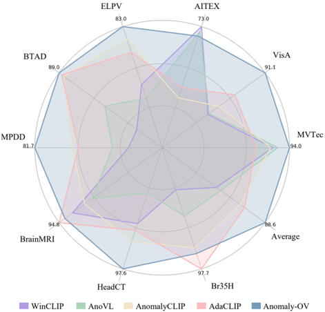

ments [9 , 25 , 32 – 34 , 37 , 42 , 82 , 84 , 95 , 97 , 104] have significantly improved the detection performance, these approaches assume the availability of a substantial number of normal samples. However, this assumption becomes impractical in certain scenarios due to strict data privacy policies and the significant human effort required for data classification, sometimes involving experts or specialists. Therefore, ZeroShot Anomaly Detection (ZSAD) is emerging as a popular research direction, leading to the development of many innovative methods [6 , 17 , 27 , 38 , 43 , 52 , 78 , 79 , 110 , 113].

Recent advances in Multimodal Large Language Models (MLLMs) [7 , 15 , 44 , 45 , 47 , 48 , 57 , 58 , 111] have shown revolutionary reasoning capabilities in various vision tasks [14 , 29 , 67 , 70 , 80 , 91 , 94 , 107 , 109]. However, the rea-

soning of image abnormalities has not been explored due to the challenges of collecting large-scale datasets and establishing benchmarks. Existing methods simply predict the likelihood of an anomaly without providing rationales [6 , 11 , 19 , 38 , 110]. In contrast, for better interpretability, robustness, and trustworthiness, people would expect models to explain why an image is considered anomalous and provide visual evidence. Interestingly, we find that recent advanced MLLMs, such as GPT-4o [72], fall short in AD &amp; reasoning. As shown in Figure 2, while the detection is correct, the explanation from GPT-4o lacks accuracy, indicating a gap in a comprehensive understanding of the anomaly.

To expedite research in AD &amp; reasoning, we establish the first visual instruction tuning dataset, Anomaly-Instruct125k, and the evaluation benchmark, VisA-D&amp;R, through intensive human efforts. After evaluating current generalist MLLMs, we observe that these models fail to accurately detect and describe fine-grained anomalous details in images. To address this, we propose Anomaly-OneVision (AnomalyOV), the first specialist visual assistant for ZSAD and reasoning. Unlike existing ZSAD methods [6 , 11 , 19 , 38 , 110], Anomaly-OV directly learns object-awareness abnormality embeddings in feature space using only the visual encoder. Inspired by human behavior in visual inspection, AnomalyOV employs a Look-Twice Feature Matching (LTFM) mechanism to assist its LLM in adaptively selecting and emphasizing the most suspicious abnormal visual tokens.

Extensive experiments demonstrate that Anomaly-OV achieves significant improvements over advanced generalist models in both detection and reasoning. Extended results of Anomaly-OV, from applications in industrial defect detection to 3D inspection and medical image diagnosis, are provided for future study. With precise descriptions and rationales of visual anomalies, our model can infer potential causes (see Figure 2), assess current impacts, and offer improvement suggestions, positioning itself as a reliable assistant for visual inspection. Our contributions are in two folds:

- We establish the first visual instruction tuning dataset and benchmark for anomaly detection and reasoning.
- We propose the first specialist visual assistant with stateof-the-art performance for this new impactful domain.

## 2. Related Work

Multimodal Large Language Models. Vision-Language Models (VLMs), such as CLIP [73], exhibit robust zero-shot classification capabilities and have been applied to a range of downstream vision tasks [10 , 53 , 56 , 61 , 86]. Combining a VLM's vision encoder and an LLM [20 , 62 , 74], MLLMs [15 , 48 , 49 , 57 , 111] enable text-based interactions related to visual content. MLLMs have shown remarkable reasoning capability, particularly when incorporated with prompting strategies such as Chain-of-Thought [66 , 88 , 105]. Recent studies have harnessed MLLMs to provide reasoning for

Figure 2. Industrial image anomaly reasoning results from GPT-4o [72] and our Anomaly-OV. The responses for fine-grained anomaly reasoning are highlighted, with the ground truth given for reference.

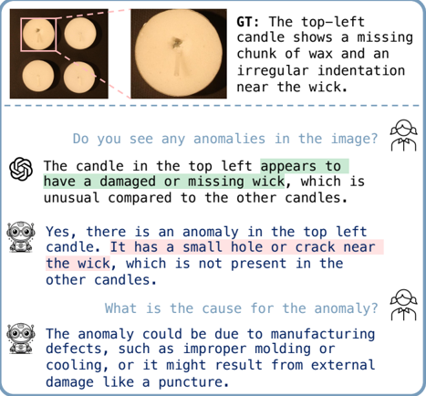

downstream tasks, e.g., video anomaly detection [67 , 94], affective computing [14 , 29], and visual commonsense reasoning [109], revealing more interpretability.

Unsupervised Anomaly Detection. Due to the scarcity and difficulty of collecting anomalous data, researchers often focus on the unsupervised AD setting, which exclusively uses normal data to train an AD model. Earlier studies, such as reconstruction-based [63 , 69 , 99], student-teacher [18 , 85 , 102], and augmentation-based [46] approaches, assume a large amount of normal data is available. These traditional approaches are less practical when data are restricted or expensive, such as in the medical domain.

Zero-Shot Anomaly Detection. Unlike unsupervised AD [35 , 77] and few-shot AD [22 , 28 , 36 , 51 , 112], ZSAD models directly access the likelihood of abnormality for a given image without requiring data specific to the target object. Existing works [6 , 19 , 38 , 110] accomplish ZSAD by comparing visual and textual features encoded by visual and text encoders of CLIP and constructing their positive (anomaly) and negative (normal) prompts in the format of:

<!-- formula-not-decoded -->

where Vi Vi and Wi Wi are handcrafted or learnable tokens, and object refers to the word object or the class name of the object. However, simply utilizing object to represent all kinds of objects cannot capture the class-awareness abnormality types. Also, for an intelligent visual assistant, the images should be totally blind to the user (object-agnostic).

Figure 3. Overview of the Anomaly-OV architecture. It consists of two training stages: (1) professional training for the anomaly expert, and (2) visual instruction tuning for anomaly detection and reasoning. Text and visual tokens are distinguished by different colors.

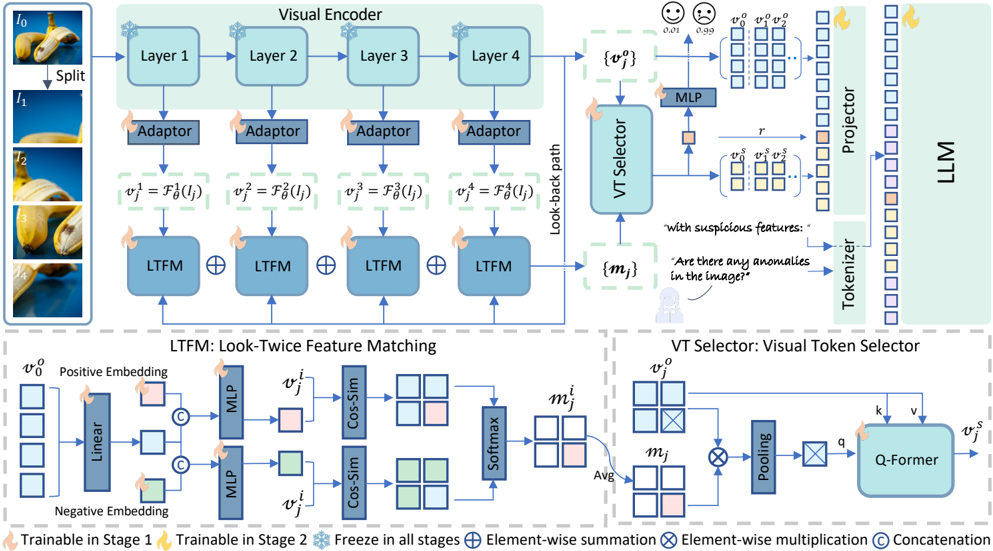

## 3. Method

## 3.1. Preliminary

Training an MLLM from scratch demands extensive data and computational resources to align the visual and textual embedding spaces and develop robust instruction-following capabilities. Recent studies [23 , 83 , 93] reveal that pretrained MLLMs function as generalists, possessing a broad knowledge base but underperforming in specialized domains. Therefore, our goal is to introduce an auxiliary specialist or expert model designed to guide the generalist in selecting and utilizing critical visual tokens. This approach circumvents the need for large-scale pre-training while preserving the generalization capacity of the original model.

We choose LLaVA-OneVision [44] as our base MLLM because it is open-sourced and performs similarly to other commercial models. LLaVA-OneVision follows the model architectures for LLaVA family [47 , 57 – 59] and other generic MLLMs, which typically consist of three major components: Visual Encoder, Projector, and LLM. The visual encoder [73 , 100] extracts the visual information from the raw images, the projector aligns the spaces of visual features with the word embedding, and the LLM is responsible for textual instruction processing and complex reasoning. Since the image resolution for CLIP pre-training is fixed, LLaVAOneVision leverages AnyRes with pooling strategy to scale up the input raw image resolution. Specifically, the highresolution images are divided into a prototyped number of crops, and the visual encoder independently processes the image crops before final spatial pooling.

## 3.2. Architecture Overview

With the same image-splitting strategy AnyRes as LLaVAOneVision, the input high-resolution image is split into several crops, and the new image set can be written as:

<!-- formula-not-decoded -->

where I0 I0 is the resized original image and Ij̸=0 refers to the image crops. As shown in Figure 3, the image set I will be processed by the visual encoder Fθ to generate the final visual features {v o j }. Similar to AnomalyCLIP [110], we store the outputs for four selected layers in the ViT [21] to capture the image representations from different levels and apply four adapters to compress the feature dimension. Then, the extracted visual features can be written as:

<!-- formula-not-decoded -->

where i denotes the i-th level and j refers to the index of corresponding image in I. These multi-level features have been demonstrated to be effective in capturing fine-grained local semantics by recent works [6 , 28 , 110].

Figure 4. Simulation of visual anomaly inspection by humans.

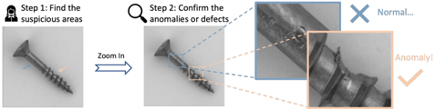

The large-scale pre-trained CLIP models align the projection spaces of the textual and visual encoder. Therefore, the encoded image features already contain the class information required by ZSAD. To avoid human involvement in object classification and reduce the model complexity, we remove the heavy text encoder commonly utilized in existing works and let the visual model itself parse the information for suspicious classes or objects. Specifically, the output visual features for the original image v o 0 are leveraged to provide the global description of the target object or regions in the look-back path. With the multi-level features and the global embeddings, the LTFM module is responsible for the recognition and localization of suspicious tokens.

Drawing inspiration from human visual inspection, where suspicious objects or regions are identified and then inspected closely (see Figure 4), we design the VT selector module for aggregating (zooming in) the crucial visual tokens and explicitly assisting the LLM in distinguishing these tokens from many irrelevant ones when dealing with instructions regarding anomaly detection and reasoning. Additionally, the original visual features are preserved to maintain the generalization capability of the base model on regular instructions, such as Can you describe the content of the image?

## 3.3. Look-Twice Feature Matching

Given the global object information v o 0 provided by the lookback path, we generate the class-awareness abnormality description by merging v o 0 with two learnable embeddings: e + ∈ R D and e − ∈ R D , where + and − indicate positive (anomalous) and negative (normal) patterns and D is the embedding dimension. Specifically, a linear layer T
i o T
i is applied along the token dimension to select and fuse useful tokens from v o 0 , and then the fused vector will be concatenated with e
+ and e − independently and pass through two MLPs {G + i , G − i } to generate the abnormality and normality descriptions {d + i , d − i }, which can be represented by:

<!-- formula-not-decoded -->

The visual features extracted from different levels of the ViT focus on different scales of semantics. Thus, the parameters of T
i o T
i and {G + i , G − i } should be independent for different levels, where i indicate the level number.

Similar to the zero-shot classification mechanism of CLIP

models, we calculate the possibilities of each patch token in v i j belonging to the anomalous patterns by combining cosine similarity and softmax operations:

<!-- formula-not-decoded -->

where m i j represents the significance map for visual tokens, τ is the temperature hyperparameter, and &lt;, &gt; refers to the cosine similarity operator. The patch weight in m i j indicates the closeness of the corresponding visual token to the anomalous pattern. Then, all the maps are averaged to capture the token significances from low to high levels:

<!-- formula-not-decoded -->

The visual features are leveraged twice in the forward and look-back paths, so this module is named by Look-Twice Feature Matching (LTFM), following the nature of two-step human visual inspection shown in Figure 4 .

## 3.4. Visual Token Selector

Under the image cropping strategy widely applied in recent MLLMs, there will be a large number of visual tokens for a high-resolution image, e.g., 7290 tokens for an image with 1152×1152 resolution in LLaVA-OneVision. While these tokens provide rich visual details, the LLM is required to pick the most useful information when adapting to a specific task. When the LLM lacks enough knowledge in this domain, the token-picking process will become complicated. Thus, our solution is to introduce a specialist or expert who knows which token is crucial or not and assist the LLM in selecting and emphasizing (zooming in) the crucial tokens.

Given the encoded visual tokens {v o j } for each image crop in I and the corresponding significance map mj , the suspicious tokens are emphasized by direct multiplication of the two tensors. Then, the normal tokens will be scaled to zero while the anomalous tokens will be maintained. After that, spatial average pooling P is applied to reduce the number of tokens. This process can be written as:

<!-- formula-not-decoded -->

where q j ∈ R h×w×D refers to the pooled query tokens. Empirically, setting h = w = 2 provides a better trade-off than other options. Then, a Q-Former Q [49] is leveraged to aggregate the correlated tokens in the original output by forwarding q j as the query and v o j as the key and value:

<!-- formula-not-decoded -->

The Visual Token Selector (VT Selector) serves as a tool for the anomaly expert to hand-pick visual tokens that contain the most suspicious semantics for a given image.

Figure 5. Composition of the instruction data in Anomaly-Instruct-125k. There are four main types of image samples: in-the-wild , industrial , medical, and 3D (in the format of multi-view images), covering most image anomaly detection tasks and enabling the possibility of a unified assistant for visual inspection. The reasoning words are highlighted in blue. For more information about dataset establishment, statistics, and the data collection pipeline, please refer to Section A1 in the supplementary.

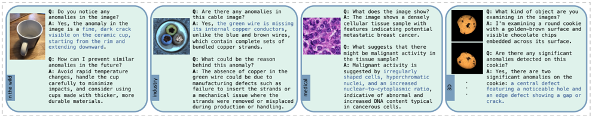

## 3.5. Inference and Loss

Anomaly Prediction. In the traditional anomaly detection task, the model predicts the possibility of the image being abnormal. To achieve anomaly score prediction, we aggregate the anomaly information from all the image crops by an average operation weighted on the significance maps:

<!-- formula-not-decoded -->

where P is the same spatial pooling in VT Selector and r(I) is a vector containing the global anomaly information for the entire image. Then, the anomaly expert can calculate the image-level abnormal possibility by parsing r(I):

<!-- formula-not-decoded -->

where G o is an MLP for distinguishing normal and abnormal semantics. To handle the unbalanced sample distribution, we employ the balanced BCE loss as the professional training objective for the anomaly expert components.

Text Generation. Instead of directly forwarding the concatenation of the original {v o j } and the selected {r(I) , v s j } visual tokens into the LLM, we apply an indication prompt with &lt;adv&gt; suspicious feature: in the middle of the two series of tokens, which will highlight the selected tokens for LLM when handling anomaly-related instructions. This approach can be considered a form of prompt engineering in MLLMs. Besides, the &lt;adv&gt; is chosen from {highly , moderately , slightly} and is determined by score(I) and predefined thresholds {slow , s high }. When the input image I has a high likelihood of anomaly, the LLM will place greater emphasis on the selected tokens; otherwise, these tokens will have less significance. The text generation is implemented by the original auto-regressive token prediction mechanism of LLM:

<!-- formula-not-decoded -->

where X a,&lt;t and X q,&lt;t are the answer and instruction tokens from all prior turns before the current prediction token xt for a sequence of length L. The entire model is parameterized by θ and trained by the original language model cross-entropy loss for each predicted answer token xt .

## 4. Dataset and Benchmark

The lack of multimodal instruction-following data for image anomaly detection and reasoning hinders the development of special intelligent assistants in this domain. Even though AnomalyGPT [28] introduces a prompt tuning dataset by simulating the anomalies, the scale of their dataset and the diversity of their instructions and answers are limited, only focusing on anomaly localization. To resolve the data scarcity issue, we establish the first large-scale instruction tuning dataset: Anomaly-Instruct-125k and the corresponding anomaly detection and reasoning benchmark: VisA-D&amp;R .

## 4.1. Anomaly-Instruct-125k

LLaVA [57] builds its instruction tuning dataset by leveraging the image caption and bounding boxes available in the COCO dataset[55] to prompt the text-only GPT-4. ShareGPT4V [8] provides a higher-quality dataset by directly prompting GPT-4V [71]. However, there is no image caption provided in existing anomaly detection datasets [1 , 2], and no matter GPT-4V [71] or most recent GPT-4o [72] cannot accurately locate and describe the anomalies in the image without explicit human involvement.

To resolve these issues, we design a new prompt pipeline for accurate anomaly description generation. Since most of the datasets contain annotations for anomaly types, we manually combine the class name and anomaly type, such as a [capsule] with [poke] on surface. If the anomaly masks are provided, we draw bounding boxes on the images to highlight the anomalous area. The short description and the image with (or w/o) bounding boxes are used to prompt GPT-4o to generate the detailed image and anomaly descriptions. Then, we employ an in-context learning strategy similar to LLaVA to create the instructions.

Figure 6. Prompt examples in VisA-D&amp;R for detection and reasoning. The complex reasoning instructions are highlighted.

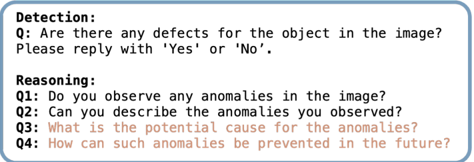

For a unified visual inspection dataset, precise instruction data is collected from MVTec AD [2], the training set of BMAD [1], Anomaly-ShapeNet [50], Real3D-AD [60], and MVTec-3D AD [4], covering both 2D to 3D data across industry to medical domains. The 3D point cloud data are converted into 9 multi-view images, and the corresponding masks are rendered using predefined camera positions. However, the diversities and scales of these datasets are relatively limited, probably due to the difficulty of collecting anomaly images. To scale up the instruction data, we introduce an automatic anomaly data collection pipeline combining GPT4o [72] and Google Image Search [26] for image collection, data cleaning, and instruction generation. Finally, 72k in-thewild images (named as WebAD) targeting anomaly detection are collected, significantly enriching our instruction dataset. Several samples from Anomaly-Instruct-125k are shown in Figure 5. The instructions are mainly in the format of multi-round conversations, covering anomaly detection and description in low-level reasoning and potential cause and future suggestions for complex understanding.

## 4.2. VisA-D&amp;R

VisA [115] is a classic but challenging industrial anomaly detection dataset, providing fine-grained anomaly type and segmentation for each image. For evaluation of the anomaly detection and reasoning performance on existing and future methods, we select 10 classes from VisA and follow a similar data generation pipeline of Anomaly-Instruct-125k to create the benchmark. Differently, significant human effort has been invested in meticulously reviewing all generated images and anomaly descriptions. Wrong descriptions are picked out and re-annotated by humans before utilizing them for Q&amp;A generation. Totally, the benchmark consists of 761 normal samples and 1000 anomalous ones.

For evaluating detection performance, questions designed to elicit a one-word answer are used to prompt the MLLMs (Figure 6), with results quantified using Accuracy, Precision, Recall, and F1-score. We divide the reasoning performance into two parts: low-level reasoning that focuses on the description of visual defects or anomalies and complex reasoning requiring the MLLMs to provide the potential cause and future improvement strategies for the detected anomalies, where ROUGE-L [54], Sentence-BERT (SBERT) [75], and

GPT-Score (GPT-4 as the judge [57]) are utilized to quantify the similarity between generated text and ground truth. Note that low-level reasoning is highly correlated to detection performance, while anomaly-type descriptions of low-level reasoning determine the output of complex reasoning.

## 5. Experiments

## 5.1. Training &amp; Evaluation

There are two independent training stages for Anomaly-OV. In Stage 1, the components of the anomaly expert are trained to obtain the token selection capability, targeting traditional ZSAD. This stage utilizes all of the data with anomaly labels in Anomaly-Instruct-125k. Similar to previous works [6 , 110], when evaluating the model on the datasets contained in the training set, the corresponding datasets are replaced by VisA [115]. In Stage 2, the anomaly expert and visual encoder are frozen, while the projector and LLM are trainable. In addition to our instruction dataset, we sample around 350k data from the original training recipe of LLaVAOneVision to maintain the generalization ability. For more details on training, please refer to the supplementary.

The ZSAD performance for the anomaly expert is evaluated on nine benchmarks, including MVTec AD [2], VisA [115], AITEX [81], ELPV [16], BTAD [68], and MPDD [39] for industrial inspection, and BrainMRI [40], HeadCT [41], and Br35H [30] for medical diagnosis. AUROC (Area Under the Receiver Operating Characteristic) is leveraged to quantify the image-level AD performance. For text-based anomaly detection, both normal and anomaly data are employed to assess the accuracy by examining if the generated text contains the word Yes. Differently, only anomaly data are utilized to prompt the MLLMs to determine their anomaly reasoning capabilities since the justifications of normality are similar for different models.

Table 1. Ablation study for the anomaly expert of Anomaly-OV. w/o. Look-back refers to the removal of v o 0 in LTFM.

| Method                          |   MVTec  |   VisA  |   HeadCT  |   BrainMRI |
|---------------------------------|----------|---------|-----------|------------|
| Full Model                      |     94   |    91.1 |      97.6 |       93.9 |
| w/o. Look-back 
 w/o. e
 + & e− |     92.8 |    90.5 |      96.6 |       93.5 |
| w/o. Look-back 
 w/o. e
 + & e− |     92.1 |    90.1 |      94.7 |       92.9 |
| w/o. Look-back 
 w/o. e
 + & e− |     91.7 |    89.9 |      92.8 |       95.1 |
| w/o. Look-back 
 w/o. e
 + & e− |     88.5 |    88.9 |      91.2 |       93.4 |

## 5.2. Zero-Shot Anomaly Detection

As shown in Table 2, compared with existing methods, the anomaly expert of Anomaly-OV achieves significant imagelevel AUROC improvements on most of the ZSAD benchmarks, which demonstrates that the text encoder widely applied in existing models is not necessary. The success of our model mainly originates from the extra data of WebAD (Table 1), which enables the model to learn more generic

Table 2. Quantitative comparison of Image-level AUROC on different ZSAD methods (some of the results are borrowed from [6 , 110 , 114]). The best and the second-best results are bolded and underlined, respectively. Please refer to the supplementary for more detailed results.

| Model             | Industrial Defects    | Industrial Defects    | Industrial Defects    | Industrial Defects    | Industrial Defects    | Industrial Defects    | Medical Anomalies    | Medical Anomalies    | Medical Anomalies    | Average   |
|-------------------|-----------------------|-----------------------|-----------------------|-----------------------|-----------------------|-----------------------|----------------------|----------------------|----------------------|-----------|
|                   | MVTec AD              | VisA                  | AITEX                 | ELPV                  | BTAD                  | MPDD                  | BrainMRI             | HeadCT               | Br35H                |           |
| CLIP [73]         | 74.1                  | 66.4                  | 71.0                  | 59.2                  | 34.5                  | 54.3                  | 73.9                 | 56.5                 | 78.4                 | 63.1      |
| CoOp [108]        | 88.8                  | 62.8                  | 66.2                  | 73.0                  | 66.8                  | 55.1                  | 61.3                 | 78.4                 | 86.0                 | 70.9      |
| WinCLIP [38]      | 91.8                  | 78.8                  | 73.0                  | 74.0                  | 68.2                  | 63.6                  | 92.6                 | 90.0                 | 80.5                 | 79.2      |
| APRIL-GAN [11]    | 86.2                  | 78.0                  | 57.6                  | 65.5                  | 73.6                  | 73.0                  | 89.3                 | 89.1                 | 93.1                 | 78.4      |
| AnoVL [19]        | 92.5                  | 79.2                  | 72.5                  | 70.6                  | 80.3                  | 68.9                  | 88.7                 | 81.6                 | 88.4                 | 80.3      |
| AnomalyCLIP [110] | 91.5                  | 82.1                  | 62.2                  | 81.5                  | 88.3                  | 77.0                  | 90.3                 | 93.4                 | 94.6                 | 84.5      |
| AdaCLIP [6]       | 89.2                  | 85.8                  | 64.5                  | 79.7                  | 88.6                  | 76.0                  | 94.8                 | 91.4                 | 97.7                 | 85.3      |
| Ours              | 94.0                  | 91.1                  | 72.0                  | 83.0                  | 89.0                  | 81.7                  | 93.9                 | 97.6                 | 95.5                 | 88.6      |

semantics for normality and abnormality from the data distribution in the absence of the text encoder. This observation also reveals that large-scale in-the-wild online data can benefit zero-shot performance in anomaly detection.

While the Q-Former reduces the model performance on BrainMRI, it shows effectiveness on most benchmarks, indicating the importance of token aggregation. Similarly, the look-back information and two learnable embeddings are required for describing class-awareness abnormality and distinguishing positive and negative features, respectively. As previously discussed, the anomaly expert is responsible for selecting suspicious visual tokens for the LLM, and the significance maps shown in Figure 7 demonstrate the interpretable token selection mechanism. The high intensities are automatically distributed around the anomalous areas even without any supervision of the anomaly masks.

Figure 7. Visualization of the significance map on VisA samples.

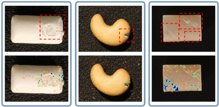

## 5.3. Anomaly Detection &amp; Reasoning

With the strong capabilities of the anomaly expert for zeroshot detection and suspicious token selection, Anomaly-OV accomplishes significant improvement in text-based anomaly detection and reasoning over other open-sourced generalist MLLMs, as shown in Table 4. Here are a few observations: i) While a larger language model cannot guarantee better detection performance, it always provides greater reasoning ability; ii) Most of the existing MLLMs present much lower recall than precision, indicating their insensitivity to visual anomalies; iii) GPT-4o shows stronger reasoning ability

Table 3. Anomaly-OV presents more accurate anomaly detection.

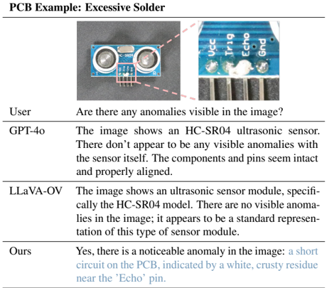

| User     | Are there any anomalies visible in the image                                                                                                                                                              |
|----------|-----------------------------------------------------------------------------------------------------------------------------------------------------------------------------------------------------------|
| GPT-4o   | The image shows an HC-SR04 ultrasonic sensor
 There don’t appear to be any visible anomalies with
 the sensor itself. The components and pins seem intact
 and properly aligned.                          |
| LLaVA-OV | The image shows an ultrasonic sensor module, specifi
 cally the HC-SR04 model. There are no visible anoma
 lies in the image; it appears to be a standard represen
 tation of this type of sensor module. |
| Ours     | Yes, there is a noticeable anomaly in the image: a short
 circuit on the PCB, indicated by a white, crusty residue
 near the ’Echo’ pin.                                                                  |

compared to other open-sourced models. Table 3 and Table 5 provide the qualitative comparison of our Anomaly-OV with its base model LLaVA-OV-7B [44] and GPT-4o [72]. Both GPT-4o and LLaVA-OV show insensitivity to anomalous features and cannot accurately detect the anomaly in the image. Sometimes, GPT-4o knows the image is anomalous but fails to describe the anomalies precisely.

We provide the fine-tuned version of the base model LLaVA-OV-0.5B on Anomaly-Instruct-125k, which presents much higher accuracy and more balanced precision and recall than its original version. This demonstrates the effectiveness of our instruction-tuning dataset. By integrating the anomaly expert with the base model, our Anomaly-OV-0.5B achieves 0 . 08 accuracy and 0 . 06 F1-score improvements in text-based anomaly detection and better reasoning capability in low-level and complex settings. Equipped with a larger language model, Anomaly-OV-7B provides the best detection performance among all the existing MLLMs and shows comparable reasoning ability with GPT-4o. Notably, we observe that the anomaly expert restricts the detection perfor-

Table 4. Quantitative comparison of text-based anomaly detection and reasoning for MLLMs. Notably, the Accuracy and F1-score for the anomaly expert of Anomaly-OV can be calculated as {0 . 78 , 0 . 77} with threshold 0 . 5. * indicates the model is fine-tuned on our dataset.

| Model               | Anomaly Detection    | Anomaly Detection    | Anomaly Detection    | Anomaly Detection    | Low-level Reasoning    | Low-level Reasoning    | Low-level Reasoning    | Complex Reasoning   | Complex Reasoning   |
|---------------------|----------------------|----------------------|----------------------|----------------------|------------------------|------------------------|------------------------|---------------------|---------------------|
|                     | Accuracy             | Precision            | Recall               | F1-score             | ROUGE-L                | SBERT                  | GPT-Score              | SBERT               | GPT-Score           |
| GPT-4V [71]         | 0.68                 | 0.90                 | 0.49                 | 0.55                 | 0.16                   | 0.65                   | 3.31                   | 0.77                | 5.64                |
| GPT-4o [72]         | 0.70                 | 0.83                 | 0.71                 | 0.68                 | 0.24                   | 0.71                   | 4.84                   | 0.81                | 6.89                |
| Qwen2-VL-2B [87]    | 0.65                 | 0.87                 | 0.55                 | 0.59                 | 0.22                   | 0.55                   | 1.94                   | 0.74                | 4.26                |
| Qwen2-VL-7B [87]    | 0.76                 | 0.91                 | 0.69                 | 0.75                 | 0.25                   | 0.61                   | 3.09                   | 0.68                | 4.62                |
| InternVL-2-8B [13]  | 0.74                 | 0.78                 | 0.81                 | 0.76                 | 0.23                   | 0.73                   | 3.69                   | 0.80                | 5.08                |
| InternVL-2-26B [13] | 0.73                 | 0.86                 | 0.66                 | 0.68                 | 0.21                   | 0.74                   | 4.13                   | 0.80                | 5.49                |
| IXC-2.5-7B [101]    | 0.72                 | 0.88                 | 0.63                 | 0.67                 | 0.21                   | 0.58                   | 2.45                   | 0.77                | 5.14                |
| LLaVA-OV-0.5B [44]  | 0.54                 | 0.70                 | 0.19                 | 0.28                 | 0.20                   | 0.63                   | 2.54                   | 0.81                | 4.34                |
| LLaVA-OV-7B [44]    | 0.71                 | 0.95                 | 0.56                 | 0.63                 | 0.24                   | 0.66                   | 3.57                   | 0.79                | 5.44                |
| LLaVA-OV-0.5B*      | 0.71                 | 0.77                 | 0.84                 | 0.76                 | 0.31                   | 0.70                   | 3.69                   | 0.82                | 5.31                |
| Anomaly-OV-0.5B     | 0.79                 | 0.86                 | 0.83                 | 0.82                 | 0.33                   | 0.72                   | 3.87                   | 0.83                | 5.67                |
| Anomaly-OV-7B       | 0.79                 | 0.83                 | 0.86                 | 0.83                 | 0.34                   | 0.73                   | 4.26                   | 0.84                | 6.34                |

mance of Anomaly-OV. Therefore, the design of a stronger anomaly expert is suggested for future works.

Table 5. Anomaly-OV presents more precise anomaly reasoning.

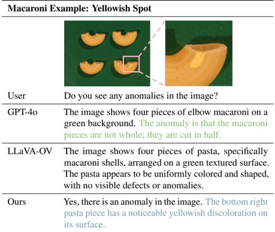

| Macaroni Example: Yellowish Spot   | Macaroni Example: Yellowish Spot                                                                                                                                                                       |
|------------------------------------|--------------------------------------------------------------------------------------------------------------------------------------------------------------------------------------------------------|
| User                               |                                                                                                                                                                                                        |
| GPT-4o                             | The image shows four pieces of elbow macaroni on a
 green background. The anomaly is that the macaroni
 pieces are not whole; they are cut in half                                                     |
| LLaVA-OV                           | The image shows four pieces of pasta, specifically
 macaroni shells, arranged on a green textured surface
 The pasta appears to be uniformly colored and shaped
 with no visible defects or anomalies. |
| Ours                               | Yes, there is an anomaly in the image. The bottom right
 pasta piece has a noticeable yellowish discoloration on
 its surface.                                                                         |

## 5.4. Extension

With the generalization and multi-image processing capabilities of MLLMs, it is possible to build a unified assistant for visual inspection. Table 6 demonstrates the comprehensive knowledge of Anomaly-OV (without using AnomalyShapeNet [50] for training) on 3D and medical (testing set of BMAD [1]) AD &amp; reasoning. More data, benchmarks, and investigation on a unified model are meaningful.

## 6. Conclusion

In this paper, we establish the first large-scale visual instruction tuning dataset, Anomaly-Instruct-125k, and the corresponding benchmark, VisA-D&amp;R, to address the data scarcity issue for visual anomaly detection and reasoning.

Table 6. Extension to 3D and medical AD &amp; reasoning.

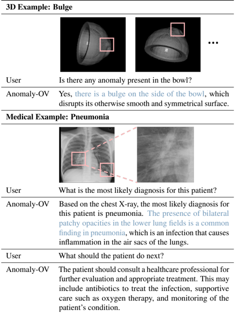

Then, a specialist MLLM, Anomaly-OV, targeting visual inspection is introduced to serve as the baseline in this domain. Anomaly-OV leverages an anomaly expert to assist the LLM with suspicious visual token selection and presents significant improvements on both traditional ZSAD and text-based anomaly detection and reasoning tasks over existing methods. Extension to 3D and medical domains is demonstrated.

## References

- [1] Jinan Bao, Hanshi Sun, Hanqiu Deng, Yinsheng He, Zhaoxiang Zhang, and Xingyu Li. Bmad: Benchmarks for medical anomaly detection. In Proceedings of the IEEE/CVF Conference on Computer Vision and Pattern Recognition, pages 4042–4053, 2024. 1 , 5 , 6 , 8 , 14
- [2] Paul Bergmann, Michael Fauser, David Sattlegger, and Carsten Steger. Mvtec ad–a comprehensive real-world dataset for unsupervised anomaly detection. In Proceedings of the IEEE/CVF conference on computer vision and pattern recognition, pages 9592–9600, 2019. 1 , 5 , 6 , 14 , 15
- [3] Paul Bergmann, Michael Fauser, David Sattlegger, and Carsten Steger. Uninformed students: Student-teacher anomaly detection with discriminative latent embeddings. In Proceedings of the IEEE/CVF conference on computer vision and pattern recognition, pages 4183–4192, 2020. 1
- [4] Paul Bergmann, Xin Jin, David Sattlegger, and Carsten Steger. The mvtec 3d-ad dataset for unsupervised 3d anomaly detection and localization. In Proceedings of the 17th International Joint Conference on Computer Vision, Imaging and Computer Graphics Theory and Applications. SCITEPRESS - Science and Technology Publications, 2022. 6
- [5] Tri Cao, Jiawen Zhu, and Guansong Pang. Anomaly detection under distribution shift. In Proceedings of the IEEE/CVF International Conference on Computer Vision , pages 6511–6523, 2023. 1
- [6] Yunkang Cao, Jiangning Zhang, Luca Frittoli, Yuqi Cheng, Weiming Shen, and Giacomo Boracchi. Adaclip: Adapting clip with hybrid learnable prompts for zero-shot anomaly detection. In European Conference on Computer Vision , pages 55–72. Springer, 2025. 1 , 2 , 3 , 6 , 7
- [7] Boyuan Chen, Zhuo Xu, Sean Kirmani, Brain Ichter, Dorsa Sadigh, Leonidas Guibas, and Fei Xia. Spatialvlm: Endowing vision-language models with spatial reasoning capabilities. In Proceedings of the IEEE/CVF Conference on Computer Vision and Pattern Recognition, pages 14455–14465, 2024. 1
- [8] Lin Chen, Jinsong Li, Xiaoyi Dong, Pan Zhang, Conghui He, Jiaqi Wang, Feng Zhao, and Dahua Lin. Sharegpt4v: Improving large multi-modal models with better captions, 2023. 5 , 14
- [9] Qiyu Chen, Huiyuan Luo, Chengkan Lv, and Zhengtao Zhang. A unified anomaly synthesis strategy with gradient ascent for industrial anomaly detection and localization. arXiv preprint arXiv:2407.09359, 2024. 1
- [10] Runnan Chen, Youquan Liu, Lingdong Kong, Xinge Zhu, Yuexin Ma, Yikang Li, Yuenan Hou, Yu Qiao, and Wenping Wang. Clip2scene: Towards label-efficient 3d scene understanding by clip. In Proceedings of the IEEE/CVF Conference on Computer Vision and Pattern Recognition , pages 7020–7030, 2023. 2
- [11] Xuhai Chen, Yue Han, and Jiangning Zhang. April-gan: A zero-/few-shot anomaly classification and segmentation method for cvpr 2023 vand workshop challenge tracks 1&amp;2: 1st place on zero-shot ad and 4th place on few-shot ad, 2023. 2 , 7
- [12] Yuanhong Chen, Yu Tian, Guansong Pang, and Gustavo Carneiro. Deep one-class classification via interpolated gaussian descriptor. In Proceedings of the AAAI Conference on Artificial Intelligence, pages 383–392, 2022. 1
- [13] Zhe Chen, Weiyun Wang, Hao Tian, Shenglong Ye, Zhangwei Gao, Erfei Cui, Wenwen Tong, Kongzhi Hu, Jiapeng Luo, Zheng Ma, Ji Ma, Jiaqi Wang, Xiaoyi Dong, Hang Yan, Hewei Guo, Conghui He, Botian Shi, Zhenjiang Jin, Chao Xu, Bin Wang, Xingjian Wei, Wei Li, Wenjian Zhang, Bo Zhang, Pinlong Cai, Licheng Wen, Xiangchao Yan, Min Dou, Lewei Lu, Xizhou Zhu, Tong Lu, Dahua Lin, Yu Qiao, Jifeng Dai, and Wenhai Wang. How far are we to gpt-4v? closing the gap to commercial multimodal models with opensource suites, 2024. 8
- [14] Zebang Cheng, Zhi-Qi Cheng, Jun-Yan He, Jingdong Sun, Kai Wang, Yuxiang Lin, Zheng Lian, Xiaojiang Peng, and Alexander Hauptmann. Emotion-llama: Multimodal emotion recognition and reasoning with instruction tuning. In Conference on Neural Information Processing Systems , 2024. 1 , 2
- [15] Wenliang Dai, Junnan Li, Dongxu Li, Anthony Tiong, Junqi Zhao, Weisheng Wang, Boyang Li, Pascale Fung, and Steven Hoi. InstructBLIP: Towards general-purpose vision-language models with instruction tuning. In Thirtyseventh Conference on Neural Information Processing Systems, 2023. 1 , 2
- [16] Sergiu Deitsch, Vincent Christlein, Stephan Berger, Claudia Buerhop-Lutz, Andreas Maier, Florian Gallwitz, and Christian Riess. Automatic classification of defective photovoltaic module cells in electroluminescence images. Solar Energy , 185:455–468, 2019. 6
- [17] Chenghao Deng, Haote Xu, Xiaolu Chen, Haodi Xu, Xiaotong Tu, Xinghao Ding, and Yue Huang. Simclip: Refining image-text alignment with simple prompts for zero-/fewshot anomaly detection. In Proceedings of the 32nd ACM International Conference on Multimedia, pages 1761–1770, 2024. 1
- [18] Hanqiu Deng and Xingyu Li. Anomaly detection via reverse distillation from one-class embedding. In IEEE/CVF conference on computer vision and pattern recognition, 2022. 2
- [19] Hanqiu Deng, Zhaoxiang Zhang, Jinan Bao, and Xingyu Li. Anovl: Adapting vision-language models for unified zeroshot anomaly localization. arXiv preprint arXiv:2308.15939 , 2023. 1 , 2 , 7
- [20] Jacob Devlin, Ming-Wei Chang, Kenton Lee, and Kristina Toutanova. Bert: Pre-training of deep bidirectional transformers for language understanding, 2019. 2
- [21] Alexey Dosovitskiy, Lucas Beyer, Alexander Kolesnikov, Dirk Weissenborn, Xiaohua Zhai, Thomas Unterthiner, Mostafa Dehghani, Matthias Minderer, Georg Heigold, Sylvain Gelly, Jakob Uszkoreit, and Neil Houlsby. An image is worth 16x16 words: Transformers for image recognition at scale. In International Conference on Learning Representations, 2021. 3
- [22] Zheng Fang, Xiaoyang Wang, Haocheng Li, Jiejie Liu, Qiugui Hu, and Jimin Xiao. Fastrecon: Few-shot industrial

anomaly detection via fast feature reconstruction. In Proceedings of the IEEE/CVF International Conference on Computer Vision, pages 17481–17490, 2023. 2

- [23] Yao Feng, Jing Lin, Sai Kumar Dwivedi, Yu Sun, Priyanka Patel, and Michael J Black. Chatpose: Chatting about 3d human pose. In Proceedings of the IEEE/CVF Conference on Computer Vision and Pattern Recognition, pages 2093– 2103, 2024. 3
- [24] Tharindu Fernando, Harshala Gammulle, Simon Denman, Sridha Sridharan, and Clinton Fookes. Deep learning for medical anomaly detection–a survey. ACM Computing Surveys (CSUR), 54(7):1–37, 2021. 1
- [25] Matic Fucka, Vitjan Zavrtanik, and Danijel Sko ˇ ˇ caj. ˇ ˇ Transfusion–a transparency-based diffusion model for anomaly detection. In European conference on computer vision, pages 91–108. Springer, 2025. 1
- [26] Google. Google-images-search 1.4.7, 2024. https:// pypi.org/project/Google-Images-Search . 6 , 14
- [27] Zhaopeng Gu, Bingke Zhu, Guibo Zhu, Yingying Chen, Hao Li, Ming Tang, and Jinqiao Wang. Filo: Zero-shot anomaly detection by fine-grained description and high-quality localization. In Proceedings of the 32nd ACM International Conference on Multimedia, pages 2041–2049, 2024. 1
- [28] Zhaopeng Gu, Bingke Zhu, Guibo Zhu, Yingying Chen, Ming Tang, and Jinqiao Wang. Anomalygpt: Detecting industrial anomalies using large vision-language models. In Proceedings of the AAAI Conference on Artificial Intelligence, pages 1932–1940, 2024. 1 , 2 , 3 , 5
- [29] Yuxiang Guo, Faizan Siddiqui, Yang Zhao, Rama Chellappa, and Shao-Yuan Lo. Stimuvar: Spatiotemporal stimuli-aware video affective reasoning with multimodal large language models. arXiv preprint arXiv:2409.00304, 2024. 1 , 2
- [30] Ahmed Hamada. Br35h: Brain tumor detection 2020, 2020. 6
- [31] Changhee Han, Leonardo Rundo, Kohei Murao, Tomoyuki Noguchi, Yuki Shimahara, Zoltan´ ´ Ad ´ am Milacski, Saori ´ ´ Koshino, Evis Sala, Hideki Nakayama, and Shin'ichi Satoh. Madgan: Unsupervised medical anomaly detection gan using multiple adjacent brain mri slice reconstruction. BMC bioinformatics, 22:1–20, 2021. 1
- [32] Liren He, Zhengkai Jiang, Jinlong Peng, Liang Liu, Qiangang Du, Xiaobin Hu, Wenbing Zhu, Mingmin Chi, Yabiao Wang, and Chengjie Wang. Learning unified reference representation for unsupervised multi-class anomaly detection. arXiv preprint arXiv:2403.11561, 2024. 1
- [33] Chih-Hui Ho, Kuan-Chuan Peng, and Nuno Vasconcelos. Long-tailed anomaly detection with learnable class names. In Proceedings of the IEEE/CVF Conference on Computer Vision and Pattern Recognition, pages 12435–12446, 2024.
- [34] Jinlei Hou, Yingying Zhang, Qiaoyong Zhong, Di Xie, Shiliang Pu, and Hong Zhou. Divide-and-assemble: Learning block-wise memory for unsupervised anomaly detection. In Proceedings of the IEEE/CVF International Conference on Computer Vision, pages 8791–8800, 2021. 1
- [35] Chaoqin Huang, Haoyan Guan, Aofan Jiang, Ya Zhang, Michael Spratling, and Yan-Feng Wang. Registration based
14. few-shot anomaly detection. In European Conference on Computer Vision, pages 303–319. Springer, 2022. 1 , 2
- [36] Chaoqin Huang, Aofan Jiang, Jinghao Feng, Ya Zhang, Xinchao Wang, and Yanfeng Wang. Adapting visual-language models for generalizable anomaly detection in medical images. In Proceedings of the IEEE/CVF Conference on Computer Vision and Pattern Recognition, pages 11375–11385, 2024. 1 , 2
- [37] Brian KS Isaac-Medina, Yona Falinie A Gaus, Neelanjan Bhowmik, and Toby P Breckon. Towards open-world objectbased anomaly detection via self-supervised outlier synthesis. In European Conference on Computer Vision (ECCV) , 2024. 1
- [38] Jongheon Jeong, Yang Zou, Taewan Kim, Dongqing Zhang, Avinash Ravichandran, and Onkar Dabeer. Winclip: Zero/few-shot anomaly classification and segmentation. In Proceedings of the IEEE/CVF Conference on Computer Vision and Pattern Recognition, pages 19606–19616, 2023. 1 , 2 , 7
- [39] Stepan Jezek, Martin Jonak, Radim Burget, Pavel Dvorak, and Milos Skotak. Deep learning-based defect detection of metal parts: evaluating current methods in complex conditions. In 2021 13th International congress on ultra modern telecommunications and control systems and workshops (ICUMT), pages 66–71. IEEE, 2021. 6
- [40] Pranita Balaji Kanade and PP Gumaste. Brain tumor detection using mri images. Brain, 3(2):146–150, 2015. 6
- [41] Felipe Campos Kitamura. Head ct - hemorrhage, 2018. 6
- [42] Mingyu Lee and Jongwon Choi. Text-guided variational image generation for industrial anomaly detection and segmentation. In Proceedings of the IEEE/CVF Conference on Computer Vision and Pattern Recognition, pages 26519– 26528, 2024. 1
- [43] Aodong Li, Chen Qiu, Marius Kloft, Padhraic Smyth, Maja Rudolph, and Stephan Mandt. Zero-shot anomaly detection via batch normalization. Advances in Neural Information Processing Systems, 36, 2024. 1
- [44] Bo Li, Yuanhan Zhang, Dong Guo, Renrui Zhang, Feng Li, Hao Zhang, Kaichen Zhang, Peiyuan Zhang, Yanwei Li, Ziwei Liu, and Chunyuan Li. Llava-onevision: Easy visual task transfer, 2024. 1 , 3 , 7 , 8 , 15
- [45] Chunyuan Li, Cliff Wong, Sheng Zhang, Naoto Usuyama, Haotian Liu, Jianwei Yang, Tristan Naumann, Hoifung Poon, and Jianfeng Gao. LLaVA-med: Training a large languageand-vision assistant for biomedicine in one day. In Thirtyseventh Conference on Neural Information Processing Systems Datasets and Benchmarks Track, 2023. 1 , 15
- [46] Chun-Liang Li, Kihyuk Sohn, Jinsung Yoon, and Tomas Pfister. Cutpaste: Self-supervised learning for anomaly detection and localization. In IEEE/CVF conference on computer vision and pattern recognition, 2021. 2
- [47] Feng Li, Renrui Zhang, Hao Zhang, Yuanhan Zhang, Bo Li, Wei Li, Zejun Ma, and Chunyuan Li. Llava-next-interleave: Tackling multi-image, video, and 3d in large multimodal models. arXiv preprint arXiv:2407.07895, 2024. 1 , 3
- [48] Junnan Li, Dongxu Li, Caiming Xiong, and Steven Hoi. Blip: Bootstrapping language-image pre-training for unified vision-language understanding and generation. In Interna-

- tional conference on machine learning, pages 12888–12900. PMLR, 2022. 1 , 2
- [49] Junnan Li, Dongxu Li, Silvio Savarese, and Steven Hoi. Blip2: Bootstrapping language-image pre-training with frozen image encoders and large language models. In International conference on machine learning, pages 19730–19742. PMLR, 2023. 2 , 4
- [50] Wenqiao Li, Xiaohao Xu, Yao Gu, Bozhong Zheng, Shenghua Gao, and Yingna Wu. Towards scalable 3d anomaly detection and localization: A benchmark via 3d anomaly synthesis and a self-supervised learning network. In Proceedings of the IEEE/CVF Conference on Computer Vision and Pattern Recognition, pages 22207–22216, 2024. 6 , 8
- [51] Xiaofan Li, Zhizhong Zhang, Xin Tan, Chengwei Chen, Yanyun Qu, Yuan Xie, and Lizhuang Ma. Promptad: Learning prompts with only normal samples for few-shot anomaly detection. In Proceedings of the IEEE/CVF Conference on Computer Vision and Pattern Recognition, pages 16838– 16848, 2024. 1 , 2
- [52] Yiting Li, Adam Goodge, Fayao Liu, and Chuan-Sheng Foo. Promptad: Zero-shot anomaly detection using text prompts. In Proceedings of the IEEE/CVF Winter Conference on Applications of Computer Vision, pages 1093–1102, 2024. 1
- [53] Feng Liang, Bichen Wu, Xiaoliang Dai, Kunpeng Li, Yinan Zhao, Hang Zhang, Peizhao Zhang, Peter Vajda, and Diana Marculescu. Open-vocabulary semantic segmentation with mask-adapted clip. In Proceedings of the IEEE/CVF Conference on Computer Vision and Pattern Recognition, pages 7061–7070, 2023. 2
- [54] Chin-Yew Lin. Rouge: A package for automatic evaluation of summaries. In Text summarization branches out, pages 74–81, 2004. 6
- [55] Tsung-Yi Lin, Michael Maire, Serge Belongie, James Hays, Pietro Perona, Deva Ramanan, Piotr Dollar, and C Lawrence ´ ´ Zitnick. Microsoft coco: Common objects in context. In Computer Vision–ECCV 2014: 13th European Conference, Zurich, Switzerland, September 6-12, 2014, Proceedings, Part V 13, pages 740–755. Springer, 2014. 5
- [56] Yuqi Lin, Minghao Chen, Wenxiao Wang, Boxi Wu, Ke Li, Binbin Lin, Haifeng Liu, and Xiaofei He. Clip is also an efficient segmenter: A text-driven approach for weakly supervised semantic segmentation. In Proceedings of the IEEE/CVF Conference on Computer Vision and Pattern Recognition, pages 15305–15314, 2023. 2
- [57] Haotian Liu, Chunyuan Li, Qingyang Wu, and Yong Jae Lee. Visual instruction tuning. In Thirty-seventh Conference on Neural Information Processing Systems, 2023. 1 , 2 , 3 , 5 , 6 , 16
- [58] Haotian Liu, Chunyuan Li, Yuheng Li, and Yong Jae Lee. Improved baselines with visual instruction tuning. In Proceedings of the IEEE/CVF Conference on Computer Vision and Pattern Recognition, pages 26296–26306, 2024. 1
- [59] Haotian Liu, Chunyuan Li, Yuheng Li, Bo Li, Yuanhan Zhang, Sheng Shen, and Yong Jae Lee. Llava-next: Improved reasoning, ocr, and world knowledge, 2024. 3
- [60] Jiaqi Liu, Guoyang Xie, ruitao chen, Xinpeng Li, Jinbao Wang, Yong Liu, Chengjie Wang, and Feng Zheng. Real3d-
- AD: A dataset of point cloud anomaly detection. In Thirtyseventh Conference on Neural Information Processing Systems Datasets and Benchmarks Track, 2023. 6
- [61] Jie Liu, Yixiao Zhang, Jie-Neng Chen, Junfei Xiao, Yongyi Lu, Bennett A Landman, Yixuan Yuan, Alan Yuille, Yucheng Tang, and Zongwei Zhou. Clip-driven universal model for organ segmentation and tumor detection. In Proceedings of the IEEE/CVF International Conference on Computer Vision, pages 21152–21164, 2023. 2
- [62] Yinhan Liu, Myle Ott, Naman Goyal, Jingfei Du, Mandar Joshi, Danqi Chen, Omer Levy, Mike Lewis, Luke Zettlemoyer, and Veselin Stoyanov. Roberta: A robustly optimized bert pretraining approach, 2019. 2
- [63] Shao-Yuan Lo, Poojan Oza, and Vishal M Patel. Adversarially robust one-class novelty detection. In IEEE Transactions on Pattern Analysis and Machine Intelligence, 2022. 2
- [64] Ilya Loshchilov and Frank Hutter. SGDR: Stochastic gradient descent with warm restarts. In International Conference on Learning Representations, 2017. 15
- [65] Ilya Loshchilov and Frank Hutter. Decoupled weight decay regularization. In International Conference on Learning Representations, 2019. 15
- [66] Pan Lu, Swaroop Mishra, Tanglin Xia, Liang Qiu, Kai-Wei Chang, Song-Chun Zhu, Oyvind Tafjord, Peter Clark, and Ashwin Kalyan. Learn to explain: Multimodal reasoning via thought chains for science question answering. Advances in Neural Information Processing Systems, 35:2507–2521, 2022. 2
- [67] Hui Lv and Qianru Sun. Video anomaly detection and explanation via large language models. arXiv preprint arXiv:2401.05702, 2024. 1 , 2
- [68] Pankaj Mishra, Riccardo Verk, Daniele Fornasier, Claudio Piciarelli, and Gian Luca Foresti. Vt-adl: A vision transformer network for image anomaly detection and localization. In 2021 IEEE 30th International Symposium on Industrial Electronics (ISIE), pages 01–06. IEEE, 2021. 6
- [69] Shancong Mou, Xiaoyi Gu, Meng Cao, Haoping Bai, Ping Huang, Jiulong Shan, and Jianjun Shi. RGI: robust GANinversion for mask-free image inpainting and unsupervised pixel-wise anomaly detection. In The Eleventh International Conference on Learning Representations, 2023. 1 , 2
- [70] Ming Nie, Renyuan Peng, Chunwei Wang, Xinyue Cai, Jianhua Han, Hang Xu, and Li Zhang. Reason2drive: Towards interpretable and chain-based reasoning for autonomous driving. In European Conference on Computer Vision, pages 292–308. Springer, 2025. 1
- [71] OpenAI. Gpt-4v(ision) system card, 2023. https:// openai.com/index/gpt-4v-system-card . 5 , 8
- [72] OpenAI. Gpt-4o system card, 2024. https://openai. com/index/gpt-4o-system-card . 2 , 5 , 6 , 7 , 8 , 14 , 15
- [73] Alec Radford, Jong Wook Kim, Chris Hallacy, Aditya Ramesh, Gabriel Goh, Sandhini Agarwal, Girish Sastry, Amanda Askell, Pamela Mishkin, Jack Clark, et al. Learning transferable visual models from natural language supervision. In International conference on machine learning , pages 8748–8763. PMLR, 2021. 2 , 3 , 7 , 14

- [74] Colin Raffel, Noam Shazeer, Adam Roberts, Katherine Lee, Sharan Narang, Michael Matena, Yanqi Zhou, Wei Li, and Peter J. Liu. Exploring the limits of transfer learning with a unified text-to-text transformer, 2023. 2
- [75] Nils Reimers and Iryna Gurevych. Sentence-bert: Sentence embeddings using siamese bert-networks, 2019. 6
- [76] Tal Reiss and Yedid Hoshen. Mean-shifted contrastive loss for anomaly detection. In Proceedings of the AAAI Conference on Artificial Intelligence, pages 2155–2162, 2023. 1
- [77] Karsten Roth, Latha Pemula, Joaquin Zepeda, Bernhard Scholkopf, Thomas Brox, and Peter Gehler. Towards total ¨ ¨ recall in industrial anomaly detection. In Proceedings of the IEEE/CVF conference on computer vision and pattern recognition, pages 14318–14328, 2022. 1 , 2
- [78] Fumiaki Sato, Ryo Hachiuma, and Taiki Sekii. Promptguided zero-shot anomaly action recognition using pretrained deep skeleton features. In Proceedings of the IEEE/CVF conference on computer vision and pattern recognition, pages 6471–6480, 2023. 1
- [79] Eli Schwartz, Assaf Arbelle, Leonid Karlinsky, Sivan Harary, Florian Scheidegger, Sivan Doveh, and Raja Giryes. Maeday: Mae for few-and zero-shot anomaly-detection. Computer Vision and Image Understanding, 241:103958, 2024. 1
- [80] Pierre Sermanet, Tianli Ding, Jeffrey Zhao, Fei Xia, Debidatta Dwibedi, Keerthana Gopalakrishnan, Christine Chan, Gabriel Dulac-Arnold, Sharath Maddineni, Nikhil J Joshi, et al. Robovqa: Multimodal long-horizon reasoning for robotics. In 2024 IEEE International Conference on Robotics and Automation (ICRA), pages 645–652. IEEE, 2024. 1
- [81] Javier Silvestre-Blanes, Teresa Albero-Albero, Ignacio Miralles, Ruben P ´ ´ erez-Llorens, and Jorge Moreno. A public ´ ´ fabric database for defect detection methods and results. Autex Research Journal, 19(4):363–374, 2019. 6
- [82] Luc PJ Strater, Mohammadreza Salehi, Efstratios Gavves, ¨ ¨ Cees GM Snoek, and Yuki M Asano. Generalad: Anomaly detection across domains by attending to distorted features. arXiv preprint arXiv:2407.12427, 2024. 1
- [83] Haomiao Sun, Mingjie He, Tianheng Lian, Hu Han, and Shiguang Shan. Face-mllm: A large face perception model, 2024. 3
- [84] Jiaqi Tang, Hao Lu, Xiaogang Xu, Ruizheng Wu, Sixing Hu, Tong Zhang, Tsz Wa Cheng, Ming Ge, Ying-Cong Chen, and Fugee Tsung. An incremental unified framework for small defect inspection. In European Conference on Computer Vision, pages 307–324. Springer, 2025. 1
- [85] Tran Dinh Tien, Anh Tuan Nguyen, Nguyen Hoang Tran, Ta Duc Huy, Soan Duong, Chanh D Tr Nguyen, and Steven QH Truong. Revisiting reverse distillation for anomaly detection. In IEEE/CVF conference on computer vision and pattern recognition, 2023. 2
- [86] Hualiang Wang, Yi Li, Huifeng Yao, and Xiaomeng Li. Clipn for zero-shot ood detection: Teaching clip to say no. In Proceedings of the IEEE/CVF International Conference on Computer Vision, pages 1802–1812, 2023. 2
- [87] Peng Wang, Shuai Bai, Sinan Tan, Shijie Wang, Zhihao Fan, Jinze Bai, Keqin Chen, Xuejing Liu, Jialin Wang, Wenbin Ge, Yang Fan, Kai Dang, Mengfei Du, Xuancheng Ren, Rui Men, Dayiheng Liu, Chang Zhou, Jingren Zhou, and Junyang Lin. Qwen2-vl: Enhancing vision-language model's perception of the world at any resolution, 2024. 8
- [88] Jason Wei, Xuezhi Wang, Dale Schuurmans, Maarten Bosma, Fei Xia, Ed Chi, Quoc V Le, Denny Zhou, et al. Chain-of-thought prompting elicits reasoning in large language models. In Conference on Neural Information Processing Systems, 2022. 2
- [89] Qi Wei, Yinhao Ren, Rui Hou, Bibo Shi, Joseph Y Lo, and Lawrence Carin. Anomaly detection for medical images based on a one-class classification. In Medical Imaging 2018: Computer-Aided Diagnosis, pages 375–380. SPIE, 2018. 1
- [90] Julia Wolleb, Florentin Bieder, Robin Sandkuhler, and ¨ ¨ Philippe C Cattin. Diffusion models for medical anomaly detection. In International Conference on Medical image computing and computer-assisted intervention, pages 35–45. Springer, 2022. 1
- [91] Binzhu Xie, Sicheng Zhang, Zitang Zhou, Bo Li, Yuanhan Zhang, Jack Hessel, Jingkang Yang, and Ziwei Liu. Funqa: Towards surprising video comprehension. In European Conference on Computer Vision, pages 39–57. Springer, 2025. 1
- [92] Guoyang Xie, Jinbao Wang, Jiaqi Liu, Yaochu Jin, and Feng Zheng. Pushing the limits of fewshot anomaly detection in industry vision: Graphcore. In The Eleventh International Conference on Learning Representations, 2023. 1
- [93] Hongxia Xie, Chu-Jun Peng, Yu-Wen Tseng, Hung-Jen Chen, Chan-Feng Hsu, Hong-Han Shuai, and Wen-Huang Cheng. Emovit: Revolutionizing emotion insights with visual instruction tuning. In Proceedings of the IEEE/CVF Conference on Computer Vision and Pattern Recognition , pages 26596–26605, 2024. 3
- [94] Yuchen Yang, Kwonjoon Lee, Behzad Dariush, Yinzhi Cao, and Shao-Yuan Lo. Follow the rules: reasoning for video anomaly detection with large language models. arXiv preprint arXiv:2407.10299, 2024. 1 , 2
- [95] Hang Yao, Ming Liu, Haolin Wang, Zhicun Yin, Zifei Yan, Xiaopeng Hong, and Wangmeng Zuo. Glad: Towards better reconstruction with global and local adaptive diffusion models for unsupervised anomaly detection. arXiv preprint arXiv:2406.07487, 2024. 1
- [96] Huanjin Yao, Wenhao Wu, Taojiannan Yang, YuXin Song, Mengxi Zhang, Haocheng Feng, Yifan Sun, Zhiheng Li, Wanli Ouyang, and Jingdong Wang. Dense connector for mllms, 2024. 17
- [97] Xincheng Yao, Ruoqi Li, Zefeng Qian, Lu Wang, and Chongyang Zhang. Hierarchical gaussian mixture normalizing flow modeling for unified anomaly detection. arXiv preprint arXiv:2403.13349, 2024. 1
- [98] Zhiyuan You, Lei Cui, Yujun Shen, Kai Yang, Xin Lu, Yu Zheng, and Xinyi Le. A unified model for multi-class anomaly detection. In Advances in Neural Information Processing Systems, 2022. 1

- [99] Vitjan Zavrtanik, Matej Kristan, and Danijel Skocaj. Draem- ˇ ˇ a discriminatively trained reconstruction embedding for surface anomaly detection. In IEEE/CVF international conference on computer vision, 2021. 2
- [100] Xiaohua Zhai, Basil Mustafa, Alexander Kolesnikov, and Lucas Beyer. Sigmoid loss for language image pre-training. In Proceedings of the IEEE/CVF International Conference on Computer Vision, pages 11975–11986, 2023. 3
- [101] Pan Zhang, Xiaoyi Dong, Yuhang Zang, Yuhang Cao, Rui Qian, Lin Chen, Qipeng Guo, Haodong Duan, Bin Wang, Linke Ouyang, Songyang Zhang, Wenwei Zhang, Yining Li, Yang Gao, Peng Sun, Xinyue Zhang, Wei Li, Jingwen Li, Wenhai Wang, Hang Yan, Conghui He, Xingcheng Zhang, Kai Chen, Jifeng Dai, Yu Qiao, Dahua Lin, and Jiaqi Wang. Internlm-xcomposer-2.5: A versatile large vision language model supporting long-contextual input and output, 2024. 8
- [102] Xuan Zhang, Shiyu Li, Xi Li, Ping Huang, Jiulong Shan, and Ting Chen. Destseg: Segmentation guided denoising studentteacher for anomaly detection. In IEEE/CVF Conference on Computer Vision and Pattern Recognition, 2023. 2
- [103] Ximiao Zhang, Min Xu, Dehui Qiu, Ruixin Yan, Ning Lang, and Xiuzhuang Zhou. Mediclip: Adapting clip for fewshot medical image anomaly detection. In International Conference on Medical Image Computing and ComputerAssisted Intervention, pages 458–468. Springer, 2024. 1
- [104] Ximiao Zhang, Min Xu, and Xiuzhuang Zhou. Realnet: A feature selection network with realistic synthetic anomaly for anomaly detection. In Proceedings of the IEEE/CVF Conference on Computer Vision and Pattern Recognition , pages 16699–16708, 2024. 1
- [105] Zhuosheng Zhang, Aston Zhang, Mu Li, hai zhao, George Karypis, and Alex Smola. Multimodal chain-of-thought reasoning in language models. Transactions on Machine Learning Research, 2024. 2
- [106] He Zhao, Yuexiang Li, Nanjun He, Kai Ma, Leyuan Fang, Huiqi Li, and Yefeng Zheng. Anomaly detection for medical images using self-supervised and translation-consistent features. IEEE Transactions on Medical Imaging, 40(12): 3641–3651, 2021. 1
- [107] Gengze Zhou, Yicong Hong, and Qi Wu. Navgpt: Explicit reasoning in vision-and-language navigation with large language models. In Proceedings of the AAAI Conference on Artificial Intelligence, pages 7641–7649, 2024. 1
- [108] Kaiyang Zhou, Jingkang Yang, Chen Change Loy, and Ziwei Liu. Learning to prompt for vision-language models. International Journal of Computer Vision, 130(9):2337–2348, 2022. 7
- [109] Kaiwen Zhou, Kwonjoon Lee, Teruhisa Misu, and Xin Eric Wang. Vicor: Bridging visual understanding and commonsense reasoning with large language models. In Findings of the Association for Computational Linguistics, 202'. 1 , 2
- [110] Qihang Zhou, Guansong Pang, Yu Tian, Shibo He, and Jiming Chen. AnomalyCLIP: Object-agnostic prompt learning for zero-shot anomaly detection. In The Twelfth International Conference on Learning Representations, 2024. 1 , 2 , 3 , 6 , 7
- [111] Deyao Zhu, Jun Chen, Xiaoqian Shen, Xiang Li, and Mohamed Elhoseiny. MiniGPT-4: Enhancing vision-language

understanding with advanced large language models. In The Twelfth International Conference on Learning Representations, 2024. 1 , 2

- [112] Jiawen Zhu and Guansong Pang. Toward generalist anomaly detection via in-context residual learning with few-shot sample prompts. In Proceedings of the IEEE/CVF Conference on Computer Vision and Pattern Recognition, pages 17826– 17836, 2024. 1 , 2
- [113] Jiaqi Zhu, Shaofeng Cai, Fang Deng, Beng Chin Ooi, and Junran Wu. Do llms understand visual anomalies? uncovering llm's capabilities in zero-shot anomaly detection. In Proceedings of the 32nd ACM International Conference on Multimedia, pages 48–57, 2024. 1
- [114] Jiawen Zhu, Yew-Soon Ong, Chunhua Shen, and Guansong Pang. Fine-grained abnormality prompt learning for zeroshot anomaly detection, 2024. 7
- [115] Yang Zou, Jongheon Jeong, Latha Pemula, Dongqing Zhang, and Onkar Dabeer. Spot-the-difference self-supervised pretraining for anomaly detection and segmentation. In European Conference on Computer Vision, pages 392–408. Springer, 2022. 6 , 15

## A1. Dataset Establishment

## A1.1. How to highlight the anomaly?

## Prompt Example: Bubble Inside the Capsule

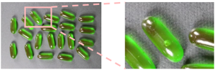

User Do you observe any anomalies in the image?

GPT-4o The image shows green gel capsules that appear uniform in size, shape, and color. Upon inspection, no obvious anomalies such as broken capsules, irregular shapes, or unexpected colors are visible.

Let’s draw a bounding box around the anomaly!

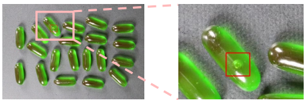

User Do you observe any anomalies in the image?

GPT-4o

Yes, there appears to be an anomaly in the image. One of the capsules, marked with a red box, has a noticeable defect. It seems to have a bubble or an air pocket inside, which is not observed in the other capsules.

This could indicate a manufacturing defect or inconsistency in the capsule filling process.

If there is no bounding box, let’s give a short hint to GPT-4o!

User

Do you observe any anomalies in the image? (hint: a bubble in the capsule)

GPT-4o The anomaly in the image is the presence of a visible air bubble inside one of the green gel capsules. While most capsules appear uniformly filled with liquid, the capsule located near the top center of the image has a small, clear air pocket within it. This could be a result of incomplete filling during the manufacturing process or an issue with the capsule sealing.

Table 7. Comparison of the GPT-4o [72] outputs with and without visual and textual hints for the anomaly.

As shown in Table 7, recent advanced MLLMs like GPT4o fail to detect the anomalies in the image, so building the instruction tuning dataset using previous methods [8] is impractical. However, we observe that when the GPT-4o is provided some "hints", it presents impressive performance on anomaly reasoning or description. For example, a red bounding box drawn around the anomalous area enables GPT-4o to detect the tiny bubble inside the small capsule. This observation indicates that the anomaly information is already contained in the visual tokens, and the failure of existing MLLMs is because the language model cannot effectively pick out the related tokens, which is the major inspiration of our token-picking mechanism.

Most of the existing AD datasets, such as MVTec AD [2], contain anomaly masks for anomaly localization. Therefore, we leverage these masks to generate the bounding boxes on the images. Specifically, the masks for an anomalous image are dilated and merged (if two masks are too close) before calculating the coordinates of the bounding boxes. Similarly, the image with bounding boxes drawn on it will serve as the visual prompt for GPT-4o. We also tried many other ways to utilize the anomaly masks, such as highlighting the mask area with different colors, consecutively providing the image and mask, and converting the normalized coordinates of the bounding box into a text prompt. None of them can as effectively guide the GPT-4o in finding anomalous features as drawing bounding boxes on the image.

## A1.2. WebAD – The largest AD dataset

Existing industrial or medical anomaly detection datasets, such as MVTec AD [2] and BMAD [1], only contain a limited number of classes (&lt; 20) and several different anomaly types for each class (most of the anomaly types are similar) due to the collection of these kinds of anomaly images involves extensive human involvements. This limitation hinders the ZSAD model from learning a generic description of anomaly and normal patterns. Also, the MLLMs cannot obtain enough knowledge of visual anomaly descriptions for unseen anomaly types. Therefore, more diverse data is required for a robust ZSAD &amp; reasoning model. Many recent dataset works collect and annotate online images to enrich existing datasets and demonstrate their effectiveness in the training of current data-hungry deep learning models.

To collect the online images that can be utilized for anomaly detection, we design an automatic data collection pipeline by combining GPT-4o [72] and Google Image Search [26]. As shown in Figure 8, we first employ GPT-4o to list 400 class names commonly seen in our daily life. Then, for each class, the GPT-4o is asked to generate 10 corresponding anomalous and normal phrases based on the class name. The abnormality or normality descriptions indicated by these phrases are specifically suitable for the class name. These phrases will serve as the search prompts to query the image links in Google Image Search. However, the downloaded images are very "dirty" and contain many noise samples and duplications. For example, the collected anomaly set contains lots of normal images, and vice versa. A data-cleaning step is applied after the image collection.

Since the duplications mainly occur within a specific class, we extract the CLIP [73] features for all the images in the class and compare the cosine similarity of these features. If the similarity value is larger than 0 . 99, then one of the images will be removed. To deal with the problematic grouping of anomaly and normal images, we combine the image and its corresponding search prompt and give them to GPT-4o for normal and anomaly classification. In the system prompt, we explicitly tell the GPT-4o that the search prompt is just a hint and not always correct and ask GPT-4o

Figure 8. Automatic data collection pipeline for WebAD. The entire pipeline is fully automatic at an affordable cost (API usage). Other advanced open-sourced MLLMs can applied to replace GPT-4o for further reduction of cost.

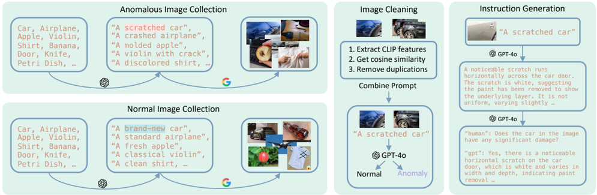

to determine the normality and abnormality by itself. This step will remove the images with incorrect labels and the artificial images, such as cartons or art. Some samples in the collected WebAD dataset are shown in Figure 9. In total, WebAD contains around 72k images from 380 classes and more than 5 anomaly types for each class.

## A1.3. Instruction Data Generation

For existing datasets, we manually combine the anomaly type and the class name to create the short anomaly prompt (hint). Then, the image with or without the bounding boxes and the corresponding short prompt are utilized to prompt GPT-4o for the generation of detailed descriptions of the image and the anomalies. These descriptions contain all the information required for instruction-following data. The in-context learning strategy is implemented to generate the multi-round conversation data (see Figure 10). Questions designed to elicit a one-word answer are utilized to balance the distribution of the normal and anomaly samples.

## A2. Training Details

In the professional training stage, we leverage AdamW [65] to be the optimizer and CosineAnnealingWarmRestarts [64] as the learning rate scheduler. The initial learning rate is set to be 1e − 4, and the restart iteration is half of the single epoch. The anomaly expert is trained on 8 H100 GPUs for 2 epochs (2 hours), and the total batch size is 128. In the instruction tuning stage, we follow the default training setting of LLaVA-OneVision [44] (reduce the batch size to 128), and the total training time for 0.5B and 7B models are 7 hours and 50 hours on 8 H100, respectively. When sampling the instruction data from the original recipe of LLaVA-OneVision , we put more emphasis on low-level image understanding and 3D multi-view Q&amp;A, considering that anomaly detection originates from the low-level feature differences and the

3D anomaly detection requires multi-image understanding. Besides, for more knowledge in the medical domain, the model is also fed with the data from LLaVA-Med [45].

## A3. Experimental Results

## A3.1. Anomaly Detection

Similar to previous ZSAD works, the detailed image-level AUROC results for the anomaly expert of Anomaly-OV on VisA [115] and MVTec AD [2] are provided in Table 8 .

## A3.2. Anomaly Reasoning

Table 9 to 13 presents more comparison results of GPT-4o [72], LLaVA-OneVision [44], and Anomaly-OV on AD &amp; reasoning. Anomaly-OV shows better performance in the detection and description of the visual anomalies in the images. Table 14 demonstrates the low-level and complex reasoning capability of Anomaly-OV for an in-the-wild image, indicating a comprehensive understanding of the anomaly.

## A4. Limitation and Future Work

Limitation. As shown in Table 15, sometimes, AnomalyOV fails to provide an accurate classification of the target object, describes the anomaly by a general word (wax missing is described by "crack"), or presents wrong reasoning with hallucination. Also, there is still a large space for improvement in the detection performance of Anomaly-OV. Besides, the images contained in VisA-D&amp;R are from the industrial domain, so more benchmarks in other domains, such as 3D and medical anomaly detection, are required to evaluate a unified AD &amp; reasoning model.

Future Work. The detection performance of Anomaly-OV is highly determined by the anomaly expert (see Table 4), so a more advanced design of the expert model is recommended

Figure 9. Overview of the gallery for in-the-wild image samples in WebAD. The images on the left side are anomalous, while the right side is for normal images. The links to download these images will be released to avoid copyright issues.

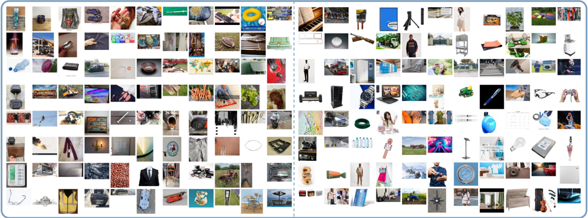

Figure 10. Prompt template for generating multi-round conversation in Anomaly-Instruct-125k (modified from the template of LLaVA [57]).

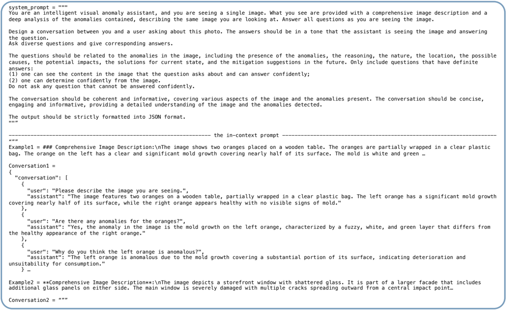

in future research. One can change the base model to other open-sourced MLLMs to resolve the wrong classification issue. Also, we found that the diversity of the anomaly type is very limited in existing industrial anomaly datasets (mainly 'crack' or 'broken'), causing the assistant to fail to provide fine-grained anomaly reasoning or description for unseen anomaly features. Therefore, a more diverse industrial anomaly detection dataset is urgently required. Similar to other traditional MLLMs, Anomaly-OV only utilizes the output visual tokens from the last layer of the visual encoder as the input for LLM. However, anomaly detection is highly dependent on low-level visual clues. Hence, forwarding

Table 8. Per-class image-level AUROC of the anomaly expert of Anomaly-OV on VisA and MVTec AD.

| VisA     | capsules    | fryum     | cashew    | macaroni1    | macaroni2    | candle     | pipe fryum    | chewinggum    | pcb1    |
|----------|-------------|-----------|-----------|--------------|--------------|------------|---------------|---------------|---------|
| AUROC    | 98.6        | 93.4      | 93.9      | 91.1         | 70.3         | 96.5       | 99.0          | 96.4          | 90.3    |
| AUROC    | pcb2        | pcb3      | pcb4      |              |              |            |               |               |         |
| AUROC    | 87.7        | 86.6      | 90.0      |              |              |            |               |               |         |
| MVTec AD | bottle      | cable     | grid      | apsule       | tile         | pill       | screw         | transistor    | hazelnu |
| AUROC    | 95.6        | 88.8      | 99.2      | 92.2         | 95.5         | 92.3       | 98.0          | 88.0          | 91.2    |
| AUROC    | carpet      | metal nut | wood      | zipper       | leather      | toothbrush |               |               |         |
| AUROC    | 98.9        | 77.7      | 100.0     | 99.6         | 100.0        | 94.2       |               |               |         |

## PCB Example: Bent Transparent LED

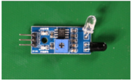

Table 9. Additional results on VisA-D&amp;R (PCB).

| User     | Is there an anomaly in the image?                                                                                                                                                          |
|----------|--------------------------------------------------------------------------------------------------------------------------------------------------------------------------------------------|
| GPT-4o   | The image shows an infrared sensor module, which
 appears to be intact and properly assembled. There
 doesn’t seem to be any visible anomaly or damage to
 the components.                 |
| LLaVA-OV | The image shows an electronic circuit board with various components, including a red LED that is not illuminated. There doesn’t appear to be anything obviously
 anomalous in the image. |
| Ours     | Yes, the anomaly in the image is the bent LED on the
 circuit board, which is not aligned properly with the
 board’s surface.                                                              |

## Candle Example: Pink Discoloration

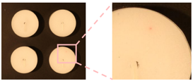

User

GPT-4o

LLaVA-OV

Ours

Is there an anomaly in the image I should know about?

Yes, there is an anomaly in the image. The candle in the top left corner has its wick facing the opposite direction compared to the other three candles.

Based on the image, there is no apparent anomaly among the candles. They are all similar in size and shape, with a consistent hole in the center for the wick. The coloration appears uniform across the candles, and there are no visible signs of melting or irregularities that would suggest an anomaly.

Yes, the anomaly is the presence of a small red spot on the bottom right candle, which contrasts with the otherwise uniform white color.

Table 10. Additional results on VisA-D&amp;R (Candle).

multi-level features from different layers to the LLM (as

## Capsule Example: Dark Spot

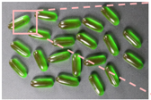

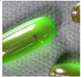

User Is there an anomaly present in the image?

GPT-4o

Yes, there is an anomaly in the image. One of the capsules is a different color; it is brown instead of green.

LLaVA-OV

Based on the image alone, there is no clear indication of an anomaly. The pills appear to be uniformly shaped and colored, with no visible defects or irregularities. However, without additional context or a point of ref- erence for size, it’s difficult to determine if there are any anomalies that might not be immediately apparent from the image.

Ours

Yes, there is an anomaly present in the image. One of the capsules has a darker spot on its surface, which contrasts with the otherwise uniform green color.

Table 11. Additional results on VisA-D&amp;R (Capsules).

recent paper: "Dense Connector for MLLMs" [96] ) should be a possible solution for performance improvement.

## Fryum Example: Break Edge

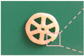

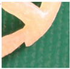

User Is there any anomaly in the image?

GPT-4o

The image shows a wheel-shaped snack on a green surface. There doesn't appear to be any obvious anomaly.

LLaVA-OV

Ours

The image shows a circular object with a pattern that resembles a wheel or a gear, placed on a green textured surface. There doesn't appear to be any obvious anomaly in the image; it seems to be a simple photograph of an object against a background. If there is something specific you are referring to as an anomaly, please provide more details or clarify what aspect you are questioning.

Yes, there is an anomaly in the image. The pasta wheel has a noticeable crack on its lower right side, disrupting its otherwise smooth and continuous surface.

Table 12. Additional results on VisA-D&amp;R (Fryum).

## Cashew Example: Brown Spot

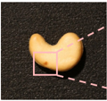

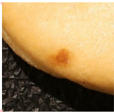

User Does the image contain any anomaly?

GPT-4o

The image shows a cashew nut on a textured black surface. There are no visible anomalies; the cashew appears normal.

LLaVA-OV

Ours

Based on the image provided, there are no visible anomalies. The object appears to be a single, intact cashew nut with a smooth surface and a natural brown coloration that is typical for cashews. There are no signs of damage, such as cracks or holes, and the background does not show any irregularities that would suggest an anomaly in the context of the image.

Yes, there is a noticeable anomaly on the cashew nut:

a small brown spot located near the center of the nut.

Table 13. Additional results on VisA-D&amp;R (Cashew).

## In-the-Wild Example: Graffitied Road Sign

| User       | Describe the anomaly in the image.                                                                                                                                                                              |
|------------|-----------------------------------------------------------------------------------------------------------------------------------------------------------------------------------------------------------------|
| Anomaly-OV | The anomaly in the image is the graffiti on the high
 way sign, which includes black spray paint marks and
 scribbles over the word ’Seattle’ and other parts of th
 sign.                                      |
| User       | What is the reason for the anomaly?                                                                                                                                                                             |
| Anomaly-OV | The graffiti is likely the result of vandalism, where indi
 viduals have used spray paint to deface public property
 for personal expression or as a form of protest.                                           |
| User       | How does the anomaly affect the functionality of the
 object?                                                                                                                                                   |
| Anomaly-OV | The graffiti affects the sign’s functionality by poten
 tially obstructing the visibility of important informa
 tion, such as the word ’Seattle,’ which could confuse
 drivers and lead to navigational errors. |
| User       | How to avoid the anomaly in the future?                                                                                                                                                                         |
| Anomaly-OV | To avoid such anomalies, regular maintenance and
 cleaning of signs should be implemented. Addition
 ally, community awareness programs can help reduce
 vandalism by promoting respect for public property.    |

Table 14. In-the-wild results for an unseen object (Road Sign).

## Failure Example 1: Wrong Classification

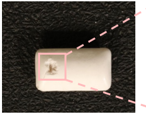

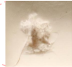

User Is there any anomaly visible in the image?

Anomaly-OV

Yes, there is a noticeable anomaly on the soap bar: a hole with jagged edges located towards the left side.

## Failure Example 2: General Description

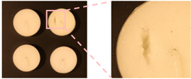

User

Are there any anomalies present in the image with the set of candles?

Anomaly-OV

Yes, there is an anomaly present in the top right candle. It has a noticeable crack on its surface, which is not typical for a smooth, intact candle.

## Failure Example 3: Wrong Reasoning

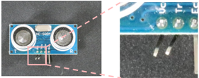

User Are there any anomalies in the image?

Anomaly-OV

Yes, the anomaly in the image is the absence of a crystal oscillator on the HC-SR04 ultrasonic sensor module.

Table 15. Failure results of Anomaly-OV on VisA-D&amp;R.