Received July 17, 2021, accepted August 25, 2021, date of publication August 30, 2021, date of current version September 14, 2021.

Digital Object Identifier 10.1109/ACCESS.2021.3109102

## TransAnomaly: Video Anomaly Detection Using Video Vision Transformer

HONGCHUN YUAN , ZHENYU CAI , HUI ZHOU , YUE WANG , AND XIANGZHI CHEN

College of Information Technology, Shanghai Ocean University, Shanghai 201306, China

Corresponding author: Hongchun Yuan (hcyuan@shou.edu.cn)

This work was supported in part by the National Natural Science Foundation of China under Grant 41776142.

ABSTRACT Video anomaly detection is challenging because abnormal events are unbounded, rare, equivocal, irregular in real scenes. In recent years, transformers have demonstrated powerful modelling abilities for sequence data. Thus, we attempt to apply transformers to video anomaly detection. In this paper, we propose a prediction-based video anomaly detection approach named TransAnomaly. Our model combines the U-Net and the Video Vision Transformer (ViViT) to capture richer temporal information and more global contexts. To make full use of the ViViT for the prediction, we modified the ViViT to make it capable of video prediction. Experiments on benchmark datasets show that the addition of the transformer module improves the anomaly detection performance. In addition, we calculate regularity scores with sliding windows and evaluate the impact of different window sizes and strides. With proper settings, our model outperforms other state-of-the-art prediction-based video anomaly detection approaches. Furthermore, our model can perform anomaly localization by tracking the location of patches with lower regularity scores.

INDEX TERMS Anomaly detection, generative adversarial network, self attention.

## I. INTRODUCTION

Anomaly detection is to identify the events that do not conform to expected behaviours [1]. With the increasing use of video surveillance, video anomaly detection has become an important task. Due to the fact that video anomalies are unbounded, rare, equivocal, irregular in real applications [2], video anomaly detection is challenging, and the problem is hard to be tackled with classification methods. Thus, deep-learning-based semi-supervised anomaly detection methods have been proposed and achieved significant improvements. Generally, these methods can be divided into two categories: i) reconstruction-based methods [3]– [8]. Reconstruction-based methods believe that normal events can be reconstructed correctly by models trained with normality. Conversely, reconstruction of abnormal events would have greater reconstruction error. ii) prediction-based methods [9]– [13]. Prediction-based methods use the previous frames to predict the following ones. Similar to the reconstruction-based methods, it is assumed that normal events would be correctly predicted, while the abnormal ones would not.

The associate editor coordinating the review of this manuscript and approving it for publication was Zahid Akhtar .

Convolutional Neural Networks (CNNs) have become necessary for both reconstruction-based and prediction-based methods for their exceptional representation abilities. U-Net [14], as a variation of Fully Convolutional Networks (FCNs) [15], is a symmetric encoder-decoder network with skip-connections to retain more details, has been widely used in video anomaly detections. Moreover, with the emergence of Generative Adversarial Networks (GANs) [16], adversarial training is applied to the methods, bringing better reconstruction and prediction results, and performance improvements have been achieved. Notwithstanding the extraordinary power of CNNs, CNN-based methods are constrained by the inherent locality of convolutional operations, and they do not perform well in modelling long-range relations. In order to overcome this shortcoming, self-attention mechanisms, used for sentence embedding at the beginning [17], [18], are introduced into the models based on CNNs [19], [20], which enhance the ability of CNN-based models for modelling complex structures.

Transformer, as a sequence-to-sequence model, achieved significant improvements in the field of natural language processing (NLP) [21]– [23]. The transformer is first proposed by Vaswani et al. [21] for machine translation and English constituency parsing tasks, which gives

an alternative to prior natural language processing models based on Recurrent Neural Networks (RNNs) and CNNs. Furthermore, Devlin et al. [22] proposed BERT (Bidirectional Encoder Representations from Transformers), which obtained state-of-the-art performance on multiple NLP tasks by pre-training transformers on unlabeled text bi-directionally. Brown et al. [23] introduced a transformer-based model with 175 billion parameters named GPT-3 (Generative Pre-trained Transformer 3). This massive model trained with a large amount of training data is capable of different NLP tasks, and fine-tuning is not needed. Since the great success of transformers in the field of NLP has been witnessed, many works have recently applied transformers to the field of computer vision. For example, ViT (Vision Transformer) [24] takes 16 × 16 image patches as input to a transformer encoder to realize image classification. ViViT (Video Vision Transformer) [25], based on ViT, explored the application of ViT in video classification. DETR [26] and deformable DETR [27] are end-to-end object detection models that directly predict the final set of the detections. TransUNet [28] is a combination of U-Net and transformer, achieving superior medical image segmentation performances to previous methods. Transformers are also utilized in other computer vision tasks, such as segmentation [29], image generation [30] and video inpainting [31].

In this paper, inspired by TransUNet, we propose a video anomaly detection model based on U-Net and ViViT named TransAnomaly. In our model, CNN features extracted by the encoder part of U-Net are encoded by a modified ViViT. Thus, the encoded features have both spatial and temporal information. The decoder part of the U-Net then decodes the features, and abnormal frames can be identified by comparing the difference between predicted frames and ground truth frames. With the modified ViViT, our model is able to efficiently encode the input images in both spatial and temporal scales. Compared with previous prediction-based methods using stacked frames as inputs, our model captures global context and additional temporal information in the encoding stage, which helps generate better predictions and eventually improve anomaly detection performance. Experiments on multiple datasets show the superiority of our method.

## II. RELATED WORK

As mentioned above, deep-learning-based unsupervised anomaly detection methods can be generally categorized into reconstruction-based methods and prediction-based methods. These methods achieve good performance in the task of video anomaly detection.

## A. RECONSTRUCTION-BASED METHODS

Most of the reconstruction-based methods trained models to reconstruct an input sequence of frames, then reconstruction errors are used for anomaly detection. For instance, Hasan et al. [3] trained a Fully Convolutional Auto-Encoder to reconstruct input sequences, and the regularity scores of the frames were computed based on reconstruction errors.

For richer temporal information, Chong and Tay [4] and Luo et al. [5] combined Convolutional Long Short Term Memory (ConvLSTM) with Convolutional Auto-Encoder to reconstruct input sequences. This kind of enhanced motion representation learning contributed to the higher accuracy of video anomaly detection. Except for improved models, motion constraint based on optical flow has been applied to the task in recent years for more temporal/motion information. For example, Nguyen and Meunier [6] designed a Convolutional Auto-Encoder with two branches to reconstruct input frames and corresponding optical flows. The reconstruction errors of pixel intensity and optical flow are both considered for anomaly detection. In addition, some of the reconstruction-based methods exploit the difference of latent representations between normal samples and abnormal samples to detect anomalies. Fan et al. [7] and Li and Chang [8] used Variational Auto-Encoders (VAEs) to reconstruct input frames, and the distribution difference of latent representations was used to compute regularity scores.

## B. PREDICTION-BASED METHODS

Unlike reconstruction-based methods, prediction-based methods train models to predict future frames based on previous inputs frames, and prediction errors are used for anomaly detection. In 2016, Medel and Savakis [9] proposed Conditioned Composite Conv-LSTM Encoder-Decoder, which uses two decoders to reconstruct input frames and predict future frames separately, but only reconstruction error is utilized to compute regularity score. Similarly, Zhao et al. [10] designed a Spatio-Temporal Auto-Encoder with two decoder branches, reconstructing input frames and predicting future frames, respectively. The regularity score is computed with both reconstruction error and prediction error. Liu et al. [11] proposed a prediction model based on U-Net. Without reconstruction, the model computes regularity score with only prediction error. Furthermore, some works integrate reconstruction into prediction models. For instance, Ye et al. [12] proposed a Predictive Coding Network for anomaly detection, which predicts future frames using a ConvLSTM with predictive coding at first. The prediction errors are refined in a reconstruction manner. Finally, the predicted frames are updated with refined errors for better prediction performance. In this way, the regularity score is still computed with prediction error, but reconstruction difference is also considered. Tang et al. [13] connected two U-Net blocks in series. The first block works in the form of frame prediction, then the second block reconstructs the predicted frames, and the reconstructed predictions are used to compute prediction errors.

## C. VISUAL TRANSFORMERS

Inspired by the transformer's success in the field of NLP, many researchers attempted to use similar models to learn useful features for image tasks. Dosovitskiy et al. [24] proposed Vision Transformer (ViT), a pure transformer used for image classification. In ViT, an image is reshaped into

a sequence of flattened 2D patches. These flattened patches are fed into transformer encoders as tokens in the original transformer after a linear projection layer. ViT achieved excellent results when trained on large-sized datasets, proving that the transformer can extract image features effectively. For video classification, Arnab et al. [25] proposed Video Vision Transformer (ViViT). ViViT extracts spatio-temporal tokens from the input video. The transformer encoder is factorized into a spatial part and a temporal part for extracting spatial information and temporal information. TransUNet, proposed by Chen et al. [28], is a combination of U-Net and transformer encoder. As a hybrid CNN-Transformer architecture, TransUNet leverages detailed high-resolution spatial information from CNN features and the global context encoded by the transformer encoder. Such a design allows TransUNet to achieve superior performance in medical image segmentation.

Most U-Net based video anomaly detection methods use stacked successive frames as input, and temporal information is extracted by applying motion constraints such as optical-flow loss. Limited by the structure, temporal information is insufficient for reconstruction and prediction. As a variation of transformers, ViViT outperforms other models in the video classification task. The performance of the ViViT shows that transformers are capable of encoding high-level features in videos, both spatially and temporally. On the other hand, the U-Net has been widely used in the task of video anomaly detection. Also, TransUNet has demonstrated the potential of the combination of the transformer and the U-Net. Thus, inspired by ViViT, we modified the transformer encoder in ViViT to make it suitable for video prediction. And the ViViT is combined with U-Net for detailed prediction results. In brief, our model encodes spatial information with the U-Net, and our modified transformer encoder encodes temporal information. Compared with the prediction-based baseline model without the transformer module, our model achieves better performance.

## III. PROPOSED METHOD

Given a video clip with successive frames I1 , I2 , . . . , It It, our goal is to use these frames to predict the future frame It+1, and the prediction of It+1 is denoted as ˆ It It+1 . After the prediction, the difference between It It+1 and ˆ It It+1 can be used to compute the regularity score for anomaly detection. The framework of our model is demonstrated in Fig. 1. In the following part, we will introduce all components of our model in detail. For comparison, t is set to 4, the same as most prediction-based methods.

## A. FUTURE FRAME PREDICTION

The generator used to predict future frames is depicted in Fig. 2. The input of our generator is t successive frames from a video clip, and the output is a single frame which is the next frame of the input frames. All input frames are resized to 256×256 with 3 channels and pixel values are normalized

to [−1 , 1]. The output is a predicted frame with a resolution of 256 × 256 and 3 channels, and pixel values are in [−1 , 1].

## 1) ENCODER

As shown in Fig. 2, the input of an encoder is a 3-channel image with a resolution of 256×256, and the output is a feature map of 512 channels with a resolution of 32×32. Different from stacking the consecutive frames together, the frames are encoded separately. Therefore, t identical encoders share the same parameters in the generator, and the t consecutive frames are encoded into corresponding feature maps. In such a manner, the encoders only focus on extracting spatial information. The activation functions for all convolutions in the encoders are ReLUs.

## 2) TRANSFORMER MODULE

The transformer module is a modification of a factorizedencoder ViViT. The temporal transformer receives t feature maps output by the encoders, and outputs a predicted feature map. The details of the temporal transformer are depicted in Fig. 3. Firstly, the feature maps x1 , x2 , . . . , xt output by the generator are embedded into groups of tokens. Specifically, each feature map xi ∈ R C×H×W , xiis reshaped into a sequence of flattened 2D patches xp xpi ∈ R Np Np ×(P 2 · C) , where (H , W) is the resolution of the feature map xi , C is the number of channels, (P , P) is the resolution of a patch, and Np Np = HW/P 2 is the number of patches. The constant latent vector size is set to D in the temporal encoder, so the flattened patches are mapped to D dimensions with a trainable linear projection. The projected flattened patches are denoted as x
p 0 x
pi , j , where j = 1 , 2 , . . . , Np Np , and x
p 0 x
pi , j denotes the j th projected token in the sequence xp xpi . Tokens with the same j are seen as a token group [x
p 0 x
p1 , j ; x
p 0 x
p2 , j ; . . . ; x
p 0 x
pt , j ]. In other words, the tokens with the same spatial position and different temporal locations are a group of tokens. Therefore, there are Np Np groups of tokens in total. Similar to the class token of ViT and ViViT, an additional token xpredj dj is added to each token group as the prediction token, whose state at the output of the temporal transformer encoder serves as the prediction representation of the spatial position j. Furthermore, standard 1D learnable temporal position embedding is applied to preserve temporal location information. In our case, xi ∈ R 512×32×32 , P is set to 2, D is set to 512 and t is set to 4. After the embedding, there are 256 groups of tokens. For each group, there are 5 tokens, and the lengths of the tokens are 512. The patch embedding can be described as follows:

<!-- formula-not-decoded -->

where xpredj dj ∈ R D denotes the prediction token of the j th token group, and Ep Eposj ∈ R
(t+1)×D denotes the temporal position embedding of the j th token group. z
j (0) z
j denotes the input of the first layer of the temporal transformer.

The temporal transformer encoder consists of Ltlayers of Multi-head Self-Attention (MSA) and Multi-Layer Perceptron (MLP) blocks. The Np Np token groups are encoded by the

FIGURE 1. The framework of our model. For training, we use our predictor based on U-Net and ViViT to predict ˆ I
t I
t+1 . To generate high quality predicted images, we adopt intensity loss and gradient loss as the appearance constraints and difference loss for the motion constraint. For computing difference loss, the prediction of I
t
that is denoted as ˆ I
t I
t is needed. Thus, in the process of training, a training sample consists of t + 2 consecutive frames. In addition, adversarial training is also leveraged to enhance the quality of generated frames. For testing, we use the trained generator to predict ˆ I
t I
t+1
, then with its ground truth I
t +1 , Peak Signal to Noise Ratio (PSNR) is calculated for computing regularity score.

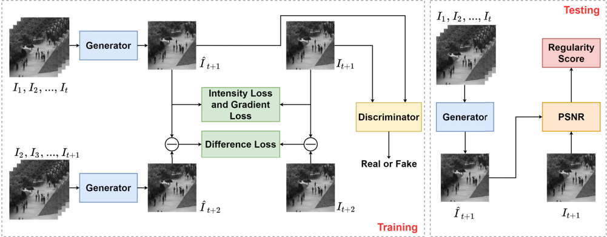

FIGURE 2. An overview of our generator. There are three main parts in the generator: the encoder on the left, the decoder on the right and the transformer module on the bottom. The kernel sizes of convolution and deconvolution filters are 3 × 3, and that of max-pooling layers are 2 × 2. The strides of convolutions are set to 1, and the strides are set to 2 for max-poolings and deconvolutions. Padding is used for keeping the sizes of feature maps.

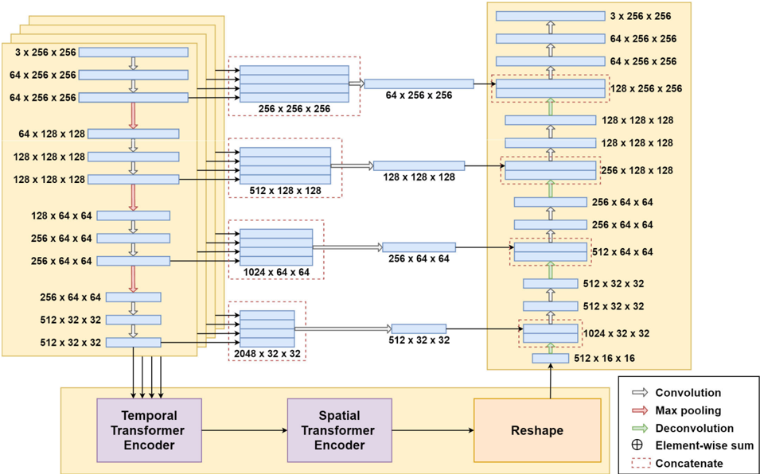

temporal transformer encoder separately. The output of the l th layer of the temporal transformer encoder can be described as follows:

<!-- formula-not-decoded -->

<!-- formula-not-decoded -->

where z
j (l) z
j denotes the output of the l th layer of the temporal transformer encoder, and LN(·) denotes layer normalization. After the encoding, z
j (Lt) z
j is the final output of the temporal

transformer encoder, and z
p (Lt) z
predj is the prediction token of z
j (Lt) z
j , j
which is the predicted representation of the spatial position j . The output of the temporal transformer encoder consists of Np Np groups of tokens.

The prediction tokens are then input into the spatial transformer, which encodes global information. As shown in Fig. 4, the Np Np prediction tokens are fed into the spatial transformer with L s layers after the spatial position embedding, and then the prediction tokens are reshaped into a feature map xˆ ˆ t+1 ∈ R D×( H P )×( W P ) , which is the final output of the transformer module.

## 3) DECODER

The decoder receives a predicted feature map xˆ ˆ t+1 and outputs a predicted frame ˆ It It+1 . As shown in Fig. 2, the decoder consists of convolution layers and deconvolution layers. The activation functions for the convolutions are ReLUs, and the deconvolutions do not use activation functions. Similar to the original U-Net, the shortcuts between the encoders and the decoder suppress gradient vanishing, and more low-level features are leveraged in the upsampling process. Additional convolutions are used to reduce the dimensions of concatenated feature maps owing to multiple encoders.

## B. CONSTRAINTS

To guarantee the generated prediction close to its ground truth, we apply both appearance constraint and motion constraint. Intensity loss and gradient loss are adopted as appearance constraints. The intensity loss is the difference of all pixel values in RGB space between the prediction and its ground truth, and the gradient loss sharpens the predicted frames. Following the previous works [11], we define the intensity loss between a predicted frame ˆ It It+1 and its ground truth It It+1 as follows:

<!-- formula-not-decoded -->

where N is the number of the pixels in I, and the gradient loss is defined as follows:

<!-- formula-not-decoded -->

where i , j denotes the spatial indexes of pixels. The gradient loss is helpful for the model to distinguish normal frames and abnormal frames because the gradient loss guarantees the model to generate normal objects with sharp edges. The abnormal objects that have never appeared in the training data cannot be sharpened correctly when predicting. Therefore, The abnormal objects tend to have fuzzy edges, which leads to larger prediction errors.

Instead of optical flow loss, we adopt image difference loss as the motion constraint following the work [13]. The optical flow loss makes the network deeper, which causes difficulty in training the network. Specifically, we have to use

smaller learning rates to stabilize the training process, and the cost is much longer training time, which is not practical in applications. The image difference loss is defined as follows:

<!-- formula-not-decoded -->

## C. ADVERSARIAL TRAINING

Generative Adversarial Networks (GANs) are used to make generated results more realistic in image and video generation tasks. A GAN consists of a generator and a discriminator in most cases. The discriminator tries to distinguish a generated result from a realistic one. In the meantime, the generator tries to generate results that can confuse the discriminator. The generator has been described above, and we utilize the patch discriminator [32] as the discriminator.

## 1) TRAINING THE DISCRIMINATOR

The discriminator D aims to classify the generated images and the realistic ones. Given a prediction ˆ I and its ground truth I, the discriminator loss is defined as follows:

<!-- formula-not-decoded -->

where i , j denotes the indexes of spatial patches in the output of the discriminator, and n denotes the number of the patches.

## 2) TRAINING THE GENERATOR

The generator aims to generate more realistic images. The weights of the discriminator are fixed when training G . G can be trained by minimizing the adversarial loss defined as follows:

<!-- formula-not-decoded -->

## D. OBJECTIVE FUNCTION

When training D, the objective function is defined as follows:

<!-- formula-not-decoded -->

when training G, the objective function is defined as follows:

<!-- formula-not-decoded -->

where λint, λgd , λdif , λadv are the weights of the loss functions.

For training the network, all the frames are resized to 256 × 256, and the pixel values are normalized to [−1 , 1]. Adam [34] based Stochastic Gradient Descent method is used for parameter optimization. The coefficients are set to 1.0,

FIGURE 4. The spatial transformer encoder.

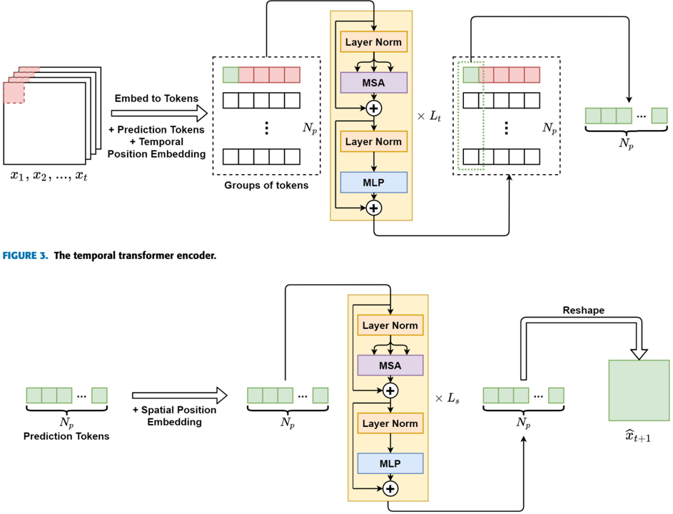

1.0, 0.01, 0.05 respectively for all datasets. The mini-batch size is set to 4. The learning rates of the generator and the discriminator are set to 0.0001, 0.00001 respectively for grayscale datasets and 0.0002, 0.00002 for RGB datasets. The network is trained for 100000 iterations on all datasets.

## E. ANOMALY DETECTION

In the testing phase, only the generator in our model is used to predict future frames. Given a generated frame ˆ I and its ground truth I, the difference between them can be used for anomaly detection. Peak Signal to Noise Ratio has been widely used to assess image quality in video anomaly detection. PSNR is defined as follows:

<!-- formula-not-decoded -->

where maxˆI x
I means the max pixel value in ˆ I. A lower PSNR value of a predicted frame and its ground truth indicates the frame is more likely to be an abnormal frame. After calculating all the PSNRs in a testing video, the PSNRs are normalized to [0 , 1], and the regularity score of the i th frame

in a testing video is calculated as follows:

<!-- formula-not-decoded -->

where max(PSNR) is the maximum PSNR value in the testing video, and min(PSNR) is the minimum PSNR value.

Another anomaly detecting strategy is to compute regularity score with sliding windows [6]. Given a predicted frame ˆ I and its ground truth I, the mean square errors of corresponding patches are calculated, where a sliding window determines the patches. The p patches that have the largest mean square error are denoted as MSEP 1
, MSEP 2
, . . . , MSEPp Pp , and the PSNR of ˆ I and I is calculated as follows:

<!-- formula-not-decoded -->

the regularity score of the i th frame in a testing video is calculated as follows:

<!-- formula-not-decoded -->

In this way, only the patches that are most likely to have anomalies are considered so that the influence of background

noises is suppressed. The choice of the size and the stride of the sliding windows will be discussed in the next section.

## IV. EXPERIMENTS

In this section, our proposed method is evaluated on the CUHK Avenue dataset and the UCSD Pedestrian dataset. We explore the impact of different settings on our method and then compare our method with other video anomaly detection methods.

## A. DATASETS

The CUHK Avenue dataset is captured in the CUHK campus avenue, consisting of 16 training video clips and 21 testing video clips. The training videos only capture normal situations, and anomalies such as strange actions, wrong directions and abnormal objects are included in the testing videos. The UCSD Pedestrian dataset contains two subsets: Ped1 and Ped2. Ped1 consists of 34 training video clips and 36 testing video clips, and Ped2 consists of 16 training video clips and 12 testing ones. The training videos of both Ped1 and Ped2 are composed of normal scenes, and the testing videos include abnormal targets such as bikers, cars and skaters. Ped1 is more challenging than Ped2 for the changing sizes of the targets due to the camera's position and angle.

## B. EVALUATION METRIC

To evaluate the performance of our method, we use the Area Under Curve (AUC) as the evaluation metric for anomaly detection performance. AUC is the area under the Receiver Operation Characteristic (ROC) curve, and ROC is given by the regularity scores S. A higher AUC value suggests better anomaly detection performance. As described in Section 3.5, the regularity scores can be calculated with different strategies.

## C. MODEL SETTINGS

## 1) DEPTH OF THE TRANSFORMER ENCODES

In our model, the transformer module comprises a temporal transformer encoder and a spatial transformer encoder. To clarify how the depth of the transformer encoders affects the anomaly detection performance, we first set L s from 0 to 6 and fix L t to 1. After training the model, we calculate regularity scores with frame-level PSNR. As shown in Table 1 , it is evident that the depth of the spatial transformer encoder impacts the results. In our experiment, the results suggest that the optimal depth is 3 for our model. Compared with the model without the spatial transformer encoder (L s = 0), a proper setting of the depth of the spatial transformer encoder improves the performance of anomaly detection.

Furthermore, to evaluate the impact of the depth of the temporal transformer encoder, we fix L s to 3 and set L t from 1 to 3. The results are shown in Table 2. For Ped2 and Avenue, a deeper temporal transformer encoder does not improve the performance of the model. Although a slight improvement is witnessed on Ped1 when L t is set to 2, considering

TABLE 1. AUC of models with different L s on the UCSD Ped1, UCSD Ped2 and avenue.

TABLE 2. AUC of models with different L t on the UCSD Ped1, UCSD Ped2 and avenue.

|    |    |    |    |
|----|----|----|----|
|    |    |    |    |
|    |    |    |    |
|    |    |    |    |
|    |    |    |    |
|    |    |    |    |
|    |    |    |    |
|    |    |    |    |

FIGURE 5. Some abnormal frames from the datasets. The bounding boxes indicates the location of anomaly objects.

|    |    |    |    |
|----|----|----|----|
|    |    |    |    |
|    |    |    |    |
|    |    |    |    |

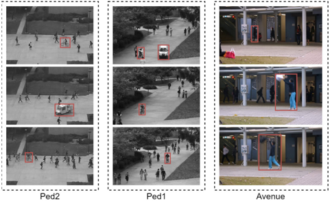

computation cost, setting Lt to 1 is a better choice. The temporal transformer encoder makes predictions based on small patches, and the number of input frames t is set to 4. Therefore, a shallow temporal transformer is more suitable in our model. Taken overall, we set L t to 1 for all datasets.

## 2) CHOICE OF LOSS FUNCTIONS

To choose appropriate constraints for the training, we conduct ablation experiments of the loss functions on the Ped2 dataset. As discussed above, L s and L t are set to 3 and 1, and frame-level PSNR is used to calculate regularity scores. We use the following combinations of loss functions to train the model: only the intensity loss, the intensity loss with the gradient loss, the intensity loss with the difference loss and all three loss functions. The anomaly detection performance on Ped2 in AUC is summarized in Table 3. The results show that the gradient loss or the difference loss only slightly improves the performance or even makes it worse compared with the performance of the baseline (0.954). Nevertheless, the combination of all three loss functions makes significant improvements. The results indicate that our model can make full use of the spatial transformer encoder and the temporal transformer encoder only when all the loss functions are used.

FIGURE 6. AUCs at different training iterations on the datasets.

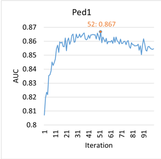

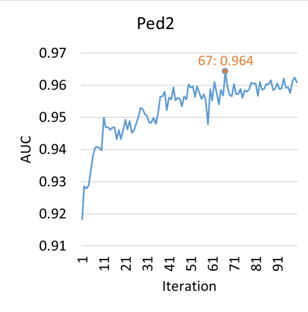

TABLE 3. AUC of models with different loss functions on the UCSD Ped2.

|    |    |    |    |    |
|----|----|----|----|----|
|    |    |    |    |    |
|    |    |    |    |    |
|    |    |    |    |    |

## 3) CHOICE OF THE WINDOW SIZE AND STRIDE

In different scenes, the sizes of foreground objects and the complexity of backgrounds vary. Meanwhile, different camera positions cause different degrees of perspective. As shown in Fig. 5, the size of the anomaly objects varies in different datasets. In general, anomaly objects in Avenue are larger compared with the other two datasets, and frames in Ped1 and Avenue have more obvious perspective distortion. Moreover, the background in the Avenue dataset is relatively more complicated. Therefore, it is more reasonable to calculate PSNR based on sliding windows.

As described in Section 3.5, the value p decides how many patches are considered while calculating PSNRSW . To evaluate the influence of the window size and stride, we set p to half of the total patch number. For example, given a sliding window with a size of 64 and a stride of 32, there are 49 patches, so that p is set to 24. Table 4 shows the results of 10 different combinations of size and stride. On the dataset Ped1 and Avenue, a proper setting of window size and stride significantly improves the performance. With a clear background and no noticeable perspective distortion, there is only a slight performance improvement on Ped2.

## 4) CHOICE OF THE TRAINING ITERATIONS

We trained our model for 100000 iterations on all datasets. The AUCs at different iterations are shown in Fig. 6. In our experiment, a longer training time does not mean better performance, which is evident on Ped1. Our model achieves the highest AUCs in the 52 th , the 67 th and the 75 th iteration on Ped1, Ped2 and Avenue, respectively. Therefore, we use the parameters in these iterations for our model.

## D. COMPARISON WITH STATE-OF-THE-ARTS

We compare our model with 4 state-of-the-arts anomaly detection methods: 1) Future Frame Prediction [11];

TABLE 4. AUC of models with different sliding windows on the UCSD Ped1, UCSD Ped2 and avenue.

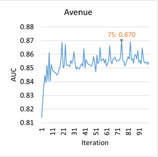

FIGURE 7. The score gaps of our model and the FFP(baseline) on the datasets.

|    |    |    |    |
|----|----|----|----|
|    |    |    |    |
|    |    |    |    |
|    |    |    |    |
|    |    |    |    |
|    |    |    |    |
|    |    |    |    |
|    |    |    |    |
|    |    |    |    |
|    |    |    |    |
|    |    |    |    |
|    |    |    |    |

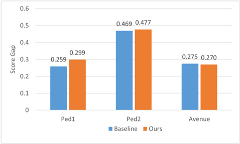

2) Appearance-Motion Correspondence [6]; 3) AnoPCN [12]; 4) Integrating Prediction and Reconstruction [13]; 5) Dual Discriminator [34].The AUC values are listed in Table 5 We first compare our model with the baseline (FFP). With the same PSNR calculating strategy (without sliding windows), our method shows superiority on all datasets, and the improvements are 0.009, 0.007, 0.007 respectively on Ped1, Ped2 and Avenue. The result shows that our transformer module is able to improve the performance due to its ability to encode richer temporal and global information. Moreover, by calculating PSNR with sliding windows, our model

FIGURE 8. A visualized example of anomaly detection. Each bounding box represents a patch divided by the sliding window.

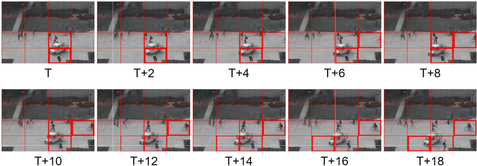

TABLE 5. AUC of different methods on the UCSD Ped1, UCSD Ped2 and avenue.

|    |    |    |    |
|----|----|----|----|
|    |    |    |    |
|    |    |    |    |
|    |    |    |    |
|    |    |    |    |
|    |    |    |    |
|    |    |    |    |
|    |    |    |    |

outperforms other methods on Ped1 and Avenue with AUCs of 0.867 and 0.870.

The score gap is the difference between the average score of normal frames and that of abnormal frames. A larger score gap indicates that the model can better distinguish normal and abnormal events. We compare the score gap of our model with the baseline, and the results are shown in Fig. 7. On datasets Ped1 and Ped2, the score gaps of our model are larger than those of the baseline. Although our model has a smaller score gap on Avenue, the average and the standard deviation of the regular scores is 0.901 and 0.131 on normal frames, where those of the baseline are 0.788 and 0.161. This result suggests that our model's regular scores of normal frames are more consistent than those of the baseline, which leads to the higher AUC on the Avenue dataset.

In a word, our method achieves better performance and has generalization ability on multiple datasets.

## E. VISUALIZATION

Fig. 8 shows the predicted frames of a video clip with anomaly objects from the UCSD Ped2. Regularity scores are calculated with PSNRSW . The window size and the stride are set to 64. In the figure, a thicker bounding box means a lower regularity score. The patches with non-pedestrian objects have lower regularity scores. The location of patches with lower regularity scores can be used as a reference for anomaly localization.

## F. COMPUTING TIME

Our model is trained on an NVIDIA Tesla V100 GPU. It takes about 16 hours to train our model for 100000 iterations on a dataset. Testing is performed on an NVIDIA RTX 3070 GPU, and the average testing speed is about 18 fps.

## V. CONCLUSION

In this paper, we proposed TransAnomaly for video anomaly detection. By combining the ViViT and the U-Net, our model predicts future frames with richer temporal information and global contexts. To fully leverage the power of ViViT, we modified the temporal transformer to make it suitable for image generation. Furthermore, in order to alleviate the influence of irrelevant factors during anomaly detection, we calculate PSNR based on sliding windows. Experiments conducted on three benchmark datasets demonstrate the validity of each component in our model, and the results show that our method outperforms other state-ofthe-art prediction-based approaches.

## REFERENCES

- [1] V. Chandola, A. Banerjee, and V. Kumar, ''Anomaly detection: A survey,'' ACM Comput. Surv., vol. 41, no. 3, pp. 1–58, Jul. 2009.
- [2] R. Nayak, U. C. Pati, and S. K. Das, ''A comprehensive review on deep learning-based methods for video anomaly detection,''Image Vis. Comput. , vol. 106, Feb. 2021, Art. no. 104078.
- [3] M. Hasan, J. Choi, J. Neumann, A. K. Roy-Chowdhury, and L. S. Davis, ''Learning temporal regularity in video sequences,'' in Proc. IEEE Conf. Comput. Vis. Pattern Recognit. (CVPR), Jun. 2016, pp. 733–742.
- [4] Y. S. Chong and Y. H. Tay, ''Abnormal event detection in videos using spatiotemporal autoencoder,'' in Proc. Int. Symp. Neural Netw. Cham, Switzerland: Springer, 2017, pp. 189–196.
- [5] W. Luo, W. Liu, and S. Gao, ''Remembering history with convolutional LSTM for anomaly detection,'' in Proc. IEEE Int. Conf. Multimedia Expo (ICME), Jul. 2017, pp. 439–444.
- [6] T. N. Nguyen and J. Meunier, ''Anomaly detection in video sequence with appearance-motion correspondence,'' in Proc. IEEE/CVF Int. Conf. Comput. Vis. (ICCV), Oct. 2019, pp. 1273–1283.
- [7] Y. Fan, G. Wen, D. Li, S. Qiu, M. D. Levine, and F. Xiao, ''Video anomaly detection and localization via Gaussian mixture fully convolutional variational autoencoder,'' Comput. Vis. Image Understand., vol. 195, Jun. 2020, Art. no. 102920.
- [8] N. Li and F. Chang, ''Video anomaly detection and localization via multivariate Gaussian fully convolution adversarial autoencoder,'' Neurocomputing, vol. 369, pp. 92–105, Dec. 2019.
- [9] J. R. Medel and A. Savakis, ''Anomaly detection in video using predictive convolutional long short-term memory networks,'' 2016, arXiv:1612.00390. [Online]. Available: http://arxiv.org/abs/1612.00390

- [10] Y. Zhao, B. Deng, C. Shen, Y. Liu, H. Lu, and X.-S. Hua, ''Spatio-temporal AutoEncoder for video anomaly detection,'' in Proc. 25th ACM Int. Conf. Multimedia, Oct. 2017, pp. 1933–1941.
- [11] W. Liu, W. Luo, D. Lian, and S. Gao, ''Future frame prediction for anomaly detection—A new baseline,'' in Proc. IEEE/CVF Conf. Comput. Vis. Pattern Recognit., Jun. 2018, pp. 6536–6545.
- [12] M. Ye, X. Peng, W. Gan, W. Wu, and Y. Qiao, ''AnoPCN: Video anomaly detection via deep predictive coding network,'' in Proc. 27th ACM Int. Conf. Multimedia, Oct. 2019, pp. 1805–1813.
- [13] Y. Tang, L. Zhao, S. Zhang, C. Gong, G. Li, and J. Yang, ''Integrating prediction and reconstruction for anomaly detection,'' Pattern Recognit. Lett., vol. 129, pp. 123–130, Jan. 2020.
- [14] O. Ronneberger, P. Fischer, and T. Brox, ''U-Net: Convolutional networks for biomedical image segmentation,'' in Proc. Int. Conf. Med. Image Comput. Comput.-Assist. Intervent., 2015, pp. 234–241.
- [15] J. Long, E. Shelhamer, and T. Darrell, ''Fully convolutional networks for semantic segmentation,'' in Proc. IEEE Conf. Comput. Vis. Pattern Recognit. (CVPR), Jun. 2015, pp. 3431–3440.
- [16] I. Goodfellow, J. Pouget-Abadie, M. Mirza, B. Xu, D. Warde-Farley, S. Ozair, A. Courville, and Y. Bengio, ''Generative adversarial nets,'' in Proc. Adv. Neural Inf. Process. Syst., 2014, pp. 2672–2680.
- [17] J. Cheng, L. Dong, and M. Lapata, ''Long short-term memory-networks for machine reading,'' 2016, arXiv:1601.06733. [Online]. Available: http://arxiv.org/abs/1601.06733
- [18] A. P. Parikh, O. Täckström, D. Das, and J. Uszkoreit, ''A decomposable attention model for natural language inference,'' 2016, arXiv:1606.01933 . [Online]. Available: http://arxiv.org/abs/1606.01933
- [19] H. Zhang, I. Goodfellow, D. Metaxas, and A. Odena, ''Self-attention generative adversarial networks,'' 2018, arXiv:1805.08318. [Online]. Available: http://arxiv.org/abs/1805.08318
- [20] X. Wang, R. B. Girshick, A. Gupta, and K. He, ''Non-local neural networks,'' in Proc. IEEE Conf. Comput. Vis. Pattern Recognit. (CVPR) , Jun. 2018, pp. 7794–7803.
- [21] A. Vaswani, N. Shazeer, N. Parmar, J. Uszkoreit, L. Jones, A. N. Gomez, L. Kaiser, and I. Polosukhin, ''Attention is all you need,'' in Proc. Adv. Neural Inf. Process. Syst., 2017, pp. 5998–6008.
- [22] J. Devlin, M.-W. Chang, K. Lee, and K. Toutanova, ''BERT: Pre-training of deep bidirectional transformers for language understanding,'' 2018, arXiv:1810.04805. [Online]. Available: http://arxiv.org/abs/1810.04805
- [23] T. B. Brown et al., ''Language models are few-shot learners,'' 2020, arXiv:2005.14165. [Online]. Available: http://arxiv.org/abs/2005.14165
- [24] A. Dosovitskiy, L. Beyer, A. Kolesnikov, D. Weissenborn, X. Zhai, T. Unterthiner, M. Dehghani, M. Minderer, G. Heigold, S. Gelly, J. Uszkoreit, and N. Houlsby, ''An image is worth 16 × 16 words: Transformers for image recognition at scale,'' 2020, arXiv:2010.11929 . [Online]. Available: http://arxiv.org/abs/2010.11929
- [25] A. Arnab, M. Dehghani, G. Heigold, C. Sun, M. Lučić, and C. Schmid, ''ViViT: A video vision transformer,'' 2021, arXiv:2103.15691. [Online]. Available: http://arxiv.org/abs/2103.15691
- [26] N. Carion, F. Massa, G. Synnaeve, N. Usunier, A. Kirillov, and S. Zagoruyko, ''End-to-end object detection with transformers,'' in Proc. Eur. Conf. Comput. Vis., 2020, pp. 213–229.
- [27] X. Zhu, W. Su, L. Lu, B. Li, X. Wang, and J. Dai, ''Deformable DETR: Deformable transformers for end-to-end object detection,'' 2020, arXiv:2010.04159. [Online]. Available: http://arxiv.org/abs/2010.04159
- [28] J. Chen, Y. Lu, Q. Yu, X. Luo, E. Adeli, Y. Wang, L. Lu, A. L. Yuille, and Y. Zhou, ''TransUNet: Transformers make strong encoders for medical image segmentation,'' 2021, arXiv:2102.04306. [Online]. Available: http://arxiv.org/abs/2102.04306
- [29] S. Zheng, J. Lu, H. Zhao, X. Zhu, Z. Luo, Y. Wang, Y. Fu, J. Feng, T. Xiang, P. H. S. Torr, and L. Zhang, ''Rethinking semantic segmentation from a sequence-to-sequence perspective with transformers,'' in Proc. IEEE Conf. Vis. Pattern Recognit. (CVPR), Jun. 2021, pp. 6881–6890.
- [30] N. Parmar, A. Vaswani, J. Uszkoreit, L. Kaiser, N. Shazeer, A. Ku, and D. Tran, ''Image transformer,'' in Proc. 35th Int. Conf. Mach. Learn., 2018, pp. 4055–4064.
- [31] Y. Zeng, J. Fu, and H. Chao, ''Learning joint spatial-temporal transformations for video inpainting,'' in Proc. Eur. Conf. Comput. Vis., 2020, pp. 528–543.
- [32] P. Isola, J.-Y. Zhu, T. Zhou, and A. A. Efros, ''Image-to-image translation with conditional adversarial networks,'' 2016, arXiv:1611.07004 . [Online]. Available: http://arxiv.org/abs/1611.07004
- [33] F. Dong, Y. Zhang, and X. Nie, ''Dual discriminator generative adversarial network for video anomaly detection,'' IEEE Access, vol. 8, pp. 88170–88176, 2020.
- [34] D. P. Kingma and J. Ba, ''Adam: A method for stochastic optimization,'' 2014, arXiv:1412.6980. [Online]. Available: http://arxiv.org/ abs/1412.6980

HONGCHUN YUAN received the B.S. and M.S. degrees from Anhui Agricultural University, Anhui, China, and the Ph.D. degree in pattern recognition and intelligence system from the University of Science and Technology of China, Anhui. His research interests include the application of artificial intelligence, computer vision, and image processing. He is currently the Vice Chairman of the Smart Agriculture Special Committee of the Chinese Association of Automation and the Agriculture and Forestry Committee of the Association of Fundamental Computing Education in Chinese Universities.

ZHENYU CAI was born in 1996. He received the B.S. degree in information and computing science from Shanghai Ocean University, in 2018, where he is currently pursuing the M.S. degree with the College of Information Technology. His research interests include video anomaly detection and deep learning.

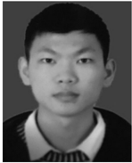

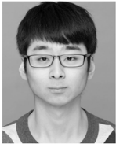

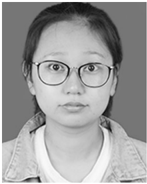

HUI ZHOU was born in 1996. He received the B.S. degree in software engineering from Xuzhou University of Technology, Jiangsu, China, in 2019. He is currently pursuing the M.S. degree with the College of Information Technology, Shanghai Ocean University. His research interests include object detection and monocular depth estimation.

YUE WANG received the B.S. degree in information and computing science from Tiangong University, Tianjin, China, in 2019. He is currently pursuing the M.S. degree with the College of Information Technology, Shanghai Ocean University. His research interests include under water image enhancement and deep learning.

XIANGZHI CHEN received the B.S. degree in computer science and technology from Chengdu University of Technology, Chengdu, China, in 2020. She is currently pursuing the M.S. degree with the College of Information Technology, Shanghai Ocean University. Her research interests include video anomaly detection and deep learning.