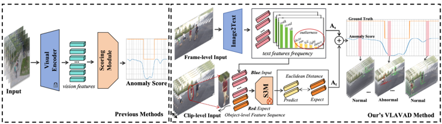
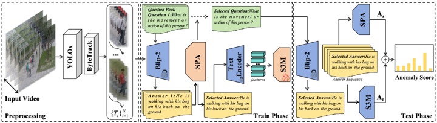

## VLAVAD: Vision-Language Models Assisted Unsupervised Video Anomaly Detection

Changkang Li 1 lichangkang@buaa.edu.cn

The School of Electrical and Information Engineering, Beihang University, Beijing 100191, China

Yalong Jiang2 † allenyljiang@buaa.edu.cn

Institute of Unmanned System, Beihang University, Beijing 100191, China

## Abstract

Video anomaly detection is a subject of great interest across industrial and academic domains because of its crucial role in computer vision applications. However, the inherent unpredictability of anomalies and the scarcity of anomaly samples present significant challenges for unsupervised learning methods. To overcome the limitations of unsupervised learning, which stem from a lack of comprehensive prior knowledge about anomalies, we propose VLAVAD (Video-Language Models Assisted Anomaly Detection). Our method employs a cross-modal pre-trained model that leverages the inferential capabilities of large language models (LLMs) in conjunction with a Selective-Prompt Adapter (SPA) for selecting semantic space. Additionally, we introduce a Sequence State Space Module (S3M) that detects temporal inconsistencies in semantic features. By mapping high-dimensional visual features to low-dimensional semantic ones, our method significantly enhance the interpretability of unsupervised anomaly detection. Our proposed approach effectively tackles the challenge of detecting elusive anomalies that are hard to discern over periods, achieving SOTA on the challenging ShanghaiTech dataset.

## 1 Introduction

Video anomaly detection (VAD) is a task of considerable practical value in various situations, such as detecting abnormal behaviors such as theft, fighting, or falls, as well as anomalous objects like vehicles entering pedestrian zones. The necessity of achieving this task increases significantly in the context of security and intelligent cities[27 , 44 , 53 , 60 , 66]. However, due to the sudden and often unclear nature of such events, identifying their time and location is highly challenging.

Abnormal occurrences in the real world are infrequent and can be classified into an extensive array of categories. Consequently, conventional supervised VAD[25 , 41 , 46 , 62] may not be suitable for this task, as it is often impractical to gather a substantial dataset with labeled abnormal samples. To address the limitations of data annotation, some researchers have turned to weakly supervised VAD that does not necessitate frame-by-frame annotations but instead relies on video-level labels. In weakly supervised VAD, a video is deemed

† Indicates Corresponding author.

© 2024. The copyright of this document resides with its authors.

It may be distributed unchanged freely in print or electronic forms.

Figure 1: Comparison between previous methods (left) and our method (right). Our purposed VLAVAD shifts from visual to semantic analysis, identifying shared attributes between normal and anomalous data while ignoring unique visual traits. Unlike traditional methods focused on specific visual cues like pose or motion, our approach is more adaptable across different scenes, facilitated by task-related semantic feature selection. Additionally, we introduce the Sequence State Space Module (S3M) to learn the temporal correlation of normal samples, thereby detecting anomalies that deviate from the normal temporal pattern.

anomalous if any part of it is labeled as such. On the other hand, a video is labeled as normal only if all of its frames are normal. However, this approach is inefficient in pinpointing the abnormal section of the video, especially when the video is long. The application of unsupervised learning methodologies[1 , 23 , 42 , 48], which involve training representations solely on regular samples, allows for the separation of anomalous samples without the need for prior knowledge about anomalies, thereby eliminating constraints imposed by the process of collecting data.

The spatial and temporal complexities of anomalous features make it difficult to identify and categorize all anomalies. Anomalous samples may not always exhibit clear differences from normal samples; instead, they may sometimes closely resemble them in certain feature dimensions. Methods that rely on visual features often make judgments based on a single observation that defines anomalies[16 , 23 , 45 , 65], resulting in the mapping of all normal samples into the same feature space and neglecting the variety of normal samples. Therefore, referencing human understanding for anomaly discrimination necessitates a multidimensional assessment, combining various factors such as human posture, optical flow, background changes, etc., for judgment. The multi-task learning paradigm that incorporates diverse types of features has shown potential to enhance accuracy[4 , 7 , 18 , 50]. However, such multi-task-based algorithms incur high transfer costs across scenes and categories, implying that achieving the desired detection performance requires fine-tuning each sub-task to strike a balance.

In recent times, the Vision-Language Models (VLM) has enhanced accuracy in visual downstream tasks, and also offer a reasonable level of interpretability[5 , 31 , 32 , 33 , 56]. To make use of the advancements in Vision-Language Pre-training models, we present the Vision-Language Model Assisted Anomaly Detection (VLAVAD). This technique makes use of Vision-Language Models (VLM) to transform images into high-level semantic representations. We replace visual features with semantic features and utilize the Selective Prompt Adapter to focus on learning effective semantics from normal samples, thereby enabling smooth adaptation to cross-scene, cross-category anomaly detection without the need for additional model training. Given the significance of accounting for temporal information in

videos for effective VAD, it is essential to consider the correlation of feature information across time. Methods that only take into account the current frame when identifying anomalies are insufficient, as they fail to capture the temporal dimension's correlation. To harness the temporal variations in semantic features, we propose the Sequence State Space Module (S3M) to learn the temporal correlation of normal samples. In contrast to convolution-based and transformer-based networks, S3M outperforms them by capturing long-range temporal context dependencies with reduced computational costs.

Our proposed method, VLAVAD, eliminates the need for collecting and labeling anomalous data, making it suitable for real-world applications. By utilizing Selective Prompt Adapter (SPA) and employing a lightweight S3M trained on normal data, our approach effectively harnesses the deep semantic information in images, allowing for precise and interpretable spatiotemporal localization of anomaly events. The method has been successfully validated across multiple datasets, showcasing its cost-effective transferability and superior performance.

In summary, our contributions can be summarized as follows:

- We present an unsupervised video anomaly detection framework called VLAVAD, which utilizes semantic features rather than visual features for anomaly detection. This framework capitalizes on the comprehension and reasoning skills of pretrained VisualLanguage model to enhance performance in VAD. Consequently, our method expands the anomaly detection from a particular dimension to open-world.
- We introduce the pioneering use of the Sequence State Space Module (S3M) to tackle temporal variation in anomaly detection, further mitigating the limitation of singleframe anomaly assessment that overlooks time-related anomalies.
- Our method allows for cost-effective universal anomaly event discrimination across scenes, achieving a 2.7% improvement in performance on the challenging cross-scene, cross-category Shanghaitech dataset. We also validate the superiority of our approach across multiple datasets.

## 2 Related Work

## 2.1 Video Anomaly Detection

In unsupervised Video Anomaly Detection tasks, two primary categories emerge: feature reconstruction and video frame interpolation. Feature reconstruction methods typically employ Auto Encoder (AE)[22 , 51 , 52] or Generative Adversarial Network (GAN)[10 , 26] to project normal data into a low-dimensional space for reconstruction in either temporal or spatial dimensions. Reconstruction methods assume a neural network model that has been exclusively trained on normal samples, which can reconstruct normal samples from lowdimensional features, while anomalous samples cannot be reconstructed[58]. Conversely, video frame interpolation methods entail training a prediction network to forecast the state of an object with missing input frames. By comparing the prediction results with actual outcomes, deviations are assessed to identify anomalies. This method assumes that a network trained on a dataset of normal samples cannot predict frames of anomalous events, thereby effectively differentiating between normal and anomalous events[22 , 68].

## 2.2 Vision-Language Pre-training

In recent years, the domain of vision-language pre-training has witnessed significant progress, primarily aimed at discerning the semantic interplay between visual and linguistic modalities through extensive pre-training on diverse datasets. A quintessential illustration of this paradigm is the CLIP[49], which excels in achieving its goals by employing an image-text contrastive learning strategy. This method involves aligning paired images and texts in the embedding space, bringing similar pairs closer together and pushing dissimilar pairs further apart. By utilizing this approach, pre-trained Vision-Language Models (VLMs) are able to acquire extensive knowledge of vision-language correspondence. This enables VLMs to make zero-shot predictions by matching the embeddings of any given images and texts.

VLMs have shown outstanding performance in diverse vision-language downstream tasks, such as image classification[49], object detection[13 , 14 , 21], scene text detection[63], image captioning[31 , 70], semantic segmentation[12 , 19]. In recent times, a number of studies have endeavored to employ pre-trained models in the domain of video. For example, CLIP4Clip[37] utilized the CLIP's expertise in video-text retrieval, while other works[34 , 47 , 59] applied CLIP to video recognition. VisualGPT[11] highlights the advantages of utilizing pretrained language models to initialize models for more efficient training with less data. Furthermore, Tsimpoukelli et al. [55] enhances performance by fine-tuning a vision encoder and aligning it with a frozen Large Language Model (LLM). Models such as BEiT3[57] and BLIP[31] employ unified transformer architectures for pretraining, and Flamingo et al. [2] introduces a cross-attention design to align visual and language modalities. Additionally, BLIP-2[32] introduces a lightweight Q-Former that converts visual features into tokens directly interpretable by a frozen LLM, achieving impressive results in both image captioning and VQA tasks. Our research leverages the VQA capabilities of BLIP-2 through our automatic questioning mechanism to extract additional image information and enhance image captions beyond the original BLIP-2 captions.

## 3 Method

## 3.1 Overview

Our main objective is to develop an unsupervised learning methodology to effectively handle scenarios with unpredictable and unobtainable anomalous data samples. Our approach involves transitioning from vision to semantic features, identifying common attributes between normal and anomalous data in the semantic space while excluding non-shared visual features. In contrast to conventional methods that heavily rely on specific aspects of visual features such as pose or optical flow data, our approach offers a significant advantage in its seamless adaptability across diverse cross-scene datasets, facilitated by the incorporation of a Prompt Adapter. Additionally, we introduce the Sequence State Space Module (S3M) to detect temporal variations in semantics, complementing single-frame detection results and addressing the limitation of underutilizing temporal information in anomaly detection.

## 3.2 Obtain Multi-object Trajectories

Our Anomaly Detection Architecture receives a series of object-level temporal image sequences for input. To achieve object detection, we employ a pre-trained YOLOx network.

Figure 2: Overview of our purposed VLAVAD. In the preprocessing stage, object-level sequences {Ti} N i=1 are obtained through detection and tracking. During training, the Selective Prompt Adapter (SPA) selects the most suitable prompt from the prompt pool to describe the dataset scene samples. Subsequently, the Sequence State Space Module (S3M) takes clip-level semantic features E(t) as input and is trained using Mean Squared Error(MSE) loss between the predicted feature output and the expected feature to learn the deviations in temporal patterns. During testing, we utilize the prompt selected by SPA from the training set to generate the answer sequence. We then calculate A s and A t , which represent the static caption anomaly score and time inconsistency anomaly score, respectively.

Additionally, we utilize the ByteTrack algorithm for object tracking to train the S3M. Consequently, we acquire object-level trace trajectories T = {Oi} fend i=fbegin , where O denote the image of the detected object, fbegin and fend denote the frame index of the object's appearance and disappearance, respectively. Finally, we obtain a object-level trajectories set {Ti} N i=1 , where N is the total number of objects detected in the video, which facilitates the segmentation of each object into clips during both training and testing phases.

## 3.3 Algorithm Description

Illustrated in the right half of Figure 2, our network comprises three components. The first component, the Selective Prompt Adapter, employs the frequency distribution of the output of LLM to compute anomaly scores for individual objects detected within a single frame. It selects the most salient score among multiple objects within the same frame and designates it as the anomaly score for that frame, denoted as Ak = max n i=1 (AO i ), where Ak represents the anomaly score for the k-th frame and AO i represents the anomaly score for the i-th object within that frame. The second component, the Sequence State Space Module (S3M), takes as input the object-level text embedding sequence generated by VLM. It undergoes unsupervised training solely on the normal samples within the training set and computes anomaly scores based on the temporal inconsistency of features during the test phase. Finally, we integrate the static anomaly scores with the dynamic ones and apply Gaussian smoothing to obtain the final score.

## 3.3.1 Selective Prompt Adater

To promote the utilization of Vision-Language Models (VLMs) in anomaly detection, we introduce the Selective Prompt Adapter (SPA) module. This component aids VLM in selecting appropriate prompts by evaluating the statistical properties of common text features in typ-

ical data. Anomaly detection typically entails mapping the input data to a low-dimensional space, and its efficacy hinges on the ability to compress input images into a low-dimensional feature space. Leveraging the dual capabilities of image and text inputs in VLMs, we are able to identify the common features of normal samples by utilizing multiple text inputs. This process effectively distinguishes them from anomalous samples and enhances the precision of anomaly detection. Specifically, the SPA module selects the most appropriate prompt for dimensionality reduction of normal samples by examining the frequency of text features. By concentrating normal samples in a more compact low-dimensional space, the final input prompt text Pselected can be represented as:

<!-- formula-not-decoded -->

In the context of object-level image inputs obtained from the training set and represented by the symbol I , GV LM denotes the vision-language model. The top (k) frequency statistics are represented by Ftopk, and Pselected denotes the prompt pool selected to maximize the concentration of output features from the training set. We choose the prompt with the highest Ft Ftopk statistics from normal samples as the optimal input for compressing common features. During the testing phase, the same set Pselected is used, and the anomaly score for each object is calculated based on the reciprocal of the frequency of occurrence of the object's text in the training dataset, as anomalies are less frequent in the selected semantic space.

<!-- formula-not-decoded -->

## 3.3.2 Sequence State Space Module

We present a Sequence State Space Module (S3M) designed to identify changes in semantic features over extended periods. The S3M extracts persistent patterns of state transitions within lengthy sequences in normal events and encodes them for predicting future states based on past observations. The model also identifies anomalies by leveraging disparities between predicted and observed states. Moreover, the S3M's ability to capture long-range dependencies enhances its capacity to uncover comprehensive anomaly clues.

The input to the S3M includes embeddings obtained from the answer text of VLM, combined with object-level trajectories. The embedding sequences of objects appearing in all frames of the video are segmented into a set of clips. The input is the text sequence output by the text encoder E, denoted as {Ei(t) , Ei(t +1) ,..., Ei(t +L c )} N i=1 , where E(t) ∈ R 512 , N is the total number of objects, and L c represents the length of each clip. The S3M function is defined as follows:

<!-- formula-not-decoded -->

<!-- formula-not-decoded -->

Here,W(t , L) represents the window function, which retains the input from the previous Lp Lp moments. E ˆ i denotes the output obtained from the S3M. The objective function of the S3M network is to reduce the divergence between ground truth sequences and predictions.

<!-- formula-not-decoded -->

Where || . ||2 denotes mean square error. The S3M is trained solely on normal samples, with the aim of learning the normal motion patterns. Therefore, when abnormal samples

from the test set are utilized as input, the module's prediction which is derived from normal patterns diverge from observations. The anomaly score at the testing stage is calculated as:

<!-- formula-not-decoded -->

## 3.3.3 Computation of Anomaly Scores

After obtaining the object-level anomaly scores A s (t) and At(t), we compute the final anomaly score A(t) as follows: the maximum score among all objects {Oi} n i=1 within the current frame is selected for both A s (t) and At(t). To reduce the impact of noise, we apply a 1-D Gaussian filter to smooth the scores. The expression can be written as:

<!-- formula-not-decoded -->

In this formula, Guess represents the 1-D Gaussian filter. A s (t) denotes the static anomaly score obtained by SPA, which includes only the information at the moment t . A t (t) denotes the dynamic anomaly score obtained by S3M, which incorporates information from a period of L c . And λ is a hyperparameter that adjusts the weight between the two.

## 4 Experiments

## 4.1 Dataset and Evaluation Metrics

Dataset: The study presented in this article employs several benchmark datasets that depict complex anomalous events occurring in diverse settings captured from various vantage points. The UCSD dataset [40] is a collection of videos captured in different crowd scenarios. The "Pedestrian 2" (Ped2) subset we used includes 16 training video samples and 12 testing video samples. The Avenue dataset [36] consists of 21 testing videos of anomalous events and 16 training videos of normal events. The dataset contains a total of 47 anomalous events, including behaviors like walking in the wrong direction, running, dancing, and object throwing. The ShanghaiTech dataset [35] comprises 330 training videos and 107 testing videos. With 13 scenes characterized by complex lighting and camera angles, this dataset includes 42,883 testing frames and 274,515 training frames. The ShanghaiTech dataset is the most extensive and intricate, presenting the greatest challenges for VAD due to its semantic complexity and cross-scene detection requirements.

Metrics: Performance metrics in anomaly detection research are typically assessed using ground truth annotations at either the frame or video level within datasets. When an anomalous event is identified within a frame, the entire frame is classified as anomalous, evaluating frame-level metrics. Due to the inherent imbalance between normal and anomalous samples in anomaly detection datasets, we evaluate the performance of VAD using the area under the curve (AUC) of the frame-level receiver operating characteristics (ROC), which remains indifferent to thresholding in the detection task.

## 4.2 Implementation Details

For the network structure, we utilized the ByteTrack model [67] pretrained on the MOT17 dataset [43], with its backbone derived from the pretrained YOLOx [17] on MS-COCO. The

Table 1: Comparison of the AUC on the UCSD Ped2, Avenue, and ShanghaiTech.

| Pub. Year    | Methods                                                                              | UCSD Ped2                             | Avenue                                                 | ShanghaiTech                        |
|--------------|--------------------------------------------------------------------------------------|---------------------------------------|--------------------------------------------------------|-------------------------------------|
| 2018 before  | MPPC+SFA[40] 
 Conv-AE[22] 
 ConvLSTM-AE[38] 
 StackRNN[39] 
 FPd[35]                | 61.3% 
 90.0%                         | - 
 70.2%                                              | -
 -                                |
| 2020         | StackRNN[39] 
 Frame-Pred[35] 
 Mem-AE[20] 
 AnoPCN[64] 
 Deep-OC[61] 
 ClusterAE[8] | 90.0% 
 88.1% 
 92.21% 
 95.4% 
 941% | 77.0% 
 81.71% 
 85.1% 
 83.3% 
 86.2% 
 86.6% 
 86.0% | -
 -
 68.0%
 72.8%
 71.2%
 73.6%
 – |
| 2020         | ClusterAE[8] 
 IPR[54] 
 MNAD-Recon[48] 
 CT-D2GAN[15]                               | 96.5% 
 96.20% 
 90.2%                | 83.70% 
 82.8% 
 859%                                  | 69.8%
 77.7%
 76.0%
 736%           |
| 2021         | CT-D2GAN[15
 LNRA[3] 
 ARAE[29]                                                      | 97.2% 
 96.5%                         | 82.8% 
 85.9% 
 84.7%                                  | 77.7%
 76.0%
 73.6%                 |
| 2022         | ARAE[29] 
 CR-BPN [9]                                                                | 97.4% 
 98.3%                         | 86.7% 
 90.3%                                          | 73.6%
 78.1%
 735%                  |
| 2022         | ARAE[29] 
 CR-BPN [9] 
 MGME [69]                                                    | 96.8%                                 | 86.2%                                                  | 73.6%
 78.1%
 73.5%
 845%           |
| 2023         | Deep-OC[61] 
 ClusterAE[8] 
 IPR[54]                                                 | 96.9%                                 | 86.2% 
 86.6%                                          | 84.5%
 75.8%                        |
| 2020         | ClusterAE[8] 
 IPR[54] 
 MNAD-Recon[48]                                              | 96.5% 
 96.20%                        | 86.0% 
 83.70%                                         | 73.3%
 71.50%                       |
| 2020         | ClusterAE[8] 
 IPR[54] 
 MNAD-Recon[48                                               | 96.5% 
 96.20%                        | 83.70%                                                 | 73.3%
 71.50%                       |
|              | IPR[54] 
 MNAD-Recon[4                                                               | 96.20% 
 902%                         | 83.70% 
 828%                                          | 71.50%                              |
| 2023         | LNRA[3] 
 ARAE[29] 
 CR-BPN [9]                                                      | 97.2% 
 96.5%                         | 85.9% 
 84.7%                                          | 77.7%
 76.0%                        |
| 2022         | CR-KR[6] 
 Ours                                                                      | 97.1% 
 99.0%                         | 86.7% 
 90.3% 
 86%                                    | 73.6%
 78.1%
 735%                  |
| 2022         | ARAE[29] 
 CR-BPN [9] 
 G69                                                          | 97.4% 
 98.3%                         | 86.7% 
 90.3% 
 876%                                   | 73.6%
 78.1%                        |
| 2022         | CR-BPN [9]                                                                           | 98.3%                                 | 90.3%                                                  | 78.1%                               |
| 2023         | MGME [69]                                                                            | 97.8%                                 | 87.6%                                                  | 73.5%                               |
| 2023         | SPTD[28]                                                                             | -                                     | -                                                      | 84.5%                               |
| 2023         | OFR-E[24]                                                                            | 97.7%                                 | 89.7%                                                  | 75.8%                               |
| 2024         | STM[30]                                                                              | 97.0%                                 | 87.7%                                                  | 76.1%                               |
| 2024         | CR-KR[6]                                                                             | 97.1%                                 | 90.8%                                                  | 83.7%                               |
| 2024         | Ours                                                                                 | 99.0%                                 | 87.6%                                                  | 87.2%                               |

tracking confidence threshold parameter was set to 0.5 for both training and testing sets, with an NMS threshold of 0.3, filtering out tiny boxes with an area less than 300. Regarding the pretrained Blip-2[32] on a combined dataset of 129 million images from COCO, Visual Genome, CC3M, etc., its Image Encoder part was pretrained ViT-g, while the Large Language Model part utilized a lighter pretrained OPT-2.7B. Three input prompt texts were selected for pose and behavior, Question 1: "What is the pose of the person in the picture?" Question 2: "What is the behavior or action of the person in the picture?" Question 3: "What does the person in the picture look like?" The S3M's layers were configured with 3 layers, with 10 input frames and 2 predicted frames for Avenue and Ped2, and 20 input frames and 4 predicted frames for the ShanghaiTech. The learning rate was set to 5e-1 for Avenue and Ped2, and 5e-2 for ShanghaiTech. Finally, for the Anomaly Scoring, the λ were set to 0.1, and GMM was used for Gaussian smoothing, with sigma values of 6, 6, and 12 for Ped2, Avenue, and ShanghaiTech.

## 4.3 Comparison with state-of-the-art methods

Our VLAVAD has been compared with other unsupervised anomaly detection methods in Table 1. On the UCSD Ped2 and ShanghaiTech datasets, the combined results demonstrated a significant lead over the state of the art, achieving AUC scores of 99.0% and 87.2% respectively. Notably, the latter achieved a lead of 2.7%, making it a substantial benchmark across scenarios involving 130 complex anomalous events, both human-related and unrelated. Our AUC scores on this dataset exceed those of other methods, confirming that our model is

Table 2: Ablation study results on Ped2 and ShanghaiTech datasets.

| As    | As    | At     | At    | At    | Dataset
 Shhith   | Dataset
 Shhith   |
|-------|-------|--------|-------|-------|-------------------|-------------------|
| kNN   | SPA   | Trans. | RNN   | S3M   | Ped2              | Shanghaitech      |
| ✓     | -     | -      | -     | -     | 96.3%             | 72.3%             |
| -     | ✓     | -      | -     | -     | 98.2%             | 86.5%             |
| -     | -     | ✓      | -     | -     | 93.2%             | 81.2%             |
| -     | -     | -      | ✓     | -     | 92.3%             | 80.7%             |
| -     | -     | -      | -     | ✓     | 96.6%             | 82.6%             |
| -     | ✓     | -      | -     | ✓     | 99.0%             | 87.2%             |

better suited for universal anomaly detection scenarios. Nevertheless, our experimental outcomes on the CHUK Avenue dataset did not achieve parity with the SOTA benchmarks. This divergence can be principally attributed to the dataset's unconventional anomaly definition criteria, which uniquely consider variables such as the directionality of human locomotion as anomalous indicators, while our model did not account for the incorporation of pedestrian walking direction as an atypical anomaly within its caption. Consequently, this dataset performs better when focusing on velocity, such as using optical flow for discrimination.

## 4.4 Ablation Study

To assess the usefulness of mining text features generated by VLM for anomaly detection, we compared directly using the 512-D visual features output by the image encoder of CLIP for kNN classification and the scores obtained from SPA. Furthermore, in order to verify the effectiveness of both input pathways, we conducted an Absolute Study by adjusting the λ. The AUC achieved by kNN classification using only the visual features produced by the Visual Encoder is lower than that obtained when utilizing SPA for feature mining on both the Ped2 and ShanghaiTech datasets, highlighting the effectiveness of visual features over semantic features for anomaly detection. Additionally, we replaced S3M with transformer and RNN structures for experimentation, and S3M outperformed these two models due to its characteristics that make it less prone to overfitting, which are more suitable for this prediction task. Finally, incorporating S3M on both datasets shows a certain degree of improvement. This improvement is attributed to the presence of short-duration anomaly events that may be intermittent in time, with S3M aiding in the detection of anomalies with longer durations. The experimental results are shown in Table 2 .

## 5 Conclusions

Previous efforts in video anomaly detection have typically relied on visual representations, which has limited the ability to generalize across diverse situations. For instance, behaviors that are considered typical in one context may be deemed anomalous in another. Our method addresses this challenge by employing the Selective Prompt Adapter (SPA) to enable a pretrained VLMs to perform cross-scenario, interpretable anomaly detection more effectively. The advancement of cross-modal large models, as well as the progress in cross-modal matching models and Language Language Models (LLMs), has made it possible to extend this technique to enhance the interpretability and generalization of VAD.

## 6 Acknowledgements

This work was supported inpart by the National Natural Science Foundation of China under Grant 62301020 and in part by Beijing Natural Science Foundation under Grant 4234085.

## References

- [1] Samet Akcay, Amir Atapour-Abarghouei, and Toby P Breckon. Ganomaly: Semisupervised anomaly detection via adversarial training. In Computer Vision–ACCV 2018: 14th Asian Conference on Computer Vision, Perth, Australia, December 2–6, 2018, Revised Selected Papers, Part III 14, pages 622–637. Springer, 2019.
- [2] Jean-Baptiste Alayrac, Jeff Donahue, Pauline Luc, Antoine Miech, Iain Barr, Yana Hasson, Karel Lenc, Arthur Mensch, Katherine Millican, Malcolm Reynolds, et al. Flamingo: a visual language model for few-shot learning. Advances in neural information processing systems, 35:23716–23736, 2022.
- [3] Marcella Astrid, Muhammad Zaigham Zaheer, Jae-Yeong Lee, and Seung-Ik Lee. Learning not to reconstruct anomalies. arXiv preprint arXiv:2110.09742, 2021.
- [4] Mohammad Baradaran and Robert Bergevin. Multi-task learning based video anomaly detection with attention. In Proceedings of the IEEE/CVF Conference on Computer Vision and Pattern Recognition, pages 2885–2895, 2023.
- [5] Federico Bianchi, Giuseppe Attanasio, Raphael Pisoni, Silvia Terragni, Gabriele Sarti, and Sri Lakshmi. Contrastive language-image pre-training for the italian language. arXiv preprint arXiv:2108.08688, 2021.
- [6] Congqi Cao, Yue Lu, and Yanning Zhang. Context recovery and knowledge retrieval: A novel two-stream framework for video anomaly detection. IEEE Transactions on Image Processing, 2024.
- [7] Xingya Chang, Yuxin Zhang, Dingyu Xue, and Dongyue Chen. Multi-task learning for video anomaly detection. Journal of Visual Communication and Image Representation , 87:103547, 2022.
- [8] Yunpeng Chang, Zhigang Tu, Wei Xie, and Junsong Yuan. Clustering driven deep autoencoder for video anomaly detection. In Computer Vision–ECCV 2020: 16th European Conference, Glasgow, UK, August 23–28, 2020, Proceedings, Part XV 16, pages 329–345. Springer, 2020.
- [9] Chengwei Chen, Yuan Xie, Shaohui Lin, Angela Yao, Guannan Jiang, Wei Zhang, Yanyun Qu, Ruizhi Qiao, Bo Ren, and Lizhuang Ma. Comprehensive regularization in a bi-directional predictive network for video anomaly detection. In Proceedings of the AAAI Conference on Artificial Intelligence, volume 36, pages 230–238, 2022.
- [10] Dongyue Chen, Lingyi Yue, Xingya Chang, Ming Xu, and Tong Jia. Nm-gan: Noisemodulated generative adversarial network for video anomaly detection. Pattern Recognition, 116:107969, 2021.

- [11] Jun Chen, Han Guo, Kai Yi, Boyang Li, and Mohamed Elhoseiny. Visualgpt: Dataefficient adaptation of pretrained language models for image captioning. In Proceedings of the IEEE/CVF Conference on Computer Vision and Pattern Recognition, pages 18030–18040, 2022.
- [12] Jian Ding, Nan Xue, Gui-Song Xia, and Dengxin Dai. Decoupling zero-shot semantic segmentation. In Proceedings of the IEEE/CVF Conference on Computer Vision and Pattern Recognition, pages 11583–11592, 2022.
- [13] Yu Du, Fangyun Wei, Zihe Zhang, Miaojing Shi, Yue Gao, and Guoqi Li. Learning to prompt for open-vocabulary object detection with vision-language model. In Proceedings of the IEEE/CVF Conference on Computer Vision and Pattern Recognition, pages 14084–14093, 2022.
- [14] Chengjian Feng, Yujie Zhong, Zequn Jie, Xiangxiang Chu, Haibing Ren, Xiaolin Wei, Weidi Xie, and Lin Ma. Promptdet: Towards open-vocabulary detection using uncurated images. In European Conference on Computer Vision, pages 701–717. Springer, 2022.
- [15] Xinyang Feng, Dongjin Song, Yuncong Chen, Zhengzhang Chen, Jingchao Ni, and Haifeng Chen. Convolutional transformer based dual discriminator generative adversarial networks for video anomaly detection. In Proceedings of the 29th ACM International Conference on Multimedia, pages 5546–5554, 2021.
- [16] Alessandro Flaborea, Luca Collorone, Guido Maria D'Amely Di Melendugno, Stefano D'Arrigo, Bardh Prenkaj, and Fabio Galasso. Multimodal motion conditioned diffusion model for skeleton-based video anomaly detection. In Proceedings of the IEEE/CVF International Conference on Computer Vision, pages 10318–10329, 2023.
- [17] Zheng Ge, Songtao Liu, Feng Wang, Zeming Li, and Jian Sun. Yolox: Exceeding yolo series in 2021. arXiv preprint arXiv:2107.08430, 2021.
- [18] Mariana-Iuliana Georgescu, Antonio Barbalau, Radu Tudor Ionescu, Fahad Shahbaz Khan, Marius Popescu, and Mubarak Shah. Anomaly detection in video via selfsupervised and multi-task learning. In Proceedings of the IEEE/CVF conference on computer vision and pattern recognition, pages 12742–12752, 2021.
- [19] Golnaz Ghiasi, Xiuye Gu, Yin Cui, and Tsung-Yi Lin. Scaling open-vocabulary image segmentation with image-level labels. In European Conference on Computer Vision , pages 540–557. Springer, 2022.
- [20] Dong Gong, Lingqiao Liu, Vuong Le, Budhaditya Saha, Moussa Reda Mansour, Svetha Venkatesh, and Anton van den Hengel. Memorizing normality to detect anomaly: Memory-augmented deep autoencoder for unsupervised anomaly detection. In Proceedings of the IEEE/CVF international conference on computer vision, pages 1705– 1714, 2019.
- [21] Xiuye Gu, Tsung-Yi Lin, Weicheng Kuo, and Yin Cui. Open-vocabulary object detection via vision and language knowledge distillation. arXiv preprint arXiv:2104.13921 , 2021.

- [22] Mahmudul Hasan, Jonghyun Choi, Jan Neumann, Amit K Roy-Chowdhury, and Larry S Davis. Learning temporal regularity in video sequences. In Proceedings of the IEEE conference on computer vision and pattern recognition, pages 733–742, 2016.
- [23] Or Hirschorn and Shai Avidan. Normalizing flows for human pose anomaly detection. In Proceedings of the IEEE/CVF International Conference on Computer Vision, pages 13545–13554, 2023.
- [24] Heqing Huang, Bing Zhao, Fei Gao, Penghui Chen, Jun Wang, and Amir Hussain. A novel unsupervised video anomaly detection framework based on optical flow reconstruction and erased frame prediction. Sensors, 23(10):4828, 2023.
- [25] Radu Tudor Ionescu, Fahad Shahbaz Khan, Mariana-Iuliana Georgescu, and Ling Shao. Object-centric auto-encoders and dummy anomalies for abnormal event detection in video. In Proceedings of the IEEE/CVF conference on computer vision and pattern recognition, pages 7842–7851, 2019.
- [26] Samuel D Jackson and Fabio Cuzzolin. Svd-gan for real-time unsupervised video anomaly detection. In Proceedings of the British Machine Vision Conference (BMVC), Virtual, pages 22–25, 2021.
- [27] Shunsuke Kamijo, Yasuyuki Matsushita, Katsushi Ikeuchi, and Masao Sakauchi. Traffic monitoring and accident detection at intersections. IEEE transactions on Intelligent transportation systems, 1(2):108–118, 2000.
- [28] Jaehyun Kim, Seongwook Yoon, Taehyeon Choi, and Sanghoon Sull. Unsupervised video anomaly detection based on similarity with predefined text descriptions. Sensors , 23(14):6256, 2023.
- [29] Viet-Tuan Le and Yong-Guk Kim. Attention-based residual autoencoder for video anomaly detection. Applied Intelligence, 53(3):3240–3254, 2023.
- [30] Hongjun Li and Mingyi Chen. A novel spatio-temporal memory network for video anomaly detection. Multimedia Tools and Applications, pages 1–22, 2024.
- [31] Junnan Li, Dongxu Li, Caiming Xiong, and Steven Hoi. Blip: Bootstrapping languageimage pre-training for unified vision-language understanding and generation. In International conference on machine learning, pages 12888–12900. PMLR, 2022.
- [32] Junnan Li, Dongxu Li, Silvio Savarese, and Steven Hoi. Blip-2: Bootstrapping language-image pre-training with frozen image encoders and large language models. In International conference on machine learning, pages 19730–19742. PMLR, 2023.
- [33] Liunian Harold Li, Pengchuan Zhang, Haotian Zhang, Jianwei Yang, Chunyuan Li, Yiwu Zhong, Lijuan Wang, Lu Yuan, Lei Zhang, Jenq-Neng Hwang, et al. Grounded language-image pre-training. In Proceedings of the IEEE/CVF Conference on Computer Vision and Pattern Recognition, pages 10965–10975, 2022.
- [34] Ruyang Liu, Jingjia Huang, Ge Li, Jiashi Feng, Xinglong Wu, and Thomas H Li. Revisiting temporal modeling for clip-based image-to-video knowledge transferring. In Proceedings of the IEEE/CVF Conference on Computer Vision and Pattern Recognition, pages 6555–6564, 2023.

- [35] Wen Liu, Weixin Luo, Dongze Lian, and Shenghua Gao. Future frame prediction for anomaly detection–a new baseline. In Proceedings of the IEEE conference on computer vision and pattern recognition, pages 6536–6545, 2018.
- [36] Cewu Lu, Jianping Shi, and Jiaya Jia. Abnormal event detection at 150 fps in matlab. In Proceedings of the IEEE international conference on computer vision, pages 2720– 2727, 2013.
- [37] Huaishao Luo, Lei Ji, Ming Zhong, Yang Chen, Wen Lei, Nan Duan, and Tianrui Li. Clip4clip: An empirical study of clip for end to end video clip retrieval and captioning. Neurocomputing, 508:293–304, 2022.
- [38] Weixin Luo, Wen Liu, and Shenghua Gao. Remembering history with convolutional lstm for anomaly detection. In 2017 IEEE International conference on multimedia and expo (ICME), pages 439–444. IEEE, 2017.
- [39] Weixin Luo, Wen Liu, and Shenghua Gao. A revisit of sparse coding based anomaly detection in stacked rnn framework. In Proceedings of the IEEE international conference on computer vision, pages 341–349, 2017.
- [40] Vijay Mahadevan, Weixin Li, Viral Bhalodia, and Nuno Vasconcelos. Anomaly detection in crowded scenes. In 2010 IEEE Computer Society Conference on Computer Vision and Pattern Recognition, pages 1975–1981, 2010. doi: 10.1109/CVPR.2010. 5539872.
- [41] Romany F Mansour, José Escorcia-Gutierrez, Margarita Gamarra, Jair A Villanueva, and Nallig Leal. Intelligent video anomaly detection and classification using faster rcnn with deep reinforcement learning model. Image and Vision Computing, 112:104229, 2021.
- [42] Jefferson Ryan Medel and Andreas Savakis. Anomaly detection in video using predictive convolutional long short-term memory networks. arXiv preprint arXiv:1612.00390, 2016.
- [43] Anton Milan, Laura Leal-Taixé, Ian Reid, Stefan Roth, and Konrad Schindler. Mot16: A benchmark for multi-object tracking. arXiv preprint arXiv:1603.00831, 2016.
- [44] Sadegh Mohammadi, Alessandro Perina, Hamed Kiani, and Vittorio Murino. Angry crowds: Detecting violent events in videos. In Computer Vision–ECCV 2016: 14th European Conference, Amsterdam, The Netherlands, October 11–14, 2016, Proceedings, Part VII 14, pages 3–18. Springer, 2016.
- [45] Romero Morais, Vuong Le, Truyen Tran, Budhaditya Saha, Moussa Mansour, and Svetha Venkatesh. Learning regularity in skeleton trajectories for anomaly detection in videos. In Proceedings of the IEEE/CVF conference on computer vision and pattern recognition, pages 11996–12004, 2019.
- [46] Medhini G Narasimhan and Sowmya Kamath S. Dynamic video anomaly detection and localization using sparse denoising autoencoders. Multimedia Tools and Applications , 77:13173–13195, 2018.

- [47] Bolin Ni, Houwen Peng, Minghao Chen, Songyang Zhang, Gaofeng Meng, Jianlong Fu, Shiming Xiang, and Haibin Ling. Expanding language-image pretrained models for general video recognition. In European Conference on Computer Vision, pages 1–18. Springer, 2022.
- [48] Hyunjong Park, Jongyoun Noh, and Bumsub Ham. Learning memory-guided normality for anomaly detection. In Proceedings of the IEEE/CVF conference on computer vision and pattern recognition, pages 14372–14381, 2020.
- [49] Alec Radford, Jong Wook Kim, Chris Hallacy, Aditya Ramesh, Gabriel Goh, Sandhini Agarwal, Girish Sastry, Amanda Askell, Pamela Mishkin, Jack Clark, et al. Learning transferable visual models from natural language supervision. In International conference on machine learning, pages 8748–8763. PMLR, 2021.
- [50] Tal Reiss and Yedid Hoshen. Attribute-based representations for accurate and interpretable video anomaly detection. arXiv preprint arXiv:2212.00789, 2022.
- [51] Manassés Ribeiro, André Eugênio Lazzaretti, and Heitor Silvério Lopes. A study of deep convolutional auto-encoders for anomaly detection in videos. Pattern Recognition Letters, 105:13–22, 2018.
- [52] Mohammad Sabokrou, Mahmood Fathy, and Mojtaba Hoseini. Video anomaly detection and localisation based on the sparsity and reconstruction error of auto-encoder. Electronics Letters, 52(13):1122–1124, 2016.
- [53] Waqas Sultani, Chen Chen, and Mubarak Shah. Real-world anomaly detection in surveillance videos. In Proceedings of the IEEE conference on computer vision and pattern recognition, pages 6479–6488, 2018.
- [54] Yao Tang, Lin Zhao, Shanshan Zhang, Chen Gong, Guangyu Li, and Jian Yang. Integrating prediction and reconstruction for anomaly detection. Pattern Recognition Letters, 129:123–130, 2020.
- [55] Maria Tsimpoukelli, Jacob L Menick, Serkan Cabi, SM Eslami, Oriol Vinyals, and Felix Hill. Multimodal few-shot learning with frozen language models. Advances in Neural Information Processing Systems, 34:200–212, 2021.
- [56] Mengmeng Wang, Jiazheng Xing, and Yong Liu. Actionclip: A new paradigm for video action recognition. arXiv preprint arXiv:2109.08472, 2021.
- [57] Wenhui Wang, Hangbo Bao, Li Dong, Johan Bjorck, Zhiliang Peng, Qiang Liu, Kriti Aggarwal, Owais Khan Mohammed, Saksham Singhal, Subhojit Som, et al. Image as a foreign language: Beit pretraining for all vision and vision-language tasks. arXiv preprint arXiv:2208.10442, 2022.
- [58] Yuzheng Wang, Zhaoyu Chen, Dingkang Yang, Yang Liu, Siao Liu, Wenqiang Zhang, and Lizhe Qi. Adversarial contrastive distillation with adaptive denoising. In ICASSP 2023-2023 IEEE International Conference on Acoustics, Speech and Signal Processing (ICASSP), pages 1–5. IEEE, 2023.

- [59] Syed Talal Wasim, Muzammal Naseer, Salman Khan, Fahad Shahbaz Khan, and Mubarak Shah. Vita-clip: Video and text adaptive clip via multimodal prompting. In Proceedings of the IEEE/CVF Conference on Computer Vision and Pattern Recognition, pages 23034–23044, 2023.
- [60] Donglai Wei, Yang Liu, Xiaoguang Zhu, Jing Liu, and Xinhua Zeng. Msaf: Multimodal supervise-attention enhanced fusion for video anomaly detection. IEEE Signal Processing Letters, 29:2178–2182, 2022.
- [61] Peng Wu, Jing Liu, and Fang Shen. A deep one-class neural network for anomalous event detection in complex scenes. IEEE transactions on neural networks and learning systems, 31(7):2609–2622, 2019.
- [62] Ke Xu, Tanfeng Sun, and Xinghao Jiang. Video anomaly detection and localization based on an adaptive intra-frame classification network. IEEE Transactions on Multimedia, 22(2):394–406, 2019.
- [63] Chuhui Xue, Wenqing Zhang, Yu Hao, Shijian Lu, Philip HS Torr, and Song Bai. Language matters: A weakly supervised vision-language pre-training approach for scene text detection and spotting. In European Conference on Computer Vision, pages 284– 302. Springer, 2022.
- [64] Muchao Ye, Xiaojiang Peng, Weihao Gan, Wei Wu, and Yu Qiao. Anopcn: Video anomaly detection via deep predictive coding network. In Proceedings of the 27th ACM international conference on multimedia, pages 1805–1813, 2019.
- [65] Yuan Yuan, Yachuang Feng, and Xiaoqiang Lu. Structured dictionary learning for abnormal event detection in crowded scenes. Pattern Recognition, 73:99–110, 2018.
- [66] Muhammad Zaigham Zaheer, Arif Mahmood, Marcella Astrid, and Seung-Ik Lee. Claws: Clustering assisted weakly supervised learning with normalcy suppression for anomalous event detection. In Computer Vision–ECCV 2020: 16th European Conference, Glasgow, UK, August 23–28, 2020, Proceedings, Part XXII 16, pages 358–376. Springer, 2020.
- [67] Yifu Zhang, Peize Sun, Yi Jiang, Dongdong Yu, Fucheng Weng, Zehuan Yuan, Ping Luo, Wenyu Liu, and Xinggang Wang. Bytetrack: Multi-object tracking by associating every detection box. In European conference on computer vision, pages 1–21. Springer, 2022.
- [68] Yiru Zhao, Bing Deng, Chen Shen, Yao Liu, Hongtao Lu, and Xian-Sheng Hua. Spatiotemporal autoencoder for video anomaly detection. In Proceedings of the 25th ACM international conference on Multimedia, pages 1933–1941, 2017.
- [69] Liuping Zhou and Jing Yang. Video anomaly detection with memory-guided multilevel embedding. International Journal of Multimedia Information Retrieval, 12(1):6, 2023.
- [70] Luowei Zhou, Hamid Palangi, Lei Zhang, Houdong Hu, Jason Corso, and Jianfeng Gao. Unified vision-language pre-training for image captioning and vqa. In Proceedings of the AAAI conference on artificial intelligence, volume 34, pages 13041–13049, 2020.