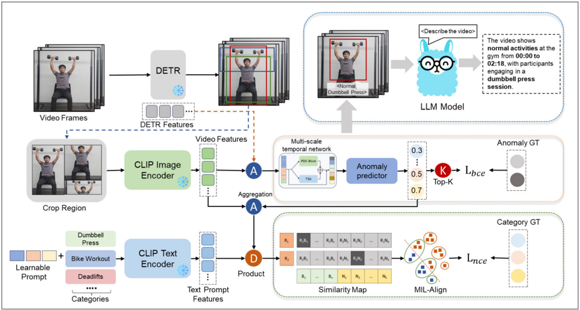

## AADC-Net: A Multimodal Deep Learning Framework for Automatic Anomaly Detection in Real-Time Surveillance

Duc Tri Phan , Member, IEEE, Vu Hoang Minh Doan , Jaeyeop Choi , Byeongil Lee , and Junghwan Oh , Senior Member, IEEE

Abstract— Automatic anomaly detection (AAD) has emerged as an advanced vision-based measurement method with diverse applications in healthcare and security. However, current AAD methods still face challenges related to data limitations and labeled-data imbalances, which limit the accuracy and reliability of AAD in real-life applications. Additionally, labeling and training large datasets for video anomaly detection (VAD) is computationally demanding and time-consuming. To address these challenges, this work introduces AADC-Net, a multimodal deep neural network for automated abnormal event detection and categorization. The key contributions of this research are as follows: 1) AADC-Net leverages pretrained large language models (LLMs) and vision-language models (VLMs) to mitigate VAD dataset limitations and imbalances; 2) a pretrained object detection model [DEtection TRansformer (DETR)] is integrated for visual feature extraction, eliminating the need for bounding box supervision; 3) the experimental results demonstrate the state-of-the-art (SOTA) performance of the proposed AADC-Net with an area under the curve (AUC) of 83.2% and an average precision (AP) of 83.8% on the public UCF-Crime and XDViolence datasets, respectively; and 4) additionally, AADC-Net can be integrated into existing video surveillance systems, such as those in smart gyms and healthcare facilities, to automatically detect anomalies in real time with minimal supervision, enhancing security, monitoring, and reducing labor costs while minimizing human error. In summary, our results demonstrate that AADC-Net not only achieves high accuracy in anomaly detection but also provides a practical solution for real-world surveillance applications.

Received 30 December 2024; revised 17 February 2025; accepted 25 February 2025. Date of publication 31 March 2025; date of current version 16 April 2025. This work was supported by the National Research Foundation of Korea (NRF) Grant funded by the Korean Government (MSIT) under Grant 2022R1A5A8023404. The Associate Editor coordinating the review process was Dr. Sudao He. (Duc Tri Phan and Vu Hoang Minh Doan contributed equally to this work.) (Corresponding authors: Byeongil Lee; Junghwan Oh.)

Duc Tri Phan was with the Department of Biomedical Engineering, Pukyong National University, Busan 48513, South Korea. He is now with the Early Mental Potential and Wellbeing Research Centre (EMPOWER), Nanyang Technological University, Singapore 639798 (e-mail: ductri.phan@ ntu.edu.sg).

Vu Hoang Minh Doan and Jaeyeop Choi are with the Smart GymBased Translational Research Center for Active Senior's Healthcare, Pukyong National University, Busan 48513, South Korea (e-mail: doanvuhoangminh@ gmail.com; jaeyeopchoi@pknu.ac.kr).

Byeongil Lee is with the Digital Healthcare Research Center, Institute of Information Technology and Convergence, Pukyong National University, Busan 48513, South Korea (e-mail: bilee@pknu.ac.kr).

Junghwan Oh is with Ohlabs Corporation, Busan 48513, South Korea, and also with Industry 4.0 Convergence Bionics Engineering and the Department of Biomedical Engineering, Pukyong National University, Busan 48513, South Korea (e-mail: jungoh@pknu.ac.kr).

Digital Object Identifier 10.1109/TIM.2025.3551832

Index Terms— Automatic anomaly detection (AAD), real-time surveillance, video anomaly detection (VAD), vision-based methods, vision-language model (VLM).

## I. INTRODUCTION

V IDEO anomaly detection (VAD) is a computational tool used to detect unusual or abnormal events within video sequences, contributing to automated monitoring systems [1] . These abnormal patterns could include unusual movements, behaviors, or any irregular and unexpected activities [2]. More specifically, VAD aims to determine if each given video frame contains any anomalies [3]. In real life, monitoring abnormal activities manually is a challenging task because they rarely occur compared to normal ones. Therefore, developing automated VAD techniques is essential for minimizing unnecessary workload and increasing the efficiency of real-time surveillance and security systems.

VAD has been extensively studied and employed in real-world scenarios due to its practical benefits [4] , [5] , [6] , [7]. In surveillance and security, VAD can help detect intruders in restricted areas and identify suspicious activities in public places, such as violent or terrorist acts [8] , [9] , [10] . In healthcare, it can monitor patients for abnormal movements or behaviors and detect falls or medical emergencies in patient care services, thereby reducing the workload of nurses and doctors [11] , [12]. VAD is also utilized in industrial and manufacturing settings for detecting equipment malfunctions and identifying safety violations [13] , [14] , [15] , [16]. Current research on VAD in smart gyms primarily focuses on monitoring workout routines, such as weight lifting, to ensure proper form [17]. Despite its limitations in implementation within workouts, VAD shows several promising applications for enhancing personalized training and feedback, safety monitoring, and identifying abnormal activities.

Over the past few years, deep learning approaches have been widely used for VAD applications. Convolutional neural networks (CNNs) and long short-term memory networks (LSTMs) excel in learning complex patterns and hierarchical features from raw video data, making them ideal for detecting anomalies [18] , [19]. Their ability to describe strongly nonlinear spatial and temporal relationships without manual feature engineering is a significant advantage, allowing them to adapt to various scenarios [20]. However, their limitations include the requirement of large datasets for training and significant

1557-9662 © 2025 IEEE. All rights reserved, including rights for text and data mining, and training of artificial intelligence and similar technologies. Personal use is permitted, but republication/redistribution requires IEEE permission.

See https://www.ieee.org/publications/rights/index.html for more information.

Fig. 1. Prediction scores from baseline VAD models and video descriptions using VLM and LLM models are employed for workout categorization and abnormal detection. On the score curve, the red dashed lines denote anomaly thresholds. The bottom shows the answers from our proposed video-LLM model for the VAD video description.

computational resources [21]. They can be challenging to interpret, often acting as black boxes without clear insight into how decisions are made [22]. Spatiotemporal feature-based methods, such as dynamic texture models, treat videos as a linear dynamic system over time [23] , [24]. These methods are well-known for detecting anomalies in dynamic scenes, such as abnormal crowd activities [25]. However, dynamic texture models can only effectively handle videos with smooth movements, are sensitive to noise, and require precise feature extraction [26] .

Despite various meaningful and innovative studies on VAD, several technical challenges remain in this field.

- 1) The effectiveness of VAD is highly dependent on the complexity of real-world scenes, such as weather conditions, lighting variations, and background activities [27] , [28] .
- 2) Data scarcity is another challenge for VAD systems. Training data might not cover all possible abnormal events in social behaviors, leading to potential mispredictions by classical supervised models for detecting anomalies [29] .
- 3) Moreover, the rarity of anomalies in daily life compared to normal activities causes an imbalance between positive and negative classes in the training dataset, resulting in low precision for minority class predictions [30] .
- 4) Besides that, the data collection and labeling process in VAD is time-consuming, and deploying trained models for real-time video data prediction can be computationally intensive [31] .

To address these challenges, we proposed a deep learning model that integrates large language models (LLMs) and vision-language models (VLMs) for VAD applications.

LLMs and VLMs are renowned for their ability to process and comprehend complex data across a wide range of applications. LLMs provide transformative capabilities by enhancing how systems interact with video data in VAD [32] . VLMs enable a more comprehensive analysis of videos by integrating visual data from video frames with contextual information from associated textual data [33]. This multimodal approach combines visual signals from video frames with contextual information from textual data, enabling the detection of context-specific anomalies that might be missed by visual data alone. The large pretrained dataset of VLMs effectively targets the data scarcity and imbalance challenges of VAD applications. The proposed unsupervised models eliminate the need for time-consuming data labeling processes. LLMs and VLMs thus support more intuitive and effective anomaly detection by incorporating both visual and textual data to analyze and respond to complex situations in real time. Furthermore, by incorporating advanced object detection models and the Top-K selection mechanism, the impact of environmental changes on detection performance is minimized.

In summary, we propose a multimodal network based on LLM and VLM models for automatic abnormal event detection and categorization. As illustrated in Fig. 1, our anomaly detector aims to generate frame-level anomaly confidences, categories, localization, and video descriptions with only video-level annotations provided. The main contributions and advantages of the research are outlined as follows.

- 1) We present a novel unsupervised framework, namely AADC-Net, for abnormal event detection and categorization. The AADC-Net is based on LLM and VLM models to address the data limitations of VAD, resulting in enhanced accuracy for abnormal detection and classification.
- 2) The pretrained object detection model [DEtection TRansformer (DETR)] was implemented for visual feature extraction and bounding box detection without supervision. Moreover, we employed a Top-K selection mechanism for abnormal detection in video frames and utilized the multi-instance learning (MIL)-Align mechanism to extend our approach beyond binary classification to handle multiple classes. We leveraged a pretrained LLM model to provide detailed video descriptions.
- 3) The performance of our AADC-Net model was evaluated using two widely recognized metrics and compared against current state-of-the-art (SOTA) methods. Our model achieved an area under the curve (AUC) of 83.2% on the UCF-Crime dataset and an average precision (AP) of 83.8% on the XD-Violence dataset, demonstrating its effective classification capabilities.
- 4) Finally, we present a framework utilizing our AADC-Net model as a video processing node. This framework is applied to a smart gym surveillance system to demonstrate the AADC-Net model's applicability in real-world scenarios.

The rest of this article is structured as follows. Section II provides a review of related work on VAD, focusing on the video-based VLM (VVLM) and video-based LLM (VLLM). Section III introduces the AADC network. Section IV presents experiments, results, an ablation study on public benchmark datasets, and the deployment of AADC-Net. Finally, Section V concludes and discusses the study.

## II. RELATED WORK

## A. Video Anomaly Detection

VAD is a promising research area with various applications in security, surveillance, and beyond [3] , [6]. However, a major challenge remains in the limited availability of anomalous data and labels [30]. Recent reviews and surveys have highlighted advancements in VAD methodologies, emphasizing the evolution of techniques to address these challenges [34] , [35] , [36]. Researchers have recently explored weakly supervised VAD (WSVAD) techniques to overcome the limitations of traditional VAD methods. These WSVAD methods leverage videos with only normal or abnormal labels, relying on weak annotations at the video level. Sultani et al. [1] first established a large benchmark and introduced a lightweight network utilizing MIL mechanisms. A higher order context model combined with a margin-based MIL loss function proposed by Lv et al. [37] has further improved anomaly localization. Zhong et al. [38] employed graph convolutional networks (GCNs) to capture frame-level similarities and temporal relationships, while self-attention mechanisms utilized by Tian et al. [39] have demonstrated effectiveness in modeling global temporal contexts. Zhang et al. [40] explored the completeness and uncertainty of pseudo-labels.

Li et al. [41] proposed a transformer-based multisequence learning framework, while Huang et al. [42] introduced a transformer-based framework for temporal representation aggregation. Fine-grained anomaly detection techniques have emerged, distinguishing between various types of anomalous frames [43], and multihead network models have been designed to disentangle anomaly representations, with each component specializing in specific anomaly types [44] .

## B. Video-Based Large Language Models

LLMs are making a remarkable impact in the field of video understanding [45]. VLLMs explore how LLMs can tackle multimodal problems, where information comes in various forms such as text, images, and video [45]. One key work is WebVid, a large dataset of short videos with corresponding text descriptions, introduced by Bain et al. [46] . Based on this dataset, Li et al. [47] improved image encoders to enable large models to grasp the visual content within videos. Su et al. [48] proposed multimodal encoders that allow models to handle multiple modalities. Zhang et al. [49] took a different approach, focusing on training fundamental models to comprehend both the visual and auditory aspects of videos. Ning et al. [50] proposed a benchmark system called Video-Bench to evaluate the capabilities of video-LLMs. Additionally, Wang et al. [51] introduced VidiL, a new model for creating VLMs that can handle various video-to-text tasks with minimal training data. For processing long videos, Weng et al. [52] offer a novel approach called LongVLM. It breaks down long videos into smaller segments, enabling the LLM to analyze the details of each part. Maaz et al. [53] introduced Video-ChatGPT, a conversational AI that can understand and discuss video content. Jin et al. [54] tackled the challenge of integrating image and video understanding into conversational LLMs with ChatUniVi. This method utilizes a dynamic visual token system and multiscale representation for efficient comprehension of both broad concepts and fine-grained details within videos.

## C. Video-Based Vision Language Models

VVLMs have emerged as a trend in recent years [55]. This technique focuses on learning the connection between visual information and language by pretraining models on large-scale datasets [55]. One recent model attracting significant attention in the VAD applications is CLIP, a contrastive languageimage pretraining model [56]. CLIP4Clip by Luo et al. [57] demonstrates its effectiveness in video-text retrieval. Several studies, including those by Wang et al. [58], Lin et al. [59] , and Ni et al. [60], explore adopting CLIP for video recognition tasks. Lv et al. [37] built upon CLIP's visual features to develop a new framework unbiased multiple instance learning (UMIL) for unbiased anomaly detection, leading to improved WSVAD performance. Joo et al. [61] propose using CLIP's visual features to extract key representations from videos. They then leverage temporal self-attention (TSA) to analyze both short-term and long-term temporal dependencies and identify relevant video snippets. The application of CLIP extends further to the more complex tasks of video action localization, as demonstrated by

Nag et al. [62] and Ju et al. [63]. Ju et al. [63] even propose a foundational approach for efficiently adapting pretrained image-based CLIP models to general video understanding, highlighting its potential for broader video analysis applications.

## D. Vision-Language Models in Anomaly Detection

Recent advancements in VLMs have enhanced VAD by integrating visual and textual representations. Methods such as CLIP-TSA [61] and UMIL-CLIP [37] utilize CLIP-based embeddings for weakly supervised anomaly detection, while approaches like Video-ChatGPT [53] and VidIL [51] employ LLM-guided reasoning for video understanding. Despite the recent success of VLM-based approaches, these existing methods often lack fine-grained frame-level supervision or require extensive video-text annotations. Transformer-based models such as UniVi [54] and LongVLM [52] further improve temporal anomaly detection but require extensive computational resources. In contrast, AADC-Net introduces a novel multimodal fusion approach that integrates DETR-based object detection, CLIP features, and LLM-generated descriptions, enabling fine-grained anomaly categorization beyond binary classification. Unlike existing methods, AADC-Net utilizes LLMs for context-aware anomaly reasoning, reducing false positives and enhancing interpretability. Its efficient fusion mechanism ensures scalability, making it more suitable for real-time surveillance applications than resource-intensive transformer-based models.

## III. METHOD

## A. Problem Statement

The defined issue can be formally described as follows. Given a collection of training videos V = {Vn Vn, Va Va }, where Vn Vn = {v i n |i = 1 , . . . , Nn Nn } represents the set of normal videos and Nn Nn is the total number of normal videos in the dataset. Similarly, Va Va = {v j a | j = 1 , . . . , Ma Ma } represents the set of abnormal videos and Ma Ma is the number of abnormal videos. For each video v ∈ Vn Vn ∪Va Va , it has a corresponding video-level category label c, where c ∈ L nor ∪ Labn. Here, L nor represents the set of normal categories, and Labn is the set of abnormal categories. Specifically, the model aims to predict an anomaly confidence score for each frame and identify the anomaly category along with workout activities in the input videos.

## B. Overall Framework

AADC-Net leverages the capabilities of a pretrained VLM to excel at learning rich, high-dimensional representations of data [55]. The CLIP models are pretrained on vast multimodal datasets containing diverse visual and textual information, enabling them to develop robust feature representations [56] . These representations are capable of capturing subtle patterns that distinguish normal from anomalous instances, making them particularly effective for VAD tasks [62]. Furthermore, traditional vision-based methods often rely on pixel-level features or handcrafted rules, which struggle to capture the complex semantic context of events [61]. In contrast, AADCNet incorporates contextual learning from VLM, which allows it to associate visual features with textual concepts. This integration enables the system to infer whether an activity is anomalous based on a broader understanding of normal behavior patterns [51]. As a result, AADC-Net can detect subtle anomalies, such as unusual social interactions or contextual inconsistencies, which are often missed by traditional approaches.

Fig. 2 illustrates the AADC-Net framework for abnormal detection and categorization. Given a set of training videos V , AADC-Net first processes each video v ∈ V by splitting it into f frames. These input frames f ∈ R C×H×W , where C represents the number of channels, H stands for the height of the input frame, and W denotes the width of the input frame, are then fed into a DETR encoder to extract DETR features (FDETR) and perform novel bounding box detection. Subsequently, the input frames are cropped into smaller patches (Pbbox) based on the bounding box coordinates. These cropped patches are then processed by the CLIP image encoder 8CLIP-V to obtain visual CLIP features (F v ).

Next, the AADC-Net framework combines the DETR features with the visual CLIP features to obtain frame-level features fc fc with dimensions n × c, where n represents the number of video frames and c is the feature dimension. This combined feature representation is then passed through a multiscale temporal network (MTN) to effectively capture temporal dependencies at different scales. The resulting multiscale visual features are fed into an anomaly predictor to generate frame-level anomaly confidence scores. This pipeline is primarily used for the abnormal detection task.

For workout categorization, the visual CLIP features are fused with the anomaly confidence features to create videolevel features. AADC-Net then leverages the CLIP text encoder to generate textual features. By calculating the alignments between the video-level features and the textual features, the framework estimates the anomaly category. Additionally, AADC-Net incorporates a pretrained LLM model to generate informative video descriptions.

## C. Multiscale Temporal Network

While CLIP is trained on massive image–text pairs, its direct application to videos presents challenges due to the temporal gap between the image and video domains. To address this, we introduce the MTN, designed to effectively capture long-range and short-range temporal dependencies for VAD.

MTN consists of two key components: 1) a three-layer pyramid dilated convolution (PDC) block for multiresolution feature extraction and 2) a TSA module for long-range temporal dependency modeling. The learned multiscale temporal features are then integrated with DETR and CLIP-extracted features, ensuring robust spatiotemporal anomaly detection.

The PDC block employs dilated convolutions to capture temporal variations at different scales, ensuring that both short-term and long-term dependencies are considered.

Given the feature fδ ∈ R T , the 1-D dilated convolution operation with kernel W
( (λ) W
(κ,δ) ∈ R W is defined as follows: κ ∈ {1 , . . . , D/4} , δ ∈ {1 , . . . , D} , λ ∈ {PDC1 , PDC 2, PDC 3 }, and W denotes the filter size

<!-- formula-not-decoded -->

Fig. 2. AADC-Net framework analyzes abnormal videos by identifying anomalies using DETR and CLIP features. It further categorizes workout types and describes abnormal events through text generated by LLMs.

Here, ∗ denotes the dilated convolution operator indexed by λ. The term f
k (λ) f
k ∈ R T represents the output features obtained after applying the dilated convolution along the temporal dimension. The dilation factors that correspond to {PDC1 , PDC 2, PDC 3 } are {1 , 2 , 4} .

We modified the TSA block to analyze the video sequence along the time dimension. This allows us to produce an attention map M ∈ R T×T to capture long-range interactions and relationships within the video sequence. The attention map is derived from a self-attention mechanism within the TSA module. The TSA module starts by applying a 1 × 1 convolution to reduce the spatial dimension of X ∈ R T×D to X
(c) ∈ RT×D/4
, where X
( c ) = Conv 1×1 (X), with T being the number of frames in the video sequence and D the feature dimension.

Next, three distinct 1 × 1 convolutional layers are applied to X
(c)
to generate X
( c 1) , X
(c2)
, and X
( c 3) ∈ R T×D/4 , where X
(ci) = Conv 1×1 (X
( c ) ) for i ∈ {1 , 2 , 3}. An attention map is then constructed as M = (X
( c 1) )(X
( c 2) ) T , which is used to produce X (c4) = Conv 1×1 (M X( c 3) ). A skip connection is added after this final 1 × 1 convolutional layer, as follows:

<!-- formula-not-decoded -->

The final output of the MTN is obtained by concatenating the outputs from both the PDC and MTN modules, resulting in X ¯ = [X
( λ) ]λ ∈L ∈ R T×D , where L = {PDC1 , PDC 2, PDC 3, TSA}. The final output of the MTN module, X ¯ , is combined with the original input features (denoted as X) via a skip connection to obtain F. This is done by

<!-- formula-not-decoded -->

Here, sθ (X) denotes the function that combines the concatenated outputs of the PDC and TSA modules (i.e., X ¯ ) with the original input features X . F is the output of the function sθ , which includes both the MTN module's processed features and the original features.

In anomaly detection, we input F into a binary classifier comprising a feed-forward network (FFN) layer, a fully connected (FC) layer, and a sigmoid activation function to compute the anomaly confidence score Sa Sa ∈ R n×1

<!-- formula-not-decoded -->

## D. Learnable Prompt

In standard VLMs like CLIP, text labels typically consist of single words or short phrases (e.g., "treadmill workout," "bike workout," and "bench press"). However, such labels often lack the contextual depth needed to describe complex anomalous events in surveillance video data.

To bridge this gap and enhance the transferability of text embeddings, AADC-Net incorporates a learnable prompt mechanism that dynamically refines text embeddings by adding adaptive context tokens.

First, AADC-Net transforms the original text labels (e.g., "treadmill workout," "bike workout," and "bench press") into class tokens using the CLIP tokenizer. This can be expressed as tinit = Tokenizer(Label), where Label denotes the discrete text label. Second, a learnable prompt, denoted by {c1 , . . . , c m } , is created. This prompt comprises m context tokens that provide additional context for the class token. In sentence token formation, the class token t init is strategically placed in the middle of the prompt sequence, forming a complete sentence token t p = {c1 , . . . , t init , . . . , cl}. This positioning aims to

leverage the surrounding context for a more comprehensive representation.

The sentence token t p is further enhanced by adding positional embeddings. These embeddings encode the order of words within the sentence, providing crucial information for the text encoder. Finally, the CLIP text encoder takes the enriched sentence token t p as input and generates a more robust text embedding t out ∈ R d .

Traditional CLIP-based models use fixed text embeddings, which may struggle to distinguish between normal and anomalous activities in complex video scenes. AADC-Net's learnable prompt mechanism enhances text embeddings by providing richer context, improving alignment with anomalies, bridging the text-video domain gap, and reducing reliance on manually labeled descriptions, enabling the model to learn anomalous characteristics autonomously.

## E. Detection Module

DETR is an end-to-end object detector based on a transformer encoder–decoder architecture [64]. Unlike traditional detection frameworks, DETR eliminates the need for anchor boxes and nonmaximum suppression. Instead, it directly predicts the set of object-bounding boxes and class labels by utilizing a transformer-based model that processes the image as a whole. The pretrained object detection network processes the input image and generates a set of object queries corresponding to potential objects in the image. A key advantage of DETR is its use of a bipartite matching algorithm that associates the object queries with ground-truth objects during training. The query-based detection approach easily obtains the features corresponding to each detected instance, enabling efficient extraction of pairwise representations for interaction recognition.

The detection process in the DETR framework begins by passing the input image through the visual DETR encoder, which serves as the backbone for extracting feature representations. The encoder processes the input image and outputs two key types of features: bounding box features, b = (x , y, w, h) , where (x , y) represent the center coordinates of the bounding box and (w, h) represent its width and height, as well as the DETR features FD FDETR.

Using the bounding box coordinates, we extract smaller image patches, denoted as Pbbox. These image patches are then passed through a pretrained VLM CLIP to generate image embeddings, as shown in Fig. 2 .

The list of image patches is denoted as Lbbox, and the computation for extracting the image embeddings is summarized as follows:

<!-- formula-not-decoded -->

Next, we fuse the extracted visual features Fvis with the DETR features. This is done by performing an elementwise addition between the CLIP image features and the DETR embedding features. An FC layer, denoted by fFC, is applied to reduce the dimension of the visual features to match the dimensionality of the DETR features, and the two are then fused

<!-- formula-not-decoded -->

Here, X c ∈ R dt dtxt represents the final fused features, where dt dtxt is the target dimensionality of the combined feature vector, typically aligning with the text feature dimensionality in multimodal fusion tasks. The parameter δ refers to the weights of the FC layer fFC .

The fused features X c are then used in subsequent downstream tasks, such as interaction recognition, activity detection, and other multimodal recognition tasks that require both visual and semantic understanding of the input scene. This fusion process enables the system to harness the complementary strengths of both DETR's spatial reasoning capabilities and CLIP's rich, semantic image understanding, making it highly effective for tasks requiring both detailed visual information and semantic context.

## F. Large Language Model

This work explores the use of LLaMA, an LLM, for generating video descriptions [65]. These descriptions typically follow a question-and-answer format with a template structure. Here is an example demonstrating how AADC-Net leverages LLaMA to create video descriptions.

Question:

## ### Human:

&lt;Video&gt; [Video Tokens]

&lt;Video&gt; [Can you describe this video?]

## ### AADC-Net:

&lt;Normal/Abnormal&gt;

&lt;Workout /Abnormal Activities&gt;

## Answer:

## ### Assistant:

&lt;Yes, the video shows normal activities at the gym from 00:00 to 02:18 with participants in a dumbbell press session.&gt;

The question is first converted into textual embeddings using a pretrained LLM. These textual embeddings are then combined with the features extracted by AADC-Net. This combined representation provides LLaMA with a richer understanding of the video content. LLaMA utilizes this combined input to generate a textual description as the answer. This description conveys information about whether the video is normal or abnormal, the specific activities it showcases, and their duration. By incorporating LLaMA, AADC-Net gains the ability to generate informative video descriptions that complement its core functionalities of abnormal classification and workout activity categorization.

## G. Objective Function

For abnormal detection, we build upon prior VAD works by employing a Top-K selection mechanism. This method identifies the K frames with the highest anomaly scores in both normal and abnormal videos. We then calculate the average anomaly score for both sets, denoted by Anormal and A abnormal , respectively. These averages are then fed into a sigmoid function σ to obtain video-level anomaly

predictions yˆ ˆ

<!-- formula-not-decoded -->

Finally, binary cross-entropy loss (Lbce) is computed between these predictions and the ground-truth labels (y) for classification

<!-- formula-not-decoded -->

where N represents the total number of videos.

In regard to class-specific categorization, we propose the MIL-Align mechanism to extend our approach beyond binary classification to handle multiple classes. This method utilizes aggregated video-level features (X v ) and textual category embeddings (E c = {e1 , . . . , e m }) to determine video-level classification. For each video, we choose the Top-K similarities between the video features and category embeddings using a distance metric. The average of these Top-K similarities represents the alignment score (si) between the video and the ith class. This process results in a vector S = {s1 , . . . , s m } , where each element represents the similarity between the video and a specific class.

Our goal is to maximize the similarity score between the video and its corresponding textual label (E y ∗ , where y ∗ denotes the ground-truth class) compared to other classes. To accomplish this, the multiclass prediction (φi) with respect to the ith class is first computed using a softmax function

<!-- formula-not-decoded -->

where γ represents the hyperparameter used for scaling. Finally, the multiclass classification loss L nce is computed using cross-entropy

<!-- formula-not-decoded -->

During training, we combine both loss functions Lbce , L nce to optimize the overall model performance. The total loss function (L) is simply the sum of these individual losses as follows:

<!-- formula-not-decoded -->

where λ is a hyperparameter that controls the weight of the classification loss.

## H. Compared Methods

We compared our AADC-Net with various advanced VAD approaches for a comprehensive analysis. Supervised and weakly supervised methods include Sultani et al. [1], which employ MIL for anomaly detection, MIST [66] with multipleinstance self-training, and Bayesian network + spatial-visual pattern (BN-SVP) [67] using submodular video partitioning for anomaly localization. Graph-based and self-attention methods such as GCN [38] utilize GCNs for spatial–temporal modeling, while RTFM [39] enhances anomaly detection through Robust Temporal Feature Magnitude learning. Contrastive and transformer-based approaches include generative one-shot detection of anomalies (GODS) [68] with The UCF-Crime dataset was initially designed for weakly supervised anomaly detection tasks. Our proposed AADC-Net method addresses this challenge and surpasses all unsupervised and supervised methods on UCF-Crime. Specifically, AADC-Net achieves an improvement of 24.39% in AUC compared to the unsupervised baselines (GODS and FSCN). While AADC-Net demonstrates slight improvements across all evaluation metrics when compared to existing VAD methAuthorized licensed use limited to: University of South Florida. Downloaded on September 01,2025 at 19:58:57 UTC from IEEE Xplore. Restrictions apply.

TABLE I FRAME-LEVEL AUC RESULTS ON UCF-CRIME DATASET

|    |    |    |
|----|----|----|
|    |    |    |
|    |    |    |
|    |    |    |
|    |    |    |
|    |    |    |
|    |    |    |
|    |    |    |
|    |    |    |
|    |    |    |
|    |    |    |
|    |    |    |
|    |    |    |

One-Class Discriminative Subspaces, fully self-contained network (FSCN) [69] using sparse coding networks for robust feature learning, and dual memory units for weakly-supervised anomaly detection (DMU) [70] integrating dual memory units for uncertainty regulation. Graph temporal learning for anomaly detection (GTL) [71] employs a generative Transformer model for long-range dependency modeling without labeled data. A diffusion-based feature prediction model future-prediction-based dual memory network (FPDM) [72] refines video representations to learn normal distributions. Finally, vision-language and multimodal methods such as CLIP-TSA [61] incorporate CLIP-assisted TSA for anomaly detection, while consistency-based self-supervised learning for temporal anomaly localization (CSL-TAL) [73] refines anomaly scores via self-supervised contrastive learning.

## IV. RESULTS

## A. Comparison With SOTA Methods

This section presents frame-level AUC results on the UCFCrime [74] and XD-Violence datasets [75]. The UCF-Crime dataset is a real-world surveillance video dataset with nearly 1900 video clips collected from various online sources, encompassing 13 different types of real-world anomalies alongside some normal videos. The XD-Violence dataset is a large-scale collection containing 2800 video clips that focus specifically on violent actions and violence-related scenarios. We introduced a new VAD dataset, AN-Workout, constructed specifically to capture abnormal actions within gym scenarios. AN-Workout comprises 830 real-world surveillance videos from smart gyms, featuring 11 types of realistic anomalies, including actions like fighting, using a phone, smoking, talking, and drinking water. It also includes 14 normal workout activities such as treadmill use, dumbbell press, and deadlifting. The results are detailed in Tables I and II, respectively.

TABLE II FRAME-LEVEL AP RESULTS ON XD-VIOLENCE DATASET

|    |    |    |
|----|----|----|
|    |    |    |
|    |    |    |
|    |    |    |
|    |    |    |
|    |    |    |
|    |    |    |
|    |    |    |
|    |    |    |

TABLE III mAP UNDER IOU RESULTS ON XD-VIOLENCE DATASET

|    |    |    |    |    |
|----|----|----|----|----|
|    |    |    |    |    |
|    |    |    |    |    |
|    |    |    |    |    |
|    |    |    |    |    |
|    |    |    |    |    |

TABLE IV mAP UNDER IOU RESULTS ON UCF-CRIME DATASET

|    |    |    |    |    |
|----|----|----|----|----|
|    |    |    |    |    |
|    |    |    |    |    |
|    |    |    |    |    |
|    |    |    |    |    |
|    |    |    |    |    |

ods on both datasets, it surpasses them in achieving new SOTA performance. AADC-Net reaches 83.8% AP and 83.2% AUC on the XD-Violence and UCF-Crime datasets, respectively. Notably, AADC-Net outperforms the best competing methods, CLIP-TSA and DMU, by an increase of 2.1% and 1.7% in AP on XD-Violence. Similarly, it demonstrates better performance in AUC, achieving increases of 0.8% and 1.7% over CLIP-TSA and DMU on XD-Violence and UCF-Crime, respectively.

These results highlight the effectiveness of AADC-Net in frame-level anomaly detection and classification tasks on the UCF-Crime and XD-Violence datasets.

Tables III and IV explore AADC-Net's performance in anomaly classification tasks. Anomaly classification is more challenging compared to anomaly detection. It requires not only the identification of anomalies but also their accurate categorization while maintaining continuity in the detected segments. This requirement for both detection and classification introduces additional complexity.

Despite this challenge, AADC-Net surpasses even the SOTA's previous works on both the XD-Violence and UCFCrime datasets. AADC-Net achieves an improvement of 23.8% and 113.6% in AP on XD-Violence compared to AVVD and Sultani et al., respectively. This trend is consistent on the UCF-Crime dataset, where AADC-Net outperforms AVVD and Sultani et al. by 11.4% and 112.5% in AP, respectively.

TABLE V ABLATION STUDIES WITH DIFFERENT DESIGNED MODULES ON UCF-CRIME FOR ABNORMAL DETECTION

|    |    |    |    |    |
|----|----|----|----|----|
|    |    |    |    |    |
|    |    |    |    |    |
|    |    |    |    |    |

TABLE VI ABLATION STUDIES WITH DIFFERENT DESIGNED MODULES ON XD-VIOLENCE FOR ABNORMAL DETECTION

|    |    |    |    |    |
|----|----|----|----|----|
|    |    |    |    |    |
|    |    |    |    |    |
|    |    |    |    |    |

TABLE VII ABLATION STUDIES WITH DIFFERENT DESIGNED MODULES ON AN-WORKOUT FOR ABNORMAL DETECTION

|    |    |    |    |
|----|----|----|----|
|    |    |    |    |
|    |    |    |    |
|    |    |    |    |

These results demonstrate AADC-Net's effectiveness in handling the complexities of anomaly classification tasks. AADC-Net achieves superior performance in both anomaly detection and classification tasks, surpassing existing methods on the XD-Violence and UCF-Crime benchmark datasets.

## B. Ablation Studies

1) Effectiveness of DETR Features: This section investigates the effectiveness of DERT features in improving anomaly detection performance. As detailed in Tables V– VII, DERT features consistently enhance detection across all datasets, regardless of whether the multi-scale temporal network (MSTN) module is included in the model. The inclusion of DERT features leads to performance improvements. Compared to models without DERT features, we observe an increase of 2.2% in AUC for the UCF-Crime dataset, 2.3% in AP for the XD-Violence dataset, and 3% in AUC and 2.3% in AP for the AN-Workout dataset. Furthermore, incorporating DERT features within the visual CLIP features used by AADC-Net leads to a consistent improvement in performance. This integration strengthens the AADC-Net model's overall anomaly detection capabilities.

2) Effectiveness of Multiscale Temporal Network: As discussed earlier, the MSTN module is designed to capture temporal relationships within video data, thereby enhancing class-agnostic anomaly detection capabilities. To evaluate its effectiveness, we conducted experiments and presented ablation studies in Tables V – VII. The results demonstrate that incorporating the MSTN module improves performance across various datasets (UCF-Crime, XD-Violence, and AN-Workout) and evaluation metrics (AUC and AP). Without the temporal modeling offered by MSTN, the baseline model achieves only 80.4% AP in the XD-Violence dataset and 86.2% AUC in UCF-Crime dataset. Incorporating the MSTN module results in clear improvements: a 2.3% increase in AUC for UCF-

Authorized licensed use limited to: University of South Florida. Downloaded on September 01,2025 at 19:58:57 UTC from IEEE Xplore. Restrictions apply.

Fig. 3. Qualitative results of our AADC-Net model on the AN-Workout dataset. The blue curves represent the anomaly scores, while the red regions indicate detected abnormal temporal events.

Crime, a 4.2% increase in AP for XD-Violence, and a 3.79% increase in AUC and a 3.94% increase in AP for AN-Workout.

Overall, the combination of DETR features and the MSTN module boosts performance in terms of AP and AUC. This improvement can be attributed to two key factors.

- 1) DETR features capture object-level details and relationships within a frame, while the MSTN module focuses on capturing temporal information across video sequences.
- 2) By incorporating both DETR features and the MSTN module, the model learns a more comprehensive feature representation for anomaly detection. This richer representation allows the model to make more distinctions between normal and abnormal events.
- 3) Analysis of Cross-Dataset Ability: To assess the zero-shot learning capabilities of AADC-Net, we conducted experiments using a cross-dataset setup. We trained the model on one dataset and evaluated its performance on another. Specifically, we employed UCF-Crime and XD-Violence datasets, which share some categories but originate from entirely different sources. The evaluation results in Table VIII reveal two key findings.
- 1) The model achieves better performance when trained on all available data within the source dataset.
- 2) The AADC-Net model achieves competitive performance even when evaluated on a dataset it was not trained on. This demonstrates the model's ability to learn patterns from one dataset and effectively apply them to categorize events from a different source.

TABLE VIII CROSS-DATA RESULTS ON UCF-CRIME AND XD-VIOLENCE

|    |    |    |    |    |
|----|----|----|----|----|
|    |    |    |    |    |
|    |    |    |    |    |
|    |    |    |    |    |

AP is 83.8%, and the AN-Workout AUC and AP reach 79.4% and 81.7%, respectively. Increasing K beyond 7 leads to marginal performance drops, likely due to the inclusion of less relevant frames, which introduce noise. Conversely, selecting a lower K value may exclude important anomaly frames, leading to reduced alignment accuracy and potentially missing key discriminative features.

We tested γ values of 0.5, 1.0, and 2.0 to observe their effects on video-level predictions. The optimal performance was achieved at γ = 1 . 0, where all datasets reached their peak performance metrics. Lower values (γ = 0 . 5) resulted in smoother probability distributions, reducing prediction confidence and promoting more uniform probabilities across classes. This smoothness could encourage more generalization but reduces the ability to distinguish between classes. Higher values (γ = 2 . 0) sharpened the distribution, increasing confidence for top predictions but potentially causing numerical instability or overfitting by making the model overly confident in its predictions.

For this work, optimal results were observed with K = 5 and γ = 1 . 0. This configuration ensures a balanced trade-off among prediction confidence, computational efficiency, and model stability, providing effective performance for practical deployment.

- 4) Effectiveness of Hyperparameters K and γ : We conducted experiments by varying the K value among 3, 5, and 7, evaluating its impact on performance metrics across the UCFCrime, XD-Violence, and AN-Workout datasets. The results in Table IX indicate that the model achieves the best performance at K = 5, where the UCF-Crime AUC is 88.2%, XD-Violence C. Qualitative Results Fig. 3 presents a qualitative visualization of the AADC-Net model's performance on the AN-Workout dataset. The blue Authorized licensed use limited to: University of South Florida. Downloaded on September 01,2025 at 19:58:57 UTC from IEEE Xplore. Restrictions apply.

Fig. 4. Example of AADC-Net with video description. The orange boxes are the questions from humans. The blue boxes are the answers from the Video-LaMA and our AADC-Net.

|    |    |    |    |    |    |
|----|----|----|----|----|----|
|    |    |    |    |    |    |
|    |    |    |    |    |    |
|    |    |    |    |    |    |
|    |    |    |    |    |    |
|    |    |    |    |    |    |
|    |    |    |    |    |    |

TABLE IX ANALYSIS OF HYPERPARAMETERS K AND γ ACROSS DATASETS

curves represent the anomaly scores, with red regions indicating detected abnormal temporal events. AADC-Net effectively identifies and classifies anomalies with high confidence while generating minimal false positives for normal events. Furthermore, the distinction between normal and abnormal regions is relatively clear.

Fig. 4 showcases an example of AADC-Net integrated with LLaMA for identifying normal and abnormal events alongside textual descriptions. This integration enhances AADC's capabilities, enabling a richer understanding of video content beyond anomaly detection and classification. AADC-Net leverages the pretrained LLaMA model to analyze video content in conjunction with feature extraction from the anomaly detection and classification branches. This combined approach facilitates a better comprehension of the video. As illustrated in Fig. 4, AADC-Net-LLaMA effectively detects anomalies (e.g., "drinking water") and precisely locates their occurrences (e.g., "from 00:15 to 00:40"). Additionally, it provides detailed descriptions with durations. The integration of LLaMA enables AADC-Net to generate informative video descriptions, complementing its core functionalities of anomaly classification and workout activity categorization. This capability supports

Fig. 5. Confusion matrices of normal/abnormal categorization.

various applications, including video summarization, activity understanding, and interactive human–computer dialogs.

Fig. 5 presents confusion matrices for normal/abnormal event classification on the AN-Workout dataset. While AADCNet's overall performance is promising, as demonstrated in Section IV, these confusion matrices highlight some limitations in identifying certain anomaly categories. This observation emphasizes the inherent challenges associated with one-class versus one-class anomaly detection (OVVAD) approaches. OVVAD models typically learn a representation of normal data and classify any significant deviation from this norm as an anomaly. While this strategy can be effective for general anomaly detection, it may struggle with accurately classifying specific types of anomalies, especially when normal and abnormal events share some characteristics. Further investigation into these limitations and potential improvements for fine-grained anomaly classification within AADC-Net is an ongoing focus of our research efforts.

## D. Model Deployment

We have deployed our AADC-Net in an automatic surveillance system for the smart gym application. The deployment framework is illustrated in Fig. 6. In this setup, a camera serves as the video source, streaming data through WebRTC clients to a Python-based WebRTC server that manages peerto-peer connections. The video streams are processed by our AADC-Net model to detect anomalies. Detected anomalies are logged with timestamps and detailed descriptions generated by our model. The entire system is integrated with a user-friendly Streamlit frontend, which provides a web-based interface for real-time monitoring and interaction, ensuring efficient and accurate anomaly detection for gym administrators.

Fig. 6. Model deployment in an automatic surveillance system for smart gym applications.

To assess the practical feasibility of AADC-Net, we evaluated its inference speed, memory consumption, and computational resource requirements on both GPU and CPU setups. On an NVIDIA RTX 3090 (24-GB VRAM, CUDA 11.8), AADC-Net achieves 35 frames per second (frames/s) in batch processing, making it suitable for real-time surveillance at 30 frames/s, with a processing time of approximately 28.6 ms per frame and a memory usage of around 6-GB GPU memory, ensuring deployability on consumer-grade GPUs. On a CPU setup (Intel Core i912900K, 16 cores, 24 threads, 32-MB L3 cache), the model achieves 8 frames/s, which remains practical for offline batch analysis, with a processing time of approximately 125 ms per frame and a memory usage of around 14-GB RAM due to the absence of GPU acceleration. These analyses demonstrate that AADC-Net is highly feasible for real-time anomaly detection on GPU-powered systems and remains practical for offline analysis on high-performance CPUs, making it adaptable for surveillance and monitoring applications.

## V. CONCLUSION

One of the fundamental challenges in VAD is the scarcity of labeled data, as anomalies are rare and labor-intensive to annotate in real-world scenarios. VLMs help mitigate this issue by leveraging contrastive learning objectives, such as those used in CLIP. AADC-Net utilizes these objectives to discover meaningful features without explicit supervision, reducing its reliance on labeled training data. Additionally, in real-world detection tasks, the number of normal samples far exceeds the number of abnormal ones, leading to class imbalance issues that can bias supervised learning approaches. Pretrained VLMs act as a regularization mechanism, preventing the model from overfitting to the majority class (normal events). By aligning video frames with pretrained textual embeddings, the model learns robust, class-agnostic representations of anomalies.

This research introduces AADC-Net, a novel multimodal deep neural framework that addresses the challenges of data scarcity, imbalance, and computational intensity inherent in video anomaly detection (VAD). By integrating pretrained VLMs and LLMs, AADC-Net leverages their rich, pretrained knowledge to extract meaningful feature representations, reducing reliance on extensively labeled VAD data. This integration of VLMs and LLMs enhances the model's ability to discriminate between normal and anomalous events, improving both anomaly detection and categorization, especially in imbalanced datasets. Furthermore, AADC-Net incorporates the pretrained object detection model DETR to efficiently extract visual features without requiring manual bounding box annotations, making it robust in data-scarce scenarios. To refine anomaly detection, a Top-K selection mechanism identifies the most relevant video frames, while the MIL-Align mechanism enables multiclass anomaly categorization. Experimental results on public benchmarks (UCF-Crime and XD-Violence) and our AN-Workout dataset demonstrate AADC-Net's superior performance compared to SOTA methods. The model generates frame-level anomaly confidences, categories, localization, and video descriptions with minimal supervision.

One challenge is that the AADC-Net model is trained on datasets captured in controlled environments with fixed camera alignments, limiting its applicability in real-world scenarios with varying camera placements and angles. To address this, future work will focus on training and evaluating AADC-Net on datasets that include diverse camera angles, lighting conditions, and occlusions. We will also investigate domain adaptation techniques and incorporate spatial attention mechanisms to enhance the model's robustness and real-time performance in real-world settings. Additionally, we will evaluate its performance using metrics like recall at low intersection over union (IoU) thresholds and detection consistency across multiple views. In the long-term vision, the integration of vision-based methods into automatic anomaly detection (AAD) has the potential to develop intelligent monitoring systems by increasing efficiency and reducing the burden on human operators. In summary, AADC-Net provides a robust solution for overcoming the current challenges in VAD, showcasing superior performance with promising applications in smart gym and healthcare monitoring in the future.

## REFERENCES

- [1] W. Sultani, C. Chen, and M. Shah, "Real-world anomaly detection in surveillance videos," in Proc. IEEE/CVF Conf. Comput. Vis. Pattern Recognit., Jun. 2018, pp. 6479–6488.
- [2] M. Zhang, T. Li, Y. Yu, Y. Li, P. Hui, and Y. Zheng, "Urban anomaly analytics: Description, detection, and prediction," IEEE Trans. Big Data , vol. 8, no. 3, pp. 809–826, Jun. 2022.
- [3] R. Nayak, U. C. Pati, and S. K. Das, "A comprehensive review on deep learning-based methods for video anomaly detection," Image Vis. Comput., vol. 106, Jan. 2021, Art. no. 104078.
- [4] U. A. Usmani, A. Happonen, and J. Watada, "A review of unsupervised machine learning frameworks for anomaly detection in industrial applications," in Proc. Sci. Inf. Conf. Cham, Switzerland: Springer, Jan. 2022, pp. 158–189.
- [5] X. Li, J. Jing, J. Bao, P. Lu, Y. Xie, and Y. An, "OTB-AAE: Semisupervised anomaly detection on industrial images based on adversarial autoencoder with output-turn-back structure," IEEE Trans. Instrum. Meas., vol. 72, pp. 1–14, 2023.

- [6] Y. Cui, Z. Liu, and S. Lian, "A survey on unsupervised anomaly detection algorithms for industrial images," IEEE Access, vol. 11, pp. 55297–55315, 2023.
- [7] A. Yang, X. Xu, Y. Wu, and H. Liu, "Reverse distillation for continuous anomaly detection," IEEE Trans. Instrum. Meas., vol. 73, pp. 1–13, 2024.
- [8] H. Yao and X. Hu, "A survey of video violence detection," Cyber-Phys. Syst., vol. 9, no. 1, pp. 1–24, Jan. 2023.
- [9] T. Saba, "Real time anomalies detection in crowd using convolutional long short-term memory network," J. Inf. Sci., vol. 49, no. 5, pp. 1145–1152, Oct. 2023.
- [10] K. Rezaee, S. M. Rezakhani, M. R. Khosravi, and M. K. Moghimi, "A survey on deep learning-based real-time crowd anomaly detection for secure distributed video surveillance," Pers. Ubiquitous Comput. , vol. 28, no. 1, pp. 135–151, Feb. 2024.
- [11] M. Kavitha, P. V. V. S. Srinivas, P. S. L. Kalyampudi, and S. Srinivasulu, "Machine learning techniques for anomaly detection in smart healthcare," in Proc. 3rd Int. Conf. Inventive Res. Comput. Appl. (ICIRCA) , Sep. 2021, pp. 1350–1356.
- [12] Y. Yang, Y. Xian, Z. Fu, and S. M. Naqvi, "Video anomaly detection for surveillance based on effective frame area," in Proc. IEEE 24th Int. Conf. Inf. Fusion (FUSION), Nov. 2021, pp. 1–5.
- [13] H. Yao et al., "Scalable industrial visual anomaly detection with partial semantics aggregation vision transformer," IEEE Trans. Instrum. Meas. , vol. 73, pp. 1–17, 2024.
- [14] K. Xiao, J. Cao, Z. Zeng, and W.-K. Ling, "Graph-based active learning with uncertainty and representativeness for industrial anomaly detection," IEEE Trans. Instrum. Meas., vol. 72, pp. 1–14, 2023.
- [15] J. Zhu, P. Yan, J. Jiang, Y. Cui, and X. Xu, "Asymmetric teacher–student feature pyramid matching for industrial anomaly detection," IEEE Trans. Instrum. Meas., vol. 73, pp. 1–13, 2024.
- [16] M. Carratù et al., "A novel methodology for unsupervised anomaly detection in industrial electrical systems," IEEE Trans. Instrum. Meas. , vol. 72, pp. 1–12, 2023.
- [17] M. S. Sapwan, Z. Ibrahim, Z. Mabni, and N. L. Adam, "Detection and classification of weightlifting form anomalies using deep learning," J. Positive School Psychol., vol. 6, no. 3, pp. 8530–8537, 2022.
- [18] Y. He, H. Yang, and Z. Yin, "Adaptive context-aware distillation for industrial image anomaly detection," IEEE Trans. Instrum. Meas. , vol. 73, pp. 1–15, 2024.
- [19] R. Sharma and A. Sungheetha, "An efficient dimension reduction based fusion of CNN and SVM model for detection of abnormal incident in video surveillance," J. Soft Comput. Paradigm, vol. 3, no. 2, pp. 55–69, May 2021.
- [20] S. Fadl, Q. Han, and Q. Li, "CNN spatiotemporal features and fusion for surveillance video forgery detection," Signal Process., Image Commun. , vol. 90, Jan. 2021, Art. no. 116066.
- [21] L. Alzubaidi et al., "Review of deep learning: Concepts, CNN architectures, challenges, applications, future directions," J. Big Data, vol. 8, no. 1, pp. 1–74, Mar. 2021.
- [22] Y. Liang, S. Li, C. Yan, M. Li, and C. Jiang, "Explaining the blackbox model: A survey of local interpretation methods for deep neural networks," Neurocomputing, vol. 419, pp. 168–182, Jan. 2021.
- [23] P. Wu, W. Wang, F. Chang, C. Liu, and B. Wang, "DSS-Net: Dynamic self-supervised network for video anomaly detection," IEEE Trans. Multimedia, vol. 26, pp. 1–13, 2023.
- [24] M. Lovanshi and V. Tiwari, "Human skeleton pose and spatio-temporal feature-based activity recognition using ST-GCN," Multimedia Tools Appl., vol. 83, no. 5, pp. 12705–12730, Jun. 2023.
- [25] M. George, B. R. Jose, and J. Mathew, "Abnormal activity detection using shear transformed spatio-temporal regions at the surveillance network edge," Multimedia Tools Appl., vol. 79, nos. 37–38, pp. 27511–27532, Oct. 2020.
- [26] J. Wang, Y. Zhao, K. Zhang, Q. Wang, and X. Li, "Spatio-temporal online matrix factorization for multi-scale moving objects detection," IEEE Trans. Circuits Syst. Video Technol., vol. 32, no. 2, pp. 743–757, Feb. 2022.
- [27] M. Mathieu, C. Couprie, and Y. LeCun, "Deep multi-scale video prediction beyond mean square error," 2015, arXiv:1511.05440 .
- [28] A. B. L. Larsen, S. K. Sønderby, H. Larochelle, and O. Winther, "Autoencoding beyond pixels using a learned similarity metric," in Proc. 33rd Int. Conf. Mach. Learn., vol. 48, Feb. 2016, pp. 1558–1566.
- [29] N. C. Tay, T. Connie, T. S. Ong, A. B. J. Teoh, and P. S. Teh, "A review of abnormal behavior detection in activities of daily living," IEEE Access, vol. 11, pp. 5069–5088, 2023.
- [30] B. Ramachandra, M. J. Jones, and R. R. Vatsavai, "A survey of singlescene video anomaly detection," IEEE Trans. Pattern Anal. Mach. Intell. , vol. 44, no. 5, pp. 2293–2312, May 2022.
- [31] H. Wang, X. Jiang, H. Ren, Y. Hu, and S. Bai, "SwiftNet: Real-time video object segmentation," in Proc. IEEE/CVF Conf. Comput. Vis. Pattern Recognit. (CVPR), Jun. 2021, pp. 1296–1305.
- [32] H. Lv and Q. Sun, "Video anomaly detection and explanation via large language models," 2024, arXiv:2401.05702 .
- [33] Z. Yang, J. Liu, and P. Wu, "Text prompt with normality guidance for weakly supervised video anomaly detection," in Proc. IEEE/CVF Conf. Comput. Vis. Pattern Recognit. (CVPR), Jun. 2024, pp. 18899–18908.
- [34] H.-T. Duong, V.-T. Le, and V. T. Hoang, "Deep learning-based anomaly detection in video surveillance: A survey," Sensors, vol. 23, no. 11, p. 5024, May 2023.
- [35] R. Raja, P. C. Sharma, M. R. Mahmood, and D. K. Saini, "Analysis of anomaly detection in surveillance video: Recent trends and future vision," Multimedia Tools Appl., vol. 82, no. 8, pp. 12635–12651, Mar. 2023.
- [36] M. Baradaran and R. Bergevin, "A critical study on the recent deep learning based semi-supervised video anomaly detection methods," Multimedia Tools Appl., vol. 83, no. 9, pp. 27761–27807, Aug. 2023.
- [37] H. Lv, Z. Yue, Q. Sun, B. Luo, Z. Cui, and H. Zhang, "Unbiased multiple instance learning for weakly supervised video anomaly detection," in Proc. IEEE/CVF Conf. Comput. Vis. Pattern Recognit. (CVPR) , Jun. 2023, pp. 8022–8031.
- [38] J.-X. Zhong, N. Li, W. Kong, S. Liu, T. H. Li, and G. Li, "Graph convolutional label noise cleaner: Train a plug-and-play action classifier for anomaly detection," in Proc. IEEE/CVF Conf. Comput. Vis. Pattern Recognit. (CVPR), Jun. 2019, pp. 1237–1246.
- [39] Y. Tian, G. Pang, Y. Chen, R. Singh, J. W. Verjans, and G. Carneiro, "Weakly-supervised video anomaly detection with robust temporal feature magnitude learning," in Proc. IEEE/CVF Int. Conf. Comput. Vis. (ICCV), Oct. 2021, pp. 4975–4986.
- [40] C. Zhang et al., "Exploiting completeness and uncertainty of pseudo labels for weakly supervised video anomaly detection," in Proc. IEEE/CVF Conf. Comput. Vis. Pattern Recognit. (CVPR), Jun. 2023, pp. 16271–16280.
- [41] S. Li, F. Liu, and L. Jiao, "Self-training multi-sequence learning with transformer for weakly supervised video anomaly detection," in Proc. AAAI Conf. Artif. Intell., vol. 36, no. 2, 2022, pp. 1395–1403.
- [42] C. Huang et al., "Weakly supervised video anomaly detection via self-guided temporal discriminative transformer," IEEE Trans. Cybern. , vol. 54, no. 5, pp. 3197–3210, May 2022.
- [43] P. Wu, X. Liu, and J. Liu, "Weakly supervised audio-visual violence detection," IEEE Trans. Multimedia, vol. 25, pp. 1674–1685, 2022.
- [44] C. Ding, G. Pang, and C. Shen, "Catching both gray and black swans: Open-set supervised anomaly detection," in Proc. IEEE/CVF Conf. Comput. Vis. Pattern Recognit. (CVPR), Jun. 2022, pp. 7388–7398.
- [45] Y. Zhao, I. Misra, P. Krähenbühl, and R. Girdhar, "Learning video representations from large language models," in Proc. IEEE/CVF Conf. Comput. Vis. Pattern Recognit. (CVPR), Jun. 2023, pp. 6586–6597.
- [46] M. Bain, A. Nagrani, G. Varol, and A. Zisserman, "Frozen in time: A joint video and image encoder for end-to-end retrieval," in Proc. IEEE/CVF Int. Conf. Comput. Vis. (ICCV), Oct. 2021, pp. 1728–1738.
- [47] K. Li et al., "VideoChat: Chat-centric video understanding," 2023, arXiv:2305.06355 .
- [48] Y. Su, T. Lan, H. Li, J. Xu, Y. Wang, and D. Cai, "PandaGPT: One model to instruction-follow them all," 2023, arXiv:2305.16355 .
- [49] H. Zhang, X. Li, and L. Bing, "Video-LLaMA: An instructiontuned audio-visual language model for video understanding," 2023, arXiv:2306.02858 .
- [50] M. Ning et al., "Video-bench: A comprehensive benchmark and toolkit for evaluating video-based large language models," 2023, arXiv:2311.16103 .
- [51] Z. Wang et al., "Language models with image descriptors are strong few-shot video-language learners," in Proc. Adv. Neural Inf. Process. Syst., vol. 35, Jan. 2022, pp. 8483–8497.
- [52] Y. Weng, M. Han, H. He, X. Chang, and B. Zhuang, "LongVLM: Efficient long video understanding via large language models," 2024, arXiv:2404.03384 .
- [53] M. Maaz, H. Rasheed, S. Khan, and F. Khan, "VideoGPT+: Integrating image and video encoders for enhanced video understanding," 2024, arXiv:2406.09418 .

- [54] P. Jin, R. Takanobu, W. Zhang, X. Cao, and L. Yuan, "Chat-UniVi: Unified visual representation empowers large language models with image and video understanding," in Proc. IEEE/CVF Conf. Comput. Vis. Pattern Recognit. (CVPR), Jun. 2024, pp. 13700–13710.
- [55] S. Uppal et al., "Multimodal research in vision and language: A review of current and emerging trends," Inf. Fusion, vol. 77, pp. 149–171, Jan. 2022.
- [56] A. Radford et al., "Learning transferable visual models from natural language supervision," in Proc. Int. Conf. Mach. Learn., vol. 139, 2021, pp. 8748–8763.
- [57] H. Luo et al., "CLIP4Clip: An empirical study of CLIP for end to end video clip retrieval and captioning," Neurocomputing, vol. 508, pp. 293–304, Oct. 2022.
- [58] J. Wang, H. Wang, J. Deng, W. Wu, and D. Zhang, "EfficientCLIP: Efficient cross-modal pre-training by ensemble confident learning and language modeling," 2021, arXiv:2109.04699 .
- [59] Z. Lin et al., "Frozen clip models are efficient video learners," in Proc. Eur. Conf. Comput. Vis. Cham, Switzerland: Springer, 2022, pp. 388–404.
- [60] B. Ni et al., "Expanding language-image pretrained models for general video recognition," in Proc. Eur. Conf. Comput. Vis. (ECCV). Cham, Switzerland: Springer, 2022, pp. 1–18.
- [61] H. K. Joo, K. Vo, K. Yamazaki, and N. Le, "CLIP-TSA: Clipassisted temporal self-attention for weakly-supervised video anomaly detection," in Proc. IEEE Int. Conf. Image Process. (ICIP), Oct. 2023, pp. 3230–3234.
- [62] S. Nag, X. Zhu, Y.-Z. Song, and T. Xiang, "Zero-shot temporal action detection via vision-language prompting," in Proc. Eur. Conf. Comput. Vis. Cham, Switzerland: Springer, Jan. 2022, pp. 681–697.
- [63] C. Ju, T. Han, K. Zheng, Y. Zhang, and W. Xie, "Prompting visual-language models for efficient video understanding," in Proc. Eur. Conf. Comput. Vis. Cham, Switzerland: Springer, 2022, pp. 105–124.
- [64] N. Carion, F. Massa, G. Synnaeve, N. Usunier, A. Kirillov, and S. Zagoruyko, "End-to-end object detection with transformers," in Proc. Eur. Conf. Comput. Vis. Cham, Switzerland: Springer, 2020, pp. 213–229.
- [65] H. Touvron et al., "LLaMA: Open and efficient foundation language models," 2023, arXiv:2302.13971 .
- [66] J.-C. Feng, F.-T. Hong, and W.-S. Zheng, "MIST: Multiple instance self-training framework for video anomaly detection," in Proc. IEEE/CVF Conf. Comput. Vis. Pattern Recognit. (CVPR), Jun. 2021, pp. 14009–14018.
- [67] H. Sapkota and Q. Yu, "Bayesian nonparametric submodular video partition for robust anomaly detection," in Proc. IEEE/CVF Conf. Comput. Vis. Pattern Recognit., Jun. 2022, pp. 3212–3221.
- [68] J. Wang and A. Cherian, "GODS: Generalized one-class discriminative subspaces for anomaly detection," in Proc. IEEE/CVF Int. Conf. Comput. Vis. (ICCV), Oct. 2019, pp. 8200–8210.
- [69] P. Wu, J. Liu, M. Li, Y. Sun, and F. Shen, "Fast sparse coding networks for anomaly detection in videos," Pattern Recognit., vol. 107, Jun. 2020, Art. no. 107515.
- [70] H. Zhou, J. Yu, and W. Yang, "Dual memory units with uncertainty regulation for weakly supervised video anomaly detection," in Proc. AAAI Conf. Artif. Intell., vol. 37, Jun. 2023, pp. 3769–3777.
- [71] M. A. Hafeez, S. Javed, M. Madden, and I. Ullah, "Unsupervised end-toend transformer based approach for video anomaly detection," in Proc. 38th Int. Conf. Image Vis. Comput. New Zealand (IVCNZ), Nov. 2023, pp. 1–7.
- [72] C. Yan, S. Zhang, Y. Liu, G. Pang, and W. Wang, "Feature prediction diffusion model for video anomaly detection," in Proc. IEEE/CVF Int. Conf. Comput. Vis., Oct. 2023, pp. 5527–5537.
- [73] A. Panariello, A. Porrello, S. Calderara, and R. Cucchiara, "Consistencybased self-supervised learning for temporal anomaly localization," in Proc. Eur. Conf. Comput. Vis. Cham, Switzerland: Springer, Jan. 2022, pp. 338–349.
- [74] T. Yuan et al., "Towards surveillance video-and-language understanding: New dataset, baselines, and challenges," 2023, arXiv:2309.13925 .
- [75] P. Wu et al., "Not only look, but also listen: Learning multimodal violence detection under weak supervision," in Proc. Eur. Conf. Comput. Vis. (ECCV), Glasgow, U.K. Cham, Switzerland: Springer, Aug. 2020, pp. 322–339.
- [76] P. Wu and J. Liu, "Learning causal temporal relation and feature discrimination for anomaly detection," IEEE Trans. Image Process. , vol. 30, pp. 3513–3527, 2021.
- [77] G. Pang, C. Yan, C. Shen, A. Van Den Hengel, and X. Bai, "Selftrained deep ordinal regression for end-to-end video anomaly detection," in Proc. IEEE/CVF Conf. Comput. Vis. Pattern Recognit. (CVPR) , Jun. 2020, pp. 12173–12182.

Duc Tri Phan (Member, IEEE) received the B.S. degree from the Mechanics Department, Back Khoa University, Ho Chi Minh City, Vietnam, in 2017, and the M.S. and Ph.D. degrees from the Biomedical Engineering Department, Pukyong National University, Busan, South Korea, in 2020 and 2023, respectively.

He is currently a Post-Doctoral Fellow with Nanyang Technological University, Singapore. His research interests include smart healthcare and artificial intelligence applications.

Vu Hoang Minh Doan received the B.S. degree from the Mechatronics Engineering Department, Back Khoa University, Ho Chi Minh City, Vietnam, in 2016, and the M.S. and Ph.D. degrees from the Biomedical Engineering Department, Pukyong National University, Busan, South Korea, in 2019 and 2022, respectively.

He is currently a Research Professor with the Smart Gym-Based Translational Research Center for Active Senior's Healthcare, Pukyong National University. His research interests include artificial intelligence applications in biomedical engineering and automation control systems.

Jaeyeop Choi received the B.S. degree in biomedical engineering and the M.S. and Ph.D. degrees from Pukyong National University, Busan, South Korea, in 2017, 2019, and 2022, respectively.

He is currently a Research Professor with the Smart Gym-Based Translational Research Center for Active Senior's Healthcare, Pukyong National University. His research interests include scanning acoustic microscopy and fabrication of highfrequency transducers.

Byeongil Lee received the master's and Ph.D. degrees in computer engineering, with a specialization in medical image analysis, from Inje University, Gimhae, South Korea, in 1999 and 2004, respectively.

In 2005, he commenced his career at the Department of Nuclear Medicine, Chonnam National University Hospital, Gwangju, South Korea. He expanded his research horizons in 2011 by joining Korea Photonics Technology Institute, Gwangju, focusing on medical photonics.

His academic journey led him to Pukyong National University, Busan, South Korea, in 2021, where he currently holds a professorship with the Department of Smart Healthcare. His research interests are currently centered on medical photonics, molecular imaging, and the advancement of digital healthcare systems.

Junghwan Oh (Senior Member, IEEE) received the B.S. degree in mechanical engineering from Pukyong National University, Busan, South Korea, in 1992, and the M.S. and Ph.D. degrees in biomedical engineering from The University of Texas at Austin, Austin, TX, USA, in 2003 and 2007, respectively.

He is currently a Professor with Industry 4.0 Convergence Bionics Engineering, Department of Biomedical Engineering, Pukyong National University. His research interests include the development of ultrasonic-based diagnostic imaging modalities for biomedical engineering applications.