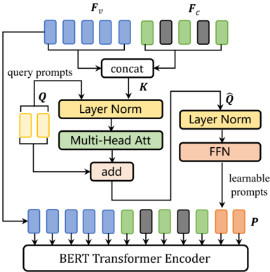
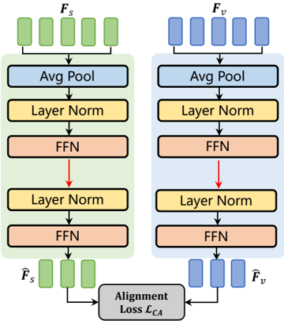
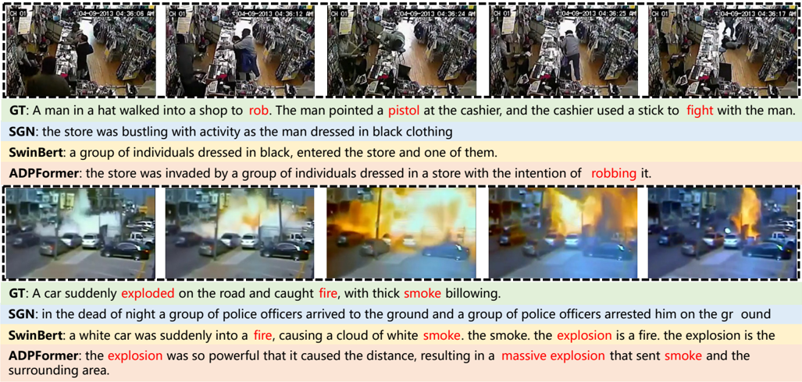

## Anomaly-Led Prompting Learning Caption Generating Model and Benchmark

Qianyue Bao , Student Member, IEEE, Fang Liu , Senior Member, IEEE, Licheng Jiao , Fellow, IEEE, Yang Liu , Student Member, IEEE, Shuo Li , Member, IEEE, Lingling Li , Senior Member, IEEE, Xu Liu , Senior Member, IEEE, Xinyi Wang, Baoliang Chen

Abstract—Video anomaly detection (VAD) is an important intelligent system application, but most current research views it as a coarse binary classification task that lacks a fine-grained understanding of abnormal video sequences. We explore a new task for video anomaly analysis called Comprehensive Video Anomaly Caption (CVAC), which aims to generate comprehensive textual captions (containing scene information such as time, location, anomalous subject, anomalous behavior, etc.) for surveillance videos. CVAC is more consistent with human understanding than VAD, but it has not been well explored. We constructed a large-scale benchmark CVACBench to lead this research. For each video clip, we provide 6 fine-grained annotations, including scene information and abnormal keywords. A new evaluation metric Abnormal-F1 (A-F1) is also proposed to more accurately evaluate the caption generation performance of the model. We also designed a method called Anomaly-Led Generating Prompting Transformer (AGPFormer) as a baseline. In AGPFormer, we introduce an anomaly-led language modeling mechanism (Anomaly-Led MLM, AMLM) to focus on anomalous events in videos. To achieve more efficient cross-modal semantic understanding, we design the Interactive Generating Prompting (IGP) module and Scene Alignment Prompting (SAP) module to explore the divide between video and text modalities from multiple perspectives, and to improve the model's performance in understanding and reasoning about the complex semantics of videos. We conducted experiments on CVACBench by using traditional caption metrics and the proposed metrics, and the experimental results demonstrate the effectiveness of AGPFormer in the field of anomaly caption.

Index Terms—Video Anomaly Detection, Prompting Learning, Video Caption

## I. INTRODUCTION

V IDEO anomaly detection (VAD) has a very wide range of applications in the field of intelligent security [1],

This work was supported in part by the National Natural Science Foundation of China (No.62076192), the Joint Fund Project of National Natural Science Foundation of China (No.U22B2054), the Postdoctoral Fellowship Program of China Postdoctoral Science Foundation (CPSF) (No.GZC20232033), the China Postdoctoral Science Foundation (No. 2023M742738), the National Natural Science Foundation of China (No.62406231), the Program for Cheung Kong Scholars and Innovative Research Team in University(No. IRT 15R53), the Fund for Foreign Scholars in University Research and Teaching Programs(the 111 Project)(No. B07048), the Key Scientific Technological Innovation Research Project by Ministry of Education, the Fundamental Research Funds for the Central Universities and the Innovation Fund of Xidian University.

The authors are affiliated with the School of Artificial Intelligence, Xidian University, Xi'an 710071, P.R. China, with the Key Laboratory of Intelligent Perception and Image Understanding of the Ministry of Education, with the International Research Center for Intelligent Perception and Computation, with the Joint International Research Laboratory of Intelligent Perception and Computation. Fang Liu is the corresponding author. (e-mail: f63liu@163.com)

## (a) Video Anomaly Detection

Fig. 1. VAD vs. CVAC, VAD only classifies videos with rough abnormal labels, while CVAC requires a comprehensive description of video scenes and abnormal events.

[2], and is a hot research topic in both computer vision and multimedia analysis. VAD tasks can be categorized into two types depending on the supervised signals: semi-supervised VAD [3]–[8] and weak-supervised VAD [9]–[13]. The former determines anomalies by learning the normality patterns in normal videos, while the latter uses simple video-level labels to learn the differences between normal and abnormal videos. VAD is a high-semantic context-dependent [14]–[16] video understanding task, e.g. a fire appearing on a bus is abnormal, while people warming themselves around a campfire is a normal event. Individual labels in VAD alone are completely insufficient to describe consecutive anomalous events occurring in a video and and it is not interpretable, and the VAD community urgently needs to introduce additional scene knowledge and rules to improve the overall understanding. Since anomalous videos usually involve the interaction of multiple scenes, people, and objects, processing with Video Caption (VC) [17]–[23] can easily cope with this complexity and is more in consistent with human understanding. If a road accident occurs in a video, the model should describe it as: "At night, at a traffic intersection, a red car speeding and collided with an opposite white car" (which also contains comprehensive scene information such as time, location, abnormal subjects, abnormal behaviors, etc.), while the ordinary VAD models can only be expressed using a rough word, e.g., "road accident". Based on such motivation, in this paper, we propose a new task called Comprehensive Video Anomaly Caption (CVAC) and construct a large-scale benchmark dataset,

## (a) Video Captioning (VC)

[caption]: Several people shopping in the store.

[caption1]: Two people walked into the store.

[caption2]: The cashier got up and left.

[caption3]: A man takes something from the counter. (b) Dense Video Captioning (DVC)

## (c) Comprehensive Video Anomaly Caption (CVAC)

[scene]: In a supermarket, there is a clerk sitting at the counter, and there are several customers in front of shelf, It is daytime . [caption]: The man in a brown suit stole an item from the counter when the cashier wasn't looking. [abnormal key]: stole, counter.

Fig. 2. Comparison of CVAC with other video captioning tasks. CVAC covers information such as time, location, abnormal subjects, and abnormal behaviors.

CVACBench, to further promote research in video anomaly analysis. Fig. 1 shows the difference between the proposed CVAC task and the ordinary VAD task. Manually collecting large-scale abnormal video benchmarks from scratch will consume a lot of manpower and time. Therefore, CVACBench is mainly selected from the UCF-Crime dataset [12] (filtering and cleaning videos containing noise and extremely long time), and it is a well-recognized benchmark dataset in the VAD community. CVACBench consists of 863 normal videos and 925 abnormal videos. We design a new evaluation metric for CVACBench: Abnormal-F1 (A-F1), which aims to evaluate whether the model can truly understand the goals and causes of the abnormal occurrence.

Our CVAC task is significantly different from traditional video description tasks. In the video description community, common tasks are Video Captioning (VC) [24]–[27], which aims to generate a brief overview of a given video, and Dense Video Captioning (DVC) [19], [20], [28], [29], which requires first detecting and slicing a period of time to obtain multiple events and then generating a description for each event. Both tasks are geared towards regular videos containing events that are common in daily life, and although they are able to describe the subjects and behaviors in the video, these methods lose critical information when generating the description text due to the lack of relevance to the specific task requirements. Our CVAC starts from capturing abnormal events. It first summarizes the scene information such as time and location, and then comprehensively describes the appearance and attributes of the main subjects in the video, as well as the interaction behavior with other objects. In addition to this, CVAC requires strong temporal reasoning capabilities; consider the video sequence in Fig. 2, where a shoplifting incident is monitored and a man in a brown suit steals something from the counter in between the cashier's departures. CVAC first needs to clarify the location and time of the current video (some abnormal events often occur at night) and other scene information. The model is then required to understand the scene context based on the temporal evolution of the video and make abnormal reasoning. For example, when the cashier leaves the counter, the customer's behavior of reaching into the counter is judged as a theft incident. The previous VC and DVC obviously do not satisfy the reasoning requirements of such complex semantics, it is inappropriate to directly migrate traditional video description methods on the CVAC task.

We design a baseline model for this new task, called Anomaly-Led Generating Prompting Transformer (AGPFormer), which simultaneously models and interacts features of video sequences and text. Existing video caption methods [25], [30] usually use masked language modeling (MLM) [31] to optimize multi-modal representation. We improve MLM for the CVAC task and propose an Anomaly-Led MLM framework (AMLM), AMLM injects the anomaly confidence of a video clip into the attention mask, making the model pay more attention to the core information in abnormal events. Furthermore, in the multi-modal interaction stage (often considered the key to determining video caption performance), we introduce a Interactive Generating Prompting module (IGP). IGP predicts several learnable prompts containing spatiotemporal information to dynamically update the multi-modal interaction features of video and text. Since CVAC requires the model to have scene understanding capabilities, we designed a Scene Alignment Prompting module (SAP) to achieve crossmodal alignment of the model in the scene perspective. In the experimental part, we extensively evaluated AGPFormer using conventional caption evaluation metrics and the proposed AF1. The experimental results proved that our method has significant advantages in cross-modal modeling and description of abnormal events.

## II. RELATED WORK

## A. Video Anomaly Detection

With the development of deep learning models [35]–[38], various technical routes have emerged in the VAD community [6], [7], [9], [15]. Previous video anomaly detection methods

TABLE I COMPARISON OF CVACBENCH WITH OTHER POPULAR VIDEO CAPTION DATASETS. CLIP . IS THE NUMBER OF VIDEO CLIPS, DUR . IS THE TOTAL DURATION (H) OF THE VIDEO, AVG . CLIPS IS THE AVERAGE LENGTH (S) OF THE VIDEO CLIPS, AVG.SEN . IS THE AVERAGE NUMBER OF WORDS IN THE CAPTION , AND DOMAIN IS THE SOURCE OF VIDEO COLLECTION .

| Method         | Clip.    |   Dur.(h)  |   Avg. Clip.(s)  | Avg. Sen.    | Domain       |
|----------------|----------|------------|------------------|--------------|--------------|
| MSVD [32]      | 1,970    |        5.3 |              9.7 | 8.67         | daily life   |
| MSR-VTT [26]   | 10,000   |       41.2 |             20   | 9.28         | daily life   |
| VATEX [27]     | 41,250   |      114.6 |             10   | 15.23        | daily life   |
| Youcookll [33] | 15,433   |      176   |            316   | -            | cooking      |
| UCFC-VD [34]   | 950      |        5.6 |             21.3 | 9.27         | surveillance |
| CVACBench      | 1,880    |       53   |            101.5 | 20.15        | surveillance |

have used various forms of video labels (frame-level labels and video-level weak labels, etc.) to analyze abnormal events in a data-driven manner. We review recent progress and broadly classify existing methods into two categories: (1) Unsupervised/semi-supervised methods: these methods [6], [8], [39] usually used only normal videos in the training phase, and used autoencoders to learn fixed patterns in normal videos through self-supervised tasks such as frame reconstruction [4]–[7], [15], frame prediction [3], [8], [40]–[42], or frame sequence discrimination [39], [43]. In the test phase, video frames that deviate significantly from the existing pattern are judged as abnormal events, usually showing large frame reconstruction or prediction errors. These methods used the appearance and motion trends in video sequences as important cues for anomaly judgments, had high detection accuracy, and provided a solid foundation for the use of VAD systems in realworld scenarios. (2) Weakly supervised methods: these methods [9], [44], [45] used both normal and abnormal videos in the training phase. However, they used rough video-level anomaly labels to determine the anomaly type of a video frame. This label can only tell the network whether there is an abnormal event in the current video, but cannot accurately determine the specific location where the anomaly occurs. Existing methods have explored the performance of various advanced pre-trained video feature backbones in capturing abnormal semantics, such as C3D [12], [13], [44], [46]–[48], ViT [9], [49], [50], CLIP [45], [51], etc. In addition, various learning mechanisms such as multi-instance learning [12], [52], multisequence learning [9], feature magnitude learning [44], and glance-focus learning [53] have been introduced to improve performance. Although such methods can roughly identify the type of abnormal events, they are far from sufficient to fully express the abnormal semantics. Our proposed CVAC is different from this, it analyzes the continuous abnormal events occurring in the video by generating text captions.

## B. Video Caption

Caption generation is an important topic in the field of multimodal analytics. Image captioning [60]–[62] aims to describe the content in a single image in a human-like manner. Video captioning [21], [24], [25], [30], [63], [64] need to capture the spatio-temporal dynamics in video sequences and

TABLE II COMPARISON OF CVACBENCH WITH POPULAR VIDEO ANOMALY DETECTION DATASETS. CLASSES IS THE NUMBER OF ABNORMAL TYPES .

| Datasets          | Clip.    |   Classes  | Domain       | Captions   |
|-------------------|----------|------------|--------------|------------|
| CUHK Avenue [54]  | 37       |         5  | campus       | ✗          |
| UCF-Crime [12]    | 1,900    |        13  | surveillance | ✗          |
| ShanghaiTech [55] | 437      |        11  | campus       | ✗          |
| XD-Violence [56]  | 4,754    |         6  | movies       | ✗          |
| NWPU Campus [57]  | 547      |        28  | campus       | ✗          |
| UBnormal [58]     | 543      |        22  | virtual      | ✗          |
| DoTA [59]         | 4,677    |        18  | driving      | ✗          |
| CVACBench         | 1,880    |        13  | surveillance | ✓          |

convert them into vivid text descriptions, which is of great significance for the intelligent analysis of multimedia data. We provide a brief overview to this field, from three aspects: (1) Conventional video captioning: These methods [24], [25], [63], [65] capture the spatio-temporal features of the video from a global perspective and feed the features into the language decoder to generate text. The performance of such methods usually depends on the video feature backbone and language decoder model used. For example, the RecNet [63] and SGN [24] methods need to deploy a CNN-based video representation network to extract video appearance and motion features and generate captions in a two-stage manner. The subsequent Swinbert [25] and AVLFormer [30] directly trained the transformer model in an end-to-end manner and achieve better performance. In addition, CLIP4Clip [65] and CoCap [66] attempted to adapt pre-trained visual language models (such as CLIP [51]) to video description generation. (2) Dense video captioning: These methods [19], [20], [28], [29] can achieve fine-grained video description relative to conventional caption generation, first detecting event windows in the video and then generating captions for these windows to refine the description details. PDVC [20] proposed an end-toend parallel decoding framework to simplify this process. The Vid2Seq [67] architecture enhanced the language model by designing special time tokens, so that both event window prediction and text description are implemented by the language model. (3) Video caption datasets: Existing video caption datasets include MSVD [32], MSR-VTT [26], VATEX [27], and YouCookII [33], which only cover daily life videos. Goyal et al. [34] presented a dataset called UCFC-VD similar to our work, but it only provides short captions for abnormal videos in UCF-Crime [12]. We build CVACBench to include captions for both abnormal and normal videos, as it is equally important to accurately describe normal events in surveillance scenarios. In addition, we provide a more comprehensive fine-grained event annotation.

## C. Video Cross-Modal Modeling

Efficient video cross-modal modeling is crucial to improve the performance of downstream video understanding tasks. Recently, researchers have introduced new paradigms such as information maximization [68] and prompt learning [69]–

Fig. 3. An annotation example in CVACBench. For each clip, we provide 1 scene annotation [S.], 6 event captions [C.] (using different words and sentence patterns) and 1 Abnormalkey [A.], where time, location, abnormal subject and abnormal behavior are highlighted in orange, green, blue and red.

[72] in cross-modal representation and modality alignment. Hoang et al. [68] introduced Cross-Modal Info-Max Hashing (CMIMH) to learn binary representations preserving both intra-modal and inter-modal similarities. Zhou et al. [69] developed prompt learning [70], [71] techniques for adapting pre-trained vision-language models to downstream tasks, while Liu et al. [72] proposed Multi-modal Attribute Prompting (MAP) to improve fine-grained visual perception. We briefly review the applications of cross-modal modeling techniques in various complex video tasks [73]–[76], especially in the fields of video scene graph generation [77], video entailment reasoning [78], and video summarization [79]. Due to the complexity of video semantics, its knowledge (such as evidence [73], relations [74], causality [75], and modal consensus [78]) should be emphasized when modeling. Among them, Wu et al. [77] introduced an unbiased cross-modal learning (UCML) framework to make progress on the weakly supervised video scene graph generation (WS-VidSGG) task. For unsupervised video summarization, Gao et al. [79] developed a relationaware assignment learning method. Yao et al. [78] proposed a new concept of cross-modal consensus, which can be used to exploit the underlying consensus of video and linguistic modalities to accomplish video entailment inference. Based on the above research, we proposed CVAC to focus on exploring video cross-modal modeling methods guided by abnormal signals. And through the prompt learning mechanism, the video temporal features are adapted to the downstream language decoder to generate accurate abnormal descriptions.

Fig. 4. Sentence length distribution histogram in CVACBench.

## III. CVACBENCH

## A. Dataset construction and statistics

Since surveillance anomalies are rare in real life, it is extremely challenging to collect a large-scale video benchmark from scratch. Therefore, we start from the UCF-Crime [12], which is the most far-reaching dataset in the VAD community, and contains 1900 videos captured from real cameras, with a total video duration of 128h, of which 950 are normal videos and 950 are abnormal videos. The event types contain 13 categories such as assault, explosion, burglary, fighting, robbery, road accident, etc., and in each category there are multiple scenes such as stations, traffic intersections, shopping malls, and residential areas. This provides a rich diversity for us to further annotate the video scene information and the corresponding abnormal events.

We put a lot of effort in building CVACBench, we first made an expert selection of the UCF-Crime because the original dataset contains a lot of poor quality videos, such as prolonging the video duration by replaying the same clip over and over again, haphazard splicing of multiple videos, incorrect video sizes and resolutions, and so on. We selected 1788 high-quality videos from it, including 863 normal videos and 925 abnormal videos. Compared to UCFD-VC [34], we ensure that the ratio of normal and abnormal videos is close to 1:1, which is very important for practical surveillance applications, as using only abnormal videos for training will cause the model to generate pseudo-anomalous captions for normal videos. We invite 6 experienced researchers to serve as annotators. The annotators were required to select the time window where the abnormal event occurred from each video, and then crop the video from this time window and sample 32 frames as the video clip. We provide 6 event caption annotations for each video clip. Fig. 3 shows a "fight" event that occurred in a detention center, where [C.1], [C.2], ... [C.6] are different annotations of the event. These annotations come from 6 different annotators, who describe the same abnormal event from their own perspectives. In addition, we also provide

a scene description for the current scene, as shown in [S.], which is intended to describe the background of the video and usually does not contain expressions of abnormality. Finally, we double-check all the labeled sentences to ensure the quality of the benchmark. In addition, we also summarize an abnormal keyword list (Abnormalkey) for each video clip. As shown in [A.] of Fig. 3, it is clear that the key information of the current event is "fight" and "police". This is crucial for the subsequent evaluation of the model's ability to identify abnormalities.

We compared CVACBench with several existing popular video caption datasets, as shown in Tab. I. The abbreviation Clip. represents the number of video clips in the dataset. Dur. represents the total duration of the video. Avg.Clip. is the average length of the video clip. Avg.Sen. is the average number of words in the caption. Domain represents the source of video collection. It can be seen that the average sentence length of CVACBench is 20.15, which is significantly longer than the other datasets (the average sentence lengths of MSVD [32], MSR-VTT [26], and UCFC-VD [34] are 8.67, 9.28, and 9.27, respectively). In addition, the average clip of CVACBench is 101.5s, which is only lower than that of the YouCookII dataset. This setting is better suited for complex anomalous events in realistic scenarios that require longer sentences to be presented in full. We also show the distribution of sentence lengths in CVACBench in Fig. 4, with the largest proportion of sentences in the 15-19 range. We follow the experimental setup specification in the video caption community [26], [32] and divide the training, validation, and testing sets of CVACBench into 1244, 281, and 263 video clips.

In addition, we compared CVACBench with several widely used datasets in the VAD community, summarized in Tab. II. The VAD task focuses on identifying anomalies or unusual events that deviate from normal patterns in video sequences. Recent researchs have introduced various methods [59], [80]– [86] to address the challenges brought by temporal and spatial complexity. [85], [87]–[89] focus on improving detection accuracy through unsupervised and weakly supervised frameworks. These methods usually exploit domain-specific knowledge [81], [83] to better handle the large-scale variations and unpredictability of anomalies in video data. It is worth noting that most VAD datasets [12], [54] focus on detecting anomalies in video frames or clips without providing text annotations. CVACBench provides richer and more contextualized anomaly representations by incorporating detailed event descriptions. This feature enhances the interpretability of anomaly detection models, allowing us to not only detect what anomalies are, but also better understand why the event is considered anomaly. This comprehensive approach is consistent with recent research in VAD, such as [59], [81], [83], which focuses on improving anomaly localization and detection under diverse and challenging conditions.

## B. Evaluation metrics

Existing video caption metrics include BLEU [90], ROUGE [91], Meteor [92], and CIDEr [93], which measure the model's generative performance by calculating the similarity between predicted text and GT text on a word-by-word basis. Among them, BLEU mainly measures the n-gram (word sequence) matching between the predicted caption and the reference caption. ROUGE not only matches words, but also pays attention to the order in which words appear. Meteor considers synonyms, word form changes (such as stem extraction) when matching words, which can better reflect semantic similarity. CIDEr can give higher weights to unique words in the generated captions, which can evaluate the accuracy and richness. For CVAC, we want to explicitly explore whether the subjects, behaviors, and causes of abnormal events in the video are understood by the model, and these metrics do not meet our needs. In order to evaluate the effectiveness of generated descriptions more completely, we design a new metric based on Abnormalkey, called Abnormal-F1 (A-F1). AF1 measures complex anomaly semantics by calculating how well the predicted text matches Abnormalkey. Considering the different tenses and synonym relationships of words, we use the NLP toolkit NLTK [94] to extract the stems of the words to participate in the calculation. The formula of A-F1 is as follows:

<!-- formula-not-decoded -->

Here, A is the predicted word set, and B is the AbnormalKey word set. We follow [30] and send the words into the pre-trained T5 model δ(·) [95] to obtain the representation vector to approximate (cosine similarity) calculate the precision P(A, B). Then the recall R(A, B) is calculated by counting the number of predicted words in A that hit the word in B. A-F1 emphasizes the model's attention to the complex semantics of abnormal behavior, which directly matches the predicted captions with the provided AbnormalKey. At the same time, with the powerful semantic understanding ability of the T5 model, A-F1 can understand the different word forms of abnormal objects, ensuring that the captions generated by the model are associated with the core features of abnormal events.

## IV. METHOD

In this section, we detail our AGPFormer, the overall structure of the framework is shown in Fig. 5. The input to AGPFormer contains video tokens F v ∈ R N v ×D v , caption tokens F c ∈ R N c ×D c , and scene tokens F s ∈ R N s ×D s , where pre-trained VidSwin [96] is used for the video encoder and pre-trained BERT [31] is used for the text embedding. Among them, F v is sent to an anomaly binary classifier to calculate the anomaly confidence G v , and then the caption c and the corresponding tokens F c are sent to AMLM for processing. In Sec. IV-B, we describe the proposed IGP module, and the SAP module is detailed in Sec. IV-C.

## A. Anomaly-Led Mask Language Modeling

Since CVAC focuses more on capturing abnormal events and objects than traditional video caption, we improved MLM under the guidance of the AbnormalKey and anomaly confidence G v . Pioneer work [97] has proven that maintaining

Fig. 5. An overview of AGPFormer implementation. It consists of key modules such as video encoder and word embedding, Anomaly-Led Mask Language Modeling (AMLM), Interactive Generating Prompting (IGP) and Scene Alignment Prompting (SAP).

Fig. 6. Detailed illustration of AMLM. AMLM selects words related to anomalies from the input caption and assigns a high priority mask.

semantic coherence between words when masking can improve model performance. We first use the syntactic analysis tool provided by spacy [98] to extract phrases from the input caption. As shown in Fig. 6, the two subjects involved in the car accident event: "a white car" and "black car" are both obtained. In the original MLM, the model may only mask "white" representing colors, which can interrupt the learning of object semantics. AMLM will randomly select elements from the phrase list and perform phrase-level mask operations. In addition, we also perform high-priority mask operations on words that fall in the AbnormalKey (e.g., "collided"). As shown in Fig. 5, the input sent to the BERT encoder is divided into three parts: Nv Nv video tokens, Nc Nc caption tokens and Np Np learnable prompts (introduced in Sec. IV-B). We follow [25] and deploy the attention mask E v (size Nv Nv × Nv Nv ) of the video tokens as a sparse learnable matrix. In AMLM, we use the video-level anomaly confidence G v as a salient signal to perform dot product on the randomly initialized E v to obtain the anomaly-salient attention mask:

<!-- formula-not-decoded -->

E v is subsequently augmented in residual form to obtain the anomaly-led attention mask E ˆ v , where Norm is the normalization, φ(·) is the sigmoid activation function. During model training, we use sparse loss LSPARSE [25] to regularize E ˆ v. By anomaly-salient guidance of sparse attention, the model can reduce the redundancy of video tokens while paying more attention to tokens where abnormal events occur.

Our AMLM still follows the autoregressive language generation pattern. As shown on the right side of Fig. 5, we have carefully set up the mask attention matrix for AMLM, where the masked positions are light blue with a value of 0. For caption tokens (attention is represented in green), we adopt a single-direction causal attention mask strategy to ensure that the token predicted by the model only relies on the token at the previous position. For the video tokens (the attention is indicated in blue), we directly place the E ˆ v obtained in the previous step in the overall transformer attention mask (size (Nv Nv + Nt Nt + Np Np ) × (Nv Nv + Nt Nt + Np Np ) ). After being abnormally guided and sparsely constrained, the anomaly-led attention mask E ˆ v can adaptively select video tokens fed into language modeling. For the additional learnable prompts, we set it to full attention (the attention is indicated in orange) because

Fig. 7. Detailed illustration of IGP module. IGP introduces learnable prompts to retrieve interactive features between video tokens and caption tokens.

there is no order restriction. At the same time, we make video tokens and learnable prompts visible to text tokens, and video tokens and learnable prompts visible to each other (attention is indicated in brown and yellow, respectively), which forces the model to seek the help of video information and modal interaction information to predict the masked text.

## B. Interactive Generating Prompting

Previous video caption methods [25], [30] based on the transformers architecture, after obtaining the video tokens and caption tokens, only perform a simple concatenation operation on them, and fed into the downstream language model for generation. Due to the natural gap between visual and textual modalities, it is challenging to efficiently utilize multimodal information. Numerous studies [78], [99]–[101] have proven that in multi-modal analysis tasks, feature interactions between modalities have a significant impact on model performance. ALBEF [99] improves the quality of the base representation by aligning image and textual representations using contrastive loss. ViLT [100] focuses on exploring the impact of the complexity of feature extraction on the final interactive performance. VLMo [101] uses the Mixture-of-Experts (MoE) technique in cross-modal interaction. SACCN [78] introduces a concept of cross-modal consensus, emphasizing the importance of mining the underlying consensus knowledge of modalities during the interaction process. Different from these methods, we seek a new way to perform prompt interaction in token space to capture the complex abnormal semantics contained in multimodal data.

The design of Interactive Generating Prompting module (IGP) is inspired by the recently emerging prompt learning paradigm [69]–[71]. We randomly initialize a series of query prompts Q ∈ R Np Np ×D p and stack some lightweight transformer computing units to complete the prompting process, as shown in Fig. 7. We first concatenate video tokens F v and caption tokens F c as key inputs, and then send them with the query prompts Q to the multi-head attention layer (MHA) [102] for

Fig. 8. Illustration of SAP module. SAP performs cross-prompting on the input video tokens F v and scene tokens F s to achieve cross-modal alignment.

dynamic interaction. The overall calculation process can be expressed as follows:

<!-- formula-not-decoded -->

Among them, LN denotes the layer normalization operation, after performing the MHA interaction, we add the output embedding features back to the query prompts Q to perform dynamic updates. This is subsequently normalized and fed into a MLP layer to compute the dynamic interaction prompts P. We regard query prompts Q as a predefined interaction connector, which will prompt and predict masked information from naive concatenation tokens. IGP can construct modal interaction tokens more flexibly than concating video and caption tokens directly, and given dynamic interaction prompts P, we append them with the current input tokens into the BERT Encoder for generation.

## C. Scene Alignment Prompting

A deep understanding of scene context is crucial for video anomaly detection and analysis, and there is a considerable amount of work in the VAD community to model surveillance scene context [3], [14], [16], [103]. Inspired by these works, we try to introduce scene knowledge into AGPFormer to supplement and improve video description. It should be noted that the scene annotations provided by our CVACBench are anomaly-agnostic neutral descriptions. They only describe the attributes of the current scene and do not involve abnormal semantics, so they are more suitable for constructing sample pairs with video tokens for cross-modal alignment.

As shown in Fig. 8, we propose a lightweight Scene Alignment Prompting module (SAP) to close the embedding distance between scene tokens and video tokens. This allows the model to learn the comprehensive information (time,

location, anomalous subjects, etc.) in the surveillance scene, which allows it to generate more descriptive and expressive event description statements. We first extract embedding for scene information to get scene tokens, and feed them together with corresponding video tokens into two branches of SAP. Each of these branches is set up with two MLP layers, e.g., the video branch consists of MLP v 1 and MLP v 2 , and the scene branch consists of MLP s 1 and MLP s 2 . Unlike IGP, we do not use a transformer-based structure, but a more concise prompt operation. The green box in Fig. 8 represents the branch that processes the scene tokens, and the blue box represents the branch for processing the video tokens. We first use AvgPool to unify the dimensions of the two modal tokens F v ∈ R N v ×D v , F s ∈ R N s ×D s , and then send them to MLP v 1 and MLP s 1 respectively to obtain the intermediate state features H v ∈ R N v ×D p and H s ∈ R N s ×D p :

<!-- formula-not-decoded -->

Then we feed H v and H s into MLP v 2 and MLP s 2 to predict the corresponding prompting vectors F ˆ v and F ˆ s , whose feature dimensions are both Np Np :

<!-- formula-not-decoded -->

Based on this, we define a scene alignment loss LCA to optimize F ˆ v and F ˆ s , details are introduced in Sec. IV-D.

## D. Training Objectives

First, for the AMLM language modeling task in AGPFormer, we set an AMLM loss LAMLM for the masked text GT y t mask and the model's predicted probability at the current t-th position, this probability is calculated by the previous (t1) caption tokens F :t − 1 c , current video tokens F t v and prompts F t p , formally represented as follows:

<!-- formula-not-decoded -->

For the constructed anomaly-led attention mask E ˆ v , we first follow most works in the VAD community [9], [12], [45] and use video-level binary cross entropy loss LBCE to optimize anomaly confidence G v . We then use sparse regularization loss L SPARSE to further optimize the anomaly-led attention mask E ˆ v :

<!-- formula-not-decoded -->

For the two prompting vectors F ˆ v and F ˆ s output by the SAP module, we define a cosine alignment loss LCA for optimization. The loss function is expressed as follows:

<!-- formula-not-decoded -->

The overall optimization objectives of the model can be integrated as follows:

<!-- formula-not-decoded -->

## V. EXPERIMENTS

## A. Implementation Details

We use the pretrained VidSwin-Tiny [96] and VidSwinSmall [96] as video encoders, and the text encoder uses pretrained bert-base-uncased [31]. All video clips are sampled at 32 frames and scaled to 224 × 224. The maximum mask probability of AMLM is set to 0.6, and the maximum generation sequence length is 35. For learnable prompts, the number is set to Np Np = 10 and the embedding dimension is set to D p = 768. During the training phase, we set the batch size to 8 and train the model on CVACBench for 100 epochs. The optimizer uses AdamW with initial learning rate of 3e − 4 and the weight decay of 1e − 5. For hyperparameters, we set λ1 , λ 2 and λ 3 to 0.0001, 0.1 and 0.001 respectively. In the model inference phase, we generate sentences in an autoregressive manner, each time using the text tokens generated in the previous step as the current input, until the model generation reaches the maximum sequence length or reaches a predefined end tokens [EOS] .

## B. Comparison with other methods

We select some representative video caption methods to compare with AGPFormer on CVACBench. These include the two-stage methods RecNet [63] and SGN [24], which require pre-extraction of video appearance and motion features, and the end-to-end training method Swinbert [25]. And methods such as CLIP4Caption [65], CoCap [66], and CARE [64] that use the prior of pre-trained visual language model (CLIP [51]) to improve the generated description. Among them, CLIP4Caption adapts the CLIP framework to the field of video captioning, and CoCap explores a captioning method that applied CLIP pre-trained representation in the video compression domain. CARE first detects concepts from text corpora based on CLIP model, and improves the quality of caption generation through a global-local semantic guidance mechanism. We directly use the open source implementation codes of these methods and run them according to the default settings to obtain experimental results. Quantitative and qualitative comparison results of these methods are provided below respectively.

1) Quantitative comparison: In terms of experimental evaluation metrics, we use four traditional captioning metrics to evaluate performance: (1) BLEU (B@1, B@4) [90] measures n-gram precision between the generated and reference captions, emphasizing accuracy in word sequences but limited in capturing sentence structure and semantics. (2) ROUGE-L [91] focuses on the longest common subsequence (LCS) between the generated and reference captions, reflecting the coverage of both content and word order. (3) Meteor [92] accounts for word variations, synonyms, and word order, providing a more comprehensive measure of semantic similarity through a weighted precision and recall calculation. (4) CIDEr [93] gives higher weights to rare words in the generated text to evaluate

TABLE III COMPARISON WITH OTHER METHODS ON THE TEST SPLIT OF CVACBENCH, RECNET [63] AND SGN [24] IS TWO -STAGE VIDEO CAPTIONING METHODS , SWINBERT [25] IS END -TO -END METHOD , BOLD REPRESENTS BEST PERFORMANCE

| Method            | BackBone           | BackBone             | Traditional Metrics    | Traditional Metrics    | Traditional Metrics    | Traditional Metrics    | Traditional Metrics    | Proposed Metrics   |
|-------------------|--------------------|----------------------|------------------------|------------------------|------------------------|------------------------|------------------------|--------------------|
|                   | 2D Appearance      | 3D Motion            | B@1                    | B@4                    | Meteor                 | ROUGE-L                | CIDEr                  | A-F1(T5)           |
| RecNet [63]       | Inception-V4 [104] | -                    | 41.06                  | 8.80                   | 11.77                  | 27.20                  | 10.39                  | 10.03              |
| SGN [24]          | ResNet-101 [105]   | 3D-ResNext-101 [106] | 42.60                  | 9.62                   | 13.04                  | 29.18                  | 16.60                  | 13.49              |
| Swinbert [25]     | VidSwin-Tiny       | VidSwin-Tiny         | 42.34                  | 9.85                   | 13.14                  | 30.26                  | 19.35                  | 15.98              |
| Swinbert [25]     | VidSwin-Small      | VidSwin-Small        | 43.71                  | 10.05                  | 13.50                  | 29.75                  | 20.71                  | 17.12              |
| CLIP4Caption [65] | CLIP-ViT-B/32      | CLIP-ViT-B/32        | 43.90                  | 8.07                   | 13.99                  | 29.50                  | 17.32                  | 15.10              |
| CoCap [66]        | CLIP-ViT-B/32      | CLIP-ViT-B/32        | 44.96                  | 9.73                   | 13.84                  | 30.45                  | 18.42                  | 16.48              |
| CARE [64]         | CLIP-ViT-B/32      | CLIP-ViT-B/32        | 45.66                  | 9.93                   | 13.46                  | 29.53                  | 21.71                  | 20.52              |
| AGPFormer         | VidSwin-Tiny       | VidSwin-Tiny         | 44.01                  | 10.11                  | 13.54                  | 30.56                  | 22.10                  | 22.85              |
| AGPFormer         | VidSwin-Small 44   | VidSwin-Small 44     | 44.48                  | 10.61                  | 13.72                  | 31.52                  | 23.97                  | 24.32              |

similarity, which can highlight the relevance and uniqueness of the content. In addition, we also use A-F1 proposed in Sec. III-B to more comprehensively evaluate the ability of AGPFormer to capture anomaly semantics.

In Tab. III, we show the caption generation accuracy of AGPFormer compared with other methods. For RecNet, we follow the default settings and use Inception-V4 [104] as the video backbone, and use ResNet101 [105] and 3DResNext101 [106] as the video appearance and motion backbone in SGN respectively. For CLIP4Caption, CoCap, and CARE, we use CLIP's ViT-B/32 weights to initialize the network. For Swinbert and AGPFormer we use two backbone versions of VidSwin [96] (VidSwin-Tiny and VidSwin-Small) for experiments. As we can see, our AGPFormer (VidSwinSmall) achieves the best performance on all evaluation metrics, especially reaching 23.97 on CIDEr, as well as on A-F1 reached 24.32, significantly exceeding other comparison methods. Traditional metrics such as BLEU, Meteor and ROUGE-L usually evaluate model performance based on word matching or word sequence matching in sentences. Since the generated description contains a large number of common words such as "the, a, to", it is difficult to highlight the model's ability to capture rare anomalies in videos. In contrast, CIDEr first calculates weights based on word frequency in sentences, giving higher importance to rare but relevant words. Our proposed A-F1 uses the evaluation of abnormal keywords as the primary criterion for calculation. Therefore, it can more accurately reflect the model's ability to capture abnormal events, which can prove that our AGPFormer is more suitable for generating captions for abnormal videos. In addition, we observe that RecNet and SGN perform poorly on CVACBench. These two-stage methods struggle to establish effective communication between the pre-extracted visual features and the downstream language model when faced with complex long videos. The CoCap and CARE methods based on CLIP pretrained representations show obvious advantages in wordlevel metrics (CARE's B@1 achieves the best performance of 45.66), which may be due to the powerful visual language cross-modal transfer ability of the CLIP model, but there are still limitations in capturing abnormal key information. In contrast, Swinbert and AGPFormer based on end-to-end sequence modeling achieve a better trade-off in achieving cross-modal alignment and capturing abnormal semantics.

2) Qualitative comparison: In Fig. 9, we randomly select two abnormal videos from CVACBench to show the results of the qualitative analysis of AGPFormer versus other comparative methods. We highlight the anomalous keywords in each event using red font and also provide the GT caption for each video. The first example is a challenging and complex robbery event where a man with a pistol enters the store and robs it. Although SGN and Swinbert were able to recognize that the current scene was a store, they completely ignored the robbery and fighting behaviors. In contrast, AGPFormer attempts to capture the human interactions in the scene and reason about the intent of the robbery. The second example is an explosion event, which is simpler than the first example. However, SGN fails to perform well in this example, generating a completely disorganized caption. The caption generated by Swinbert completely covers keywords such as "fire", "smoke" and "explosion", but the overall statement has many grammatical errors and is poorly readable. AGPFormer provides a more fine-grained event description, covering all Abnormalkey. At the same time, the generated statements are syntactically complete and very expressive (e.g., "massive explosion").

## C. Ablation experiments

We performed several ablation studies using VidSwin-Small [96] as the backbone of AGPFormer as follows. This includes the validation of the importance of key modules and the study of some hyperparameters. The detailed results are shown in Tab. IV.

1) Ablation experiments of AMLM mechanism: We first remove the proposed AMLM mechanism. Since AMLM allows us to introduce the abnormal prior in the training phase, it directs the model to pay more attention to the Abnormalkey when generating masked tokens. Its impact on the overall framework is thus critical, as can be analyzed from the results

Fig. 9. Qualitative result of video description on CVACBench. The example above is a store robbery event and the example below is a road explosion event. We compared AGPFormer with SGN [63] and Swinbert [25], and the keywords in the generated statements are highlighted in red .

TABLE IV ABLATION EXPERIMENTS OF KEY MODULES IN AGPFORMER .

| AMLM    | LBCE    | LSPARSE    | IGP    | SAP    | Metrics   | Metrics   | Metrics   | Metrics   | Metrics   | Metrics   |
|---------|---------|------------|--------|--------|-----------|-----------|-----------|-----------|-----------|-----------|
|         |         |            |        |        | B@1       | B@4       | Meteor    | ROUGE-L   | CIDEr     | A-F1(T5)  |
|         | ✓       | ✓          | ✓      | ✓      | 43.41     | 8.91      | 12.97     | 29.99     | 19.41     | 20.19     |
| ✓       |         |            | ✓      | ✓      | 42.94     | 9.65      | 13.12     | 30.13     | 20.14     | 21.56     |
| ✓       | ✓       | ✓          |        |        | 42.46     | 10.03     | 12.98     | 29.07     | 20.20     | 21.17     |
| ✓       | ✓       | ✓          |        | ✓      | 43.84     | 10.45     | 13.60     | 30.15     | 21.65     | 22.44     |
| ✓       | ✓       | ✓          | ✓      |        | 44.03     | 10.32     | 13.83     | 30.50     | 22.01     | 23.20     |
| ✓       | ✓       | ✓          | ✓      | ✓      | 44.48     | 10.61     | 13.72     | 31.52     | 23.97     | 24.32     |

in the first row of Tab. IV. Despite all the other modules running, the model still loses its sensitivity to anomalous events and the CIDEr score decreases to 19.41, and the AF1 score decreases to 20.19. Since the proportion of abnormal words in the dataset is very small in the proposed CVAC task, the data distribution is unbalanced. Since both CIDEr and AF1 can reflect the model's description effect on rare words, the performance drops significantly. While other metrics (BLEU, Meteor and ROUGE-L) keep the same weight for all words, the drop is not obvious.

2) Ablation experiments of LBCE and LSPARSE: We then conducted experiments on the proposed anomaly-led attention mask E ˆ v . The design goal of E ˆ v is to motivate the model to adaptively select the video tokens fed into the transformer according to the constraints of anomaly confidence and sparse loss, which we denote as a combination of LBCE and LSPARSE . The results are shown in the second row of Tab. IV. The CIDEr decreases to 20.14 and the BLEU@4 to 9.65. This shows that E ˆ v can alleviate the redundancy of the original video sequence input and at the same time guide the model to pay more attention to anomalous in surveillance.

3) Ablation experiments of IGP and SAP: IGP and SAP are considered as key modules for performing cross-modal alignment in AGPFormer. When both modules are removed (results are shown in row 3 of Tab. IV), CIDEr (20.20) is reduced by 3.77 compared to AGPFormer (23.97), which is a more significant performance degradation. For IGP, we expect it to accurately retrieve the masked information from naive concatenation tokens (video tokens and caption tokens) in the form of prompt learning. This is subsequently used as an efficient multimodal connector attached to the concatenation features for caption generation. When IGP alone is removed (row 4 of Tab. IV), CIDEr decreases to 21.65 (down 2.32). For SAP, we use it to align scene information and visual modalities. Since scene information is a neutral statement, it allows the model to learn commonsense knowledge beyond anomalies. When SAP alone is removed (row 5 of Tab. IV), CIDEr decreases to 22.01 (down 1.96). In contrast, IGP has a greater impact on the overall framework, which demonstrates that learning interactive prompts can help the model to better

TABLE V ABLATION EXPERIMENTS ON DIFFERENT FUSION STRUCTURES IN THE SAP MODULE. EACH STRUCTURE USES TWO LAYERS .

| Method     | Params   | Evaluation Metrics   | Evaluation Metrics   | Evaluation Metrics   | Evaluation Metrics   | Evaluation Metrics   | Evaluation Metrics   |
|------------|----------|----------------------|----------------------|----------------------|----------------------|----------------------|----------------------|
|            |          | B@1                  | B@4                  | Meteor               | ROUGE-L              | CIDEr                | A-F1(T5)             |
| MLP layer  | 0.26M    | 44.48                | 10.61                | 13.72                | 31.52                | 23.97                | 24.32                |
| GCN layer  | 1.58M    | 43.49                | 9.77                 | 13.11                | 29.61                | 20.76                | 23.10                |
| SA layer   | 2.36M    | 46.09                | 10.91                | 14.42                | 30.67                | 24.76                | 25.65                |
| LSTM layer | 3.68M    | 44.06                | 9.47                 | 13.36                | 29.85                | 22.01                | 24.35                |

model anomaly descriptions.

- 4) Ablation experiments on different fusion structures in SAP: To explore the potential of the SAP module in visual language interaction, we replace the MLP layer with a variety of structures. Including more complex self-attention layer (SA), graph convolution layer (GCN), and LSTM layer, to comprehensively analyze the performance impact of different operations on the video and scene text alignment prompt process. The experimental results are shown in Tab. V. When we use GCN and LSTM as fusion structures, the number of parameters of the model increases, but its performance decreases. Among them, GCN has the largest decrease, which may be because it was originally designed for data with a clear topological structure. When the SA layer is used for prompting, although the number of parameters (2.36M) is higher than the MLP layer, the model achieves better results (B@1 is 46.09, CIDEr is 24.76, and A-F1 is 25.65). Therefore, we believe that the MLP layer can strike a balance between performance and the number of parameters, and the SA layer can further improve the performance of our model.
- 5) Effectiveness of Np Np in IGP and SAP: An important hyperparameter in the IGP and SAP modules is the number of learnable prompts Np Np . In order to explore the sensitivity of IGP and SAP to the number of prompts, we redefine Np Np as two independent hyperparameters NIGP and NSAP in this section. We use the control variable method to conduct experiments. First, we fix the NSAP value of SAP, and then change the NIGP value of IGP for multiple experiments. The NSAP value range is {4, 6, 8, 10}, and the NIGP value range is {6, 8, 10, 12} to cover a reasonable range. Fig. 10 shows the experimental results. The left and right figures are line graphs of CIDEr and A-F1, respectively. Each line represents the impact of changing NI NIGP on performance when the current NSAP is fixed. As can be seen from the Fig. 10, the number of prompts is not as large as better. The combination of prompts with the best performance is (NSAP: 8, NIGP: 10). When NSAP reaches 8, the performance has an inflection point and begins to decline. This indicates that the IGP module may need longer prompts to capture the details of individual instances; while the SAP module may have a lower demand for scene-level information, so shorter prompts can be tried. When NSAP and NIGP both exceed 8, the performance of the model shows a downward trend, which may lead to more redundant information.

Fig. 10. The impact of different NIGP and NSAP on generating captions. The left and right figures are line graphs of CIDEr and A-F1, respectively. The horizontal axis represents the number of prompts and the vertical axis represents the evaluation score. Each line represents the impact of changing NI NIGP on performance when the current NSAP is fixed.

Fig. 11. False alarm caption visualization for normal videos by different methods.

## D. Analysis In-Depth

- 1) False alarm caption for normal videos: Although AGPFormer can capture abnormal events in video sequences, it needs to also have the ability to describe normal videos. Due to the inherent rarity and transient nature of anomalous events, they have more distinctive characteristics compared

TABLE VI DETAILED COMPARISON OF SPEED WITH OTHER METHODS ON THE CVACBENCH TESTSET , MODEL RUN ON AN NVIDIA RTX 2080TI GPU.

|           |                   | Inference Time (ms)   | Inference Time (ms)   | Inference Time (ms)   |
|-----------|-------------------|-----------------------|-----------------------|-----------------------|
| Method    | Backbone          | Feature 
 Extraction  | Model
 Time           | Total                 |
| RecNet    | Inception-V4      | 279                   | 101                   | 380                   |
| SGN       | Res101&3D-ResN101 | 314                   | 148                   | 462                   |
| Swinbert  | Vidswin-Small     | 339                   | 339                   | 339                   |
| AGPFormer | Vidswin-Small     | 343                   | 343                   | 343                   |

to normal videos. Although we set the ratio of normal and abnormal videos in CVACBench to 1:1, conventional methods still produce false alarms for normal videos. We randomly selected a normal video from the test set as shown in Fig. 11. We compared the captions generated by SGN [24], Swinbert [25], and AGPFormer. SGN and Swinbert misinterpreted the videos as robbery and assault events respectively. This may be because the current scene is located in a store and the model error associated these two abnormal events with the store environment. Our AGPFormer, on the other hand, was able to point out that a man was sitting on a chair in the store.

2) Runing time analysis: We analyze the running speed of AGPFormer in Tab. VI. The experiment was conducted on an NVIDIA RTX 2080Ti GPU, and the batchsize was set to 1. We compared it with three representative methods, among which RecNet [63] (backbone is Inception-V4 [104]) and SGN [24] (backbone is ResNet101 [105] and 3D-ResNext101 [106]) are both two-stage methods. They first extract offline features from video frames (taking 279 and 314ms respectively), and then feed the features into the model for generation (taking 101 and 148ms respectively). So their total time is 380 and 462ms. AGPFormer is similar to Swinbert [25] in that it is an end-toend caption generation model, which does not require offline feature extraction, and thus takes less time. The total time taken by AGPFormer is 343ms, and the processing efficiency is at the normal level.

## VI. CONCLUSION

We propose CVAC, a new anomaly video analysis task designed to more comprehensively analyze anomalous events in surveillance video. We build a CVACBench benchmark to facilitate this research, which contains fine-grained scene and event annotations, and propose a new evaluation metric A-F1 to more accurately evaluate caption generation performance. When anomalous events meet the video caption, we propose a baseline method AGPFormer, which builds a novel video anomaly understanding framework based on prompt learning paradigm, which outperforms other video captioning methods. In the future, we hope that CVAC can promote the community to improve its comprehensive capabilities in anomaly analysis.

## REFERENCES

- [1] B. Ramachandra, M. Jones, and R. R. Vatsavai, "A survey of singlescene video anomaly detection," IEEE transactions on pattern analysis and machine intelligence, 2020.
- [2] R. Nayak, U. C. Pati, and S. K. Das, "A comprehensive review on deep learning-based methods for video anomaly detection," Image and Vision Computing, vol. 106, p. 104078, 2021.
- [3] Q. Bao, F. Liu, Y. Liu, L. Jiao, X. Liu, and L. Li, "Hierarchical scene normality-binding modeling for anomaly detection in surveillance videos," in Proceedings of the 30th ACM International Conference on Multimedia, 2022, pp. 6103–6112.
- [4] Z. Fang, J. T. Zhou, Y. Xiao, Y. Li, and F. Yang, "Multi-encoder towards effective anomaly detection in videos," IEEE Transactions on Multimedia, vol. 23, pp. 4106–4116, 2020.
- [5] N. Li, F. Chang, and C. Liu, "Spatial-temporal cascade autoencoder for video anomaly detection in crowded scenes," IEEE Transactions on Multimedia, vol. 23, pp. 203–215, 2020.
- [6] M. Hasan, J. Choi, J. Neumann, A. K. Roy-Chowdhury, and L. S. Davis, "Learning temporal regularity in video sequences," in Proceedings of the IEEE conference on computer vision and pattern recognition, 2016, pp. 733–742.
- [7] W. Luo, W. Liu, and S. Gao, "Remembering history with convolutional lstm for anomaly detection," in 2017 IEEE International Conference on Multimedia and Expo (ICME). IEEE, 2017, pp. 439–444.
- [8] Z. Liu, Y. Nie, C. Long, Q. Zhang, and G. Li, "A hybrid video anomaly detection framework via memory-augmented flow reconstruction and flow-guided frame prediction," in Proceedings of the IEEE/CVF International Conference on Computer Vision, 2021, pp. 13 588–13 597.
- [9] S. Li, F. Liu, and L. Jiao, "Self-training multi-sequence learning with transformer for weakly supervised video anomaly detection," in Proceedings of the AAAI Conference on Artificial Intelligence, vol. 36, no. 2, 2022, pp. 1395–1403.
- [10] S. Chang, Y. Li, S. Shen, J. Feng, and Z. Zhou, "Contrastive attention for video anomaly detection," IEEE Transactions on Multimedia , vol. 24, pp. 4067–4076, 2021.
- [11] H. Shi, L. Wang, S. Zhou, G. Hua, and W. Tang, "Abnormal ratios guided multi-phase self-training for weakly-supervised video anomaly detection," IEEE Transactions on Multimedia, 2023.
- [12] W. Sultani, C. Chen, and M. Shah, "Real-world anomaly detection in surveillance videos," in Proceedings of the IEEE conference on computer vision and pattern recognition, 2018, pp. 6479–6488.
- [13] J.-C. Feng, F.-T. Hong, and W.-S. Zheng, "Mist: Multiple instance selftraining framework for video anomaly detection," in Proceedings of the IEEE/CVF conference on computer vision and pattern recognition , 2021, pp. 14 009–14 018.
- [14] C. Sun, Y. Jia, Y. Hu, and Y. Wu, "Scene-aware context reasoning for unsupervised abnormal event detection in videos," in Proceedings of the 28th ACM International Conference on Multimedia, 2020, pp. 184–192.
- [15] G. Yu, S. Wang, Z. Cai, E. Zhu, C. Xu, J. Yin, and M. Kloft, "Cloze test helps: Effective video anomaly detection via learning to complete video events," in Proceedings of the 28th ACM International Conference on Multimedia, 2020, pp. 583–591.
- [16] M. J. Leach, E. P. Sparks, and N. M. Robertson, "Contextual anomaly detection in crowded surveillance scenes," Pattern Recognition Letters , vol. 44, pp. 71–79, 2014.
- [17] S. Liu, A. Li, J. Wang, and Y. Wang, "Bidirectional maximum entropy training with word co-occurrence for video captioning," IEEE Transactions on Multimedia, 2022.
- [18] J. Song, Y. Guo, L. Gao, X. Li, A. Hanjalic, and H. T. Shen, "From deterministic to generative: Multimodal stochastic rnns for video captioning," IEEE transactions on neural networks and learning systems, vol. 30, no. 10, pp. 3047–3058, 2018.
- [19] R. Krishna, K. Hata, F. Ren, L. Fei-Fei, and J. Carlos Niebles, "Densecaptioning events in videos," in Proceedings of the IEEE international conference on computer vision, 2017, pp. 706–715.
- [20] T. Wang, R. Zhang, Z. Lu, F. Zheng, R. Cheng, and P. Luo, "Endto-end dense video captioning with parallel decoding," in Proceedings of the IEEE/CVF International Conference on Computer Vision, 2021, pp. 6847–6857.
- [21] H. Ye, G. Li, Y. Qi, S. Wang, Q. Huang, and M.-H. Yang, "Hierarchical modular network for video captioning," in Proceedings of the IEEE/CVF Conference on Computer Vision and Pattern Recognition , 2022, pp. 17 939–17 948.

- [22] C. Yan, Y. Tu, X. Wang, Y. Zhang, X. Hao, Y. Zhang, and Q. Dai, "Stat: Spatial-temporal attention mechanism for video captioning," IEEE transactions on multimedia, vol. 22, no. 1, pp. 229–241, 2019.
- [23] S. Jing, H. Zhang, P. Zeng, L. Gao, J. Song, and H. T. Shen, "Memorybased augmentation network for video captioning," IEEE Transactions on Multimedia, 2023.
- [24] H. Ryu, S. Kang, H. Kang, and C. D. Yoo, "Semantic grouping network for video captioning," in proceedings of the AAAI Conference on Artificial Intelligence, vol. 35, no. 3, 2021, pp. 2514–2522.
- [25] K. Lin, L. Li, C.-C. Lin, F. Ahmed, Z. Gan, Z. Liu, Y. Lu, and L. Wang, "Swinbert: End-to-end transformers with sparse attention for video captioning," in Proceedings of the IEEE/CVF Conference on Computer Vision and Pattern Recognition, 2022, pp. 17 949–17 958.
- [26] J. Xu, T. Mei, T. Yao, and Y. Rui, "Msr-vtt: A large video description dataset for bridging video and language," in Proceedings of the IEEE conference on computer vision and pattern recognition, 2016, pp. 5288–5296.
- [27] X. Wang, J. Wu, J. Chen, L. Li, Y.-F. Wang, and W. Y. Wang, "Vatex: A large-scale, high-quality multilingual dataset for video-and-language research," in Proceedings of the IEEE/CVF International Conference on Computer Vision, 2019, pp. 4581–4591.
- [28] N. Aafaq, A. S. Mian, N. Akhtar, W. Liu, and M. Shah, "Dense video captioning with early linguistic information fusion," IEEE Transactions on Multimedia, 2022.
- [29] Z. Zhang, D. Xu, W. Ouyang, and L. Zhou, "Dense video captioning using graph-based sentence summarization," IEEE Transactions on Multimedia, vol. 23, pp. 1799–1810, 2020.
- [30] X. Shen, D. Li, J. Zhou, Z. Qin, B. He, X. Han, A. Li, Y. Dai, L. Kong, M. Wang et al., "Fine-grained audible video description," in Proceedings of the IEEE/CVF Conference on Computer Vision and Pattern Recognition, 2023, pp. 10 585–10 596.
- [31] J. Devlin, M.-W. Chang, K. Lee, and K. Toutanova, "Bert: Pre-training of deep bidirectional transformers for language understanding," arXiv preprint arXiv:1810.04805, 2018.
- [32] D. Chen and W. B. Dolan, "Collecting highly parallel data for paraphrase evaluation," in Proceedings of the 49th annual meeting of the association for computational linguistics: human language technologies, 2011, pp. 190–200.
- [33] L. Zhou, C. Xu, and J. Corso, "Towards automatic learning of procedures from web instructional videos," in Proceedings of the AAAI Conference on Artificial Intelligence, vol. 32, no. 1, 2018.
- [34] A. Goyal, M. Mandal, V. Hassija, M. Aloqaily, and V. Chamola, "Captionomaly: A deep learning toolbox for anomaly captioning in social surveillance systems," IEEE Transactions on Computational Social Systems, 2023.
- [35] L. Jiao, J. Chen, F. Liu, S. Yang, C. You, X. Liu, L. Li, and B. Hou, "Graph representation learning meets computer vision: A survey," IEEE Transactions on Artificial Intelligence, 2022.
- [36] L. Jiao, R. Shang, F. Liu, and W. Zhang, Brain and Nature-Inspired Learning, Computation and Recognition. Elsevier, 2020.
- [37] L. Jiao, R. Zhang, F. Liu, S. Yang, B. Hou, L. Li, and X. Tang, "New generation deep learning for video object detection: A survey," IEEE Transactions on Neural Networks and Learning Systems, 2021.
- [38] F. Liu, X. Qian, L. Jiao, X. Zhang, L. Li, and Y. Cui, "Contrastive learning-based dual dynamic gcn for sar image scene classification," IEEE Transactions on Neural Networks and Learning Systems, 2022.
- [39] G. Wang, Y. Wang, J. Qin, D. Zhang, X. Bao, and D. Huang, "Video anomaly detection by solving decoupled spatio-temporal jigsaw puzzles," in European Conference on Computer Vision. Springer, 2022, pp. 494–511.
- [40] J. Yu, Y. Lee, K. C. Yow, M. Jeon, and W. Pedrycz, "Abnormal event detection and localization via adversarial event prediction," IEEE Transactions on Neural Networks and Learning Systems, 2021.
- [41] W. Liu, W. Luo, D. Lian, and S. Gao, "Future frame prediction for anomaly detection–a new baseline," in Proceedings of the IEEE conference on computer vision and pattern recognition, 2018, pp. 6536–6545.
- [42] X. Wang, Z. Che, B. Jiang, N. Xiao, K. Yang, J. Tang, J. Ye, J. Wang, and Q. Qi, "Robust unsupervised video anomaly detection by multipath frame prediction," IEEE transactions on neural networks and learning systems, 2021.
- [43] M.-I. Georgescu, A. Barbalau, R. T. Ionescu, F. S. Khan, M. Popescu, and M. Shah, "Anomaly detection in video via self-supervised and multi-task learning," in Proceedings of the IEEE/CVF conference on computer vision and pattern recognition, 2021, pp. 12 742–12 752.
- [44] Y. Tian, G. Pang, Y. Chen, R. Singh, J. W. Verjans, and G. Carneiro, "Weakly-supervised video anomaly detection with robust temporal
24. feature magnitude learning," in Proceedings of the IEEE/CVF international conference on computer vision, 2021, pp. 4975–4986.
- [45] P. Wu, X. Zhou, G. Pang, L. Zhou, Q. Yan, P. Wang, and Y. Zhang, "Vadclip: Adapting vision-language models for weakly supervised video anomaly detection," arXiv preprint arXiv:2308.11681, 2023.
- [46] C. Feichtenhofer, H. Fan, J. Malik, and K. He, "Slowfast networks for video recognition," in Proceedings of the IEEE/CVF international conference on computer vision, 2019, pp. 6202–6211.
- [47] J. Lin, C. Gan, and S. Han, "Tsm: Temporal shift module for efficient video understanding," in Proceedings of the IEEE/CVF International Conference on Computer Vision, 2019, pp. 7083–7093.
- [48] J. Carreira and A. Zisserman, "Quo vadis, action recognition? a new model and the kinetics dataset," in proceedings of the IEEE Conference on Computer Vision and Pattern Recognition, 2017, pp. 6299–6308.
- [49] X. Feng, D. Song, Y. Chen, Z. Chen, J. Ni, and H. Chen, "Convolutional transformer based dual discriminator generative adversarial networks for video anomaly detection," in Proceedings of the 29th ACM International Conference on Multimedia, 2021, pp. 5546–5554.
- [50] C. Huang, C. Liu, J. Wen, L. Wu, Y. Xu, Q. Jiang, and Y. Wang, "Weakly supervised video anomaly detection via self-guided temporal discriminative transformer," IEEE Transactions on Cybernetics, 2022.
- [51] A. Radford, J. W. Kim, C. Hallacy, A. Ramesh, G. Goh, S. Agarwal, G. Sastry, A. Askell, P. Mishkin, J. Clark et al., "Learning transferable visual models from natural language supervision," in International conference on machine learning. PMLR, 2021, pp. 8748–8763.
- [52] H. Lv, C. Zhou, Z. Cui, C. Xu, Y. Li, and J. Yang, "Localizing anomalies from weakly-labeled videos," IEEE transactions on image processing, vol. 30, pp. 4505–4515, 2021.
- [53] Y. Chen, Z. Liu, B. Zhang, W. Fok, X. Qi, and Y.-C. Wu, "Mgfn: Magnitude-contrastive glance-and-focus network for weaklysupervised video anomaly detection," in Proceedings of the AAAI conference on artificial intelligence, vol. 37, no. 1, 2023, pp. 387–395.
- [54] C. Lu, J. Shi, and J. Jia, "Abnormal event detection at 150 fps in matlab," in Proceedings of the IEEE international conference on computer vision, 2013, pp. 2720–2727.
- [55] W. Luo, W. Liu, and S. Gao, "A revisit of sparse coding based anomaly detection in stacked rnn framework," in Proceedings of the IEEE international conference on computer vision, 2017, pp. 341–349.
- [56] P. Wu, j. Liu, Y. Shi, Y. Sun, F. Shao, Z. Wu, and Z. Yang, "Not only look, but also listen: Learning multimodal violence detection under weak supervision," in European Conference on Computer Vision (ECCV), 2020.
- [57] C. Cao, Y. Lu, P. Wang, and Y. Zhang, "A new comprehensive benchmark for semi-supervised video anomaly detection and anticipation," in Proceedings of the IEEE/CVF Conference on Computer Vision and Pattern Recognition (CVPR), June 2023, pp. 20 392–20 401.
- [58] A. Acsintoae, A. Florescu, M.-I. Georgescu, T. Mare, P. Sumedrea, R. T. Ionescu, F. S. Khan, and M. Shah, "Ubnormal: New benchmark for supervised open-set video anomaly detection," in Proceedings of the IEEE/CVF conference on computer vision and pattern recognition , 2022, pp. 20 143–20 153.
- [59] Y. Yao, X. Wang, M. Xu, Z. Pu, Y. Wang, E. Atkins, and D. J. Crandall, "Dota: Unsupervised detection of traffic anomaly in driving videos," IEEE transactions on pattern analysis and machine intelligence, vol. 45, no. 1, pp. 444–459, 2022.
- [60] M. Yang, W. Zhao, W. Xu, Y. Feng, Z. Zhao, X. Chen, and K. Lei, "Multitask learning for cross-domain image captioning," IEEE Transactions on Multimedia, vol. 21, no. 4, pp. 1047–1061, 2018.
- [61] J. Wu, T. Chen, H. Wu, Z. Yang, G. Luo, and L. Lin, "Fine-grained image captioning with global-local discriminative objective," IEEE Transactions on Multimedia, vol. 23, pp. 2413–2427, 2020.
- [62] A. Nguyen, Q. D. Tran, T.-T. Do, I. Reid, D. G. Caldwell, and N. G. Tsagarakis, "Object captioning and retrieval with natural language," in Proceedings of the IEEE/CVF international conference on computer vision workshops, 2019, pp. 0–0.
- [63] B. Wang, L. Ma, W. Zhang, and W. Liu, "Reconstruction network for video captioning," in Proceedings of the IEEE conference on computer vision and pattern recognition, 2018, pp. 7622–7631.
- [64] B. Yang, M. Cao, and Y. Zou, "Concept-aware video captioning: Describing videos with effective prior information," IEEE Transactions on Image Processing, 2023.
- [65] M. Tang, Z. Wang, Z. Liu, F. Rao, D. Li, and X. Li, "Clip4caption: Clip for video caption," in Proceedings of the 29th ACM International Conference on Multimedia, 2021, pp. 4858–4862.
- [66] Y. Shen, X. Gu, K. Xu, H. Fan, L. Wen, and L. Zhang, "Accurate and fast compressed video captioning," in Proceedings of the IEEE/CVF

- International Conference on Computer Vision, 2023, pp. 15 558– 15 567.
- [67] A. Yang, A. Nagrani, P. H. Seo, A. Miech, J. Pont-Tuset, I. Laptev, J. Sivic, and C. Schmid, "Vid2seq: Large-scale pretraining of a visual language model for dense video captioning," in Proceedings of the IEEE/CVF Conference on Computer Vision and Pattern Recognition , 2023, pp. 10 714–10 726.
- [68] T. Hoang, T.-T. Do, T. V. Nguyen, and N.-M. Cheung, "Multimodal mutual information maximization: A novel approach for unsupervised deep cross-modal hashing," IEEE Transactions on Neural Networks and Learning Systems, vol. 34, no. 9, pp. 6289–6302, 2022.
- [69] K. Zhou, J. Yang, C. C. Loy, and Z. Liu, "Learning to prompt for vision-language models," International Journal of Computer Vision , vol. 130, no. 9, pp. 2337–2348, 2022.
- [70] G. Sun, C. Wang, Z. Zhang, J. Deng, S. Zafeiriou, and Y. Hua, "Spatiotemporal prompting network for robust video feature extraction," in Proceedings of the IEEE/CVF International Conference on Computer Vision, 2023, pp. 13 587–13 597.
- [71] Y. Pei, Z. Qing, S. Zhang, X. Wang, Y. Zhang, D. Zhao, and X. Qian, "Space-time prompting for video class-incremental learning," in Proceedings of the IEEE/CVF International Conference on Computer Vision, 2023, pp. 11 932–11 942.
- [72] X. Liu, J. Wu, W. Yang, X. Zhou, and T. Zhang, "Multi-modal attribute prompting for vision-language models," IEEE Transactions on Circuits and Systems for Video Technology, 2024.
- [73] J. Gao, M. Chen, and C. Xu, "Vectorized evidential learning for weakly-supervised temporal action localization," IEEE transactions on pattern analysis and machine intelligence, 2023.
- [74] J. Gao, T. Zhang, and C. Xu, "Learning to model relationships for zero-shot video classification," IEEE transactions on pattern analysis and machine intelligence, vol. 43, no. 10, pp. 3476–3491, 2020.
- [75] Y. Liu, F. Liu, L. Jiao, Q. Bao, L. Li, Y. Guo, and P. Chen, "A knowledge-based hierarchical causal inference network for video action recognition," IEEE Transactions on Multimedia, 2024.
- [76] Y. Liu, F. Liu, L. Jiao, Q. Bao, L. Sun, S. Li, L. Li, and X. Liu, "Multigrained gradual inference model for multimedia event extraction," IEEE Transactions on Circuits and Systems for Video Technology, 2024.
- [77] Z. Wu, J. Gao, and C. Xu, "Weakly-supervised video scene graph generation via unbiased cross-modal learning," in Proceedings of the 31st ACM International Conference on Multimedia, 2023, pp. 4574– 4583.
- [78] X. Yao, J. Gao, M. Chen, and C. Xu, "Video entailment via reaching a structure-aware cross-modal consensus," in Proceedings of the 31st ACM International Conference on Multimedia, 2023, pp. 4240–4249.
- [79] J. Gao, X. Yang, Y. Zhang, and C. Xu, "Unsupervised video summarization via relation-aware assignment learning," IEEE Transactions on Multimedia, vol. 23, pp. 3203–3214, 2020.
- [80] W. Luo, W. Liu, D. Lian, and S. Gao, "Future frame prediction network for video anomaly detection," IEEE transactions on pattern analysis and machine intelligence, vol. 44, no. 11, pp. 7505–7520, 2021.
- [81] C. Cao, H. Zhang, Y. Lu, P. Wang, and Y. Zhang, "Scene-dependent prediction in latent space for video anomaly detection and anticipation," IEEE Transactions on Pattern Analysis and Machine Intelligence, 2024.
- [82] C. Sun, Y. Jia, H. Song, and Y. Wu, "Adversarial 3d convolutional autoencoder for abnormal event detection in videos," IEEE Transactions on Multimedia, vol. 23, pp. 3292–3305, 2020.
- [83] M. I. Georgescu, R. T. Ionescu, F. S. Khan, M. Popescu, and M. Shah, "A background-agnostic framework with adversarial training for abnormal event detection in video," IEEE transactions on pattern analysis and machine intelligence, vol. 44, no. 9, pp. 4505–4523, 2021.
- [84] P. Wu, W. Wang, F. Chang, C. Liu, and B. Wang, "Dss-net: Dynamic self-supervised network for video anomaly detection," IEEE Transactions on Multimedia, 2023.
- [85] C. Tao, C. Wang, S. Lin, S. Cai, D. Li, and J. Qian, "Feature reconstruction with disruption for unsupervised video anomaly detection," IEEE Transactions on Multimedia, 2024.
- [86] H. Song, C. Sun, X. Wu, M. Chen, and Y. Jia, "Learning normal patterns via adversarial attention-based autoencoder for abnormal event detection in videos," IEEE Transactions on Multimedia, vol. 22, no. 8, pp. 2138–2148, 2019.
- [87] C. Huang, Q. Xu, Y. Wang, Y. Wang, and Y. Zhang, "Self-supervised masking for unsupervised anomaly detection and localization," IEEE Transactions on Multimedia, vol. 25, pp. 4426–4438, 2022.
- [88] P. Wu, X. Liu, and J. Liu, "Weakly supervised audio-visual violence detection," IEEE Transactions on Multimedia, vol. 25, pp. 1674–1685, 2022.
- [89] J. Meng, H. Tian, G. Lin, J.-F. Hu, and W.-S. Zheng, "Audio-visual collaborative learning for weakly supervised video anomaly detection," IEEE Transactions on Multimedia, 2025.
- [90] K. Papineni, S. Roukos, T. Ward, and W.-J. Zhu, "Bleu: a method for automatic evaluation of machine translation," in Proceedings of the 40th annual meeting of the Association for Computational Linguistics , 2002, pp. 311–318.
- [91] C.-Y. Lin and E. Hovy, "Automatic evaluation of summaries using n-gram co-occurrence statistics," in Proceedings of the 2003 human language technology conference of the North American chapter of the association for computational linguistics, 2003, pp. 150–157.
- [92] M. Denkowski and A. Lavie, "Meteor universal: Language specific translation evaluation for any target language," in Proceedings of the ninth workshop on statistical machine translation, 2014, pp. 376–380.
- [93] R. Vedantam, C. Lawrence Zitnick, and D. Parikh, "Cider: Consensusbased image description evaluation," in Proceedings of the IEEE conference on computer vision and pattern recognition, 2015, pp. 4566–4575.
- [94] S. Bird, E. Klein, and E. Loper, Natural language processing with Python: analyzing text with the natural language toolkit. " O'Reilly Media, Inc.", 2009.
- [95] C. Raffel, N. Shazeer, A. Roberts, K. Lee, S. Narang, M. Matena, Y. Zhou, W. Li, and P. J. Liu, "Exploring the limits of transfer learning with a unified text-to-text transformer," The Journal of Machine Learning Research, vol. 21, no. 1, pp. 5485–5551, 2020.
- [96] Z. Liu, J. Ning, Y. Cao, Y. Wei, Z. Zhang, S. Lin, and H. Hu, "Video swin transformer," in Proceedings of the IEEE/CVF conference on computer vision and pattern recognition, 2022, pp. 3202–3211.
- [97] Y. Sun, S. Wang, Y. Li, S. Feng, X. Chen, H. Zhang, X. Tian, D. Zhu, H. Tian, and H. Wu, "Ernie: Enhanced representation through knowledge integration," arXiv preprint arXiv:1904.09223, 2019.
- [98] spacy. [Online]. Available: https://spacy.io/
- [99] J. Li, R. Selvaraju, A. Gotmare, S. Joty, C. Xiong, and S. C. H. Hoi, "Align before fuse: Vision and language representation learning with momentum distillation," Advances in neural information processing systems, vol. 34, pp. 9694–9705, 2021.
- [100] W. Kim, B. Son, and I. Kim, "Vilt: Vision-and-language transformer without convolution or region supervision," in International Conference on Machine Learning. PMLR, 2021, pp. 5583–5594.
- [101] H. Bao, W. Wang, L. Dong, Q. Liu, O. K. Mohammed, K. Aggarwal, S. Som, S. Piao, and F. Wei, "Vlmo: Unified vision-language pretraining with mixture-of-modality-experts," Advances in Neural Information Processing Systems, vol. 35, pp. 32 897–32 912, 2022.
- [102] A. Vaswani, N. Shazeer, N. Parmar, J. Uszkoreit, L. Jones, A. N. Gomez, Ł. Kaiser, and I. Polosukhin, "Attention is all you need," Advances in neural information processing systems, vol. 30, 2017.
- [103] S. Sun and X. Gong, "Hierarchical semantic contrast for scene-aware video anomaly detection," in Proceedings of the IEEE/CVF Conference on Computer Vision and Pattern Recognition, 2023, pp. 22 846–22 856.
- [104] C. Szegedy, S. Ioffe, V. Vanhoucke, and A. Alemi, "Inception-v4, inception-resnet and the impact of residual connections on learning," in Proceedings of the AAAI conference on artificial intelligence, vol. 31, no. 1, 2017.
- [105] K. He, X. Zhang, S. Ren, and J. Sun, "Deep residual learning for image recognition," in Proceedings of the IEEE conference on computer vision and pattern recognition, 2016, pp. 770–778.
- [106] K. Hara, H. Kataoka, and Y. Satoh, "Can spatiotemporal 3d cnns retrace the history of 2d cnns and imagenet?" in Proceedings of the IEEE conference on Computer Vision and Pattern Recognition, 2018, pp. 6546–6555.

Qianyue Bao (Student Member, IEEE) received the bachelor's degree in digital media technology from North University of China, Taiyuan, China in 2020. He is currently pursuing the Ph.D. degree with the Key Laboratory of Intelligent Perception and Image Understanding of Ministry of Education, School of Artificial Intelligence Xidian University, Xi'an, China. His main research interests include video analysis and deep learning.

Fang Liu (Senior Member, IEEE) received the B.S. degree in computer science and technology from the Xi'an Jiaotong University, Xi'an, China, in 1984, and the M.S. degree in computer science and technology from the Xidian University, Xi'an, in 1995. She is currently a Professor at Xidian University, Xi'an, China. She has authored or co-authored of ve books and over 80 papers in journals and conferences. Her current research interests include image perception and pattern recognition, machine learning, evolutionary computation and data mining.

She won the second prize of National Natural Science Award in 2013.

Licheng Jiao (Fellow, IEEE) received the B.S. degree from Shanghai Jiaotong University, Shanghai, China, in 1982 and the M.S. and Ph.D. degree from Xi'an Jiaotong University, Xi'an, China, in 1984 and 1990, respectively. Since 1992, he has been a Professor with the school of Electronic Engineering, Xidian University, Xi'an, where he is currently the Director of Key Laboratory of Intelligent Perception and Image Understanding of the Ministry of Education of China. His research interests include image processing, natural computation, machine learning, and intelligent information processing. Dr. Jiao is the Chairman of the Awards and Recognition Committee, the Vice Board Chairperson of the Chinese Association of Artificial Intelligence, the Foreign member of the Academia Europaea, the Foreign member of the Russian Academy of Natural Sciences, the fellow of IEEE/IET/CAAI/CIE/CCF/CAA, a Councilor of the Chinese Institute of Electronics, a committee member of the Chinese Committee of Neural Networks, and an expert of the Academic Degrees Committee of the State Council.

Yang Liu (Student Member, IEEE) received the B.S. degree in software development and testing from North University of China, Taiyuan, China in 2020. She is currently pursuing the Ph.D. degree with the Key Laboratory of Intelligent Perception and Image Understanding of Ministry of Education, School of Artificial Intelligence Xidian University, Xi'an, China. Her main research interests include image processing and machine learning.

Shuo Li (Member, IEEE) received the B.S. degree in software engineering from Wuhan University in 2016, and the Ph.D. degree in Computer Science and Technology from Xidian University, Xi'an, China, in 2023. He is currently a postdoctoral researcher of Key Laboratory of Intelligent Perception and Image Understanding of Ministry of Education, School of Artificial Intelligence, Xidian University, Xi'an, China. His research interests include computer vision, pattern recognition, and image interpretation.

Lingling Li (Senior Member, IEEE) received the B.S. and Ph.D. degrees from Xidian University, Xian, China, in 2011 and 2017 respectively. Between 2013-2014, she was an exchange Ph.D. student with the Intelligent Systems Group, Department of Computer Science and Artificial Intelligence, University of the Basque Country UPV/EHU, Spain. She is currently a postdoctoral researcher in the School of Artificial Intelligence at Xidian University. Her current research interests include quantum evolutionary optimization, machine learning and deep learning.

Xu Liu (Member, IEEE) received the B.S. degrees in Mathematics and applied mathematics from North University of China, Taiyuan, China in 2013. He received the Ph.D. degrees from Xidian University, Xian, China, in 2019. He is currently associate professor of Huashan elite and postdoctoral researcher of Key Laboratory of Intelligent Perception and Image Understanding of Ministry of Education, School of Artificial Intelligence, Xidian University, Xi'an, China. He is the chair of IEEE Xidian university student branch. His current research interests include machine learning and image processing.

Xinyi Wang received the B.S. degrees in software engineering from Shanxi University, Taiyuan, China in 2022. Currently, she is pursuing the master's degree in the Key Laboratory of Intelligent Perception and Image Understanding of the Ministry of Education, School of Artificial Intelligence, Xidian University, Xi'an, China. Her main research interests include video anomaly detection and deep learning.

BaoLiang Chen received the B.S. degrees in software engineering from Lanzhou University of Technology, Lanzhou, China in 2022. Currently, he is pursuing the master's degree in the Key Laboratory of Intelligent Perception and Image Understanding of the Ministry of Education, School of Artificial Intelligence, Xidian University, Xi'an, China. His main research direction is computer vision and multimodal learning.