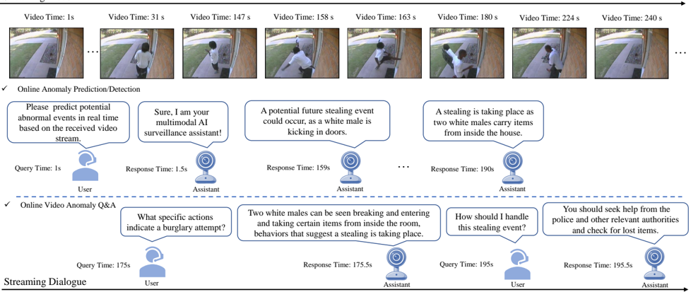
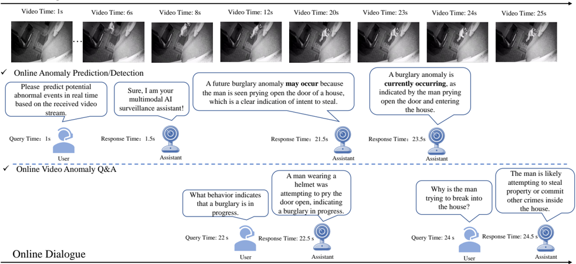

## AssistPDA: An Online Video Surveillance Assistant for Video Anomaly Prediction, Detection, and Analysis

Zhiwei Yang 1 , Chen Gao 2 , Jing Liu 1† , Peng Wu 3 , Guansong Pang 4 , Mike Zheng Shou 2† 1 Xidian University 2 Show Lab, National University of Singapore 4

3 Northwestern Polytechnical University

## Abstract

The rapid advancements in large language models (LLMs) have spurred growing interest in LLM-based video anomaly detection (VAD). However, existing approaches predominantly focus on video-level anomaly question answering or offline detection, ignoring the real-time nature essential for practical VAD applications. To bridge this gap and facilitate the practical deployment of LLM-based VAD, we introduce AssistPDA, the first online video anomaly surveillance assistant that unifies video anomaly prediction, detection, and analysis (VAPDA) within a single framework. AssistPDA enables real-time inference on streaming videos while supporting interactive user engagement. Notably, we introduce a novel event-level anomaly prediction task, enabling proactive anomaly forecasting before anomalies fully unfold. To enhance the ability to model intricate spatiotemporal relationships in anomaly events, we propose a Spatio-Temporal Relation Distillation (STRD) module. STRD transfers the long-term spatiotemporal modeling capabilities of vision-language models (VLMs) from offline settings to real-time scenarios. Thus it equips AssistPDA with a robust understanding of complex temporal dependencies and long-sequence memory. Additionally, we construct VAPDA-127K, the first large-scale benchmark designed for VLM-based online VAPDA. Extensive experiments demonstrate that AssistPDA outperforms existing offline VLMbased approaches, setting a new state-of-the-art for realtime VAPDA. Our dataset and code will be open-sourced to facilitate further research in the community.

## 1. Introduction

Video anomaly detection (VAD) [1 , 22 , 32 , 40] aims to automatically identify anomalous events in video. Traditional VAD methods mainly focus on score-based detection, i.e ., assigning anomaly scores to frames, clips, or entire videos to indicate the degree of abnormality. However, these meth-

†Corresponding authors

Singapore Management University ods lack semantic interpretability, making them insufficient for handling complex and diverse anomalous events.

The emergence of large language models (LLMs) [5 , 13 , 26 , 43] has inspired LLM-based VAD approaches. For instance, Du et al. proposed an anomaly causal understanding framework [8]; Zhang et al. introduced a multimodal LLMbased unbiased and interpretable VAD framework [41]; and Tang et al. developed an open-world anomaly comprehension method using vision-language models (VLMs) [23]. These works demonstrate the potential of LLMs in VAD, showcasing promising applications of VLMs in the field. However, a major limitation of these methods is that they operate in an offline setting, which fundamentally diverges from the real-world requirement for online VAD in practical surveillance scenarios. As of now, research on leveraging VLMs for online VAD remains unexplored.

To advance the practical application of VLMs in VAD, our primary goal is to develop an online video anomaly surveillance assistant. Specifically, as illustrated in Fig. 1 , we identify three core capabilities: (1) Video Anomaly Prediction (VAP): In real-world surveillance, anomalies should not only be detected post-occurrence but also anticipated as early as possible to minimize potential damage. (2) Video Anomaly Detection: The system must robustly detect sudden, unpredictable anomalies such as explosions or sudden attacks, ensuring timely alerts. (3) Video Anomaly Analysis (VAA): Given the diversity of real-world anomalies, users may require real-time assistance to analyze and respond appropriately to incidents. The surveillance assistant should facilitate real-time question answering and event analysis, aiding users in handling anomalies effectively.

To realize aforementioned goals, we propose AssistPDA, the first online video surveillance assistant for Video Anomaly Prediction, Detection, and Analysis (VAPDA). AssistPDA is the first framework to unify anomaly prediction, detection, and interactive analysis within a single system, supporting real-time streaming inference and interaction. AssistPDA operates in three primary modes: proactive anomaly prediction, real-time anomaly detection, and interactive analysis. In predictive and detection modes, the

Figure 1. Illustration of the proposed Video Anomaly Prediction, Detection, and Analysis (VAPDA) tasks.

system autonomously alerts users to critical anomalies. In interactive mode, it responds to user queries in real-time.

Developing the AssistPDA presents two key challenges. (1) Constructing training data for online VAPDA. Existing LLM-based VAD methods have released video anomaly question-answering datasets. However, these datasets are constrained to clip-level Q&amp;A, making them unsuitable for training a real-time video streaming-based model. To bridge this gap, we construct VAPDA-127K, the first large-scale benchmark dataset for online VAPDA. Built upon UCFCrime [22] and XD-Violence [31] video anomaly datasets, our dataset consists of 2,415 videos across 15 anomaly categories, and 127K time-stamped anomaly predictions, detections, and Q&amp;A in natural language form. (2) Enabling temporal awareness in frame-by-frame streaming inference. AssistPDA leverages Qwen2-VL [27] as the backbone, which inherently supports offline video/image inference. However, transitioning to frame-by-frame online inference introduces a critical challenge since capturing longrange temporal dependencies is crucial for detecting complex and varied anomaly events.

To address this, we propose a SpatioTemporal Relation Distillation (STRD) module, inspired by recent advances in vision-language modeling. Many existing VLMs [24 , 27], trained on large-scale video datasets, exhibit strong offline temporal reasoning capabilities. We aim to distill this spatiotemporal reasoning knowledge from a pre-trained offline VLM vision encoder into a lightweight module, integrating it within the online vision encoder-LLM pipeline. This enables AssistPDA to maintain robust long-term spatiotemporal understanding despite operating in a streaming frameby-frame inference setting. Through extensive experiments, we demonstrate that AssistPDA significantly outperforms existing VLMs in VAPDA, marking a major step towards intelligent real-time video anomaly surveillance systems. To summarize, our major contributions are as follows:

- We propose, for the first time, a unified framework that integrates video anomaly prediction, detection, and analysis in an online setting. Moreover, we propose event-level video anomaly prediction as a new task.
- We devise the AssistPDA, an assistant for online video anomaly surveillance, incorporating a novel STRD module to transfer offline VLM spatiotemporal reasoning capabilities to streaming inference, significantly enhancing long-term spatiotemporal understanding.
- We construct VAPDA-127K, the first large-scale benchmark dataset for online VAPDA, containing 127K timestamped anomaly predictions, detections, and Q&amp;A in natural language form, providing a valuable resource for future VLM-based video anomaly research.

## 2. Related Works

## 2.1. Video Anomaly Detection

VAD problem has been studied over the years [9 , 11]. Early methods primarily relied on handcrafted feature-based approaches, such as those proposed in [6 , 15 , 19]. With the rapid advancements in deep learning, deep learning-based methods have become the dominant paradigm. These methods can be broadly categorized into three types: unsupervised, semi-supervised, and weakly supervised VAD.

Unsupervised VAD methods [20] typically leverage clustering techniques or pseudo-label generation with selftraining to directly mine anomaly-related information from

Figure 2. Pipeline of data construction for the proposed VAPDA-127K dataset.

mixed normal and abnormal data. Semi-supervised VAD approaches [14 , 16 , 35 , 36] are mainly based on either frame reconstruction or frame prediction, both of which employ a surrogate task to learn patterns from normal video data. During inference, deviations from normal patterns are considered anomalies. Weakly supervised VAD methods [22 , 25 , 31 , 33 , 34 , 37] carry out on datasets with only video-level annotations and often utilize multiple-instance learning to infer segment-level anomaly scores.

## 2.2. Multimodal Video Anomaly Detection

With the rapid progress of LLMs and their superior performance in visual understanding [10 , 28 , 29], multimodal VAD based on LLMs has gained increasing attention [8 , 39]. For instance, Lv et al. proposed a video anomaly detection and explanation framework leveraging VLM [17]. Zanella et al. introduced a training-free VAD method using LLMs [39]. Du et al. proposed a framework that utilizes VLMs for causal reasoning in VAD [8]. Tang et al. introduced HAWK, which leverages VLMs to understand open-world video anomalies [23]. Zhang et al. developed Holmes-VAD for unbiased and interpretable VAD [41].

However, existing VAD methods based on LLMs or VLMs are limited to single-task anomaly detection or video anomaly question answering. These methods operate only in offline settings without predictive capabilities. Such limitations hinder their applicability in real-world surveillance scenarios. In contrast to previous methods, we propose the first VLM-based online video anomaly surveillance assistant, unifying video anomaly prediction, detection, and real-time question answering within a single framework. Furthermore, we construct a large-scale benchmark dataset VAPDA-127K tailored for the online VAPDA task.

## 3. Method

In this section, we first define the tasks of video anomaly prediction, detection, and analysis in Sec 3.1. Sec 3.2 introduces the construction process of the VAPDA-127K dataset. Sec 3.3 presents the detailed model architecture, while Sec 3.4 describes the training and inference procedures.

## 3.1. Task Definition

As mentioned, a video anomaly surveillance assistant should possess three key capabilities: Video Anomaly Prediction , Video Anomaly Detection, and Video Anomaly Analysis. We first define these tasks under the setting of VLM-based streaming video online inference.

Video anomaly prediction. In this work, we introduce the event-level VAP task for the first time. Although previous studies [2 , 30] have explored frame-level anomaly score prediction, such as predicting whether anomalies will occur in future T + n frames based on the previous T frames, existing methods are typically limited to a very short prediction window (0-1s in advance), which limits their practical applicability in real-world scenarios. In contrast, event-level prediction aims to anticipate potential anomalous events before they fully unfold, leveraging historical video information to generate early warnings in natural language. The predicted output includes the event category and a descriptive explanation of the anticipated anomaly.

We formalize this process as follows: At time t0, a user issues a query, e.g ., "Please predict potential abnormal events in real time based on the received video stream." The actual anomaly occurs between t n ∼ t m . Given the observed video stream between t 0 and t k (k &lt;= n), if an anomaly is deemed likely, the model should automatically generate a natural language response at tk, detailing the predicted event type and description.

Video Anomaly Detection. Certain types of abrupt anomalous events are inherently unpredictable in advance. Therefore, the capability of the model to perform real-time anomaly detection is crucial. We formalize this process as follows: At time t 0 , the user issues a query, e.g ., "Please detect any abnormal events in real time based on the received video stream." The actual anomaly occurs between t n ∼ t m . During this period, the model provides anomaly detection responses at multiple key moments within t n to t m , each response containing the detected anomaly type and a descriptive explanation of the event.

Video Anomaly Analysis. For the VAA task, we adopt a user-centric approach, where the model provides responses based on the user's inquiries regarding ongoing anomalous events. Since real-world anomalies can be highly diverse, and user queries are completely open-ended, we formalize video anomaly analysis as an online video question answering task. Specifically, assume that an anomaly begins to occur at t n . At a later time t n + k, the user issues a query, such as "How should the ongoing anomaly be handled?" Upon receiving the query, the model should generate an immediate response at t n + l with (l &gt;= k), addressing the user's question in real time.

## 3.2. Dataset Construction

In this section, we detail the construction process of the VAPDA-127K dataset to adapt the three tasks above. Fig. 2 illustrates the process of construction of the dataset.

Data Collection. We first collect raw video data from the two largest weakly supervised VAD datasets, UCFCrime [22] and XD-Violence [31]. After filtering out low-quality videos, we obtain a total of 2415 untrimmed videos. These videos only contain video-level annotations, indicating whether an anomaly occurs within the video, but lack precise timestamps for when anomalies happen. However, to train the VLM-online for our three defined tasks, timestamp-level anomaly annotations are necessary. Thanks to HIVAU-70K [42] providing annotated event start and end timestamps for UCF-Crime and XD-Violence, we further build our task-specific dataset based on them.

Data Annotation for Anomaly Prediction. For the VAP task, we require frame-level information preceding the occurrence of an anomaly. To reduce the computational burden caused by redundant frames, we first sample the raw videos at 1 FPS and then use an existing VLM to generate a caption for each frame. Next, we segment each video at the start time of each anomalous event. We then feed all captions (with their corresponding caption ID ) from the video start time up to the onset of the anomaly into a LLM. Using specifically designed prompts, we instruct the LLM to determine the earliest frame where a potential future anomaly could have been predicted and to generate the anomaly type and a brief description of the predicted anomaly.

Data Annotation for Anomaly Detection. For the VAD task, we focus on video segments corresponding to the actual anomaly occurrence. Using HIVAU-70K [42], which provides event start and end timestamps and segment-level captions, we first extract data containing explicit start and end timestamps for anomalous events. While segmentlevel captions exist within the anomalous event period, not all captions within this period necessarily contain explicit anomaly-related information due to the complexity of realworld events. We sequentially feed captions with timestamps along with historical captions into the LLM. The LLM is instructed to determine whether each caption contains an ongoing anomalous event. Furthermore, by leveraging both the current and historical captions, the LLM generates a concise anomaly description that includes the anomaly type. Through this process, we obtain timestamped anomaly detection captions corresponding to key moments during the anomaly occurrence.

Data Annotation for Anomaly Analysis. For the VAA task, we construct open-ended question-answer pairs based on ongoing anomalous events. This is distinctly different from existing anomalous Q&amp;A data, which are fixedtemplate Q&amp;A pairs constructed based on the entire video or clips. Building upon the anomaly detection annotations, we extract key detection captions at critical moments within the anomaly period and combine them with historical captions in chronological order. These are then fed into an LLM, which, based on the 5W (Who, What, When, Where, Why) and 2H (How, How much) principle, generates questions relevant to the ongoing anomalous event. The LLM also generates factually and logically consistent answers based on both the current and historical captions.

Figure 3. Pipeline of our method. VE and STRD are short for Video Encoder and Spatiotemporal relation distillation, respectively.

Manual Review and Refinement. To mitigate the effects of LLM hallucinations, we iteratively refine the prompts to ensure optimal generated responses. Finally, all LLMgenerated data undergo manual review, where inappropriate responses are removed or modified. This review process involved five annotators, each spending an average of 10 hours, ensuring high-quality annotations for the dataset. Please refer to the supplementary material for more details on the construction of the dataset.

## 3.3. Model Architecture

Fig. 3 presents an overview of our proposed AssistPDA, which consists of three key components: a vision encoder, a spatiotemporal relationship distillation module, and an LLM with a fine-tunable LoRA module. In the following sections, we provide details of each module.

## 3.3.1. Vision Encoder

We adopt the frozen vision encoder φ v from Qwen2-VL [27], which is based on a Vision Transformer (ViT) [7]. Following existing work [3], we sample frames from the original video at 2 FPS. To support both image and video inputs, the Qwen2-VL vision encoder duplicates input images when operating in image mode. To reduce redundant computation, we directly take every two consecutive frames as input to extract visual tokens. Given an input video frame sequence ν ∈ R T ×H×W×C , the visual token obtained from

Figure 4. Illustration of the STRD module.

the (i − 1)-th and i-th frames is formulated as:

<!-- formula-not-decoded -->

where v j i − 1,i (j ∈ {1 , 2, ..., N}) represents the patch tokens, with N denoting the total number of patches obtained from every two input frames. For clarity and conciseness, we will refer to "each frame" as a representation of the actual two-frame input in the subsequent discussion.

## 3.3.2. SpatioTemporal Relationship Distillation

In online processing mode, video frames are input frame by frame, making the learning of spatiotemporal relationships and long-term memory a significant challenge. Existing approaches often incorporate memory units between

the vision encoder and the LLM to store historical frame information, which is then retrieved to maintain temporal memory or extract key information. However, such methods impose substantial constraints on inference speed.

To ensure that our designed online framework, AssistantPDA, maintains high inference efficiency while also exhibiting strong spatiotemporal reasoning and long-term memory capabilities, we introduce a STRD module ϕ. To minimize additional computational overhead on the VLM backbone, we adopt a lightweight approach by employing a two-layer Multi-Head Self-Attention (MHSA) network as the STRD module. This module transfers the VLM's offline-mode ability to model global spatiotemporal relationships into an online processing pipeline. We perform the distillation using Qwen2-VL [27] with the goal that the tokens obtained from the frame-by-frame video input remain as consistent as possible in feature space with those obtained from processing the entire video directly. The spatiotemporal relationship distillation process is illustrated in Fig. 4. First, the input video frame sequence ν ∈ R T ×H×W×C is directly processed by the Qwen2-VL vision encoder, obtaining the global visual token representation:

<!-- formula-not-decoded -->

where v j i (j ∈ {1 , 2, ..., M}) denotes the patch tokens and M is the number of patches extracted from the input video.

Since the vision encoder applies a 3D convolution with a stride of 2 before patch embedding, each v j i still represents a patch token fused from two consecutive frames. However, unlike frame-by-frame input, since the visual tokens here are obtained through a global attention operation, meaning each v j i inherently contains information from all other frame patches, incorporating full spatiotemporal context. The role of the STRD module is to ensure that tokens obtained from frame-by-frame input, after transformation, also encapsulate global contextual information. To achieve this, we first concatenate the tokens obtained from frameby-frame input along the temporal dimension:

<!-- formula-not-decoded -->

We then apply the distillation module to transform these tokens, which is formulated as:

<!-- formula-not-decoded -->

Finally, we enforce consistency between ⌢ V images and the global video tokens ⌢ V video in feature space using a mean squared error (MSE) loss function:

<!-- formula-not-decoded -->

After training the STRD module, we insert it between the vision encoder and the LLM during LoRA fine-tuning. In real-time inference, the MHSA module in the STRD module is equipped with KV cache, allowing frame-by-frame input tokens to retain historical spatiotemporal context. By adjusting the length of the KV cache, we can control the temporal span of frames considered by the STRD module. On our experimental setup with an A6000 GPU, the maximum temporal receptive field can reach up to 20 minutes.

## 3.3.3. LLM

The LLM used in our framework is QwenLM from Qwen2VL [27]. It is responsible for processing the visual tokens obtained from the STRD module, concatenating them with the text tokens derived from the user query in temporal order, and feeding them into the LLM for decoding to generate the VLM response.

## 3.4. Training and Inference

Our training process consists of two stages. The first stage involves pre-training the STRD module. As described in Sec 3.3.2, we optimize this module using the MSE loss function. The second stage involves instruction fine-tuning of the model using the constructed VAPDA-127K dataset. The loss function consists of two components. The first component is autoregressive language modeling, which aims to maximize the joint probability P
i [Txti+1] P
i of the input text sequence. The second component is video streaming input prediction modeling. For real-time anomaly prediction and detection tasks, AssistPDA needs to have the capability to respond automatically, determining when to generate a response and when to remain silent. Following the work [3], we introduce an additional streaming End-ofSequence (EOS) token appended to each video frame token. The probability P
i [EOS] P
i of predicting the EOS token is used to decide whether to continue receiving video frame inputs or to generate a response. Both components are optimized using the cross-entropy loss function, formulated as follows:

<!-- formula-not-decoded -->

where l i and fi are condition indicators; liis 1 if the i-th token is a language response token, and 0 otherwise; fiis 1 if (1) the i-th token is the last token of a frame, and (2) l i+1 = 0 . w is balance term. Essentially, the streaming EOS loss is applied to frames before responding. P
i [Txti+1] P
i denotes the probability of the (i+ 1)-th text token output from the language model head at the i-th token, while P
i [EOS] P
i represents the probability assigned to the EOS token.

During the inference stage, AssistPDA executes different tasks based on user-specified queries. For VAP and

VAD tasks, we introduce a threshold γ to control the prediction of the EOS token. When the predicted probability of the EOS token falls below γ, the model generates a response, enabling AssistPDA to provide predictions or detection alerts at critical moments while remaining silent during normal periods. For anomaly analysis tasks, AssistPDA responds immediately after the user completes their query, no threshold setting is required. On an A6000 GPU, AssistPDA achieves an average inference speed of 15–20 FPS .

## 4. Experiments

## 4.1. Dataset and Evaluation Metrics

Dataset. Our VAPDA-127K is constructed based on the raw videos from the two largest-scale VAD datasets, UCFCrime [22] and XD-Violence [31]. VAPDA-127K consists of 2 , 415 untrimmed videos, covering a total of 15 categories of anomalous events, including abuse, arson, car accidents, fighting, explosion, riots, stealing, and shooting, etc. These events are from real-world scenarios and selected footage from movies and live broadcasts. More details about the dataset are in the supplementary material.

Evaluation Metrics. For training and ablation studies, we follow [3] and adopt three evaluation metrics to efficiently assess the overall performance of the model: Language Modeling Perplexity (LM-PPL), Time Difference (TimeDiff), and Fluency. LM-PPL is a commonly used perplexity measure to evaluate language modeling capability, where a lower LM-PPL indicates more accurate responses. TimeDiff measures the temporal alignment ability of the model by computing the difference between the predicted response timestamp and the expected timestamp. Fluency evaluates the proportion of continuously and successfully predicted tokens within a dialogue round. Since this also includes language tokens, the fluency metric comprehensively reflects the model's language modeling ability in an online streaming pipeline. During inference, different evaluation metrics are used depending on the task. For textual responses in real-time inference across VAP, VAD, and VAA tasks, following the work[8] we employ MoverScore (MS) [44], Bleurt [21], and Unieval [45] to evaluate response quality by comparing them with ground truth text annotations. For VAP and VAD tasks, we also use the weighted F1-score to measure the model's accuracy in classifying predicted and detected anomaly types. In addition, we introduce the average advance time (AAT) metric to evaluate the model's capability to predict anomalies in advance by comparing the response time with the actual anomaly onset time.

## 4.2. Implementation Details

The vision encoder and LLM module of our framework are initialized using the Qwen2-VL-2B-Instruct version. During the pretraining distillation stage of the STRD module, we train for a total of 10 epochs using the AdamW optimizer with an initial learning rate of 1 × 10 − 4 , employing a cosine annealing decay strategy. In the main framework training stage, we train all linear layers of the LLM using LoRA with r = 32 and α = 64, and the epoch is set to 2. Additionally, we fine-tune the final output linear layer of the STRD module. The default loss weight w is set to 1. The EOS token prediction thresholds for video anomaly prediction and detection are set to 0.96 and 0.7. Further execution details can be found in the supplementary materials.

## 4.3. Main Results

Since AssistPDA is the first framework that leverages a VLM for online VAPDA, we compare it with two types of baselines: general-purpose VLMs and VLMs designed for VAD. Most existing VLMs only support offline processing. To facilitate a fair comparison, we simulate an online setting for offline models by adopting a sliding window approach with a window size of 5 seconds. Specifically, we provide each VLM with prompts related to prediction, detection, and question, instructing them to generate anomaly categories, corresponding anomaly descriptions, and responses to user queries based on the input video segments. Due to differences in instruction fine-tuning data across VLMs, we optimize prompts for each model to maximize response accuracy. For VLMs that support online processing, such as VideoLLM-online [3], we directly feed streaming video input at 2 FPS. Table 1 presents the comparison results of AssistPDA with existing methods on the three tasks. The compared VLMs include Video-LLaMA2 [4], Video-LLaVA [12], Video-ChatGPT [18], InternVL2 [24], and Qwen2VL [27], which are among the most advanced VLMs currently available. Additionally, Holmes-VAD [41] is an offline VLM specifically designed for VAD.

As shown in Table 1, our method significantly outperforms all baselines, achieving superior performance across all evaluation metrics. Except for Holmes-VAD, other VLMs exhibit low F1-scores on both VAP and VAD tasks. This is primarily due to the fact that VAPDA-127K encompasses 15 distinct categories of anomalous events, posing a considerable challenge for general-purpose VLMs. The online method, VideoLLM-Online, fails to follow our instructions, producing largely garbled and redundant outputs, resulting in poor performance. Notably, in the video anomalous event prediction task, the average advance prediction time AAT of our method is 29.19s, which is a qualitative leap compared to frame-level prediction. The consistent superiority of our method across all metrics demonstrates the effectiveness of AssistPDA in VAP, VAD, and VAA tasks.

## 4.4. Ablation Study

We conduct ablation experiments in this subsection to analyze the effectiveness of each component of our framework.

| Task Name                                                                                  | VAP                                                                                        | VAP                                                                                        | VAP                                                                                        | VAP                                                                                        | VAP                                                                                        | VAP                                                                                        | VAD                                                                                        | VAD                                                                                        | VAD                                                                                        | VAD                                                                                        | VAA                                                                                        | VAA                                                                                        | VAA                                                                                        |
|--------------------------------------------------------------------------------------------|--------------------------------------------------------------------------------------------|--------------------------------------------------------------------------------------------|--------------------------------------------------------------------------------------------|--------------------------------------------------------------------------------------------|--------------------------------------------------------------------------------------------|--------------------------------------------------------------------------------------------|--------------------------------------------------------------------------------------------|--------------------------------------------------------------------------------------------|--------------------------------------------------------------------------------------------|--------------------------------------------------------------------------------------------|--------------------------------------------------------------------------------------------|--------------------------------------------------------------------------------------------|--------------------------------------------------------------------------------------------|
|                                                                                            |                                                                                            | F1-score(%)                                                                                | AAT (s)                                                                                    | Language                                                                                   | Language                                                                                   | Language                                                                                   | F1-score (%)                                                                               | Language                                                                                   | Language                                                                                   | Language                                                                                   | Language                                                                                   | Language                                                                                   | Language                                                                                   |
|                                                                                            | Params                                                                                     |                                                                                            |                                                                                            | MS (%)                                                                                     | Bleurt (%)                                                                                 | Unieval (%)                                                                                |                                                                                            | MS (%)                                                                                     | Bleurt (%)                                                                                 | Unieval (%)                                                                                | MS (%                                                                                      | Bleurt (%)                                                                                 | Unieval (%)                                                                                |
| Sliding windows size=5s fps=2                                                              | Sliding windows size=5s fps=2                                                              | Sliding windows size=5s fps=2                                                              | Sliding windows size=5s fps=2                                                              | Sliding windows size=5s fps=2                                                              | Sliding windows size=5s fps=2                                                              | Sliding windows size=5s fps=2                                                              | Sliding windows size=5s fps=2                                                              | Sliding windows size=5s fps=2                                                              | Sliding windows size=5s fps=2                                                              | Sliding windows size=5s fps=2                                                              | Sliding windows size=5s fps=2                                                              | Sliding windows size=5s fps=2                                                              | Sliding windows size=5s fps=2                                                              |
| Video-LLaMA2 [4]                                                                           | 7B                                                                                         | 28.26                                                                                      | 10.32                                                                                      | 53.05                                                                                      | 37.98                                                                                      | 79.84                                                                                      | 9.56                                                                                       | 50.65                                                                                      | 29.67                                                                                      | 65.23                                                                                      | 56.64                                                                                      | 52.15                                                                                      | 80.22                                                                                      |
| Video-LLaVA [12]                                                                           | 7B                                                                                         | 38.63                                                                                      | 12.34                                                                                      | 52.99                                                                                      | 37.39                                                                                      | 73.89                                                                                      | 12.01                                                                                      | 48.32                                                                                      | 20.28                                                                                      | 67.69                                                                                      | 57.05                                                                                      | 44.49                                                                                      | 81.84                                                                                      |
| Video-ChatGPT [18]                                                                         | 7B                                                                                         | 18.94                                                                                      | 7.25                                                                                       | 53.54                                                                                      | 38.06                                                                                      | 41.08                                                                                      | 11.35                                                                                      | 54.15                                                                                      | 40.66                                                                                      | 64.12                                                                                      | 56.29                                                                                      | 47.56                                                                                      | 80.60                                                                                      |
| InternVL2 [24]                                                                             | 2B                                                                                         | 16.16                                                                                      | 6.32                                                                                       | 53.22                                                                                      | 33.98                                                                                      | 61.98                                                                                      | 13.77                                                                                      | 52.59                                                                                      | 38.82                                                                                      | 66.25                                                                                      | 55.82                                                                                      | 44.19                                                                                      | 73.29                                                                                      |
| Qwen2-VL [27]                                                                              | 2B                                                                                         | 30.71                                                                                      | 11.64                                                                                      | 54.59                                                                                      | 40.02                                                                                      | 72.12                                                                                      | 11.83                                                                                      | 55.45                                                                                      | 48.14                                                                                      | 69.29                                                                                      | 54.78                                                                                      | 47.13                                                                                      | 75.45                                                                                      |
| Holmes-VAD [41]                                                                            | 7B                                                                                         | 47.91                                                                                      | 15.68                                                                                      | 54.97                                                                                      | 41.47                                                                                      | 70.61                                                                                      | 25.83                                                                                      | 55.00                                                                                      | 42.52                                                                                      | 68.48                                                                                      | 55.70                                                                                      | 40.72                                                                                      | 88.05                                                                                      |
| Holmes-VAD [41] 7B 47.91 15.68 54.97 41.47 70.61 25.83 55.00 42.52 68.48 55.70 40.72 88.05 | Holmes-VAD [41] 7B 47.91 15.68 54.97 41.47 70.61 25.83 55.00 42.52 68.48 55.70 40.72 88.05 | Holmes-VAD [41] 7B 47.91 15.68 54.97 41.47 70.61 25.83 55.00 42.52 68.48 55.70 40.72 88.05 | Holmes-VAD [41] 7B 47.91 15.68 54.97 41.47 70.61 25.83 55.00 42.52 68.48 55.70 40.72 88.05 | Holmes-VAD [41] 7B 47.91 15.68 54.97 41.47 70.61 25.83 55.00 42.52 68.48 55.70 40.72 88.05 | Holmes-VAD [41] 7B 47.91 15.68 54.97 41.47 70.61 25.83 55.00 42.52 68.48 55.70 40.72 88.05 | Holmes-VAD [41] 7B 47.91 15.68 54.97 41.47 70.61 25.83 55.00 42.52 68.48 55.70 40.72 88.05 | Holmes-VAD [41] 7B 47.91 15.68 54.97 41.47 70.61 25.83 55.00 42.52 68.48 55.70 40.72 88.05 | Holmes-VAD [41] 7B 47.91 15.68 54.97 41.47 70.61 25.83 55.00 42.52 68.48 55.70 40.72 88.05 | Holmes-VAD [41] 7B 47.91 15.68 54.97 41.47 70.61 25.83 55.00 42.52 68.48 55.70 40.72 88.05 | Holmes-VAD [41] 7B 47.91 15.68 54.97 41.47 70.61 25.83 55.00 42.52 68.48 55.70 40.72 88.05 | Holmes-VAD [41] 7B 47.91 15.68 54.97 41.47 70.61 25.83 55.00 42.52 68.48 55.70 40.72 88.05 | Holmes-VAD [41] 7B 47.91 15.68 54.97 41.47 70.61 25.83 55.00 42.52 68.48 55.70 40.72 88.05 | Holmes-VAD [41] 7B 47.91 15.68 54.97 41.47 70.61 25.83 55.00 42.52 68.48 55.70 40.72 88.05 |
| VideoLLM-online [3]                                                                        | 8B                                                                                         | 0                                                                                          | /                                                                                          | 5.23                                                                                       | 6.75                                                                                       | 10.23                                                                                      | 0                                                                                          | 6.78                                                                                       | 4.43                                                                                       | 9.46                                                                                       | 5.67                                                                                       | 3.56                                                                                       | 8.92                                                                                       |
| AssistPDA                                                                                  | 2B                                                                                         | 64.69                                                                                      | 29.19                                                                                      | 61.89                                                                                      | 51.63                                                                                      | 76.69                                                                                      | 45.66                                                                                      | 65.45                                                                                      | 63.83                                                                                      | 72.46                                                                                      | 62.87                                                                                      | 61.12                                                                                      | 88.32                                                                                      |

Table 1. Main results of VAP, VAD, VAA on VAPDA-127K. We compare existing general-purpose VLMs with those tailor-designed for VAD. For VLMs that do not support online inference, video is sampled at 2 FPS and processed using a 5-second sliding window as input.

Table 2. Performance comparison of our method with different STRD settings.

|                 | VAP      | VAP     | VAP       | VAD    | VAD          | VAD         |
|-----------------|----------|---------|-----------|--------|--------------|-------------|
|                 | LM-PPL ↓ | TimeDif | ↓ Fluency | LM-PPL | ↓ TimeDiff ↓ | ↓ Fluency ↑ |
| Baseline        | 1.76     | 1.52    | 53.02%    | 2.15   | 5.14         | 46.69%      |
| w/o pretraining | 1.79     | 1.85    | 52.76%    | 2.27   | 5.19         | 44.53%      |
| w/o finetune    | 1.70     | 1.27    | 53.42%    | 1.98   | 4.82         | 46.68%      |
| w finetune      | 1.68     | 1.07    | 53.81%    | 1.96   | 4.71         | 46.83%      |

Table 3. Performance comparison of our method on STRD with different numbers of MHSA layers.

|              | VAP        | VAP    | VAP           | VAD    | VAD      | VAD       |
|--------------|------------|--------|---------------|--------|----------|-----------|
|              | LM-PPL ↓ T | imeDif | ↓ Fluency ↑ L | LM-PPL | TimeDiff | Fluency ↑ |
| 1 layer MHSA | 1.67       | 1.08   | 53.07%        | 1.97   | 4.78     | 45.95%    |
| 2 layer MHSA | 1.68       | 1.07   | 53.81%        | 1.96   | 4.71     | 46.83%    |
| 3 layer MHSA | 1.70       | 1.09   | 53.46%        | 1.96   | 4.83     | 46.46%    |

Effectiveness of the STRD. To evaluate the effectiveness of the STRD module, we perform multiple ablation and comparative experiments. Table 2 presents the results of four experimental settings: (1) the baseline model without the STRD (baseline), (2) the model with the STRD module but without distillation pertaining (w/o pretraining), (3) the model with the STRD module but without finetune (w/o finetune), and (4) the model with both the STRD module and fine-tuning (w finetune). From the Table 2, it can be observed that the setting with both the STRD module and finetuning achieves the best performance. Compared to the baseline, the model with the STRD module and fine-tuning shows a significant advantage in both LM-PPL and TimeDiff metrics, indicating improved language modeling accuracy and temporal alignment. These results demonstrate that the design of the STRD module, combined with finetuning, effectively enhances the model's capability in spatiotemporal reasoning. Table 3 presents the impact of different numbers of MHSA layers in the STRD module. The results show that the 2-layer MHSA configuration achieves the best overall performance.

Impact of EOS Token Prediction Threshold γ . As shown in Fig. 5 (a)(b), we illustrate the impact of the EOS to-

Figure 5. F1-score variation for different EOS token prediction thresholds γ on VAP and VAD tasks.

ken threshold γ on model performance during the inference phase. We can observe that the prediction task is sensitive to the EOS token threshold, which aligns with its inherent nature, requiring heightened sensitivity to anomalous events. Finally, the optimal EOS token threshold γ is set to 0.96 for the prediction task and 0.7 for the detection task.

## 5. Conclusion

In this work, we propose the AssistPDA, an online video anomaly surveillance assistant that integrates video anomaly prediction, detection, and analysis. Based on this framework, we introduce a novel event-level video anomaly prediction task aimed at enabling early warning of anomalous events. To enhance AssistPDA's capability of understanding long-term spatiotemporal relationships in video streams under online inference settings, we introduce a novel STRD module, which can effectively transfer the spatiotemporal reasoning ability of existing VLMs from offline processing to online inference. To accommodate the tasks of online VAPDA, we construct a large-scale benchmark dataset, VAPDA-127K, which serves as a valuable resource for future research on online video anomaly understanding. Extensive experiments have shown that AssistPDA achieves superior performance compared to existing state-of-the-art VLMs across the VAP, VAD, and VAA tasks.

## References

- [1] Yannick Benezeth, P-M Jodoin, Venkatesh Saligrama, and Christophe Rosenberger. Abnormal events detection based on spatio-temporal co-occurences. In CVPR, pages 2458– 2465, 2009. 1
- [2] Congqi Cao, Yue Lu, Peng Wang, and Yanning Zhang. A new comprehensive benchmark for semi-supervised video anomaly detection and anticipation. In CVPR, pages 20392– 20401, 2023. 4
- [3] Joya Chen, Zhaoyang Lv, Shiwei Wu, Kevin Qinghong Lin, Chenan Song, Difei Gao, Jia-Wei Liu, Ziteng Gao, Dongxing Mao, and Mike Zheng Shou. Videollm-online: Online video large language model for streaming video. In CVPR, pages 18407–18418, 2024. 5 , 6 , 7 , 8
- [4] Zesen Cheng, Sicong Leng, Hang Zhang, Yifei Xin, Xin Li, Guanzheng Chen, Yongxin Zhu, Wenqi Zhang, Ziyang Luo, Deli Zhao, et al. Videollama 2: Advancing spatialtemporal modeling and audio understanding in video-llms. arXiv preprint arXiv:2406.07476, 2024. 7 , 8
- [5] WeiLin Chiang, Zhuohan Li, Ziqing Lin, Ying Sheng, Zhanghao Wu, Hao Zhang, Lianmin Zheng, Siyuan Zhuang, Yonghao Zhuang, Joseph E Gonzalez, et al. Vicuna: An open-source chatbot impressing gpt-4 with 90%* chatgpt quality. See https://vicuna. lmsys. org (accessed 14 April 2023), 2(3):6, 2023. 1
- [6] Yang Cong, Junsong Yuan, and Ji Liu. Sparse reconstruction cost for abnormal event detection. In CVPR, pages 3449– 3456, 2011. 2
- [7] Alexey Dosovitskiy, Lucas Beyer, Alexander Kolesnikov, Dirk Weissenborn, Xiaohua Zhai, Thomas Unterthiner, Mostafa Dehghani, Matthias Minderer, Georg Heigold, Sylvain Gelly, et al. An image is worth 16x16 words: Transformers for image recognition at scale. arXiv preprint arXiv:2010.11929, 2020. 5
- [8] Hang Du, Sicheng Zhang, Binzhu Xie, Guoshun Nan, Jiayang Zhang, Junrui Xu, Hangyu Liu, Sicong Leng, Jiangming Liu, Hehe Fan, et al. Uncovering what why and how: A comprehensive benchmark for causation understanding of video anomaly. In CVPR, pages 18793–18803, 2024. 1 , 3 , 7 , 2
- [9] Dong Gong, Lingqiao Liu, Vuong Le, Budhaditya Saha, Moussa Reda Mansour, Svetha Venkatesh, and Anton van den Hengel. Memorizing normality to detect anomaly: Memory-augmented deep autoencoder for unsupervised anomaly detection. In CVPR, pages 1705–1714, 2019. 2
- [10] Zhaopeng Gu, Bingke Zhu, Guibo Zhu, Yingying Chen, Ming Tang, and Jinqiao Wang. Anomalygpt: Detecting industrial anomalies using large vision-language models. In AAAI, pages 1932–1940, 2024. 3
- [11] Mahmudul Hasan, Jonghyun Choi, Jan Neumann, Amit K Roy-Chowdhury, and Larry S Davis. Learning temporal regularity in video sequences. In CVPR, pages 733–742, 2016. 2
- [12] Bin Lin, Yang Ye, Bin Zhu, Jiaxi Cui, Munan Ning, Peng Jin, and Li Yuan. Video-llava: Learning united visual representation by alignment before projection. arXiv preprint arXiv:2311.10122, 2023. 7 , 8
- [13] Haotian Liu, Chunyuan Li, Qingyang Wu, and Yong Jae Lee. Visual instruction tuning. In NeurIPS, pages 34892–34916, 2023. 1
- [14] Wen Liu, Weixin Luo, Dongze Lian, and Shenghua Gao. Future frame prediction for anomaly detection–a new baseline. In CVPR, pages 6536–6545, 2018. 3
- [15] Cewu Lu, Jianping Shi, and Jiaya Jia. Abnormal event detection at 150 fps in matlab. In CVPR, pages 2720–2727, 2013. 2
- [16] Weixin Luo, Wen Liu, and Shenghua Gao. Remembering history with convolutional lstm for anomaly detection. In ICME, pages 439–444, 2017. 3
- [17] Hui Lv and Qianru Sun. Video anomaly detection and explanation via large language models. arXiv preprint arXiv:2401.05702, 2024. 3 , 2
- [18] Muhammad Maaz, Hanoona Rasheed, Salman Khan, and Fahad Shahbaz Khan. Video-chatgpt: Towards detailed video understanding via large vision and language models. arXiv preprint arXiv:2306.05424, 2023. 7 , 8
- [19] Vijay Mahadevan, Weixin Li, Viral Bhalodia, and Nuno Vasconcelos. Anomaly detection in crowded scenes. In CVPR , pages 1975–1981, 2010. 2
- [20] Guansong Pang, Cheng Yan, Chunhua Shen, Anton van den Hengel, and Xiao Bai. Self-trained deep ordinal regression for end-to-end video anomaly detection. In CVPR, pages 12173–12182, 2020. 2
- [21] Thibault Sellam, Dipanjan Das, and Ankur P Parikh. Bleurt: Learning robust metrics for text generation. arXiv preprint arXiv:2004.04696, 2020. 7
- [22] Waqas Sultani, Chen Chen, and Mubarak Shah. Real-world anomaly detection in surveillance videos. In CVPR, pages 6479–6488, 2018. 1 , 2 , 3 , 4 , 7
- [23] Jiaqi Tang, Hao Lu, Ruizheng Wu, Xiaogang Xu, Ke Ma, Cheng Fang, Bin Guo, Jiangbo Lu, Qifeng Chen, and Yingcong Chen. Hawk: Learning to understand open-world video anomalies. In NeurIPS, pages 139751–139785, 2024. 1 , 3 , 2
- [24] OpenGVLab Team. Internvl2: Better than the best—expanding performance boundaries of open-source multimodal models with the progressive scaling strategy, 2024. 2 , 7 , 8
- [25] Yu Tian, Guansong Pang, Yuanhong Chen, Rajvinder Singh, Johan W Verjans, and Gustavo Carneiro. Weakly-supervised video anomaly detection with robust temporal feature magnitude learning. In ICCV, pages 4975–4986, 2021. 3
- [26] Hugo Touvron, Thibaut Lavril, Gautier Izacard, Xavier Martinet, Marie-Anne Lachaux, Timothee Lacroix, Baptiste ´ ´ Roziere, Naman Goyal, Eric Hambro, Faisal Azhar, et al. ` ` Open and efficient foundation language models. Preprint at arXiv. https://doi. org/10.48550/arXiv, 2302(3), 2023. 1
- [27] Peng Wang, Shuai Bai, Sinan Tan, Shijie Wang, Zhihao Fan, Jinze Bai, Keqin Chen, Xuejing Liu, Jialin Wang, Wenbin Ge, et al. Qwen2-vl: Enhancing vision-language model's perception of the world at any resolution. arXiv preprint arXiv:2409.12191, 2024. 2 , 5 , 6 , 7 , 8
- [28] Xiang Wang, Shiwei Zhang, Hangjie Yuan, Yingya Zhang, Changxin Gao, Deli Zhao, and Nong Sang. Few-shot action recognition with captioning foundation models. arXiv preprint arXiv:2310.10125, 2023. 3

- [29] Xiang Wang, Shiwei Zhang, Jun Cen, Changxin Gao, Yingya Zhang, Deli Zhao, and Nong Sang. Clip-guided prototype modulating for few-shot action recognition. IJCV, 132(6): 1899–1912, 2024. 3
- [30] Yang Wang, Jun Xu, Jiaogen Zhou, and Jihong Guan. Video anomaly prediction: Problem, dataset and method. In ICASSP, pages 3870–3874, 2024. 4
- [31] Peng Wu, Jing Liu, Yujia Shi, Yujia Sun, Fangtao Shao, Zhaoyang Wu, and Zhiwei Yang. Not only look, but also listen: Learning multimodal violence detection under weak supervision. In ECCV, pages 322–339, 2020. 2 , 3 , 4 , 7
- [32] Peng Wu, Chengyu Pan, Yuting Yan, Guansong Pang, Peng Wang, and Yanning Zhang. Deep learning for video anomaly detection: A review. arXiv preprint arXiv:2409.05383, 2024. 1
- [33] Peng Wu, Xuerong Zhou, Guansong Pang, Yujia Sun, Jing Liu, Peng Wang, and Yanning Zhang. Open-vocabulary video anomaly detection. In CVPR, pages 18297–18307, 2024. 3
- [34] Peng Wu, Xuerong Zhou, Guansong Pang, Lingru Zhou, Qingsen Yan, Peng Wang, and Yanning Zhang. Vadclip: Adapting vision-language models for weakly supervised video anomaly detection. In AAAI, pages 6074–6082, 2024. 3
- [35] Zhiwei Yang, Peng Wu, Jing Liu, and Xiaotao Liu. Dynamic local aggregation network with adaptive clusterer for anomaly detection. In ECCV, pages 404–421, 2022. 3
- [36] Zhiwei Yang, Jing Liu, Zhaoyang Wu, Peng Wu, and Xiaotao Liu. Video event restoration based on keyframes for video anomaly detection. In CVPR, pages 14592–14601, 2023. 3
- [37] Zhiwei Yang, Jing Liu, and Peng Wu. Text prompt with normality guidance for weakly supervised video anomaly detection. In CVPR, pages 18899–18908, 2024. 3
- [38] Tongtong Yuan, Xuange Zhang, Kun Liu, Bo Liu, Chen Chen, Jian Jin, and Zhenzhen Jiao. Towards surveillance video-and-language understanding: New dataset baselines and challenges. In CVPR, pages 22052–22061, 2024. 2
- [39] Luca Zanella, Willi Menapace, Massimiliano Mancini, Yiming Wang, and Elisa Ricci. Harnessing large language models for training-free video anomaly detection. In CVPR , pages 18527–18536, 2024. 3 , 1 , 2
- [40] Shuangfei Zhai, Yu Cheng, Weining Lu, and Zhongfei Zhang. Deep structured energy based models for anomaly detection. In ICML, pages 1100–1109, 2016. 1
- [41] Huaxin Zhang, Xiaohao Xu, Xiang Wang, Jialong Zuo, Chuchu Han, Xiaonan Huang, Changxin Gao, Yuehuan Wang, and Nong Sang. Holmes-vad: Towards unbiased and explainable video anomaly detection via multi-modal llm. arXiv preprint arXiv:2406.12235, 2024. 1 , 3 , 7 , 8
- [42] Huaxin Zhang, Xiaohao Xu, Xiang Wang, Jialong Zuo, Xiaonan Huang, Changxin Gao, Shanjun Zhang, Li Yu, and Nong Sang. Holmes-vau: Towards long-term video anomaly understanding at any granularity. arXiv preprint arXiv:2412.06171, 2024. 4 , 2
- [43] Renrui Zhang, Jiaming Han, Chris Liu, Peng Gao, Aojun Zhou, Xiangfei Hu, Shilin Yan, Pan Lu, Hongsheng Li, and Yu Qiao. Llama-adapter: Efficient fine-tuning of
16. language models with zero-init attention. arXiv preprint arXiv:2303.16199, 2023. 1
- [44] Wei Zhao, Maxime Peyrard, Fei Liu, Yang Gao, Christian M Meyer, and Steffen Eger. Moverscore: Text generation evaluating with contextualized embeddings and earth mover distance. arXiv preprint arXiv:1909.02622, 2019. 7
- [45] Ming Zhong, Yang Liu, Da Yin, Yuning Mao, Yizhu Jiao, Pengfei Liu, Chenguang Zhu, Heng Ji, and Jiawei Han. Towards a unified multi-dimensional evaluator for text generation. arXiv preprint arXiv:2210.07197, 2022. 7

## AssistPDA: An Online Video Surveillance Assistant for Video Anomaly Prediction, Detection, and Analysis

## Supplementary Material

## 6. Dataset Construction Details

This section provides additional details on the dataset construction process.

## 6.1. Caption Model

For generating video frame captions, we follow the work [39] and aggregate the outputs from five caption models: BLIP2-flan-t5-xl, BLIP2-flan-t5-xl-coco, BLIP2-flant5-xxl, BLIP2-opt-6.7b, and BLIP2-opt-6.7b-coco. This aggregation helps mitigate potential biases from individual caption models.

## 6.2. Task Prompts for LLM

For the three tasks VAP, VAD, and VAA, task-specific data are generated based on captions using the Qwen2.5-72BInstruct model, which is the most powerful open-source LLM available at the time of dataset construction. The specific task prompts for each task are shown in Figure 7 .

## 6.3. Dataset Splits

Table 5 provides a detailed split of the training and test set composition of VAPDA-127K across the three tasks. Notably, for the anomaly analysis test set, we select one of the

## Streaming Video

ten open-ended questions corresponding to each timestamp as the final test sample to ensure compatibility with online streaming inference. Table 6 compares our dataset with existing VAD-related datasets, highlighting its advantages. Our dataset provides textual annotations tailored for online video anomaly prediction and detection tasks. Additionally, for the anomaly analysis task, it offers open-ended questionanswer pairs specific to individual anomalous events.

## 7. Impact of LoRA Fine-tuning Parameters

Table 4 presents the impact of different LoRA fine-tuning parameters, r and α, on performance. The results show that different parameter combinations affect LM-PPL, TimeDiff, and Fluency metrics differently. After a comprehensive trade-off, we select r = 32 and α = 64 as the optimal configuration.

## 8. More Qualitative Results

Figure 6 further demonstrates the qualitative results on the test set. For the VAP and VAD task, the assistant receives the video stream input in real time and gives a response at the moment when the anomaly may occur as well as at the moment when the anomaly actually occurs. For the VAA task, the assistant immediately responds to the user's question.

Figure 6. Visualization results on the test set.

|            | VAP      | VAP        | VAP       | VAD      | VAD        | VAD       |
|------------|----------|------------|-----------|----------|------------|-----------|
|            | LM-PPL ↓ | TimeDiff ↓ | Fluency ↑ | LM-PPL ↓ | TimeDiff ↓ | Fluency ↑ |
| r=8/α=16   | 1.69     | 1.09       | 53.41%    | 1.98     | 4.72       | 46.55%    |
| r=16/α=32  | 1.67     | 1.07       | 53.74%    | 1.99     | 4.68       | 46.76%    |
| r=32/α=64  | 1.68     | 1.07       | 53.81%    | 1.96     | 4.71       | 46.83%    |
| r=64/α=128 | 1.70     | 1.12       | 53.65%    | 1.98     | 4.85       | 46.71%    |

Table 4. Performance comparison of our method with different LoRA fine-tuning parameters.

Table 5. Detailed training and test set split for VAPDA-127K dataset.

|              | VAPDA-127K dataset   | VAPDA-127K dataset   | VAPDA-127K dataset         | VAPDA-127K dataset   |
|--------------|----------------------|----------------------|----------------------------|----------------------|
|              | Prediction text      | Detection text       | Anomaly Analysis (QA pair) | Timestamp            |
| Training set | 2511                 | 6513                 | 96720                      | ✓                    |
| Test set     | 556                  | 1521                 | 19630 (1963)               | ✓                    |

Table 6. Comparison of other existing VAD method datasets.

|                     |             | #Sl      | Text            | Text           | Text                       | Text                       |            |            |
|---------------------|-------------|----------|-----------------|----------------|----------------------------|----------------------------|------------|------------|
| Methods             | #Categories | #Samples | Prediction text | Detection text | Anomaly Analysis (QA pair) | Anomaly Analysis (QA pair) | Temp. Anno | VLM tuning |
|                     |             |          | Prediction tex  | Detection text | Fixed template             | Open-end                   | Temp. Anno | VLM tuning |
| UCA [38]            | 13          | 23542    | ✗               | ✗              | ✗                          | ✗                          | ✓          | ✗          |
| LAVAD [39]          | N/A         | N/A      | ✗               | ✗              | ✗                          | ✗                          | ✗          | ✗          |
| VAD-VideoLLama [17] | 13/7        | 2400     | ✗               | ✗              | ✗                          | ✗                          | ✗          | projection |
| CUVA [8]            | 11          | 6000     | ✗               | ✗              | ✓                          | ✗                          | ✗          | ✗          |
| Hawk [23]           | -           | 16000    | ✗               | ✗              | ✓                          | ✗                          | ✗          | projection |
| HIVAU-70K [42]      | 19          | 70000    | ✗               | ✗              | ✓                          | ✗                          | ✓          | LoRA       |
| VAPDA-127K (Ours)   | 15          | 127451   | ✓               | ✓              | -                          | ✓                          | ✓          | LoRA       |

## Anomaly Prediction Task Prompt

You are a n expert i n anomaly event prediction . Based o n the provided video frame caption occurring before an anomaly event, analyze whether it is possible to predict future anomaly events based on the information from these pre-anomaly video caption .

Please provide the output in the following JSON format:

{ " Prediction Result " : "Yes/No" . &lt;If it is possible t o predict future anomaly events based on the information, respond with 'Yes' . Otherwise, respond with 'No' . &gt;,

" Potential Anomaly ID " : "&lt;xxx&gt;" . &lt;From the provided pre-anomaly video caption with I D annotations, select the I D corresponding to the video caption that allows the prediction of future anomaly events . If no prediction is possible, respond with 'None' . &gt;,

" Anomaly Type " : "&lt;xxx&gt;" . &lt;Indicate the potential type of future anomaly, selecting from the following: Abuse, Arrest, Arson, Assault, Burglary, Explosion, Fighting, Road Accidents, Robbery, Shooting, Shoplifting, Stealing, Vandalism, Riot, Car accident . If prediction is not possible, respond with 'None' . &gt;,

" Anomaly Prediction Description " : "&lt;xxx&gt;" . &lt;Provide a brief explanation of the reason for the potential future anomaly event . Use the following template for the response: 'A future &lt;Anomaly Type&gt; anomaly may occur because &lt;reason&gt; . ' If prediction is not possible, respond with 'None' . &gt;}

## Anomaly Detection Task Prompt

You are a n expert i n anomaly event analysis . Based on the provided video caption, analyze whether the segment indicates that an anomaly event i s currently occurring . Please provide the output in the following JSON format:

{ "Detection Result": "Yes/No" . &lt;If it can be determined that an anomaly event is currently occurring, respond with 'Yes' . Otherwise, respond with 'No' . &gt;,

"Anomaly Type": "&lt;xxx&gt;" . &lt;Indicate the type of anomaly event currently occurring, selecting from the following: Abuse, Arrest, Arson, Assault, Burglary, Explosion, Fighting, Road Accidents, Robbery, Shooting, Shoplifting, Stealing, Vandalism, Riot, Car accident . If it cannot be determined, respond with 'None' . &gt;,

"Anomaly Detection Description": "&lt;xxx&gt;" . &lt;Provide a refined description based on the provided anomaly event segment description . Use the following template: 'A &lt;Anomaly Type&gt; anomaly is currently occurring, &lt;reason&gt; . ' If the detection result is 'No', respond with 'None' . &gt;}

## Anomaly Analysis Task Prompt

You are an advanced video surveillance assistant capable of detecting and analyzing anomalous events i n real time . Based o n the provided descriptions of the current anomalous video clip and contextual information from past video clips, generate 10 possible questions and corresponding answers t o analyze and address the anomalous event . The questions should primarily focus o n the specific details of the current anomalous video clip, ensuring that the answers can be derived or inferred from the given contextual information . Frame the questions using the 5W2H framework: When, What, Who, Where, Why, How, and How much . Provide the output in the following JSON format:

[ { "Question &lt;id&gt;": "&lt;A specific question related to analyzing and addressing the anomaly&gt;",

"Answer &lt;id&gt;": "&lt;A detailed answer to the corresponding question based on the context&gt;" }]

Important Notice: Ensure the questions and answers are detailed, contextually relevant, and practical for investigating and addressing the described anomaly .

Figure 7. Illustration of how to prompt LLM to generate data for VAP, VAD, and VAA tasks.