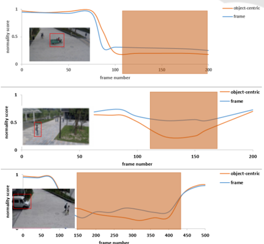

## CLIP: Assisted Video Anomaly Detection

Meng Dong a

School of Electrical and Electronic Engineering, Nanyang Technological University, Singapore

Keywords:

CLIP, Video Anomaly Detection.

Abstract:

As the main application of intelligent monitoring, video anomaly detection in surveillance has been well developed but remains challenging. Various types of anomalies promote the requirements of unique detectors in the general domains, whereas users may need to customize normal and abnormal situations in specific domains in descriptions, such as "pedestrian No entry" or "people fighting". Moreover, anomalies in unseen videos are usually excluded from the training datasets. Conventional techniques based on computer vision or machine learning are typically data-intensive or limited to specific domains. Targeting developing a generalized framework for intelligent monitoring, we introduce generative anomaly descriptions to compensate for the visual branch and bridge the possibilities to adapt specific application domains. In particular, we adopt contrastive language-image pre-training (CLIP) with generative anomaly descriptions as our general anomaly detector. Not as state-of-the-art, category-level anomaly descriptions instead of simple category names will be adopted as language prompts in this work. A temporal module is developed on top of CLIP to capture temporal correlations of anomaly events. Besides the above frame-level anomaly detection, we support the detection of object-centric anomalies for some specific domains. Extensive experiment results show that the novel framework offers state-of-the-art performance on UCF-Crime and ShanghaiTech datasets.

## 1 INTRODUCTION

The concept of automatic video surveillance, which could take over the role of human monitors, has attracted more and more attention accompanied by the popularization of surveillance cameras. Developing highly discriminative anomaly detectors has become a big challenge for Video anomaly detection (VAD) due to the characteristics of surveillance videos. There are unlimited unknown anomaly cases in real-time, 24/7 scenarios. Hopefully, The well-trained models could be updated whenever newly defined or undefined cases emerge. However, each update is on behalf of the cost of frame annotation and obtaining anomaly data.

According to the supervision setting of training datasets, there are commonly three kinds of methods for anomaly detection: One-Class Classification (OCC), weakly supervised, and unsupervised manner. Both hand-crafted features (Medioni et al., 2001; Piciarelli et al., 2008) and deep features extracted using pre-trained models (Ravanbakhsh et al., 2017; Sun and Gong, 2023) have been explored in recent works. However, it will be challenging for OCC ap-

DOI: 10.5220/0012356300003654

proaches to classify the well-reconstructed anomalous testing data since the ineffective classifier boundary may be achieved while training only on normal class data and excluding anomalies. The weakly supervised approaches are proposed to address the above limitations, video-level labeled abnormal data combined with the normal data are used in the training process (Tian et al., 2021; Cho et al., 2023; Zhang et al., 2023). Specifically, a video will be labeled as normal if its contents are normal; otherwise, it will be anomalous. In real applications, it will be impractical to annotate all surveillance videos, specifically for raw footage recorded 24/7 hours. Some work (Zaheer et al., 2022; Tur et al., 2023) explore unsupervised manner on unlabeled training datasets for anomaly detection. Even though impressive success in exploring highly discriminative anomaly boundaries, these works face enormous challenges, such as the rare normal samples in testing data, and specific domain anomalies.

Usually, anomaly events capture the interactions between action/activity and entities over time. The rich prior knowledge of action could imply extra context or semantic information for anomaly detection. Naturally, the prevalent vision-language mod-

els(VLMs), e.g. CLIP model(Radford et al., 2021) and its variations, have attracted our sights. The discriminative visual-language representations also demonstrate success in related tasks, such as video understanding, captioning, and event locations(Wang et al., 2021; Li et al., 2022a; Guzhov et al., 2021; Xu et al., 2021). Recently, (Joo et al., 2022) adopted ViTencoded visual features of CLIP to detect anomalies, without considering the semantic knowledge between vision and language. Language prompts could provide rich and powerful prior knowledge for activity localization, such as objects, humans, and interactions in the scene. However, category labels are usually adopted as language prompts in current CLIP-related works. Simple category names or labels may be insufficient to reveal complex interactions in real-world scenarios. For example, we prefer a comprehensive description such as "a man cruelty against a dog" instead of the single word "Abuse". Furthermore, visual features from CLIP are towards image instead of video, and temporal dynamics over time are usually ignored or not fully explored.

To address the above challenges, we propose a novel framework for general anomaly detection on top of CLIP. Figure 1 (a) depicts the conventional approaches that explore discriminative classifiers or boundaries for extracted representations. (b) shows the standard CLIP. (c) demonstrates our framework based on two developed modules: temporal module and generative anomaly descriptions. In particular, we introduce generative anomaly descriptions instead of labels for the text encoder. Besides, the learnable prompt is adopted for the context of anomaly descriptions (Zhou et al., 2022) for each category. Targeting discriminative representations from spatialtemporal correlation, a temporal module, combined with a local transformer and lightweight GCN, is introduced on top of the visual encoder to capture local and global temporal correlation. To evaluate the proposed temporal module, we further introduce framelevel and original CLIP-based visual representations as the benchmark. To obtain accurate category-level anomaly descriptions, including human-related and non-human-related, ChatGPT (Cha, ), one of the large language models (LLMs), is adopted to generate and leverage the language prompts to the framework. We evaluate our proposed framework on two datasets, the ShanghaiTech (Liu et al., 2018a) and UCFcrime (Sultani et al., 2018). The experiment results show that the temporal module could enhance performance, and the generative anomaly descriptions achieve superior results compared to category-level prompts.

Furthermore, regarding various types of anomalies, frame-level features will fail in complex back- ground scenarios. To reduce this bias(Liu and Ma, 2019), some object-centric approaches(Georgescu et al., 2021b) try to leverage the object's appearance(Georgescu et al., 2021a; Georgescu et al., 2021b; Sabokrou et al., 2017), motion, or skeleton (Li et al., 2022b; Yang et al., 2022)to frame to further improve performance. For each detected object, anomaly detection is proceeded. Once one detected object is abnormal, the whole frame will be determined as abnormal. However, such methods require additional costs for optical flow estimation in the inference process. Addressing the above, we fine-tune our framework as background-agnostic by switching to the object-centric mode from whole frame mode.

This work makes the following contributions. (1) We introduce a novel generalized anomaly detection based on CLIP with proposed generative anomaly descriptions and temporal adapter. It allows userspecific anomaly definitions based on the anomaly descriptions module. (2) We adapt our generalized framework for supporting object-centric anomaly detection to conquer complex background bias. (3) Experiments on two video datasets illustrate the superior performance of our framework.

## 2 RELATED WORK

Both hand-crafted features and deep features extracted using pre-trained models have been explored in recent works. However, it will be challenging for OCC approaches to classify the well-reconstructed anomalous test data since the ineffective classifier boundary may be achieved while training only on normal class data and excluding anomalies. All these works are under the assumption that all or most of the collected training data is normal. However, there are rare normal samples in testing data that will be classified as anomalies. Two common techniques used in anomaly detection: (1) Reconstruction-based, such as autoencoder (AE)(Hasan et al., 2016; Lv et al., 2021), memory-augmented AE(Park et al., 2020), and generative models(Liu et al., 2018a), are used to reconstruct current frame (Ionescu et al., 2019a) or predict future frame, the frame with high reconstruction errors will be detected as anomalies. (2) Distance-based approaches often adopt one-class SVM (Ionescu et al., 2019a; Ionescu et al., 2019b) or Gaussian mixture model (Sabokrou et al., 2017; Li et al., 2015) to compute decision boundary, and anomalies will deviate from normality. Most reconstruction-based or distance-based approaches to learn frame-level features will fail in complex backgrounds. To reduce this bias(Liu and Ma, 2019), some object-centric ap-

Figure 1: Comparison of different frameworks of anomaly detection.

proaches(Georgescu et al., 2021b) try to leverage the object's appearance(Georgescu et al., 2021a), motion, or skeleton (Li et al., 2022b; Yang et al., 2022)to frame to further improve performance. They perform anomaly detection for each detected object from an object detector. When at least one detected object is determined as abnormal, they determine that abnormal situations occur in the frame. However, such methods require additional costs for optical flow estimation in the inference process. Furthermore, it would apply to abnormal situations, such as explosion and arson in the UCFcrime dataset (Sultani et al., 2018). Even though users expect these anomaly detectors to be background-agnostic, there are some scene-dependent anomalies. Novel scene-aware approaches(Bao et al., 2022; Cao et al., 2022), emerge for such cases.

In this work, CLIP-based anomaly detection is the frame-level scheme, we introduce a human-centric skeleton branch to make the framework backgroundagnostic.

## 3 METHOD

The proposed anomaly detector has two branches: visual and text. For the visual branch, visual representations are captured in two ways: frame-level and video-level, with different temporal adapters. For the text branch, we adopt anomaly descriptions instead of category names, and then the learnable prompt is utilized as the context of anomaly descriptions. Furthermore, ChatGPT (Cha, ) is adopted in this work to generate normal and abnormal descriptions for each scenario to cover a wide range of general anomalies.

## 3.1 Generative Anomaly Descriptions

In this branch, anomaly descriptions are not only from the labels of datasets. We adopt the generative anomaly descriptions that could cover a wide range of general anomalies in general and specific scenarios. Furthermore, these descriptions could be comprehensive for the interactions between actions and entities over time and contain rich prior knowledge about the activities in the scene. Therefore, the target of this branch is to provide prior information about anomalies and complement the visual branch for the generalized anomaly detection network that can work on limited data and could be adapted to specific domains by users.

## 3.1.1 Category-Level Anomaly Descriptions

Currently, most public datasets are labeled with a single word to annotate the complex real scenarios. However, there are similarities in some actions/activities across different labels, which lead to class boundaries are not discriminative, such as shoplifting, stealing, and burglary in UCF-Crime (Sultani et al., 2018) dataset, which contains 13 abnormal labels, almost cover most scenarios of the real world. Some of the categories are intuitive, while some are ambiguous. In this work, we substitute some with anomaly descriptions to pursue discriminative boundaries in Table 1.

## 3.1.2 Generative Anomaly Descriptions

ChatGPT, based on models GPT-4, is well-trained on a large scale of texts online, and we assume that the obtained descriptions should be explicit for situations

Table 1: Samples of category-level Anomaly Descriptions.

| Category       | Anomaly Descriptions                                           |
|----------------|----------------------------------------------------------------|
| abuse          | child abuse, elder abuse, or animal cruelty                    |
| arrest         | police arrest                                                  |
| arson          | fire setting                                                   |
| assault        | street violence, bar fights                                    |
| theft          | theft in street, theft in stores, or theft in buildings        |
| road accidents | traffic accidents involving
 vehicles, pedestrians or cyclists |
| vandalism      | break windows, remove or damage road signs                     |

of each typical location, such as normal and abnormal cases. The repetitive and ambiguous descriptions will be filtered to obtain clear, clean, relevant, normal, and abnormal descriptions. Even though the obtained anomaly descriptions are suitable for general domains, they may not be accurate in specific domains. Subsequently, the users can modify relevant anomaly descriptions based on their prior knowledge. For example, the scenarios in UCFcrime (Sultani et al., 2018) could cover and simulate the general domains. But in the specific domain, taking ShanghaiTech (Liu et al., 2018a) for example, there exists an only-walking zone in ShanghaiTech (Liu et al., 2018a)dataset, so the bicycles, vehicles, and running pedestrians will be forbidden while they are normal cases in UCFcrime (Sultani et al., 2018). Table 2 shows some samples for normal and abnormal cases. So, based on generative anomaly descriptions, the users could define their specific anomalies.

## 3.1.3 Learnable Prompts

Usually, categories or descriptions are short words or phrases. They are a bit succinct compared to event captions or sentences for summarization of abnormal events. In this chapter, we adopt learnable prompts(Zhou et al., 2022) to the description embeddings for robust scalability of text encoder. To evaluate the combination of description embedding and learnable prompts, we conduct different settings: the descriptions are transformed by CLIP tokenizer,

<!-- formula-not-decoded -->

where "description" is anomaly description. The class-specific concatenation [learnable prompt][description] and shareable [learnable prompt] for all descriptions as follows:

<!-- formula-not-decoded -->

<!-- formula-not-decoded -->

where {c1 ,..., cl } are learnable prompts, containing l context tokens.

Table 2: Samples on normal/abnormal descriptions generated by ChatGPT.

| Normal                      | Abnormal           |
|-----------------------------|--------------------|
| deliverymen deliveries      | loitering          |
| cleaning crew working       | unruly crowds      |
| walk the dog                | fire               |
| pedestrian crossings        | drug dealing       |
| children playing            | shoplifting        |
| cleaning the sidewalk       | hiding goods       |
| building access             | assault            |
| Person chatting             | fighting           |
| birds flying overhead       | robbery            |
| sunrise                     | accidents          |
| routine patrols             | falling down       |
| animals wandering around    | smoke              |
| walking through the station | hit and run        |
| joggers                     | jaywalking         |
| guest leaving               | vehicle collisions |
| cashier bagging items       | vehicle accidents  |
| cashier scanning            | car theft          |
| restocking shelves          | injuries           |
| running                     | burglary           |
| street performers           | theft              |

Forwarding the prompt t p to text encoder ft(·), we can obtain C classification vector f t k ∈ R d representing the concept for visual part:

<!-- formula-not-decoded -->

## 3.2 Video-Level Visual Features from CLIP

To achieve discriminative visual features, we conduct two visual processes, video-level and frame-level visual features. On top of the ViT encoder f(·) of CLIP, the temporal relationships are challenging for event detection. Given a video, the snippets of T frames of the size H ×W are sampled as input x ∈ R T×3×H×W . The T feature vectors f
i v f
i ∈ R d of each frame x i after f(·) , will be fed into temporal module, where i ∈ {1 , 2 , ··· , T} , d is dimension of the feature vectors.

The temporal module consists of the local transformer and GCN layers, imposed on top of frame-level CLIP features. In particular, frame-level features will be split into equal-length local windows (T frames), and self-attention will be conducted within each window. Furthermore, a lightweight GCN, proven in many anomaly detection works(Wu et al., 2020; Zhong et al., 2019), is introduced after the local transformer to capture global temporal correlations. In such cases, long-range and short-range temporal dependencies in video can be captured. The overall framework of our anomaly detector is shown in Figure 2.

## 3.2.1 Local Transformer Encoder

The T frame-level features f
i v f
i ∈ R d are fed into a local temporal model g(·), consisting of several Transformer encoders, to explore temporal correlations and obtain the visual representation f
l V f
l ∈ R d :

<!-- formula-not-decoded -->

Where, f
0 v f
0 and e represent learnable vectors for the class token and position embedding.

Taking class-specific concatenation of learnable prompt and description as an example, the form of the prompt tk, and feature vector f
k t f
k , the probability of prediction can be obtained as:

<!-- formula-not-decoded -->

where τ is a temperature parameter, cos(· , · ) denotes cosine similarity.

## 3.2.2 Global Temporal Adapter

To model global temporal dependencies of consecutive images, a lightweight GCN, proven in many anomaly detection works(Wu et al., 2020; Zhong et al., 2019), is introduced after the local transformer to capture global temporal correlations. In such cases, long-range and short-range temporal dependencies in video can be explored. Similar to (Wu et al., 2020), we use relative distance and feature similarity to model global temporal dependencies, as follows:

<!-- formula-not-decoded -->

Where Msim and Mdis are the adjacency matrices. f
l V f
l is the video features from the local transformer, W is a weight for transforming feature spaces and can be learnable. Feature similarity is to calculate adjacency matrix and presented as follows,

<!-- formula-not-decoded -->

Position distance captures long-range dependencies and adjacency matrix between i th and j th is calculated as follows:

<!-- formula-not-decoded -->

Where hyperparameter σ controls the influence range of distance relation.

For video-level anomaly confidence, we adopt the alignment map M, which demonstrates the similarity between video features at frame-level and anomaly class embeddings. Following the definition of M, topk similarities are selected and averaged to get the similarity between the video and the current class. Finally, S = {s1 ,..., s m } is obtained to represent the similarity between the video and all anomaly classes. The highest score will pair the video and its class. The prediction of each class j th class is:

<!-- formula-not-decoded -->

Where τ, temperature hyper-parameter, and the loss for alignment Lali can be computed by the cross entropy. Additional contrastive loss is used to push away the embedding of abnormal classes from the normal ones as follows,

<!-- formula-not-decoded -->

where tn tn and ta ta represent embeddings of normal and abnormal classes.

Finally, the total loss for video level is given by:

<!-- formula-not-decoded -->

## 3.3 Frame-Level Visual Features from CLIP

To bridge CLIP to anomaly detection comprehensively, we further conduct frame-level anomaly detection. The generative descriptions from ChatGPT about normal and abnormal cases are fed into the text encoder of CLIP for normalized text features, f
k t f
k
, k = 1 ,..., N, where N is the description number. CLIP "ViT-B/32" is selected in this work, and the image and text features from CLIP, f
i v f
i and f
k t f
k , and the feature dimension is set as 512. Figure 3 depicts the framelevel anomaly detection framework. In particular, we extract the whole frame feature for UCFcrime and ShanghaiTech. Specifically, the object regions from the object detector are additionally adopted and proceed to extract features for the ShanghaiTech dataset for background-agnostic anomaly types. For each normalized image feature f
i v f
i , the cosine similarities

Figure 2: Proposed video-level framework of anomaly detection.

with f
k t f
k are computed. We fine-tune a bit for similarity calculation to adapt VLMs to zero-shot tasks. The trainable parameters are introduced to modify the calculation of similarity in CLIP for the k th text description:

<!-- formula-not-decoded -->

f
i
, f
k f
i f
k , where diagonal matrix Ak ∈ R 512×512 , scalar bk and m is set as 0.01 in this work. Ak and bk can be trained by gradient descent in the total loss function. The initial value of the update for Ak and bk are set to the identity matrix and zero, respectively. For the similarity between two normalized vectors, we use W(· , · ) to represent, then feed to softmax. All the abnormal descriptions will be summed to obtain the frame-level or object-level anomaly score score(x):

<!-- formula-not-decoded -->

where Ca Ca is indices of anomaly description sets. The frame or detected object will be detected as abnormal when the score exceeds the predefined threshold. To explore the temporal correlations of abnormal activities, we further introduce a simple majority voting scheme to assess multiple frames for a more accurate score compared to single frames. We apply InfoNCE loss for CLIP-based method:

<!-- formula-not-decoded -->

where λ j set as the loss weight for each xj . λ j = 1 , T is set as 1, in this work. A simple majority voting method is applied for event classification to explore the temporal relationship between consecutive frames in experiments.

## 4 EXPERIMENT

## 4.1 Datasets

To simulate the proposed anomaly detection in surveillance, we explore two public anomaly datasets UCFcrime and ShanghaiTech datasets, shown in Table 3. Abnormal situations in UCFCrime are captured from various locations and scenarios (abuse, arrest, arson, assault, burglary, explosion, fighting, road accidents, robbery, shooting, shoplifting, stealing, and vandalism). It involves the accidents and crimes that happen frequently in public. Most anomalies of ShanghaiTech are pedestrian-based. It captures 13 different scenes and contains 130 abnormal events with various numbers of people.

## 4.2 Experiment Setting

The frozen encoders of image and text are pre-trained CLIP visual and text, ViT-B/32. σ is set as 1 , τ is set as 0.07, window length in local transformer and GCN is 8. λ in final loss equation is set as 1×10 − 1 . All the works are implemented on an Intel Core i9 CPU, 32 GB of RAM, and NVIDIA GeForce RTX 3060, 24GB VRAM, Pytorch 1.12. Adam optimizer (Kingma and

Figure 3: Proposed frame-level framework of anomaly detection.

Table 3: Summary of anomaly datasets in this work.

| Dataset                          | Description                                 | Video and Duration         | Annotation Types         |
|----------------------------------|---------------------------------------------|----------------------------|--------------------------|
| ShanghaiTech (Liu et al., 2018b) | Person based abnormal
 situations in Campus | 437 videos
 317,398 frames | Frame-level
 Pixel-Level |
| UCF-Crime (Sultani et al., 2018) | 13 categories of
 abnormal situations       | 1,900 videos
 128 hours    | Video-Level              |

Ba, 2014) is used with batch size 64. The learning rate is 1×10 − 5 .

## 4.3 Comparison with State-of-the-Art

To evaluate our proposed framework, several stateof-the-art methods are chosen as references, including weakly supervised, unsupervised, full, and OOC on UCF-Crime and ShanghaiTech, shown in Table 4 and Table 5, respectively. In this work, the final anomaly detection result is calculated similarities between visual and all anomaly text. To compare with conventional classifiers, we set two benchmarks by adopting a CLIP image encoder as a feature extractor and followed with a linear classifier. Furthermore, our temporal module is also added to explore temporal relationships. From the two tables' results, our CLIP-text-based methods outperform the CLIPclassifier-based benchmark on both datasets with 2%, which also proves the effectiveness of compensation of text branch. Besides, CLIP-based features are more discriminative than CID and I3D features with the help of temporal modules on both UCF-Crime and ShanghaiTech datasets, because the latter ones are designed for action recognition tasks. Besides, the complex background also influences the feature extraction. Compared with CLIP-based methods(Joo et al., 2022), our proposed method achieves comparative results on ShanghaiTech dataset. Both the re- sults with the local transformer and GCN outperform with 1% due to the compensation of the text branch on UCFCrime. Furthermore, we also conduct framelevel multi-frame CLIP features to explore temporal dependencies between adjacent frames. Our framebased method is slightly inferior to our video-based method because the simple majority voting scheme still lacks temporal relations. The results demonstrate the effectiveness of the scalability of CLIP in the downstream task, anomaly detection.

## 4.4 Ablation Study

An exhaustive ablation analysis is conducted in this work to evaluate the effectiveness of individual components in our framework. In particular, we first compare the category and proposed anomaly description prompt performance to evaluate the effectiveness of the description prompt, including the comparison of different prompts and different settings for learnable context. Then, a temporal module comparison is also conducted to evaluate.

## 4.4.1 Evaluation of Prompt

Table 6 shows the results of different prompts. The learnable prompt and temporal module are set the same as 8, and local transformer, respectively. In vision language models, the prompt could help to adapt

Table 4: Comparisons with state-of-the-art on UCF-Crime Dataset.

| Supervised Way    | Method                                           | Feature    | AUC(%)      |
|-------------------|--------------------------------------------------|------------|-------------|
| Un                | (Wang and Cherian, 2019) 
 (Zaheer et al., 2022) | I3D        | 70.46       |
|                   | g 
 (Zaheer et al., 2022)                        | ResNext    | 71.04       |
| Fully             | (Liu and Ma, 2019)                               | NLN        | 82.0        |
| OCC               | (Scholkopf et al., 1999) ¨                       | OCCSVM     | 63.2        |
| OCC 
 Weakly      | (Purwanto et al., 2021)                          | TRN        | 85.00
 8448 |
| OCC 
 Weakly      | (Thakare et al., 2022)                           | C3D+I3D    | 84.48       |
| OCC 
 Weakly      | (Zhong et al., 2019)                             | TSN        | 81.08       |
| OCC 
 Weakly      | (Tian et al., 2021)                              | C3D        | 83.28       |
| OCC 
 Weakly      | (Wu et al., 2020)                                | C3D        | 82.44       |
| OCC 
 Weakly      | (Tian et al., 2021)                              | I3D        | 84.30       |
| OCC 
 Weakly      | (Wu and Liu, 2021)                               | I3D        | 84.89       |
| OCC 
 Weakly      | (Joo et al., 2022)                               | CLIP       | 87.58       |
| OCC 
 Weakly      | (Yu et al., 2023)                                | Pose       | 64.63       |
| OCC 
 Weakly      | CLIP+Classifer                                   | CLIP       | 73.17       |
| OCC 
 Weakly      | CLIP+Local+Global +Classifer                     | CLIP       | 86.17       |
| OCC 
 Weakly      | Ours-Video(Local)                                | CLIP       | 88.13       |
| OCC 
 Weakly      | Ours-Video(Local+Global)                         | CLIP       | 88.52       |
| OCC 
 Weakly      | Ours-Frame                                       | CLIP       | 86.62       |

Table 5: Comparisons with state-of-the-art on ShanghaiTech Dataset.

| Supervised Way    | Method                        | Feature    |   AUC(%) |
|-------------------|-------------------------------|------------|----------|
| Un                | (Zaheer et al., 2022)         | ResNext    |    78.93 |
| Weakly            | (Purwanto et al., 2021)       | TRN        |    96.85 |
| Weakly            | (Zhong et al., 2019)          | TSN        |    84.44 |
| Weakly            | (Tian et al., 2021)           | C3D        |    91.57 |
| Weakly            | (Tian et al., 2021)           | I3D        |    97.2  |
| Weakly            | (Wu and Liu, 2021)            | I3D        |    97.48 |
| Weakly            | () 
 (Joo et al., 2022)       | CLIP       |    98.32 |
| Weakly            | () 
 CLIP+Classifer           | CLIP       |    83.21 |
| Weakly            | CLIP+Local+Global +Classifer  | CLIP       |    94.17 |
| Weakly            | Ours-Video(Local)             | CLIP       |    97.31 |
| Weakly            | () 
 Ours-Video(Local+Global) | CLIP       |    98.43 |
| Weakly            | Ours-Frame                    | CLIP       |    95.02 |

VLM to specific tasks. As a baseline, we compare hand-crafted and learnable prompts on two datasets with the same categories. Both could achieve comparative results, and learnable prompts achieve a slightly 0.6% better performance on ShanghaiTech. Further, our description-based prompt also indicates the effectiveness of a learnable prompt with anomaly descriptions compared to category.

## 4.4.2 Evaluation of Variable Length

In this work, we further evaluate the variable lengths for three settings: length of Learnable Prompt, length of Window in local transformer, and depths of transformers. Generally, longer context/prompt length l should lead to better performance (Zhou et al., 2022), and it seems there is a golden role for the optimal context length. The effectiveness of the temporal module has been verified in Table 4 and Table 5. We evaluate to select the optimal depth of transformers. Usually, the temporal dependencies among consecutive frames decrease with the length of the window, especially for datasets annotated at the video level. We conducted three experiments for the analysis. As shown in Table 8, first, we set a certain range (4 to 32) for context length with fixed transformer depth(e.g. as 1) and fixed window length (e.g. 16 frames). The performance gradually improves before 20 and decreases after 24 with more learnable vectors. Considering performance and (Zhou et al., 2022), we select 16 as the optimal context length for two datasets. The AUC decreases even with higher network costs and lower model generation for deeper transformers. And finally, we select 1 layer transformer to model local temporal dependency. From the results, the perfor-

Table 6: Comparisons of Different Prompts.

| Prompt                         | AUC(%)    | AUC(%)       |
|--------------------------------|-----------|--------------|
|                                | UCF-Crime | ShanghaiTech |
| a photo of [Category]          | 87.43     | 96.20        |
| Learnable Prompt+[Category]    | 87.66     | 96.81        |
| Learnable Prompt+[Description] | 88.19     | 97.32        |

Table 7: Performance of our framework on Object-centric and Frame-level.

| Object-Centric Mode      | Object-Centric Mode   | Object-Centric Mode          | Object-Centric Mode       |
|--------------------------|-----------------------|------------------------------|---------------------------|
| Ours                     | Ours                  | (Georgescu et al., 2021b)    | (Georgescu et al., 2021b) |
| CLIP feature calculation | 20.49 ms              | Optical flow calculation     | 57.93 ms                  |
| Similarity calculation   | 0.2 ms                | prediction                   | 4.57 ms                   |
| Total                    | 20.69 ms              | Total                        | 62.5 ms                   |
| ame-based Mode           | ame-based Mode        | ame-based Mode               | ame-based Mode            |
| Ours                     |                       | (Zaheer et al., 2022)        |                           |
| CLIP feature calculation | 4.79 ms               | ResNext feature calculation. | 18.89 ms                  |
| Total                    | 4.98 ms               | Total                        | 19.02 ms                  |
| Total                    | 4.98 ms               | Total                        | 19.02 ms                  |

mance is robust with a range of window lengths (8 to 64), and decrease with longer window. These results also reveal a single local transformer is not very effective for longer video temporal correlations. It is an optimal combination of the local transformer and global temporal adapter. Considering the duration of activity in datasets and introduced GCN in the temporal module, we select an intermediate value(16) for window length in this work.

## 4.4.3 Evaluation of the Position of Learnable Prompt

To evaluate the combination of description and learnable prompts, we conducted two settings: First, class-specific in the form of [Learnable prompt][description](end), each description has its learnable prompt. Second, a shareable form of [learnable prompt] for all descriptions (middle). The results of the two datasets are shown in Table 9, and [Learnable prompt][description] combination achieves better results as class-specific prompt could provide more semantic information compared to shareable context for all classes. The context length set as 16.

## 4.4.4 Evaluation of the Temporal Module

The above results have proven the effectiveness of the temporal module. To further evaluate the local transformer and Global temporal adapter, we conduct the ablation analysis: (1) CLIP without the temporal module, (2)CLIP only with the local transformer, (3) CLIP with a temporal module (Local transformer + Global temporal adapter). From the results in Table 10, the Global temporal adapter, together with the local transformer, could capture robust temporal correlations compared to only the local transformer about 4%, even with a longer window, which has also been proven in Table 8, and is the optimal combination for temporal dependencies.

## 4.5 Object-Centric CLIP Method

As mentioned before, some object-centric approaches(Georgescu et al., 2021b) try to leverage the object's appearance(Georgescu et al., 2021a; Georgescu et al., 2021b; Sabokrou et al., 2017), motion, or skeleton (Li et al., 2022b; Yang et al., 2022) to frame level to further improve performance by removing background bias. In this work, we additionally experiment on ShanghaiTech dataset to evaluate objectcentric performance. The frame will be classified as abnormal when one detected object is abnormal. Figure 4 shows the anomaly scores in object-centric and frame-based CLIP on ShanghaiTech dataset. Objectcentric could get more accurate anomaly scores in periods of abnormal events. Besides, we perform a performance analysis in Table 7. Object-centric and frame-based methods show an efficient inference process. The object-centric method is performed for each object, and we set the maximum is 20 in this work. Both the object-centric and frame-based methods are faster than the baseline, with milliseconds of inference times for each module.

Table 8: Comparisons of Different Variable Length AUC(%).

|   Context Number 
 4  |   Depth of Transformer 
 1  |   Window Length 
 16  |   UCF-Crime 
 84.30  |   ShanghaiTech
 94.00 |
|-----------------------|-----------------------------|-----------------------|----------------------|-----------------------|
|                    8  |                          1  |                   16  |                85.21 |                 95.2  |
|                   16  |                          1  |                   16  |                86    |                 97.02 |
|                   20  |                          1  |                   16  |                86.37 |                 97    |
|                   24  |                          1  |                   16  |                85.52 |                 96.12 |
|                   32  |                          1  |                   16  |                84.31 |                 95.21 |
|                    16 |                          2  |                   16  |                85.82 |                 95.52 |
|                    16 |                          3  |                   16  |                85.5  |                 95.34 |
|                    16 |                          1  |                    8  |                85.3  |                 95.9  |
|                    16 |                          1  |                   32  |                86.56 |                 97    |
|                    16 |                          1  |                   64  |                86.88 |                 97.22 |
|                    16 |                          1  |                  128  |                86.39 |                 96.8  |

Table 9: Comparisons different positions of learnable context.

Table 10: Comparisons Local Transformer and Global temporal adapter.

| Anomaly Description
 Position    | AUC(%)    | AUC(%)       |
|----------------------------------|-----------|--------------|
|                                  | UCF-Crime | ShanghaiTech |
| Middle                           | 87.45     | 96.26        |
| End                              | 88.14     | 97.39        |

Figure 4: Anomaly scores in object-centric and frame-based on ShanghaiTech.

| Method              | AUC(%)    | AUC(%)       |
|---------------------|-----------|--------------|
|                     | UCF-Crime | ShanghaiTech |
| w/o Temporal Module | 84.42     | 92.24        |
| w/o GCN             | 87.28     | 96.45        |
| w Temporal Module   | 88.17     | 97.33        |

## 5 CONCLUSION

In this work, we propose a novel framework for video anomaly detection based on CLIP. A local transformer and global temporal adapter are added to the frame-level features of CLIP to capture temporal dependencies. Furthermore, we present generative anomaly descriptions from ChatGPT to cover all the possible anomalies in general and specific domains. The users can also modify the generative descriptions based on their prior knowledge. Several benchmarks for anomaly detection based on CLIP have been introduced to comprehensively evaluate the proposed generalized framework. The results also demonstrate the robustness and effectiveness of the proposed framework. To remove the background bias effects, we further proceed with the object-centric framework. The results have demonstrated the efficiency on detected regions. However, CLIP-based methods lack temporal dependencies, even with local transformers and global temporal adapter. In the future, we will explore video-level CLIP for potential further performance improvement.

## REFERENCES

Cha-gpt https://chat.openai.com/, march, 2023.

- Bao, Q., Liu, F., Liu, Y., Jiao, L., Liu, X., and Li, L. (2022). Hierarchical scene normality-binding modeling for anomaly detection in surveillance videos. In Proceedings of the 30th ACM International Conference on Multimedia, pages 6103–6112.
- Cao, C., Lu, Y., and Zhang, Y. (2022). Context recovery and knowledge retrieval: A novel two-stream framework for video anomaly detection. arXiv preprint arXiv:2209.02899 .

Cho, M., Kim, M., Hwang, S., Park, C., Lee, K., and

- Lee, S. (2023). Look around for anomalies: Weaklysupervised anomaly detection via context-motion relational learning. In Proceedings of the IEEE/CVF Conference on Computer Vision and Pattern Recognition, pages 12137–12146.
- Georgescu, M.-I., Barbalau, A., Ionescu, R. T., Khan, F. S., Popescu, M., and Shah, M. (2021a). Anomaly detection in video via self-supervised and multi-task learning. In Proceedings of the IEEE/CVF conference on computer vision and pattern recognition, pages 12742–12752.
- Georgescu, M. I., Ionescu, R. T., Khan, F. S., Popescu, M., and Shah, M. (2021b). A background-agnostic framework with adversarial training for abnormal event detection in video. IEEE transactions on pattern analysis and machine intelligence, 44(9):4505–4523.
- Guzhov, A., Raue, F., Hees, J., and Dengel, A. (2021). Audioclip: Extending clip to image, text and audio.
- Hasan, M., Choi, J., Neumann, J., Roy-Chowdhury, A. K., and Davis, L. S. (2016). Learning temporal regularity in video sequences. In Proceedings of the IEEE conference on computer vision and pattern recognition , pages 733–742.
- Ionescu, R. T., Khan, F. S., Georgescu, M.-I., and Shao, L. (2019a). Object-centric auto-encoders and dummy anomalies for abnormal event detection in video. In Proceedings of the IEEE/CVF Conference on Computer Vision and Pattern Recognition, pages 7842– 7851.
- Ionescu, R. T., Smeureanu, S., Popescu, M., and Alexe, B. (2019b). Detecting abnormal events in video using narrowed normality clusters. In 2019 IEEE winter conference on applications of computer vision (WACV), pages 1951–1960. IEEE.
- Joo, H. K., Vo, K., Yamazaki, K., and Le, N. (2022). Cliptsa: Clip-assisted temporal self-attention for weaklysupervised video anomaly detection. arXiv preprint arXiv:2212.05136 .
- Kingma, D. P. and Ba, J. (2014). Adam: A method for stochastic optimization. arXiv preprint arXiv:1412.6980 .
- Li, M., Xu, R., Wang, S., Zhou, L., Lin, X., Zhu, C., Zeng, M., Ji, H., and Chang, S.-F. (2022a). Clip-event: Connecting text and images with event structures. 2022 IEEE/CVF Conference on Computer Vision and Pattern Recognition (CVPR), pages 16399–16408.
- Li, N., Chang, F., and Liu, C. (2022b). A self-trained spatial graph convolutional network for unsupervised humanrelated anomalous event detection in complex scenes. IEEE Transactions on Cognitive and Developmental Systems .
- Li, N., Wu, X., Guo, H., Xu, D., Ou, Y., and Chen, Y.-L. (2015). Anomaly detection in video surveillance via gaussian process. International Journal of Pattern Recognition and Artificial Intelligence , 29(06):1555011.
- Liu, K. and Ma, H. (2019). Exploring background-bias for anomaly detection in surveillance videos. In Proceedings of the 27th ACM International Conference on Multimedia, pages 1490–1499.
- Liu, W., Luo, W., Lian, D., and Gao, S. (2018a). Future frame prediction for anomaly detection–a new baseline. In Proceedings of the IEEE conference on computer vision and pattern recognition, pages 6536– 6545.
- Liu, W., W. Luo, D. L., and Gao, S. (2018b). Future frame prediction for anomaly detection – a new baseline. In 2018 IEEE Conference on Computer Vision and Pattern Recognition (CVPR) .
- Lv, H., Chen, C., Cui, Z., Xu, C., Li, Y., and Yang, J. (2021). Learning normal dynamics in videos with meta prototype network. In Proceedings of the IEEE/CVF conference on computer vision and pattern recognition , pages 15425–15434.
- Medioni, G., Cohen, I., Bremond, F., Hongeng, S., and ´ ´ Nevatia, R. (2001). Event detection and analysis from video streams. IEEE Transactions on pattern analysis and machine intelligence, 23(8):873–889.
- Park, H., Noh, J., and Ham, B. (2020). Learning memoryguided normality for anomaly detection. In Proceedings of the IEEE/CVF conference on computer vision and pattern recognition, pages 14372–14381.
- Piciarelli, C., Micheloni, C., and Foresti, G. L. (2008). Trajectory-based anomalous event detection. IEEE Transactions on Circuits and Systems for video Technology, 18(11):1544–1554.
- Purwanto, D., Chen, Y.-T., and Fang, W.-H. (2021). Dance with self-attention: A new look of conditional random fields on anomaly detection in videos. In Proceedings of the IEEE/CVF International Conference on Computer Vision, pages 173–183.
- Radford, A., Kim, J. W., Hallacy, C., Ramesh, A., Goh, G., Agarwal, S., Sastry, G., Askell, A., Mishkin, P., Clark, J., et al. (2021). Learning transferable visual models from natural language supervision. In International conference on machine learning, pages 8748–8763. PMLR.
- Ravanbakhsh, M., Nabi, M., Sangineto, E., Marcenaro, L., Regazzoni, C., and Sebe, N. (2017). Abnormal event detection in videos using generative adversarial nets. In 2017 IEEE international conference on image processing (ICIP), pages 1577–1581. IEEE.
- Sabokrou, M., Fayyaz, M., Fathy, M., and Klette, R. (2017). Deep-cascade: Cascading 3d deep neural networks for fast anomaly detection and localization in crowded scenes. IEEE Transactions on Image Processing , 26(4):1992–2004.
- Scholkopf, B., Williamson, R. C., Smola, A., Shawe-Taylor, ¨ ¨ J., and Platt, J. (1999). Support vector method for novelty detection. Advances in neural information processing systems, 12.
- Sultani, W., Chen, C., and Shah, M. (2018). Real-world anomaly detection in surveillance videos. In Proceedings of the IEEE conference on computer vision and pattern recognition, pages 6479–6488.
- Sun, S. and Gong, X. (2023). Hierarchical semantic contrast for scene-aware video anomaly detection. In Proceedings of the IEEE/CVF Conference on Computer Vision and Pattern Recognition, pages 22846–22856.

- Thakare, K. V., Sharma, N., Dogra, D. P., Choi, H., and Kim, I.-J. (2022). A multi-stream deep neural network with late fuzzy fusion for real-world anomaly detection. Expert Systems with Applications, 201:117030.
- Tian, Y., Pang, G., Chen, Y., Singh, R., Verjans, J. W., and Carneiro, G. (2021). Weakly-supervised video anomaly detection with robust temporal feature magnitude learning. In Proceedings of the IEEE/CVF international conference on computer vision, pages 4975–4986.
- Tur, A. O., Dall'Asen, N., Beyan, C., and Ricci, E. (2023). Exploring diffusion models for unsupervised video anomaly detection. arXiv preprint arXiv:2304.05841 .
- Wang, J. and Cherian, A. (2019). Gods: Generalized oneclass discriminative subspaces for anomaly detection. In Proceedings of the IEEE/CVF International Conference on Computer Vision, pages 8201–8211.
- Wang, M., Xing, J., and Liu, Y. (2021). Actionclip: A new paradigm for video action recognition. ArXiv , abs/2109.08472.
- Wu, P. and Liu, J. (2021). Learning causal temporal relation and feature discrimination for anomaly detection. IEEE Transactions on Image Processing, 30:3513– 3527.
- Wu, P., Liu, J., Shi, Y., Sun, Y., Shao, F., Wu, Z., and Yang, Z. (2020). Not only look, but also listen: Learning multimodal violence detection under weak supervision. In Computer Vision–ECCV 2020: 16th European Conference, Glasgow, UK, August 23–28, 2020, Proceedings, Part XXX 16, pages 322–339. Springer.
- Xu, H., Ghosh, G., Huang, P.-Y., Okhonko, D., Aghajanyan, A., and Feichtenhofer, F. M. L. Z. C. (2021). Videoclip: Contrastive pre-training for zero-shot video-text understanding. In Conference on Empirical Methods in Natural Language Processing .
- Yang, Y., Fu, Z., and Naqvi, S. M. (2022). A two-stream information fusion approach to abnormal event detection in video. In ICASSP 2022-2022 IEEE International Conference on Acoustics, Speech and Signal Processing (ICASSP), pages 5787–5791. IEEE.
- Yu, S., Zhao, Z., Fang, H., Deng, A., Su, H., Wang, D., Gan, W., Lu, C., and Wu, W. (2023). Regularity learning via explicit distribution modeling for skeletal video anomaly detection. IEEE Transactions on Circuits and Systems for Video Technology .
- Zaheer, M. Z., Mahmood, A., Khan, M. H., Segu, M., Yu, F., and Lee, S.-I. (2022). Generative cooperative learning for unsupervised video anomaly detection. In Proceedings of the IEEE/CVF conference on computer vision and pattern recognition, pages 14744– 14754.
- Zhang, C., Li, G., Qi, Y., Wang, S., Qing, L., Huang, Q., and Yang, M.-H. (2023). Exploiting completeness and uncertainty of pseudo labels for weakly supervised video anomaly detection. In Proceedings of the IEEE/CVF Conference on Computer Vision and Pattern Recognition, pages 16271–16280.
- Zhong, J.-X., Li, N., Kong, W., Liu, S., Li, T. H., and Li, G. (2019). Graph convolutional label noise cleaner: Train a plug-and-play action classifier for anomaly detection. In Proceedings of the IEEE/CVF conference on
- computer vision and pattern recognition, pages 1237– 1246.
- Zhou, K., Yang, J., Loy, C. C., and Liu, Z. (2022). Learning to prompt for vision-language models. International Journal of Computer Vision, 130(9):2337–2348.

