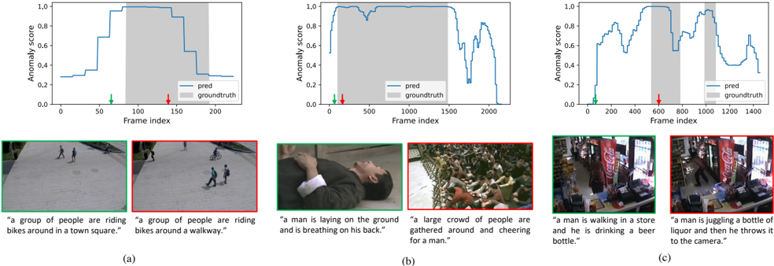

This CVPR workshop paper is the Open Access version, provided by the Computer Vision Foundation.

Except for this watermark, it is identical to the accepted version;

the final published version of the proceedings is available on IEEE Xplore.

## TEVAD: Improved video anomaly detection with captions

## Weiling Chen, Keng Teck Ma, Zi Jian Yew, Minhoe Hur, David Aik-Aun Khoo Hyundai Motor Group Innovation Center in Singapore 2 Bulim Link, Singapore 649674

weiling.chen,kengteck.ma,zijian.yew, david.khoo@hmgics.com

## Abstract

Video surveillance systems are used to enhance the public safety and private assets. Automatic anomaly detection is vital in such surveillance systems to reduce the human labor and its associated costs. Previous works only consider spatial-temporal features. In many complex realworld scenarios, such visual features are unable to capture the semantic meanings required to further improve accuracy. To deal with such issues, we propose a novel framework: Text Empowered Video Anomaly Detection (TEVAD) which utilizes both visual and text features. Text features complements the visual features as they are semantically rich. Specifically, we compute text features based on the captions of the videos to capture the semantic meanings of abnormal events and thus improve the overall performance of video anomaly detection. Extensive experiments demonstrate that our proposed framework achieves state-of-theart results on four benchmark datasets (i.e. ShanghaiTech, UCF-Crime, XD-Violence, and UCSD-Pedestrians) and achieves improved robustness. We further analyze the captions to provide additional explainability for the anomalous videos identified by our proposed algorithm. Our codes are available at https://github.com/coranholmes/ TEVAD .

## 1. Introduction

Video anomaly detection has many practical applications. In manufacturing, it can detect abnormal behavior (e.g. workers tripping) and irregular operations in the production process. In healthcare, intelligent video surveillance systems can reduce the workload of nurses, monitor the conditions of patients and automatically trigger the alarm if an incident occurs to ensure the timely assistance delivered to patients. In public safety domain, anomaly detection can be used to detect illegal behaviors such as fights and shootings to ensure the police officers can be dispatched timely and reduce personal and property losses [2 , 37].

Despite the wide range of application scenarios, video

Figure 1. Our TEVAD first generates dense captions for snippets of a video, before using both visual and text modalities for video anomaly detection. The right side shows the predicted anomaly score and the contributions of each word to the prediction. The use of captions provides explainability to the model: the illustrated video is classified anomalous due to the "skating" action.

anomaly detection is a challenging task because such training data are very unbalanced between positive and negative classes, i.e. there are usually fewer positive examples (abnormal events) than negative examples (regular events). In addition, the large diversity of abnormal events mean that the training set often do not contain every possible type of anomalies, hindering the applicability of traditional supervised learning methods for detecting video anomalies. Furthermore, abnormal events in video are vaguely defined due to their ambiguous nature and may cover a wide variety of human activities. Such typical uncertainties of anomalies further complicate the video anomaly detection tasks.

Since video anomaly detection can be used in many scenarios, there have been many attempts on this research topic. Most of the previous models use the spatial-temporal visual features like Temporal Segment Networks (TSN) [55], 3D ConvNet (C3D) [51] or Inflated 3D ConvNet (I3D) [7] to represent the video frames or snippets and perform the video anomaly detection using these visual features.

However, such methods do not consider the high-level semantic meanings of the videos making it difficult to de-

tect certain abnormal events and generalize the models to complex scenarios. Moreover, the actual detection is done based on the anomaly scores generated by the models which are obscure to the front-end surveillance systems users.

On the other hand, video captioning models are trained in a supervised manner using text-video pairs, and learn symbolic representations (words) that are grounded with the visual elements (e.g. people, objects, actions). Recently, through the use of advanced techniques such as transformer [52], the semantically-rich features can be effectively embedded into video captioning models [30 , 46 , 63]. As a result, such models are able to interpret the input videos with semantically meaningful captions. Such semantic meanings are often absent or extremely difficult to extract solely from the visual features. Inspired by these works, we propose a novel approach to interpret the deep and rich semantic meanings through the use of video-to-text process to improve both accuracy and robustness of weakly supervised video anomaly detection problem.

Specifically, we divide the videos into short snippets and generate the dense captions for these snippets. These features are fused with the visual features to compute the anomaly scores and perform the video anomaly detection. Experimental results show that captions help improve the performance of video anomaly detection. The use of caption has the additional benefit of providing explanability to our model. An example is shown in Figure 1, where high predicted anomaly score of the video snippet is largely due to the "skating" action.

Our contributions of this work are:

- We propose a framework, TEVAD, which exploits both visual and text features for video anomaly detection with different multi-modal fusion methods.
- We extend multi-scale temporal learning to text features to better capture the dependencies between snippet features.
- Our proposed framework outperforms the state-of-thearts (SOTA) methods on four benchmark datasets and achieves improved robustness.
- We further conduct additional analysis to provide explainability for the anomalous videos identified through the use of a word-masking protocol.

## 2. Related work

## 2.1. Image anomaly detection using captions

To the best of our knowledge, we are the first to propose to incorporate captions in video anomaly detection tasks. Nevertheless, a few prior works uses captions to perform image anomaly detection. In one of the works [20], the authors use a DenseCap [23] module to generate the regions of interest and their captions. Image based features are extracted using CNN networks on the detected regions. Caption based features are calculated using Word2Vec [36]. Then they concatenate the embeddings and image based features together and perform unsupervised anomaly detection using clustering. Another work [14] exploits more state-of-the-art CLIP [42] model and performs experiments on CIFAR-10 dataset [27]. For experimental setting, they treat one category as abnormal while the others as normal. Their proposed method basically follows the zero-shot classifier described in the original CLIP paper with limited adaptation. However, the assumption that the normal and abnormal category are well defined is not practical in the real-world scenarios.

## 2.2. Video anomaly detection using visual features

The mainstream methods for anomaly detection in videos can be divided into several categories, depending on the amount of supervision during training.

Earlier efforts focused on the unsupervised learning scenario, where only normal data are available during training. With the emergence of generative models, many approaches proposed such networks to learn the representation of normal data [11 , 19 , 32 , 38 , 40 , 43 , 44 , 53 , 54]. The basic assumption is that such models only learn the normal representation thus would be unable to reconstruct the abnormal data. However, this assumption does not always hold in many scenarios due to the absence of prior knowledge of abnormal data, resulting in inferior performance. To address this issue, some researchers [3 , 17 , 64] proposed to generate the pseudo anomalies and perform pseudo-supervised training on the normal and pseudo abnormal data.

Since then, leveraging some abnormal samples have shown more potential compared to unsupervised learning methods. However, frame level annotations on video datasets are especially expensive. Recently, weakly supervised methods has gradually attracted more attention in terms of video anomaly detection tasks. This is because weakly supervised models can be trained on binary videolevel labels while being able to predict frame-level labels. Most of the weakly supervised methods [8 , 13 , 35 , 39 , 45 , 48 , 50 , 59 , 68] are based on Multiple Instance Learning (MIL) framework. These work mainly propose different aggregation functions to process features or anomaly scores so that video-level labels can be used to indirectly supervise instance-level learning. We design our framework which supports the weakly supervised learning as well.

## 2.3. Video captioning

Video captioning is an important task in video understanding [47]. Several works [12 , 21 , 42 , 49] focused on exploring different 2D/3D video representations to facilitate video captioning tasks. Moreover, many efforts have been made to learn object-level representations [22 , 65 , 66]

Figure 2. The overview of the proposed TEVAD. TEVAD first splits the input video into T snippets and feed them into two individual branches. The text branch computes text features based on generated dense captions of snippets, while the visual branch extracts visual features. Both modality features go through a multi-scale temporal networks before being fused together and passed to a binary classifier that outputs anomaly scores for each video snippet which are then propagated to predict the frame level anomaly scores.

to further improve the performance of video captioning.

More recently, with the success of transformer models [10 , 52] in natural language processing fields, the computer vision community has tried to apply the ideas on different downstream tasks and achieved promising results [5 , 18 , 28 , 29 , 33 , 67]. Specifically, [30 , 46 , 63] have proposed end-to-end vision transformer based models to perform video captioning and achieved significantly improved performance.

## 3. Our method

Figure 2 shows an overview of our Text Empowered Video Anomaly Detection (TEVAD) framework. Given training videos V, TEVAD first splits each input video v ∈ V into T snippets. Afterwards, two separate branches extract visual and text features for each snippet in parallel. The text branch generates dense captions (Section 3.1.1) before transforming them to sentence embeddings (Section 3.1.2), while the visual branch extracts visual I3D [7] features. Multi-scale temporal networks are included in both branches to better capture multi-scale temporal dependencies (Section 3.3). The resulting multi-scale visual F vis ∈ R dvis and text features F txt ∈ R d txt are fused together (Section 3.4), and used to calculate the feature magnitude of snippets. Top-K largest feature magnitudes from normal and abnormal videos are passed to train a binary snippet classifier. During interference phase, the trained snippet classifier is able to predict the snippet level predictions which are propagated to the individual frames within each snippet to obtain frame level predictions (Section 3.5).

## 3.1. Generating text features for videos

## 3.1.1 Generating dense captions for videos

Although there are some research works [26 , 56] featuring generating dense captions for videos, the performance of such models is often not satisfying enough compared to single caption generation models. Particularly, it is challenging for dense caption models to determine the number of "important events" in the video sequences which is essential in video anomaly detection.

In view of this, we propose to use single caption models to generate captions needed for producing text features. To fuse the text features with visual features in the next step, a caption needs to be generated for each snippet. However, each snippet usually only includes too few frames for generating meaningful video captions. To circumvent this problem, we employ a sliding window strategy and compute the caption for a consecutive 64 frames for every 16 frame. Although this sliding window strategy results in redundant information being encoded, it has the advantage of minimizing information loss and preserving important events.

In this work, we use one of the state-of-the-art video captioning model SwinBERT [30] to generate the descriptions of video snippets. Apart from the performance, another reason we choose SwinBERT is that it uses a Video Swin Transformer (VidSwin) [34] to extract visual features instead of I3D features used in the visual branch of TEVAD. The different network architectures encourages the learning of different representations so as to improve the anomaly detection performance.

To generate the captions, we use pre-trained models on several different video captioning datasets (i.e. MSVD [9], VATEX [58] , TVC [29]) instead of training on datasets used for experiments described in Section 4. This is because the anomaly detection datasets do not contain the necessary captions to train the captioning model. As a result, the captions do not always reflect the video contents accurately. Despite this, as we show in the results in Section 4, these inaccurate captions are still highly beneficial for anomaly detection.

## 3.1.2 Generating sentence embeddings for videos

To compute the text features from generated video captions, we use SimCSE [15] to generate sentence embeddings. SimCSE is a framework using contrastive learning methods to learn sentence embeddings by using dropout noises and incorporating annotated pairs from natural language inference datasets. It uses "entailment" pairs as positives and "contradiction" pairs as hard negatives to train the framework and achieves good results.

Notably, the proposed TEVAD framework is quite flexible in terms of each individual component and SimCSE can be replaced by other state-of-the-art sentence embedding models with minimum adaptations.

## 3.2. Generating visual features for videos

In this work, we extract I3D [7] features using a ResNet50 [21] as backbone. Following previous works [13 , 50], we perform ten-crop or five-crop augmentation on datasets to obtain better performance. For five-crop, we crop the given frame into four corners and the central crop. For tencrop, we further include the horizontal flipped version of five-crop.

C3D, TSN or other feature extractors can also be used to replace the I3D feature extractor used in the proposed framework. Previous experiments [8 , 50] show that I3D achieves the best performance among other feature extractors for similar tasks, thus we use I3D features for the following experiments.

## 3.3. Multi-scale temporal feature learning

Multi-scale Temporal Network (MTN) was firstly proposed in [50] to capture the long and short range temporal dependencies between visual features of snippets. In this work, we extend MTN to process the text features and then fuse them with visual features. The performance improves significantly after adding MTN to process text features (see Section 4).

Similar to the visual MTN, the text MTN also includes a 3-layer pyramid dilated convolutions (PDC) [31] block and a non-local block (NLB) [57]. The PDC over time span is used to learn multi-scale representation of video snippets while the NLB is used to learn the global temporal dependencies between video snippets. More details are introduced in Section A of the supplementary materials.

The outputs from the two blocks are concatenated and added to the original features to produce the final output of text MTN denoted as F ¯ txt = fMT N (Ftxt; θ), where F ¯ txt ∈ R d txt and θ comprises the weights for all convolution functions described in this section. Both visual and text features go through the similar process thus we have F ¯ vis = fMT N (Fvis; θ), where F ¯ vis ∈ R dvis . By applying MTN to process both visual and text features, TEVAD

is able to learn the temporal dependencies between video snippets in both modalities.

## 3.4. Multi-modal feature fusion

After obtaining the output from MTN, we employ the late fusion scheme [4] to fuse the features together. We investigate three different fusion methods: concatenation, addition and product. Since visual features are five/tencropped, the text features are tiled for five/ten times to be consistent with visual features.

- (a) concatenation: We direct concatenate F ¯ vis and F ¯ txt given by: X = {F ¯ vis |F ¯ txt } where X ∈ R dvis+d txt .
- (b) addition: We employ an element-wise addition between the visual and text embedding features. However, since d vis &gt; d txt , we add a fully connected layer to reduce the dimension of visual features to the same as the text features and fuse the two by X = fF C (F ¯ vis; δ) + F ¯ txt , where X ∈ R d txt and δ comprises all the weights of the full connected layers described in this section.
- (b) product: We employ a Hadamard product between the visual and text embedding features. Similar to addition, a fully connected layer is added to reduce the dimension of visual features and the fused features are calculated by X = fF C (F ¯ vis; δ) ⊙ F ¯ txt , where X ∈ R d txt .

Overall, we use X = ffuse(F ¯ vis, F ¯ txt; δ) to denote the fused features in the following sections. Three fully connected layers are added to calculate the anomaly scores given by s = fpred(X; δ). Additionally, S = {si} T 1 denotes the anomaly scores of snippets in one video v = {Xi} T 1 .

## 3.5. Model training

During the training phase, the model only has access to video level labels. According to [50], abnormal snippets have larger feature magnitude than normal ones. We follow the same work and use l 2 norm to compute the feature magnitude. topK(v; k) is used to denote such a subset which includes k snippets with the highest magnitude among the T snippets in a video. The feature magnitude of a video v is computed as:

<!-- formula-not-decoded -->

The purpose of training is to maximise the difference between the anomaly score of normal videos and abnormal videos. Thus the total training loss of the normal and abnormal videos in one batch are denoted as:

<!-- formula-not-decoded -->

where c is a pre-defined constant and |V| is the number of videos in the training set.

Similarly, the average of the selected k snippets' anomaly scores is calculated to represent the anomaly score of the whole video as:

<!-- formula-not-decoded -->

For the actual anomaly detection, we train a simple binary classifier by using a binary cross entropy loss:

<!-- formula-not-decoded -->

Overall, the loss function is given as below where α is a hyper-parameter to adjust the weights of the loss components.

<!-- formula-not-decoded -->

## 4. Experimental results

## 4.1. Datasets and evaluation metrics

We present the results of TEVAD on four different datasets, namely UCSD Ped2 [62], ShanghaiTech [32], UCF-Crime [48], and XD-Violence [61]. Among the four datasets, UCF-Crime and XD-Violence are designed for the weakly supervised video anomaly detection task while the other two are originally designed for unsupervised or semisupervised video anomaly detection tasks. More detailed introduction of these datasets are provided in Section B of the supplementary materials.

To evaluate the performance of TEVAD, we consider Area Under the ROC curve (AUC) which is widely used for evaluation in video anomaly detection fields. We adopt the micro-averaged AUC by concatenating all frames then computing the AUC scores on UCF-Crime, ShanghaiTech and UCSD Ped2 datasets. For XD-Violence, since most of the previous work used Average Precision (AP), we use it as the evaluation metric to make the results comparable. Similarly, we adopt the micro-averaged AP by concatenating all frames.

## 4.2. Implementation details

Visual Feature extraction Given a video, we split it into non-overlapping 16-frame snippets. For UCF-Crime, ShanghaiTech and UCSD Ped2 datasets, we use an I3D feature extractor with a ResNet50 backbone pretrained on Kinetic-400 [24] to extract the visual features of snippets with a dimension d vis = 2048 from Mixed-5c layer. We use the I3D features provided by the author of XD-Violence directly with dvis = 1024 .

Text feature extraction We use the default setting for SwinBERT pretrained on VATEX dataset [58] to generate captions. As described in Section 3, the caption of each snippet is generated based on the current and the following three snippets with a total number of 64 frames. To extract the sentence embeddings of the captions, we use the default setting of supervised SimCSE pretrained on bert-baseuncased. The dimension of text features for each snippet is d txt = 768 .

Multi-scale temporal feature learning For 3-layer pyramid dilated convolutions in MTN, we set the dilation parameter as 1,2,4 respectively following [50]. We set α = 0 . 0001 in Equation (5).

Training details We train our model on a single V100 GPU using Pytorch [41]. The model is trained with a batch size of 64 using an Adam [25] optimiser with a learning rate of 0.001 and weight decay of 0.005.

## 4.3. Results on benchmark datasets

We divide previous models or frameworks for video anomaly detection into supervised and unsupervised methods and show the results from Tabs. 1 to 4. For comparisons, we use the published results of other methods.

Table 1. Frame-level AUC results on UCSD Ped2 dataset.

| Type    | Source                                                    | Method                                                          | AUC (%)           |
|---------|-----------------------------------------------------------|-----------------------------------------------------------------|-------------------|
| Unsup   | Source 
 CVPR’18 
 WACV’22 
 CVPR’21 
 CVPR’20 
 TPAMI’21 | AU
 32] 95
 40] 96
 6] 97
 11] 97
 et al. [17] 98
 maly [68] 93 | Unsup
 C
 W
 C
 C |
| Unsup   | WACV’22                                                   | FastAno [40]                                                    | 96.3              |
| Unsup   | CVPR’21                                                   | SSMTL [16]                                                      | 97.5              |
| Unsup   | CVPR’20                                                   | CL-VAD [11]                                                     | 97.8              |
| Unsup   | TPAMI’21                                                  | Georgescu et al. [17]                                           | 98.7              |
| Sup     | CVPR’19                                                   | 93.2                                                            | 98.7              |
| Sup     | CVPR’18                                                   | Sultani et al. [48]                                             | 92.3              |
| Sup     | ICCV’21                                                   | RTFM [50]                                                       | 98.6              |
| Sup     | –                                                         | TEVAD                                                           | 98.7              |

Results on UCSD Ped2: The frame-level micro AUC results on UCSD Ped2 dataset are presented in Tab. 1. This dataset is relatively old and small-scaled thus over studied. Nevertheless, our proposed model still performs best compared to the SOTA unsupervised and supervised methods.

Results on ShanghaiTech: The frame-level micro AUC results on ShanghaiTech dataset are presented in Tab. 2 . This dataset has been well studied but our proposed framework managed to outperform the SOTA unsupervised methods and supervised methods by a minimum of 14.9% and 1.2% respectively. [17] achieves similar performance as ours on this dataset but much worse on UCF-Crime dataset which indicates that their method can perform well on detecting anomalies in daily settings but is not adaptive in terms of detecting rarer anomalies like crime related events.

| Type    | Source                       | Method                                                        |   AUC (%) |
|---------|------------------------------|---------------------------------------------------------------|-----------|
| Unsup   | CVPR’20 
 TPAMI’21 
 CVPR’22 | CL-VAD [11] 
 Georgescu et al. [17] 
 SSPCAB [43] 
 SSMTL [1] |      71.6 |
| Unsup   | TPAMI’21                     | Georgescu et al. [17]                                         |      82.7 |
| Unsup   | CVPR’22                      | SSPCAB [43]                                                   |      83.6 |
| Unsup   | CVPR’22                      | SSMTL [1]                                                     |      83.7 |
| Sup     | CVPR 2019                    | GCN-Anomaly [68]                                              |      84.4 |
| Sup     | ICME’20                      | AR-Net [53]                                                   |      91.2 |
| Sup     | IEEE Trans Multimedia’21     | Chang et al. [8]                                              |      92.3 |
| Sup     | CVPR’21                      | MIST [13]                                                     |      94.8 |
| Sup     | CVPR’22                      | BN-SVP [45]                                                   |      96   |
| Sup     | ICCV’21                      | RTFM [50]                                                     |      97.2 |
| Sup     | TIP’21                       | Wu et al. [59]                                                |      97.5 |
| Sup     | –                            | TEVAD                                                         |      98.1 |
| Sup     | –                            | TEVAD                                                         |      98.1 |

Table 2. Frame-level AUC results on ShanghaiTech dataset.

Table 3. Frame-level AUC results on UCF-Crime dataset.

| Type    | Source                   | Method              |   AUC (%) |
|---------|--------------------------|---------------------|-----------|
| Unsup   | ICCV’19                  | BODS [54]           |      68.3 |
| Unsup   | ICCV’19                  | GODS [54]           |      70.5 |
| Unsup   | Patter Recog’20          | FSCN [60]           |      70.6 |
| Sup     | CVPR’18                  | Sultani et al. [48] |      75.4 |
| Sup     | CVPR’19                  | GCN-Anomaly [68]    |      82.1 |
| Sup     | CVPR’21                  | MIST [13]           |      82.3 |
| Sup     | CVPR’22                  | BN-SVP [45]         |      83.4 |
| Sup     | ICCV’21                  | RTFM [50]           |      84.3 |
| Sup     | IEEE Trans Multimedia’21 | Chang et al. [8]    |      84.6 |
| Sup     | TIP’21                   | Wu et al. [59]      |      84.9 |
| Sup     | –                        | TEVAD               |      84.9 |

Table 4. Frame-level AP results on XD-Violence dataset.

| Type    | Source                   | Method              |   AP (%) |
|---------|--------------------------|---------------------|----------|
| Sup     | arXiv’22                 | CSL-TAL [39]        |     71.7 |
| Sup     | CVPR’18                  | Sultani et al. [48] |     75.7 |
| Sup     | TIP’21                   | Wu et al. [59]      |     75.9 |
| Sup     | IEEE Trans Multimedia’21 | Chang et al. [8]    |     76.9 |
| Sup     | ICCV’21                  | RTFM [50]           |     77.8 |
| Sup     | –                        | TEVAD               |     79.8 |

Results on UCF-Crime: The frame-level micro AUC results on UCF-Crime dataset are presented in Tab. 3. This dataset was first designed for weakly supervised anomaly detection tasks thus there are fewer unsupervised solutions. Our proposed method outperforms all unsupervised methods by a minimum of 14.3% in AUC. In terms of supervised methods, our results are slightly better if we consider two decimal digits compared to the second last model [59] and outperforms their model in all other datasets.

Results on XD-Violence: The frame-level micro AUC results on XD-Violence dataset are presented in Tab. 4 . Since this is a relatively new dataset released in 2020 with limited recent works focusing on unsupervised learning, we list only supervised methods here for comparisons. Notably, XD-Violence is an audiovisual dataset which includes both visual and audio modalities. Since we only use the visual information for video anomaly detection, for a fair comparison, we include methods which use visual features only. Comparing to other supervised methods with similar setting, our method is 2% better than the second best work [50] and more than 4% better than the other work [39 , 48 , 59].

To summarize, our proposed TEVAD framework consistently outperforms the SOTA methods on four benchmark datasets in video anomaly detection field. This demonstrates the proposed framework can be generalized well to different background scenes.

## 4.4. Ablation studies

## 4.4.1 Effectiveness of main components

We perform an ablation study on different datasets to demonstrate the effectiveness of the main components in TEVAD and the results are shown in percentage format in Tab. 5. To be consistent, we show the AUC results for UCSD Ped2, ShanghaiTech and UCF-Crime dataset and AP results for XD-Violence dataset. It can be observed from the table that all four datasets show a consistent improvement in performance by adding text features. In addition, the performance can be further boosted if the text features are processed using MTN. To sum up, TEVAD's performance increases by 14.88%, 3.93%, 1.8% and 2.82% on UCSD Ped2, ShanghaiTech, UCF-Crime and XD-Violence datasets respectively compared to using visual features alone.

## 4.4.2 Impact of captions quality

Since the anomaly detection datasets do not contain the necessary captions to train the captioning model, we use the pre-trained models trained on other video captioning datasets. To understand the impact of different pretrained models (i.e. caption quality), we perform additional experiments on UCF-Crime dataset as it is the most challenging.

It can be observed from Tab. 6 that VATEX pre-trained models perform better than the other two. These results are intuitive as MSVD [9] is a relatively small video captioning dataset and does not contain enough crime or violence related video content. In addition, although TVC [29] is relatively large, videos in this dataset are collected from TV programs and are significantly different from the surveillance contexts in crime dataset. On the other hand, VATEX contains a large number of videos covering 600 human activities which follows the Kinetics-600 [6] taxonomy. Hu-

| Visual    | Text    | Fusion    |   Ped2 (%)  |   Shanghai (%)  |   Crime (%)  |   Violence (%) |
|-----------|---------|-----------|-------------|-----------------|--------------|----------------|
| ✓         | ×       | ×         |       83.81 |           94.17 |        83.1  |          76.94 |
| ✓         | Vanilla | concat    |       93.17 |           97.85 |        83.18 |          77.91 |
| ✓         | MTN     | concat    |       96.71 |           97.86 |        84.9  |          79.3  |
| ✓         | MTN     | add       |       98.69 |           98.1  |        84.13 |          79.76 |
| ✓         | MTN     | product   |       94.12 |           97.2  |        83.83 |          78.49 |

Table 5. Ablation study results.

Figure 3. Example results from (a) ShanghaiTech (riding a bike), (b) XD-Violence (riot) , and (c) UCF-Crime (vandalism) datasets. The top row shows predicted anomaly scores and the groundtruth labels. For frames labeled with green or red arrows, we also show the image frames and their associated generated captions in the bottom row.

Table 6. Experimental results using different SwinBERT pretrained models.

| Fusion    | Pre-trained    |   AUC (%) |
|-----------|----------------|-----------|
| add       | MSVD           |      82.9 |
| concat    | MSVD           |      83.8 |
| add       | TVC            |      82.3 |
| concat    | TVC            |      82.6 |
| add       | VATEX          |      84.1 |
| concat    | VATEX          |      84.9 |

man activities cover punching person (boxing), slapping, sword fighting, lighting fire etc. are highly possible to be relevant to crimes or violence. Such findings demonstrate that better captions results help improve the overall video anomaly detection results.

## 4.5. Robustness comparisons

Another advantage of TEVAD is that it is more robust by considering both visual and text modalities. We run 1,000 epochs for both RTFM and our method and evaluate every 5 epochs after training for 50 epochs. The standard deviations of AUC/AP are presented in Tab. 7 .

It can be concluded from the experimental results that multi-modality features help improve the robustness of the model. TEVAD shows a more robust results on Ped2, ShanghaiTech and Crime datasets when the text features are added. In addition, the framework achieves the lowest standard deviation in terms of AUC/AP on all four datasets when MTN is applied to process the text features.

## 4.6. Qualitative analysis

We provide some qualitative results from different datasets in Figure 3. In terms of anomaly scores, our TEVAD can effectively predict a small score for normal snippets and a large score for abnormal snippets regardless of the different background scenes and the types of abnormal events. Additionally, our model is able to detect multiple abnormal events (Figure 3 (c)), which makes it applicable to real-world scenarios. Moreover, the margins between normal and abnormal snippets are relatively clear.

In terms of the usability (i.e. quality of generated captions), TEVAD works well on ShanghaiTech dataset which manly contains day to day activities and can effectively capture the main abnormal event like "riding bikes" (Figure 3 (a)). Figure 3 (b) and (c) present more challenging videos

Table 7. Robustness of using both modality features.

| Visual    | Text    | Fusion    |   Ped2 (%)  |   Shanghai (%)  |   Crime (%)  |   Violence (%) |
|-----------|---------|-----------|-------------|-----------------|--------------|----------------|
| ✓         | ×       | ×         |       14.77 |            3.18 |         1.98 |           4.63 |
| ✓         | Vanilla | concat    |        7.4  |            1.62 |         1.86 |           4.96 |
| ✓         | MTN     | concat    |        3.43 |            1.33 |         1.75 |           6.92 |
| ✓         | MTN     | add       |        5.83 |            1.61 |         1.48 |           4.27 |
| ✓         | MTN     | product   |        4.62 |            2.09 |         1.62 |           4.67 |

Figure 4. Example results from (a) ShanghaiTech (riding a bike), (c) XD-Violence (shooting), and (b) UCF-Crime (arrest) datasets showing the contribution of each word in the caption to the snippet anomaly score. An image frame of the abnormal event from the snippet is also shown on the right of each caption.

which includes the abnormal event of "riot" and "vandalism" respectively. Notably, though the VATEX dataset used for training the captioning models does not explicitly include such activities, the generated captions capture the similar semantic meaning in the embedding space. For example, "a large crowd of people are gathered" is possibly related to riot while "throws it to the camera" indicates potential vandalism.

## 4.7. Explainability analysis

Although the generated captions may not be completely accurate in some cases, we conduct additional analysis to demonstrate the explainability of incorporating captions for video anomaly detection tasks. During the inference phase, we iteratively mask each word in the caption of the snippet and calculate the sentence embeddings (i.e. text features) based on the masked captions. The text features are then fused with the visual features and fed into the trained model to predict the anomaly scores for each snippet of the video.

Figure 4 shows the explainability results to understand the contribution of each word in captions of the snippets. The score above each word in the caption is the difference between the anomaly score by masking this word and the original anomaly score without masking. Therefore, a higher score indicates a higher contribution to the predicted anomaly score.

Figure 4 (a) shows the caption and an image of a video snippet from ShanghaiTech dataset. This snippet contains an abnormal event of "riding a bicycle". Consequently, the word "bikes" contributes the most for identifying this anomalous event comparing to other words in the caption. Similarly in Figure 4 (b), the word "gun" contributes most for identifying the "shooting" scene in this snippet. On the other hand, Figure 4 (c) shows an inaccurate caption for a snippet related to an "arrest" scene from crime dataset. Regardless of the inaccuracy of the caption, the word "fall" which is possibily related to the "arrest" action contributes significantly for identifying the anomalous event.

The observations described in this section and previous Section 4.6 provides the insights that the performance of TEVAD framework can potentially be further improved if some captions of the video anomaly detection datasets are available.

## 5. Conclusions

Video anomaly detection is a critical yet challenging task in many real-world scenarios. Most of previous works only consider using spatial-temporal visual features to perform video anomaly detection and fail to capture the semantic meaning of complex anomalies in real world contexts. In this work, we have proposed a weakly supervised framework called TEVAD which uses both visual and text modality features to perform video anomaly detection tasks. We extend MTN to process sentence embeddings of captions to learn the dependencies between snippets and further improve the performance. In addition, the generated captions provide explainable results to the surveillance end users. Our proposed TEVAD framework achieves SOTA performance on four different benchmark datasets.

## References

- [1] Andra Acsintoae, Andrei Florescu, Mariana-Iuliana Georgescu, Tudor Mare, Paul Sumedrea, Radu Tudor Ionescu, Fahad Shahbaz Khan, and Mubarak Shah. Ubnormal: New benchmark for supervised open-set video anomaly detection. In Proceedings of the IEEE/CVF Conference on Computer Vision and Pattern Recognition , pages 20143–20153, 2022. 6
- [2] S Anoopa and A Salim. Survey on anomaly detection in surveillance videos. Materials Today: Proceedings, 2022. 1
- [3] Marcella Astrid, Muhammad Zaigham Zaheer, Jae-Yeong Lee, and Seung-Ik Lee. Learning not to reconstruct anomalies. 2021. 2
- [4] Souhail Bakkali, Zuheng Ming, Mickael Coustaty, and ¨ ¨ Marc¸al Rusinol. Visual and textual deep feature fusion ˜ ˜ for document image classification. In Proceedings of the IEEE/CVF Conference on Computer Vision and Pattern Recognition Workshops, pages 562–563, 2020. 4
- [5] Nicolas Carion, Francisco Massa, Gabriel Synnaeve, Nicolas Usunier, Alexander Kirillov, and Sergey Zagoruyko. End-toend object detection with transformers. In European conference on computer vision, pages 213–229. Springer, 2020. 3
- [6] Joao Carreira, Eric Noland, Andras Banki-Horvath, Chloe Hillier, and Andrew Zisserman. A short note about kinetics600. arXiv preprint arXiv:1808.01340, 2018. 6
- [7] Joao Carreira and Andrew Zisserman. Quo vadis, action recognition? a new model and the kinetics dataset. In proceedings of the IEEE Conference on Computer Vision and Pattern Recognition, pages 6299–6308, 2017. 1 , 3 , 4
- [8] Shuning Chang, Yanchao Li, Shengmei Shen, Jiashi Feng, and Zhiying Zhou. Contrastive attention for video anomaly detection. IEEE Transactions on Multimedia, 24:4067–4076, 2021. 2 , 4 , 6
- [9] David Chen and William B Dolan. Collecting highly parallel data for paraphrase evaluation. In Proceedings of the 49th annual meeting of the association for computational linguistics: human language technologies, pages 190–200, 2011. 3 , 6
- [10] Jacob Devlin, Ming-Wei Chang, Kenton Lee, and Kristina Toutanova. Bert: Pre-training of deep bidirectional transformers for language understanding. arXiv preprint arXiv:1810.04805, 2018. 3
- [11] Keval Doshi and Yasin Yilmaz. Continual learning for anomaly detection in surveillance videos. In Proceedings of the IEEE/CVF conference on computer vision and pattern recognition workshops, pages 254–255, 2020. 2 , 5 , 6
- [12] Christoph Feichtenhofer, Haoqi Fan, Jitendra Malik, and Kaiming He. Slowfast networks for video recognition. In Proceedings of the IEEE/CVF international conference on computer vision, pages 6202–6211, 2019. 2
- [13] Jia-Chang Feng, Fa-Ting Hong, and Wei-Shi Zheng. Mist: Multiple instance self-training framework for video anomaly detection. In Proceedings of the IEEE/CVF conference on computer vision and pattern recognition, pages 14009– 14018, 2021. 2 , 4 , 6
- [14] William Gan. Language guided out-of-distribution detection. 2021. 2
- [15] Tianyu Gao, Xingcheng Yao, and Danqi Chen. Simcse: Simple contrastive learning of sentence embeddings. arXiv preprint arXiv:2104.08821, 2021. 4
- [16] Mariana-Iuliana Georgescu, Antonio Barbalau, Radu Tudor Ionescu, Fahad Shahbaz Khan, Marius Popescu, and Mubarak Shah. Anomaly detection in video via selfsupervised and multi-task learning. In Proceedings of the IEEE/CVF conference on computer vision and pattern recognition, pages 12742–12752, 2021. 5
- [17] Mariana Iuliana Georgescu, Radu Tudor Ionescu, Fahad Shahbaz Khan, Marius Popescu, and Mubarak Shah. A background-agnostic framework with adversarial training for abnormal event detection in video. IEEE Transactions on Pattern Analysis and Machine Intelligence, 44(9):4505– 4523, 2021. 2 , 5 , 6
- [18] Rohit Girdhar, Joao Carreira, Carl Doersch, and Andrew Zisserman. Video action transformer network. In Proceedings of the IEEE/CVF conference on computer vision and pattern recognition, pages 244–253, 2019. 3
- [19] Dong Gong, Lingqiao Liu, Vuong Le, Budhaditya Saha, Moussa Reda Mansour, Svetha Venkatesh, and Anton van den Hengel. Memorizing normality to detect anomaly: Memory-augmented deep autoencoder for unsupervised anomaly detection. In Proceedings of the IEEE/CVF International Conference on Computer Vision, pages 1705–1714, 2019. 2
- [20] Yusuke Hatae, Qingpu Yang, Muhammad Fikko Fadjrimiratno, Yuanyuan Li, Tetsu Matsukawa, and Einoshin Suzuki. Detecting anomalous regions from an image based on deep captioning. In VISIGRAPP (5: VISAPP), pages 326–335, 2020. 2
- [21] Kaiming He, Xiangyu Zhang, Shaoqing Ren, and Jian Sun. Deep residual learning for image recognition. In Proceedings of the IEEE conference on computer vision and pattern recognition, pages 770–778, 2016. 2 , 4
- [22] Yaosi Hu, Zhenzhong Chen, Zheng-Jun Zha, and Feng Wu. Hierarchical global-local temporal modeling for video captioning. In Proceedings of the 27th ACM International Conference on Multimedia, pages 774–783, 2019. 2
- [23] Justin Johnson, Andrej Karpathy, and Li Fei-Fei. Densecap: Fully convolutional localization networks for dense captioning. In Proceedings of the IEEE conference on computer vision and pattern recognition, pages 4565–4574, 2016. 2
- [24] Will Kay, Joao Carreira, Karen Simonyan, Brian Zhang, Chloe Hillier, Sudheendra Vijayanarasimhan, Fabio Viola, Tim Green, Trevor Back, Paul Natsev, et al. The kinetics human action video dataset. arXiv preprint arXiv:1705.06950 , 2017. 5
- [25] Diederik P Kingma and Jimmy Ba. Adam: A method for stochastic optimization. arXiv preprint arXiv:1412.6980 , 2014. 5
- [26] Ranjay Krishna, Kenji Hata, Frederic Ren, Li Fei-Fei, and Juan Carlos Niebles. Dense-captioning events in videos. In Proceedings of the IEEE international conference on computer vision, pages 706–715, 2017. 3
- [27] Alex Krizhevsky, Geoffrey Hinton, et al. Learning multiple layers of features from tiny images. 2009. 2

- [28] Jie Lei, Licheng Yu, Mohit Bansal, and Tamara L Berg. Tvqa: Localized, compositional video question answering. arXiv preprint arXiv:1809.01696, 2018. 3
- [29] Jie Lei, Licheng Yu, Tamara L Berg, and Mohit Bansal. Tvr: A large-scale dataset for video-subtitle moment retrieval. In European Conference on Computer Vision, pages 447–463. Springer, 2020. 3 , 6
- [30] Kevin Lin, Linjie Li, Chung-Ching Lin, Faisal Ahmed, Zhe Gan, Zicheng Liu, Yumao Lu, and Lijuan Wang. Swinbert: End-to-end transformers with sparse attention for video captioning. In Proceedings of the IEEE/CVF Conference on Computer Vision and Pattern Recognition, pages 17949– 17958, 2022. 2 , 3
- [31] Chenyang Liu, Xiangyu Xu, and Yujin Zhang. Temporal attention network for action proposal. In 2018 25th IEEE International Conference on Image Processing (ICIP), pages 2281–2285. IEEE, 2018. 4
- [32] Wen Liu, Weixin Luo, Dongze Lian, and Shenghua Gao. Future frame prediction for anomaly detection–a new baseline. In Proceedings of the IEEE conference on computer vision and pattern recognition, pages 6536–6545, 2018. 2 , 5
- [33] Ze Liu, Yutong Lin, Yue Cao, Han Hu, Yixuan Wei, Zheng Zhang, Stephen Lin, and Baining Guo. Swin transformer: Hierarchical vision transformer using shifted windows. In Proceedings of the IEEE/CVF International Conference on Computer Vision, pages 10012–10022, 2021. 3
- [34] Ze Liu, Jia Ning, Yue Cao, Yixuan Wei, Zheng Zhang, Stephen Lin, and Han Hu. Video swin transformer. In Proceedings of the IEEE/CVF Conference on Computer Vision and Pattern Recognition, pages 3202–3211, 2022. 3
- [35] Hui Lv, Chuanwei Zhou, Zhen Cui, Chunyan Xu, Yong Li, and Jian Yang. Localizing anomalies from weakly-labeled videos. IEEE transactions on image processing, 30:4505– 4515, 2021. 2
- [36] Tomas Mikolov, Kai Chen, Greg Corrado, and Jeffrey Dean. Efficient estimation of word representations in vector space. arXiv preprint arXiv:1301.3781, 2013. 2
- [37] Rashmiranjan Nayak, Umesh Chandra Pati, and Santos Kumar Das. A comprehensive review on deep learning-based methods for video anomaly detection. Image and Vision Computing, 106:104078, 2021. 1
- [38] Trong-Nguyen Nguyen and Jean Meunier. Anomaly detection in video sequence with appearance-motion correspondence. In Proceedings of the IEEE/CVF international conference on computer vision, pages 1273–1283, 2019. 2
- [39] Aniello Panariello, Angelo Porrello, Simone Calderara, and Rita Cucchiara. Consistency-based self-supervised learning for temporal anomaly localization. arXiv preprint arXiv:2208.05251, 2022. 2 , 6
- [40] Chaewon Park, MyeongAh Cho, Minhyeok Lee, and Sangyoun Lee. Fastano: Fast anomaly detection via spatiotemporal patch transformation. In Proceedings of the IEEE/CVF Winter Conference on Applications of Computer Vision, pages 2249–2259, 2022. 2 , 5
- [41] Adam Paszke, Sam Gross, Francisco Massa, Adam Lerer, James Bradbury, Gregory Chanan, Trevor Killeen, Zeming Lin, Natalia Gimelshein, Luca Antiga, et al. Pytorch: An im-

perative style, high-performance deep learning library. Advances in neural information processing systems, 32, 2019. 5

- [42] Alec Radford, Jong Wook Kim, Chris Hallacy, Aditya Ramesh, Gabriel Goh, Sandhini Agarwal, Girish Sastry, Amanda Askell, Pamela Mishkin, Jack Clark, et al. Learning transferable visual models from natural language supervision. In International Conference on Machine Learning , pages 8748–8763. PMLR, 2021. 2
- [43] Nicolae-Cat˘ ˘ alin Ristea, Neelu Madan, Radu Tudor Ionescu, ˘ ˘ Kamal Nasrollahi, Fahad Shahbaz Khan, Thomas B Moeslund, and Mubarak Shah. Self-supervised predictive convolutional attentive block for anomaly detection. In Proceedings of the IEEE/CVF Conference on Computer Vision and Pattern Recognition, pages 13576–13586, 2022. 2 , 6
- [44] Mohammad Sabokrou, Mahmood Fathy, Guoying Zhao, and Ehsan Adeli. Deep end-to-end one-class classifier. IEEE transactions on neural networks and learning systems , 32(2):675–684, 2020. 2
- [45] Hitesh Sapkota and Qi Yu. Bayesian nonparametric submodular video partition for robust anomaly detection. In Proceedings of the IEEE/CVF Conference on Computer Vision and Pattern Recognition, pages 3212–3221, 2022. 2 , 6
- [46] Paul Hongsuck Seo, Arsha Nagrani, Anurag Arnab, and Cordelia Schmid. End-to-end generative pretraining for multimodal video captioning. In Proceedings of the IEEE/CVF Conference on Computer Vision and Pattern Recognition , pages 17959–17968, 2022. 2 , 3
- [47] Vijeta Sharma, Manjari Gupta, Ajai Kumar, and Deepti Mishra. Video processing using deep learning techniques: A systematic literature review. IEEE Access, 2021. 2
- [48] Waqas Sultani, Chen Chen, and Mubarak Shah. Real-world anomaly detection in surveillance videos. In Proceedings of the IEEE conference on computer vision and pattern recognition, pages 6479–6488, 2018. 2 , 5 , 6
- [49] Christian Szegedy, Sergey Ioffe, Vincent Vanhoucke, and Alexander A Alemi. Inception-v4, inception-resnet and the impact of residual connections on learning. In Thirty-first AAAI conference on artificial intelligence, 2017. 2
- [50] Yu Tian, Guansong Pang, Yuanhong Chen, Rajvinder Singh, Johan W Verjans, and Gustavo Carneiro. Weakly-supervised video anomaly detection with robust temporal feature magnitude learning. In Proceedings of the IEEE/CVF International Conference on Computer Vision, pages 4975–4986, 2021. 2 , 4 , 5 , 6
- [51] Du Tran, Lubomir Bourdev, Rob Fergus, Lorenzo Torresani, and Manohar Paluri. Learning spatiotemporal features with 3d convolutional networks. In Proceedings of the IEEE international conference on computer vision, pages 4489–4497, 2015. 1
- [52] Ashish Vaswani, Noam Shazeer, Niki Parmar, Jakob Uszkoreit, Llion Jones, Aidan N Gomez, Łukasz Kaiser, and Illia Polosukhin. Attention is all you need. Advances in neural information processing systems, 30, 2017. 2 , 3
- [53] Boyang Wan, Yuming Fang, Xue Xia, and Jiajie Mei. Weakly supervised video anomaly detection via centerguided discriminative learning. In 2020 IEEE International

- Conference on Multimedia and Expo (ICME), pages 1–6. IEEE, 2020. 6
- [54] Jue Wang and Anoop Cherian. Gods: Generalized one-class discriminative subspaces for anomaly detection. In Proceedings of the IEEE/CVF International Conference on Computer Vision, pages 8201–8211, 2019. 2 , 6
- [55] Limin Wang, Yuanjun Xiong, Zhe Wang, Yu Qiao, Dahua Lin, Xiaoou Tang, and Luc Van Gool. Temporal segment networks: Towards good practices for deep action recognition. In European conference on computer vision, pages 20–36. Springer, 2016. 1
- [56] Teng Wang, Ruimao Zhang, Zhichao Lu, Feng Zheng, Ran Cheng, and Ping Luo. End-to-end dense video captioning with parallel decoding. In Proceedings of the IEEE/CVF International Conference on Computer Vision, pages 6847– 6857, 2021. 3
- [57] Xiaolong Wang, Ross Girshick, Abhinav Gupta, and Kaiming He. Non-local neural networks. In Proceedings of the IEEE conference on computer vision and pattern recognition, pages 7794–7803, 2018. 4
- [58] Xin Wang, Jiawei Wu, Junkun Chen, Lei Li, Yuan-Fang Wang, and William Yang Wang. Vatex: A large-scale, highquality multilingual dataset for video-and-language research. In Proceedings of the IEEE/CVF International Conference on Computer Vision, pages 4581–4591, 2019. 3 , 5
- [59] Peng Wu and Jing Liu. Learning causal temporal relation and feature discrimination for anomaly detection. IEEE Transactions on Image Processing, 30:3513–3527, 2021. 2 , 6
- [60] Peng Wu, Jing Liu, Mingming Li, Yujia Sun, and Fang Shen. Fast sparse coding networks for anomaly detection in videos. Pattern Recognition, 107:107515, 2020. 6
- [61] Peng Wu, Jing Liu, Yujia Shi, Yujia Sun, Fangtao Shao, Zhaoyang Wu, and Zhiwei Yang. Not only look, but also listen: Learning multimodal violence detection under weak supervision. In European conference on computer vision , pages 322–339. Springer, 2020. 5
- [62] Dan Xu, Rui Song, Xinyu Wu, Nannan Li, Wei Feng, and Huihuan Qian. Video anomaly detection based on a hierarchical activity discovery within spatio-temporal contexts. Neurocomputing, 143:144–152, 2014. 5
- [63] Hanhua Ye, Guorong Li, Yuankai Qi, Shuhui Wang, Qingming Huang, and Ming-Hsuan Yang. Hierarchical modular network for video captioning. In Proceedings of the IEEE/CVF Conference on Computer Vision and Pattern Recognition, pages 17939–17948, 2022. 2 , 3
- [64] Muhammad Zaigham Zaheer, Jin-ha Lee, Marcella Astrid, and Seung-Ik Lee. Old is gold: Redefining the adversarially learned one-class classifier training paradigm. In Proceedings of the IEEE/CVF Conference on Computer Vision and Pattern Recognition, pages 14183–14193, 2020. 2
- [65] Junchao Zhang and Yuxin Peng. Object-aware aggregation with bidirectional temporal graph for video captioning. In Proceedings of the IEEE/CVF Conference on Computer Vision and Pattern Recognition, pages 8327–8336, 2019. 2
- [66] Ziqi Zhang, Yaya Shi, Chunfeng Yuan, Bing Li, Peijin Wang, Weiming Hu, and Zheng-Jun Zha. Object relational graph with teacher-recommended learning for video captioning. In

Proceedings of the IEEE/CVF conference on computer vision and pattern recognition, pages 13278–13288, 2020. 2

- [67] Sixiao Zheng, Jiachen Lu, Hengshuang Zhao, Xiatian Zhu, Zekun Luo, Yabiao Wang, Yanwei Fu, Jianfeng Feng, Tao Xiang, Philip HS Torr, et al. Rethinking semantic segmentation from a sequence-to-sequence perspective with transformers. In Proceedings of the IEEE/CVF conference on computer vision and pattern recognition, pages 6881–6890, 2021. 3
- [68] Jia-Xing Zhong, Nannan Li, Weijie Kong, Shan Liu, Thomas H Li, and Ge Li. Graph convolutional label noise cleaner: Train a plug-and-play action classifier for anomaly detection. In Proceedings of the IEEE/CVF conference on computer vision and pattern recognition, pages 1237–1246, 2019. 2 , 5 , 6