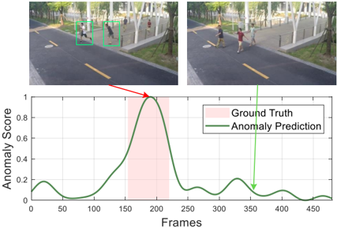

This CVPR paper is the Open Access version, provided by the Computer Vision Foundation.

Except for this watermark, it is identical to the accepted version;

the final published version of the proceedings is available on IEEE Xplore.

## Generating Anomalies for Video Anomaly Detection with Prompt-based Feature Mapping

Zuhao Liu, Xiao-Ming Wu, Dian Zheng, Kun-Yu Lin, Wei-Shi Zheng * School of Computer Science and Engineering, Sun Yat-sen University, China Key Laboratory of Machine Intelligence and Advanced Computing, Ministry of Education, China

{liuzh327, wuxm65, zhengd35, linky5}@mail2.sysu.edu.cn, wszheng@ieee.org

## Abstract

Anomaly detection in surveillance videos is a challenging computer vision task where only normal videos are available during training. Recent work released the first virtual anomaly detection dataset to assist real-world detection. However, an anomaly gap exists because the anomalies are bounded in the virtual dataset but unbounded in the real world, so it reduces the generalization ability of the virtual dataset. There also exists a scene gap between virtual and real scenarios, including scene-specific anomalies (events that are abnormal in one scene but normal in another) and scene-specific attributes, such as the viewpoint of the surveillance camera. In this paper, we aim to solve the problem of the anomaly gap and scene gap by proposing a prompt-based feature mapping framework (PFMF). The PFMF contains a mapping network guided by an anomaly prompt to generate unseen anomalies with unbounded types in the real scenario, and a mapping adaptation branch to narrow the scene gap by applying domain classifier and anomaly classifier. The proposed framework outperforms the state-of-the-art on three benchmark datasets. Extensive ablation experiments also show the effectiveness of our framework design.

## 1. Introduction

Video anomaly detection (VAD) aims to identify abnormal scenarios in surveillance videos with broad applications in public security. However, due to the small probability of occurrence, abnormal events are difficult to be observed in real-life surveillance. The challenge increases because of the unconstrained nature of abnormal events. Given a specific scenario, the event different from normal events can all be regarded as anomalies, so the anomaly type is unbounded.

* Corresponding author

Most VAD approaches address this challenge by learning the distribution of normal events in the training stage and detecting the out-of-distribution events in the testing stage. These methods are categorized into reconstructionbased methods [1 , 14 , 31] to reconstruct the current frame and prediction-based methods [26 , 27 , 27 , 30 , 34] to predict the upcoming frame. Significant reconstruction or prediction error is regarded as an anomaly. However, due to the strong generalization ability of the deep networks and the similarity between normal and abnormal events, the anomalies do not always lead to enough error to be detected. Without prior knowledge of abnormal distribution, it is difficult for the network to detect unseen anomalies.

Therefore, instead of calculating error with the distribution of normal behaviors, some methods [11 , 12 , 53 , 54] try to generate pseudo anomalies to simulate the distribution of abnormal behaviors. For example, Georgescu et al. [12] collect a large number of images from Tiny ImageNet unrelated to the detection scenario as pseudo anomalous samples. Their other work [11] tries to generate temporal anomalies by reversing the action order or motion irregularity by extracting intermittent frames. The network can get a glimpse of the feature distribution different from normal events by manually applying pseudo anomalies. However, the main drawback of these methods is the unavoidable gap between pseudo and natural anomalies.

To solve the problem of pseudo anomalies, Acsintoae et al. [2] released a virtual VAD dataset named Ubnormal using 3D animations and 2D background images. It contains 22 types of anomaly, such as fighting, stealing, laying down, etc. The distribution of real anomalies can be well evaluated by applying the virtual dataset. However, applying virtual anomalies to real scenarios is a great challenge due to the large domain gap. Acsintoae et al. [2] train a CycleGAN [60] to achieve video-level style transfer from virtual to the real domain to address the challenge.

However, existing methods fail to address two key challenges. Firstly, the anomalies are bounded in the virtual dataset but unbounded in the real world, and we define

Figure 1. An overview of prompt-based feature mapping framework (PFMF). The PFMF totally contains three parts, i.e., feature extractor, prompt-based feature mapping network, and mapping adaptation branch. The feature extractor is used to transform the input instances into corresponding features, so the mapping process can be completed at the feature level. The prompt-based feature mapping network aims to map normal features into abnormal feature space under the same domain guided by an anomaly prompt, so the unseen anomalies in the real domain can be generated from normal features. The mapping adaptation branch is added to make the generated anomalies scene-specific and solve the problem of scene-specific attributes.

this difference as anomaly gap. Secondly, different scenarios have scene-specific anomalies (events that are abnormal in one scene but normal in another) and scene-specific attributes (such as the viewpoint of the surveillance camera), and we define this difference as scene gap .

Our work is motivated by the above two key challenges. To solve the problem of anomaly gap and scene gap, we propose a novel framework named prompt-based feature mapping framework (PFMF), as shown in Fig. 1. In terms of narrowing the anomaly gap, the PFMF employs a promptguided mapping network to generate unbounded anomalies through a divergent mapping process. The prompts are sampled from distribution learned by a variational auto-encoder (VAE) [17]. As for the scene gap, we introduce a mapping adaptation branch to solve it. In detail, the branch consists of an anomaly classifier to make the generated anomalies scene-specific, and two domain classifiers to reduce the inconsistency caused by scene-specific attributes.

In summary, this paper makes the following contributions:

- (1) Proposing a novel prompt-based feature mapping framework (PFMF) for video anomaly detection. This framework addresses the challenge of applying virtual VAD datasets with limited anomalies to the real scenario by generating unseen anomalies with unbounded types.
- (2) Proposing a mapping adaptation branch to ensure the anomalies generated by PFMF are scene-specific and solve the problem of scene-specific attributes.
- (3) Showing the effectiveness of the proposed framework on three public VAD datasets, ShanghaiTech, Avenue, and UCF-Crime. Extensive experiments show that the proposed framework performs the best compared with the state-of-

the-art.

## 2. Related Work

## 2.1. Video Anomaly Detection

The goal of the VAD task is to detect anomaly events in videos. In recent years, many works try to learn the distribution of normal events and detect out-of-distribution events in the testing stage [1 , 13 , 14 , 26 , 27 , 30 , 31 , 34]. These methods are categorized into reconstruction-based or prediction-based. Some of the reconstruction-based methods use generative models [14], sparse coding [31], or deep auto-encoder [1] to reconstruct the current frame based on several adjacent frames. Prediction-based methods always predict the future frame using techniques such as motion feature extraction [27 , 34], deep auto-encoder [13 , 30] or ConvLSTM [26]. The occurrence of an anomaly will lead to significant reconstruction or prediction error. However, these methods lie in the 'over-generalizing' dilemma where both normal and abnormal frames can be predicted or reconstructed well because of the strong representation ability of deep network [32]. Recently, some methods try to solve this problem by adding pseudo anomalies in the training process [11 , 12 , 53 , 54]. The pseudo anomalies are collected from unrelated datasets [12] or generated from normal events [11 , 54]. However, these methods face the problem of the large gap between pseudo and natural anomalies.

## 2.2. Datasets under Virtual Environment

Due to the enormous cost and privacy sensitivity of collecting real-world datasets, generating a virtual dataset has become a viable alternative in many fields, including per-

son re-identification [47], semantic segmentation [40], action recognition [37], etc. Due to the lack of anomalies in real-world datasets, instead of generating pseudo anomalies, Acsintoae et al. [2] introduce the first virtual VAD dataset named Ubnormal with a large number of videos containing anomalies such as falling, fighting, stealing, etc.

## 2.3. Feature Mapping

Our proposed framework shares underlying similarities with feature mapping techniques in domain adaptation [6 , 18 , 41 , 57 , 61]. To address the problem of heterogeneous feature spaces in different domains, feature mapping is used to map data from one domain to another. Two mapping paradigms, i.e., common space mapping [41 , 61] and asymmetric mapping [6 , 18 , 57] are used. However, the gap between the real and virtual domains is large. Therefore, instead of mapping features from one domain to another, the proposed PFMF applies mapping from normal features to abnormal features under the same domain.

## 2.4. Prompting Methods

Recently, prompt-based learning has been a popular method in both natural language processing [4 , 25 , 36 , 36 , 49 , 51] and computer vision [8 , 16 , 22 , 58 , 59]. Usually, prompt in textual form is used to adapt language model pre-trained on the large dataset to downstream tasks [4 , 25 , 36 , 36 , 49 , 51]. Textual prompts are also used in the vision-language model [8 , 22 , 58 , 59] to complete computer vision tasks. In addition to applying textual prompts, visual prompts in the form of the learnable vector are proposed to fine-turn the Vision Transformer (ViT) [7]. In this work, instead of applying a pre-trained model to downstream tasks, the proposed anomaly prompt is used to guide the mapping network to achieve divergent mapping.

## 3. Method

In this section, we elaborate on the framework and the training process of our method. An overview of the proposed PFMP is provided in Section 3.1. Then, the training data organization is explained in Section 3.2. In Section 3.3 , the proposed PFMP is illustrated in detail by describing the feature mapping procedure (Section 3.3.1), anomaly prompt (Section 3.3.2), and mapping adaptation branch (Section 3.3.3), respectively. Finally, the optimization process is elaborated in Section 3.4 .

## 3.1. Overview

The overall framework of our proposed method is shown in Fig. 1. Here, we call the real-world dataset (ShanghaiTech, Avenue, or UCF-Crime) as the real domain and the Ubnormal dataset as the virtual domain. The framework takes three inputs, i.e., real domain normal instance S r nor, virtual domain normal instance S v nor , and virtual domain abnormal instance S v abn . We first use a feature extractor to obtain the features of three inputs. To solve the problem of anomaly gap, a feature mapping network assisted by an anomaly prompt is used to map normal features to abnormal features. The anomaly prompt is the key factor to generate unbounded types of anomalies to narrow the anomaly gap. Then we can generate anomalies in the real domain by the feature mapping network and a sampled anomaly prompt. We also propose a mapping adaptation branch to make the generated anomalies scene-specific and solve the problem of scene-specific attributes, which greatly narrows the scene gap. The detail of the proposed PFMF is illustrated in the following parts.

## 3.2. Training Data Organization

The virtual VAD dataset provides rich instance-level anomaly annotations. The dataset annotates whether the behaviors are abnormal or not, and the outline of each person is also provided. However, the real-world VAD dataset only contains raw videos without annotations, and abnormal behavior is absent. Therefore, as shown in the left part of Fig. 2, our framework takes three types of inputs, i.e., real domain normal instance S r nor , virtual domain normal instance S v nor , and virtual domain abnormal instance S v abn . Both S v nor and S v abn are cropped from virtual video based on outline annotations of each person. Considering the absence of bounding box annotations in the real domain dataset, we apply a YOLOv3 object detector [38] pre-trained on the MS COCO dataset [24] to extract the bounding box of each person.

## 3.3. Prompt-based Feature Mapping

After obtaining the instance-level inputs, a feature extractor is used to extract high-dimensional features, as shown in Fig. 2. Then, a feature mapping network is applied to build a bridge between normal and abnormal features in the virtual domain by asymmetric mapping. The mapping process is guided by an anomaly prompt to generate unbounded types of anomaly. The prompt generation process is shown in Fig. 3. Finally, all features are fed into the mapping adaptation branch to further narrow the scene gap, as shown in Fig. 4 .

## 3.3.1 Feature Mapping Network

The feature mapping network aims to map normal features into abnormal feature space under the same domain. Denote the feature extractor output as X ∈ R C×T ×H×W , where C , T , H , W represent channel number, temporal length, height, and width, respectively. The normal feature in the real domain is represented as X r nor , and the normal and abnormal features in the virtual domain are represented

Figure 2. Process of training data organization and feature mapping. For virtual domain, the mapping network ε maps normal feature X v nor to abnormal feature X v abn . Then MAE Loss is used to minimize the gap between mapped feature X v map and abnormal feature X v abn . For the real domain, the mapping network learned in the virtual domain is used to generate unseen anomalies X r abn.

as X v nor and X v abn , respectively. The mapping network de-
Prompt
Global
AvgPool noted by ε( . ) contains an encoder ε
p
g e ( . ) to extract high-level information and a decoder εd( . ) to up-sample the encoded features. ectivel
Prompt The 
Global y. The m
() 
AvgPool

Since we want to generate unbounded types of anomaly, we design a divergent mapping process (one normal feature can be mapped to many types of abnormal features). Moreover, we apply an anomaly prompt p to indicate the mapping direction. In virtual domain, the mapped feature X v map is generated as

<!-- formula-not-decoded -->

where p v is anomaly prompt for feature in virtual domain, and [ . ] means concatenating feature maps along channel dimension.

By training the mapping network ε, we aim to minimize the mean absolute error (MAE) between the mapped abnormal feature and true abnormal feature in the virtual domain, as

<!-- formula-not-decoded -->

Through the optimization process of Eq. 2, the normal feature can be transformed into abnormal feature space.

In the real domain, there are no abnormal samples in the training set, so the network does not have a perception of the abnormal feature distribution. To simulate the abnormal feature distribution in the real domain, we generate abnormal features by using the mapping network learned in the virtual domain. The formula is defined as:

<!-- formula-not-decoded -->

where X r abn is generated anomaly and p r is the real domain prompt generated by sampling from a learned distribution.

## 3.3.2 Anomaly Prompt

To generate unbounded types of anomaly through divergent feature mapping, we create an anomaly prompt as extra input of the mapping network. Since we can assign different

Figure 3. Generation process of anomaly prompt for feature mapping network. It is obtained by concatenating the anomaly vector (a r or a v ) and scene vector (s r or s v ). The scene vector is generated from a ResNet18 network pre-trained in the Places365 dataset. The anomaly vector is sampled from the Gaussian distribution in VAE. The VAE is trained by reconstructing abnormal features in the virtual domain.

generated directions by different anomaly prompts, the produced anomalies tend to be unbounded. The anomaly vector is obtained by concatenating the scene vector and anomaly vector, as shown in Fig. 3 ,

Scene Vector
an squ Anomaly vector contains information about anomaly type. As shown in Fig. 3 (a), the anomaly vector in the virtual domain a v is obtained by squeezing the spatial dimension of abnormal features through a global average pooling. Then, a v S
is fed into a VAE f to generate reconstruction vector a ∗ v . Scene
Vector
The VAE is trained by minimizing the mean square error (MSE) between the anomaly and reconstruction vector, as

<!-- formula-not-decoded -->

Concat
z from VAE
on o Anomaly
, 
nment is Vector
ment i Concat
In real domain, we sample a latent variable z from VAE
the posterior distribution of VAE and decode z to obtain anomaly vector a r , as shown in Fig. 3 (b). Since the VAE Al
is learned from aligned abnormal features, it can simulate Anomaly
Vector
the distribution of the anomalies. The alignment is done by the mapping adaptation branch and we will discuss it later. Then, through sampling latent variables that obey the Gaussian distribution, we can get more types of anomaly vectors. Scene vector. We aim to make the generated anomaly features scene-independent (applicable to any input scene) to narrow the scene gap. Therefore, additional scene information is added by generating scene vector s r . As shown in Fig. 3 (b), we fed the scene image (without detection of YOLOv3) to a ResNet-18 pre-trained on Places365 dataset [56] to identify scene information. We apply the features before the softmax in ResNet-18 as the scene vector.

Anomaly Pr

Training data Organization

S

YOLO

v3

S

S

r

nor

v

nor

v

abn

Figure 4. The mapping adaptation branch in our PFMF contains one anomaly classifier and two domain classifiers.

Feature Mapping
a input of mappi
i r X
nt r X Anomaly prompt. After obtaining both the anomaly vector and scene vector, the anomaly prompt is generated by concatenating these two vectors to fuse input scene and anomaly type information. Then, as shown in Fig. 1, we Feature Mapping
use anomaly prompt as an extra input of mapping network eatue 
r
X
to achieve divergent feature mapping.

nor abn

## 3.3.3 Mapping Adaptation Branch

anomaly

Feature 
ch is al Extractor
wn in F MAE 
y prompt v
n nor 
ed X
lie v
e abn 
fic X
lv
i v
n map
g X
pin prompt
v
X
v
map
X
In addition to the anomaly prompt, the mapping adaptation Feature 
nor X
p
branch is also applied in PFMF to narrow the scene gap. As Extractor
shown in Fig. 4, our mapping adaptation branch contains one anomaly classifier and two domain classifiers, which v
X
are designed to solve the problem of scene-specific anomaM
L
abn X
lies and scene-specific attributes, respectively.



Loss
y
t Loss
Anomaly classifier is used to distinguish between normal and abnormal features for each input scene to explicitly make the generated anomalies scene-specific, as shown in Fig. 4. For each scene, events that are not normal are all treated as anomalies. Thus, maximizing the accuracy of the anomaly classifier can deviate mapped abnormal features from normal features in the same scene. Therefore, the generated anomalies will have different feature distribution from the normal events in the same scene, so they are regarded to be scene-specific.

Domain classifier. In addition, the scene-specific attributes are also a great challenge when applying virtual datasets to real scenarios. The CycleGAN applied in previous work [2] can partly reduce some scene-specific attributes like dressing and background. However, scene-specific attributes still exist, such as the viewpoint of the surveillance camera. We solve this problem by aligning the feature space between the virtual and real domain. The alignment can extract common attributes of two domains and reduces the inconsistency caused by scene-specific attributes.

Inspired by literature [10], we apply two domain classifiers and use gradient reversal layer (GRL) to train the feature extractor. The domain classifier is dedicated to recognizing which domain the input feature belongs to. The preceding feature extractor tries to puzzle the domain classifier to shrink the domain gap. The GRL acts as an identity function during forward-propagation as

<!-- formula-not-decoded -->

where R( . ) and X represent GRL and input feature, respectively. During backward propagation, GRL reverses the gradient of the preceding feature extractor by multiplying −λ , as

<!-- formula-not-decoded -->

where I is the identity matrix, and λ is the adaptation factor, which is set as 1. We aim to extract common attributes between real and virtual domain rather than the characteristics between normal and abnormal feature. Therefore, we design two independent domain classifiers. These two classifiers separately act on normal or abnormal features in both domains, so the features with the same label but the different domain will have a similar distribution.

## 3.4. Training and Inference

Loss function. The proposed PFMF is trained in a unified way. Total loss contains four terms, feature mapping loss L m , anomaly classification loss L a , domain classification loss L d , and VAE reconstruction loss L v . We employ MAE loss for L m to minimize the error between mapped and true abnormal features. We also employ MSE loss for L v to minimize the error between the input anomaly vector and the reconstruction vector of VAE. For L a and L d , the cross-entropy loss is applied to achieve anomaly or domain classification. The entire loss L all is the weighted sum of three terms, as

<!-- formula-not-decoded -->

We empirically find the choice of domain loss weight λd impacts the network training.

Inference. The generated anomalies allow the network to be trained in a fully-supervised way. Given an unseen instance S unseen , it is first fed into the feature extractor θ , then through the anomaly classifier σ. The classification result in the anomaly classifier is regarded as the instancelevel anomaly score, as

<!-- formula-not-decoded -->

Following the operation in literature [11], the instancelevel anomaly scores are assembled into an anomaly map with the same shape as the input frame. The frame-level anomaly score is obtained by taking the maximum value in each frame of the anomaly map.

## 4. Experiments

## 4.1. Datasets and Metrics

In addition to the Ubnormal dataset described in Section 2.2 and Section 3.2, we evaluate the proposed PFMF in three real-world VAD datasets, ShanghaiTech [31], Avenue [29], and UCF-Crime [42].

ShanghaiTech is a large-scale VAD dataset containing 437 videos captured in 13 locations. The dataset is organized for unsupervised learning by dividing it into a training set with 330 videos containing only normal events and a testing set with 107 videos containing both normal and abnormal events. The anomalies include fighting, robbing, riding bikes on the sidewalk, etc. Each video in the dataset has a resolution of 480×856.

Avenue dataset contains 16 videos for training and 21 videos for testing with 15324 frames. Similar to ShanghaiTech, only the testing set contains abnormal events. Each video in the dataset has a resolution of 480×856. The anomalies include throwing objects, running, loitering, etc. UCF-Crime dataset contains 13 anomaly types, and the total video length is 128 hours. We use normal videos from the training set for our model training, and abnormal videos of human-related anomalies (except classes of explosions, car accidents, and normal) from the testing set for model evaluation.

Evaluation Metrics In Section 4.3, we use the accuracy (Acc) of Ubnormal instance inputs and feature mapping error (Err) to evaluate the feature mapping effect. The lower error means a better feature mapping effect. The feature mapping error is MAE between the mapped and true abnormal features. In Section 4.4 and 4.5, We use commonly used metric, i.e., area under ROC curve (AUC), to evaluate the frame-level anomaly detection performance of our framework [9 , 30 , 54]. A Higher AUC value means better anomaly detection ability. Following literature [12], we evaluate both the Micro and Macro versions of AUC.

## 4.2. Implementation Details

Based on trials of preliminary study (Section 4.3), we set the layer number of the mapping network to 4 and loss function to MAE loss for subsequent experiments. Each layer of the mapping network contains one convolution followed by an instance normalization and a ReLU activation. As described in Section 3.4, the choice of Ld influences on the network training, and it is set to 0.2. Adam optimizer is used with learning rate of 0.001. The confidence threshold for the YOLOv3 detector is set to 0.5 for ShanghaiTech and UCF-Crime, and 0.95 for Avenue. The temporal length for each input video clip is set to 7. For the feature extractor, 3D CNN with a total of six convolution layers is applied.

Since the inputs of the proposed framework are from two domains, we empirically found that batch normaliza-

Table 1. Preliminary study to obtain the optimal structure and loss function for mapping network. Accuracy (Acc) of Ubnormal instance inputs and feature mapping error (Err) are used to evaluate the feature mapping effect.

| Loss
 Type   |   Layer
 Num  |   Acc(%)  |   Err(%) |
|--------------|---------------|-----------|----------|
|              |            0  |      80.3 |     0.98 |
|              |            1  |      83.4 |     1.01 |
|              |            2  |      84   |     1.2  |
|              |            3  |      84.1 |     1.82 |
|              |            4  |      85.3 |     0.81 |
| MSE          |            0  |      86.9 |     4.29 |
| MSE          |            1  |      87.2 |     6.79 |
| MSE          |            2  |      84.9 |     5.33 |
| MSE          |            3  |      84.1 |     7.02 |
| MSE          |            4  |      85.8 |     6.7  |

tion will lead to optimization failure due to inaccurate running mean and variance. Therefore, instance normalization is used in our framework to replace batch normalization.

## 4.3. Preliminary Study

In this section, we explore the optimal structure and loss function for the mapping network. Only S v nor and S v abn are fed to our PFMF in this section because the mapping results in the real domain cannot be evaluated by reconstruction error and instance-level accuracy (we do not have abnormal instances in the real domain). After obtaining virtual domain instances described in Section 3.2, we split the 70% of instances for training and 30% for testing. We design different structures by changing the down-sampling number of the mapping network. Setting the layer number to 0 means no down-sampling layer exists in the mapping network. We also evaluate the effect of different feature mapping loss L m , i.e., MAE loss and MSE loss. Results are shown in Table 1. From the table, we find the MAE loss can significantly reduce the feature mapping error. When using MAE loss, deeper layers result in higher accuracy. The structure with layer number 4 and MAE loss achieves the lowest feature mapping error with 0.81%. The structure with layer number 2 and MSE loss obtains the highest accuracy, but its feature mapping error is too large (6.79%). In summary, we apply a mapping network with layer number 4 and MAE loss to our PFMF.

## 4.4. Comparisons with State-of-the-art

In this section, we compare the performance of the proposed PFMF with state-of-the-art methods in Micro and Macro AUC(%). Noticing that current advanced methods [39] and [2] apply multi-task framework ( [11] and [12] respectively) provided by Georgescu et al. as the backbone. Therefore, we evaluate our PFMF with or without the multitask backbone [11] in Avenue and ShanghaiTech dataset.

Table 2. Quantitative comparisons between our proposed PFMF and state-of-the-arts [2 , 3 , 5 , 11 – 13 , 15 , 19 – 21 , 23 , 27 , 28 , 30 , 33 – 35 , 39 , 42 – 44 , 46 , 48 , 50 , 52 – 55] in Micro and Macro AUC (%). Bold font indicates the best results.

| year   | Method                   | Avenue 
 AUC 
 MiM   | Avenue 
 AUC 
 MiM   | ShanghaiTech
 AUC   | ShanghaiTech
 AUC   |
|--------|--------------------------|----------------------|----------------------|---------------------|---------------------|
| y      |                          | Micro                | Macro                | Micro               | Macro               |
| 8      | Liu et al. [27]          | 85.1                 | -                    | 72.8                | -                   |
| 201    | Lee et al. [19]          | 87.2                 | -                    | -                   | -                   |
| 201    | Sultani et al. [42]      | -                    | -                    | 76.5                | -                   |
| 2019   | Lee et al. [20]          | 90.0                 | -                    | 76.2                | -                   |
| 2019   | Ionescu et al. [15]      | 87.4                 | 90.4                 | 78.7                | 84.9                |
| 2019   | Gong et al. [13]         | 90.4                 | -                    | 84.9                | -                   |
| 2019   | g 
 Nguyen et al. [34]   | 86.9                 | -                    | -                   | -                   |
| 2019   | Wu et al. [50]           | 86.6                 | -                    | -                   | -                   |
| 2020   | Park et al. [35]         | 88.5                 | -                    | 70.5                | -                   |
| 2020   | Sun et al. [43]          | 89.6                 | -                    | 74.7                | -                   |
| 2020   | Lu et al. [30]           | 85.8                 | -                    | 77.9                | -                   |
| 2020   | Wang et al. [48]         | 87.0                 | -                    | 79.3                | -                   |
| 2020   | Yu et al. [52]           | 89.6                 | -                    | 74.8                | -                   |
| 2020   | Tang et al. [44]         | 85.1                 | -                    | 73.0                | -                   |
| 2021   | Wang et al. [46          | 88.3                 | -                    | 76.6                | -                   |
| 2021   | Astrid et al. [3]        | 87.1                 | -                    | 73.7                | -                   |
| 2021   | Liu et al. [28]          | 91.1                 | -                    | 76.2                | -                   |
| 2021   | Madan et al. [33]        | 88.6                 | -                    | 74.6                | -                   |
| 2021   | Li et al. [21]           | 88.8                 | -                    | 73.9                | -                   |
| 2021   | Georgescu et al. [11]    | 91.5                 | 91.9                 | 82.4                | 89.3                |
| 2021   | Georgescu et al. [12]    | 92.3                 | 90.4                 | 82.7                | 89.3                |
| 2022   | Zaheer et al. [54]       | 74.2                 | -                    | 79.6                | -                   |
| 2022   | [
 Li et al. [23]        | 82.0                 | -                    | -                   | -                   |
| 2022   | Zaheer et al. [53]       | -                    | -                    | 69.9                | -                   |
| 2022   | Cho et al. [5]           | 88.0                 | -                    | 76.3                | -                   |
| 2022   | [] 
 Zhong et al. [55]   | 89.0                 | -                    | 74.5                | -                   |
| 2022   | Ristea et al. [39]
 ∗    | 92.9                 | 91.9                 | 83.6                | 89.5                |
| 2022   | Acsintoae et al. [2]
 ▽∗ | 93.0                 | 93.2                 | 83.7                | 90.5                |
| 2022   | PFMF (ours)▽             | 91.8                 | 92.3                 | 83.8                | 87.8                |
| 2022   | PFMF (ours)▽∗            | 93.6                 | 93.9                 | 85.0                | 91.4                |

- ▽ These methods apply virtual dataset for training.

∗ These methods use multi-task model ( [11] or [12]) as backbone.

Table 3. Results in human-related anomalies of UCF-Crime dataset.

| Method                |   Micro AUC  | Macro AUC        |
|-----------------------|--------------|------------------|
| l. [35]               |         55.5 | Park et al. [35] |
| Ristca et al. [39]    |         60.6 | 64.2             |
| Georgescu et al. [11] |         62.3 | 65.5             |
| PFMF (ours)           |         67.9 | 74.0             |

For UCF-Crime, we did not use the multi-task backbone.

Avenue. The proposed PFMF achieves the best in the Avenue dataset compared with state-of-the-art [2 , 3 , 5 , 11 – 13 ,

Table 4. Ablation study of the proposed PFMF. Total five groups of experiments are conducted in the ShanghaiTech dataset to evaluate the effect of each network component.

| feature   | anomaly   | mapping    | AUC
 M   | AUC
 M   |
|-----------|-----------|------------|----------|----------|
| mapping   | prompt    | adaptation | Micro    | Macro    |
| -         | -         | -          | 73.6     | 74.5     |
| ✔         | -         | -          | 78.9     | 84.2     |
| ✔         | -         | ✔          | 80.9     | 86.5     |
| ✔         | ✔         | -          | 80.0     | 85.3     |
| ✔         | ✔         | ✔          | 83.8     | 87.8     |

Figure 5. Distributions of features generated by our PFMF and the method of Georgescu et al. [11] visualized by t-SNE [45]. The blue points denote the extracted features of normal videos in ShanghaiTech [31] and Avenue [29] datasets. The red points indicate the abnormal features generated by our PFMF or [11]. The features of normal and abnormal events are tangled together for [11], but our proposed PFMF shows better performance with Nebula-like feature distribution. The pattern of concentrated normal features and dispersed abnormal features is consistent with our perception of anomalies that most normal behaviors are similar, while abnormal behaviors are a highly variable open set. The figure indicates that the generated features are close to the distribution of real anomalies.

15 , 19 – 21 , 23 , 27 , 28 , 30 , 33 – 35 , 39 , 43 , 44 , 46 , 48 , 50 , 52 , 54 , 55] with micro AUC 93.6% and macro AUC 93.9%, which are 0.6% and 0.7% higher than the second best model [2]. Without the multi-task backbone [11], our PFMF can still obtain the best macro AUC of 92.3%.

ShanghaiTech. From Table 2, the proposed PFMF also outperforms state-of-the-art [2 , 3 , 5 , 11 – 13 , 15 , 20 , 21 , 27 , 28 , 30 , 33 , 35 , 39 , 42 – 44 , 46 , 48 , 52 – 55] with micro AUC 85.0% and macro AUC 91.4%. The PFMF outperforms the second best [2] by 1.3% and 0.9%, respectively. Without the effect

Figure 6. Visualization of anomaly score prediction results for test video 07 in Avenue dataset. The green line denotes the anomaly prediction of the proposed PFMF. The red area denotes the abnormal interval.

of multi-task backbone [11], the proposed PFMF can also achieve the best micro AUC of 83.8%, even higher than [2] with backbone [11].

UCF-Crime. Due to the lack of published results on human-related anomalies on the UCF-Crime dataset, we implement the code of literature [11 , 35 , 39], where [39] takes [35] as the backbone. As shown in Table 3, the proposed PFMF shows a great advantage with a 5.6% increase in Micro AUC and an 8.5% increase in Macro AUC than the second best.

## 4.5. Ablation Study

We analyze the role played by each part of the proposed PFMF. A total of five groups of experiments are conducted in the ShanghaiTech dataset, as shown in Table 4. When removing the feature mapping part, the performance drops significantly with Micro AUC 73.6% and Macro AUC 74.5%. By adding feature mapping, the Micro and Macro AUC increase by 5.3% and 9.7%, respectively, which indicating that the significance of feature mapping to align the normal and abnormal features. In addition, the mapping adaptation branch also plays an important role in PFMF by narrowing the scene gap. Furthermore, the anomaly prompt improves model performance by generating unbounded types of anomalies. With all components, the final PFMF achieves the best performance with Micro AUC of 83.8% and Macro AUC of 87.8%.

## 4.6. Visualization

To validate that we can generate unbounded anomalies, we visualize the distribution of normal and abnormal features generated by PFMF via t-SNE [45], which is shown in Fig. 5. For comparison, we also visualized the distribution of normal and abnormal features generated by [11], where the abnormal features are generated by reversing the action order and extracting intermittent frame, as also shown in

Figure 7. Visualization of anomaly score prediction results for test video 05 0018 in ShanghaiTech dataset. The green line denotes the anomaly prediction of the proposed PFMF. The red area denotes the abnormal interval.

Fig. 5. From the figures, we can obverse that for PFMF, the normal features extracted from ShanghaiTech and Avenue concentrate at the center, and the abnormal features are scattered around in a divergent state. However, for [11], the features of normal and abnormal instances are tangled together. From the comparison, we can see that the results of our method are consistent with our perception of anomalies that most normal behaviors are similar and the abnormal behaviors are a highly variable open set. This indicates that the generated features are close to the distribution of real unbounded anomalies, which on the other hand validates the effectiveness of our anomaly prompt.

To further show what we learn in PFMF, we visualized the anomaly score prediction of test video 07 in Avenue and test video 05 0018 in ShanghaiTech, which are demonstrated in Fig. 6 and Fig. 7. From the figure, the proposed PFMF can correctly detect the anomalies in both samples.

## 5. Conclusion

In this paper, we solve the problem of anomaly gap and scene gap between virtual and real scenarios by proposing a novel PFMF. The proposed framework includes a promptguided mapping network to generate unseen anomalies with unbounded types, and a mapping adaptation branch to narrow the scene gap by applying anomaly classifier and domain classifier. Our approach provides a new paradigm for leveraging virtual datasets to avoid cumbersome anomaly collection in the real scenario. The proposed PFMF performs state-of-the-art on three benchmark datasets, and the ablation study shows the effectiveness of each component of our model design. In the future, we aim to extend the proposed paradigm of utilizing virtual datasets to more areas.

Acknowledgments: This work was supported partially by the NSFC(U21A20471,U1911401,U1811461), Guangdong NSF Project (No. 2023B1515040025, 2020B1515120085).

## References

- [1] Davide Abati, Angelo Porrello, Simone Calderara, and Rita Cucchiara. Latent space autoregression for novelty detection. In Proceedings of the IEEE/CVF Conference on Computer Vision and Pattern Recognition, pages 481–490, 2019. 1 , 2
- [2] Andra Acsintoae, Andrei Florescu, Mariana-Iuliana Georgescu, Tudor Mare, Paul Sumedrea, Radu Tudor Ionescu, Fahad Shahbaz Khan, and Mubarak Shah. Ubnormal: New benchmark for supervised open-set video anomaly detection. In Proceedings of the IEEE/CVF Conference on Computer Vision and Pattern Recognition , pages 20143–20153, 2022. 1 , 3 , 5 , 6 , 7 , 8
- [3] Marcella Astrid, Muhammad Zaigham Zaheer, and Seung-Ik Lee. Synthetic temporal anomaly guided end-to-end video anomaly detection. In Proceedings of the IEEE/CVF International Conference on Computer Vision, pages 207–214, 2021. 7

¨

- [4] Fredrik Carlsson, Joey Ohman, Fangyu Liu, Severine Verlinden, Joakim Nivre, and Magnus Sahlgren. Fine-grained controllable text generation using non-residual prompting. In Proceedings of the Annual Meeting of the Association for Computational Linguistics (Volume 1: Long Papers), pages 6837–6857, 2022. 3
- [5] MyeongAh Cho, Taeoh Kim, Woo Jin Kim, Suhwan Cho, and Sangyoun Lee. Unsupervised video anomaly detection via normalizing flows with implicit latent features. Pattern Recognition, 129:108703, 2022. 7
- [6] Wenyuan Dai, Yuqiang Chen, Gui-Rong Xue, Qiang Yang, and Yong Yu. Translated learning: Transfer learning across different feature spaces. Proceedings of the Advances in Neural Information Processing Systems, 21, 2008. 3
- [7] Alexey Dosovitskiy, Lucas Beyer, Alexander Kolesnikov, Dirk Weissenborn, Xiaohua Zhai, Thomas Unterthiner, Mostafa Dehghani, Matthias Minderer, Georg Heigold, Sylvain Gelly, et al. An image is worth 16x16 words: Transformers for image recognition at scale. arXiv preprint arXiv:2010.11929, 2020. 3
- [8] Yu Du, Fangyun Wei, Zihe Zhang, Miaojing Shi, Yue Gao, and Guoqi Li. Learning to prompt for open-vocabulary object detection with vision-language model. In Proceedings of the IEEE/CVF Conference on Computer Vision and Pattern Recognition, pages 14084–14093, 2022. 3
- [9] Jia-Chang Feng, Fa-Ting Hong, and Wei-Shi Zheng. Mist: Multiple instance self-training framework for video anomaly detection. In Proceedings of the IEEE/CVF Conference on Computer Vision and Pattern Recognition, pages 14009– 14018, 2021. 6
- [10] Yaroslav Ganin and Victor Lempitsky. Unsupervised domain adaptation by backpropagation. In Proceedings of the International Conference on Machine Learning, pages 1180– 1189. PMLR, 2015. 5
- [11] Mariana-Iuliana Georgescu, Antonio Barbalau, Radu Tudor Ionescu, Fahad Shahbaz Khan, Marius Popescu, and Mubarak Shah. Anomaly detection in video via selfsupervised and multi-task learning. In Proceedings of the
9. IEEE/CVF Conference on Computer Vision and Pattern Recognition, pages 12742–12752, 2021. 1 , 2 , 5 , 6 , 7 , 8
- [12] Mariana Iuliana Georgescu, Radu Tudor Ionescu, Fahad Shahbaz Khan, Marius Popescu, and Mubarak Shah. A background-agnostic framework with adversarial training for abnormal event detection in video. IEEE Transactions on Pattern Analysis and Machine Intelligence, 44(9):4505– 4523, 2021. 1 , 2 , 6 , 7
- [13] Dong Gong, Lingqiao Liu, Vuong Le, Budhaditya Saha, Moussa Reda Mansour, Svetha Venkatesh, and Anton van den Hengel. Memorizing normality to detect anomaly: Memory-augmented deep autoencoder for unsupervised anomaly detection. In Proceedings of the IEEE/CVF International Conference on Computer Vision, pages 1705–1714, 2019. 2 , 7
- [14] Mahmudul Hasan, Jonghyun Choi, Jan Neumann, Amit K Roy-Chowdhury, and Larry S Davis. Learning temporal regularity in video sequences. In Proceedings of the IEEE/CVF Conference on Computer Vision and Pattern Recognition , pages 733–742, 2016. 1 , 2
- [15] Radu Tudor Ionescu, Fahad Shahbaz Khan, Mariana-Iuliana Georgescu, and Ling Shao. Object-centric auto-encoders and dummy anomalies for abnormal event detection in video. In Proceedings of the IEEE/CVF Conference on Computer Vision and Pattern Recognition, pages 7842–7851, 2019. 7
- [16] Menglin Jia, Luming Tang, Bor-Chun Chen, Claire Cardie, Serge Belongie, Bharath Hariharan, and Ser-Nam Lim. Visual prompt tuning. arXiv preprint arXiv:2203.12119, 2022. 3
- [17] Diederik P Kingma and Max Welling. Auto-encoding variational bayes. arXiv preprint arXiv:1312.6114, 2013. 2
- [18] Brian Kulis, Kate Saenko, and Trevor Darrell. What you saw is not what you get: Domain adaptation using asymmetric kernel transforms. In Proceedings of the IEEE/CVF Conference on Computer Vision and Pattern Recognition, pages 1785–1792. IEEE, 2011. 3
- [19] Sangmin Lee, Hak Gu Kim, and Yong Man Ro. Stan: Spatiotemporal adversarial networks for abnormal event detection. In Proceedings of the IEEE International Conference on Acoustics, Speech and Signal Processing, pages 1323–1327. IEEE, 2018. 7
- [20] Sangmin Lee, Hak Gu Kim, and Yong Man Ro. Bman: bidirectional multi-scale aggregation networks for abnormal event detection. IEEE Transactions on Image Processing , 29:2395–2408, 2019. 7
- [21] Bo Li, Sam Leroux, and Pieter Simoens. Decoupled appearance and motion learning for efficient anomaly detection in surveillance video. Computer Vision and Image Understanding, 210:103249, 2021. 7
- [22] Muheng Li, Lei Chen, Yueqi Duan, Zhilan Hu, Jianjiang Feng, Jie Zhou, and Jiwen Lu. Bridge-prompt: Towards ordinal action understanding in instructional videos. In Proceedings of the IEEE/CVF Conference on Computer Vision and Pattern Recognition, pages 19880–19889, 2022. 3
- [23] Nanjun Li, Faliang Chang, and Chunsheng Liu. A selftrained spatial graph convolutional network for unsupervised human-related anomalous event detection in complex scenes.

- IEEE Transactions on Cognitive and Developmental Systems, 2022. 7
- [24] Weixin Li, Vijay Mahadevan, and Nuno Vasconcelos. Anomaly detection and localization in crowded scenes. IEEE Transactions on Pattern Analysis and Machine Intelligence , 36(1):18–32, 2013. 3
- [25] Pengfei Liu, Weizhe Yuan, Jinlan Fu, Zhengbao Jiang, Hiroaki Hayashi, and Graham Neubig. Pre-train, prompt, and predict: A systematic survey of prompting methods in natural language processing. arXiv preprint arXiv:2107.13586 , 2021. 3
- [26] Wen Liu, Weixin Luo, Zhengxin Li, Peilin Zhao, Shenghua Gao, et al. Margin learning embedded prediction for video anomaly detection with a few anomalies. In Proceedings of the International Joint Conferences on Artificial Intelligence , pages 3023–3030, 2019. 1 , 2
- [27] Wen Liu, Weixin Luo, Dongze Lian, and Shenghua Gao. Future frame prediction for anomaly detection–a new baseline. In Proceedings of the IEEE/CVF Conference on Computer Vision and Pattern Recognition, pages 6536–6545, 2018. 1 , 2 , 7
- [28] Zhian Liu, Yongwei Nie, Chengjiang Long, Qing Zhang, and Guiqing Li. A hybrid video anomaly detection framework via memory-augmented flow reconstruction and flow-guided frame prediction. In Proceedings of the IEEE/CVF International Conference on Computer Vision, pages 13588–13597, 2021. 7
- [29] Cewu Lu, Jianping Shi, and Jiaya Jia. Abnormal event detection at 150 fps in matlab. In Proceedings of the IEEE/CVF International Conference on Computer Vision, pages 2720– 2727, 2013. 6 , 7
- [30] Yiwei Lu, Frank Yu, Mahesh Kumar Krishna Reddy, and Yang Wang. Few-shot scene-adaptive anomaly detection. In Proceedings of the European Conference on Computer Vision, pages 125–141. Springer, 2020. 1 , 2 , 6 , 7
- [31] Weixin Luo, Wen Liu, and Shenghua Gao. A revisit of sparse coding based anomaly detection in stacked rnn framework. In Proceedings of the IEEE/CVF International Conference on Computer Vision, pages 341–349, 2017. 1 , 2 , 6 , 7
- [32] Hui Lv, Chen Chen, Zhen Cui, Chunyan Xu, Yong Li, and Jian Yang. Learning normal dynamics in videos with meta prototype network. In Proceedings of the IEEE/CVF Conference on Computer Vision and Pattern Recognition, pages 15425–15434, 2021. 2
- [33] Neelu Madan, Arya Farkhondeh, Kamal Nasrollahi, Sergio Escalera, and Thomas B Moeslund. Temporal cues from socially unacceptable trajectories for anomaly detection. In Proceedings of the IEEE/CVF International Conference on Computer Vision, pages 2150–2158, 2021. 7
- [34] Trong-Nguyen Nguyen and Jean Meunier. Anomaly detection in video sequence with appearance-motion correspondence. In Proceedings of the IEEE/CVF International Conference on Computer Vision, pages 1273–1283, 2019. 1 , 2 , 7
- [35] Hyunjong Park, Jongyoun Noh, and Bumsub Ham. Learning memory-guided normality for anomaly detection. In Proceedings of the IEEE/CVF Conference on Computer Vision and Pattern Recognition, pages 14372–14381, 2020. 7 , 8
- [36] Kunxun Qi, Hai Wan, Jianfeng Du, and Haolan Chen. Enhancing cross-lingual natural language inference by promptlearning from cross-lingual templates. In Proceedings of the Annual Meeting of the Association for Computational Linguistics, pages 1910–1923, 2022. 3
- [37] Hossein Ragheb, Sergio Velastin, Paolo Remagnino, and Tim Ellis. Vihasi: virtual human action silhouette data for the performance evaluation of silhouette-based action recognition methods. In Proceedings of the ACM/IEEE International Conference on Distributed Smart Cameras, pages 1– 10. IEEE, 2008. 3
- [38] Joseph Redmon and Ali Farhadi. Yolov3: An incremental improvement. arXiv preprint arXiv:1804.02767, 2018. 3
- [39] Nicolae-Cat˘ ˘ alin Ristea, Neelu Madan, Radu Tudor Ionescu, ˘ ˘ Kamal Nasrollahi, Fahad Shahbaz Khan, Thomas B Moeslund, and Mubarak Shah. Self-supervised predictive convolutional attentive block for anomaly detection. In Proceedings of the IEEE/CVF Conference on Computer Vision and Pattern Recognition, pages 13576–13586, 2022. 6 , 7 , 8
- [40] German Ros, Laura Sellart, Joanna Materzynska, David Vazquez, and Antonio M Lopez. The synthia dataset: A large collection of synthetic images for semantic segmentation of urban scenes. In Proceedings of the IEEE/CVF Conference on Computer Vision and Pattern Recognition, pages 3234– 3243, 2016. 3
- [41] Xiaoxiao Shi, Qi Liu, Wei Fan, S Yu Philip, and Ruixin Zhu. Transfer learning on heterogenous feature spaces via spectral transformation. In Proceedings of the IEEE International Conference on Data Mining, pages 1049–1054. IEEE, 2010. 3
- [42] Waqas Sultani, Chen Chen, and Mubarak Shah. Real-world anomaly detection in surveillance videos. In Proceedings of the IEEE/CVF Conference on Computer Vision and Pattern Recognition, pages 6479–6488, 2018. 6 , 7
- [43] Che Sun, Yunde Jia, Yao Hu, and Yuwei Wu. Scene-aware context reasoning for unsupervised abnormal event detection in videos. In Proceedings of the ACM International Conference on Multimedia, pages 184–192, 2020. 7
- [44] Yao Tang, Lin Zhao, Shanshan Zhang, Chen Gong, Guangyu Li, and Jian Yang. Integrating prediction and reconstruction for anomaly detection. Pattern Recognition Letters , 129:123–130, 2020. 7
- [45] Laurens Van der Maaten and Geoffrey Hinton. Visualizing data using t-sne. Journal of Machine Learning Research , 9(11), 2008. 7 , 8
- [46] Xuanzhao Wang, Zhengping Che, Bo Jiang, Ning Xiao, Ke Yang, Jian Tang, Jieping Ye, Jingyu Wang, and Qi Qi. Robust unsupervised video anomaly detection by multipath frame prediction. IEEE Transactions on Neural Networks and Learning Systems, 2021. 7
- [47] Yanan Wang, Shengcai Liao, and Ling Shao. Surpassing real-world source training data: Random 3d characters for generalizable person re-identification. In Proceedings of the ACM international conference on multimedia, pages 3422– 3430, 2020. 3
- [48] Ziming Wang, Yuexian Zou, and Zeming Zhang. Cluster attention contrast for video anomaly detection. In Proceedings

- of the ACM International Conference on Multimedia, pages 2463–2471, 2020. 7
- [49] Hui Wu and Xiaodong Shi. Adversarial soft prompt tuning for cross-domain sentiment analysis. In Proceedings of the Annual Meeting of the Association for Computational Linguistics (Volume 1: Long Papers), pages 2438–2447, 2022. 3
- [50] Peng Wu, Jing Liu, and Fang Shen. A deep one-class neural network for anomalous event detection in complex scenes. IEEE Transactions on Neural Networks and Learning Systems, 31(7):2609–2622, 2019. 7
- [51] Hongbin Ye, Ningyu Zhang, Shumin Deng, Xiang Chen, Hui Chen, Feiyu Xiong, Xi Chen, and Huajun Chen. Ontologyenhanced prompt-tuning for few-shot learning. In Proceedings of the ACM Web Conference, pages 778–787, 2022. 3
- [52] Guang Yu, Siqi Wang, Zhiping Cai, En Zhu, Chuanfu Xu, Jianping Yin, and Marius Kloft. Cloze test helps: Effective video anomaly detection via learning to complete video events. In Proceedings of the ACM International Conference on Multimedia, pages 583–591, 2020. 7
- [53] Muhammad Zaigham Zaheer, Jin-Ha Lee, Arif Mahmood, Marcella Astrid, and Seung-Ik Lee. Stabilizing adversarially learned one-class novelty detection using pseudo anomalies. IEEE Transactions on Image Processing, 31:5963– 5975, 2022. 1 , 2 , 7
- [54] M Zaigham Zaheer, Arif Mahmood, M Haris Khan, Mattia Segu, Fisher Yu, and Seung-Ik Lee. Generative cooperative learning for unsupervised video anomaly detection. In Proceedings of the IEEE/CVF Conference on Computer Vision and Pattern Recognition, pages 14744–14754, 2022. 1 , 2 , 6 , 7
- [55] Yuanhong Zhong, Xia Chen, Yongting Hu, Panliang Tang, and Fan Ren. Bidirectional spatio-temporal feature learning with multi-scale evaluation for video anomaly detection. IEEE Transactions on Circuits and Systems for Video Technology, 2022. 7
- [56] Bolei Zhou, Agata Lapedriza, Aditya Khosla, Aude Oliva, and Antonio Torralba. Places: A 10 million image database for scene recognition. IEEE Transactions on Pattern Analysis and Machine Intelligence, 2017. 4
- [57] Joey Tianyi Zhou, Ivor W Tsang, Sinno Jialin Pan, and Mingkui Tan. Heterogeneous domain adaptation for multiple classes. In Artificial Intelligence and Statistics, pages 1095–1103. PMLR, 2014. 3
- [58] Kaiyang Zhou, Jingkang Yang, Chen Change Loy, and Ziwei Liu. Conditional prompt learning for vision-language models. In Proceedings of the IEEE/CVF Conference on Computer Vision and Pattern Recognition, pages 16816–16825, 2022. 3
- [59] Kaiyang Zhou, Jingkang Yang, Chen Change Loy, and Ziwei Liu. Learning to prompt for vision-language models. International Journal of Computer Vision, 130(9):2337–2348, 2022. 3
- [60] Jun-Yan Zhu, Taesung Park, Phillip Isola, and Alexei A Efros. Unpaired image-to-image translation using cycleconsistent adversarial networks. In Proceedings of the IEEE/CVF International Conference on Computer Vision , pages 2223–2232, 2017. 1
- [61] Yin Zhu, Yuqiang Chen, Zhongqi Lu, Sinno Jialin Pan, GuiRong Xue, Yong Yu, and Qiang Yang. Heterogeneous transfer learning for image classification. In Proceedings of the AAAI Conference on Artificial Intelligence, 2011. 3