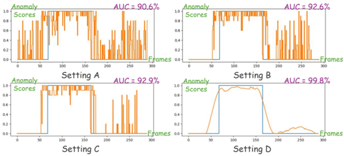

## SUVAD: Semantic Understanding Based Video Anomaly Detection Using MLLM

Shibo Gao∗†, Peipei Yang†‡(B), Linlin Huang ∗

∗ Beijing Jiaotong University

† State Key Laboratory of Multimodal Artificial Intelligence Systems, Institute of Automation, Chinese Academy of Sciences ‡ School of Artificial Intelligence, University of Chinese Academy of Sciences

Abstract—Video anomaly detection (VAD) aims at detecting anomalous events in videos. Most existing VAD methods distinguish anomalies by learning visual features of the video, which usually face several challenges in real-world applications. First, these methods are mostly scene-dependent, whose performances degrade obviously once the scene changes. Second, these methods are incapable of giving explanations to the detected anomalies. Third, these methods cannot adjust definitions of normal or abnormal events during test time without retraining the model. One important reason for the drawbacks is that these visualbased methods mainly detect anomalies by fitting visual patterns rather than semantically understanding the events in videos. In this paper, we propose a training-free method named Semantic Understanding based Video Anomaly Detection (SUVAD) using multi-modal large language model (MLLM). By exploiting MLLMs to generate detailed texture descriptions for videos, SUVAD achieves semantic video understanding, and then detects anomalies directly by large language models. We also designed several techniques to mitigate the hallucination problem of MLLMs. Compared to the methods based on visual features, SUVAD obtains obviously better scene generalization, anomaly interpretability, and the ability of flexible adjustment of anomaly definitions. We evaluate our method on five mainstream datasets. The results show that SUVAD achieves the best performance among all the training-free methods.

Index Terms—Video Anomaly Detection, Multi-modal Largelanguage Model, Training-free

## I. INTRODUCTION

Video anomaly detection (VAD) aims to detect events in the videos that significantly deviate from normal patterns. Due to its widespread applications in areas such as intelligent surveillance systems and video censorship, VAD has garnered increasing attention in both academia and industry [1]–[11].

Most existing VAD methods identify anomalous events by fitting the normal or anomalous visual patterns learned from the training videos [12]–[22]. Although these methods demonstrate good performances in their experiments, they encounter multiple challenges when applied to the real world.

Firstly, the methods based on visual features are prone to be scene-specific. Models over-fitted to the specific scenes will experience significant performance degradation when switched to another scene. Secondly, these methods focus on detecting anomalies while neglecting to provide detailed explanations to the anomalous events. Thirdly, the definition of anomalous events can be learnt only from the training videos and thus are incapable of being adjusted without re-training the model using new data.

The aforementioned problems stem largely from the fact that most existing methods focus exclusively on visual features when detecting anomalies, rather than comprehending the video content. In reality, anomalies within videos are dictated by the events. Clearly, the recently successful multi-modal large language models [23]–[26] (MLLMs) and large language models [27], [28] (LLMs) are well-suited to address this task. Zanella et al. [29] were the first to attempt using MLLMs for VAD tasks. Unfortunately, they failed to fully exploit the potential of MLLMs. Firstly, their definition of anomalies relies entirely on LLMs, making it completely uncontrollable. Secondly, they are severely affected by hallucination problems.

Fig. 1. Compared to the methods based on visual features, our method can support flexible anomaly definition, adapt to different scenes, and provide explanations for anomalies under training-free.

In this paper, we propose a training-free VAD method named Semantic Understanding Based VAD (SUVAD), to address the aforementioned problems. It first exploits MLLMs to achieve semantic understanding of the training videos and generate textual descriptions for normal or abnormal events according to the labels. Subsequently, SUVAD generates textual description for each frame of the test video and calculates its anomaly score by comparing it with the descriptions of normal and abnormal events using an LLM. The anomalous frames can be detected according to the scores with interpretative descriptions about the anomalies. Furthermore, we designed several techniques such as score smoothing and caption correction to mitigate hallucination problems. Fig. 1 illustrates the differences between SUVAD and other visual-based methods.

Using semantic information instead of visual features for

anomaly detection, SUVAD can well adapt to different scenes without obvious performance degradation. Benefiting from the multi-modal model, SUVAD can conveniently give explanation to the detected anomalies and adjust the definition of normal or abnormal events according to textual inputs without retraining the model. Finally, the strategy of course-to-fine VAD effectively suppresses hallucination problems, further enhancing model performance.

We evaluate our method on both semi-supervised and weakly-supervised tasks using five mainstream datasets. The results show that SUVAD achieves the best performance among all the training-free methods and achieves comparable performance to other supervised methods. We summarize our contributions as follows:

- We propose a training-free VAD method named SUVAD that detects anomalies based on semantic understanding of the video contents. Compared with the methods based on visual features, it benefits from better generalization to scenes, ability of anomaly explanation and the flexibility to adjust anomaly definitions.
- We propose a series of techniques to mitigate the hallucination problems of MLLMs for VAD task.
- Experimental results on five mainstream datasets demonstrate that our method achieves excellent versatility and competitive performance.

## II. METHOD

## A. Overview

Fig. 2. Illustration of the SUVAD.

Fig. 2 illustrates the overall architecture of our proposed method, SUVAD, designed for detecting anomalies in videos through three phases. Specifically, SUVAD accepts arbitrary labeled text, image, or video inputs and generates the lists of normal/anomalous events. Subsequently, SUVAD generates textual descriptions for video clips. By comparing the video descriptions with the event lists, SUVAD assigns the videolevel anomaly scores and locates high-probability anomalous clips. Lastly, SUVAD analyzes the descriptions of each frame within the high-probability anomalous clip to provide a framelevel anomaly score. The final anomaly score is derived from a weighted combination of the video-level and framelevel anomaly scores. To mitigate the hallucination problems inherent in MLLMs, we employ a Caption Correction module to reassign image captions across consecutive frames and apply score smoothing to ensure event continuity.

## B. Normal/Anomalous Patterns Learning in the Training-Free Manner

Most existing VAD methods [12]–[18], [30], [31] typically learn visual features from the videos in the training set to learn the definition of normal or anomalies. Once the model is trained, the boundaries between abnormal and normal events are also fixed. These visual-based methods are not only susceptible to data imbalance, which can lead to misjudgments, but also lack the flexibility to adjust the definition of anomalous events without re-annotating the datasets and re-training the model.

Unlike the visual-based methods, SUVAD can determine the anomalous or normal events in a simple and flexible way under training-free. Specifically, SUVAD can accept any input in the form of text Ti Tinput , images Iinput, or videos Vinput, and summarize it into the lists of abnormal/normal events L a, L n with brief descriptions. For textual input, SUVAD utilizes LLMs to summarize it. For image or video input, SUVAD first generates corresponding descriptions using MLLMs, and then summarizes these descriptions using LLMs. Through this method, SUVAD retains the ability to learn the definitions of normal or anomalous events from data in the training-free manner, thereby addressing the aforementioned issues.

## C. Coarse-grained Anomaly Detection

In the field of VAD, anomalous events often exhibit a form of continuity, necessitating an analysis that not only focuses on the intricate visual information within individual video frames but also profoundly comprehends the associative information between frames [17], [18], [29]. Furthermore, while MLLMs demonstrate substantial advantages in modeling capabilities compared to CNNs, they also entail the significant increase in computational costs. Based on these two points, the SUVAD initially performs a coarse-grained anomaly detection on the test video and identifies high-probability clips that are most likely to contain anomalies. This strategy, while fully considering the associative information between video frames, also reduces the subsequent computational overhead and alleviates the hallucination problems from MLLMs.

Specifically, for a test video contains a series of frames V test = {F1, F2, . . . , Fj}, the SUVAD first divides it into video clips C1 , C 2, . . . , C n according to a fixed interval d , where C i = {Fi ×d , Fi ×d+1 , . . . , F(i+1)×d − 1 }. Then SUVAD uses MLLMs to generate video captions Cap(Ci) for them.

Subsequently, SUVAD employs LLMs to compare and analyze the video captions with the event lists produced in the previous stage. Based on the degree of match between the captions and the lists, SUVAD assigns an anomaly score s(Ci) to each video clip, indicating potential anomalous events and summarizing these events into a list L ′ a :

<!-- formula-not-decoded -->

TABLE I COMPARISON WITH OTHER STATE -OF -THE -ART METHODS ON THE SINGLE DATASET .

| Method             | Supervised 
 Mode    | Explanation    | Semi-Supervised Datasets    | Semi-Supervised Datasets    | Semi-Supervised Datasets    | Weakly Supervised Datasets
 Vil(AP) UCFCi(AUC)   | Weakly Supervised Datasets
 Vil(AP) UCFCi(AUC)   |
|--------------------|----------------------|----------------|-----------------------------|-----------------------------|-----------------------------|--------------------------------------------------|--------------------------------------------------|
| Method             | Mode                 | Explanation    | Ped2(AUC)                   | Avenue(AUC)                 | SH Tech(AUC)                | XD-Violence(AP)                                  | UCF-Crime(AUC)                                   |
| BA Framework [21]  | Semi                 | No             | 98.7%                       | 92.3%                       | 82.7%                       | ×                                                | ×                                                |
| Ristea et al. [32] | Semi                 | No             | -                           | 91.6%                       | 83.8%                       | ×                                                | ×                                                |
| Wang et al. [17    | Semi                 | No             | 99.0%                       | 92.2%                       | 84.3%                       | ×                                                | ×                                                |
| CLIP-TSA [14]      | Weakly               | No             | ×                           | ×                           | ×                           | 82.1%                                            | 87.5%                                            |
| VadCLIP [15]       | Weakly               | No             | ×                           | ×                           | ×                           | 84.5%                                            | 88.0%                                            |
| UMIL [33]          | Weakly               | No             | ×                           | ×                           | ×                           | -                                                | 87.5%                                            |
| ZS CLIP [34]       | Training-free        | No             | 61.7%                       | 52.3%                       | 50.2%                       | 17.8%                                            | 53.1%                                            |
| LLAVA-1.5 [25]     | Training-free        | Yes            | 82.9%                       | 67.4%                       | 59.6%                       | 50.2%                                            | 72.8%                                            |
| Video chatgpt [26] | Training-free        | Yes            | 85.1%                       | 76.9%                       | 69.1%                       | 53.8%                                            | 75.3%                                            |
| LAVAD [29]         | Training-free        | Yes            | ×                           | ×                           | ×                           | 62.0%                                            | 80.2%                                            |
| SUVAD(Ours)        | Training-free        | Yes            | 96.8%                       | 89.3%                       | 80.2%                       | 70.1%                                            | 83.9%                                            |

When only input data labeled as normal is provided, L a = ∅. In this scenario, SUVAD analyzes whether the captions Cap(Ci) contain any content that does not belong to the normal event list L n . Based on this, SUM assigns the anomaly score s(Ci) ranging from 0/10 to 10/10. The score of 10/10 signifies that the captions Cap(Ci) definitely include at least one event that is not part of L n , whereas a score of 0/10 indicates that the caption content entirely falls within the normal event category. Conversely, when only input data labeled as anomalous is provided, L n = ∅. SUVAD examines whether the captions Cap(Ci) contain descriptions of events listed in L a and assigns a score from 0/10 to 10/10 based on match degree, using the opposite scoring logic.

Lastly, SUVAD employs two methods to locate highprobability anomalous clips within the test video. On one hand, given a threshold τ , SUVAD flags clips with scores exceeding this threshold as high-probability anomalous clips:

<!-- formula-not-decoded -->

On the other hand, considering that dividing the video at a fixed interval may result in the disruption of continuous events, SUVAD also leverages the temporal localization capabilities of MLLMs to uncover clips that might be overlooked yet contain anomalous events using the aforementioned list H2 = MLLM(L ′ a
, V test ). Ultimately, SUVAD takes the intersection of them H = H 1 ∪ H 2 as the result and passes it on to the next processing stage.

## D. Fine-Grained Anomaly Detection

As mentioned in II-C, intricate visual information within video frames is also crucial. After coarse-grained anomaly detection, SUVAD conducts a detailed analysis of each frame in the captured high-probability anomalous clips H and integrates video-level and frame-level anomaly scores to provide the overall anomaly scores.

Firstly, SUVAD generates an image caption Cap(Fj ) for each frame in the high-probability clips. To further mitigate the impact of hallucination problems, SUVAD employs the Caption Correction module to refine the generated image captions. Specifically, SUVAD utilizes an aligned vision- language model to encode several adjacent frames and their corresponding image captions, and then redistributes them:

<!-- formula-not-decoded -->

where &lt; · &gt; is the cosine similarity, and the ΦI and ΦT are the image encoder and the test encoder.

Subsequently, similar to the previous stage, SUVAD compares the image captions with the lists, assigning an abnormality score s(Fj ) to each frame. The final score is derived from the combination of two scores:

<!-- formula-not-decoded -->

where α and β are the constants.

Considering that events are continuous and to further avoid the influence of randomness in MLLMs on anomaly detection, we apply the Savitzky-Golay filter to smooth the scores:

<!-- formula-not-decoded -->

Where qp qp /Q is the smoothing coefficient, determined through polynomial fitting using the least squares method.

## III. EXPERIMENTS

## A. Datasets

SVAD Datasets: Commonly used SVAD datasets include UCSD Ped2 [35], CUHK dataset [36], and Shanghai Tech dataset [1]. These datasets only provide videos containing normal events during training and require the model to accurately locate anomalous segments in the test set during the testing phase. The anomalies in these datasets include running, cycling, and skateboarding, etc.

WVAD Datasets: Commonly used WVAD datasets include UCF-Crime [37] and XD-Violence [38]. These datasets provide videos containing both normal and anomalous events during training, along with specific anomalous categories, but the anomalous annotations are at the video level. These datasets also require the model to accurately locate anomalous segments in the test set. Compared to SVAD datasets, the anomalies included in these datasets are extreme events such as explosions, robberies, shootings, etc.

## B. Implementation Details

In the evaluation phase, SUVAD employs cogvlm2 [24] to generate image captions and its video version, cogvlm2 − video [24], to generate video captions. Additionally, SUVAD utilizes llama − 3 [27] for text analysis and score assignment. It is noteworthy that the selection of these models is not fixed, and currently mainstream MLLMs and LLMs with the same functionality can achieve similar performance. For the constant terms in Equ.4, we set α to 0.4 and β to 0.6. Regarding the Savitzky-Golay filter, we set the order of the polynomial to 3 and the size of the smoothing window to 53.

## C. Comparison with State-of-the-art Methods

Comparison of our method with various representative methods is shown in Table. I. The results demonstrate that SUVAD achieves the best performance among all trainingfree methods and achieves comparable performance to other supervised methods.

Due to variations in supervisory information and event types across several datasets, it is generally challenging for visualbased methods to transition from one type of task to another. In Table. I, "×" represents that the method cannot be evaluated on that particular dataset, while "−" indicates that the paper did not report evaluation results for that dataset.

Benefiting from the powerful analytical capabilities of MLLMs and LLMs, as well as the training-free framework of SUVAD, our proposed method can easily switch between different VAD tasks. Furthermore, our method can provide explanations for anomalies and flexibly adjust the definition of anomalous events.

## D. Experiment on Scene Generalization

As mentioned previously, a significant advantage of SUVAD lies in its generalization to different scenes. Benefiting from its training-free framework and the ability to understand videos, SUVAD is not susceptible to the interference of visual features like other methods, thereby achieving strong generalization across different scenes.

TABLE II EXPERIMENTAL RESULTS OF SCENE GENERALIZATION , USING AUC AS THE METRIC .

| Method             | Avenue→SHT    | SHT→Avenue    | SHT→Ped2   |
|--------------------|---------------|---------------|------------|
| ZS CLIP [34]       | 60.9%         | 62.3%         | 52.7%      |
| ZS CLIP IB [39]    | 61.3%         | 64.5%         | 53.6%      |
| Astrid et al. [40] | 51.7%         | 54.3%         | 65.9%      |
| Wang et al. [17]   | 59.3%         | 62.9%         | 75.6%      |
| SUVAD(Ours)        | 77.3%         | 84.9%         | 96.1%      |

We designed three different experimental schemes using three mainstream SVAD datasets to explore the generalization capability of SUVAD in various scenarios: Shanghai Tech(SHT)→Avenue, Avenue→SHT, and SHT→Ped2. We compared our method with four other high-performance methods under identical experimental settings, and the results are presented in Table. II. It is evident that when evaluating between different scenes, other methods failed to maintain their performance, whereas our method continued to achieve high detection accuracy.

## E. Ablation Study

To further illustrate the superiority of the SUVAD architecture, we conducted ablation experiments on various modules in SUVAD on Shanghai Tech, and the results are shown in Table.III. It can be seen that each module we designed further improves the model's performance.

TABLE III EXPERIMENTAL RESULTS OF ABLATION STUDY .

| Setting    | Finer 
 Detection    | Coarse 
 Detection    | Caption 
 Correction    | Score 
 Smoothing    | Results
 (AUC)   |
|------------|----------------------|-----------------------|-------------------------|----------------------|------------------|
| A          | ✓                    |                       |                         |                      | 71.2%            |
| B          | ✓                    | ✓                     |                         |                      | 74.0%            |
| C          | ✓                    | ✓                     | ✓                       |                      | 74.9%            |
| D          | ✓                    | ✓                     | ✓                       | ✓                    | 80.2%            |

Fig. 3. Visualization of ablation study.

We conducted a visualization experiment on the 01 0131 video from Shanghai Tech dataset using four settings from Table. III. The results are shown in Fig. 3. Obviously, the coarse detection significantly reduces the hallucination problem of MLLMs when processing normal frames, while the Caption Correction module mitigates the hallucinations of MLLMs when dealing with anomalous ones. The Score Smoothing module takes into account the anomaly scores of the entire video, greatly improving detection accuracy while reducing the influence of hallucinations.

## IV. CONCLUTION

This paper introduces SUVAD, a training-free video anomaly detection method based on semantic understanding utilizing MLLMs. Most existing VAD methods detect anomalies by using the visual features of normal or abnormal patterns learnt from videos rather than understanding video content. This results in their poor performance in scene generalization, interpretative ability to anomalies, and flexible adjustment of anomaly definitions, which are required in real-world VAD. Leveraging the powerful video understanding capability MLLMs and LLMs, the SUVAD obtains significantly better performances in these aspects. The experimental results show that our method achieves the best performance among all training-free methods and is comparable to the state-of-theart methods of other supervision settings.

## ACKNOWLEDGMENT

This work has been supported by "Scientific and Technological Innovation 2030" Program of China Ministry of Science and Technology (2021ZD0113803) and the National Natural Science Foundation of China (NSFC) grant 62276258.

## REFERENCES

- [1] W. Luo, W. Liu, and S. Gao, "A revisit of sparse coding based anomaly detection in stacked rnn framework," in Proceedings of the IEEE international conference on computer vision, 2017, pp. 341–349.
- [2] H. Park, J. Noh, and B. Ham, "Learning memory-guided normality for anomaly detection," in Proceedings of the IEEE/CVF Conference on Computer Vision and Pattern Recognition, 2020, pp. 14 372–14 381.
- [3] F. Dong, Y. Zhang, and X. Nie, "Dual discriminator generative adversarial network for video anomaly detection," IEEE Access, vol. 8, pp. 88 170–88 176, 2020.
- [4] Y. Lu, F. Yu, M. K. K. Reddy, and Y. Wang, "Few-shot scene-adaptive anomaly detection," in European Conference on Computer Vision, 2020, pp. 125–141.
- [5] C. Park, M. Cho, M. Lee, and S. Lee, "Fastano: Fast anomaly detection via spatio-temporal patch transformation," in Proceedings of the IEEE/CVF Winter Conference on Applications of Computer Vision , 2022, pp. 2249–2259.
- [6] Z. Xu, X. Zeng, G. Ji, and B. Sheng, "Improved anomaly detection in surveillance videos with multiple probabilistic models inference," Intelligent Automation &amp; Soft Computing, vol. 31, pp. 1703–1717, 2022.
- [7] K. Cheng, X. Zeng, Y. Liu, M. Zhao, C. Pang, and X. Hu, "Spatialtemporal graph convolutional network boosted flow-frame prediction for video anomaly detection," in ICASSP 2023-2023 IEEE International Conference on Acoustics, Speech and Signal Processing (ICASSP) . IEEE, 2023, pp. 1–5.
- [8] S. Gao, J. Gong, P. Yang, C. Liang, and L. Huang, "A stable long-term tracking method for group-housed pigs," in International Conference on Image and Graphics. Springer, 2023, pp. 238–249.
- [9] S. Gao, P. Yang, and L. Huang, "Scene-adaptive svad based on multimodal action-based feature extraction," in Proceedings of the Asian Conference on Computer Vision, 2024, pp. 2471–2488.
- [10] T. Feng, Q. Qi, L. Guo, and J. Wang, "Meta-uad: A meta-learning scheme for user-level network traffic anomaly detection," arXiv preprint arXiv:2408.17031, 2024.
- [11] T. Feng, X. Wang, F. Han, L. Zhang, and W. Zhu, "U2udata: A large-scale cooperative perception dataset for swarm uavs autonomous flight," in Proceedings of the 32nd ACM International Conference on Multimedia, 2024, pp. 7600–7608.
- [12] H. Zhou, J. Yu, and W. Yang, "Dual memory units with uncertainty regulation for weakly supervised video anomaly detection," arXiv preprint arXiv:2302.05160, 2023.
- [13] M. Z. Zaheer, A. Mahmood, M. H. Khan, M. Segu, F. Yu, and S.-I. Lee, "Generative cooperative learning for unsupervised video anomaly detection," in Proceedings of the IEEE/CVF conference on computer vision and pattern recognition, 2022, pp. 14 744–14 754.
- [14] H. K. Joo, K. Vo, K. Yamazaki, and N. Le, "Clip-tsa: Clip-assisted temporal self-attention for weakly-supervised video anomaly detection," in 2023 IEEE International Conference on Image Processing (ICIP) , 2023, pp. 3230–3234.
- [15] P. Wu, X. Zhou, G. Pang, L. Zhou, Q. Yan, P. Wang, and Y. Zhang, "Vadclip: Adapting vision-language models for weakly supervised video anomaly detection," arXiv preprint arXiv:2308.11681, 2023.
- [16] A. Acsintoae, A. Florescu, M.-I. Georgescu, T. Mare, P. Sumedrea, R. T. Ionescu, F. S. Khan, and M. Shah, "Ubnormal: New benchmark for supervised open-set video anomaly detection," in Proceedings of the IEEE/CVF conference on computer vision and pattern recognition, 2022, pp. 20 143–20 153.
- [17] G. Wang, Y. Wang, J. Qin, D. Zhang, X. Bao, and D. Huang, "Video anomaly detection by solving decoupled spatio-temporal jigsaw puzzles," in European Conference on Computer Vision, 2022, pp. 494–511.
- [18] W. Liu, W. Luo, D. Lian, and S. Gao, "Future frame prediction for anomaly detection–a new baseline," in Proceedings of the IEEE Conference on Computer Vision and Pattern Recognition, 2018, pp. 6536–6545.
- [19] C. Park, M. Cho, M. Lee, and S. Lee, "Fastano: Fast anomaly detection via spatio-temporal patch transformation," in Proceedings of the IEEE/CVF Winter Conference on Applications of Computer Vision , 2022, pp. 2249–2259.
- [20] G. Yu, S. Wang, Z. Cai, E. Zhu, C. Xu, J. Yin, and M. Kloft, "Cloze test helps: Effective video anomaly detection via learning to complete video events," in Proceedings of the 28th ACM international conference on multimedia, 2020, pp. 583–591.
- [21] M. I. Georgescu, R. T. Ionescu, F. S. Khan, M. Popescu, and M. Shah, "A background-agnostic framework with adversarial training for abnormal event detection in video," IEEE transactions on pattern analysis and machine intelligence, vol. 44, no. 9, pp. 4505–4523, 2021.
- [22] Y. Liu, D. Li, W. Zhu, D. Yang, J. Liu, and L. Song, "Msn-net: Multiscale normality network for video anomaly detection," in ICASSP 20232023 IEEE International Conference on Acoustics, Speech and Signal Processing (ICASSP). IEEE, 2023, pp. 1–5.
- [23] T. GLM, A. Zeng, B. Xu, B. Wang, C. Zhang, D. Yin, D. Rojas, G. Feng, H. Zhao, H. Lai et al., "Chatglm: A family of large language models from glm-130b to glm-4 all tools," arXiv preprint arXiv:2406.12793 , 2024.
- [24] W. Hong, W. Wang, M. Ding, W. Yu, Q. Lv, Y. Wang, Y. Cheng, S. Huang, J. Ji, Z. Xue et al., "Cogvlm2: Visual language models for image and video understanding," arXiv preprint arXiv:2408.16500 , 2024.
- [25] H. Liu, C. Li, Y. Li, and Y. J. Lee, "Improved baselines with visual instruction tuning," in Proceedings of the IEEE/CVF Conference on Computer Vision and Pattern Recognition, 2024, pp. 26 296–26 306.
- [26] M. Maaz, H. Rasheed, S. Khan, and F. S. Khan, "Video-chatgpt: Towards detailed video understanding via large vision and language models," arXiv preprint arXiv:2306.05424, 2023.
- [27] A. Dubey, A. Jauhri, A. Pandey, A. Kadian, A. Al-Dahle, A. Letman, A. Mathur, A. Schelten, A. Yang, A. Fan et al., "The llama 3 herd of models," arXiv preprint arXiv:2407.21783, 2024.
- [28] H. Touvron, L. Martin, K. Stone, P. Albert, A. Almahairi, Y. Babaei, N. Bashlykov, S. Batra, P. Bhargava, S. Bhosale et al., "Llama 2: Open foundation and fine-tuned chat models," arXiv preprint arXiv:2307.09288, 2023.
- [29] L. Zanella, W. Menapace, M. Mancini, Y. Wang, and E. Ricci, "Harnessing large language models for training-free video anomaly detection," in Proceedings of the IEEE/CVF Conference on Computer Vision and Pattern Recognition, 2024, pp. 18 527–18 536.
- [30] Z. Liu, X.-M. Wu, D. Zheng, K.-Y. Lin, and W.-S. Zheng, "Generating anomalies for video anomaly detection with prompt-based feature mapping," in Proceedings of the IEEE/CVF conference on computer vision and pattern recognition, 2023, pp. 24 500–24 510.
- [31] N. Madan, N.-C. Ristea, R. T. Ionescu, K. Nasrollahi, F. S. Khan, T. B. Moeslund, and M. Shah, "Self-supervised masked convolutional transformer block for anomaly detection," IEEE Transactions on Pattern Analysis and Machine Intelligence, 2023.
- [32] N.-C. Ristea, F.-A. Croitoru, R. T. Ionescu, M. Popescu, F. S. Khan, and M. Shah, "Self-distilled masked auto-encoders are efficient video anomaly detectors," arXiv preprint arXiv:2306.12041, 2023.
- [33] H. Lv, Z. Yue, Q. Sun, B. Luo, Z. Cui, and H. Zhang, "Unbiased multiple instance learning for weakly supervised video anomaly detection," in Proceedings of the IEEE/CVF conference on computer vision and pattern recognition, 2023, pp. 8022–8031.
- [34] A. Radford, J. W. Kim, C. Hallacy, A. Ramesh, G. Goh, S. Agarwal, G. Sastry, A. Askell, P. Mishkin, J. Clark et al., "Learning transferable visual models from natural language supervision," in International conference on machine learning, 2021, pp. 8748–8763.
- [35] V. Mahadevan, W. Li, V. Bhalodia, and N. Vasconcelos, "Anomaly detection in crowded scenes," in IEEE Computer Society Conference on Computer Vision and Pattern Recognition, 2010, pp. 1975–1981.
- [36] C. Lu, J. Shi, and J. Jia, "Abnormal event detection at 150 fps in matlab," in Proceedings of the IEEE International Conference on Computer Vision, 2013, pp. 2720–2727.
- [37] W. Sultani, C. Chen, and M. Shah, "Real-world anomaly detection in surveillance videos," in Proceedings of the IEEE conference on computer vision and pattern recognition, 2018, pp. 6479–6488.
- [38] P. Wu, J. Liu, Y. Shi, Y. Sun, F. Shao, Z. Wu, and Z. Yang, "Not only look, but also listen: Learning multimodal violence detection under weak supervision," in Computer Vision–ECCV 2020: 16th European Conference, Glasgow, UK, August 23–28, 2020, Proceedings, Part XXX 16. Springer, 2020, pp. 322–339.
- [39] R. Girdhar, A. El-Nouby, Z. Liu, M. Singh, K. V. Alwala, A. Joulin, and I. Misra, "Imagebind: One embedding space to bind them all," in Proceedings of the IEEE/CVF Conference on Computer Vision and Pattern Recognition, 2023, pp. 15 180–15 190.
- [40] M. Astrid, M. Z. Zaheer, and S.-I. Lee, "Synthetic temporal anomaly guided end-to-end video anomaly detection," in Proceedings of the IEEE International Conference on Computer Vision, 2021, pp. 207–214.