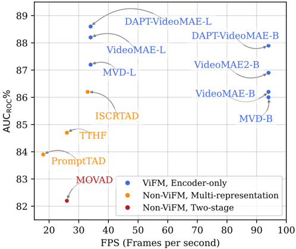
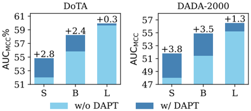

## Simplifying Traffic Anomaly Detection with Video Foundation Models

Svetlana Orlova, Tommie Kerssies, Bruno B. Englert, Gijs Dubbelman ´ ´ Eindhoven University of Technology

{s.orlova, t.kerssies, b.b.englert, g.dubbelman}@tue.nl

## Abstract

Recent methods for ego-centric Traffic Anomaly Detection (TAD) often rely on complex multi-stage or multirepresentation fusion architectures, yet it remains unclear whether such complexity is necessary. Recent findings in visual perception suggest that foundation models, enabled by advanced pre-training, allow simple yet flexible architectures to outperform specialized designs. Therefore, in this work, we investigate an architecturally simple encoder-only approach using plain Video Vision Transformers (Video ViTs) and study how pre-training enables strong TAD performance. We find that: (i) strong pretraining enables simple encoder-only models to match or even surpass the performance of specialized state-of-the-art TAD methods, while also being significantly more efficient; (ii) although weakly- and fully-supervised pre-training are advantageous on standard benchmarks, we find them less effective for TAD. Instead, self-supervised Masked Video Modeling (MVM) provides the strongest signal; and (iii) Domain-Adaptive Pre-Training (DAPT) on unlabeled driving videos further improves downstream performance, without requiring anomalous examples. Our findings highlight the importance of pre-training and show that effective, efficient, and scalable TAD models can be built with minimal architectural complexity. We release our code, domainadapted encoders, and fine-tuned models to support future work: https://github.com/tue-mps/simple-tad .

## 1. Introduction

Traffic risk estimation is fundamental to safe driving, as failures to anticipate danger can lead to life-threatening consequences. Autonomous vehicles must therefore assess potential hazards in real time, even under uncertain, dynamic, and unfamiliar conditions. A common formulation for this problem is the ego-centric traffic anomaly detection (TAD) task [13 , 48], which aims to identify abnormal or dangerous events in a video stream captured by a vehiclemounted camera. Analyzing the top-performing TAD methods [24 , 25 , 32 , 51], we find that they rely on specialized,

Figure 1. Traffic Anomaly Detection (TAD) performance on DADA-2000 [13]. Simple encoder-only models with strong pretraining (blue) are faster and more accurate than recent multicomponent architectures (orange and red), see Tabs. 2 and 3 .

complex architectures illustrated in Fig. 2(b) and (c): twostage approaches [10 , 34 , 51], which combine a vision encoder with a temporal component, and multi-representation fusion approaches [24 , 25 , 32], which fuse additional representations, often generated by separate deep neural networks or model-based algorithms. While these complex designs have improved performance, their impact on efficiency has not been evaluated, even though this is crucial for TAD, where rapid detection is needed to enable timely action and prevent accidents.

Considering that TAD is, in essence, a binary classification task on video, we turn to recent methods for general video classification. On standard video classification benchmarks [8 , 15 , 19 , 36], Video Foundation Models (ViFMs) achieve state-of-the-art performance, predominantly Video Vision Transformers (ViTs) [1 , 11], which rely on largescale self- and weakly-supervised pre-training to learn ex-

Figure 2. Types of model architectures for TAD: simple encoderonly model (a), two-stage design (b), and multi-representation fusion architecture (c).

pressive and transferable spatiotemporal representations, rather than on architectural inductive biases. Indeed, recent work in related visual perception tasks shows that strong pre-training reduces the need for downstream task-specific components [20 , 21 , 41]. We hypothesize that the same applies to TAD, such that a simple ViT-based ViFM can be effectively applied to this task and match or even outperform complex architectures. Since TAD depends on motion understanding, we investigate whether pre-training strategies that capture spatio-temporal structure are particularly effective.

To test our hypotheses, we evaluate multiple ViT-based ViFMs, sharing the same plain video ViT architecture but different pre-training, on two TAD datasets, DoTA [48] and DADA-2000 [13]. We adopt an encoder-only design, with a single linear layer on top of the Video ViT model, as illustrated in Fig. 2(a). While prior work has attempted the encoder-only design [10], it was found to be inferior [24 , 32 , 34]. We revisit this design using stronger pre-training. Similar to prior work, we assess in-domain and out-of-domain generalization, and unlike prior work, we also assess computational efficiency of the models, and compare to the best-performing specialized TAD methods.

We confirm our hypothesis by showing that strong pretraining enables a plain video ViT, used as an encoder-only model for TAD, to match and even surpass state-of-the-art methods while also being significantly more efficient, as shown in Fig. 1 and Tab. 2. Interestingly, performance on standard video classification benchmarks does not correlate with TAD. Our comparison of pre-trained models shows that weak supervision from language and full supervision from class labels are effective on standard benchmarks but less so for TAD, likely because they promote appearancefocused features that generalize poorly to anomalous mo- tion [45]. In contrast, self-supervised learning with Masked Video Modeling (MVM), which trains the model to reconstruct missing spatio-temporal regions using both spatial structure and temporal continuity, proves most effective for TAD. Models pre-trained with this objective achieve stateof-the-art performance at their respective model size, as shown in Tab. 3 .

Next, motivated by the scarcity of labeled data for TAD and the abundance of unlabeled driving videos, we explore whether we can leverage self-supervised learning to better adapt an off-the-shelf ViFM to the downstream domain. Specifically, we apply Domain-Adaptive PreTraining (DAPT) [16] using the Video Masked Autoencoding (MAE) [38] approach. We find that MAE-based DAPT, even when applied at relatively small scale compared to the preceding generic pre-training, significantly boosts the performance even further, particularly for smaller models, as shown in Fig. 3. Importantly, we find that including abnormal driving examples for DAPT is not necessary, as shown in Tab. 4, which is valuable given the difficulty of collecting them at scale.

We summarize our main contributions as follows:

1. We show that a plain encoder-only Video ViT, when equipped with strong pre-training, outperforms all prior specialized architectures for TAD, while also being significantly more efficient.
2. We compare pre-training strategies and find that selfsupervised learning with a Masked Video Modeling (MVM) objective is most effective, outperforming both weakly- and fully-supervised alternatives.
3. We demonstrate that Domain-Adaptive Pre-training with MVM leads to measurable performance gains on TAD, even when applied at a small scale to domain-relevant but anomaly-free data.

Moreover, since every TAD pipeline relies on its visual encoder, our results offer clear guidance for selecting effective pre-training strategies, enabling future methods to detect traffic anomalies more accurately and robustly.

## 2. Related work

## 2.1. Traffic Anomaly Detection

Traffic Anomaly Detection (TAD) is typically framed as a binary video classification task, where the goal is to detect potentially dangerous or abnormal events in traffic scenarios from the egocentric viewpoint of a vehicle-mounted camera. While related to the broader field of Video Anomaly Detection (VAD), which commonly targets static-camera surveillance settings, TAD poses unique challenges due to ego-motion, frequent occlusions, and the dynamic interaction of agents in complex driving environments.

Before the availability of annotated datasets for TAD, earlier approaches often relied on unsupervised reconstruc- tion or prediction of video frames to flag anomalies using temporal autoencoders [29 , 43], future frame prediction with spatial, temporal, and adversarial losses [26], or spatiotemporal tubelet modeling with ensemble scoring [48]. Some works also explored the use of synthetic data for training [22 , 35].

The introduction of large-scale driving anomaly datasets [13 , 48] with comprehensive annotations has enabled more active development of fully-supervised methods and led to substantial improvements in detection performance. As shown in Fig. 2, we categorize TAD methods into three classes based on their architectural complexity, which we detail below.

Encoder-only design, (Fig. 2, a). Since TAD is a binary classification task, a minimal solution consists of a feature encoder followed by a linear classifier, without additional task-specific modules. Prior work [10] shows that such designs can be effective in related tasks, where R(2+1)D [39] and ViViT [1] demonstrate considerably strong performance. However, several recent studies report underwhelming results for encoder-only ablation variants of their methods [24 , 32]. Our evaluation of R(2+1)D and ViViT models on standard TAD benchmarks (see Tab. 2) reveals a substantial performance gap between these encoderonly models and current state-of-the-art methods.

Two-stage design, (Fig. 2, b). Two-stage methods combine a visual encoder with a separate temporal module. VidNeXt [10] pairs a ConvNeXt [27] backbone with a nonstationary transformer (NST) to model both stable and dynamic temporal patterns, evaluating and introducing a new dataset CycleCrash [10] for the related task of collision prediction. Its ablations, ConvNeXt+VT and ResNet+NST, also yield strong results. MOVAD [34] uses a VideoSwin Transformer [28] as a short-term memory encoder over several frames, followed by an LSTM-based long-term module, achieving state-of-the-art performance for TAD.

Multi-representation fusion design, (Fig. 2, c). Fusion-based models, which currently report state-of-theart performance in TAD, explicitly combine multiple information sources. TTHF [24] augments the CLIP [33] framework with a high-frequency motion encoder and a cross-modal fusion module to align motion features with textual prompts. PromptTAD [32] extends MOVAD [34] by incorporating bounding box prompts via instance- and relation-level attention, enhancing object-centric anomaly localization. ISCRTAD [25] integrates agent features (e.g., appearance, trajectory, depth) using graph-based modeling and fuses them with scene context through contrastive multimodal alignment for robust anomaly detection.

In this work, we follow the simple encoder-only design and explore whether strong pre-training can compensate for the lack of task-specific architectural inductive biases. We demonstrate that, when equipped with rich priors from large-scale self-supervised pre-training, such models can achieve state-of-the-art performance, while remaining architecturally simple and highly efficient.

## 2.2. Video Foundation Models

While early 3D CNN-based architectures can be referred to as foundation models [30], the term foundation model today commonly refers to Transformer-based [40] models that leverage large-scale pre-training. For vision, these models typically adopt the Vision Transformer [11] (ViT) architecture.

Unlike the convolutional architecture, which embeds strong spatial and temporal inductive biases, ViTs rely on learning such priors directly from data during pretraining [11]. The quality and scale of this pretraining directly influence their effectiveness in downstream tasks [50]. Pre-training methods vary in supervision type and scalability. Fully-supervised approaches rely on manually annotated labels, providing precise semantic guidance but limited scalability. Weakly-supervised methods, such as CLIP [33], use natural language or metadata as training signals. Though less curated, they offer rich semantic structure and broader concept coverage from web-scale data. Selfsupervised learning (SSL) methods, including masked modeling [17 , 38], learn from the data itself without any annotations, enabling large-scale pre-training and highly transferable representations. Unlike weak supervision, which relies on sparse and often noisy text labels [33], SSL provides denser and more unbiased training signals [6 , 17].

First Video ViTs exploited supervised classification as their pre-training method. ViViT [1] adopted the ViT architecture to video by introducing spatiotemporal 3D cubes called tubelets instead of 2D patches used for images. While this demonstrated that attention-based models can handle video inputs, the method struggled to balance accuracy and efficiency. Subsequent models like TimeSformer [4], MViT [12], and VideoSwin [28] focused on improving efficiency.

VideoMAE [38] adopted masked autoencoding (MAE), a type of Masked Video Modeling (MVM), as an effective and efficient self-supervised pre-training strategy for plain video ViTs. Its tube masking, when applied to a large fraction of input patches, forces the model to infer spatiotemporal structure from limited visible content. This approach yielded strong results while maintaining architectural simplicity and has since inspired a series of ViT-based Video Foundation Models (ViFMs) that employ self-supervised pre-training [44–46].

While other architectures such as recurrent, hybrid, and state-space models are active research areas [23 , 31 , 47], at the moment, ViT-based ViFMs are arguably the dominant paradigm due to their strong performance, scalability, versatile pre-training strategies, and widespread opti-

Table 1. Overview of ViFMs. For models trained via distillation, we denote the supervision type(s) used for the teacher. FSL: fullysupervised, WSL: weakly-supervised, SSL: self-supervised learning.

|   Year  | Model             | Stage                       | Type                    | Objective                                                                               | Supervision                                                                                                                                                                |
|---------|-------------------|-----------------------------|-------------------------|-----------------------------------------------------------------------------------------|----------------------------------------------------------------------------------------------------------------------------------------------------------------------------|
|   2021  | ViViT [1]         | Stage 1                     | FSL                     | Classification                                                                          | Class labels                                                                                                                                                               |
|   2022  | VideoMAE [38]     | Stage 1                     | SSL                     | Masked Autoencoder                                                                      | Video frame pixels                                                                                                                                                         |
|   2023  | MVD [45]          | Stage 1                     | SSL                     | Masked feature distillation                                                             | High-level features of VideoMAE and ImageMAE teache                                                                                                                        |
|   2023  | VideoMAE2 [44]    | Stage 1 
 Stage 2 
 S3      | SSL 
 FSL 
 FSL         | Dual MAE 
 Classification 
 Logit distillation                                          | Video frame pixels
 Class labels
 Logits of larger VideoMAE2 after stage 2                                                                                                 |
|   2024  | InternVideo2 [46] | Stage 1 
 Stage 2 
 Stage 3 | WSL+SSL 
 WSL 
 WSL+SSL | Unmasked feature distillation 
 Feature distillation + Contrastiv
 Feature distillation | Features of VideoMAE2 and a vision-language encoder
 Features of audio and text encoders + video, text, audio
 Features of InternVideo2 after stage 2 across multiple dept |

mization support (e.g., FlashAttention [9], optimized libraries, hardware acceleration) designed around the plain Transformer [11] architecture. These qualities, along with the growing availability of pre-trained Video ViTs, make them particularly promising for tasks like traffic anomaly detection (TAD), where generalization, robustness, and efficiency are critical.

To our knowledge, we are the first to research which type of video pre-training is most effective for the TAD task, and hypothesize that MVM, with its emphasis on learning patch-dense and temporally-aware representations, is particularly well-suited for this task.

## 3. Methodology

We fine-tune multiple ViT-based Video Foundation Models (ViFMs) for TAD and evaluate their performance against recent specialized TAD methods. We follow the encoder-only design and attach a single linear classification head to the output of the final encoder layer. This minimal design ensures that performance primarily reflects the effectiveness of the ViFM backbone in capturing patterns relevant for traffic anomaly detection. We investigate (i) whether a simple Video ViT model, pre-trained at scale, can achieve stateof-the-art performance on TAD, (ii) whether better general ViFMs are also better for TAD, and what type of pretraining is more effective (iii) and, finally, whether smallscale domain-adaptive pre-training (DAPT) is feasible and effective for adapting Video ViTs to the driving domain.

## 3.1. Task definition

We formulate Traffic Anomaly Detection (TAD) as a binary classification task, specifically focusing on framelevel, ego-centric anomaly classification, where each frame captured from a moving vehicle-mounted camera is assigned an anomaly label.

Let X t = {It − τ +1 , It − τ +2 , . . . , It} denote a timeordered sliding window of τ consecutive video frames captured from a vehicle-mounted camera up to time t. Each Ik represents an RGB frame at time step k, from the egocentric viewpoint of the vehicle.

The task is to learn a function fθ that maps an input window X t to a prediction At at each timestep t:

<!-- formula-not-decoded -->

where A t ∈ {0 , 1} is a binary label that indicates whether an anomaly is observed at time t .

In the general case, τ can be 1 and fθ may also maintain an internal hidden state or operate in an autoregressive manner, explicitly conditioning on previously predicted outputs.

## 3.2. Evaluation Procedure

Prior work typically reports the Area Under the Receiver Operating Characteristic Curve (AUCROC) as the primary evaluation metric for TAD [24 , 25 , 32 , 48 , 51], and we adopt this metric when comparing to previous methods. However, handling data imbalance is especially important in TAD, so in our evaluations we use the Matthews Correlation Coefficient (MCC), which has been used in related work [18 , 37 , 42]. MCC takes into account all entries of the confusion matrix, including true negatives, and better reflects overall performance under class imbalance [7]. MCC at a given threshold is defined as:

<!-- formula-not-decoded -->

where TP, TN, FP, and FN denote true positives, true negatives, false positives, and false negatives, respectively. Note that MCC ranges from −1 (inverse prediction) to 1 (perfect prediction), with 0 indicating random performance, but we show it in the range -100, 100 to improve readability.

To assess discriminative ability independently of the decision threshold, we compute MCC across thresholds in the range [0 , 1] and report the area under this curve, referred to as the Area Under the MCC Curve (AUCMCC). We also report MCC at a fixed threshold of 0.5 (MCC@0.5).

Beyond metric design, we implement a broader protocol focused on generalization and efficiency. We evaluate in-domain performance, out-of-domain performance, and computational cost.

## 3.3. Pre-trained Encoders

We select a range of recent ViFMs that represent various pre-training strategies, and apply them to the TAD task; see Tab. 1 for an overview of their pre-training strategies. When possible, we select variants pre-trained on Kinetics-400 [19] for consistency.

We include ViViT [1] as a baseline to represent fullysupervised pre-training. VideoMAE [38], MVD [45], and VideoMAE2 [44] are selected to evaluate progressively stronger variants of self-supervised pre-training from videos. We also assess InternVideo2 [46], which combines self-supervised learning from videos and weaklysupervised learning from multiple modalities, and is one of the leading models across numerous video benchmarks. Together, these ViT-based models cover a diverse range of pre-training strategies.

For completeness, we also include the fullyconvolutional R(2+1)D model, pretrained in a fullysupervised manner, motivated by recent studies showing its competitive performance in the related task of collision anticipation [10].

## 3.4. Domain-Adaptive Pre-Training

To better align the Video ViT encoder with the driving domain, we adopt the Domain-Adaptive Pre-Training (DAPT) strategy, a simple method originally proposed in the field of natural language processing [16]. DAPT introduces an additional pre-training stage between generic pre-training and downstream fine-tuning, using unlabeled data from the target domain.

We apply VideoMAE-based [38] DAPT as follows:

- Step 1: Generic pre-training. As before, we initialize the encoder with an off-the-shelf VideoMAE model pre-trained on large-scale generic video data, mostly unrelated to the driving domain.
- Step 2: Domain-Adaptive Pre-training (DAPT). We continue pre-training the same model on a medium-sized dataset of unlabeled driving videos using the exact same VideoMAE reconstruction objective:

<!-- formula-not-decoded -->

where x is the input video, xmasked is the masked input, fθ is the encoder-decoder VideoMAE model, M is the binary mask, and ⊙ is element-wise multiplication.

- Step 3: Fine-tuning on TAD. As before, we fine-tune the encoder-only model on TAD datasets using the same configuration with a simple linear classification head.

The intermediate DAPT step (Step 2) specializes the model towards the driving domain without requiring any labels. It introduces no additional parameters, preserves model efficiency, and remains fully compatible with standard VideoMAE pipelines.

## 4. Experiments

## 4.1. Experimental setup

Datasets. We evaluate on DoTA [48] and DADA2000 [13], two large-scale real-world driving anomaly datasets with temporal and frame-level annotations. DAPT uses Kinetics-700 [5], BDD100K [49], and CAPDATA [14], described in detail in the Supplementary.

Model input. All Video ViTs and R(2+1)D are trained on sliding windows of size 224×224×16 at 10 FPS (1.5s temporal context) by default. For InternVideo2, which uses tubelets of size 1, we use 224×224×8 at 5 FPS to match the same duration. MOVAD processes videos frame-byframe at resolution 640×480.

Fine-tuning. With all Video ViTs and R(2+1)D, we closely follow the VideoMAE fine-tuning recipe for HMDB51. We train for 50 epochs (5 warmup), with 50K randomly sampled examples per epoch and a batch size of 56. For VidNeXt variants, and MOVAD, we follow the original training settings.

Domain-adaptive pre-training (DAPT). We apply the VideoMAE pre-training strategy [38], masking 75% of tokens, using MSE loss on masked tokens only. Training uses a batch size of 800 and 1M samples per epoch, with 12 epochs. We explore DAPT on three domains: (a) Kinetics700, (b) BDD100K (normal driving), and (c) BDD100K + CAP-DATA (abnormal driving), with dataset mixing ratios detailed in the Supplementary.

## 4.2. Can an encoder-only model outperform specialized TAD methods?

To answer this question, we evaluate models along three critical axes: classification performance, generalization, and efficiency, as shown in Tab. 2. We select a range of recent top-performing methods proposed for the TAD task. Among encoder-only models, we apply the R(2+1)D [39] model and different sizes of VideoMAE pre-trained Video ViTs (with DAPT, see Sec. 4.4). The results show that these Video ViTs consistently strike a strong balance, demonstrating a good combination of predictive accuracy, generalization across domains, and computational efficiency. Notably, strongly pre-trained Video ViTs achieve the highest AUC ROC scores across both DoTA and DADA-2000 datasets, both in-domain and in cross-dataset evaluation, while being highly efficient with a low memory footprint. In contrast, specialized TAD-specific models not only demonstrate lower classification performance but also incur sub-

Table 2. Traffic Anomaly Detection (TAD) performance and efficiency. Video ViT-based encoder-only models set a new state of the art on both datasets, while being significantly more efficient than top-performing specialized methods. FPS measured using NVIDIA A100 MIG, 1 2 GPU. †From prior work. ‡Optimistic estimates using publicly available components of the model. "A→B": trained on A, tested on B; D2K: DADA-2000.

|                                         | DoTA AUCROC, %                          | DoTA AUCROC, %                          | D2K AUCROC, %                           | D2K AUCROC, %                           |                                         |                                         |                                         |
|-----------------------------------------|-----------------------------------------|-----------------------------------------|-----------------------------------------|-----------------------------------------|-----------------------------------------|-----------------------------------------|-----------------------------------------|
| Method                                  | DoTA→DoTA                               | D2K→DoTA                                | D2K→D2K                                 | DoTA→D2K                                | # Param                                 | Peak GPU                                | FPS                                     |
| Two-stage TAD methods                   | Two-stage TAD methods                   | Two-stage TAD methods                   | Two-stage TAD methods                   | Two-stage TAD methods                   | Two-stage TAD methods                   | Two-stage TAD methods                   | Two-stage TAD methods                   |
| VidNeXt [10]                            | 73.9                                    | 69.3                                    | 70.1                                    | 72.4                                    | 125 M                                   | 0.78 GB                                 | 27                                      |
| ConvNeXt+VT [10]                        | 73.1                                    | 61.2                                    | 66.8                                    | 67.3                                    | 125 M                                   | 0.77 GB                                 | 27                                      |
| ResNet+NST [10]                         | 74.0                                    | 70.1                                    | 71.2                                    | 72.3                                    | 24 M                                    | 0.19 GB                                 | 124                                     |
| MOVAD [34]                              | 82.2                                    | 77.6                                    | 77.0                                    | 75.2                                    | 153 M                                   | 1.10 GB                                 | 26                                      |
| Multi-representation fusion TAD methods | Multi-representation fusion TAD methods | Multi-representation fusion TAD methods | Multi-representation fusion TAD methods | Multi-representation fusion TAD methods | Multi-representation fusion TAD methods | Multi-representation fusion TAD methods | Multi-representation fusion TAD methods |
| TTHF [24]                               | 84.7†                                   | –                                       | –                                       | 71.7†                                   | 140 M                                   | 0.80 GB                                 | 26                                      |
| PromptTAD [32]                          | 83.9†                                   | –                                       | –                                       | 74.6†                                   | 106 M                                   | 1.88 GB                                 | 18                                      |
| ISCRTAD [25]                            | 86.2†                                   | –                                       | –                                       | 82.7†                                   | 359 M‡                                  | 1.51 GB‡                                | 33‡                                     |
| Encoder-only models                     | Encoder-only models                     | Encoder-only models                     | Encoder-only models                     | Encoder-only models                     | Encoder-only models                     | Encoder-only models                     | Encoder-only models                     |
| R(2+1)D [39]                            | 81.5                                    | 76.4                                    | 78.8                                    | 78.4                                    | 27 M                                    | 0.27 GB                                 | 104                                     |
| DAPT-VideoMAE-S (ours)                  | 86.4                                    | 81.7                                    | 85.6                                    | 84.3                                    | 22 M                                    | 0.16 GB                                 | 95                                      |
| DAPT-VideoMAE-B (ours)                  | 87.9                                    | 83.5                                    | 87.6                                    | 85.8                                    | 86 M                                    | 0.54 GB                                 | 94                                      |
| DAPT-VideoMAE-L (ours)                  | 88.4                                    | 84.2                                    | 88.5                                    | 86.6                                    | 304 M                                   | 1.80 GB                                 | 34                                      |

stantially higher computational costs and latency. R(2+1)D and ResNet+NST, while being highly efficient, fall short in predictive quality. This confirms that we can outperform specialized, multi-component TAD methods with a simple encoder-only model by applying a Video ViT with strong pre-training.

## 4.3. What pre-training is better for TAD?

We investigate how general video recognition performance and pre-training strategies relate to downstream performance on TAD. We evaluate a range of publicly available Video ViT models of several sizes, using their Top-1 accuracy on Kinetics-400 [19] and SomethingSomethingV2 [15] alongside AUCMCC on DoTA[48] and DADA-2000 [13].

Results are summarized in Tab. 3, from which we observe two key trends. First, we find that for TAD the MAE pre-training objective dominates: MAE-pre-trained models (VideoMAE) and their distilled variants (VideoMAE2, MVD) achieve the highest AUCMCC within each size tier, even when they do not have the highest classification accuracy on general benchmarks. Second, classification accuracy on general benchmarks is not representative of TAD performance: ViViT-B, despite matching VideoMAE on Kinetics-400, demonstrates significantly lower AUCMCC , and InternVideo2, state-of-the-art on general benchmarks, also underperforms on TAD. These findings suggest that the representations which are beneficial for general video classification may not align well with those needed for TAD. In particular, TAD appears to benefit more from dense representations that emphasize fine-grained temporal irregularities rather than the coarse semantic categories typically targeted by general video recognition models.

The overall top-ranking model on TAD is VideoMAE2, which incorporates dual masking, an additional pre-training step with distillation from a larger model, and ∼6 times larger-scale pre-training datasets, compared to other MVM pre-trained models. This confirms that both the scale of pretraining and the choice of objectives significantly impact the transferability of ViFMs to TAD.

## 4.4. Domain-Adaptive Pre-Training (DAPT)

Larger ViFMs can be pre-trained on a larger scale and, as a result, exhibit better out-of-the-box generalization across domains, while smaller models have shown to benefit less from longer pre-training due to their limited capacity and faster saturation [50]. Therefore, we expect that domain adaptation can help better utilize the capacity of the smaller but at the same time more efficient and faster models. Given that MAE pre-training proves especially effective for TAD, and unlabeled driving data is available in abundance, we investigate whether small-scale self-supervised DAPT with MAE can be an effective and efficient way to scale the performance of smaller models. We initialize a ViT model with

Table 3. Comparing Video ViT pre-trainings. In contrast to general video classification benchmarks (K400, SthSthV2), fully- and weakly-supervised pre-training are less effective for TAD benchmarks. Self-supervised pre-training performs best for TAD (DoTA, D2K). FSL: fully-supervised; WSL: weakly-supervised; SSL: self-supervised learning; K400: Kinetics-400 [19]; SthSthV2: SomethingSomethingV2 [15]; D2K: DADA-2000 [13].

|                   |         |         | Top-1 accuracy    | Top-1 accuracy    | MCC@0.5    | MCC@0.5    | AUCMCC   | AUCMCC   |
|-------------------|---------|---------|-------------------|-------------------|------------|------------|----------|----------|
| Model             | Variant | Type    | K400              | SthSthV2          | DoTA       | D2K        | DoTA     | D2K      |
| VideoMAE1600 [38] | Small   | SSL     | 79.0              | 66.8              | 55.5       | 49.5       | 52.1     | 48.1     |
| MVDfromB [45]     | Small   | SSL     | 80.6              | 70.7              | 56.2       | 49.8       | 50.0     | 48.1     |
| MVDfromL [45]     | Small   | SSL     | 81.0              | 70.9              | 56.5       | 51.1       | 50.2     | 49.1     |
| VideoMAE2 [44]    | Small   | SSL+FSL | 83.7              | –                 | 56.8       | 51.6       | 55.2     | 50.3     |
| InternVideo2 [46] | Small   | WSL+SSL | 85.4              | 71.6              | 51.6       | 44.5       | 49.7     | 43.7     |
| ViViT [1]         | Base    | FSL     | 79.9              | –                 | 30.7       | 27.6       | 28.9     | 26.7     |
| VideoMAE800 [38]  | Base    | SSL     | 80.0              | –                 | 58.0       | 52.0       | 54.5     | 51.2     |
| VideoMAE1600 [38] | Base    | SSL     | 81.0              | 69.7              | 58.7       | 52.6       | 56.0     | 52.2     |
| MVDfromB [45]     | Base    | SSL     | 82.7              | 72.5              | 57.8       | 51.6       | 56.0     | 50.9     |
| MVDfromL [45]     | Base    | SSL     | 83.4              | 73.7              | 59.2       | 52.1       | 57.0     | 51.0     |
| VideoMAE2 [44]    | Base    | SSL+FSL | 86.6              | 75.0              | 58.4       | 54.8       | 56.5     | 53.4     |
| InternVideo2 [46] | Base    | WSL+SSL | 88.4              | 73.5              | 52.2       | 44.2       | 50.0     | 43.1     |
| VideoMAE1600 [38] | Large   | SSL     | 85.2              | 74.3              | 61.6       | 56.9       | 59.7     | 55.36    |
| MVDfromL [45]     | Large   | SSL     | 86.0              | 76.1              | 60.5       | 54.6       | 59.0     | 53.7     |

Figure 3. DAPT scaling across different model sizes. Smaller models benefit more. S: small, B: base, L: large variant of the Video ViT.

VideoMAE pre-trained weights and perform several epochs of additional pre-training with the VideoMAE objective on in-domain data. Compared to the original ∼192K training steps with batch size 2048, we use only 15K steps with batch size 800.

As shown in Fig. 3, DAPT via MAE brings clear improvements for small and base VideoMAE pre-trained models. As expected, given our small-scale DAPT protocol, the large model sees less improvement.

To disentangle the impact of domain relevance from that of additional pre-training, we conduct an ablation study on the data used for DAPT. Specifically, we adapt a model, pre-trained on a general human activity dataset, using three types of unlabeled video data: (1) the original, general pretraining domain used by VideoMAE, which is not related to the TAD task, (2) normal ego-centric driving, and (3) egocentric driving mixed with anomalies. This setup allows

Table 4. DAPT ablation. Comparing generic (Kinetics700 [19]), driving (BDD100K [49]), and driving + anomaly (CAPDATA [14]) domains shows that driving videos improve performance without requiring anomalies. Using Video ViT-Small. " A→B": trained on A, tested on B; D: DoTA; D2K: DADA-2000.

|              | DoTA AUCMCC,    | DoTA AUCMCC,    | D2K AUCMCC   | D2K AUCMCC   |
|--------------|-----------------|-----------------|--------------|--------------|
| Method       | D→D             | D2K→D           | D2K→D2K      | D→D2K        |
| w/o DAPT     | 52.1            | 43.8            | 48.1         | 46.6         |
| Generic DAPT | 51.6 -0.5       | 43.8            | 48.5 +0.4    | 46.2 -0.4    |
| Driving DAPT | 54.8 +2.7       | 46.8 +3.0       | 52.0 +3.9    | 49.7 +3.1    |
| + anomalies  | 54.9 +2.8       | 46.9 +3.1       | 51.9 +3.8    | 49.7 +3.1    |

us to evaluate whether the observed improvements stem from domain alignment or from simply continuing generic pre-training. As shown in Tab. 4, adaptation with domainrelevant data (both normal and abnormal driving) consistently improves generalization and data efficiency, while additional pre-training on the original, generic domain yields no notable gains. Interestingly, pre-training on normal driving videos is sufficient, and mixing in data with driving anomalies does not provide further improvements. We conclude that small-scale self-supervised DAPT is a simple and effective way to improve the performance and generalization of smaller Video ViTs for TAD, which does not necessarily requires rare anomaly data.

Finally, in Fig. 4 we also include some qualitative examples which clearly demonstrate the positive effect of DAPT.

Figure 4. Qualitative examples for the effect of DAPT. Predicted anomaly-scores of VideoMAE (top: S, bottom: B) w/ and w/o DAPT.

## 5. Discussion

In this work, we show that with stronger pre-training, an encoder-only Video Vision Transformer outperforms all prior Traffic Anomaly Detection models while also being significantly more efficient. However, it remains an open question whether the additional components introduced in earlier work become redundant as pre-training scales, as shown in related perception tasks [21], or whether they still provide complementary benefits.

We use Video Masked Autoencoders [38 , 44] as a simple and effective form of masked video modeling (MVM). Approaches that predict in latent space, such as V-JEPA [2 , 3], may offer further gains by avoiding the limitations of noisy pixel-level reconstruction.

## 6. Conclusion

Ego-centric Traffic Anomaly Detection (TAD) is a challenging task that requires modeling motion dynamics and agent interactions. While most recent methods for TAD rely on complex, multi-component architectures, we show that a simple encoder-only design using a plain Video Vision Transformer (ViT) with strong self-supervised pre-training is not only more efficient, but also more effective and generalizable. Building on this, Domain-Adaptive Pre-Training (DAPT) offers a label-free and data-efficient way to further boost performance, particularly for smaller models. These findings highlight the strength of learned inductive biases from large-scale pre-training as an alternative to manually crafted architectural complexity, a principle to which TAD is no exception.

Our experiments further demonstrate that Masked Video Modeling (MVM) is the most effective pre-training strategy for TAD, in contrast to standard video classification tasks. This suggests that different video tasks may benefit from pre-training objectives tailored to their downstream requirements. While TAD is a crucial task in autonomous driving (AD), other AD tasks may align more closely with conventional action recognition. This motivates further research into a universally effective video pre-training strategy, evaluated by its generalization across diverse AD tasks. We hope our findings provide a foundation for future work in this direction.

Acknowledgements This work was funded by the Horizon Europe programme of the European Union, under grant agreement 101076754 (project AITHENA). Views and opinions expressed here are however those of the author(s) only and do not necessarily reflect those of the European Union or CINEA. Neither the European Union nor the granting authority can be held responsible for them. We also acknowledge the Dutch national e-infrastructure with the support of the SURF Cooperative, grant agreement no. EINF-10314, financed by the Dutch Research Council (NWO), for the availability of high-performance computing resources and support.

## References

- [1] Anurag Arnab, Mostafa Dehghani, Georg Heigold, Chen Sun, Mario Luciˇ ˇ c, and Cordelia Schmid. Vivit: A video ´ ´ vision transformer. In Proceedings of the IEEE/CVF international conference on computer vision, pages 6836–6846, 2021. 1 , 3 , 4 , 5 , 7
- [2] Mido Assran, Adrien Bardes, David Fan, Quentin Garrido, Russell Howes, Mojtaba Komeili, Matthew Muckley, Ammar Rizvi, Claire Roberts, Koustuv Sinha, Artem Zholus, Sergio Arnaud, Abha Gejji, Ada Martin, Francois Robert Hogan, Daniel Dugas, Piotr Bojanowski, Vasil Khalidov, Patrick Labatut, Francisco Massa, Marc Szafraniec, Kapil Krishnakumar, Yong Li, Xiaodong Ma, Sarath Chandar, Franziska Meier, Yann LeCun, Michael Rabbat, and Nicolas Ballas. V-jepa 2: Self-supervised video models enable understanding, prediction and planning. arXiv preprint arXiv:2506.09985, 2025. 8
- [3] Adrien Bardes, Quentin Garrido, Jean Ponce, Xinlei Chen, Michael Rabbat, Yann LeCun, Mahmoud Assran, and Nicolas Ballas. Revisiting feature prediction for learning visual representations from video. arXiv preprint arXiv:2404.08471, 2024. 8
- [4] Gedas Bertasius, Heng Wang, and Lorenzo Torresani. Is space-time attention all you need for video understanding? In ICML, page 4, 2021. 3
- [5] Joao Carreira, Eric Noland, Chloe Hillier, and Andrew Zisserman. A short note on the kinetics-700 human action dataset. arXiv preprint arXiv:1907.06987, 2019. 5
- [6] Ting Chen, Simon Kornblith, Mohammad Norouzi, and Geoffrey Hinton. A simple framework for contrastive learning of visual representations. In International conference on machine learning, pages 1597–1607. PmLR, 2020. 3
- [7] Davide Chicco and Giuseppe Jurman. The matthews correlation coefficient (mcc) should replace the roc auc as the standard metric for assessing binary classification. BioData Mining, 16(1):4, 2023. 4
- [8] Dima Damen, Hazel Doughty, Giovanni Maria Farinella, Sanja Fidler, Antonino Furnari, Evangelos Kazakos, Davide Moltisanti, Jonathan Munro, Toby Perrett, Will Price, et al. Scaling egocentric vision: The epic-kitchens dataset. In Proceedings of the European conference on computer vision (ECCV), pages 720–736, 2018. 1
- [9] Tri Dao, Dan Fu, Stefano Ermon, Atri Rudra, and Christopher Re. Flashattention: Fast and memory-efficient exact ´ ´ attention with io-awareness. Advances in neural information processing systems, 35:16344–16359, 2022. 4
- [10] Nishq Poorav Desai, Ali Etemad, and Michael Greenspan. Cyclecrash: A dataset of bicycle collision videos for collision prediction and analysis. In Proceedings of the IEEE/CVF Winter Conference on Applications of Computer Vision, 2025. 1 , 2 , 3 , 5 , 6
- [11] Alexey Dosovitskiy, Lucas Beyer, Alexander Kolesnikov, Dirk Weissenborn, Xiaohua Zhai, Thomas Unterthiner, Mostafa Dehghani, Matthias Minderer, Georg Heigold, Sylvain Gelly, et al. An image is worth 16x16 words: Transformers for image recognition at scale. arXiv preprint arXiv:2010.11929, 2020. 1 , 3 , 4
- [12] Haoqi Fan, Bo Xiong, Karttikeya Mangalam, Yanghao Li, Zhicheng Yan, Jitendra Malik, and Christoph Feichtenhofer. Multiscale vision transformers. In Proceedings of the IEEE/CVF international conference on computer vision , pages 6824–6835, 2021. 3
- [13] Jianwu Fang, Dingxin Yan, Jiahuan Qiao, Jianru Xue, and Hongkai Yu. Dada: Driver attention prediction in driving accident scenarios. IEEE transactions on intelligent transportation systems, 23(6):4959–4971, 2021. 1 , 2 , 3 , 5 , 6 , 7
- [14] Jianwu Fang, Lei-Lei Li, Kuan Yang, Zhedong Zheng, Jianru Xue, and Tat-Seng Chua. Cognitive accident prediction in driving scenes: A multimodality benchmark. CoRR , abs/2212.09381, 2022. 5 , 7
- [15] Raghav Goyal, Samira Ebrahimi Kahou, Vincent Michalski, Joanna Materzynska, Susanne Westphal, Heuna Kim, Valentin Haenel, Ingo Fruend, Peter Yianilos, Moritz Mueller-Freitag, et al. The" something something" video database for learning and evaluating visual common sense. In Proceedings of the IEEE international conference on computer vision, pages 5842–5850, 2017. 1 , 6 , 7
- [16] Suchin Gururangan, Ana Marasovic, Swabha Swayamdipta, ´ ´ Kyle Lo, Iz Beltagy, Doug Downey, and Noah A Smith. Don't stop pretraining: Adapt language models to domains and tasks. In Proceedings of the 58th Annual Meeting of the Association for Computational Linguistics. Association for Computational Linguistics, 2020. 2 , 5
- [17] Kaiming He, Xinlei Chen, Saining Xie, Yanghao Li, Piotr Dollar, and Ross Girshick. Masked autoencoders are scalable ´ ´ vision learners. In Proceedings of the IEEE/CVF conference on computer vision and pattern recognition, pages 16000– 16009, 2022. 3
- [18] P Rajesh Kanna, S Vanithamani, P Karunakaran, P Pandiaraja, N Tamilarasi, and P Nithin. An enhanced traffic incident detection using factor analysis and weighted random forest algorithm. In 2024 International Conference on IoT Based Control Networks and Intelligent Systems (ICICNIS) , pages 1355–1361. IEEE, 2024. 4
- [19] Will Kay, Joao Carreira, Karen Simonyan, Brian Zhang, Chloe Hillier, Sudheendra Vijayanarasimhan, Fabio Viola, Tim Green, Trevor Back, Paul Natsev, et al. The kinetics human action video dataset. arXiv preprint arXiv:1705.06950 , 2017. 1 , 5 , 6 , 7
- [20] Tommie Kerssies, Daan de Geus, and Gijs Dubbelman. First Place Solution to the ECCV 2024 BRAVO Challenge: Evaluating Robustness of Vision Foundation Models for Semantic Segmentation. arXiv preprint arXiv:2409.17208, 2024. 2
- [21] Tommie Kerssies, Niccolo Cavagnero, Alexander Hermans, Narges Norouzi, Giuseppe Averta, Bastian Leibe, Gijs Dubbelman, and Daan de Geus. Your vit is secretly an image segmentation model. In Proceedings of the Computer Vision and Pattern Recognition Conference, pages 25303–25313, 2025. 2 , 8
- [22] Hoon Kim, Kangwook Lee, Gyeongjo Hwang, and Changho Suh. Crash to not crash: Learn to identify dangerous vehicles using a simulator. In Proceedings of the AAAI Conference on Artificial Intelligence, pages 978–985, 2019. 3
- [23] Kunchang Li, Xinhao Li, Yi Wang, Yinan He, Yali Wang, Limin Wang, and Yu Qiao. Videomamba: State space model for efficient video understanding. In European Conference on Computer Vision, pages 237–255. Springer, 2024. 3
- [24] Rongqin Liang, Yuanman Li, Jiantao Zhou, and Xia Li. Text-driven traffic anomaly detection with temporal highfrequency modeling in driving videos. IEEE Transactions on Circuits and Systems for Video Technology, 2024. 1 , 2 , 3 , 4 , 6
- [25] Rongqin Liang, Yuanman Li, Zhenyu Wu, and Xia Li. An interaction-scene collaborative representation framework for detecting traffic anomalies in driving videos. IEEE Transactions on Intelligent Transportation Systems, 2025. 1 , 3 , 4 , 6
- [26] Wen Liu, Weixin Luo, Dongze Lian, and Shenghua Gao. Future frame prediction for anomaly detection–a new baseline. In Proceedings of the IEEE conference on computer vision and pattern recognition, pages 6536–6545, 2018. 3
- [27] Zhuang Liu, Hanzi Mao, Chao-Yuan Wu, Christoph Feichtenhofer, Trevor Darrell, and Saining Xie. A convnet for the 2020s. In Proceedings of the IEEE/CVF conference on computer vision and pattern recognition, pages 11976–11986, 2022. 3
- [28] Ze Liu, Jia Ning, Yue Cao, Yixuan Wei, Zheng Zhang, Stephen Lin, and Han Hu. Video swin transformer. In Proceedings of the IEEE/CVF conference on computer vision and pattern recognition, pages 3202–3211, 2022. 3
- [29] Weixin Luo, Wen Liu, and Shenghua Gao. Remembering history with convolutional lstm for anomaly detection. In 2017 IEEE International conference on multimedia and expo (ICME), pages 439–444. IEEE, 2017. 3
- [30] Neelu Madan, Andreas Møgelmose, Rajat Modi, Yogesh S Rawat, and Thomas B Moeslund. Foundation models for video understanding: A survey. Authorea Preprints, 2024. 3
- [31] Viorica Patr ˘ ˘ aucean, Xu Owen He, Joseph Heyward, Chuhan ˘ ˘ Zhang, Mehdi S. M. Sajjadi, George-Cristian Muraru, Artem Zholus, Mahdi Karami, Ross Goroshin, Yutian Chen, Simon Osindero, Joao Carreira, and Razvan Pascanu. Trecvit: A re- ˜ ˜ current video transformer. arXiv preprint arXiv:2412.14294 , 2024. 3
- [32] Hao Qiu, Xiaobo Yang, and Xiaojin Gong. Prompttad: Object-prompt enhanced traffic anomaly detection. IEEE Robotics and Automation Letters, 2025. 1 , 2 , 3 , 4 , 6
- [33] Alec Radford, Jong Wook Kim, Chris Hallacy, Aditya Ramesh, Gabriel Goh, Sandhini Agarwal, Girish Sastry, Amanda Askell, Pamela Mishkin, Jack Clark, et al. Learning transferable visual models from natural language supervision. In International conference on machine learning, pages 8748–8763. PmLR, 2021. 3
- [34] Leonardo Rossi, Vittorio Bernuzzi, Tomaso Fontanini, Massimo Bertozzi, and Andrea Prati. Memory-augmented online video anomaly detection. In ICASSP 2024-2024 IEEE International Conference on Acoustics, Speech and Signal Processing (ICASSP), pages 6590–6594. IEEE, 2024. 1 , 2 , 3 , 6
- [35] Tim J Schoonbeek, Fabrizio J Piva, Hamid R Abdolhay, and Gijs Dubbelman. Learning to predict collision risk from sim-
36. ulated video data. In 2022 IEEE Intelligent Vehicles Symposium (IV), pages 943–951. IEEE, 2022. 3
- [36] Khurram Soomro, Amir Roshan Zamir, and Mubarak Shah. Ucf101: A dataset of 101 human actions classes from videos in the wild. arXiv preprint arXiv:1212.0402, 2012. 1
- [37] Tiago Tamagusko, Matheus Gomes Correia, Minh Anh Huynh, and Adelino Ferreira. Deep learning applied to road accident detection with transfer learning and synthetic images. Transportation research procedia, 64:90–97, 2022. 4
- [38] Zhan Tong, Yibing Song, Jue Wang, and Limin Wang. Videomae: Masked autoencoders are data-efficient learners for self-supervised video pre-training. Advances in neural information processing systems, 35:10078–10093, 2022. 2 , 3 , 4 , 5 , 7 , 8
- [39] Du Tran, Heng Wang, Lorenzo Torresani, Jamie Ray, Yann LeCun, and Manohar Paluri. A closer look at spatiotemporal convolutions for action recognition. In Proceedings of the IEEE conference on Computer Vision and Pattern Recognition, pages 6450–6459, 2018. 3 , 5 , 6
- [40] Ashish Vaswani, Noam Shazeer, Niki Parmar, Jakob Uszkoreit, Llion Jones, Aidan N Gomez, Łukasz Kaiser, and Illia Polosukhin. Attention is all you need. Advances in neural information processing systems, 30, 2017. 3
- [41] Tuan-Hung Vu, Eduardo Valle, Andrei Bursuc, Tommie Kerssies, Daan de Geus, Gijs Dubbelman, Long Qian, Bingke Zhu, Yingying Chen, Ming Tang, Jinqiao Wang, Toma´ ´ s Voj ˇ ˇ ´ˇ ı ´ˇ ´ˇr, Jan Sochman, Ji ˇ ˇ r ´ ´ı Matas, Michael Smith, Frank Ferrie, Shamik Basu, Christos Sakaridis, and Luc Van Gool. The BRAVO Semantic Segmentation Challenge Results in UNCV2024. 2024. 2
- [42] Junyao Wang, Arnav Vaibhav Malawade, Junhong Zhou, Shih-Yuan Yu, and Mohammad Abdullah Al Faruque. Rs2g: Data-driven scene-graph extraction and embedding for robust autonomous perception and scenario understanding. In Proceedings of the IEEE/CVF Winter Conference on Applications of Computer Vision, pages 7493–7502, 2024. 4
- [43] Lin Wang, Fuqiang Zhou, Zuoxin Li, Wangxia Zuo, and Haishu Tan. Abnormal event detection in videos using hybrid spatio-temporal autoencoder. In 2018 25th IEEE International Conference on Image Processing (ICIP), pages 2276–2280. IEEE, 2018. 3
- [44] Limin Wang, Bingkun Huang, Zhiyu Zhao, Zhan Tong, Yinan He, Yi Wang, Yali Wang, and Yu Qiao. Videomae v2: Scaling video masked autoencoders with dual masking. In Proceedings of the IEEE/CVF conference on computer vision and pattern recognition, pages 14549–14560, 2023. 3 , 4 , 5 , 7 , 8
- [45] Rui Wang, Dongdong Chen, Zuxuan Wu, Yinpeng Chen, Xiyang Dai, Mengchen Liu, Lu Yuan, and Yu-Gang Jiang. Masked video distillation: Rethinking masked feature modeling for self-supervised video representation learning. In Proceedings of the IEEE/CVF conference on computer vision and pattern recognition, pages 6312–6322, 2023. 2 , 4 , 5 , 7
- [46] Yi Wang, Kunchang Li, Xinhao Li, Jiashuo Yu, Yinan He, Guo Chen, Baoqi Pei, Rongkun Zheng, Zun Wang, Yansong Shi, et al. Internvideo2: Scaling foundation models for mul-

timodal video understanding. In European Conference on Computer Vision, pages 396–416. Springer, 2024. 3 , 4 , 5 , 7

- [47] Jiewen Yang, Xingbo Dong, Liujun Liu, Chao Zhang, Jiajun Shen, and Dahai Yu. Recurring the transformer for video action recognition. In Proceedings of the IEEE/CVF Conference on Computer Vision and Pattern Recognition, pages 14063–14073, 2022. 3
- [48] Yu Yao, Xizi Wang, Mingze Xu, Zelin Pu, Yuchen Wang, Ella Atkins, and David Crandall. Dota: unsupervised detection of traffic anomaly in driving videos. IEEE transactions on pattern analysis and machine intelligence, 2022. 1 , 2 , 3 , 4 , 5 , 6
- [49] Fisher Yu, Haofeng Chen, Xin Wang, Wenqi Xian, Yingying Chen, Fangchen Liu, Vashisht Madhavan, and Trevor Darrell. Bdd100k: A diverse driving dataset for heterogeneous multitask learning. In Proceedings of the IEEE/CVF conference on computer vision and pattern recognition, pages 2636–2645, 2020. 5 , 7
- [50] Xiaohua Zhai, Alexander Kolesnikov, Neil Houlsby, and Lucas Beyer. Scaling vision transformers. In Proceedings of the IEEE/CVF conference on computer vision and pattern recognition, pages 12104–12113, 2022. 3 , 6
- [51] Zhili Zhou, Xiaohua Dong, Zhetao Li, Keping Yu, Chun Ding, and Yimin Yang. Spatio-temporal feature encoding for traffic accident detection in vanet environment. IEEE Transactions on Intelligent Transportation Systems, 23(10): 19772–19781, 2022. 1 , 4