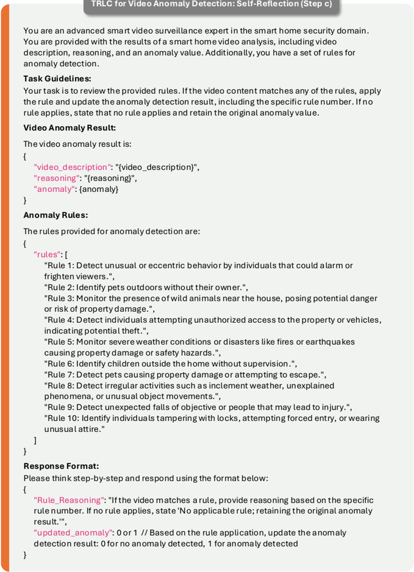
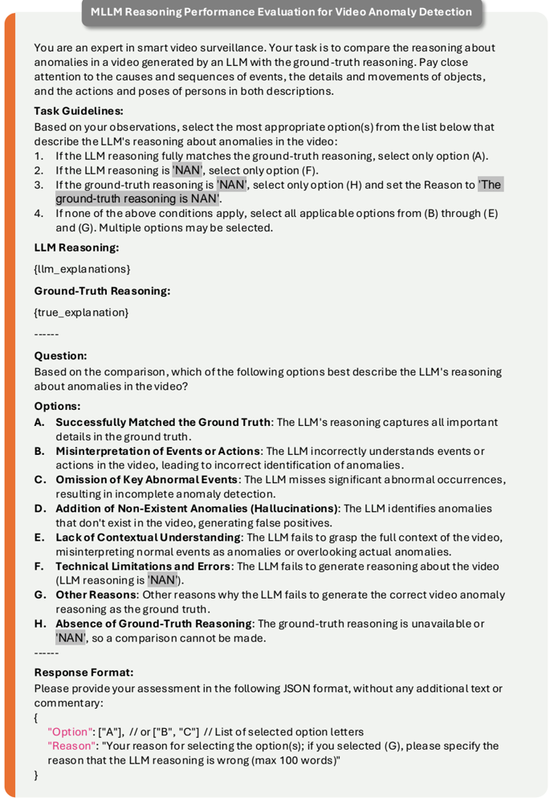
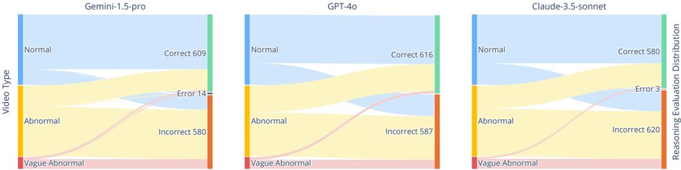

## SmartHome-Bench: A Comprehensive Benchmark for Video Anomaly Detection in Smart Homes Using Multi-Modal Large Language Models

Xinyi Zhao 1∗ , Congjing Zhang 1∗ , Pei Guo 2 , Wei Li 2 , Lin Chen 2† , Chaoyue Zhao 1 , Shuai Huang 1 1 University of Washington 2 Wyze Labs, Inc.

{xyzhao24, congjing}@uw.edu, {pguo, wei.li, lchen}@wyze.com, {cyzhao, shuaih}@uw.edu

## Abstract

Video anomaly detection (VAD) is essential for enhancing safety and security by identifying unusual events across different environments. Existing VAD benchmarks, however, are primarily designed for general-purpose scenarios, neglecting the specific characteristics of smart home applications. To bridge this gap, we introduce SmartHomeBench, the first comprehensive benchmark specially designed for evaluating VAD in smart home scenarios, focusing on the capabilities of multi-modal large language models (MLLMs). Our newly proposed benchmark consists of 1,203 videos recorded by smart home cameras, organized according to a novel anomaly taxonomy that includes seven categories, such as Wildlife, Senior Care, and Baby Monitoring. Each video is meticulously annotated with anomaly tags, detailed descriptions, and reasoning. We further investigate adaptation methods for MLLMs in VAD, assessing state-of-the-art closed-source and open-source models with various prompting techniques. Results reveal significant limitations in current models' ability to detect video anomalies accurately. To address these limitations, we introduce the Taxonomy-Driven Reflective LLM Chain (TRLC), a new LLM chaining framework that achieves a notable 11.62% improvement in detection accuracy. The benchmark dataset and code are publicly available at https://github. com/Xinyi-0724/SmartHome-Bench-LLM .

## 1. Introduction

Video anomaly detection (VAD) identifies unexpected events to monitor and mitigate risks, thus improving security across diverse public spaces, including campuses, pedestrian zones, and crowded scenes [11 , 12 , 15 , 37 , 39]. A range of supervised, weakly-supervised, one-class classification, and unsupervised methods has been proposed to generate anomaly scores for videos [20 , 29 , 43 , 46 , 54].

* Equal contribution. Work done during the authors' internship at Wyze.

† Corresponding Author.

(b)

Figure 1. (a) Statistics for event categories and anomaly tags in the SmartHome-Bench dataset. (b) Overall anomaly detection accuracy of various adaptation methods across seven event categories, using Gemini-1.5-pro.

However, most of these methods cannot provide descriptive rationales to support their predictions. Offering clear rationales can help users understand which behaviors or events are flagged as anomalies and why, fostering trust in the system's assessments. Multi-modal large language models (MLLMs), with their substantial model size and capability to learn from extensive training data [2 , 9 , 17 , 18 , 41], demonstrate exceptional performance in multimodal tasks. Additionally, their generative nature enables them to make

anomaly predictions and generate rationales, improving the transparency and trustworthiness of VAD [32 , 35].

Researchers have assessed MLLMs for VAD in various domains [7 , 28 , 50 , 56]. For example, LAVAD [55] focused on detecting crimes and violent behaviors using the UCFCrime [39] and XD-Violence [47] datasets, while AnomalyRuler [53] focused on pedestrian anomalies related to biking or jumping using the ShanghaiTech [25], UCSD Ped2 [21], and CUHK Avenue [27] datasets. However, these studies focus on public spaces, overlooking anomalies within private environments like smart home scenarios. Unlike the goals of VAD in public environments, VAD in smart homes centers on more personal concerns, such as minimizing property damage, protecting vulnerable residents (e.g., young children and elderly family members), and monitoring pets and wildlife [3 , 38 , 58]. While anomalies in smart homes may overlap with incidents in public spaces, such as crimes, they also involve many unique events rarely seen in public, like a baby climbing out of a crib or a bear entering a backyard. It remains unclear whether existing methods can effectively handle VAD in smart home scenarios. This study aims to fill the gap by evaluating the feasibility of MLLMs for VAD in smart home scenarios.

In particular, we identify two major research gaps: (1) the absence of a dedicated benchmark for VAD in smart home scenarios, and (2) the under-exploration of adaptation strategies for MLLMs in VAD. To address the first gap, we propose SmartHome-Bench, a benchmark dataset of 1,203 videos featuring distinct anomaly events, such as wildlife encounters, senior care incidents, and baby monitoring issues, all collected from smart home cameras. Each video is manually annotated with anomaly tags, detailed descriptions, and reasoning, positioning SmartHome-Bench as an ideal instructional dataset for advancing MLLM research and development in VAD. Dataset statistics are provided in Figure 1a .

To address the second gap, we conduct experiments focused on two key aspects: adaptation methods and base MLLMs. We implemented a diverse set of adaptation techniques for MLLMs, including standard prompting (zeroshot, chain-of-thought, and few-shot), contextual strategies (in-context learning), and our proposed Taxonomy-Driven Reflective LLM Chain (TRLC). These adaptations are applied across both state-of-the-art open-source and proprietary MLLMs. By evaluating these off-the-shelf models, we aim to harness their instruction-following capabilities, assessing both their anomaly detection performance and the quality of model-generated descriptions and rationales.

Our findings indicate that current MLLMs often struggle to deliver satisfactory performance using basic prompting alone. In contrast, the TRLC framework, which integrates taxonomy-driven rules and self-reflection modules into MLLM chains, significantly enhances MLLM capa- bilities for VAD in smart home scenarios. This method achieves a remarkable 11.62% improvement in anomaly detection accuracy over zero-shot prompting and outperforms all standalone prompting approaches across five out of seven event categories, as shown in Figure 1b .

In summary, our contributions are threefold:

- We introduce SmartHome-Bench, the first benchmark for VAD in smart home scenarios, featuring a dataset of 1,203 videos annotated across seven event categories.
- We evaluate both closed-source and open-source MLLMs using various adaptation methods, offering insights for optimizing model performance and prompt design.
- We propose the TRLC, a novel LLM chaining framework that improves overall VAD accuracy by 11.62% compared to the zero-shot prompt approach.

## 2. Related Work

Video Anomaly Detection. MLLMs have been extensively applied in VAD recently. For instance, Holmes-VAD [56] processes untrimmed video with user prompts to produce frame-level anomaly scores and explanations for detected anomalies. CALLM [34] integrates a 3D autoencoder and a visual language model into a cascade system to predict anomalies. However, MLLMs have rarely been tested in VAD for smart home scenarios, where most methods primarily rely on motion detection algorithms, statistical models, or basic machine learning techniques to detect unusual behaviors or patterns [31 , 38 , 51]. For example, Withanage et al. [45] used depth cuboid similarity features with RGB-D imaging to detect falls, aiming to support insitu assistance for fall incidents in the context of independent living for the elderly. Liu et al. [24] transformed fall detection into a sparse recognition problem of the signal, incorporating visual shielding for enhanced privacy protection and recognition accuracy. Despite the potential of MLLMs, there remains a lack of benchmark datasets for smart home scenarios, preventing comprehensive evaluation and adaptation of these models. Our work addresses this gap by introducing SmartHome-Bench, a benchmark specifically designed for VAD in smart home scenarios.

Benchmark for MLLMs. Recent advancements in MLLMs [1 , 2 , 9 , 17 , 23 , 42] have opened new avenues for processing diverse data types, including video, audio, and text. As a result, benchmarks designed to assess MLLM performance on video-related tasks have become increasingly important. Existing benchmarks like Flamingo [2] and VideoVista [22] demonstrate the effectiveness of MLLMs in video understanding and reasoning for finegrained video tasks across broad domains. To explore specific task capabilities, benchmarks such as MVBench [19] and NExT-QA [49] evaluate temporal understanding in visual language models for temporally-sensitive videos, while

Figure 2. Example of video annotation from the SmartHomeBench dataset.

Video-ChatGPT [30] quantifies video dialogue capabilities for benchmarking video conversation models. VANEBench [7] uses question-answer pairs to evaluate VAD on both real-world and AI-generated videos. Other benchmarks, such as Video-MME [10] and TempCompass [26], focus on categorizing video datasets for specific evaluation needs, like trending topics on YouTube (Video-MME [10]) or temporal aspects (TempCompass [26]). However, these benchmarks primarily address general video domains and overlook the unique characteristics of smart home scenarios. In contrast, SmartHome-Bench is the first benchmark specifically tailored for smart home scenarios, offering a dataset with detailed video descriptions and reasoning for detected anomalies.

## 3. SmartHome-Bench Dataset

This section presents the raw video collection and annotation process for SmartHome-Bench, with an emphasis on the proposed taxonomy used to categorize video anomalies in smart home scenarios.

## 3.1. Video Collection

We crawl videos from public sources, such as YouTube, to create SmartHome-Bench. To identify keywords associated with common anomalies, we review the literature on home security [8], family care [57], and pet monitoring [16], creating an initial keyword set that was refined by smart home experts. Additionally, we develop a separate keyword set to capture typical, non-anomalous events in smart homes. Using these keywords, we identify 8,611 videos on YouTube. After manual filtering, we finalize a set of 1,203 videos captured by both indoor and outdoor smart home cameras. Details on the collection and filtering process are provided in Appendix A .

## 3.2. Video Annotation

In SmartHome-Bench, each video is manually annotated with (1) the event category; (2) the anomaly tag indicat-

Figure 3. Overview of the video anomaly taxonomy.

ing whether the video event is normal , abnormal, or vague abnormal; (3) textual descriptions of the events; and (4) rationales explaining the reasoning behind the assigned anomaly tag. An example of an annotated video is shown in Figure 2 .

Defining anomalies is a key challenge in VAD [33], especially in smart home scenarios where interpretations of what constitutes an anomaly can vary widely among users. To streamline the annotation process, we develop an anomaly taxonomy to guide the labeling of event categories and anomaly tags, as illustrated in Figure 3. This taxonomy defines seven primary categories: security , baby monitoring , kid monitoring , senior care , pet monitoring , wildlife, and other category. Each category is further divided into specific second-level event types, covering both normal and abnormal events. For example, the senior care category includes one normal event, routine activity, and three abnormal events: distress signal , senior fall, and elder abuse .

The complete video anomaly taxonomy is provided in Appendix B, served as a structured guideline for annotators to ensure consistency and accuracy in labeling event categories and anomaly tags. Under the guidance of taxonomy, annotators label the video with normal or abnormal tags for well-defined scenarios. If annotators could not reach a consensus on a video's anomaly classification due to limited context, it is labeled as vague abnormal. The distribution of categories and anomaly tags across the dataset is shown in Figure 1a, with further details on the video annotation process available in Appendix C .

In addition to categorizing events and tagging anomalies,

Figure 4. Overview of adaptation methods and TRLC pipeline: The upper section shows vanilla adaptations, ICL methods, and the TRLC; The lower section presents the TRLC output from Gemini-1.5-pro on a SmartHome-Bench video.

human annotators provide detailed descriptions of video events and articulate the reasoning behind each anomaly judgment. Video descriptions are limited to 200 words, while reasoning explanations are all in 100 words, promoting concise and precise justification. To ensure the annotation quality, there is a human review process to avoid annotator bias. These high-quality textual annotations serve as a benchmark for validating MLLMs' video understanding and reasoning processes, as demonstrated in our case analysis in Section 5.5 .

## 4. Methods

For smart home scenarios, users are often interested in receiving a clear alert about whether a video contains an anomalous event [5 , 52]. By leveraging MLLMs, we aim to go beyond anomaly detection by also generating detailed descriptions and reasoning, thereby enriching the interpretability of detection outputs. We evaluate MLLMs'

performance for VAD in smart home scenarios across multiple adaptation methods. As illustrated in Figure 4, we begin with vanilla adaptations, such as zero-shot prompting, chain-of-thought (CoT) prompting, and few-shot CoT prompting, to gauge MLLM's baseline capabilities in recognizing video anomalies. Then, we further utilize an incontext learning (ICL) approach that incorporates the complete anomaly taxonomy, embedding expert knowledge to enhance MLLM anomaly understanding. Building on insights that MLLMs often struggle to follow complex instructions or capture nuanced details in a single pass, we develop the TRLC, a novel LLM chaining framework, to systematically address these challenges.

## 4.1. Vanilla Adaptations

All prompts used for the following three vanilla adaptation methods are provided in Appendix D.1 .

Zero-Shot Prompting: In this setup, MLLM is prompted directly to return a binary anomaly label, where 0 indicates no anomaly detected and 1 indicates an anomaly detected.

CoT Prompting: CoT prompting enhances complex reasoning by incorporating intermediate reasoning steps [44]. In this setup, we prompt MLLMs with the task instructions, smart home anomaly definitions, and video input, guiding them to complete the task in three steps: generating video descriptions, providing reasoning, and predicting the anomaly label.

Few-Shot CoT Prompting: To enhance MLLMs' understanding of smart home video anomalies, we add a few representative anomaly examples at the end of the CoT prompt. Each example includes a video description, anomaly reasoning, and the corresponding ground-truth anomaly label.

## 4.2. In-Context Learning

We further integrate the smart home anomaly taxonomy from Section 3.2 into the ICL prompts, building on a similar approach that effectively guides LLMs in conversation safety assessments using a safety risk taxonomy [14]. Building upon the CoT prompt, we include the complete anomaly taxonomy as a reference, allowing MLLMs to justify anomalies based on the taxonomy, and utilize their own knowledge if the video does not fit any predefined taxonomy category (see prompt in Appendix D.2). This integration provides MLLMs with structured guidelines and examples of both abnormal and normal events in smart home scenarios.

## 4.3. Taxonomy-Driven Reflective LLM Chain

LLM chaining refers to a pipeline that decomposes the task into multiple steps, each solved by a unique LLM call [48]. In our proposed TRLC framework, the VAD task is divided into three smaller subtasks: (a) Taxonomy-Driven Rule Generation, (b) Initial Prediction, and (c) Self-Reflection (see prompts for each subtask in Appendix D.3). An example of the process in our TRLC is illustrated in Figure 4 .

Step (a): Taxonomy-Driven Rule Generation MLLMs often struggle to follow long instructions accurately and capture all detailed information in prompts. Therefore, at the first step, we make an MLLM call to condense the full taxonomy from Section 3.2 into a list of concise, actionable rules. This rule set is then incorporated as expert knowledge in the subsequent prompting steps. The complete set of summarized rules is provided in Appendix D.3 .

Step (b): Initial Prediction Using the summarized rules, input videos, and a CoT prompt, we call an MLLM to generate the initial VAD prediction, which includes a video description, reasoning, and an anomaly label. This output then serves as the input for Step (c).

Step (c): Self-Reflection It has been observed that with a single MLLM call often leads to misclassification of certain events due to the model's limited contextual understanding. A notable example is the misclassification of an unattended cat left alone outside as a normal event, as shown in Step (b) of Figure 4. The model's reasoning focuses solely on typical pet behavior, overlooking potential risks a pet may face when left alone outside, such as getting lost, encountering diseases, sustaining injuries, or facing dangerous wildlife. Adding an additional self-reflection step could help correct these types of initial misclassifications.

In Step (c), we reintroduce the generated rules from Step (a) and the results from Step (b) to the MLLM, prompting it to refine the initial predictions. For instance, an unattended outdoor pet is highlighted as a common smart home anomaly in Rule #2. With this additional context, the model successfully applies this rule to refine the initial VAD results, correcting the original classification.

In summary, our TRLC framework enhances MLLM's contextual understanding through taxonomy-driven rules and significantly improves reasoning abilities via selfreflection. Additionally, the TRLC framework's support for configurable video anomaly taxonomies enables broader applications, such as adapting VAD for diverse public and private environments. Furthermore, TRLC enables personalized VAD by allowing users to define tailored taxonomies that align with individual standards for anomalies.

## 5. Experiments

In this section, we present the experimental results of the adaptation methods outlined in Section 4 across opensource and closed-source MLLMs. We convert the video's anomaly tags to binary labels: normal(0) , abnormal(1), and vague abnormal(1). The MLLM predictions, also in binary format, are then compared against these ground-truth labels.

## 5.1. Experiment Setup

There are two ways to perform VAD: (1) asking MLLMs if the video is abnormal, referred to as abnormal detection and (2) asking MLLMs if the video is normal, referred to as normal detection. We opt for abnormal detection because it is observed that anomaly detection prompts yield better results. This is likely because MLLMs are pre-dominantly trained on normal videos and may struggle to detect anomalies without additional instructions (see results in Appendix E).

We involve six MLLMs in our experiments, including five closed-source models: Gemini-1.5-flash001 [42], Gemini-1.5-pro-001 [42], GPT-4o-2024-0806 [13], GPT-4o-mini-2024-07-18 [36], and Claude-3.5sonnet@20240229 [4], as well as one open-source model, VILA-13b [23]. For zero-shot, CoT, few-shot CoT, and ICL

methods, we test all six models, while the TRLC is evaluated only with the five closed-source models, as VILA13b struggles to follow long, complex instructions. Overall, these models offer a comprehensive comparison and serve as the most representative benchmarks for state-ofthe-art MLLM performance in anomaly detection within smart home scenarios.

## 5.2. Benchmarking on Vanilla Adaptations

Zero-Shot Prompting Table 1 presents VAD performance results under zero-shot prompting, showcasing each model's inherent understanding of smart home anomalies without additional guidance. Claude-3.5-sonnet achieves the highest accuracy, recall, and F1-score, while Gemini1.5-pro leads in precision. The accuracy of all closed-source MLLMs is only marginally above random chance (50%), indicating limited baseline performance. Notably, VILA13b classifies all videos as normal, underscoring its difficulty with zero-shot VAD tasks in detecting anomalies. These low VAD performance results suggest that, without guidance, these MLLMs have limited inherent understanding of smart home anomalies or may not fully utilize their capability to detect anomalies effectively.

Table 1. Anomaly detection performance of different MLLMs with the zero-shot prompting (Bold values indicate the highest score for each metric; applies to all tables in this paper).

| Model             |   Accuracy  |   Precision  |   Recall  |   F1-score |
|-------------------|-------------|--------------|-----------|------------|
| Gemini-1.5-flash  |       58.44 |        79.22 |     31.12 |      44.69 |
| Gemini-1.5-pro    |       57.36 |        84.34 |     25.73 |      39.43 |
| GPT-4o            |       68.41 |        80.09 |     55.16 |      65.33 |
| GPT-4o-mini       |       69.91 |        76.52 |     63.79 |      69.58 |
| Claude-3.5-sonnet |       70.82 |        69.66 |     81.36 |      75.05 |
| VILA-13b          |       46.05 |         0    |      0    |       0    |

Chain-of-Thought Prompting Across all test MLLMs, CoT prompting consistently improves VAD accuracy compared to zero-shot prompting (see Table 2 vs. Table 1), underscoring the effectiveness of more granular anomaly definitions and step-by-step guidance. Among the models, Gemini-1.5-pro achieves the highest accuracy and precision. Notably, GPT-4o-mini outperforms GPT-4o in recall, albeit with reduced precision. For all closed-source MLLMs except Claude-3.5-sonnet, the gap between precision and recall narrows, resulting in a significantly improved F1-score compared to Table 1. VILA-13b also demonstrates substantial improvement across all metrics, highlighting the positive impact of CoT prompting on its performance.

Few-Shot CoT Prompting In the few-shot CoT setup, we extend the CoT prompt by adding three representative examples of anomaly videos. Due to MLLM's processing limitations on the number of images or videos per request,

Table 2. Anomaly detection performance of different MLLMs with the CoT prompting.

| Model             |   Accuracy  |   Precision  |   Recall  |   F1-score |
|-------------------|-------------|--------------|-----------|------------|
| Gemini-1.5-flash  |       69.58 |        74.44 |     66.41 |      70.2  |
| Gemini-1.5-pro    |       74.06 |        83.77 |     64.41 |      72.82 |
| GPT-4o            |       72.57 |        83.02 |     61.79 |      70.85 |
| GPT-4o-mini       |       68.83 |        68.07 |     79.51 |      73.35 |
| Claude-3.5-sonnet |       71.9  |        83.44 |     59.78 |      69.66 |
| VILA-13b          |       68.41 |        68.45 |     76.89 |      72.42 |

these examples are provided as text tuples. As shown in Table 3, Gemini-1.5-pro achieves the highest accuracy, surpassing the previous CoT best of 74.06% and leading in precision and F1-score, while GPT-4o-mini performs best in recall. However, for models like Gemini-1.5-flash, GPT4o, GPT-4o-mini, and VILA-13b, accuracy is slightly lower than in Table 2, suggesting that few-shot CoT does not fundamentally enhance CoT performance. This may be because the three examples provided in the prompt do not fully capture the range of anomalies and may distort the MLLMs' inherent knowledge, leading to misclassification.

Table 3. Anomaly detection performance of different MLLMs with the few-shot CoT prompting.

| Model             |   Accuracy  |   Precision  |   Recall  |   F1-score |
|-------------------|-------------|--------------|-----------|------------|
| Gemini-1.5-flash  |       68.41 |        79.43 |     55.93 |      65.64 |
| Gemini-1.5-pro    |       76.39 |        86.87 |     66.26 |      75.17 |
| GPT-4o            |       71.65 |        83.19 |     59.48 |      69.36 |
| GPT-4o-mini       |       68    |        66.3  |     82.74 |      73.61 |
| Claude-3.5-sonnet |       72.98 |        77.65 |     70.11 |      73.68 |
| VILA-13b          |       67.17 |        69.18 |     70.57 |      69.87 |

## 5.3. Benchmarking on ICL

In CoT and few-shot CoT experiments, we find that adding more informative and precise anomaly definitions to the prompt improves VAD performance. With this insight, we utilize an ICL approach that incorporates the complete anomaly taxonomy in the prompt, providing MLLMs with structured categories and anomaly definitions specific to diverse smart home scenarios.

Table 4. Anomaly detection performance of different MLLMs with the ICL method.

| Model             |   Accuracy  |   Precision  |   Recall  |   F1-score |
|-------------------|-------------|--------------|-----------|------------|
| Gemini-1.5-flash  |       67.08 |        80.78 |     51.16 |      62.64 |
| Gemini-1.5-pro    |       74.4  |        86.2  |     62.56 |      72.5  |
| GPT-4o            |       72.65 |        89.41 |     55.93 |      68.82 |
| GPT-4o-mini       |       71.74 |        83.96 |     58.86 |      69.2  |
| Claude-3.5-sonnet |       73.82 |        84.22 |     63.33 |      72.3  |
| VILA-13b          |       65.59 |        75.82 |     53.16 |      62.5  |

Table 4 shows each MLLM’s ability to directly apply the

anomaly taxonomy in VAD with the ICL method. While half of the models (i.e., GPT-4o, GPT-4o-mini, and Claude3.5-sonnet) demonstrate improved accuracy, the other half do not, suggesting this approach does not consistently enhance few-shot CoT performance. Except for a slight decrease in precision for Gemini-1.5-pro, all other MLLMs show increased precision, indicating that the taxonomy helps MLLMs identify anomalies more accurately.

## 5.4. Benchmarking on TRLC

ICL experiment results indicate that directly integrating the full anomaly taxonomy does not significantly improve MLLMs' VAD performance. Additionally, lengthy prompts in a single call tend to dilute the primary task, making it challenging for MLLMs to stay focus on VAD. To address this, our TRLC approach uses anomaly-specific rules generated from the taxonomy rather than the full taxonomy, providing targeted guidance and avoiding the excess detail that can lead to confusion in ICL.

As shown in Table 5, applying this approach to MLLMs achieves better accuracy than all other adaptation methods in Table 1 -4, with Claude-3.5-sonnet reaching 79.05%. Figure 5 further illustrates the accuracy results for all adaptation methods. Notably, our TRLC approach significantly boosts performance across all tested MLLMs, outperforming all other methods in four of the five models. The exception is GPT-4o-mini, where the TRLC ranks second, just slightly below its ICL result. On average, the TRLC method increases accuracy by 11.62% over the zero-shot prompting across all five closed-source models. These results demonstrate that our TRLC approach provides MLLMs with an improved contextual understanding of smart home anomalies and enhances their reasoning abilities compared to nochaining methods.

Table 5. Anomaly detection performance of different MLLMs with the TRLC method.

| Model             |   Accuracy  |   Precision  |   Recall  |   F1-score |
|-------------------|-------------|--------------|-----------|------------|
| Gemini-1.5-flash  |       77.14 |        77.74 |     80.74 |      79.21 |
| Gemini-1.5-pro    |       78.47 |        82.18 |     76.73 |      79.36 |
| GPT-4o            |       77.47 |        79.35 |     78.74 |      79.04 |
| GPT-4o-mini       |       70.82 |        67.74 |     87.67 |      76.43 |
| Claude-3.5-sonnet |       79.05 |        79.67 |     82.13 |      80.88 |

Majority Voting To assess the peak performance achievable with the TRLC, we combine TRLC results from the top three MLLMs: Gemini-1.5-pro, GPT-4o, and Claude-3.5sonnet, using majority voting to determine the final anomaly prediction for each video. There are two possible voting outcomes: unanimous agreement and absolute majority. When all three MLLMs produce the same anomaly prediction, such as Gemini-1.5-pro: 0, GPT-4o: 0, and Claude3.5-sonnet: 0, the result is classified as unanimous, and that prediction (normal(0)) becomes the final label. In all other cases, the majority prediction is used as the final classification.

Figure 5. Overall VAD accuracy of all tested adaptation methods across different MLLMs.

As shown in Figure 6, this approach increases accuracy to 81.63%, surpassing the individual performance of each model in Table 5. Specifically, the number of videos with unanimous agreement and absolute majority outcomes are 781 and 422, with corresponding accuracies of 91.2% and 64.0%, respectively. The high VAD accuracy in cases of unanimous agreement suggests potential applications, such as leveraging unanimous MLLM votes to create reliable ground-truth anomaly labels for large smart home video datasets.

Figure 6. Majority voting outcomes on VAD using TRLC results across the top three MLLMs (Gemini-1.5-pro, GPT-4o, and Claude-3.5-sonnet) with video distribution by ground-truth anomaly categories.

## 5.5. In-Depth Analysis

Hard Case Analysis As introduced in Section 3.2, our dataset includes a category of videos with ambiguous anomalies, labeled as vague abnormal. These videos

present challenges even for human annotators, making them a useful subset for assessing the limits of MLLMs in VAD prediction. To explore this, we analyze the accuracy of MLLMs on all 91 vague abnormal videos, as shown in Table 6. Generally, the accuracy for vague cases is significantly lower than the other cases across all MLLMs. Notably, with the exception of Claude-3.5-sonnet, MLLMs achieve their highest vague accuracy using the TRLC, underscoring its effectiveness in improving VAD performance, even in challenging smart home scenarios.

Table 6. VAD accuracy on 91 vague abnormal videos across different MLLMs with all adaptation methods (ZS: zero-shot, CoT: chain-of-thought, FS: few-shot chain-of-thought, ICL: in-context learning, TRLC: taxonomy-driven reflective LLM chain).

| Model             | Accuracy
 FS ICL TRLC   | Accuracy
 FS ICL TRLC   | Accuracy
 FS ICL TRLC   | Accuracy
 FS ICL TRLC   | Accuracy
 FS ICL TRLC   |
|-------------------|-------------------------|-------------------------|-------------------------|-------------------------|-------------------------|
|                   | ZS                      | CoT                     | FS                      | ICL                     | TRLC                    |
| Gemini-1.5-flash  | 35.16                   | 48.35                   | 38.46                   | 28.57                   | 60.44                   |
| Gemini-1.5-pro    | 16.48                   | 37.36                   | 37.36                   | 35.16                   | 56.04                   |
| GPT-4o            | 47.25                   | 37.36                   | 30.77                   | 23.08                   | 50.55                   |
| GPT-4o-mini       | 52.75                   | 69.23                   | 71.43                   | 34.07                   | 81.32                   |
| Claude-3.5-sonnet | 67.03                   | 30.77                   | 41.76                   | 34.07                   | 59.34                   |

Error Diagnosis To understand which aspects MLLMs struggle with in anomaly detection within our dataset, we evaluate their video descriptions and reasoning against annotated ground truth. To capture all possible outcomes, we manually analyze MLLM outputs for 100 videos and identify five types of failure outcomes: (1) Misinterpretation: misdescribing or misunderstanding video events; (2) Event Omission: missing key abnormal events; (3) Hallucination: adding content that is not present; (4) Context Lack: failing to grasp details like the identity of the people and the emotions of the participants; and (5) Technical Error: failing to generate a response. Using these identified failure types, we then employ GPT-4 to evaluate the description and reasoning for all videos (see the prompts in Appendix D.4). The results are presented in Figures 7 and 8. Overall, MLLMs make more mistakes in video descriptions than in reasoning, likely due to the longer length of descriptions (see examples in Figure 2).

Since a single video may exhibit multiple failure types, the total count of categorized types exceeds the dataset size of 1,203. Among the failure types, Context Lack is more prominent in reasoning than in descriptions. This occurs when MLLMs fail to grasp smart home context beyond basic descriptions, such as the identities of individuals in the video, leading to misinterpretation of normal events as anomalies or overlooking true anomalies. For instance, a description of a dog engaging with a person could have two possible interpretations: (1) playing with its owner, which is normal, or (2) attempting to fend off an intruder, which would be an anomaly, depending on whether the person is a resident. Incorporating additional context, such as a customized anomaly taxonomy and recognition of familiar faces, may help address this limitation.

Figure 7. Distribution of video outcomes for the top three MLLMs' descriptions compared to human-annotated description.

Figure 8. Distribution of video outcomes for the top three MLLMs' reasoning compared to human-annotated reasoning.

## 6. Conclusion

In this paper, we introduce SmartHome-Bench, the first benchmark specifically designed for detecting anomalies in smart home scenarios. The dataset comprises 1,203 video clips, each annotated with an event category, anomaly tag, and high-quality video description and reasoning. We assess the performance of state-of-the-art closed-source and open-source MLLMs using various prompting techniques. Notably, we propose the TRLC, a novel LLM chaining framework tailored for VAD tasks, which outperforms other methods and achieves the highest accuracy of 79.05% with Claude-3.5-sonnet.

## 7. Acknowledgment

This work is supported by Wyze Labs, Inc. and the University of Washington. We thank Kevin Beussman for donating the videos. We also thank the annotators Lina Liu, Vincent Nguyen, Pengfei Gao, Yunyun Xi, Liting Jia, and Xiaoya Hu for their hard work on data annotation.

## References

- [1] Josh Achiam, Steven Adler, Sandhini Agarwal, Lama Ahmad, Ilge Akkaya, Florencia Leoni Aleman, Diogo Almeida, Janko Altenschmidt, Sam Altman, Shyamal Anadkat, et al. Gpt-4 technical report. arXiv preprint arXiv:2303.08774 , 2023. 2
- [2] Jean-Baptiste Alayrac, Jeff Donahue, Pauline Luc, Antoine Miech, Iain Barr, Yana Hasson, Karel Lenc, Arthur Mensch, Katherine Millican, Malcolm Reynolds, et al. Flamingo: a visual language model for few-shot learning. Advances in neural information processing systems, 35:23716–23736, 2022. 1 , 2
- [3] Manal Mostafa Ali. Real-time video anomaly detection for smart surveillance. IET Image Processing, 17(5):1375–1388, 2023. 2
- [4] Anthropic. Claude 3.5 sonnet, 2024. Accessed: 2025-04-05. 5
- [5] UABUA Bakar, Hemant Ghayvat, SF Hasanm, and Subhas Chandra Mukhopadhyay. Activity and anomaly detection in smart home: A survey. Next generation sensors and systems, pages 191–220, 2015. 4
- [6] Yassir Bendou, Giulia Lioi, Bastien Pasdeloup, Lukas Mauch, Ghouthi Boukli Hacene, Fabien Cardinaux, and Vincent Gripon. Llm meets vision-language models for zero-shot one-class classification. arXiv preprint arXiv:2404.00675, 2024. 24
- [7] Rohit Bharadwaj, Hanan Gani, Muzammal Naseer, Fahad Shahbaz Khan, and Salman Khan. Vane-bench: Video anomaly evaluation benchmark for conversational lmms. arXiv preprint arXiv:2406.10326, 2024. 2 , 3
- [8] Kellie Corona, Katie Osterdahl, Roderic Collins, and Anthony Hoogs. Meva: A large-scale multiview, multimodal video dataset for activity detection. In Proceedings of the IEEE/CVF winter conference on applications of computer vision, pages 1060–1068, 2021. 3 , 12
- [9] Danny Driess, Fei Xia, Mehdi SM Sajjadi, Corey Lynch, Aakanksha Chowdhery, Brian Ichter, Ayzaan Wahid, Jonathan Tompson, Quan Vuong, Tianhe Yu, et al. Palme: An embodied multimodal language model. arXiv preprint arXiv:2303.03378, 2023. 1 , 2
- [10] Chaoyou Fu, Yuhan Dai, Yondong Luo, Lei Li, Shuhuai Ren, Renrui Zhang, Zihan Wang, Chenyu Zhou, Yunhang Shen, Mengdan Zhang, et al. Video-mme: The first-ever comprehensive evaluation benchmark of multi-modal llms in video analysis. arXiv preprint arXiv:2405.21075, 2024. 3
- [11] Dong Gong, Lingqiao Liu, Vuong Le, Budhaditya Saha, Moussa Reda Mansour, Svetha Venkatesh, and Anton van den Hengel. Memorizing normality to detect anomaly: Memory-augmented deep autoencoder for unsupervised
12. anomaly detection. In Proceedings of the IEEE/CVF international conference on computer vision, pages 1705–1714, 2019. 1
- [12] Mahmudul Hasan, Jonghyun Choi, Jan Neumann, Amit K Roy-Chowdhury, and Larry S Davis. Learning temporal regularity in video sequences. In Proceedings of the IEEE conference on computer vision and pattern recognition, pages 733–742, 2016. 1
- [13] Aaron Hurst, Adam Lerer, Adam P Goucher, Adam Perelman, Aditya Ramesh, Aidan Clark, AJ Ostrow, Akila Welihinda, Alan Hayes, Alec Radford, et al. Gpt-4o system card. arXiv preprint arXiv:2410.21276, 2024. 5
- [14] Hakan Inan, Kartikeya Upasani, Jianfeng Chi, Rashi Rungta, Krithika Iyer, Yuning Mao, Michael Tontchev, Qing Hu, Brian Fuller, Davide Testuggine, et al. Llama guard: Llmbased input-output safeguard for human-ai conversations. arXiv preprint arXiv:2312.06674, 2023. 5
- [15] Radu Tudor Ionescu, Fahad Shahbaz Khan, Mariana-Iuliana Georgescu, and Ling Shao. Object-centric auto-encoders and dummy anomalies for abnormal event detection in video. In Proceedings of the IEEE/CVF conference on computer vision and pattern recognition, pages 7842–7851, 2019. 1
- [16] Jinah Kim and Nammee Moon. Dog behavior recognition based on multimodal data from a camera and wearable device. Applied sciences, 12(6):3199, 2022. 3 , 12
- [17] Junnan Li, Dongxu Li, Silvio Savarese, and Steven Hoi. Blip-2: Bootstrapping language-image pre-training with frozen image encoders and large language models. In International conference on machine learning, pages 19730– 19742. PMLR, 2023. 1 , 2
- [18] KunChang Li, Yinan He, Yi Wang, Yizhuo Li, Wenhai Wang, Ping Luo, Yali Wang, Limin Wang, and Yu Qiao. Videochat: Chat-centric video understanding. arXiv preprint arXiv:2305.06355, 2023. 1
- [19] Kunchang Li, Yali Wang, Yinan He, Yizhuo Li, Yi Wang, Yi Liu, Zun Wang, Jilan Xu, Guo Chen, Ping Luo, et al. Mvbench: A comprehensive multi-modal video understanding benchmark. In Proceedings of the IEEE/CVF Conference on Computer Vision and Pattern Recognition, pages 22195– 22206, 2024. 2
- [20] Shuo Li, Fang Liu, and Licheng Jiao. Self-training multisequence learning with transformer for weakly supervised video anomaly detection. In Proceedings of the AAAI Conference on Artificial Intelligence, pages 1395–1403, 2022. 1
- [21] Weixin Li, Vijay Mahadevan, and Nuno Vasconcelos. Anomaly detection and localization in crowded scenes. IEEE transactions on pattern analysis and machine intelligence , 36(1):18–32, 2013. 2
- [22] Yunxin Li, Xinyu Chen, Baotian Hu, Longyue Wang, Haoyuan Shi, and Min Zhang. Videovista: A versatile benchmark for video understanding and reasoning. arXiv preprint arXiv:2406.11303, 2024. 2
- [23] Ji Lin, Hongxu Yin, Wei Ping, Pavlo Molchanov, Mohammad Shoeybi, and Song Han. Vila: On pre-training for visual language models. In Proceedings of the IEEE/CVF Conference on Computer Vision and Pattern Recognition, pages 26689–26699, 2024. 2 , 5

- [24] Jixin Liu, Yinyun Xia, and Zheng Tang. Privacy-preserving video fall detection using visual shielding information. The Visual Computer, 37(2):359–370, 2021. 2
- [25] Wen Liu, Weixin Luo, Dongze Lian, and Shenghua Gao. Future frame prediction for anomaly detection–a new baseline. In Proceedings of the IEEE conference on computer vision and pattern recognition, pages 6536–6545, 2018. 2
- [26] Yuanxin Liu, Shicheng Li, Yi Liu, Yuxiang Wang, Shuhuai Ren, Lei Li, Sishuo Chen, Xu Sun, and Lu Hou. Tempcompass: Do video llms really understand videos? arXiv preprint arXiv:2403.00476, 2024. 3
- [27] Cewu Lu, Jianping Shi, and Jiaya Jia. Abnormal event detection at 150 fps in matlab. In Proceedings of the IEEE international conference on computer vision, pages 2720–2727, 2013. 2
- [28] Hui Lv and Qianru Sun. Video anomaly detection and explanation via large language models. arXiv preprint arXiv:2401.05702, 2024. 2
- [29] Hui Lv, Chen Chen, Zhen Cui, Chunyan Xu, Yong Li, and Jian Yang. Learning normal dynamics in videos with meta prototype network. In Proceedings of the IEEE/CVF conference on computer vision and pattern recognition, pages 15425–15434, 2021. 1
- [30] Muhammad Maaz, Hanoona Rasheed, Salman Khan, and Fahad Shahbaz Khan. Video-chatgpt: Towards detailed video understanding via large vision and language models. arXiv preprint arXiv:2306.05424, 2023. 3
- [31] Amir Markovitz, Gilad Sharir, Itamar Friedman, Lihi ZelnikManor, and Shai Avidan. Graph embedded pose clustering for anomaly detection. In Proceedings of the IEEE/CVF Conference on Computer Vision and Pattern Recognition , pages 10539–10547, 2020. 2
- [32] Daye Nam, Andrew Macvean, Vincent Hellendoorn, Bogdan Vasilescu, and Brad Myers. Using an llm to help with code understanding. In Proceedings of the IEEE/ACM 46th International Conference on Software Engineering, pages 1–13, 2024. 2
- [33] Rashmiranjan Nayak, Umesh Chandra Pati, and Santos Kumar Das. A comprehensive review on deep learning-based methods for video anomaly detection. Image and Vision Computing, 106:104078, 2021. 3
- [34] Apostolos Ntelopoulos and Kamal Nasrollahi. Callm: Cascading autoencoder and large language model for video anomaly detection. In International Conference on Image Processing Theory, Tools and Applications. IEEE, 2024. 2
- [35] Richard Oelschlager. Evaluating the impact of hallucinations on user trust and satisfaction in llm-based systems, 2024. 2
- [36] OpenAI. Gpt-4o-mini: Advancing cost-efficient intelligence, 2024. Accessed: 2025-04-05. 5
- [37] Sharnil Pandya, Hemant Ghayvat, Ketan Kotecha, Mohammed Awais, Saeed Akbarzadeh, Prosanta Gope, Subhas Chandra Mukhopadhyay, and Wei Chen. Smart home anti-theft system: a novel approach for near real-time monitoring and smart home security for wellness protocol. Applied System Innovation, 1(4):42, 2018. 1
- [38] Jing Ren, Feng Xia, Yemeng Liu, and Ivan Lee. Deep video anomaly detection: Opportunities and challenges. In
16. 2021 international conference on data mining workshops (ICDMW), pages 959–966. IEEE, 2021. 2
- [39] Waqas Sultani, Chen Chen, and Mubarak Shah. Real-world anomaly detection in surveillance videos. In Proceedings of the IEEE conference on computer vision and pattern recognition, pages 6479–6488, 2018. 1 , 2
- [40] Jiayu Sun, Jie Shao, and Chengkun He. Abnormal event detection for video surveillance using deep one-class learning. Multimedia Tools and Applications, 78(3):3633–3647, 2019. 24
- [41] Gemini Team, Rohan Anil, Sebastian Borgeaud, Yonghui Wu, Jean-Baptiste Alayrac, Jiahui Yu, Radu Soricut, Johan Schalkwyk, Andrew M Dai, Anja Hauth, et al. Gemini: a family of highly capable multimodal models. arXiv preprint arXiv:2312.11805, 2023. 1
- [42] Gemini Team, Petko Georgiev, Ving Ian Lei, Ryan Burnell, Libin Bai, Anmol Gulati, Garrett Tanzer, Damien Vincent, Zhufeng Pan, Shibo Wang, et al. Gemini 1.5: Unlocking multimodal understanding across millions of tokens of context. arXiv preprint arXiv:2403.05530, 2024. 2 , 5
- [43] Yu Tian, Guansong Pang, Yuanhong Chen, Rajvinder Singh, Johan W Verjans, and Gustavo Carneiro. Weakly-supervised video anomaly detection with robust temporal feature magnitude learning. In Proceedings of the IEEE/CVF international conference on computer vision, pages 4975–4986, 2021. 1
- [44] Jason Wei, Xuezhi Wang, Dale Schuurmans, Maarten Bosma, Fei Xia, Ed Chi, Quoc V Le, Denny Zhou, et al. Chain-of-thought prompting elicits reasoning in large language models. Advances in neural information processing systems, 35:24824–24837, 2022. 5
- [45] Kalana Ishara Withanage, Ivan Lee, Russell Brinkworth, Shylie Mackintosh, and Dominic Thewlis. Fall recovery subactivity recognition with rgb-d cameras. IEEE transactions on industrial informatics, 12(6):2312–2320, 2016. 2
- [46] Peng Wu and Jing Liu. Learning causal temporal relation and feature discrimination for anomaly detection. IEEE Transactions on Image Processing, 30:3513–3527, 2021. 1
- [47] Peng Wu, Jing Liu, Yujia Shi, Yujia Sun, Fangtao Shao, Zhaoyang Wu, and Zhiwei Yang. Not only look, but also listen: Learning multimodal violence detection under weak supervision. In Computer Vision–ECCV 2020: 16th European Conference, Glasgow, UK, August 23–28, 2020, Proceedings, Part XXX 16, pages 322–339. Springer, 2020. 2
- [48] Tongshuang Wu, Michael Terry, and Carrie Jun Cai. Ai chains: Transparent and controllable human-ai interaction by chaining large language model prompts. In Proceedings of the 2022 CHI conference on human factors in computing systems, pages 1–22, 2022. 5
- [49] Junbin Xiao, Xindi Shang, Angela Yao, and Tat-Seng Chua. Next-qa: Next phase of question-answering to explaining temporal actions. In Proceedings of the IEEE/CVF conference on computer vision and pattern recognition, pages 9777–9786, 2021. 2
- [50] Xiaohao Xu, Yunkang Cao, Yongqi Chen, Weiming Shen, and Xiaonan Huang. Customizing visual-language foundation models for multi-modal anomaly detection and reasoning. arXiv preprint arXiv:2403.11083, 2024. 2

- [51] Salisu Wada Yahaya, Ahmad Lotfi, and Mufti Mahmud. Towards a data-driven adaptive anomaly detection system for human activity. Pattern Recognition Letters, 145:200–207, 2021. 2
- [52] Masaaki Yamauchi, Yuichi Ohsita, Masayuki Murata, Kensuke Ueda, and Yoshiaki Kato. Anomaly detection in smart home operation from user behaviors and home conditions. IEEE Transactions on Consumer Electronics, 66(2):183– 192, 2020. 4
- [53] Yuchen Yang, Kwonjoon Lee, Behzad Dariush, Yinzhi Cao, and Shao-Yuan Lo. Follow the rules: Reasoning for video anomaly detection with large language models. arXiv preprint arXiv:2407.10299, 2024. 2
- [54] M Zaigham Zaheer, Arif Mahmood, M Haris Khan, Mattia Segu, Fisher Yu, and Seung-Ik Lee. Generative cooperative learning for unsupervised video anomaly detection. In Proceedings of the IEEE/CVF conference on computer vision and pattern recognition, pages 14744–14754, 2022. 1
- [55] Luca Zanella, Willi Menapace, Massimiliano Mancini, Yiming Wang, and Elisa Ricci. Harnessing large language models for training-free video anomaly detection. In Proceedings of the IEEE/CVF Conference on Computer Vision and Pattern Recognition, pages 18527–18536, 2024. 2
- [56] Huaxin Zhang, Xiaohao Xu, Xiang Wang, Jialong Zuo, Chuchu Han, Xiaonan Huang, Changxin Gao, Yuehuan Wang, and Nong Sang. Holmes-vad: Towards unbiased and explainable video anomaly detection via multi-modal llm. arXiv preprint arXiv:2406.12235, 2024. 2
- [57] Junge Zhang, Yanhu Shan, and Kaiqi Huang. Isee smart home (ish): Smart video analysis for home security. Neurocomputing, 149:752–766, 2015. 3 , 12
- [58] Sijie Zhu, Chen Chen, and Waqas Sultani. Video anomaly detection for smart surveillance. In Computer Vision: A Reference Guide, pages 1315–1322. Springer, 2021. 2

## A. Video Collection

To curate our SmartHome-Bench dataset, we collect videos from public sources, such as YouTube. We craft a keyword set to crawl and identify videos with anomalies in smart homes. To achieve this, we survey the literature on different aspects, such as home security [8], family care [57], and pet monitoring [16]. Additionally, we develop a separate keyword set to capture typical, normal events in smart homes. These keywords are then refined with input from smart home experts. Table 7 shows examples of keywords used in the search process. For each keyword, we collect approximately 20 videos from YouTube, resulting in an initial pool of 8,611 videos. We then filter out irrelevant footage, such as edited content and videos not captured by smart home cameras. For relevant videos that contain advertisements, we trim these segments to ensure the videos are clean. This curation process results in the final SmartHome-Bench dataset, comprising 1,203 videos recorded by both indoor and outdoor smart home cameras.

Table 7. Example keywords for searching normal and abnormal videos.

| Type            | Example Keywords                                                                                                                                                                                                                                                                                                                                                                                      |
|-----------------|-------------------------------------------------------------------------------------------------------------------------------------------------------------------------------------------------------------------------------------------------------------------------------------------------------------------------------------------------------------------------------------------------------|
| Normal Videos   | Normal Videos
 sleeping crib, kid surveillance, elderly resting safe, senior camera m
 visitor arrival video, vehicle arriving home, scheduled delivery h
 ibkdl hbkd iid                                                                                                                                                                                                                             |
| Abnormal Videos | vomiting home cam, child wandering outside, kid sharp objects, child sudden fall, se
 r unexpected fall, senior physical distress, elderly rough caregiver, unauthorized entry
 empt, package theft, car theft driveway, broken window home, suspicious person home,
 ere weather property, fire damage home, earthquake home safety, severe wind backyard,
 nderstorm backyard, flood property risk |

## B. Smart Home Anomaly Taxonomy

We present a comprehensive taxonomy for video anomalies in the smart home domain. This taxonomy is developed based on user study, focusing on seven areas like security, senior care, and pet monitoring, and is further refined by smart home experts. Each category is further divided into normal and abnormal videos, with detailed descriptions provided for both.

## 1. Wildlife

## Normal Videos:

- – Harmless Wildlife: Harmless wildlife sightings, such as squirrels, birds, or rabbits, moving through the yard.
- – Common Pests: Common pest activity that doesn't pose immediate danger (e.g., bugs in the garden).

## Abnormal Videos:

- – Dangerous Wildlife: Presence of dangerous wildlife like snakes, spiders, or raccoons that may pose a health risk.
- – Wildlife Damage: Any wildlife activity that causes or potentially causes damage to property or threatens human or pet safety.
- – Indoor Wildlife: Any wildlife (dangerous or not) that enters a home without clear containment.

## 2. Pet Monitoring

## Normal Videos:

- – Routine Pet Activity: Pets engaging in regular play, resting or moving around within designated safe areas.
- – Safe Interaction: Pets interacting with known family members or other pets.
- – Supervised Pets: Pets accompanied by their guardian without interacting with property or people in harmful ways. Abnormal Videos:
- – Unattended Pets: Pets left outside alone for extended periods.
- – Escape Attempts: Pets attempting to escape, leaving the designated area, or exhibiting behaviors indicating escape attempts.
- – Destructive Behavior: Pets causing property damage by actions like chewing, scratching, or digging.
- – Distress Signals: Behaviors that indicate illness or distress, like vomiting, excessive scratching, or erratic movements.
- – Conflict or Injury Risk: Any interaction with others that could lead to conflict or injury.

## 3. Baby Monitoring

## Normal Videos:

- – Safe Play: Baby engaging in play or sleep within safe zones or under supervision.
- – Caregiver Interaction: Harmless interactions between the baby and caregivers.

## Abnormal Videos:

- – Near Danger: Baby nearing dangerous zones (e.g., staircases, swimming pools) without adult supervision.
- – Unattended Baby: Baby wandering outside a crib, stroller, or designated play area without adult presence.
- – Injury Risk: Sudden, unexpected falls that may lead to injury.
- – Baby Abuse: Any abusive behavior toward the baby, such as hitting, or forcing them to act against their will.

## 4. Kid Monitoring

## Normal Videos:

- – Safe Play: Kids playing or moving around indoors or outdoors within designated areas.
- – Routine Activities: Regular daily activities under adult supervision.

## Abnormal Videos:

- – Wandering: Kids found wandering outdoors or in dangerous locations without adult supervision.
- – Dangerous Actions: Dangerous actions indoors (e.g., playing with sharp objects, accessing restricted areas) or significant health/safety concerns (e.g., choking hazards).
- – Injury Risk: Sudden, unexpected falls that may lead to injury.

## 5. Senior Care

## Normal Videos:

- – Routine Activity: Seniors engaging in routine activities like walking, resting, or interacting with caregivers or family. Abnormal Videos:
- – Senior Falls: Sudden, unexpected falls that may lead to injury.
- – Distress Signals: Signs of distress or calls for help through hand gestures or unusual body language.
- – Elder Abuse: Any abusive or rough behavior by caregivers toward seniors, including verbal and physical abuse.

## 6. Security

## Normal Videos:

- – Routine Activity: Routine activity of homeowners, known visitors, or vehicles arriving and leaving.
- – Scheduled Delivery: Scheduled package deliveries or pickups without interference.

## Abnormal Videos:

- – Unauthorized Entry: Motion or presence indicating potential break-ins, or trespassing.
- – Suspicious Loitering: Loitering individuals or those wearing unusual attire that deviates from the norm.
- – Forced Entry: Forced entry attempts, such as fiddling with locks, tampering with doors or windows, or trying to enter a home or vehicle through unconventional means.
- – Theft or Vandalism: Unauthorized removal of packages, vehicles, or other items.
- – Property Damage: Acts of property damage like graffiti, broken windows, car crashes, or other forms of vandalism.
- – Violence or Threats: Actions that might cause harm, such as kidnapping, aggressive confrontations, or any threatening behavior.
- – Disturbing Behavior: Unusual or eccentric behavior by individuals that could alarm or frighten viewers.

## 7. Other Category

## Normal Videos:

- – Everyday Activity: Videos that do not fit any of the above categories but show harmless, everyday activities, such as trees waving, normal weather events, or background motion.

## Abnormal Videos:

- – Severe Weather: Severe weather conditions or natural disasters like fires, earthquakes, floods, or storms causing property damage or safety hazards.
- – Unexplained Phenomena: Unexplained phenomena of inanimate objects.
- – Falling Objects: Sudden, unexpected falls of inanimate objects that may cause damage or injury.
- – Risky activities: Irregular activities that do not fit into other categories but may pose risks or concerns.

## C. Video Annotation

During the video annotation process, we assign unique IDs to the downloaded videos to prevent annotators from being influenced by the original titles or metadata. The annotators classify each video into one or more of the seven categories in the taxonomy outlined in Appendix B, as real-world events in a single video may span multiple categories. Each video is then assigned an anomaly tag of normal , abnormal, or vague abnormal, based on the definitions outlined in the

taxonomy. The vague abnormal category is created for videos where annotators cannot reach a consensus on whether the content is normal or abnormal. This category is specifically introduced to challenge the video anomaly detection (VAD) capabilities of multi-modal large language models (MLLMs) with videos that are difficult for even humans to classify. A vague normal category is not included, as any ambiguity regarding the presence of an anomaly is classified under vague abnormal .

We instruct annotators to write high-quality video descriptions and provide detailed reasoning for the assignment of each video's anomaly tag. These annotations establish a strong foundation for future research by enabling the generation of diverse question-answer pairs to assess the video understanding and reasoning capabilities of MLLMs. Additionally, the inclusion of ground-truth reasoning ensure a transparent inference process for classifying normal and abnormal videos, which can be leveraged to fine-tune MLLMs and improve anomaly detection accuracy in smart home scenarios. To maintain consistency and quality across video descriptions and reasoning annotations, we use the Gemini-1.5-pro model to generate initial drafts. Annotators then review each video and refine or rewrite these drafts according to three main criteria: (1) clarity and precision of language, (2) alignment of descriptions and reasoning with the video content, and (3) accuracy in identifying key elements such as objects triggering anomalies, abnormal movements, participants, and environmental conditions.

Figure 9. The UI enables annotators to label videos by selecting event categories, assigning anomaly tags, and providing detailed video descriptions along with the reasoning behind the observed anomalies or normality.

To streamline the annotation process and maximize efficiency, annotators use a customized user interface (UI), shown in Figure 9, to label each video's event category and anomaly tag, as well as to manually write the description and reasoning. To ensure the quality and consistency of the annotations, we conduct a human review of a randomly select 200 videos after the initial round of annotation .

Following the annotation process for all 1,203 videos, the statistics of the SmartHome-Bench dataset are presented in Figure 1a of the main paper. The dataset shows a balanced distribution between abnormal and normal videos, with the

security category containing the largest number of videos among the seven event categories. Additionally, Figure 10 illustrates the distribution of video durations and word counts for descriptions and reasoning annotations. The average video length is approximately 20 seconds, with most clips being shorter than 80 seconds. This duration aligns well with the frameprocessing limitations of some existing MLLMs, enabling relatively comprehensive predictions in VAD tasks. The word count distribution reveals that reasoning annotations are typically more concise than descriptions, as they focus solely on the key event leading to the assigned anomaly tag. In contrast, descriptions provide a detailed account of all events within the video.

Figure 10. Distribution of video durations and word counts for human-annotated video descriptions and reasoning.

## D. Prompts for Adaptation Methods and In-Depth Analysis

We provide all prompts used for adaptation methods and error diagnosis in in-depth analysis as follows.

## D.1. System Prompt for Vanilla Adaptations

Figure 11 shows the prompts used in zero-shot prompting for the VAD task.

Zero
ot p -
r Shot Prompting for Video Normality Detection
rompting for VAD. MLLMs are prom Zero-Shot Prompting for Video Normality Detection
Figure 11. System prompts adopted in zero-shot prompting for VAD. MLLMs are prompted directly to return a binary anomaly label.

Please watch the video carefully and determine whether the situation captured in the video is normal.
pts used is normal.
Figure 12 shows the prompts used in chain-of-thought (CoT) prompting for the VAD task.

Response Format:

Reply using the following format:

movements, and environmental conditions (max 200 words)",

"reasoning": "Detailed reasoning for why the situation is considered abnormal or

concerning, if applicable (max 100 words)",
d in CoT prompting include task i "anomaly": 0 or 1 // 0 for no anomaly detected, 1 for anomaly detected
Chain-of-Thought Prompting for Video Normality D
ppg , 
ttiidditiidi }
th y": 0 or 
Chain
p 1 
// 
of
p 0 
0 for no anomaly detected, 1 for anomaly detected
Thought Prompting for Video Normality Detection
g , 
ating video descriptionsproviding reasoninga concerning, if applicable (max 100 words)",
"aoal"0 o1 // 0 foo aoaldetected1 foaoaldetected
ChifThht PtifVidNlitDtti
Figure 12. System prompts adopted in CoT prompting include task instructions, smart home anomaly definitions, and video input, guiding anomaly: 0 or 1 // 0 for no anomaly detected, 1 for anomaly detected
}
ChainofThought Prompting for Video Normality Detection
MLLMs to complete the task in three steps: generating video descriptions, providing reasoning, and predicting the anomaly label.

You are an excellent smart video vigilance expert agent in the smart home security domain.

Task Instruction:

You are given a smart home video clip, and your job is to carefully identify normal, expected, or ordinary situations captured by the surveillance cameras. These cameras are set up by

users to enhance their safety and security. Keep in mind that the people in the video may or may not be the camera owners.

Normality Definition:

In this context, normality refers to behaviors or events that are typical and do not raise concerns related to security, personal safety, child safety, wildlife activity, pet behavior,

senior monitoring, or any other situations that seem usual.

Response Format:

Please think step by step and respond using the format below:

{

}

"video\_description": "A concise description of the video content, including objects, movements, and environmental conditions (max 200 words)",

"reasoning": "Detailed reasoning for why the situation is considered normal and not concerning, if applicable (max 100 words)”

,

"normality": 0 or 1 // 0 for the video is normal, 1 for anomaly detected

Figure 13 shows the prompts used in the few-shot CoT prompting for the VAD task.

Figure 13. System prompts adopted in few-shot CoT prompting for VAD. Each example provided includes a video description, anomaly reasoning, and the corresponding ground-truth anomaly label.

## D.2. System Prompt for In-Context Learning

The prompts used in in-context learning (ICL) for the VAD task are shown in Figure 14 .

Figure 14. System prompts adopted in ICL for VAD. Building upon the CoT prompt, we include the complete anomaly taxonomy as a reference.

## D.3. System Prompt for Taxonomy-Driven Reflective LLM Chain

The prompts used in the taxonomy-driven reflective LLM chain (TRLC) framework for the VAD task are detailed as follows. First, the prompts in Figure 15 are used in step (a) of the TRLC to generate rules from the complete video anomaly taxonomy, with the resulting rules from step (a) shown in Figure 16. Next, the prompts in Figure 17 are employed to predict the initial detection for the VAD task. Finally, the self-reflection step is carried out using the prompts provided in Figure 18 .

Figure 15. System prompts adopted in step (a) of the TRLC for VAD: taxonomy-driven rule generation.

"Rule 10: Identify individuals tampering with locks, attempting forced entry, or wearing

Figure 16. 10 rules generated from the full video anomaly taxonomy in step (a) of TRLC by GPT-4o.
TRLC for Video Anomaly Detection: Initial Prediction (Step b)
unusual attire.
] 0 rules generat
TRLC 
unusual attire." ]

P
}

Prompt:
}

You are an excellent smart video vigilance expert agent in the smart home security domain.

## Task Instruction:

Figure 17. System prompts adopted in step (b) of the TRLC for VAD: initial prediction. (These prompts are identical to the CoT prompts shown in Figure 12).

Figure 18. System prompts adopted in step (c) of the TRLC for VAD: self-reflection.

## D.4. System Prompt for Error Diagnosis in In-Depth Analysis

We use the prompts in Figure 19 and Figure 20 to evaluate MLLM-generated video descriptions and reasoning against human-annotated counterparts, respectively.

Figure 19. System prompts adopted in evaluating the MLLM-generated video description for VAD.

Figure 20. System prompts adopted in evaluating the MLLM-generated video reasoning for VAD.

Table 8. Performance of MLLMs with two prompt frames: accuracy, precision, recall (%), and processing time (s) compared across different MLLMs using zero-shot prompting (AD: anomaly detection, ND: normality detection).

| Model             | Accuracy    | Accuracy    | Precision    | Precision    | Recall    | Recall    | Video Processing Time   | Video Processing Time   |
|-------------------|-------------|-------------|--------------|--------------|-----------|-----------|-------------------------|-------------------------|
| Model             | AD          | ND          | AD           | ND           | AD        | ND        | AD                      | ND                      |
| Gemini-1.5-flash  | 58.44       | 72.90       | 79.22        | 81.36        | 31.12     | 64.56     | 3.43                    | 3.26                    |
| Gemini-1.5-pro    | 57.36       | 74.15       | 84.34        | 86.58        | 25.73     | 61.63     | 4.14                    | 4.02                    |
| GPT-4o            | 68.41       | 70.74       | 80.09        | 82.07        | 55.16     | 58.55     | 10.15                   | 9.79                    |
| GPT-4o-mini       | 69.91       | 73.07       | 76.52        | 78.66        | 63.79     | 68.72     | 10.09                   | 10.39                   |
| Claude-3.5-sonnet | 70.82       | 74.06       | 69.66        | 82.97        | 81.36     | 65.33     | 20.87                   | 21.51                   |
| VILA-13b          | 46.05       | 55.28       | 0.00         | 78.46        | 0.00      | 23.57     | 1.38                    | 1.28                    |

## E. Additional Experiments

## E.1. Comparison between Anomaly Detection and Normality Detection

Anomaly detection is a classical binary classification task [6]. In the context of VAD, we employ two distinct prompt frames to evaluate the accuracy of MLLMs in this classification task. First, we prompt the MLLMs to identify abnormal events within a sequence of normal activities, targeting the anomaly detection task. Conversely, given that "normal videos" constitute the majority of training data [40], we also frame the task as a normality detection issue, prompting MLLMs to justify whether a video is normal. This bidirectional approach allows for a comprehensive evaluation of the MLLMs' capabilities in understanding and reasoning about smart home video clips, highlighting performance differences across different task frames in MLLM-based VAD.

Zero-Shot Prompting The zero-shot prompt for anomaly detection is illustrated in Figure 11, while the prompt for normality detection is provided in Figure 21. Table 8 presents the VAD results for both anomaly detection and normality detection
Zero-Shot Prompting for Video Anomaly Detection tasks using zero-shot prompting. All MLLMs, except Claude-3.5-sonnet, achieve higher accuracy, precision, and recall in the normality detection task. VILA-13b classifies all videos as normal when tasked with anomaly detection, emphasizing its
Please watch the video carefully and determine whether it contains any anomalies. limitations in zero-shot VAD tasks, despite being the fastest model in processing videos. Given that VAD is a binary classifi-
Response Format: cation task, the random guess accuracy is 50%. Even the best-performing MLLMs achieve accuracy close to this threshold,
Reply using the following format:
{ highlighting their limited understanding of anomalies in smart home contexts. These results likely reflect the models' train-
{
"anomaly": 0 or 1 // 0 for no anomaly detected, 1 for anomaly detected ing on datasets primarily composed of normal videos, leading to stronger prior knowledge of normal events in smart home
} scenarios. taskVILA-13b classifies all videos as normal when tasked with an
Please watch the video carefully and determine whether it contains any anomalies. VAD tasksdesp
Response Format: guess accuracy is 50%Ev
Reply using the following format: g
d 
{ understanding of anomalies in smart home contexts. The
"anomaly": 0 or 1 // 0 for no anomaly detected, 1 for anomaly detected y 
} able 
Zero 8 
8 presents the VAD results for both an
Shot Prompting for Video Anomaly Detection

Figure 21. System prompts adopted in zero-shot prompting for video normality detection.

Chain

-

of

-

Thought Prompting for Video Anomaly Detection

You are an excellent smart video vigilance expert agent in the smart home security domain. 
t question arises: does this trend continue with CoT prompting? CoT Prompting Given that all MLLMs perform better on normality detection than anomaly detection with zero-shot You are an excellent smart video vigilance expert agent in the smart home secu
prompting, an important question arises: does this trend continue with CoT prompting?

Task Instruction: 
valuate CoT pe You are given a smart home video clip, and your job is to carefully identify potentially risky, 
py y 
2 and Figure 22respectivelyAs shown in Table 9for the AD results suspicious, or anomalous situations captured by the surveillance cameras. These cameras 
2 and Figure 22, respectively. As shown in Table 9, for the AD results, are set up by users to enhance their safety and security. Keep in mind that the people in the 
pared to the zero-shot prompting in Table 8, meeting expectations for CoT video may or may not be the camera owners. 
ty detection declines with CoT prom Task Instruction: 
Yit hidlid jb itfllidtifttillik
To investigate, we evaluate CoT performance for both anomaly detection and normality detection. The prompts used You are given a smart home video clip, and your job is to carefully identify potentially risky, 
suspiciousor anomalous situations captured by the surveillance camerasThese cameras 
are detailed in Figure 12 and Figure 22, respectively. As shown in Table 9, for the AD results, CoT prompting improves are set up by users to enhance their safety and security. Keep in mind that the people in the 
accuracy and recall compared to the zero-shot prompting in Table 8, meeting expectations for CoT's effectiveness. However, video may or may not be the camera owners. 
performance in normality detection declines with CoT prompting. While four MLLMs achieve over 90% precision in the

Anomaly Definition:

In this context, anomalies refer to behaviors or events that raise concerns related to

security, personal safety, child safety, wildlife alerts, unusual pet behavior, senior 
24 ale
24

monitoring, or any other situations that seem out of the ordinary.

Response Format:

Please think step by step and respond using the format below:

{

}

"video\_description": "A concise description of the video content, including objects, movements, and environmental conditions (max 200 words)",

"reasoning": "Detailed reasoning for why the situation is considered abnormal or concerning, if applicable (max 100 words)",

"anomaly": 0 or 1 // 0 for no anomaly detected, 1 for anomaly detected

Chain

-

of

-

Thought Prompting for Video Anomaly Detection

You are an excellent smart video vigilance expert agent in the smart home security domain.

Task Instruction:

You are given a smart home video clip, and your job is to carefully identify potentially risky, suspicious, or anomalous situations captured by the surveillance cameras. These cameras

are set up by users to enhance their safety and security. Keep in mind that the people in the video may or may not be the camera owners.

Anomaly Definition:

In this context, anomalies refer to behaviors or events that raise concerns related to security, personal safety, child safety, wildlife alerts, unusual pet behavior, senior

monitoring, or any other situations that seem out of the ordinary.

Response Format:

Please think step by step and respond using the format below:

{

}

Figure 22. System prompts adopted in CoT prompting for video normality detection.

Table 9. Performance of MLLMs with two prompt frames: accuracy, precision, recall (%), and processing time (s) compared across different MLLMs using CoT prompting (AD: anomaly detection, ND: normality detection).

| Mdl               | Accuracy    | Accuracy    | Precision    | Precision    | Recall    | Recall    | Video Processing Time   | Video Processing Time   |
|-------------------|-------------|-------------|--------------|--------------|-----------|-----------|-------------------------|-------------------------|
| Model             | AD          | ND          | AD           | ND           | AD        | ND        | AD                      | ND                      |
| Gemini-1.5-flash  | 69.58       | 45.47       | 74.44        | 40.00        | 66.41     | 2.16      | 4.61                    | 4.57                    |
| Gemini-1.5-pro    | 74.06       | 61.60       | 83.77        | 93.90        | 64.41     | 30.82     | 7.05                    | 6.83                    |
| GPT-4o            | 72.57       | 57.94       | 83.02        | 100.00       | 61.79     | 22.03     | 12.55                   | 14.27                   |
| GPT-4o-mini       | 68.83       | 49.46       | 68.07        | 100.00       | 79.51     | 6.32      | 12.28                   | 13.39                   |
| Claude-3.5-sonnet | 71.90       | 54.20       | 83.44        | 95.37        | 59.78     | 15.87     | 24.49                   | 24.09                   |
| VILA-13b          | 68.41       | 43.39       | 68.45        | 13.64        | 76.89     | 0.92      | 6.74                    | 11.56                   |

normality detection task, the overall accuracy drops significantly compared to the ND results in Table 8. This suggests that while MLLMs have a solid grasp of normality, CoT prompting reinforces their existing strengths without addressing their weaknesses in anomaly detection, resulting in a decrease in overall VAD accuracy. In terms of efficiency, Gemini-1.5-flash emerges as the fastest model with CoT prompting, whereas VILA-13b, previously the fastest, likely loses this advantage due to difficulties in processing longer prompts.

From the comparison between two prompt frames under zero-shot and CoT prompting, we observe that a feasible way to stably enhance MLLM VAD performance is to focus on anomaly detection while enriching the prompt with contextual information about anomalies in smart home scenarios. This strategy helps compensate for the models' inherent limited understanding of anomalies.

## E.2. Evaluation on Video Understanding of MLLMs

From Figure 7 and Figure 8 in the main paper, we analyze the five failure types where MLLMs failed to generate correct video description and reasoning. Additionally, we examine the distribution of MLLM outcomes for video description and reasoning across three ground-truth anomaly tags, i.e., Normal , Abnormal, and Vague Abnormal, as shown in Figures 23 and 24, respectively. The possible outcomes are defined as follows: (1) Correct: the MLLM's response matches the annotated description or reasoning; (2) Error: the MLLM generates "nan" or nonsensical information; (3) Incorrect: there is at least one mismatch between the MLLM output and human annotation.

For video description, over 1000 MLLM outputs are incorrect from the top three MLLMs, whereas over half of the reasoning outputs are correct. This discrepancy is likely because the description tends to include more detailed information

"video\_description": "A concise description of the video content, including objects, movements, and environmental conditions (max 200 words)",

"reasoning": "Detailed reasoning for why the situation is considered abnormal or concerning, if applicable (max 100 words)",

"anomaly": 0 or 1 // 0 for no anomaly detected, 1 for anomaly detected

compared to the reasoning, as illustrated in Figure 10, making it more challenging for MLLMs to match every detail in the descriptions. The error rates for the three models follow the same ranking for both description and reasoning: Gemini-1.5pro exhibits the highest error rate, followed by Claude-3.5-sonnet, with GPT-4o showing the least, indicating the relative stability of GPT-4o in response generation. The proportion of videos with correct descriptions across MLLMs remains consistent between normal and abnormal videos. However, the proportion of correct reasoning decreases progressively from normal to abnormal and further to vague abnormal. This trend highlights the limited understanding MLLMs have of smart home anomalies in our dataset, particularly for more ambiguous cases.

Figure 23. Distribution of video outcomes for the top three MLLMs' description compared to human-annotated description across different video anomaly tags.

Figure 24. Distribution of video outcomes for the top three MLLMs' reasoning compared to human-annotated reasoning across different video anomaly tags.

