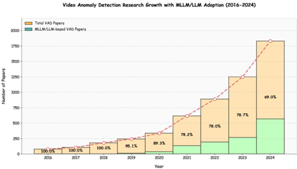
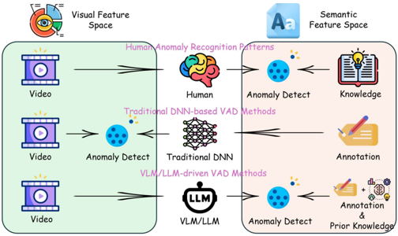
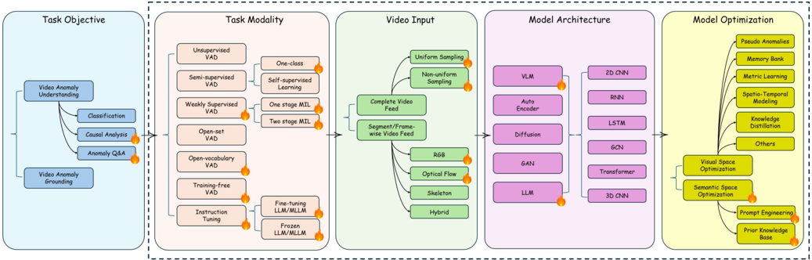
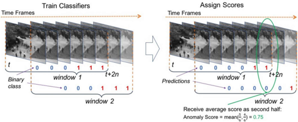

|    |    |    |    |    |    |    |    |
|----|----|----|----|----|----|----|----|
|    |    |    |    |    |    |    |    |
|    |    |    |    |    |    |    |    |
|    |    |    |    |    |    |    |    |
|    |    |    |    |    |    |    |    |
|    |    |    |    |    |    |    |    |
|    |    |    |    |    |    |    |    |
|    |    |    |    |    |    |    |    |
|    |    |    |    |    |    |    |    |
|    |    |    |    |    |    |    |    |
|    |    |    |    |    |    |    |    |

|    |    |    |    |    |    |    |    |    |
|----|----|----|----|----|----|----|----|----|
|    |    |    |    |    |    |    |    |    |
|    |    |    |    |    |    |    |    |    |
|    |    |    |    |    |    |    |    |    |
|    |    |    |    |    |    |    |    |    |
|    |    |    |    |    |    |    |    |    |
|    |    |    |    |    |    |    |    |    |
|    |    |    |    |    |    |    |    |    |
|    |    |    |    |    |    |    |    |    |
|    |    |    |    |    |    |    |    |    |
|    |    |    |    |    |    |    |    |    |
|    |    |    |    |    |    |    |    |    |
|    |    |    |    |    |    |    |    |    |
|    |    |    |    |    |    |    |    |    |
|    |    |    |    |    |    |    |    |    |
|    |    |    |    |    |    |    |    |    |
|    |    |    |    |    |    |    |    |    |
|    |    |    |    |    |    |    |    |    |
|    |    |    |    |    |    |    |    |    |
|    |    |    |    |    |    |    |    |    |
|    |    |    |    |    |    |    |    |    |
|    |    |    |    |    |    |    |    |    |
|    |    |    |    |    |    |    |    |    |
|    |    |    |    |    |    |    |    |    |
|    |    |    |    |    |    |    |    |    |
|    |    |    |    |    |    |    |    |    |
|    |    |    |    |    |    |    |    |    |

|    |    |    |    |    |    |
|----|----|----|----|----|----|
|    |    |    |    |    |    |
|    |    |    |    |    |    |
|    |    |    |    |    |    |
|    |    |    |    |    |    |
|    |    |    |    |    |    |
|    |    |    |    |    |    |
|    |    |    |    |    |    |
|    |    |    |    |    |    |
|    |    |    |    |    |    |
|    |    |    |    |    |    |
|    |    |    |    |    |    |
|    |    |    |    |    |    |
|    |    |    |    |    |    |
|    |    |    |    |    |    |
|    |    |    |    |    |    |
|    |    |    |    |    |    |
|    |    |    |    |    |    |
|    |    |    |    |    |    |

|    |    |    |    |    |
|----|----|----|----|----|
|    |    |    |    |    |
|    |    |    |    |    |
|    |    |    |    |    |
|    |    |    |    |    |
|    |    |    |    |    |
|    |    |    |    |    |
|    |    |    |    |    |
|    |    |    |    |    |
|    |    |    |    |    |
|    |    |    |    |    |
|    |    |    |    |    |
|    |    |    |    |    |

|    |    |    |    |    |    |    |
|----|----|----|----|----|----|----|
|    |    |    |    |    |    |    |
|    |    |    |    |    |    |    |
|    |    |    |    |    |    |    |
|    |    |    |    |    |    |    |
|    |    |    |    |    |    |    |
|    |    |    |    |    |    |    |
|    |    |    |    |    |    |    |
|    |    |    |    |    |    |    |
|    |    |    |    |    |    |    |
|    |    |    |    |    |    |    |
|    |    |    |    |    |    |    |

|    |    |    |    |    |    |    |
|----|----|----|----|----|----|----|
|    |    |    |    |    |    |    |
|    |    |    |    |    |    |    |
|    |    |    |    |    |    |    |
|    |    |    |    |    |    |    |
|    |    |    |    |    |    |    |
|    |    |    |    |    |    |    |

|    |    |    |    |
|----|----|----|----|
|    |    |    |    |

|    |    |    |    |    |    |    |
|----|----|----|----|----|----|----|
|    |    |    |    |    |    |    |
|    |    |    |    |    |    |    |
|    |    |    |    |    |    |    |
|    |    |    |    |    |    |    |
|    |    |    |    |    |    |    |

|    |    |    |    |    |
|----|----|----|----|----|
|    |    |    |    |    |
|    |    |    |    |    |

