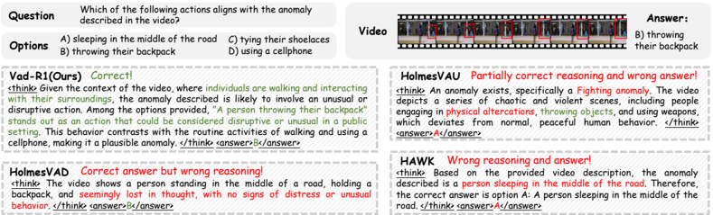
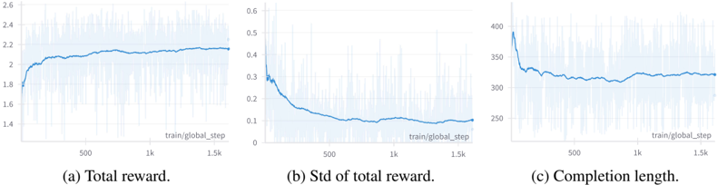

## Vad-R1: Towards Video Anomaly Reasoning via Perception-to-Cognition Chain-of-Thought

Chao Huang 1 Benfeng Wang 1 Jie Wen 2 Chengliang Liu 3 Wei Wang 1 Li Shen 1 Xiaochun Cao 1

1 Shenzhen Campus of Sun Yat-sen University 2 Harbin Institute of Technology, Shenzhen 3 Hong Kong Polytechnic University

{huangch253, wangbf23, wangwei29, caoxiaochun}@mail.sysu.edu.cn

wenjie@hit.edu.cn liucl1996@163.com mathshenli@gmail.com

## Abstract

Recent advancements in reasoning capability of Multimodal Large Language Models (MLLMs) demonstrate its effectiveness in tackling complex visual tasks. However, existing MLLM-based Video Anomaly Detection (VAD) methods remain limited to shallow anomaly descriptions without deep reasoning. In this paper, we propose a new task named Video Anomaly Reasoning (VAR), which aims to enable deep analysis and understanding of anomalies in the video by requiring MLLMs to think explicitly before answering. To this end, we propose Vad-R1, an end-to-end MLLM-based framework for VAR. Specifically, we design a Perceptionto-Cognition Chain-of-Thought (P2C-CoT) that simulates the human process of recognizing anomalies, guiding the MLLM to reason anomaly step-by-step. Based on the structured P2C-CoT, we construct Vad-Reasoning, a dedicated dataset for VAR. Furthermore, we propose an improved reinforcement learning algorithm AVAGRPO, which explicitly incentivizes the anomaly reasoning capability of MLLMs through a self-verification mechanism with limited annotations. Experimental results demonstrate that Vad-R1 achieves superior performance, outperforming both open-source and proprietary models on VAD and VAR tasks. Codes and datasets will be released at https://github.com/wbfwonderful/Vad-R1 .

## 1 Introduction

Video Anomaly Detection (VAD) focuses on identifying abnormal events in videos, and has been widely applied in a range of domains like surveillance systems [49] and automatic driving [37 , 75]. Traditional VAD methods typically fall into two paradigms: semi-supervised and weakly-supervised VADs. The semi-supervised VAD methods [75 , 32 , 20 , 34 , 19 , 17] aim at modeling the features of normal events, while there are only video-level annotations available for weakly-supervised VAD methods [66 , 49 , 18 , 17 , 24 , 90 , 21]. With the development of vision-language models, some studies introduce semantic information into VAD [60 , 68 , 67 , 76 , 7]. However, traditional VAD methods only remain at the level of detection, lacking understanding and explanation of anomalies.

Recently, the reasoning capability of large language models has emerged as a key frontier [41 , 9 , 54]. Unlike daily dialogue, reasoning requires models to think before answering, enabling them to perform causal analysis and further understanding. In particular, DeepSeek-R1 demonstrates the effectiveness of Reinforcement Learning (RL) in stimulating reasoning capability [9]. Besides, parallel efforts have begun to extend reasoning to the multimodal domain [53 , 56].

Despite the growing interest in reasoning capability, existing Multimodal Large Language Models (MLLMs) based VAD methods still fall short in this regard. Those methods can be divided into two categories based on the role of MLLMs. Some methods regard MLLMs as auxiliary modules [36 , 84 ,

Preprint. Under review.

Figure 1: Overview of Vad-R1. Vad-R1 is an end-to-end framework for video anomaly reasoning. A structured Perception-to-Cognition Chain-of-Thought is proposed to guide Vad-R1 in step-by-step reasoning. Based on the structured CoT, a new dataset for video anomaly reasoning is constructed, including fine-grained anomaly categories. A two-stage training pipeline is adopted to progressively enhance the reasoning capability of Vad-R1. Finally, Vad-R1 outperforms existing MLLMs-based VAD methods with a great margin on VANE benchmark.


85 , 11], where MLLMs provide supplementary explanation after the classifier predicts the anomaly confidence. In this context, anomaly understanding is a step after detection, and the output of MLLMs does not directly promote anomaly detection. Subsequently, although some methods utilize MLLMs to directly perform anomaly detection and understanding [50 , 38 , 73 , 80 , 13 , 12], MLLMs only generate anomaly descriptions or perform simple anomaly question answering based on video content, lacking thinking and analytical abilities. Thus, reasoning remains underexplored in VAD.

To bridge this gap, we propose a new task: Video Anomaly Reasoning (VAR), which aims to empower MLLMs with the ability to perform structured, step-by-step reasoning about anomalous events in videos. Compared with existing video anomaly detection or understanding tasks, VAR targets a deeper level of analysis by mimicking the human cognitive process, enabling contextual understanding, behavior interpretation, and norm violation analysis. To this end, we propose Vad-R1, the first end-to-end MLLM-based framework for VAR, which explicitly performs reasoning before generating a response. However, realizing reasoning in video anomaly tasks presents two major challenges. Firstly, existing VAD datasets lack structured reasoning annotations, making them unsuitable for training and evaluating anomaly reasoning models. Secondly, how to effectively train models to acquire reasoning capability remains an open challenge. Unlike tasks with clearly defined objectives, open-ended VAR requires models to perform multi-step reasoning, making it difficult to define clear training objectives or directly guide the reasoning process.

For the first challenge, we design a structured Perception-to-Cognition Chain-of-Thought (P2CCoT) for video anomaly reasoning, as shown in Figure 1(a). Inspired by the process of human understanding the anomalies in the videos, the proposed P2C-CoT first guides the model to perceive from the global environment of the video to the suspicious clips of the video. After perception, the model will make cognition based on visual clues from shallow to deep level. Finally, the model gives the analysis result as answer, including the anomaly category, the anomaly description, the temporal range of anomaly, the approximate spatial position of the anomaly and so on. Then based on the CoT, we construct Vad-Reasoning, a specially designed dataset for VAR, which includes fine-grained anomaly categories as shown in Figure 1(b). Vad-Reasoning consists of two complementary subsets. One subset contains videos with P2C-CoT annotations, which are generated by proprietary models step-by-step. The other subset contains a larger number of videos, where there are only video-level weak labels available due to high annotation costs. For the second challenge, inspired by the success of DeepSeek-R1, we propose a training pipeline with two stages as shown in Figure 1(c). In the first stage, Supervised Fine-Tuning (SFT) is performed to equip the base MLLM with fundamental

anomaly reasoning capability. In the second stage, RL is employed to further incentivize the reasoning capability with the proposed Anomaly Verification Augmented Group Relative Policy Optimization (AVA-GRPO) algorithm, an extension of original GRPO [47] specifically designed for VAR. During RL training, the model first generates a group of completions. Based on these completions, the original videos are temporally trimmed and the trimmed videos are then fed back to the model to generate new completions. The two sets of completions are subsequently compared, and an additional anomaly verification reward is assigned if a predefined condition is satisfied. Finally, AVA-GRPO promotes MLLM's video anomaly reasoning capability through this self-verification mechanism with limited annotations. In summary, the contributions of this paper are threefold:

- We propose Vad-R1, a novel end-to-end MLLM-based framework tailored for VAR, which aims at further analysis and understanding of anomalies in the video.
- We design a structured Perception-to-Cognition Chain-of-Thought, and construct VadReasoning, a specially designed dataset for video anomaly reasoning with two subsets. Besides, we propose an improved reinforcement learning algorithm AVA-GRPO, which incentivizes the reasoning capability of MLLMs through a self verification way.
- The experimental results show that the proposed Vad-R1 achieves superior performance across multiple evaluation scenarios, surpassing both open-source and proprietary models in video anomaly detection and reasoning tasks.

## 2 Related Works

Video Anomaly Detection and Dataset Video anomaly detection aims at localizing the abnormal events in the videos. Based on the training data, traditional VAD methods typically fall into two paradigms, the semi-supervised VAD [75 , 32 , 20 , 34 , 19 , 17 , 45 , 72 , 79] and weakly supervised VAD [66 , 49 , 18 , 17 , 24 , 90 , 21 , 91]. Furthermore, some studies try to introduce text description to enhance detection [60 , 68 , 67 , 76 , 7 , 8]. Recently, there has been growing interest in integrating MLLMs into VAD to improve understanding and explanation [36 , 50 , 38 , 73 , 80 , 84 , 85 , 11 , 13 , 12]. However, current studies remain at shallow understanding with MLLMs, lacking in-depth exploration of reasoning capability. In this paper, we propose an end-to-end framework to explore the enhancement of reasoning capability for video anomaly tasks.

Furthermore, the existing VAD datasets primarily provide coarse-grained category labels [49 , 66 , 37 , 1] or abnormal event description [13 , 12 , 50 , 78], lacking annotation of reasoning process. To address this gap, we propose a structured Perception-to-Cognition Chain-of-Thought and a dataset specially designed for video anomaly reasoning, providing step-by-step CoT annotations.

Video Multimodal Large Language Model The video multimodal large models provide an interactive way to understand video content. Early works integrate visual encoders into large language models by aligning visual and textual tokens via mapping networks [25 , 30 , 39 , 83 , 87]. Compared to static images, videos contain more redundant information. Consequently, some studies explore token compression mechanism to obtain longer context [29 , 71 , 86 , 23]. In addition, recent works have explored online video stream understanding [6 , 10 , 74 , 69]. Nevertheless, these methods remain at the level of video understanding and lack exploration of reasoning capability.

Multimodal Large Language Model with Reasoning Capability Enhancing the reasoning capability of MLLMs has become a major research focus. Some studies propose multi-stage reasoning frameworks and large-scale CoT datasets to enhance the reasoning capability of MLLMs [70 , 59 , 33]. Recently, DeepSeek-R1 [9] demonstrates the potential of reinforcement learning in enhancing the reasoning capability, inspiring subsequent efforts to reproduce its success in multimodal domains [22 , 81]. In the field of video, some studies also utilize RL to improve spatial reasoning [28], temporal reasoning [64] and general causal reasoning [14 , 88]. In this paper, we focus on the video anomaly reasoning task.

## 3 Method: Vad-R1

Overview In this section, we introduce Vad-R1, a novel end-to-end MLLM-based framework for VAR. The reasoning capability of Vad-R1 is derived from a two-stage training strategy: SFT with


(b) Illustration of the answer after reasoning.

(c) The arrangement of Vad-Reasoning dataset.

Figure 2: Overview of the proposed Perception-to-Cognition CoT and Vad-Reasoning dataset.

high quality CoT annotated videos and RL based on AVA-GRPO algorithm. We begin by introducing the proposed P2C-CoT in Section 3.1. Based on the P2C-CoT, we construct Vad-Reasoning, a new dataset as detailed in Section 3.2. Then, we introduce the improved RL algorithm AVA-GRPO in Section 3.3. Finally, we introduce the training pipeline of Vad-R1 in Section 3.4 .

## 3.1 Perception-to-Cognition Chain-of-Thought

When humans interpret a video, they typically first observe the events that occur in the video, and then develop a deeper understanding based on visual observation. Motivated by this, we design a structured Perception-to-Cognition Chain-of-Thought (P2C-CoT) for video anomaly reasoning, which gradually transitions from Perception to Cognition consisting of 2 stages with 4 steps as shown in Figure 2(a), and concludes with a concise answer as shown in Figure 2(b).

Perception When watching a video, humans typically begin with a holistic observation of the scene and environment, and then shift attention to specific objects or events that appear abnormal. In line with this pattern, the perception stage of the proposed P2C-CoT reflects a transition from global observation to focused local observation. The model initially focuses on the whole environment, describes the scenes and recognizes the objects in the video. This step requires the model to have a comprehensive understanding of the normality in the video. Building upon this holistic understanding of the normality, the model then focuses on the events that deviate from the established normality, identifies what happens, when and where the event happens.

Cognition After observing the video content, humans typically identify abnormal events based on visual cues, and then proceed to reason about the potential consequences. Similarly, the cognitive stage of the proposed P2C-CoT reflects a progression from shallow cognition to deep cognition. The model first assesses the abnormality of the event and explains why it is considered anomalous with relevant visual signals. It then engages in higher-level cognition to reason the underlying causes, the violated social expectations, and the possible consequences of the abnormal event.

Answer As shown in Figure 2(b), following the reasoning process, the model is expected to provide a short summary of its judgment about the given video. The final answer consists of key points related to the anomaly, including category (Which), description of the event (What), spatio-temporal localization (When &amp; Where), the reason Why it is identified as an anomaly and the potential

Figure 3: Illustration of the two-stage training pipeline for Vad-R1. Stage 1 enables the model to acquire basic reasoning capability with CoT annotated video. Stage 2 further enhances the model's reasoning capability through reinforcement learning.


influence (How). Notably, for normal videos, the corresponding P2C-CoT is simplified into two steps. Please refer to Appendix B for more details.

## 3.2 Dataset: Vad-Reasoning

Video Collection The existing VAD datasets generally lack the annotation of reasoning process. To construct a more suitable dataset for VAR, we take the following two aspects into consideration. On the one hand, we aim for the proposed dataset to cover a wide range of real-life scenarios. Similar to HAWK [50], we collect videos from current VAD datasets. The video scenarios include crimes under surveillance (UCF-Crime [49]), violent events under camera (XD-Violence [66]), traffic (TAD [37]), campus (ShanghaiTech [32]) and city (UBnormal [1]). Besides, we also collect videos from ECVA [12], a multi-scene benchmark. On the other hand, we strive to broaden the coverage of anomaly categories. To this end, we define a taxonomy of anomalies comprising three main types: Human Activity Anomaly, Environments Anomaly, and Objects Anomaly. Each type is categorized into several main categories, which are further divided into fine-grained subcategories. Then, we collect additional videos from the internet based on the existing dataset to expand the categories of anomalies. In total, the proposed Vad-Reasoning dataset contains 8203 videos for training and 438 videos for test. As shown in Figure 2(c), the training set of Vad-Reasoning is split into two subsets: Vad-Reasoning-SFT which contains 1755 videos annotated with high-quality reasoning process, and Vad-Reasoning-RL which contains 6448 videos with video-level weak labels.

Annotation To construct the proposed Vad-Reasoning dataset, we design a multi-stage annotation pipeline with two proprietary models Qwen-Max [55] and Qwen-VL-Max [57]. In order to ensure that the P2C-CoT annotation covers all key information in the video, we follow the principle of high frame information density [77]. Specifically, we first prompt Qwen-VL-Max to generate dense description of video frames. These frame-level descriptions are then fed into Qwen-Max to generate the CoT step-by-step with different prompts. Please refer to Appendix B for more details.

## 3.3 AVA-GRPO

The original GRPO shows great effectiveness in text-based reasoning tasks. However, as mentioned above, the multimodal tasks like VAR are inherently more complex. In addition, there are only video-level weak labels available for RL stage due to high annotation costs, making it difficult to

evaluate output quality based solely on accuracy and format reward. To address this challenge, we propose Anomaly Verification Augmented GRPO (AVA-GRPO), which introduces an additional reward through a self-verification mechanism, as illustrated in the right part of Figure 3 .

Overview of GRPO We begin by reviewing the original GRPO [47]. GRPO discards the value model and aims at maximizing the relative advantages of the answers. For a question q, the model will first generate a group of completions O = {oi} G i=0 . Subsequently, a set of rewards R = {ri} G i=0 are computed based on the predefined reward functions. The rewards are then normalized to compute the relative advantages as

<!-- formula-not-decoded -->

where A i is the advantage score of oi, which provides more effective assessment of both individual answer quality and relative comparisons within the group. What's more, to prevent the current policy πθ from drifting excessively from the reference one πref, GRPO introduces a KL-divergence regularization term. The final objective function of GRPO is formulated as

<!-- formula-not-decoded -->

where the ratio πθ (oi|q) πθ old (oi|q) quantifies the relative change between the current policy and the old one, and the clip (· , 1 − ϵ, 1 + ϵ) operation constrains the ratio within a range.

Anomaly Verification Reward GRPO replaces the value model with group relative scores, reducing the memory usage and training time. However, simple accuracy and format rewards are insufficient to evaluate the quality of answers for video anomaly reasoning task. To address this, we propose AVA-GRPO, an extension of GRPO that incorporates a novel anomaly verification reward. As shown in the right part of Figure 3, for each completion oi, the predicted category of the video is first extracted. The video is then temporally trimmed based on the extracted prediction, and the trimmed video is fed into the model to generate a new answer. Additional anomaly verification rewards are assigned by comparing the original and regenerated answers.

On the one hand, if the video is initially classified as abnormal, the predicted temporal range of the abnormal event is extracted, and the corresponding segment is discarded from the original video to create a new trimmed video containing only normal segments. Then the trimmed video is re-fed into the model. If the trimmed video is subsequently predicted as normal, it suggests that the discarded segment is indeed abnormal and the model's initial prediction was correct. In this situation, a positive reward will be assigned to reinforce the model's original prediction.

On the other hand, inspired by Video-UTR [77], we consider the phenomenon of temporal hacking for video-MLLMs, where the models tend to generate predictions by relying only on a few frames, typically the beginning or ending of the video, instead of comprehensively processing the entire video sequence, which is detrimental to the recognition of anomaly events. As a consequence, if the video is initially predicted as normal, we randomly discard either the beginning or the ending segment of the video and feed the trimmed video into the model again. If the trimmed video is then predicted as abnormal, it suggests the model made its original prediction only based on insufficient visual evidence, which is not expected. Therefore, a negative reward is assigned in this case.

## 3.4 Training Pipeline

We adopt Qwen-2.5-VL-7B [57] as base MLLM. The training of Vad-R1 consists of two stages, as shown in Figure 3. For the first stage, supervised fine-tuning is performed on the Vad-Reasoning-SFT dataset, in which videos are annotated with high-quality Chain-of-Thought (CoT) as described before.

Table 1: Effectiveness of anomaly reasoning.

| Method             | Strategy                 | Answer        | Answer          | Detection     | Detection       |
|--------------------|--------------------------|---------------|-----------------|---------------|-----------------|
|                    |                          | BLEU-2        | METEOR          | Recall        | F1              |
| Qwen2.5-VL-7B [57] | Direct Answer            | 0.184         | 0.339           | 0.431         | 0.597           |
| Qwen2.5-VL-7B [57] | Random Reasoning         | 0.179         | 0.328           | 0.377         | 0.540           |
| Qwen2.5-VL-7B [57] | Structured Reasoning 0   | 0.198 (+0.019 | ) 0.352 (+0.013 | 0.696 (+0.265 | ) 0.730 (+0.133 |
| Qwen3-8B [58]      | Direct Answer            | 0.038         | 0.184           | 0.368         | 0.534           |
| Qwen3-8B [58]      | Random Reasoning         | 0.040         | 0.191           | 0.554         | 0.655           |
| Qwen3-8B [58]      | Structured Reasoning 0.0 | 0.043 (+0.005 | ) 0.193 (+0.009 | 0.681 (+0.313 | ) 0.686 (+0.153 |
| Vad-R1             | Direct Answer 
 td R     | 0.268         | 0.441           | 0.838         | 0.861           |

In this stage, the model's capability is gradually shifted from general multimodal understanding to video anomaly understanding, and it is enabled to acquire basic anomaly reasoning capability. In the second stage, training is continued on the Vad-Reasoning-RL dataset with the proposed AVA-GRPO reinforcement learning algorithm, which evaluates the quality of model responses in a self verification manner with only video-level weak labels available. This stage aims at moving the model beyond pattern-matching tendencies from SFT, enabling it to develop more flexible, transferable anomaly reasoning capability. Please refer to Appendix C for more details.

## 4 Experiments

## 4.1 Experimental Settings

Implementation Details Vad-R1 is trained with two stages based on Qwen-2.5-VL-7B [57]. For the first stage, SFT is performed with Vad-Reasoning-SFT dataset for four epochs. For the second stage, RL is performed with AVA-GRPO for one epoch, where there are only video-level weak labels available for VA-Reasoning-RL dataset. All experiments are conducted with 4 NVIDIA A100 (80GB) GPUs. Please refer to Appendix C for more details.

Evaluation Metrics and Baselines We first evaluate Vad-R1 on the test set of VA-Reasoning, focusing on two aspects: anomaly reasoning and anomaly detection. For anomaly reasoning, we assess the text quality of reasoning process with BLEU [43], METEOR [3] and ROUGE [31] metrics. For anomaly detection, we report accuracy, precision, recall and f1 scores for anomaly classification, along with mIoU and R@K for anomaly temporal grounding. Besides, to further explore the capabilities of Vad-R1, we also conduct experiments on VANE [15], a video anomaly benchmark for MLLMs, where the MLLMs are asked to answer single choice questions. In this case, we report the accuracy of every category. We compare Vad-R1 with general video MLLMs [25 , 30 , 39 , 83 , 87], reasoning video MLLMs [28 , 64 , 14 , 88] and some proprietary models [56 , 40 , 52 , 51]. Furthermore, we also consider MLLM-based VAD methods [50 , 85 , 84].

In the following sections, we present our experimental results by addressing the following questions.

- Q1. Does reasoning improve anomaly detection?
- Q2. How well does Vad-R1 perform in anomaly reasoning and detection?
- Q3. How to acquire the capability of reasoning?

## 4.2 Main Results

Q1: Does reasoning improve anomaly detection? Table 1 demonstrates the effectiveness of anomaly reasoning. On the one hand, we evaluate the performance of Qwen2.5-VL [57] and Qwen3 [58]. As shown in the first two rows of Table 1, compared with directly answering, prompting models to reason according to the proposed perception-to-cognition chain-of-thought will gain greater performance. In the meanwhile, we evaluate the effect of random reasoning. In this case, the performance improvement is minimal, even inferior to direct answering. Notably, Qwen3 is a

Table 2: Performance comparison of anomaly reasoning and detection on Vad-Reasoning dataset.

| Method                       | Params.                      | Anomaly Reasoning            | Anomaly Reasoning            | Anomaly Reasoning            | Anomaly Detection
 F1 IU R@03 R@05   | Anomaly Detection
 F1 IU R@03 R@05   | Anomaly Detection
 F1 IU R@03 R@05   | Anomaly Detection
 F1 IU R@03 R@05   | Anomaly Detection
 F1 IU R@03 R@05   |
|------------------------------|------------------------------|------------------------------|------------------------------|------------------------------|--------------------------------------|--------------------------------------|--------------------------------------|--------------------------------------|--------------------------------------|
| Method                       | Params.                      | BLEU-2                       | METEOR                       | ROUGE-2                      | Acc                                  | F1                                   | mIoU                                 | R@0.3                                | R@0.5                                |
| Open-Source video MLLMs      | Open-Source video MLLMs      | Open-Source video MLLMs      | Open-Source video MLLMs      | Open-Source video MLLMs      | Open-Source video MLLMs              | Open-Source video MLLMs              | Open-Source video MLLMs              | Open-Source video MLLMs              | Open-Source video MLLMs              |
| InternVideo2.5 [65]          | 8B                           | 0.110                        | 0.264                        | 0.109                        | 0.715                                | 0.730                                | 0.417                                | 0.458                                | 0.424                                |
| InternVL3 [92]               | 8B                           | 0.124                        | 0.286                        | 0.116                        | 0.779                                | 0.756                                | 0.550                                | 0.613                                | 0.540                                |
| VideoChat-Flash [27]         | 7B                           | 0.012                        | 0.084                        | 0.047                        | 0.683                                | 0.487                                | 0.536                                | 0.538                                | 0.358                                |
| VideoLLaMA3 [82]             | 7B                           | 0.066                        | 0.200                        | 0.092                        | 0.665                                | 0.624                                | 0.425                                | 0.451                                | 0.419                                |
| LLaVA-NeXT-Video [89]        | 7B                           | 0.094                        | 0.238                        | 0.104                        | 0.651                                | 0.423                                | 0.576                                | 0.601                                | 0.585                                |
| Qwen2.5-VL [57]              | 7B                           | 0.113                        | 0.264                        | 0.116                        | 0.761                                | 0.730                                | 0.567                                | 0.610                                | 0.563                                |
| Source video reasoning MLLMs | Source video reasoning MLLMs | Source video reasoning MLLMs | Source video reasoning MLLMs | Source video reasoning MLLMs | Source video reasoning MLLMs         | Source video reasoning MLLMs         | Source video reasoning MLLMs         | Source video reasoning MLLMs         | Source video reasoning MLLMs         |
| Open-R1-Video [63]           | 7B                           | 0.060                        | 0.179                        | g 
 0.084                    | 0.793                                | 0.790                                | 0.559                                | 0.642                                | 0.540                                |
| Video-R1 [14]                | 7B                           | 0.135                        | 0.317                        | 0.132                        | 0.624                                | 0.694                                | 0.334                                | 0.392                                | 0.328                                |
| VideoChat-R1 [28]            | 7B                           | 0.128                        | 0.287                        | 0.123                        | 0.793                                | 0.790                                | 0.559                                | 0.642                                | 0.540                                |
| LM-based VAD methods         | LM-based VAD methods         | LM-based VAD methods         | LM-based VAD methods         | LM-based VAD methods         | LM-based VAD methods                 | LM-based VAD methods                 | LM-based VAD methods                 | LM-based VAD methods                 | LM-based VAD methods                 |
| Holmes-VAD [84]              | 7B                           | 0.003                        | 0.074                        | 0.027                        | 0.565                                | 0.120                                | -                                    | -                                    | -                                    |
| Holmes-VAU [85]              | 2B                           | 0.077                        | 0.182                        | 0.075                        | 0.490                                | 0.371                                | -                                    | -                                    | -                                    |
| HAWK [50]                    | 7B                           | 0.042                        | 0.156                        | 0.042                        | 0.513                                | 0.648                                | -                                    | -                                    | -                                    |
| roprietary MLLMs             | roprietary MLLMs             | roprietary MLLMs             | roprietary MLLMs             | roprietary MLLMs             | roprietary MLLMs                     | roprietary MLLMs                     | roprietary MLLMs                     | roprietary MLLMs                     | roprietary MLLMs                     |
| Claude3.5-Haiku [2]          | -                            | 0.097                        | y 
 0.253                    | 0.098                        | 0.580                                | 0.354                                | 0.518                                | 0.543                                | 0.524                                |
| GPT-4o [40]                  | -                            | 0.154                        | 0.341                        | 0.133                        | 0.711                                | 0.760                                | 0.472                                | 0.565                                | 0.476                                |
| Gemini2.5-Flash [51]         | -                            | 0.133                        | 0.308                        | 0.120                        | 0.624                                | 0.707                                | 0.370                                | 0.437                                | 0.358                                |
| ary reasoning MLLMs          | ary reasoning MLLMs          | ary reasoning MLLMs          | ary reasoning MLLMs          | ary reasoning MLLMs          | ary reasoning MLLMs                  | ary reasoning MLLMs                  | ary reasoning MLLMs                  | ary reasoning MLLMs                  | ary reasoning MLLMs                  |
| Gemini2.5-pro [52]           | -                            | p
 0.145                     | 0.356                        | 0.137                        | 0.829                                | 0.836                                | 0.636                                | 0.722                                | 0.638                                |
| p
 QVQ-Max [56]              | -                            | 0.142                        | 0.318                        | 0.121                        | 0.702                                | 0.747                                | 0.430                                | 0.503                                | 0.412                                |
| QQ
 o4-mini [42]             | -                            | 0.106                        | 0.263                        | 0.109                        | 0.884                                | 0.875                                | 0.644                                | 0.736                                | 0.631                                |
| Vad-R1 (Ours)                | 7B                           | 0.233                        | 0.406                        | 0.194                        | 0.875                                | 0.862                                | 0.713                                | 0.770                                | 0.706                                |

hybrid reasoning model that supports both reasoning and non-reasoning modes for the same task. The consistent performance gap across different settings further highlights the effectiveness of the proposed P2C-CoT for anomaly reasoning and detection. On the other hand, We compare the performance of Vad-R1 trained with the full P2C-CoT versus training with only the final answer portion of the P2C-CoT as shown in the third row of Table 1. When Vad-R1 is trained with only the final answer, it exhibits a performance drop.

Q2: How well does Vad-R1 perform in anomaly reasoning and detection? Table 2 shows the performance comparison of anomaly reasoning and detection tasks on the test set of VadReasoning. Vad-R1 achieves great performance on both text quality of anomaly reasoning process and the accuracy of anomaly detection. It is worth noting that Vad-R1 significantly outperforms existing proprietary reasoning MLLMs Gemini2.5-Pro, QVQ-Max and o4-mini on anomaly reasoning capability, with BLEU score improvements of 0.088, 0.091, and 0.127, respectively. Besides, compared with existing MLLM-based VAD methods, Vad-R1 also exhibits greater advantages in anomaly reasoning and detection. Table 3 demonstrates the results on VANE benchmark. Vad-R1 also outperforms all baselines including general video MLLMs and MLLM-based VAD methods.

## 4.3 Ablation Studies

Q3: How to obtain the capability of reasoning? Table 4 shows the effectiveness of different training strategies. When directly performing RL to the base model without prior SFT, the performance improvement is limited. This suggests that, without fundamental reasoning capability, the model struggles to benefit from RL training with video-level weak labels. In contrast, applying SFT leads to a more significant performance improvement, indicating that the structured Chain-of-Thought annotations effectively equip the model with basic anomaly reasoning capability. Notably, the combination of SFT and RL gains the best performance. The results align with the conclusion of DeepSeek-R1 [9], which suggests that SFT stage provides fundamental reasoning capability for the model, while RL stage further enhances its reasoning capability.

Table 3: Performance comparison on VANE.

| Method                | SORA                  | OpenSORA              | RG2                   | VideoLCM              | MS-T2                 | Avenue                | Ped1                  | Ped2                  |
|-----------------------|-----------------------|-----------------------|-----------------------|-----------------------|-----------------------|-----------------------|-----------------------|-----------------------|
| Open-Source MLLMs     | Open-Source MLLMs     | Open-Source MLLMs     | Open-Source MLLMs     | Open-Source MLLMs     | Open-Source MLLMs     | Open-Source MLLMs     | Open-Source MLLMs     | Open-Source MLLMs     |
| Video-LLaMA [83]      | 11.59                 | 18.00                 | 16.00                 | 10.57                 | 10.41                 | 30.00                 | 16.66                 | 5.55                  |
| VideoChat [25]        | 10.74                 | 28.00                 | 4.00                  | 17.64                 | 20.83                 | 32.25                 | 13.33                 | 13.88                 |
| Video-ChatGPT [39]    | 26.47                 | 22.00                 | 12.00                 | 18.26                 | 16.66                 | 39.39                 | 40.00                 | 19.44                 |
| Video-LLaVA [30]      | 10.86                 | 18.00                 | 16.00                 | 19.23                 | 16.66                 | 3.03                  | 2.77                  | 6.06                  |
| MovieChat [48]        | 8.69                  | 10.00                 | 16.00                 | 14.42                 | 6.25                  | 18.18                 | 6.66                  | 11.11                 |
| LLaMA-VID [29]        | 7.97                  | 14.00                 | 20.00                 | 19.23                 | 14.58                 | 27.27                 | 6.66                  | 19.44                 |
| TimeChat [44]         | 21.73                 | 26.00                 | 28.00                 | 22.11                 | 20.83                 | 24.20                 | 27.58                 | 11.11                 |
| LLM-based VAD methods | LLM-based VAD methods | LLM-based VAD methods | LLM-based VAD methods | LLM-based VAD methods | LLM-based VAD methods | LLM-based VAD methods | LLM-based VAD methods | LLM-based VAD methods |
| Holmes-VAU [85]       | 2.17                  | 34.00                 | 24.00                 | 29.81                 | 25.00                 | 6.06                  | 3.33                  | 5.56                  |
| Holmes-VAD [84]       | 6.52                  | 34.00                 | 32.00                 | 33.56                 | 22.92                 | 12.12                 | 20.00                 | 5.56                  |
| HAWK [50]             | 24.64                 | 52.00                 | 44.00                 | 36.54                 | 50.00                 | 36.36                 | 36.67                 | 38.89                 |
| Vad-R1 (ours)         | 41.30                 | 78.00                 | 56.00                 | 63.46                 | 60.42                 | 75.76                 | 60.00                 | 63.89                 |

Table 4: Comparison of different training strategies for Vad-R1.

Figure 4: Qualitative performance on VANE benchmark.

| Strategy      | Anomaly Reasoning    | Anomaly Reasoning    | Anomaly Reasoning    | Anomaly Reasoning    | Anomaly Detection   | Anomaly Detection   | Anomaly Detection   | Anomaly Detection   | Anomaly Detection   |
|---------------|----------------------|----------------------|----------------------|----------------------|---------------------|---------------------|---------------------|---------------------|---------------------|
| Strategy      | BLEU-2               | ROUGE-1              | ROUGE-2              | ROUGE-L              | Prec.               | mIoU                | R@0.3               | R@0.5               | R@0.7               |
| Qwen2.5-VL    | 0.113                | 0.505                | 0.199                | 0.477                | 0.768               | 0.567               | 0.610               | 0.563               | 0.526               |
| +SFT          | 0.219                | 0.456                | 0.196                | 0.429                | 0.712               | 0.612               | 0.677               | 0.599               | 0.535               |
| +AVA-GRPO     | 0.143                | 0.513                | 0.207                | 0.486                | 0.810               | 0.675               | 0.736               | 0.661               | 0.606               |
| +SFT+AVA-GRPO | 0.233                | 0.530                | 0.238                | 0.501                | 0.882               | 0.713               | 0.770               | 0.706               | 0.651               |



## 4.4 Qualitative Analyses

As shown in Figure 3, Vad-R1 demonstrates great reasoning capability in complex environments and correctly identifies anomalies in the video. In comparison, the reasoning process of HolmesVAU is partially correct, resulting in incorrect judgment, while HolmesVAD makes correct judgment but incorrect reasoning process. Please refer to Appendix D for more qualitative results.

## 5 Conclusion

In this paper, we present Vad-R1, a novel end-to-end MLLM-based framework for video anomaly reasoning which aims to enable deep analysis and understanding of anomalies in videos. Vad-R1 performs structured anomaly reasoning process through a structured Chain-of-Thought that progresses gradually from perception to cognition. The anomaly reasoning capability of Vad-R1 is derived from a two-stage training strategy, combining supervised fine-tuning on CoT-annotated videos and reinforcement learning with an anomaly verification mechanism. Experimental results demonstrate that Vad-R1 achieves superior performance on anomaly detection and reasoning tasks.

## References

- [1] Andra Acsintoae, Andrei Florescu, Mariana-Iuliana Georgescu, Tudor Mare, Paul Sumedrea, Radu Tudor Ionescu, Fahad Shahbaz Khan, and Mubarak Shah. Ubnormal: New benchmark for supervised open-set video anomaly detection. In Proceedings of the IEEE/CVF conference on computer vision and pattern recognition, pages 20143–20153, 2022. 3 , 5 , 18
- [2] Anthropic. Claude 3.5 haiku, 2024. URL https://www.anthropic.com/claude/haiku . 8 , 23
- [3] Satanjeev Banerjee and Alon Lavie. Meteor: An automatic metric for mt evaluation with improved correlation with human judgments. In Proceedings of the acl workshop on intrinsic and extrinsic evaluation measures for machine translation and/or summarization, pages 65–72, 2005. 7
- [4] Tim Brooks, Bill Peebles, Connor Holmes, Will DePue, Yufei Guo, Li Jing, David Schnurr, Joe Taylor, Troy Luhman, Eric Luhman, et al. Video generation models as world simulators. OpenAI Blog, 1:8, 2024. 20
- [5] Congqi Cao, Yue Lu, Peng Wang, and Yanning Zhang. A new comprehensive benchmark for semi-supervised video anomaly detection and anticipation. In Proceedings of the IEEE/CVF Conference on Computer Vision and Pattern Recognition (CVPR), pages 20392–20401, June 2023. 18
- [6] Joya Chen, Zhaoyang Lv, Shiwei Wu, Kevin Qinghong Lin, Chenan Song, Difei Gao, Jia-Wei Liu, Ziteng Gao, Dongxing Mao, and Mike Zheng Shou. Videollm-online: Online video large language model for streaming video. In Proceedings of the IEEE/CVF Conference on Computer Vision and Pattern Recognition, pages 18407–18418, 2024. 3
- [7] Junxi Chen, Liang Li, Li Su, Zheng-Jun Zha, and Qingming Huang. Prompt-enhanced multiple instance learning for weakly supervised video anomaly detection. In Proceedings of the IEEE/CVF Conference on Computer Vision and Pattern Recognition, pages 18319–18329, 2024. 1 , 3
- [8] Weiling Chen, Keng Teck Ma, Zi Jian Yew, Minhoe Hur, and David Aik-Aun Khoo. Tevad: Improved video anomaly detection with captions. In Proceedings of the IEEE/CVF Conference on Computer Vision and Pattern Recognition, pages 5549–5559, 2023. 3
- [9] DeepSeek-AI. DeepSeek-R1: Incentivizing reasoning capability in llms via reinforcement learning. arXiv preprint arXiv:2501.12948, 2025. 1 , 3 , 8
- [10] Shangzhe Di, Zhelun Yu, Guanghao Zhang, Haoyuan Li, Tao Zhong, Hao Cheng, Bolin Li, Wanggui He, Fangxun Shu, and Hao Jiang. Streaming video question-answering with in-context video kv-cache retrieval. arXiv preprint arXiv:2503.00540, 2025. 3
- [11] Zongcan Ding, Haodong Zhang, Peng Wu, Guansong Pang, Zhiwei Yang, Peng Wang, and Yanning Zhang. Slowfastvad: Video anomaly detection via integrating simple detector and rag-enhanced vision-language model. arXiv preprint arXiv:2504.10320, 2025. 2 , 3
- [12] Hang Du, Guoshun Nan, Jiawen Qian, Wangchenhui Wu, Wendi Deng, Hanqing Mu, Zhenyan Chen, Pengxuan Mao, Xiaofeng Tao, and Jun Liu. Exploring what why and how: A multifaceted benchmark for causation understanding of video anomaly. arXiv preprint arXiv:2412.07183 , 2024. 2 , 3 , 5 , 17 , 18
- [13] Hang Du, Sicheng Zhang, Binzhu Xie, Guoshun Nan, Jiayang Zhang, Junrui Xu, Hangyu Liu, Sicong Leng, Jiangming Liu, Hehe Fan, et al. Uncovering what why and how: A comprehensive benchmark for causation understanding of video anomaly. In Proceedings of the IEEE/CVF Conference on Computer Vision and Pattern Recognition, pages 18793–18803, 2024. 2 , 3 , 17 , 18
- [14] Kaituo Feng, Kaixiong Gong, Bohao Li, Zonghao Guo, Yibing Wang, Tianshuo Peng, Benyou Wang, and Xiangyu Yue. Video-r1: Reinforcing video reasoning in mllms. arXiv preprint arXiv:2503.21776, 2025. 3 , 7 , 8 , 23

- [15] Hanan Gani, Rohit Bharadwaj, Muzammal Naseer, Fahad Shahbaz Khan, and Salman Khan. Vane-bench: Video anomaly evaluation benchmark for conversational lmms. In Findings of the Association for Computational Linguistics: NAACL 2025, pages 3123–3140, 2025. 7 , 20
- [16] HPCAI Tech. Open-sora: Democratizing efficient video production for all. https://github. com/hpcaitech/Open-Sora, 2024. 20
- [17] Chao Huang, Zhihao Wu, Jie Wen, Yong Xu, Qiuping Jiang, and Yaowei Wang. Abnormal event detection using deep contrastive learning for intelligent video surveillance system. IEEE Transactions on Industrial Informatics, 18(8):5171–5179, 2021. 1 , 3
- [18] Chao Huang, Chengliang Liu, Jie Wen, Lian Wu, Yong Xu, Qiuping Jiang, and Yaowei Wang. Weakly supervised video anomaly detection via self-guided temporal discriminative transformer. IEEE Transactions on Cybernetics, 54(5):3197–3210, 2022. 1 , 3
- [19] Chao Huang, Jie Wen, Yong Xu, Qiuping Jiang, Jian Yang, Yaowei Wang, and David Zhang. Self-supervised attentive generative adversarial networks for video anomaly detection. IEEE transactions on neural networks and learning systems, 34(11):9389–9403, 2022. 1 , 3
- [20] Chao Huang, Jie Wen, Chengliang Liu, and Yabo Liu. Long short-term dynamic prototype alignment learning for video anomaly detection. In Proceedings of the Thirty-Third International Joint Conference on Artificial Intelligence, pages 866–874, 2024. 1 , 3
- [21] Chao Huang, Weiliang Huang, Qiuping Jiang, Wei Wang, Jie Wen, and Bob Zhang. Multimodal evidential learning for open-world weakly-supervised video anomaly detection. IEEE Transactions on Multimedia, 2025. 1 , 3
- [22] Wenxuan Huang, Bohan Jia, Zijie Zhai, Shaosheng Cao, Zheyu Ye, Fei Zhao, Zhe Xu, Yao Hu, and Shaohui Lin. Vision-r1: Incentivizing reasoning capability in multimodal large language models. arXiv preprint arXiv:2503.06749, 2025. 3
- [23] Peng Jin, Ryuichi Takanobu, Wancai Zhang, Xiaochun Cao, and Li Yuan. Chat-univi: Unified visual representation empowers large language models with image and video understanding. In Proceedings of the IEEE/CVF Conference on Computer Vision and Pattern Recognition, pages 13700–13710, 2024. 3
- [24] Hyekang Kevin Joo, Khoa Vo, Kashu Yamazaki, and Ngan Le. Clip-tsa: Clip-assisted temporal self-attention for weakly-supervised video anomaly detection. In 2023 IEEE International Conference on Image Processing (ICIP), pages 3230–3234. IEEE, 2023. 1 , 3
- [25] KunChang Li, Yinan He, Yi Wang, Yizhuo Li, Wenhai Wang, Ping Luo, Yali Wang, Limin Wang, and Yu Qiao. Videochat: Chat-centric video understanding. arXiv preprint arXiv:2305.06355 , 2023. 3 , 7 , 9
- [26] Weixin Li, Vijay Mahadevan, and Nuno Vasconcelos. Anomaly detection and localization in crowded scenes. IEEE transactions on pattern analysis and machine intelligence, 36(1):18–32, 2013. 18 , 20
- [27] Xinhao Li, Yi Wang, Jiashuo Yu, Xiangyu Zeng, Yuhan Zhu, Haian Huang, Jianfei Gao, Kunchang Li, Yinan He, Chenting Wang, et al. Videochat-flash: Hierarchical compression for long-context video modeling. arXiv preprint arXiv:2501.00574, 2024. 8 , 23
- [28] Xinhao Li, Ziang Yan, Desen Meng, Lu Dong, Xiangyu Zeng, Yinan He, Yali Wang, Yu Qiao, Yi Wang, and Limin Wang. Videochat-r1: Enhancing spatio-temporal perception via reinforcement fine-tuning. arXiv preprint arXiv:2504.06958, 2025. 3 , 7 , 8 , 23
- [29] Yanwei Li, Chengyao Wang, and Jiaya Jia. Llama-vid: An image is worth 2 tokens in large language models. In European Conference on Computer Vision, pages 323–340. Springer, 2024. 3 , 9
- [30] Bin Lin, Yang Ye, Bin Zhu, Jiaxi Cui, Munan Ning, Peng Jin, and Li Yuan. Video-llava: Learning united visual representation by alignment before projection. arXiv preprint arXiv:2311.10122 , 2023. 3 , 7 , 9

- [31] Chin-Yew Lin. Rouge: A package for automatic evaluation of summaries. In Text summarization branches out, pages 74–81, 2004. 7
- [32] Wen Liu, Weixin Luo, Dongze Lian, and Shenghua Gao. Future frame prediction for anomaly detection–a new baseline. In Proceedings of the IEEE conference on computer vision and pattern recognition, pages 6536–6545, 2018. 1 , 3 , 5 , 18
- [33] Ye Liu, Kevin Qinghong Lin, Chang Wen Chen, and Mike Zheng Shou. Videomind: A chain-of-lora agent for long video reasoning. arXiv preprint arXiv:2503.13444, 2025. 3
- [34] Zhian Liu, Yongwei Nie, Chengjiang Long, Qing Zhang, and Guiqing Li. A hybrid video anomaly detection framework via memory-augmented flow reconstruction and flow-guided frame prediction. In Proceedings of the IEEE/CVF international conference on computer vision , pages 13588–13597, 2021. 1 , 3
- [35] Cewu Lu, Jianping Shi, and Jiaya Jia. Abnormal event detection at 150 fps in matlab. In Proceedings of the IEEE international conference on computer vision, pages 2720–2727, 2013. 18 , 20
- [36] Hui Lv and Qianru Sun. Video anomaly detection and explanation via large language models. arXiv preprint arXiv:2401.05702, 2024. 1 , 3
- [37] Hui Lv, Chuanwei Zhou, Zhen Cui, Chunyan Xu, Yong Li, and Jian Yang. Localizing anomalies from weakly-labeled videos. IEEE transactions on image processing, 30:4505–4515, 2021. 1 , 3 , 5 , 18
- [38] Junxiao Ma, Jingjing Wang, Jiamin Luo, Peiying Yu, and Guodong Zhou. Sherlock: Towards multi-scene video abnormal event extraction and localization via a global-local spatial-sensitive llm. In Proceedings of the ACM on Web Conference 2025, pages 4004–4013, 2025. 2 , 3
- [39] Muhammad Maaz, Hanoona Rasheed, Salman Khan, and Fahad Shahbaz Khan. Video-chatgpt: Towards detailed video understanding via large vision and language models. arXiv preprint arXiv:2306.05424, 2023. 3 , 7 , 9
- [40] OpenAI. Gpt-4o system card. arXiv preprint arXiv:2410.21276, 2024. 7 , 8 , 23
- [41] OpenAI. Openai o1 system card. arXiv preprint arXiv:2412.16720, 2024. 1
- [42] OpenAI. Openai o3 and o4-mini system card, 2025. URL https://openai.com/index/ o3-o4-mini-system-card/ . 8
- [43] Kishore Papineni, Salim Roukos, Todd Ward, and Wei-Jing Zhu. Bleu: a method for automatic evaluation of machine translation. In Proceedings of the 40th annual meeting of the Association for Computational Linguistics, pages 311–318, 2002. 7
- [44] Shuhuai Ren, Linli Yao, Shicheng Li, Xu Sun, and Lu Hou. Timechat: A time-sensitive multimodal large language model for long video understanding. In Proceedings of the IEEE/CVF Conference on Computer Vision and Pattern Recognition, pages 14313–14323, 2024. 9
- [45] Nicolae-C Ristea, Florinel-Alin Croitoru, Radu Tudor Ionescu, Marius Popescu, Fahad Shahbaz Khan, Mubarak Shah, et al. Self-distilled masked auto-encoders are efficient video anomaly detectors. In Proceedings of the IEEE/CVF Conference on Computer Vision and Pattern Recognition, pages 15984–15995, 2024. 3
- [46] Runway Research. Gen-2: The next step forward for generative ai. https://research. runwayml.com/gen2, 2024. 20
- [47] Zhihong Shao, Peiyi Wang, Qihao Zhu, Runxin Xu, Junxiao Song, Xiao Bi, Haowei Zhang, Mingchuan Zhang, YK Li, Y Wu, et al. Deepseekmath: Pushing the limits of mathematical reasoning in open language models. arXiv preprint arXiv:2402.03300, 2024. 3 , 6
- [48] Enxin Song, Wenhao Chai, Guanhong Wang, Yucheng Zhang, Haoyang Zhou, Feiyang Wu, Haozhe Chi, Xun Guo, Tian Ye, Yanting Zhang, et al. Moviechat: From dense token to sparse memory for long video understanding. In Proceedings of the IEEE/CVF Conference on Computer Vision and Pattern Recognition, pages 18221–18232, 2024. 9

- [49] Waqas Sultani, Chen Chen, and Mubarak Shah. Real-world anomaly detection in surveillance videos. In Proceedings of the IEEE conference on computer vision and pattern recognition , pages 6479–6488, 2018. 1 , 3 , 5 , 17 , 18 , 20
- [50] Jiaqi Tang, Hao Lu, Ruizheng Wu, Xiaogang Xu, Ke Ma, Cheng Fang, Bin Guo, Jiangbo Lu, Qifeng Chen, and Yingcong Chen. Hawk: Learning to understand open-world video anomalies. Advances in Neural Information Processing Systems, 37:139751–139785, 2024. 2 , 3 , 5 , 7 , 8 , 9 , 18 , 21 , 23
- [51] Gemini Team. Gemini 2.5 flash preview model card, 2025. URL https://storage. googleapis.com/model-cards/documents/gemini-2.5-flash-preview.pdf . 7 , 8
- [52] Gemini Team. Gemini 2.5 pro preview model card, 2025. URL https://storage. googleapis.com/model-cards/documents/gemini-2.5-pro-preview.pdf . 7 , 8
- [53] Kimi Team. Kimi k1.5: Scaling reinforcement learning with llms. arXiv preprint arXiv:2501.12599, 2025. 1
- [54] Qwen Team. QwQ: Reflect deeply on the boundaries of the unknown, 2024. URL https: //qwenlm.github.io/blog/qwq-32b-preview/ . 1
- [55] Qwen Team. Qwen2.5 technical report. arXiv preprint arXiv:2412.15115, 2024. 5
- [56] Qwen Team. QVQ-Max: Think with evidence, 2025. URL https://qwenlm.github.io/ blog/qvq-max-preview/ . 1 , 7 , 8 , 23
- [57] Qwen Team. Qwen2.5-vl technical report. arXiv preprint arXiv:2502.13923, 2025. 5 , 6 , 7 , 8 , 23
- [58] Qwen Team. Qwen3: Think deeper, act faster, 2025. URL https://qwenlm.github.io/ blog/qwen3/ . 7
- [59] Omkar Thawakar, Dinura Dissanayake, Ketan More, Ritesh Thawkar, Ahmed Heakl, Noor Ahsan, Yuhao Li, Mohammed Zumri, Jean Lahoud, Rao Muhammad Anwer, et al. Llamav-o1: Rethinking step-by-step visual reasoning in llms. arXiv preprint arXiv:2501.06186, 2025. 3
- [60] Benfeng Wang, Chao Huang, Jie Wen, Wei Wang, Yabo Liu, and Yong Xu. Federated weakly supervised video anomaly detection with multimodal prompt. In Proceedings of the AAAI Conference on Artificial Intelligence, volume 39, pages 21017–21025, 2025. 1 , 3
- [61] Jiuniu Wang, Hangjie Yuan, Dayou Chen, Yingya Zhang, Xiang Wang, and Shiwei Zhang. Modelscope text-to-video technical report, 2023. 20
- [62] Xiang Wang, Shiwei Zhang, Han Zhang, Yu Liu, Yingya Zhang, Changxin Gao, and Nong Sang. Videolcm: Video latent consistency model, 2023. 20
- [63] Xiaodong Wang and Peixi Peng. Open-r1-video, 2025. URL https://github.com/ Wang-Xiaodong1899/Open-R1-Video . 8 , 23
- [64] Ye Wang, Boshen Xu, Zihao Yue, Zihan Xiao, Ziheng Wang, Liang Zhang, Dingyi Yang, Wenxuan Wang, and Qin Jin. Timezero: Temporal video grounding with reasoning-guided lvlm. arXiv preprint arXiv:2503.13377, 2025. 3 , 7
- [65] Yi Wang, Xinhao Li, Ziang Yan, Yinan He, Jiashuo Yu, Xiangyu Zeng, Chenting Wang, Changlian Ma, Haian Huang, Jianfei Gao, et al. Internvideo2. 5: Empowering video mllms with long and rich context modeling. arXiv preprint arXiv:2501.12386, 2025. 8 , 23
- [66] Peng Wu, Jing Liu, Yujia Shi, Yujia Sun, Fangtao Shao, Zhaoyang Wu, and Zhiwei Yang. Not only look, but also listen: Learning multimodal violence detection under weak supervision. In Computer Vision–ECCV 2020: 16th European Conference, Glasgow, UK, August 23–28, 2020, Proceedings, Part XXX 16, pages 322–339. Springer, 2020. 1 , 3 , 5 , 17 , 18
- [67] Peng Wu, Xuerong Zhou, Guansong Pang, Yujia Sun, Jing Liu, Peng Wang, and Yanning Zhang. Open-vocabulary video anomaly detection. In Proceedings of the IEEE/CVF Conference on Computer Vision and Pattern Recognition, pages 18297–18307, 2024. 1 , 3

- [68] Peng Wu, Xuerong Zhou, Guansong Pang, Lingru Zhou, Qingsen Yan, Peng Wang, and Yanning Zhang. Vadclip: Adapting vision-language models for weakly supervised video anomaly detection. In Proceedings of the AAAI Conference on Artificial Intelligence, volume 38, pages 6074–6082, 2024. 1 , 3
- [69] Haomiao Xiong, Zongxin Yang, Jiazuo Yu, Yunzhi Zhuge, Lu Zhang, Jiawen Zhu, and Huchuan Lu. Streaming video understanding and multi-round interaction with memory-enhanced knowledge. arXiv preprint arXiv:2501.13468, 2025. 3
- [70] Guowei Xu, Peng Jin, Li Hao, Yibing Song, Lichao Sun, and Li Yuan. Llava-o1: Let vision language models reason step-by-step. arXiv preprint arXiv:2411.10440, 2024. 3
- [71] Lin Xu, Yilin Zhao, Daquan Zhou, Zhijie Lin, See Kiong Ng, and Jiashi Feng. Pllava: Parameter-free llava extension from images to videos for video dense captioning. arXiv preprint arXiv:2404.16994, 2024. 3
- [72] Cheng Yan, Shiyu Zhang, Yang Liu, Guansong Pang, and Wenjun Wang. Feature prediction diffusion model for video anomaly detection. In Proceedings of the IEEE/CVF international conference on computer vision, pages 5527–5537, 2023. 3
- [73] Yuchen Yang, Kwonjoon Lee, Behzad Dariush, Yinzhi Cao, and Shao-Yuan Lo. Follow the rules: reasoning for video anomaly detection with large language models. In European Conference on Computer Vision, pages 304–322. Springer, 2024. 2 , 3
- [74] Zhenyu Yang, Yuhang Hu, Zemin Du, Dizhan Xue, Shengsheng Qian, Jiahong Wu, Fan Yang, Weiming Dong, and Changsheng Xu. Svbench: A benchmark with temporal multi-turn dialogues for streaming video understanding. arXiv preprint arXiv:2502.10810, 2025. 3
- [75] Yu Yao, Xizi Wang, Mingze Xu, Zelin Pu, Yuchen Wang, Ella Atkins, and David J Crandall. Dota: Unsupervised detection of traffic anomaly in driving videos. IEEE transactions on pattern analysis and machine intelligence, 45(1):444–459, 2022. 1 , 3
- [76] Muchao Ye, Weiyang Liu, and Pan He. Vera: Explainable video anomaly detection via verbalized learning of vision-language models. arXiv preprint arXiv:2412.01095, 2024. 1 , 3
- [77] En Yu, Kangheng Lin, Liang Zhao, Yana Wei, Zining Zhu, Haoran Wei, Jianjian Sun, Zheng Ge, Xiangyu Zhang, Jingyu Wang, et al. Unhackable temporal rewarding for scalable video mllms. arXiv preprint arXiv:2502.12081, 2025. 5 , 6
- [78] Tongtong Yuan, Xuange Zhang, Kun Liu, Bo Liu, Chen Chen, Jian Jin, and Zhenzhen Jiao. Towards surveillance video-and-language understanding: New dataset baselines and challenges. In Proceedings of the IEEE/CVF Conference on Computer Vision and Pattern Recognition , pages 22052–22061, 2024. 3 , 18
- [79] M Zaigham Zaheer, Arif Mahmood, M Haris Khan, Mattia Segu, Fisher Yu, and Seung-Ik Lee. Generative cooperative learning for unsupervised video anomaly detection. In Proceedings of the IEEE/CVF conference on computer vision and pattern recognition, pages 14744–14754, 2022. 3
- [80] Luca Zanella, Willi Menapace, Massimiliano Mancini, Yiming Wang, and Elisa Ricci. Harnessing large language models for training-free video anomaly detection. In Proceedings of the IEEE/CVF Conference on Computer Vision and Pattern Recognition, pages 18527–18536, 2024. 2 , 3
- [81] Yufei Zhan, Yousong Zhu, Shurong Zheng, Hongyin Zhao, Fan Yang, Ming Tang, and Jinqiao Wang. Vision-r1: Evolving human-free alignment in large vision-language models via visionguided reinforcement learning. arXiv preprint arXiv:2503.18013, 2025. 3
- [82] Boqiang Zhang, Kehan Li, Zesen Cheng, Zhiqiang Hu, Yuqian Yuan, Guanzheng Chen, Sicong Leng, Yuming Jiang, Hang Zhang, Xin Li, et al. Videollama 3: Frontier multimodal foundation models for image and video understanding. arXiv preprint arXiv:2501.13106, 2025. 8 , 23
- [83] Hang Zhang, Xin Li, and Lidong Bing. Video-llama: An instruction-tuned audio-visual language model for video understanding. arXiv preprint arXiv:2306.02858, 2023. 3 , 7 , 9

- [84] Huaxin Zhang, Xiaohao Xu, Xiang Wang, Jialong Zuo, Chuchu Han, Xiaonan Huang, Changxin Gao, Yuehuan Wang, and Nong Sang. Holmes-vad: Towards unbiased and explainable video anomaly detection via multi-modal llm. arXiv preprint arXiv:2406.12235, 2024. 1 , 3 , 7 , 8 , 9 , 18 , 23
- [85] Huaxin Zhang, Xiaohao Xu, Xiang Wang, Jialong Zuo, Xiaonan Huang, Changxin Gao, Shanjun Zhang, Li Yu, and Nong Sang. Holmes-vau: Towards long-term video anomaly understanding at any granularity. arXiv preprint arXiv:2412.06171, 2024. 2 , 3 , 7 , 8 , 9 , 18 , 23
- [86] Peiyuan Zhang, Kaichen Zhang, Bo Li, Guangtao Zeng, Jingkang Yang, Yuanhan Zhang, Ziyue Wang, Haoran Tan, Chunyuan Li, and Ziwei Liu. Long context transfer from language to vision. arXiv preprint arXiv:2406.16852, 2024. 3
- [87] Renrui Zhang, Jiaming Han, Chris Liu, Peng Gao, Aojun Zhou, Xiangfei Hu, Shilin Yan, Pan Lu, Hongsheng Li, and Yu Qiao. Llama-adapter: Efficient fine-tuning of language models with zero-init attention. arXiv preprint arXiv:2303.16199, 2023. 3 , 7
- [88] Xingjian Zhang, Siwei Wen, Wenjun Wu, and Lei Huang. Tinyllava-video-r1: Towards smaller lmms for video reasoning. arXiv preprint arXiv:2504.09641, 2025. 3 , 7
- [89] Yuanhan Zhang, Jinming Wu, Wei Li, Bo Li, Zejun Ma, Ziwei Liu, and Chunyuan Li. Video instruction tuning with synthetic data. arXiv preprint arXiv:2410.02713, 2024. 8 , 23
- [90] Jia-Xing Zhong, Nannan Li, Weijie Kong, Shan Liu, Thomas H Li, and Ge Li. Graph convolutional label noise cleaner: Train a plug-and-play action classifier for anomaly detection. In Proceedings of the IEEE/CVF conference on computer vision and pattern recognition, pages 1237–1246, 2019. 1 , 3
- [91] Hang Zhou, Junqing Yu, and Wei Yang. Dual memory units with uncertainty regulation for weakly supervised video anomaly detection. In Proceedings of the AAAI Conference on Artificial Intelligence, volume 37, pages 3769–3777, 2023. 3
- [92] Jinguo Zhu, Weiyun Wang, Zhe Chen, Zhaoyang Liu, Shenglong Ye, Lixin Gu, Yuchen Duan, Hao Tian, Weijie Su, Jie Shao, et al. Internvl3: Exploring advanced training and test-time recipes for open-source multimodal models. arXiv preprint arXiv:2504.10479, 2025. 8 , 23

## A Summary of Appendix

This appendix provides supplementary information for the main paper. Firstly, we provide detailed information about the proposed Vad-Reasoning dataset, including the construction process, statistical analysis, and some examples. Then, we provide more experimental details covering prompts, settings, parameters, and computing resources. Furthermore, we provide more experimental results as well as visualizations. Finally, we discuss the potential impact and limitation.

## B The proposed Vad-Reasoning Dataset

## B.1 Annotation Pipeline

The training set of Vad-Reasoning consists of two subsets: Vad-Reasoning-SFT and Vad-ReasoningRL. For Vad-Reasoning-RL, we retain the original dataset annotations and collapse them into video-level weak labels (Abnormal or Normal). For Vad-Reasoning-SFT, we design a multi-stage annotation process based on the proposed P2C-CoT, as shown in Figure 5 .

Figure 5: Illustration of multi-stage annotation process of Vad-Reasoning-SFT dataset.


Frame Description Firstly, each video is tagged with (1) the approximate spatial location of anomaly, (2) temporal span of the anomaly and (3) the fine-grained anomaly category. Then, the video is decomposed into separate frames with a frame interval of 16. The extracted frames are then fed into Qwen-VL-Max to generate detailed descriptions.

Global Perception All frame captions are concatenated in temporal order and passed to Qwen-Max, producing a holistic scene description covering environments, objects, and actions. Notably, there is only normal pattern described in this stage.

Local perception Captions corresponding to the abnormal frames are isolated and sent to QwenMax again, yielding the description of the abnormal event. However, this stage remains at perception of event that is not inconsistent with the normal pattern, without any judgment about the abnormality.

Shallow Cognition Given the descriptions of abnormal frames, the description of the abnormal event and the corresponding anomaly category, Qwen-Max is required to performs anomaly identification and short explanation in this stage.

Deep Cognition Building on the output of shallow cognition, Qwen-Max performs deeper reasoning about the anomaly in the video with the description of the abnormal event and the corresponding anomaly category.

Answer Finally, the outputs of the above steps are merged by Qwen-Max to generate a short summary of the anomaly with the key words enclosed by defined tags (e.g. &lt;which&gt;&lt;/which&gt; tags to enclose the predicted anomaly type, while &lt;what&gt;&lt;/what&gt; tags to enclose description of the abnormal event)

Furthermore, throughout the entire annotation process, to ensure high-quality and ethically sound annotations generated by Qwen-VL-Max and Qwen-Max, we define the following annotation guidelines:

- Relevance: All responses should be directly related to the visual content of the video. Any unrelated assumptions or hallucinated contents must be strictly avoided.
- Objectivity: All responses must be based on observable visual evidence, avoiding speculation or subjective interpretation.
- Neutrality: All responses should exclude any references to geographic locations, race, gender, political views, or religious beliefs.
- Non-discrimination: Any form of biased, discriminatory, or offensive language is strictly prohibited.
- Style: Language should be clear, neutral, and general-purpose to ensure universal readability and usability.
- Conciseness: Each response should consist of 4 to 6 sentences to maintain clarity and focus.

## B.2 Statistical Analysis and Comparison

We compare Vad-Reasoning with existing video anomaly detection and understanding datasets in Table 5 and Table 6. Vad-Reasoning consists of a total of 8641 videos, covering 34 million frames and over 360 hours of duration, making it one of the largest datasets among video anomaly understanding benchmarks. Besides, Vad-Reasoning-SFT provides fine-grained Chain-of-Thought (CoT) annotations, explicitly simulating human reasoning over abnormal events, with an average annotation length of 260 words. For the annotations, the recent video anomaly understanding datasets like CUVA [13] and ECVA [12] contain the description about the cause and effect of the anomaly. However, their corresponding annotations are isolated and disjointed, lacking a systematic structure and logical progression. In contrast, the proposed Vad-Reasoning-SFT datset provides structured and coherent anomaly reasoning annotation.

Figure 6 presents a comprehensive statistical overview of the proposed Vad-Reasoning dataset. The overall distribution of video length is relatively even as shown in Figure 6(a) and (b). Most of the videos in the Vad-Reasoning dataset are collected from UCF-Crime [49] and XD-Violence [66] as shown in Figure 6(c) and (d). And we collect additional 10 percent of videos from the internet. The proportion of normal and abnormal videos in the two subsets is basically balanced as shown in Figure 6(e). Finally, the fine-grained anomaly distributions are shown in Figure 6(f)-(h).

## B.3 Examples

We provide two examples of the proposed Vad-Reasoning dataset in Figure 7 and Figure 8. Notably, the CoT of normal videos will be simplified into two steps, the simple perception and cognition.

## C Implementation Details

## C.1 Prompt

The prompt used for performing video anomaly reasoning is shown in Figure 9. The prompt is composed of three parts, Task Definition , Output Specification and Format Requirements . Firstly, the Task Definition outlines the overall goal of video anomaly reasoning and explicitly require the model to think before answering. Secondly, the Output Specification provides detailed guidelines on the reasoning process and the expected answer. Finally, the Format Requirements presents concrete output examples with explicitly defined tags (e.g., &lt;think&gt;&lt;/think&gt; and &lt;answer&gt;&lt;/answer&gt;).

Table 5: Basic metadata comparison of datasets. Here "Mixture" indicates that the dataset is composed by integrating videos from multiple existing datasets.

| Dataset                                      | Source                                       | Videos                                       | Frames                                       | Duration                                     | Resolution                                   | FPS                                          |
|----------------------------------------------|----------------------------------------------|----------------------------------------------|----------------------------------------------|----------------------------------------------|----------------------------------------------|----------------------------------------------|
| Traditional Video Anomaly Detection Datasets | Traditional Video Anomaly Detection Datasets | Traditional Video Anomaly Detection Datasets | Traditional Video Anomaly Detection Datasets | Traditional Video Anomaly Detection Datasets | Traditional Video Anomaly Detection Datasets | Traditional Video Anomaly Detection Datasets |
| UCF-Crime [49]                               | Surveillance                                 | 1900                                         | 13,741,393                                   | 128h                                         | 320 × 240                                    | Multiple                                     |
| XD-Violence [66]                             | Multiple                                     | 4754                                         | 18,714,328                                   | 217h                                         | Multiple                                     | 24                                           |
| ShanghaiTech [32]                            | Campus                                       | 437                                          | 317,398                                      | -                                            | 856 × 480                                    | -                                            |
| UCSD Ped1 [26]                               | Campus                                       | 70                                           | 14,000                                       | -                                            | 238 × 158                                    | -                                            |
| UCSD Ped2 [26]                               | Campus                                       | 28                                           | 4,560                                        | -                                            | 360 × 240                                    | -                                            |
| CUHK Avenue [35]                             | Campus                                       | 37                                           | 30,652                                       | 0.3h                                         | 640 × 360                                    | 25                                           |
| TAD [37]                                     | Traffic                                      | 518                                          | 540,212                                      | -                                            | Multiple                                     | -                                            |
| UBnormal [1]                                 | Generation                                   | 543                                          | 236,902                                      | 2.2h                                         | Multiple                                     | 30                                           |
| NWPU Campus [5]                              | Campus                                       | 547                                          | 1,466,073                                    | 16.3h                                        | Multiple                                     | 25                                           |
| Video Anomaly Understanding Datasets         | Video Anomaly Understanding Datasets         | Video Anomaly Understanding Datasets         | Video Anomaly Understanding Datasets         | Video Anomaly Understanding Datasets         | Video Anomaly Understanding Datasets         | Video Anomaly Understanding Datasets         |
| UCA [78]                                     | Surveillance                                 | 1854                                         | 13,163,270                                   | 121.9h                                       | 320 × 240                                    | Multiple                                     |
| CUVA [13]                                    | Multiple                                     | 986                                          | 3,345,097                                    | 32.5h                                        | Multiple                                     | Multiple                                     |
| ECVA [12]                                    | Multiple                                     | 2127                                         | 19,042,560                                   | 88.2h                                        | Multiple                                     | Multiple                                     |
| VAD-Instruct50k [84]                         | Mixture                                      | 6654                                         | 32,455,721                                   | 345h                                         | Multiple                                     | Multiple                                     |
| HIVAU-70k [85]                               | Mixture                                      | 6654                                         | 32,455,721                                   | 345h                                         | Multiple                                     | Multiple                                     |
| HAWK [50]                                    | Mixture                                      | 7898                                         | 14,878,233                                   | 142.5h                                       | Multiple                                     | Multiple                                     |
| Vad-Reasoning-SFT                            | Mixture                                      | 2193                                         | 8,680,615                                    | 88.3h                                        | Multiple                                     | Multiple                                     |
| Vad-Reasoning-RL                             | Mixture                                      | 6448                                         | 25,495,729                                   | 272.2h                                       | Multiple                                     | Multiple                                     |
| Vad-Reasoning                                | Mixture                                      | 8641                                         | 34,173,344                                   | 360.5h                                       | Multiple                                     | Multiple                                     |

Table 6: The annotation type comparison of datasets. * denotes that the videos in Vad-Reasoning-RL are only labeled with video-level labels (Abnormal or Normal).

| Dataset                                      | Anomalies                                    | Text Annotation                              | Reasoning                                    |
|----------------------------------------------|----------------------------------------------|----------------------------------------------|----------------------------------------------|
| Traditional Video Anomaly Detection Datasets | Traditional Video Anomaly Detection Datasets | Traditional Video Anomaly Detection Datasets | Traditional Video Anomaly Detection Datasets |
| UCF-Crime [49]                               | 13                                           | Anomaly class                                | -                                            |
| XD-Violence [66]                             | 6                                            | Anomaly class                                | -                                            |
| ShanghaiTech [32]                            | 13                                           | -                                            | -                                            |
| UCSD Ped1 [26]                               | 5                                            | -                                            | -                                            |
| UCSD Ped2 [26]                               | 5                                            | -                                            | -                                            |
| CUHK Avenue [35]                             | 5                                            | -                                            | -                                            |
| TAD [37]                                     | 7                                            | -                                            | -                                            |
| UBnormal [1]                                 | 22                                           | -                                            | -                                            |
| NWPU Campus [5]                              | 28                                           | -                                            | -                                            |
| ideo Anomaly Understanding Datasets          | ideo Anomaly Understanding Datasets          | ideo Anomaly Understanding Datasets          | ideo Anomaly Understanding Datasets          |
| UCA [78]                                     | 13                                           | Event descriptions                           | -                                            |
| CUVA [13]                                    | 42                                           | Anomaly description, cause, effect           | Isolated                                     |
| ECVA [12]                                    | 100                                          | nomaly description, cause, effect            | Isolated                                     |
| VAD-Instruct50k [84]                         | 13                                           | Clip caption & QA                            | -                                            |
| HIVAU-70k [85]                               | 13                                           | Clip/Event/Video-level Caption & QA          | Isolated                                     |
| HAWK [50]                                    | -                                            | Anomaly description & QA                     | -                                            |
| Vad-Reasoning-SFT                            | 37                                           | Chain-of-Thought                             | Structured & coheren                         |
| Vad-Reasoning-RL                             | 1*                                           | Video-level label                            | -                                            |
| Vad-Reasoning                                | 37                                           | Hybrid annotation                            | -                                            |

## C.2 Training Process of AVA-GRPO

The core of the proposed AVA-GRPO is the additional anomaly verification reward as shown in Algorithm 1. Besides, we additionally consider a length reward. We first separately calculate the length of the reasoning text for abnormal videos and normal videos in Vad-Reasoning-SFT. During RL training, if the length of output satisfies the corresponding range, a length reward will be assigned. Notably, for each completion, the model will be only updated once. Consequently, the objective function of AVA-GRPO is simplified as

Figure 6: Statistical analyses of the proposed Vad-Reasoning dataset.


<!-- formula-not-decoded -->

where πθ no grad is equivalent to πθ. Finally, the training process of AVA-GRPO is shown in Algorithm 2 .

## C.3 More Experimental Details

All experiments are conducted on 4 NVIDIA A100 (80GB) GPUs. For supervised fine-tuning stage, we train the base MLLM on Vad-Reasoning-SFT dataset for four epochs, taking approximately 6 hours. For reinforcement learning stage, we continue to train the model on the Vad-Reasoning-RL dataset for one epoch, taking about 26 hours. For efficiency, we uniformly normalize the video to 16 frames, and the maximum number of pixels per frame is limited to 128 × 28 × 28 during training. The learning rates for both stages are set to 1 × 10 − 6 . The number of completions generated in a group is set to 4. The hyperparameter β in Equation 3 is set as 0.04. AVA-GRPO includes five types of rewards. The specific values and meanings are shown in Table 7. For normal videos, the length range of reasoning process is set as [140 , 261], while it is set as [233 , 456] for abnormal videos.

Step 1: Global Perception

Step 2: Local Perception


Figure 7: An abnormal example of Vad-Reasoning.


.

environment&lt;/what&gt;
gyp

This is considered normal because &lt;why&gt;the actions displayed, such as walking at a relaxed pace in everyday attire,
pppy gpyy

align with typical behaviors expected in well-maintained public spaces without any signs of disruption or unusual activity&lt;/why&gt;
Fi8Al lf VdRi

ppy gp
Figure 8: An normal example of Vad-Reasoning.

## C.4 Evaluation on VANE Benchmark

VANE [15] is a benchmark designed for evaluate the ability of video-MLLMs to detect anomalies in the video. It consists of 325 video clips and 559 question-answer pairs, covering both real-world surveillance and AI-generated video clips, and are categorized into nine anomaly types. For realworld anomalies, VANE collect 128 videos clips from existing video anomaly detection datasets (e.g., CUHK Avenue [35], UCSD-Ped1/Ped2 [26], and UCF-Crime [49]). For AI-generated anomalies, VANE includes 197 clips videos generated with SORA [4], OpenSora [16], Runway Gen2 [46], ModelScopeT2V [61] and VideoLCM [62]. We report the performance of Vad-R1 and other MLLMbased VAD methods on different categories. Notably, since Vad-R1 is trained with the proposed

.

Figure 9: Prompt template for performing video anomaly reasoning.


Table 7: Reward types and the corresponding values.

| Type                           | Meaning                                              |   Value |
|--------------------------------|------------------------------------------------------|---------|
| Accuracy                       | Evaluate classification result                       |     1   |
| Format                         | Evaluate format of outpu                             |     1   |
| Anomaly verification: Abnormal | Evaluate correctness of videos predicted as abnormal |     0.5 |
| Anomaly verification: Normal   | Evaluate correctness of videos predicted as normal   |    -0.2 |
| Length                         | Evaluate length of output                            |     0.2 |

Vad-Reasoning dataset, which incorporates videos from UCF-Crime, we exclude the corresponding UCF-Crime subset from VANE benchmark.

## D More Experimental Results

## D.1 LLM-Guided Evaluation

The traditional evaluation metrics, such as BLEU and METEOR, focus primarily on token-level overlap between the generated answer and the reference ground truth, which are inherently limited in capturing the semantic quality of the generated answers, particularly in tasks that require causal reasoning and contextual judgment. To address these limitations, we additionally adopt proprietary LLM to evaluate the quality of the generated answer. Following HAWK [50], we consider the following aspects:

- Reasonability assesses whether the generated response presents a coherent and logically valid causal reasoning of the anomaly.

## Algorithm 1 Anomaly verification reward

```
Input: Prompt template p, current video v, policy model πθ, generated completions O = {oi} G i=1 . Output: Anomaly verification reward R ano . 1: Init anomaly verification reward: R ano = {ri} G i=1, where r i = 0 2: for each o i ∈ O do 3: Extract prediction p of v from completion oi 4: if p == Normal then 5: Randomly discard either the beginning or the ending segment of v 6: else 7: Discard the predicted abnormal segment of v 8: end if 9: Obtain a trimmed video v˜ ˜ 10: Generate a new completion o˜ ˜ ∼ πθ (· | p, v˜ ˜ ) 11: Extract new prediction p˜ ˜ of v˜ ˜ from new completion o˜ ˜ 12: if p == Abnormal and p˜ ˜ == Normal then 13: Assign positive reward ri ← 0 . 5 14: else if p == Normal and p˜ ˜ == Abnormal then 15: Assign negative reward ri ← −0 . 2 16: end if 17: end for 18: return R ano = {ri} G i=1
```

## Algorithm 2 AVA-GRPO

Input: Prompt template p, Vad-Reasoning-RL dataset D = {(vj , Yj )} j=1 , initial policy model πθ init . Output: Updated policy model πθ .

```
N 1: Init policy model: πθ ← πθ init 2: Init reference model: π ref ← πθ 3: for e ∈ {1, ..., E} do 4: for (vj , Yj ) ∈ D do 5: Generate a group of completions O = {oi} G i=1 ∼ πθ (· | p, vj ) 6: Compute accuracy reward R acc = {ri} G i=1 7: Compute format reward Rf = {ri} G i=1 8: Compute anomaly verification reward R ano ← Algorithm 1 9: Compute length reward Rlen = {ri} G i=1 10: Compute sum R = R acc + Rf + R ano + Rlen 11: Compute advantages A = R − mean (R) std(R) 12: Update πθ with Equation 3 13: end for 14: end for 15: return πθ
```

- Detail evaluates the level of specificity and informativeness in the model's output. A high-quality response is expected to cover essential contextual elements.
- Consistency focuses on the factual alignment between the generated answer and the groundtruth metadata, including the event description, potential consequence and so on.

Each aspect is scored in the range of [0 , 1], with 1 indicating the highest level of semantic alignment and reasoning quality. The comparisons on the test set of Vad-Reasoning are shown in Table 8. We observe that Vad-R1 achieves the best performance among all open-source methods. Compared with proprietary MLLMs, Vad-R1 demonstrates superior performance, particularly in terms of Reasonability and Consistency, outperforming even GPT-4o.

Table 8: Comparison of anomaly reasoning quality evaluated by LLM-Guided metrics.

| Method                       | Params.                      | Reasonability                | Detail                       | Consistency                  |
|------------------------------|------------------------------|------------------------------|------------------------------|------------------------------|
| Open-Source video MLLMs      | Open-Source video MLLMs      | Open-Source video MLLMs      | Open-Source video MLLMs      | Open-Source video MLLMs      |
| InternVideo2.5 [65]          | 8B                           | 0.580                        | 0.517                        | 0.487                        |
| InternVL3 [92]               | 8B                           | 0.692                        | 0.608                        | 0.586                        |
| VideoChat-Flash [27]         | 7B                           | 0.367                        | 0.292                        | 0.356                        |
| VideoLLaMA3 [82]             | 7B                           | 0.549                        | 0.449                        | 0.497                        |
| LLaVA-NeXT-Video [89]        | 7B                           | 0.541                        | 0.452                        | 0.491                        |
| Qwen2.5-VL [57]              | 7B                           | 0.638                        | 0.555                        | 0.542                        |
| Source video reasoning MLLMs | Source video reasoning MLLMs | Source video reasoning MLLMs | Source video reasoning MLLMs | Source video reasoning MLLMs |
| Open-R1-Video [63]           | 7B                           | 0.411                        | 0.307                        | 0.338                        |
| Video-R1 [14]                | 7B                           | 0.390                        | 0.414                        | 0.243                        |
| VideoChat-R1 [28]            | 7B                           | 0.634                        | 0.559                        | 0.528                        |
| LM-based VAD methods         | LM-based VAD methods         | LM-based VAD methods         | LM-based VAD methods         | LM-based VAD methods         |
| Holmes-VAD [84]              | 7B                           | 0.388                        | 0.275                        | 0.343                        |
| Holmes-VAU [85]              | 2B                           | 0.385                        | 0.301                        | 0.375                        |
| HAWK [50]                    | 7B                           | 0.218                        | 0.185                        | 0.115                        |
| Proprietary MLLMs            | Proprietary MLLMs            | Proprietary MLLMs            | Proprietary MLLMs            | Proprietary MLLMs            |
| Claude3.5-Haiku [2]          | -                            | 0.711                        | 0.637                        | 0.611                        |
| QVQ-Max [56]                 | -                            | 0.690                        | 0.639                        | 0.521                        |
| GPT-4o [40]                  | -                            | 0.724                        | 0.679                        | 0.542                        |
| Vad-R1 (Ours)                | 7B                           | 0.734                        | 0.659                        | 0.662                        |

Table 9: Performance comparison of different numbers of input frames and spatial resolutions.

| Frames    | Max Pixels    | Anomaly Reasoning    | Anomaly Reasoning    | Anomaly Reasoning    | Anomaly Detection   | Anomaly Detection   | Anomaly Detection   | Anomaly Detection   | Anomaly Detection   |
|-----------|---------------|----------------------|----------------------|----------------------|---------------------|---------------------|---------------------|---------------------|---------------------|
| Frames    | Max Pixels    | BLEU-2               | METEOR               | ROUGE-2              | Acc                 | F1                  | mIoU                | R@0.3               | R@0.5               |
| 16        | 128 × 28 × 28 | 0.233                | 0.406                | 0.194                | 0.875               | 0.862               | 0.713               | 0.770               | 0.706               |
| 16        | 256 × 28 × 28 | 0.238                | 0.412                | 0.198                | 0.886               | 0.878               | 0.713               | 0.772               | 0.702               |
| 32        | 128 × 28 × 28 | 0.242                | 0.416                | 0.201                | 0.900               | 0.891               | 0.726               | 0.786               | 0.715               |
| 32        | 256 × 28 × 28 | 0.238                | 0.413                | 0.198                | 0.888               | 0.883               | 0.708               | 0.772               | 0.695               |
| 64        | 128 × 28 × 28 | 0.244                | 0.420                | 0.203                | 0.895               | 0.892               | 0.709               | 0.777               | 0.695               |

## D.2 Experiments on More Input Tokens

During both training and inference, the video is uniformly sampled into 16 frames as input, with a maximum pixel count of 128 × 28 × 28 per frame. In this section, we increase the number of frames to 32 and 64 per video, and the maximum pixel to 256 × 28 × 28 per frame. The results are shown in Table 9. On the one hand, We observe that increasing the number of frame from 16 to 64 yields improvement across both anomaly reasoning and detection, showing that the extra frames provide more useful visual evidence. On the other hand, the benefit of a higher resolution depends on the number of input frames. When increasing the max number of pixels to 256 × 28 × 28 with 16 frames, the model gains small but consistent performance improvement, suggesting that high resolution details compensate for the short clip. In contrast, the performance will drop if we increase the max pixels for 32 frames, possibly due to token redundancy. Consequently, increasing frames is more useful, whereas higher resolution might lead to information overload.

## D.3 More Ablation studies

In this section, we evaluate the effectiveness of the proposed AVA-GRPO. Compared with original GRPO, AVA-GRPO has an additional anomaly verification reward, which incentivizes the anomaly reasoning capability of MLLM with only video-level weak labels. In addition, we add a length reward to control the length of output. The effectiveness of the two additional rewards is shown in Table 10. For both 16-frame and 32-frame settings, AVA-GRPO outperforms the original GRPO across video reasoning and detection tasks. In contrast, using only one reward leads to limited or

Table 10: Ablation results of different reward strategies.

| Frames    | Strategy                | Reasoning    | Reasoning    | Detection   | Detection   | Detection   | Detection   | Detection   |
|-----------|-------------------------|--------------|--------------|-------------|-------------|-------------|-------------|-------------|
| Frames    | Strategy                | ROUGE-L      | ROUGE-2      | Precision   | mIoU        | R@0.3       | R@0.5       | R@0.7       |
| 16        | GRPO                    | 0.502        | 0.475        | 0.861       | 0.712       | 0.770       | 0.699       | 0.640       |
| 16        | GRPO+len_reward         | 0.529        | 0.501        | 0.856       | 0.710       | 0.770       | 0.697       | 0.642       |
| 16        | GRPO+ano_reward         | 0.496        | 0.467        | 0.866       | 0.707       | 0.765       | 0.695       | 0.638       |
| 16        | AVA-GRP                 | 0.530        | 0.501        | 0.882       | 0.713       | 0.770       | 0.706       | 0.651       |
| 32        | GRPO                    | 0.495        | 0.468        | 0.831       | 0.695       | 0.761       | 0.692       | 0.624       |
| 32        | GRPO+len_reward 
 GRPOd | 0.528        | 0.499        | 0.849       | 0.701       | 0.770       | 0.695       | 0.631       |
| 32        | GRPO+ano_reward         | 0.494        | 0.467        | 0.842       | 0.699       | 0.763       | 0.686       | 0.629       |
| 32        | AVA-GRP                 | 0.533        | 0.504        | 0.900       | 0.726       | 0.786       | 0.715       | 0.661       |

Figure 10: RL training curves of Vad-R1.



unstable improvement. These results demonstrate that the combination of length and anomaly rewards is essential for improving the overall reasoning and detection performance.

## D.4 Training Curves

Figure 10 demonstrates the key training curves of Vad-R1 during RL stage. Figure 10(a) shows the total reward of AVA-GRPO, which increases steadily and converges after approximately 1000 steps, indicating consistent improvement in the degree of matching policy for the output of Vad-R1. Figure 10(b) illustrates the standard deviation of total reward, which decreases rapidly in the early stage and stabilizes below 0.1, suggesting that the output quality of Vad-R1 gradually improves as the training progresses. Figure 10(c) reports the completion length, which increases in the early steps and then drops to a stable value. This may imply that the model achieves more concise and efficient completions while maintaining high rewards.

## D.5 More Qualitative Results

We provide two qualitative results in Figure 11 and Figure 12. Compared with some proprietary models, Vad-R1 demonstrates stable anomaly reasoning and detection capabilities. For example, in Figure 11, Vad-R1 correctly performs anomaly reasoning and identifies the white plastic bag as an anomaly. In contrast, although Claude identifies the plastic bag as abnormal, it defines the cause of the abnormality as moving plastic bag, rather than the plastic bag acting as an obstacle. Besides, QVQ-Max and o4-mini also identify the white plastic bag, they do not treat it as an anomaly.

## E Impact and Limitation

In this paper, we propose a new task: Video Anomaly Reasoning, which enables MLLM to perform deep analysis and further understanding of the anomalies in the video. We hope our work can contribute to the video anomaly researches.

However, the inference speed of Vad-R1 remains a limitation, as the multi-step reasoning process introduces additional computational overhead.

3wefcdsghfx


3wefcdsghfx

Figure 11: Qualitative result for an abnormal video.


Figure 12: Qualitative result for a normal video.