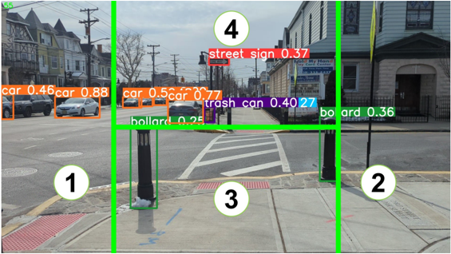
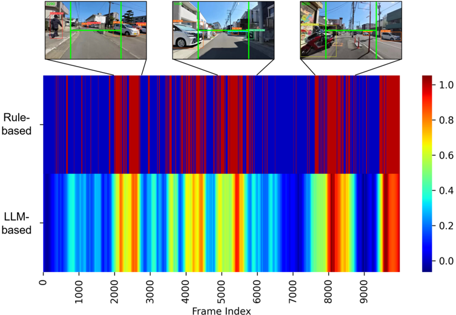

## VISIONGPT: LLM-ASSISTED REAL-TIME ANOMALY DETECTION FOR SAFE VISUAL NAVIGATION

Hao Wang

School of Computing Clemson University Clemson, SC, USA hao9@g.clemson.edu

Ashish Bastola School of Computing Clemson University Clemson, SC, USA abastol@g.clemson.edu

## Jiayou Qin

Department of Electrical and Computer Engineering Stevens Institute of Technology Hoboken, NJ, USA jqin6@stevens.edu

Xiwen Chen School of Computing Clemson University Clemson, SC, USA

xiwenc@g.clemson.edu

## John Suchanek

School of Computing Clemson University Clemson, SC, USA

jsuchan@g.clemson.edu

## Zihao Gong

School of Cultural and Social Studies Tokai University Tokyo, Japan 0CPD1206@mail.u-tokai.ac.jp

Abolfazl Razi School of Computing Clemson University Clemson, SC, USA arazi@clemson.edu

## ABSTRACT

This paper explores the potential of Large Language Models(LLMs) in zero-shot anomaly detection for safe visual navigation. With the assistance of the state-of-the-art real-time open-world object detection model Yolo-World and specialized prompts, the proposed framework can identify anomalies within camera-captured frames that include any possible obstacles, then generate concise, audio-delivered descriptions emphasizing abnormalities, assist in safe visual navigation in complex circumstances. Moreover, our proposed framework leverages the advantages of LLMs and the open-vocabulary object detection model to achieve the dynamic scenario switch, which allows users to transition smoothly from scene to scene, which addresses the limitation of traditional visual navigation. Furthermore, this paper explored the performance contribution of different prompt components, provided the vision for future improvement in visual accessibility, and paved the way for LLMs in video anomaly detection and vision-language understanding.

Keywords Open World Object Detection · Anomaly Detection · Large Language Model · Vision-language Understanding · Prompt Engineering · Generative AI · GPT

## 1 Introduction

Accessible technologies have seen remarkable development in recent years due to the rise of machine learning and mobile computing [1–5]. Deep learning has significantly enhanced the accuracy and speed of object detection and segmentation models [5–9], which catalyzed a surge of real-world applications, impacting numerous aspects of daily life, industry, and transportation. Visual navigation has benefited significantly from the evolution of such computer vision techniques [5, 10, 11].

Consequently, innovations such as Augmented Reality (AR) have been instrumental in enhancing the safety and mobility of individuals across various scenarios, including driving and walking. Many of these technologies aim to bridge the

gap between the physical world and digital assistance, highlighting the critical need for adaptive solutions to navigate the complexities of real-world environments.

However, visual navigation presents significant challenges in dynamic urban environments [11–13]. Although the newborn zero-shot object detection [14] addresses the significant limitations of classical object detection models such as YOLOv8 [15, 16] in complex scenarios, it encounters difficulties in developing custom class labels for dynamic environments due to the long-tail response. Furthermore, real-time vision-language understanding can be critical for complex scenarios for safety concerns, especially for visually impaired individuals who must traverse streets, sidewalks, and other public spaces.

Vision-language understanding has recently become a hotspot due to the emergence of Multimodal Large Language Models (LLMs) [17]. Multimodal LLMs represent an evolutionary leap in the field of artificial intelligence as they integrate the processing of text, images, and even audio and video [18] to create a comprehensive understanding of the world that mirrors human cognitive abilities more closely than ever before, making it possible to handle more advances tasks for robotics [19, 20]. Specifically, GPT-4V is now being heavily used in image tasks such as data evaluation [21, 22], medical image diagnosis [23–25], and content creation [26–28].

Figure 1: Framework for vision-language processing and prompting.

Multimodal LLMs possess substantial improvement in interpreting, analyzing, and generating content across different modalities [29], bringing the possibility to interdisciplinary applications [30, 31]. Interestingly, LLMs also exhibit impressive zero-shot and few-shot learning abilities, potentially enabling them to capture visual concepts with minimal training data. This opens a way to address object detection challenges, particularly in data with limited annotation [32]. Recent research attempts to bring LLMs to the accessibility field, yet most work only focuses on basic natural language processing such as text reading, image recognition, and voice assistance [33].

Therefore, a critical gap exists when using the vision-language understanding of LLMs for safety and accessible applications. Despite past works that investigated the use of LLMs in visual assistance [34] and visual navigation [35–37], only a few focused on the safety aspects [32, 38] but barely considered the induced latency during the inference.

Our research introduces a framework that combines the speed of locally executed open-world object detection with the intelligence of LLMs to create a universal anomaly detection system. The primary goal of this system is to deliver real-time, personalized scene descriptions and safety notifications, ensuring the safety and ease of navigation for visually impaired users by identifying and alerting them to potential obstacles and hazards in their path, where these obstacles and hazards can be considered "anomalies" in the context of a safe and clear path for navigation. The proposed framework can also be applied to robotic systems, augmented reality platforms, and all other mobile computing edge units.

Particularly, the major contributions of this paper are summarized as follows:

- Zero-shot anomaly detection: The proposed integration is train-free and ready for video anomaly detection and annotation with different response preferences.
- Real-time feedback: Our framework is optimized for real-time response in complex scenarios with very low latency.
- Dynamic scene transition and interest setting: This framework can dynamically switch the object detection classes based on the user's needs. Furthermore, users can interact with the LLM module and setting a prior task (e.g., find the nearest bench).

## 2 Related Work

## 2.1 Open-vocabulary object detection

Open-vocabulary object detection (OVD) [39] represents a significant shift in object detection focusing on identifying items outside predefined categories. Initial efforts [40] trained on known classes for evaluating the detection of novel objects facing generalization and adaptability issues due to limited datasets and vocabularies. Recent approaches, however, [41 – 43] employ image-text matching with extensive data to expand the training vocabularies inspired by vision language pre-training [29, 44]. OWL-ViTs [45] and GLIP [46] utilize vision transformers and phrase grounding for effective OVD while Grounding DINO [47] combines these with detection transformers for crossmodality fusion. Despite the promise, existing methods often rely on complex detectors increasing computational demands significantly [48,49]. ZSD-YOLO [50] also explored an open-vocabulary detection with YOLO using language model alignment; however, YOLO-world [51] presents a more efficient and real-time OVD solution aiming to be much more efficient with real-time inference using an effective pre-training strategy while still being highly generalizable.

## 2.2 Prompt Engineering

Prompt engineering has emerged as a critical technique for unlocking the capabilities of large language models (LLMs) [52 – 55] to various applications without finetuning on large datasets. This involves carefully crafting text prompts, instructions, or examples to guide LLM behavior and elicit desired responses. Researchers are actively exploring prompt engineering using various prompting techniques such as zero-shot prompting [56], Few-shot prompting [57], Chain-ofthought prompting [58], self-ask prompting [59], etc. to fine-tune LLMs for various tasks, demonstrating significant performance gains compared to traditional model training approaches. Studies have showcased how prompt engineering can adapt LLMs for diverse natural language tasks like question-answering [60], smart-reply [55], summarization [61], and text classification [62, 63]. Furthermore, researchers are increasingly developing frameworks to systematize prompt engineering efforts. Such frameworks aim to simplify the creation of effective prompts and facilitate the adaptation of LLMs to specific domains and applications and are highly customizable to user needs. While prompt engineering has seen significant improvements in natural language processing, its potential in computer vision on accessibility remains less explored. Our work builds upon the success of prompt engineering in NLP, exploring its application in the visual domain to enhance object detection and description.

## 2.3 Accessible Technology

Computer vision-driven accessible technologies are mostly designed to empower individuals with visual impairments through enhanced scene understanding and hazard detection. A range of solutions exist, including mobile apps that provide object recognition and audio descriptions of surroundings [64–66], to wearable systems that offer real-time alerts about obstacles or potential dangers [67, 68]. For example, technologies that detect approaching vehicles and crosswalk signals significantly improve the safety of visually impaired pedestrians in urban environments. Moreover, computer vision is integrated into assistive technologies for reading text aloud from documents and identifying objects in daily life, enabling greater independence [5]. Research in this domain also focuses on indoor navigation, where object detection and spatial mapping can guide users within buildings and public spaces [69]. The core emphasis of these computer vision-powered accessibility technologies aims to enhance safety. By providing real-time information on key elements within an individual's surroundings, the risk of accidents and injuries is significantly reduced. Identifying potential hazards, such as oncoming traffic, obstacles on sidewalks, or unattended objects, allows visually impaired individuals to navigate with greater confidence and autonomy.

## 3 Methodology

Our system offers real-time anomaly alerts by integrating object detection with large language model capabilities, featuring a multi-module architecture. The system operates continuously with the object detection module processing

real-time camera frames. Multi-frame object information is then included in specially engineered prompts and submitted to the LLM module. The system then processes the LLM's response, classifying potential anomalies. Finally, the LLM module conveys important alerts and essential scene descriptions to the user.

The proposed project is fully open-sourced and available at: https://github.com/AIS-Clemson/VisionGPT

## 3.1 Object Detection Module

To ensure real-time performance on mobile devices, we employ lightweight yet powerful object detection models for real-time detection. Specifically, we applied the state-of-the-art YOLO-World model for open-vocabulary detection whose detection classes are customizable for a wide range of scenarios. As we focus on accessible visual navigation, we prompt the proposed LLM module to personalize the detection classes relevant to safe navigation in daily use circumstances, including pedestrians, vehicles, bicycles, traffic signals, and any potential road hazards or obstacles. Therefore, our proposed multi-functional prompt manager allows users to switch detection classes dynamically.

## 3.2 Detection Class Manager

This sub-module aims to create a detailed categorization for object detection algorithms, enabling them to identify and distinguish potential obstacles, hazards, and useful landmarks. This approach ensures the detection system is finely tuned to urban navigation's specific needs and challenges, enhancing the user's ability to move safely and independently through city streets. By focusing on road hazards and obstacles, the updated list aims to provide a more relevant and focused set of detection classes for the 'urban walking' context, optimizing the system's utility and effectiveness for the visually impaired user.

As shown in Figure 1, the user can interact with the LLM (advance) module. Based on this operation logic, the user can ask to change the object detection classes based on scenarios. For instance, if a user experiences a scene transition from sidewalk to park, the detection classes specialized for sidewalk objects (e.g., car, road cone, traffic signal, etc.) can be replaced by new object classes that are more relevant to the park scene to adapt to the situation.

Original prompt: "The user is switching the scene to custom\_scene please generate a new list that contains the top 100 related objects, including especially road hazards and possible obstacles"

## 3.3 Anomaly Handle Module

The proposed anomaly detection system aims to enhance navigation safety and awareness in various environments, particularly for visually impaired individuals and others requiring navigation assistance (e.g., robotics systems). The system analyzes real-time imagery captured from a camera and splits the image into four distinct regions based on an 'H' pattern.

Figure 2: Type H image splitter. (1) and (2) represent the left and right area, (3) represent the ground area, and (4) represent the front area.

Specifically, The system categorizes detected objects into four types based on their location within the image, each corresponding to a specific splitting part of the 'H' pattern segmentation: Left , Right , Front, and Ground. This categorization helps identify and respond to potential hazards more effectively. As shown in Figure 2.

Moreover, we find that:

- Left and Right: These regions cover the left and right 25% of the image, respectively. Objects detected here are typically in motion and may occupy much of the visual field. This area is crucial for identifying moving hazards such as vehicles or cyclists that may approach the user from the sides.
- Front: This region focuses on the center 50% of the image's width and the upper half vertically. It captures objects still at a distance but directly ahead of the user. Identifying objects in this region is necessary for assessing the overall situation and planning movements, especially in detecting upcoming objects at high speed such as cars and cyclists.
- Ground: Occupying the center 50% of the image's width and the lower half vertically, this area highlights objects nearby on the ground. Immediate attention to detections in this area is critical for avoiding hazards that require cautious navigation, such as cracks, puddles, or uneven surfaces.

The system then records detailed information for each object, including classification, size, and position. All size and position data have been converted into percentage expressions for a better interpretation by LLM. Finally, by analyzing objects' locations and sizes, alerts for anomalies are generated for objects that appear on the 'ground' area or occupy significant space (&gt; 10% in this study) in the 'left' or 'right' regions. The detection and movement information is then post-processed into a structured format, supporting LLM for better understanding.

Original prompt: "The location information center x , center y , height, width of objects is the proportion to the image, the detected objects are categorized into 4 type based on the image region. Left and Right: objects located on left 25% or right 25% of the image, these objects are usually moving and has large proportion.Front: objects that may still far away, can be used to discriminate the current situation.Ground: objects that may nearby."

## 3.4 Data Collection

Even though various datasets exist for static images [70] and CCTV camera feeds [71–73], no extensive datasets are available for detecting large anomalies in visual navigation from the first person's perspective.

Thus, we collected 50 video clips of point-of-view cruising in various scenarios. These custom videos are filmed in public spaces with first-person view and continuous forward-moving. Table ?? shows the details of the collected data.

Table 1: Collected data for video anomaly detection.

| Location    | Scene      | Movement    | Weather    |   Clips  | Total length    |   Unique Classes  |   Total detected objects |
|-------------|------------|-------------|------------|----------|-----------------|-------------------|--------------------------|
| Urban       | Sidewalk   | Scooter     | Cloudy     |       8  | 10 mins         |               31  |                    16944 |
| Suburban    | Bikeline   | Scooter     | Cloudy     |       5  | 6 mins          |               26  |                     8394 |
| Urban       | Park       | Scooter     | Cloudy     |       6  | 5 mins          |               23  |                    15310 |
| City        | Road       | Biking      | Sunny      |       5  | 5 mins          |               21  |                     5464 |
| City        | Sidewalk   | Biking      | Sunny      |       7  | 6 mins          |               27  |                     9569 |
| City        | Park       | Biking      | Cloudy     |       5  | 5 mins          |               19  |                     4781 |
| Town        | Park       | Walking     | Cloudy     |       6  | 4 mins          |               18  |                     5156 |
| Town        | Sidewalk   | Walking     | Sunny      |       8  | 7 mins          |               14  |                     8274 |
| City        | Coast      | Walking     | Sunny      |       2  | 5 mins          |               37  |                    29280 |
| Suburban    | Theme Park | Walking     | Rain       |       3  | 6 mins          |               34  |                    24180 |

We then conducted the experiments by combining the open-vocabulary object detection model with our novel imagesplitting method to annotate the frames as anomalies.

Specifically, a frame is labeled as an anomaly if it meets either of the following criteria:

1. Objects are detected within the Ground area.
2. Objects appear in either the Left or the Right areas of the image and occupy more than 10% of the total image area.

We set this rule-based method as the baseline of anomaly detection in this study, as our captured video clips are customized for this H-splitting principle.

## 3.5 LLM Module

This module processes the detected object information and passing to the LLM. Specifically, we use both GPT-3.5 and GPT-4 to process the information. First, GPT-3.5 is mainly used for low-level information processes such as

object detection data analysis, data format converting, and prompt reasoning. Therefore, GPT-4 is used for a high-level command instance understanding and a comprehensive vision-language understanding.

The system sensitivity settings indicate a focus on identifying and reporting hazards based on their potential impact on the user's safety and navigation. The system's goal to report objects based on their level of inconvenience or danger aligns with the anomaly detection objective of identifying and reacting to deviations that matter most in the given context. Note that the system sensitivity in the context is distinct from the model sensitivity as a statistical term.

These prompts sketch the conceptual framework and operational guidelines for a voice-assisted navigation system for visual accessibility. The system utilizes data from a phone camera, which is always facing forward, to detect objects and categorize their location within the field of view. Based on these analyses, the system provides auditory feedback to users, helping them navigate their environment safely and avoid potential hazards. Furthermore, the annotated data can be used for the training of other anomaly detection models.

The main LLM prompts consist of:

- Prompt instruction: "You are a voice assistant for a visually impaired user, the input is the actual data collected by a phone camera, and the phone is always facing front, please provide the key information for the blind user to help him navigate and avoid potential danger. Please note that the center\_x and center\_y represent the object location (proportional to the image), object height and width are also a proportion."
- Prompt sensitivity: "System sensitivity: Incorporate the sensitivity setting in your response. For a lowsensitivity setting, identify and report only imminent and direct threats to safety. For medium sensitivity, include potential hazards that could pose a risk if not avoided. For high sensitivity, report all detected objects that could cause any inconvenience or danger. Current sensitivity: low."

## 4 Experiments

We compare our proposed vision-LLM system with the rule-based anomaly detection (baseline) to show its performance and reliability.

## 4.1 System Optimization

While the proposed system is running, we input captured images into the object detection model every 5 frames to boost the FPS (Frame-Per-Second), this can significantly improve the performance, especially for mobile devices that have limited computation resources. Then, we send the detected information to the anomaly handle module to label the frames as the baseline. With the frame compensation, the real-time detection performance is boosted from 16 FPS to 73 FPS, as shown in Table 4.

Meanwhile, we apply the LLM module to process the detected information every 30 frames in parallel due to the latency of LLMs. To optimize the latency for better performance, the proposed system uses the GPT 3.5 Turbo model as the core of the LLM module.

## 4.2 Detection Accuracy

By setting the rule-based detector as the baseline, this study aims to test the zero-shot learning capability of the LLM detector, and meanwhile, interpret which prompt may impact the performance significantly.

After comparing the annotation results of prompt-based anomaly detection with the rule-based anomaly detection on our collected data, we find that prompt-based anomaly detection achieves high precision with all prompt modules working properly. Specifically, we compared the LLM anomaly detection with different sensitivity settings: low, normal, and high. As shown in Figure 3, the Receiver Operating Characteristic (ROC) curve indicates that a low system sensitivity leads to better performance, as it is less sensitive than the rule-based detector. For instance, objects detected by the rule-based detector with low confidence and classes of low risk will be filtered by LLM due to no emergency. Conversely, the higher the system sensitivity, the worse the performance, as the system tends to categorize all possible anomalies as immediate emergencies.

As shown in Figure 4, the LLM anomaly detector with low-system sensitivity captures more True Positive and True Negative cases and tries to minimize the False Positive rate.

Figure 3: ROC curve.

## 4.3 Quality Evaluation

We picked one of the video clips to analyze the detection difference between the rule-based detector and the LLM anomaly detector. Specifically, in Figure 5, the first row shows the anomalies labeled by the rule-based detector, while the second row indicates the anomalies predicted by the LLM-based detector (low sensitivity setting). As shown in Figure 5, the proposed LLM detector has less acuity with a low-sensitivity prompt setting, which tends to filter anomalies that are non-emergency. Table 2 shows the selected sample output of the LLM module.

Figure 5: Anomaly annotation. The first row represents the labeled anomalies by the rule-based detector (binary), and the second row represents the anomalies predicted by the proposed LLM detector (float). Color represents the probability of anomalies.

Figure 4: Confusion matrix of total frames. LLM setting is low-system sensitivity setting.

Table 2: Selected feedback and caption of the output of the LLM module. Frane ID indicates the video frame index, the Anomaly Index represents the predicted anomalies of LLM, and Reason represents the response message from LLM for anomaly interpretation.

|   Frame ID  |   Anomaly Index  | Reason                                      |
|-------------|------------------|---------------------------------------------|
|       2290  |             0.85 | ’Car and people nearby.’                    |
|       3770  |             0.2  | ’Green traffic light detected.’             |
|       4430  |             0.5  | ’Obstacles in path.’                        |
|       5450  |             0.7  | ’Car on the left’                           |
|       7000  |             0    | ’No immediate danger.’                      |
|       8230  |             1    | ’Bike in close proximity’                   |
|       9800  |             1    | High risk of collision with multiple people |

## 4.4 Ablation Study

To explore the contribution of different prompt modules, we conducted the ablation study of each module. Table 3 shows that the proposed system performs worse without specific prompt modules. For instance, while the instruction prompt is missing, the system may generate random content due to the confusion of the current task and lack of instruction. Moreover, missing region information of detected objects may also weaken the performance, as the system cannot evaluate the priority of the emergency.

Table 3: Ablation study. ✓indicates incorporated modules of system, and ✗indicate missing modules

| Sensitivity    | Location    | Instruction    |   AP  |   AUC |
|----------------|-------------|----------------|-------|-------|
| Low            | ✓           | ✓              | 88.01 | 87.26 |
| Normal         | ✓           |                | 82.73 | 81.17 |
| High           | ✓           | ✓              | 72.35 | 77.29 |
| g
 Low         | ✓           | ✗              | 68.84 | 73.64 |
| Low            | ✗           | ✓              | 69.57 | 75.56 |
| ✗              | ✓           | ✓              | 69.16 | 80.39 |

Moreover, we find that LLM produced different performances with different sensitivity prompts. Unexpectedly, Low system sensitivity appears higher accuracy and precision, as the system tries to catch True Positive cases as much as possible and avoid false alarms. This is significant for visually impaired navigation, as the user can efficiently avoid misinformation and frequent-unnecessary alerts.

## 4.5 Performance Evaluation

We further explore the performance efficiency of the proposed system on multiple platforms to reveal its potential for other applications.

Latency: As shown in Table 4, we measured end-to-end system latency and individual module processing times to identify bottlenecks and optimize for real-time performance. Results indicated an average end-to-end latency of 60 ms on the mobile device (e.g., smartphone) with neural engines, ensuring timely feedback.

| Task         | Model            | Framework    | Chipset    | Architecture    |   FPS  | Latency    | w/ Frame Compensation   |
|--------------|------------------|--------------|------------|-----------------|--------|------------|-------------------------|
| Detection    | Yolo-v8l         | Pytorch      | V100       | GPU             |  22.01 | 45 ms      | 102.56                  |
| Detection    | Yolo-v8x         | Pytorch      | V100       | GPU             |  14.22 | 71 ms      | 70.11                   |
| Segmentation | Yolo-v8x-seg     | Pytorch      | V100       | GPU             |  12.06 | 83 ms      | 59.68                   |
| Detection    | Yolov8-World     | Pytorch      | V100       | GPU             |  20.12 | 50 ms      | 98.06                   |
| Detection    | Yolov8x-World-v2 | Pytorch      | V100       | GPU             |  16.74 | 62 ms      | 76.88                   |
| Detection    | Yolov8x-World-v2 | CoreML       | M2         | CPU             |   5.01 | 199 ms     | N/A                     |
| Detection    | Yolov8x-World-v2 | CoreML       | M2         | Neural Engine   |  19.6  | 51 ms      | N/A                     |
| Detection    | Yolov8x-World-v2 | CoreML       | A16-Bionic | CPU             |   1.26 | 789 ms     | N/A                     |
| Detection    | Yolov8x-World-v2 | CoreML       | A16-Bionic | Neural Engine   |  16.24 | 61 ms      | N/A                     |

Table 4: Object Detector Test on multiple platforms. A16-Bionic processors are used in iPhone 14 pro max, and M2 processors are widely used in Vision Pro and the latest Mac models. The PyTorch-based implementation was run on NVIDIA GPU.

Economy: We further investigated the system latency and token consumption for economy evaluation. We designed three different modes for users to choose from:

- Voice only: only output voice messages for emergency response, minimum latency.
- Annotation: output both anomaly index and reason for system testing and practical annotation.
- Full: output full information in a structured JSON format. (See the original prompt for more information)

Table 5: Economy and latency test.

| Mode           | LLM    |   Latency  |   Completion Token |   Prompt Tokens  |   Total Tokens  |   Charge (USD/day) |
|----------------|--------|------------|--------------------|------------------|-----------------|--------------------|
| Voice only     | GPT3.5 |       407  |                35  |             573  |            608  |               2.44 |
| y 
 Annotation | GPT3.5 |       628  |                48  |             573  |            617  |               2.58 |
| Full           | GPT3.5 |      1818  |               176  |            1195  |           1371  |              13.53 |

As shown in Table 5, we estimated the cost of our system with different modes. The prices are calculated with an average of 2 hours of daily usage and are based on the chatGPT API pricing policy.

Original prompt:

- Prompt\_format\_full: 'Please organize your output into this format: "scene": quickly describe the current situation for blind user; "key\_objects": quickly and roughly locate the key objects for blind user; "anomaly\_checker": quickly diagnose if there is potential danger for a blind person; "anomaly\_label": output 1 if there is an emergency, output 0 if not; "anomaly\_index": object\_id, danger\_index, estimate a score from 0 to 1 about each objects that may cause danger; "voice\_guide": the main output to instant alert the blind person for emergency.'
- Prompt\_format\_voice: 'Please organize your output into this format: "voice\_guide": the main output to instantly alert the blind person for an emergency.'
- Prompt\_format\_annotation: 'Please organize your output into this format: "anomaly\_score": predict a score from 0 to 1 to evaluate the emergency level; "reason": explain your annotation reason within 10 words.'

## 5 Conclusion

This research demonstrates the significant potential of combining lightweight mobile object detection with large language models to enhance accessibility for visually impaired individuals. Our system successfully provides real-time scene descriptions and hazard alerts, achieving low latency and demonstrating the flexibility of prompt engineering for tailoring LLM output to this unique domain. Our experiments highlight the importance of balancing detection accuracy with computational efficiency for mobile deployment. Prompt design is a key component of our system in guiding LLM responses and ensuring the relevance of generated descriptions. Additionally, the integration of user feedback proved invaluable for refining the system's usability and overall user experience.

While this project offers a promising foundation, further research is warranted. Explorations into even more advanced prompt engineering for complex scenarios would pave the way for the wide adoption of such assistive technologies. Our findings illustrate the power of integrating computer vision and large language models, leading to greater independence and safety in daily life: a true testament to AI's ability to improve the quality of life for all.

## References

- [1] Jonathan Donner. After access: Inclusion, development, and a more mobile Internet. MIT press, 2015.
- [2] Fatma Al-Muqbali, Noura Al-Tourshi, Khuloud Al-Kiyumi, and Faizal Hajmohideen. Smart technologies for visually impaired: Assisting and conquering infirmity of blind people using ai technologies. In 2020 12th Annual Undergraduate Research Conference on Applied Computing (URC), pages 1–4. IEEE, 2020.
- [3] Muiz Ahmed Khan, Pias Paul, Mahmudur Rashid, Mainul Hossain, and Md Atiqur Rahman Ahad. An ai-based visual aid with integrated reading assistant for the completely blind. IEEE Transactions on Human-Machine Systems, 50(6):507–517, 2020.
- [4] Bing Li, Juan Pablo Munoz, Xuejian Rong, Qingtian Chen, Jizhong Xiao, Yingli Tian, Aries Arditi, and Mohammed Yousuf. Vision-based mobile indoor assistive navigation aid for blind people. IEEE transactions on mobile computing, 18(3):702–714, 2018.

- [5] Ashish Bastola, Md Atik Enam, Ananta Bastola, Aaron Gluck, and Julian Brinkley. Multi-functional glasses for the blind and visually impaired: Design and development. In Proceedings of the Human Factors and Ergonomics Society Annual Meeting, volume 67, pages 995–1001. SAGE Publications Sage CA: Los Angeles, CA, 2023.
- [6] Mouna Afif, Riadh Ayachi, Yahia Said, Edwige Pissaloux, and Mohamed Atri. An evaluation of retinanet on indoor object detection for blind and visually impaired persons assistance navigation. Neural Processing Letters , 51:2265–2279, 2020.
- [7] Hernisa Kacorri, Kris M Kitani, Jeffrey P Bigham, and Chieko Asakawa. People with visual impairment training personal object recognizers: Feasibility and challenges. In Proceedings of the 2017 CHI Conference on Human Factors in Computing Systems, pages 5839–5849, 2017.
- [8] Abinash Bhandari, PWC Prasad, Abeer Alsadoon, and Angelika Maag. Object detection and recognition: using deep learning to assist the visually impaired. Disability and Rehabilitation: Assistive Technology, 16(3):280–288, 2021.
- [9] Fahad Ashiq, Muhammad Asif, Maaz Bin Ahmad, Sadia Zafar, Khalid Masood, Toqeer Mahmood, Muhammad Tariq Mahmood, and Ik Hyun Lee. Cnn-based object recognition and tracking system to assist visually impaired people. IEEE access, 10:14819–14834, 2022.
- [10] Askat Kuzdeuov, Shakhizat Nurgaliyev, and Hüseyin Atakan Varol. Chatgpt for visually impaired and blind. Authorea Preprints, 2023.
- [11] Ashish Bastola, Julian Brinkley, Hao Wang, and Abolfazl Razi. Driving towards inclusion: Revisiting in-vehicle interaction in autonomous vehicles. arXiv preprint arXiv:2401.14571, 2024.
- [12] Yi Zhao, Yilin Zhang, Rong Xiang, Jing Li, and Hillming Li. Vialm: A survey and benchmark of visually impaired assistance with large models. arXiv preprint arXiv:2402.01735, 2024.
- [13] Ashish Bastola, Aaron Gluck, and Julian Brinkley. Feedback mechanism for blind and visually impaired: a review. In Proceedings of the Human Factors and Ergonomics Society Annual Meeting, volume 67, pages 1748–1754. SAGE Publications Sage CA: Los Angeles, CA, 2023.
- [14] Ankan Bansal, Karan Sikka, Gaurav Sharma, Rama Chellappa, and Ajay Divakaran. Zero-shot object detection. In Proceedings of the European conference on computer vision (ECCV), pages 384–400, 2018.
- [15] Joseph Redmon, Santosh Divvala, Ross Girshick, and Ali Farhadi. You only look once: Unified, real-time object detection. In Proceedings of the IEEE conference on computer vision and pattern recognition, pages 779–788, 2016.
- [16] Glenn Jocher, Ayush Chaurasia, and Jing Qiu. Ultralytics YOLO, January 2023.
- [17] Wansen Wu, Tao Chang, Xinmeng Li, Quanjun Yin, and Yue Hu. Vision-language navigation: A survey and taxonomy. Neural Computing and Applications, 36(7):3291–3316, 2024.
- [18] Josh Achiam, Steven Adler, Sandhini Agarwal, Lama Ahmad, Ilge Akkaya, Florencia Leoni Aleman, Diogo Almeida, Janko Altenschmidt, Sam Altman, Shyamal Anadkat, et al. Gpt-4 technical report. arXiv preprint arXiv:2303.08774, 2023.
- [19] Zhen Zhang, Anran Lin, Chun Wai Wong, Xiangyu Chu, Qi Dou, and KW Au. Interactive navigation in environments with traversable obstacles using large language and vision-language models. arXiv preprint arXiv:2310.08873, 2023.
- [20] Jialu Li and Mohit Bansal. Improving vision-and-language navigation by generating future-view image semantics. In Proceedings of the IEEE/CVF Conference on Computer Vision and Pattern Recognition, pages 10803–10812, 2023.
- [21] Feng Tian, Yuanyuan Lu, Fang Liu, Guibao Ma, Neili Zong, Xin Wang, Chao Liu, Ningbin Wei, and Kaiguang Cao. Supervised abnormal event detection based on chatgpt attention mechanism. Multimedia Tools and Applications , pages 1–19, 2024.
- [22] Yunkang Cao, Xiaohao Xu, Chen Sun, Xiaonan Huang, and Weiming Shen. Towards generic anomaly detection and understanding: Large-scale visual-linguistic model (gpt-4v) takes the lead. arXiv preprint arXiv:2311.02782 , 2023.
- [23] Harsha Nori, Nicholas King, Scott Mayer McKinney, Dean Carignan, and Eric Horvitz. Capabilities of gpt-4 on medical challenge problems. arXiv preprint arXiv:2303.13375, 2023.
- [24] Zhichao Yang, Zonghai Yao, Mahbuba Tasmin, Parth Vashisht, Won Seok Jang, Feiyun Ouyang, Beining Wang, Dan Berlowitz, and Hong Yu. Performance of multimodal gpt-4v on usmle with image: Potential for imaging diagnostic support with explanations. medRxiv, pages 2023–10, 2023.

- [25] Ethan Waisberg, Joshua Ong, Mouayad Masalkhi, Sharif Amit Kamran, Nasif Zaman, Prithul Sarker, Andrew G Lee, and Alireza Tavakkoli. Gpt-4: a new era of artificial intelligence in medicine. Irish Journal of Medical Science (1971-), 192(6):3197–3200, 2023.
- [26] Pragnya Sridhar, Aidan Doyle, Arav Agarwal, Christopher Bogart, Jaromir Savelka, and Majd Sakr. Harnessing llms in curricular design: Using gpt-4 to support authoring of learning objectives. arXiv preprint arXiv:2306.17459 , 2023.
- [27] Zhaoyi Sun, Hanley Ong, Patrick Kennedy, Liyan Tang, Shirley Chen, Jonathan Elias, Eugene Lucas, George Shih, and Yifan Peng. Evaluating gpt-4 on impressions generation in radiology reports. Radiology, 307(5):e231259, 2023.
- [28] Henner Gimpel, Kristina Hall, Stefan Decker, Torsten Eymann, Luis Lämmermann, Alexander Mädche, Maximilian Röglinger, Caroline Ruiner, Manfred Schoch, Mareike Schoop, et al. Unlocking the power of generative ai models and systems such as gpt-4 and chatgpt for higher education: A guide for students and lecturers. Technical report, Hohenheim Discussion Papers in Business, Economics and Social Sciences, 2023.
- [29] Alec Radford, Jong Wook Kim, Chris Hallacy, Aditya Ramesh, Gabriel Goh, Sandhini Agarwal, Girish Sastry, Amanda Askell, Pamela Mishkin, Jack Clark, et al. Learning transferable visual models from natural language supervision. In International conference on machine learning, pages 8748–8763. PMLR, 2021.
- [30] Timo Lüddecke and Alexander Ecker. Image segmentation using text and image prompts. In Proceedings of the IEEE/CVF Conference on Computer Vision and Pattern Recognition, pages 7086–7096, 2022.
- [31] Haotian Liu, Chunyuan Li, Qingyang Wu, and Yong Jae Lee. Visual instruction tuning. Advances in neural information processing systems, 36, 2024.
- [32] Haicheng Liao, Huanming Shen, Zhenning Li, Chengyue Wang, Guofa Li, Yiming Bie, and Chengzhong Xu. Gpt-4 enhanced multimodal grounding for autonomous driving: Leveraging cross-modal attention with large language models. Communications in Transportation Research, 4:100116, 2024.
- [33] An Yan, Zhengyuan Yang, Wanrong Zhu, Kevin Lin, Linjie Li, Jianfeng Wang, Jianwei Yang, Yiwu Zhong, Julian McAuley, Jianfeng Gao, et al. Gpt-4v in wonderland: Large multimodal models for zero-shot smartphone gui navigation. arXiv preprint arXiv:2311.07562, 2023.
- [34] Jiaqi Chen, Bingqian Lin, Ran Xu, Zhenhua Chai, Xiaodan Liang, and Kwan-Yee K Wong. Mapgpt: Map-guided prompting for unified vision-and-language navigation. arXiv preprint arXiv:2401.07314, 2024.
- [35] Bowen Pan, Rameswar Panda, SouYoung Jin, Rogerio Feris, Aude Oliva, Phillip Isola, and Yoon Kim. Langnav: Language as a perceptual representation for navigation. arXiv preprint arXiv:2310.07889, 2023.
- [36] Dhruv Shah, Błazej Osi ˙ ˙ nski, Sergey Levine, et al. Lm-nav: Robotic navigation with large pre-trained models of ´ ´ language, vision, and action. In Conference on Robot Learning, pages 492–504. PMLR, 2023.
- [37] Yue Zhang, Quan Guo, and Parisa Kordjamshidi. Navhint: Vision and language navigation agent with a hint generator. arXiv preprint arXiv:2402.02559, 2024.
- [38] Hochul Hwang, Sunjae Kwon, Yekyung Kim, and Donghyun Kim. Is it safe to cross? interpretable risk assessment with gpt-4v for safety-aware street crossing. arXiv preprint arXiv:2402.06794, 2024.
- [39] Alireza Zareian, Kevin Dela Rosa, Derek Hao Hu, and Shih-Fu Chang. Open-vocabulary object detection using captions. In Proceedings of the IEEE/CVF Conference on Computer Vision and Pattern Recognition, pages 14393–14402, 2021.
- [40] Xiuye Gu, Tsung-Yi Lin, Weicheng Kuo, and Yin Cui. Open-vocabulary object detection via vision and language knowledge distillation. arXiv preprint arXiv:2104.13921, 2021.
- [41] Yiwu Zhong, Jianwei Yang, Pengchuan Zhang, Chunyuan Li, Noel Codella, Liunian Harold Li, Luowei Zhou, Xiyang Dai, Lu Yuan, Yin Li, et al. Regionclip: Region-based language-image pretraining. In Proceedings of the IEEE/CVF Conference on Computer Vision and Pattern Recognition, pages 16793–16803, 2022.
- [42] Xingyi Zhou, Rohit Girdhar, Armand Joulin, Philipp Krähenbühl, and Ishan Misra. Detecting twenty-thousand classes using image-level supervision. In European Conference on Computer Vision, pages 350–368. Springer, 2022.
- [43] Size Wu, Wenwei Zhang, Sheng Jin, Wentao Liu, and Chen Change Loy. Aligning bag of regions for openvocabulary object detection. In Proceedings of the IEEE/CVF Conference on Computer Vision and Pattern Recognition, pages 15254–15264, 2023.
- [44] Chao Jia, Yinfei Yang, Ye Xia, Yi-Ting Chen, Zarana Parekh, Hieu Pham, Quoc Le, Yun-Hsuan Sung, Zhen Li, and Tom Duerig. Scaling up visual and vision-language representation learning with noisy text supervision. In International conference on machine learning, pages 4904–4916. PMLR, 2021.

- [45] Georg Heigold, Matthias Minderer, Alexey Gritsenko, Alex Bewley, Daniel Keysers, Mario Luciˇ ˇ c, Fisher Yu, ´ ´ and Thomas Kipf. Video owl-vit: Temporally-consistent open-world localization in video. In Proceedings of the IEEE/CVF International Conference on Computer Vision, pages 13802–13811, 2023.
- [46] Liunian Harold Li, Pengchuan Zhang, Haotian Zhang, Jianwei Yang, Chunyuan Li, Yiwu Zhong, Lijuan Wang, Lu Yuan, Lei Zhang, Jenq-Neng Hwang, et al. Grounded language-image pre-training. In Proceedings of the IEEE/CVF Conference on Computer Vision and Pattern Recognition, pages 10965–10975, 2022.
- [47] Shilong Liu, Zhaoyang Zeng, Tianhe Ren, Feng Li, Hao Zhang, Jie Yang, Chunyuan Li, Jianwei Yang, Hang Su, Jun Zhu, et al. Grounding dino: Marrying dino with grounded pre-training for open-set object detection. arXiv preprint arXiv:2303.05499, 2023.
- [48] Hao Zhang, Feng Li, Shilong Liu, Lei Zhang, Hang Su, Jun Zhu, Lionel M Ni, and Heung-Yeung Shum. Dino: Detr with improved denoising anchor boxes for end-to-end object detection. arXiv preprint arXiv:2203.03605 , 2022.
- [49] Shifeng Zhang, Cheng Chi, Yongqiang Yao, Zhen Lei, and Stan Z Li. Bridging the gap between anchor-based and anchor-free detection via adaptive training sample selection. In Proceedings of the IEEE/CVF conference on computer vision and pattern recognition, pages 9759–9768, 2020.
- [50] Johnathan Xie and Shuai Zheng. Zsd-yolo: Zero-shot yolo detection using vision-language knowledgedistillation. arXiv preprint arXiv:2109.12066, 1(2):3, 2021.
- [51] Tianheng Cheng, Lin Song, Yixiao Ge, Wenyu Liu, Xinggang Wang, and Ying Shan. Yolo-world: Real-time open-vocabulary object detection. arXiv preprint arXiv:2401.17270, 2024.
- [52] Jindong Gu, Zhen Han, Shuo Chen, Ahmad Beirami, Bailan He, Gengyuan Zhang, Ruotong Liao, Yao Qin, Volker Tresp, and Philip Torr. A systematic survey of prompt engineering on vision-language foundation models. arXiv preprint arXiv:2307.12980, 2023.
- [53] Yupeng Chang, Xu Wang, Jindong Wang, Yuan Wu, Linyi Yang, Kaijie Zhu, Hao Chen, Xiaoyuan Yi, Cunxiang Wang, Yidong Wang, et al. A survey on evaluation of large language models. ACM Transactions on Intelligent Systems and Technology, 2023.
- [54] Jiaqi Wang, Enze Shi, Sigang Yu, Zihao Wu, Chong Ma, Haixing Dai, Qiushi Yang, Yanqing Kang, Jinru Wu, Huawen Hu, et al. Prompt engineering for healthcare: Methodologies and applications. arXiv preprint arXiv:2304.14670, 2023.
- [55] Ashish Bastola, Hao Wang, Judsen Hembree, Pooja Yadav, Nathan McNeese, and Abolfazl Razi. Llm-based smart reply (lsr): Enhancing collaborative performance with chatgpt-mediated smart reply system (acm)(draft) llm-based smart reply (lsr): Enhancing collaborative performance with chatgpt-mediated smart reply system. arXiv preprint arXiv:2306.11980, 2023.
- [56] Xingchen Wan, Ruoxi Sun, Hanjun Dai, Sercan O Arik, and Tomas Pfister. Better zero-shot reasoning with self-adaptive prompting. arXiv preprint arXiv:2305.14106, 2023.
- [57] Tom Brown, Benjamin Mann, Nick Ryder, Melanie Subbiah, Jared D Kaplan, Prafulla Dhariwal, Arvind Neelakantan, Pranav Shyam, Girish Sastry, Amanda Askell, et al. Language models are few-shot learners. Advances in neural information processing systems, 33:1877–1901, 2020.
- [58] Jason Wei, Xuezhi Wang, Dale Schuurmans, Maarten Bosma, Fei Xia, Ed Chi, Quoc V Le, Denny Zhou, et al. Chain-of-thought prompting elicits reasoning in large language models. Advances in neural information processing systems, 35:24824–24837, 2022.
- [59] Ofir Press, Muru Zhang, Sewon Min, Ludwig Schmidt, Noah A Smith, and Mike Lewis. Measuring and narrowing the compositionality gap in language models. arXiv preprint arXiv:2210.03350, 2022.
- [60] Yuchen Zhuang, Yue Yu, Kuan Wang, Haotian Sun, and Chao Zhang. Toolqa: A dataset for llm question answering with external tools. Advances in Neural Information Processing Systems, 36, 2024.
- [61] Jonathan Pilault, Raymond Li, Sandeep Subramanian, and Christopher Pal. On extractive and abstractive neural document summarization with transformer language models. In Proceedings of the 2020 conference on empirical methods in natural language processing (EMNLP), pages 9308–9319, 2020.
- [62] Raul Puri and Bryan Catanzaro. Zero-shot text classification with generative language models. arXiv preprint arXiv:1912.10165, 2019.
- [63] Benjamin Clavié, Alexandru Ciceu, Frederick Naylor, Guillaume Soulié, and Thomas Brightwell. Large language models in the workplace: A case study on prompt engineering for job type classification. In International Conference on Applications of Natural Language to Information Systems, pages 3–17. Springer, 2023.

- [64] Rakesh Chandra Joshi, Saumya Yadav, Malay Kishore Dutta, and Carlos M Travieso-Gonzalez. Efficient multiobject detection and smart navigation using artificial intelligence for visually impaired people. Entropy, 22(9):941, 2020.
- [65] Lilit Hakobyan, Jo Lumsden, Dympna O'Sullivan, and Hannah Bartlett. Mobile assistive technologies for the visually impaired. Survey of ophthalmology, 58(6):513–528, 2013.
- [66] Karol Matusiak, Piotr Skulimowski, and P Strurniłło. Object recognition in a mobile phone application for visually impaired users. In 2013 6th International Conference on Human System Interactions (HSI), pages 479–484. IEEE, 2013.
- [67] Shafin Rahman, Salman Khan, and Nick Barnes. Improved visual-semantic alignment for zero-shot object detection. In Proceedings of the AAAI conference on artificial intelligence, volume 34, pages 11932–11939, 2020.
- [68] Ali Jasim Ramadhan. Wearable smart system for visually impaired people. sensors, 18(3):843, 2018.
- [69] Navid Fallah, Ilias Apostolopoulos, Kostas Bekris, and Eelke Folmer. The user as a sensor: navigating users with visual impairments in indoor spaces using tactile landmarks. In Proceedings of the SIGCHI Conference on Human Factors in Computing Systems, pages 425–432, 2012.
- [70] Wu Tang, De-er Liu, Xiaoli Zhao, Zenghui Chen, and Chen Zhao. A dataset for the recognition of obstacles on blind sidewalk. Universal Access in the Information Society, 22(1):69–82, 2023.
- [71] Xi Li, Anthony Dick, Chunhua Shen, Anton Van Den Hengel, and Hanzi Wang. Incremental learning of 3d-dct compact representations for robust visual tracking. IEEE transactions on pattern analysis and machine intelligence , 35(4):863–881, 2012.
- [72] Ramin Mehran, Alexis Oyama, and Mubarak Shah. Abnormal crowd behavior detection using social force model. In 2009 IEEE conference on computer vision and pattern recognition, pages 935–942. IEEE, 2009.
- [73] Dong-in Kim and Jangwon Lee. Anomaly detection for visually impaired people using a 360 degree wearable camera. In IEEE/CVF Conference on Computer Vision and Pattern Recognition Workshops, 2022.

## A Original Prompt

This section illustrates all used prompts in the proposed system.

## A.1 LLM Instruction

System instructions are usually directly fed into LLMs as a self-prompt and generally do not consume token usage.

Main Instruction: "You are a voice assistant for a visually impaired user, the input is the actual data collected by a phone camera, and the phone is always facing front, please provide the key information for the blind user to help him navigate and avoid potential danger. Please note that the center\_x and center\_y represent the object location (proportional to the image), object height and width are also a proportion." System Sensitivity Prompt: "System sensitivity: Incorporate the sensitivity setting in your response. For a low-sensitivity setting, identify and report only imminent and direct threats to safety. For medium sensitivity, include potential hazards that could pose a risk if not avoided. For high sensitivity, report all detected objects that could cause any inconvenience or danger. Current sensitivity: low."

Location Prompt: "The location information center x , center y , height, width of objects is the proportion to the image, the detected objects are categorized into 4 type based on the image region. Left and Right: objects located on left 25% or right 25% of the image, these objects are usually moving and has large proportion.Front: objects that may still far away, can be used to discriminate the current situation.Ground: objects that may nearby."

Motion Prompt: "Using the information from last frame and current frame to analyze the movement (speed and direction) and location of each object to determine its trajectory relative to the user. Use this information to assess whether an object is moving towards the user or they are static. If moving, how quickly a potential collision might occur based on the object's speed and direction of movement."

## A.2 LLM Prompt

LLM prompts are the master prompts that are directly input from the user end, text tokens are counted to the usage. To control and optimize the usage, we designed three different output modes. Furthermore, the designed prompt will guide LLM to generate a structured data format (dictionary, list, JSON, etc.).

Full diagnose mode: 'Please organize your output into this format: "scene": quickly describe the current situation for blind user; "key\_objects": quickly and roughly locate the key objects for blind user; "anomaly\_checker": quickly diagnose if there is potential danger for a blind person; "anomaly\_label": output 1 if there is an emergency, output 0 if not; "anomaly\_index": object\_id, danger\_index, estimate a score from 0 to 1 about each objects that may cause danger; "voice\_guide": the main output to instant alert the blind person for emergency.'

Voice-only mode: 'Please organize your output into this format: "voice\_guide": the main output to instantly alert the blind person for an emergency.'

Annotation mode: 'Please organize your output into this format: "anomaly\_score": predict a score from 0 to 1 to evaluate the emergency level; "reason": explain your annotation reason within 10 words.'

## A.3 Other Prompts

Detection Classes Switch: "The user is switching the scene to custom\_scene please generate a new list that contains the top 100 related objects, including especially road hazards and possible obstacles"

Interest Target Setting: "Please analyze the user command and extract the user required object, output into this format: "add": object\_name."

## B Detection Labels for Custom Scenes

This section illustrates the detection classes generated by GPT-4 that are customized for specific scenes.

Visually impaired navigation: [ 'car', 'person', 'bus', 'bicycle', 'motorcycle', 'traffic light', 'stop sign', 'fountain', 'crosswalk', 'sidewalk', 'door', 'stair', 'escalator', 'elevator', 'ramp', 'bench', 'trash can', 'pole', 'fence', 'tree', 'dog', 'cat', 'bird', 'parking meter', 'mailbox', 'manhole', 'puddle', 'construction sign', 'construction barrier', 'scaffolding', 'hole', 'crack', 'speed bump', 'curb', 'guardrail', 'traffic cone', 'traffic barrel', 'pedestrian signal', 'street sign', 'fire hydrant', 'lamp post', 'bench', 'picnic table', 'public restroom', 'fountain', 'statue', 'monument', 'directional sign', 'information sign', 'map', 'emergency exit', 'no smoking sign', 'wet floor sign', 'closed sign', 'open sign', 'entrance sign', 'exit sign', 'stairs sign', 'escalator sign', 'elevator sign', 'restroom sign', 'men restroom sign', 'women restroom sign', 'unisex restroom sign', 'baby changing station', 'wheelchair accessible sign', 'braille sign', 'audio signal device', 'tactile paving', 'detectable warning surface', 'guide rail', 'handrail', 'turnstile', 'gate', 'ticket barrier', 'security checkpoint', 'metal detector', 'baggage claim', 'lost and found', 'information desk', 'meeting point', 'waiting area', 'seating area', 'boarding area', 'disembarking area', 'charging station', 'water dispenser', 'vending machine', 'ATM', 'kiosk', 'public telephone', 'public Wi-Fi hotspot', 'emergency phone', 'first aid station', 'defibrillator', 'tree', 'pole', 'lamp post', 'staff', 'road hazard']

Urban Walking: ['pedestrian', 'cyclist', 'car', 'bus', 'motorcycle', 'scooter', 'electric scooter', 'traffic light', 'stop sign', 'crosswalk', 'sidewalk', 'curb', 'ramp', 'stair', 'escalator', 'elevator', 'bench', 'trash can', 'pole', 'fence', 'tree', 'fire hydrant', 'lamp post', 'construction barrier', 'construction sign', 'scaffolding', 'hole', 'crack', 'speed bump', 'puddle', 'manhole', 'drain', 'grate', 'loose gravel', 'ice patch', 'snow pile', 'leaf pile', 'standing water', 'mud', 'sand', 'street sign', 'directional sign', 'information sign', 'parking meter', 'mailbox', 'bicycle rack', 'outdoor seating', 'planter box', 'bollard', 'guardrail', 'traffic cone', 'traffic barrel', 'pedestrian signal', 'crowd', 'animal', 'dog', 'bird', 'cat', 'public restroom', 'fountain',

'statue', 'monument', 'picnic table', 'outdoor advertisement', 'vendor cart', 'food truck', 'emergency exit', 'no smoking sign', 'wet floor sign', 'closed sign', 'open sign', 'entrance sign', 'exit sign', 'stairs sign', 'escalator sign', 'elevator sign', 'restroom sign', 'braille sign', 'audio signal device', 'tactile paving', 'detectable warning surface', 'guide rail', 'handrail', 'turnstile', 'gate', 'security checkpoint', 'water dispenser', 'vending machine', 'ATM', 'kiosk', 'public telephone', 'public Wi-Fi hotspot', 'emergency phone', 'charging station', 'first aid station', 'defibrillator', 'tree', 'pole', 'lamp post', 'staff', 'road hazard']

Walking General: ['vehicles', 'pedestrians', 'traffic signs and signals', 'roadway features', 'surface conditions', 'street furniture', 'construction areas', 'vegetation', 'animals', 'public amenities', 'navigation aids', 'temporary obstacles', 'emergency facilities', 'transportation hubs', 'electronic devices', 'safety features']

Urban Walking Hazards: ['person', 'cyclist', 'car', 'bus', 'motorcycle', 'scooter', 'fountain', 'red traffic light', 'green traffic light', 'stop sign', 'curb', 'ramp', 'stair', 'escalator', 'elevator', 'bench', 'trash can', 'pole', 'tree', 'fire hydrant', 'lamp post', 'construction barrier', 'construction sign', 'scaffolding', 'hole', 'crack', 'speed bump', 'puddle', 'manhole', 'drain', 'grate', 'loose gravel', 'ice patch', 'snow pile', 'leaf pile', 'standing water', 'mud', 'sand', 'street sign', 'directional sign', 'information sign', 'parking meter', 'mailbox', 'bicycle rack', 'outdoor seating', 'planter box', 'bollard', 'guardrail', 'traffic cone', 'traffic barrel', 'pedestrian signal', 'crowd', 'animal', 'dog', 'bird', 'cat', 'public restroom', 'fountain', 'statue', 'monument', 'picnic table', 'outdoor advertisement', 'vendor cart', 'food truck', 'emergency exit', 'no smoking sign', 'wet floor sign', 'closed sign', 'open sign', 'entrance sign', 'exit sign', 'stairs sign', 'escalator sign', 'elevator sign', 'restroom sign', 'braille sign', 'audio signal device', 'tactile paving', 'detectable warning surface', 'guide rail', 'handrail', 'turnstile', 'gate', 'security checkpoint', 'water dispenser', 'vending machine', 'ATM', 'kiosk', 'public telephone', 'emergency phone', 'charging station', 'first aid station', 'defibrillator', 'oil spill', 'road debris', 'branches', 'water' 'low-hanging signage', 'road signs', 'roadworks', 'excavation sites', 'utility works', 'fallen objects', 'spilled cargo', 'flood', 'ice', 'snowdrift', 'landslide debris', 'erosion damage', 'parked vehicles', 'moving equipment', 'large gatherings', 'parade', 'marathon', 'street fair', 'scaffolding', 'electrical hazards', 'wire tangle', 'manhole covers', 'street elements', 'road hazards', 'toxic spill', 'biohazard materials', 'wildlife crossings', 'stray animals', 'pets', 'flying debris', 'air pollution','smoke plumes', 'dust storms', 'sandstorms', 'floods', 'road crack']

Walking test: [ 'vehicle', 'pedestrian', 'cyclist', 'traffic signal', 'street sign', 'crosswalk', 'sidewalk', 'curb', 'ramp', 'stair', 'escalator', 'elevator', 'public seating', 'trash receptacle', 'street furniture', 'tree', 'construction site', 'road obstruction', 'loose materials', 'slick surface', 'animal', 'outdoor advertisement', 'vendor', 'water feature', 'monument', 'information point', 'access point', 'safety equipment', 'navigation aid', 'public amenity', 'transport hub', 'obstacle crowd' ]

Annotation mask = ’people’, ’human face’, ’car license plate’, ’license plate’, ’plate’