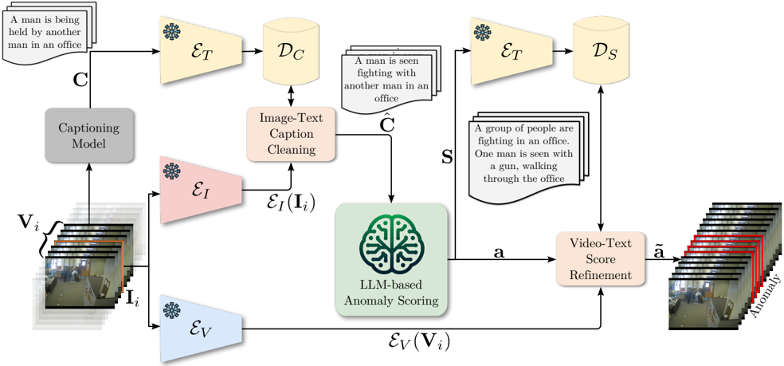

This CVPR paper is the Open Access version, provided by the Computer Vision Foundation. Except for this watermark, it is identical to the accepted version;

the final published version of the proceedings is available on IEEE Xplore.

## Harnessing Large Language Models for Training-free Video Anomaly Detection

Luca Zanella 1 Willi Menapace 1 Massimiliano Mancini 1 Yiming Wang 2 Elisa Ricci1,2 University of Trento 1 Fondazione Bruno Kessler 2

https://lucazanella.github.io/lavad/

Figure 1. We introduce the first training-free method for video anomaly detection (VAD), diverging from state-of-the-art methods that are ALL training-based with different degrees of supervision. Our proposal, LAVAD, leverages modality-aligned vision-language models (VLMs) to query and enhance the anomaly scores generated by large language models (LLMs).

supervision of both normal and abnormal videos) [11 , 13 , 15 , 24 , 28 , 35], one-class (i.e. only normal videos) [18 , 20 , 21 , 25 , 37 , 38], and unsupervised (i.e. unlabeled videos) [30 , 31 , 40]. While more supervision leads to better results, the cost of manual annotation is prohibitive. On the other hand, unsupervised methods assume abnormal videos to constitute a certain portion of the training data, a fragile assumption in practice without human intervention.

Crucially, every existing method necessitates a training procedure to establish an accurate VAD system, and this entails some limitations. One primary concern is generalization: a VAD model trained on a specific dataset tends to underperform in videos recorded in different settings (e.g., daylight versus night scenes). Another aspect, particularly relevant to VAD, is the challenge of data collection, especially in certain application domains (e.g. video surveillance) where privacy issues can hinder data acquisition. These considerations led us to explore a novel research question: Can we develop a training-free VAD method?

## Abstract

Video anomaly detection (VAD) aims to temporally locate abnormal events in a video. Existing works mostly rely on training deep models to learn the distribution of normality with either video-level supervision, one-class supervision, or in an unsupervised setting. Training-based methods are prone to be domain-specific, thus being costly for practical deployment as any domain change will involve data collection and model training. In this paper, we radically depart from previous efforts and propose LAnguage-based VAD (LAVAD), a method tackling VAD in a novel, trainingfree paradigm, exploiting the capabilities of pre-trained large language models (LLMs) and existing vision-language models (VLMs). We leverage VLM-based captioning models to generate textual descriptions for each frame of any test video. With the textual scene description, we then devise a prompting mechanism to unlock the capability of LLMs in terms of temporal aggregation and anomaly score estimation, turning LLMs into an effective video anomaly detector. We further leverage modality-aligned VLMs and propose effective techniques based on cross-modal similarity for cleaning noisy captions and refining the LLM-based anomaly scores. We evaluate LAVAD on two large datasets featuring realworld surveillance scenarios (UCF-Crime and XD-Violence), showing that it outperforms both unsupervised and one-class methods without requiring any training or data collection.

## 1. Introduction

Video anomaly detection (VAD) aims to temporally localize events that deviate significantly from the normal pattern in a given video, i.e. the anomalies. VAD is challenging as anomalies are often undefined and context-dependent, and they rarely occur in the real world. The literature [10] often casts VAD as an out-of-distribution detection problem and learns the normal distribution using training data with different levels of supervision (see Fig. 1), including fullysupervised (i.e. frame-level supervision of both normal and abnormal videos) [1 , 32], weakly-supervised (i.e. video-level

In this paper, we aim to answer this challenging question. Developing a training-free VAD model is hard due to the lack of explicit visual priors on the target setting. However, such priors might be drawn using large foundation models, renowned for their generalization capability and wide knowledge encapsulation. Thus, we investigate the potential of combining existing vision-language models (VLMs) with large language models (LLMs) in addressing training-free VAD. On top of our preliminary findings, we propose the first training-free LAnguage-based VAD method (LAVAD), that jointly leverages pre-trained VLMs and LLMs for VAD. LAVAD first exploits an off-the-shelf captioning model to generate a textual description for each video frame. We address potential noise in the captions by introducing a cleaning process based on the cross-modal similarity between captions and frames in the video. To capture the dynamics of the scene, we use an LLM to summarize captions within a temporal window. This summary is used to prompt the LLM to provide an anomaly score for each frame, which is further refined by aggregating the anomaly scores among frames with semantically similar temporal summaries. We evaluate LAVAD on two benchmark datasets: UCF-Crime [24] and XD-Violence [36], and empirically show that our trainingfree proposal outperforms unsupervised and one-class VAD methods on both datasets, demonstrating that it is possible to address VAD with no training and no data collection .

Contributions. In summary, our contributions are:

- We investigate, for the first time, the problem of trainingfree VAD, advocating its importance for the deployment of VAD systems in real settings where data collection may not be possible.
- We propose LAVAD, the first language-based method for training-free VAD using LLMs to detect anomalies exclusively from a scene description.
- We introduce novel techniques based on cross-modal similarity with pre-trained VLMs to mitigate noisy captions and refine the LLM-based anomaly scoring, effectively improving the VAD performance.
- Experiments show that, while using no task-specific supervision and no training, LAVAD achieves competitive results w.r.t. unsupervised and one-class VAD methods, opening new perspectives for future VAD research.

## 2. Related Work

Video Anomaly Detection. Existing literature on trainingbased VAD methods can be categorized into four groups, depending on the level of supervision: supervised, weaklysupervised, one-class classification, and unsupervised. Supervised VAD relies on frame-level labels to distinguish normal from abnormal frames [1 , 32]. However, this scenario has received little attention due to its prohibitive annotation effort. Weakly-supervised VAD methods have access to video-level labels (the entire video is labeled as abnormal if at least one frame is abnormal, otherwise is regarded as normal) [11 , 13 , 15 , 24 , 28 , 35]. Most of these methods utilize 3D convolutional neural networks for feature learning and employ a multiple instance learning (MIL) loss for training. One-class VAD methods train only on normal videos, although manual verification is necessary to ensure the normality of the collected data. Several methods [18 , 20 , 21 , 25 , 37 , 38] have been proposed, e.g. considering generative models [37] or pseudo-supervised methods, where pseudo-anomalous instances are synthesized from normal training data [38]. Finally, Unsupervised VAD methods do not rely on predefined labels, leveraging both normal and abnormal videos with the assumption that most videos contain normal events [26 , 27 , 30 , 31 , 40]. Most methods in this category exploit generative models to capture normal data patterns in videos. In particular, generative cooperative learning (GCL) [40] employs alternating training: an autoencoder reconstructs input features, and pseudo-labels from reconstruction errors guide a discriminator. Tur et al . [30 , 31] use a diffusion model to reconstruct the original data distribution from noisy features, calculating anomaly scores based on the reconstruction error between denoised and original samples. Other approaches [26 , 27] train a regressor network from a set of pseudo-labels generated using OneClassSVM and iForest [16].

Instead, we completely sidestep the need for collecting data and training the model by exploiting existing largescale foundation models to design a training-free pipeline for VAD.

LLMs for VAD. Recently, LLMs have been explored in detecting visual anomalies across diverse application domains. Kim et al. [12] propose an unsupervised method that mainly leverages VLMs for detecting anomalies, where ChatGPT is only utilized to produce textual descriptions that characterize normal and anomalous elements. However, the method involves human-in-the-loop to refine the LLM's outputs according to specific application contexts and requires further training to adapt the VLM. Other examples include exploiting LLMs for spatial anomaly detection in images addressing specific applications in robotics [4] or industry [7].

Differently, we leverage LLMs together with VLMs to address temporal anomaly detection on videos and propose the first training-free method for VAD, requiring no training and no data collection.

## 3. Training-Free VAD

In this section, we first formalize the VAD problem and the proposed training-free setting (Sec. 3.1). We then analyze the capabilities of LLMs in scoring anomalies in video frames (Sec. 3.2). Finally, we describe LAVAD, our proposed VAD method (Sec. 3.3).

Figure 2. Bar plot of the VAD performance (AUC ROC) by querying LLMs with textual descriptions of video frames from various captioning models on the UCF-Crime test set. Different bars correspond to different variants of the captioning model BLIP-2 [14], while different colors indicate two different LLMs [9 , 29]. For reference, we also plot the performance of the best-performing unsupervised method [27] in a red dashed line, and that of a random classifier in a gray dashed line.

Figure 3. The anomaly score predicted by Llama [29] over time for video Shooting033 from UCF-Crime. We highlight some sample frames with their associated BLIP-2 captions to demonstrate that the caption can be semantically noisy or incorrect (red bounding boxes are for abnormal predictions while blue bounding boxes are for normal predictions). Ground-truth anomalies are highlighted. In particular, the caption of the frame enclosed by a blue bounding box within the ground truth anomaly fails to accurately represent the visual content, leading to a wrong classification due to the low anomaly score given by the LLM.

## 3.1. Problem formulation

Given a test video V = [I1 , . . . , I M ] of M frames, traditional VAD methods aim to learn a model f, which can classify each frame I ∈ V as either normal (score 0) or anomalous (score 1), i.e . f : I M → [0 , 1] M with I being the image space. f is usually trained on a dataset D that consists of tuples in the form (V, y). Depending on the supervision level, y can be either a binary vector with frame-level labels (fully-supervised), a binary video-level label (weakly-supervised), a default one (one-class), or ab- sent (unsupervised). However, in practice, it can be costly to collect y as anomalies are rare, and V itself due to potential privacy concerns. Moreover, both label and video data may need regular updates due to evolving application contexts.

Differently, in this paper, we introduce a novel setup for VAD, termed as training-free VAD. Under this setting, we aim to estimate the anomaly score of each I ∈ V using only pre-trained models at inference time, i.e. without any training or fine-tuning involving a training dataset D .

## 3.2. Are LLMs good for VAD?

We propose to address training-free VAD by exploiting recent advances in LLMs. As the use of LLMs in VAD is still in its infancy [12], we first analyze the capabilities of LLMs in producing an anomaly score based on a textual description of a video frame.

To achieve this, we first exploit a state-of-the-art captioning model ΦC , i.e. BLIP-2 [14], to generate a textual description for each frame I ∈ V. We then treat anomaly score estimation as a classification task, asking an LLM ΦLLM to select only one score from a list of 11 uniformly sampled values in the interval [0 , 1], where 0 means normal and 1 anomalous. We get the anomaly score as:

<!-- formula-not-decoded -->

where PC is a context prompt that provides priors to the LLM regarding VAD, PF instructs the LLM on the desired output format to facilitate automated text parsing 1 , and ◦ is the text concatenation operation. We devise PC to simulate a potential end user of a VAD system, e.g. law enforcement agency, as we empirically observe that impersonation can be an effective way of guiding the output generation of the LLM. For example, we can form PC as: "If you were a law enforcement agency, how would you rate the scene described on a scale from 0 to 1, with 0 representing a standard scene and 1 denoting a scene with suspicious activities?". Note that PC does not encode any prior on the type of anomalies itself, but just on the context.

Finally, with the estimated anomaly score from Eq. (1), we measure the VAD performance using the standard area under the curve of the receiver operating characteristic (AUC ROC). Fig. 2 reports the results obtained on the test set of the UCF-Crime dataset [24] with different variants of BLIP2 for obtaining the frame captions, and with different LLMs including Llama [29] and Mistral [9] for computing the frame-level anomaly scores. For reference, we also provide the state-of-the-art performance under the unsupervised setting (the closest setting to ours) [27], and the random scoring as lower-bound. The plot demonstrates that state-of-the-art LLMs possess anomaly detection capabilities, largely outperforming random scoring. However, this performance is

1 The exact form of PF can be found in the Supp. Mat.

Figure 4. The architecture of our proposed LAVAD for addressing training-free VAD. For each test video V, we first employ a captioning model to generate a caption Ci for each frame Ii ∈ V, forming a caption sequence C. Our Image-Text Caption Cleaning component addresses noisy and incorrect raw captions based on cross-modal similarity. We replace the raw caption with a caption C
i ˆ C
i ∈ C whose textual embedding ET (C
i ˆ C
i ) is most aligned to the image embedding EI (Ii), resulting in a cleaned caption sequence C ˆ . To account for scene context and dynamics, our LLM-based Anomaly Scoring component further aggregates the cleaned captions within a temporal window centered around each I i by prompting the LLM to produce a temporal summary Si, forming a summary sequence S. The LLM is then queried to provide an anomaly score for each frame based on its Si, obtaining the initial anomaly scores a for all frames. Finally, our Video-Text Score Refinement component refines each ai by aggregating the initial anomaly scores of frames whose textual embeddings of the summaries are mostly aligned to the representation EV (Vi) of the video snippet Vi centered around Ii, leading to the final anomaly scores ˜a for detecting the anomalies ( anomalous frames are highlighted) within the video.

much lower w.r.t. trained state-of-the-art methods, even in an unsupervised setting.

We observe that two aspects might be the limiting factors in LLMs' performance. Firstly, the frame-level captions can be very noisy: the captions might be broken or may not fully reflect the visual content (see Fig. 3). Despite the use of BLIP-2 [14], the best off-the-shelf captioning model, some captions appear corrupted, thus leading to unreliable anomaly scores. Secondly, the frame-level caption lacks details about the global context and the dynamics of the scene, which are key elements when modeling videos. In the following, we address these two limitations and propose LAVAD, the first training-free method for VAD that leverages LLMs for anomaly scoring together with modality-aligned VLMs.

## 3.3. LAVAD: LAnguage-based VAD

LAVAD decomposes the VAD function f into five elements (see Fig. 4). As in the preliminary study, the first two are the captioning module ΦC mapping images to textual descriptions in the language space T , i.e . Φ C : I → T , and the LLM Φ LLM generating text from language queries, i.e . Φ LLM : T → T . The other elements involve three en- coders mapping input representations to a shared latent space Z. Specifically we have the image encoder EI : I → Z , the textual encoder ET ET : T → Z, and the video encoder E V : V → Z for videos. Note that all five elements involve only off-the-shelf frozen models.

Following the positive findings of the preliminary analysis, LAVAD leverages ΦLLM and ΦC to estimate the anomaly score for each frame. We design LAVAD to address the limitations related to noise and lack of scene dynamics in frame-level captions by introducing three components: i) Image-Text Caption Cleaning through the vision-language representations of EI and ET , ii) LLM-based Anomaly Scoring, encoding temporal information via ΦLLM and iii) VideoText Score Refinement of the anomaly scores via video-text similarity, using EV and ET . In the following, we describe each component in detail.

Image-Text Caption Cleaning. For each test video V, we first employ ΦC to generate a caption Ci for each frame I i ∈ V. Specifically, we denote as C = [C1, . . . , CM] the sequence of captions, where Ci = ΦC(Ii). However, as shown in Sec. 3.2, the raw captions can be noisy, with

broken sentences or incorrect descriptions. To mitigate this issue, we rely on the captions of the whole video C assuming that in this set there exist captions that are unbroken and better capture the content of their respective frames, an assumption often verified in practice as the video features a scene captured by static cameras at a high frame rate. Thus, semantic content among frames can overlap regardless of their temporal distances. From this perspective, we treat caption cleaning as finding the semantically closest caption to a target frame Ii within C .

Formally, we make use of vision-language encoders and form a set of caption embeddings by encoding each caption in C via ET ET , i.e . {ET (C1) , . . . , ET ET (CM)}. For each frame I i ∈ V, we compute its closest semantic caption as:

<!-- formula-not-decoded -->

where ⟨· , ·⟩ is the cosine similarity, and EI the image encoder of the VLM. We then build the cleaned set of captions as C ˆ = [C ˆ 1, . . . , C ˆ M ], replacing each initial caption Ci with its counterpart C
i ˆ C
i retrieved from C. By performing the caption cleaning process, we can propagate the captions of frames that are semantically more aligned to the visual content, regardless of their temporal positioning, to improve or correct noisy descriptions.

LLM-based Anomaly Scoring. The obtained caption sequence C ˆ , while being cleaner than the initial set, lacks temporal information. To overcome this, we leverage the LLM to provide temporal summaries. Specifically, we define a temporal window of T seconds, centered around Ii. Within this window, we uniformly sample N frames, forming a video snippet Vi, and a caption sub-sequence C ˆ i = {C
n ˆ C
n } N n=1 . We can then query the LLM with C ˆ i and a prompt PS to get the temporal summary Si centered on frame Ii:

<!-- formula-not-decoded -->

where the prompt PS is formed as "Please summarize what happened in few sentences, based on the following temporal description of a scene. Do not include any unnecessary details or descriptions. " 2 .

Coupling Eq. (3) with the refinement process of Eq. (2), we obtain a textual description of the frame (Si) which is semantically and temporally richer than Ci. With Si, we can then query the LLM for estimating an anomaly score. Following the same prompting strategy described in Sec. 3.2 , we ask Φ LLM to assign to each temporal summary Si a score aiin the interval [0 , 1]. We get the score as:

<!-- formula-not-decoded -->

where, as in Sec. 3.2 , PC is a context prompt containing VAD contextual priors, and PF provides information on the desired output format.

ˆ

2 C i is represented as an ordered list, with items separated by \n .

Video-Text Score Refinement. By querying the LLM for each frame in the video with Eq. (4), we obtain the initial anomaly scores of the video a = [a1, . . . , aM]. However, a is purely based on the language information encoded in their summaries, without taking into account the whole set of scores. Thus, we further refine them by leveraging the visual information to aggregate scores from semantically similar frames. Specifically, we encode the video snippet Vi centered around I i using EV and all the temporal summaries using ET . Let us define Ki as the set of indices of the Kclosest temporal summaries to Viin {S1, . . . , SM}, where the similarity between Vi and a caption Sj is the cosine similarity, i.e . ⟨EV (Vi) , ET ET (Sj )⟩. We obtain the refined anomaly score a˜ ˜ i
:

<!-- formula-not-decoded -->

where ⟨· , ·⟩ is the cosine similarity. Note that Eq. (5) exploits the same principles of Eq. (2), refining frame-level estimations (i.e. score/captions) using their visual-language similarity (i.e. video/image) with other frames in the video. Finally, with the refined anomaly scores for the test video ˜a = [˜a1 , . . . , a ˜ M ], we identify the anomalous temporal windows via thresholding.

## 4. Experiments

We validate our training-free proposal LAVAD on two datasets in comparison with state-of-the-art VAD methods that are trained with different levels of supervision, as well as training-free baselines. We conduct an extensive ablation study to justify our main design choices regarding the proposed components, prompt design, and score refinement. In the following, we first describe our experimental setup in terms of datasets and performance metrics. We then present and discuss the results in Sec. 4.1, followed by the ablation study in Sec. 4.2. We show more qualitative results and ablation on minor designs in the Supp. Mat.

Datasets. We evaluate our method using two commonly used VAD datasets featuring real-world surveillance scenarios, i.e. UCF-Crime [24] and XD-Violence [36].

UCF-Crime is a large-scale dataset that is composed of 1900 long untrimmed real-world surveillance videos, covering 13 real-world anomalies. The training set consists of 800 normal and 810 anomalous videos, while the test set includes 150 normal and 140 anomalous videos.

XD-Violence is another large-scale dataset for violence detection, comprising 4754 untrimmed videos with audio signals and weak labels that are collected from both movies and YouTube. XD-Violence captures 6 categories of anomalies and it is divided into a training set of 3954 videos and a test set of 800 videos.

Table 1. Comparison with state-of-the-art weakly-supervised , one-class , unsupervised and training-free methods on the UCF-Crime dataset. The best results among training-free methods are highlighted in bold.

| METHOD                   | BACKBONE      |   AUC(%) |
|--------------------------|---------------|----------|
| SULTANI et al. [24]      | C3D-RGB       |    75.41 |
| SULTANI et al. [24]      | I3D-RGB       |    77.92 |
| IBL [41]                 | C3D-RGB       |    78.66 |
| GCL [40]                 | ResNext       |    79.84 |
| GCN [42]                 | TSN-RGB       |    82.12 |
| MIST [5]                 | I3D-RGB       |    82.3  |
| WU et al.[36]            | I3D-RGB       |    82.44 |
| CLAWS [39]               | C3D-RGB       |    83.03 |
| RTFM [28]                | VideoSwin-RGB |    83.31 |
| RTFM [28]                | I3D-RGB       |    84.03 |
| WU & LIU [35]            | I3D-RGB       |    84.89 |
| MSL [15]                 | I3D-RGB       |    85.3  |
| MSL [15]                 | VideoSwin-RGB |    85.62 |
| S3R [34]                 | I3D-R         |    85.99 |
| MGFN [2]                 | VideoSwin-RGB |    86.67 |
| MGFN [2]                 | I3D-RGB       |    86.98 |
| SSRL [13]                | I3D-RGB       |    87.43 |
| CLIP-TSA [11]            | ViT           |    87.58 |
| SVM [24]                 | -             |    50    |
| SSV [23]                 | -             |    58.5  |
| BODS [33]                | I3D-RGB       |    68.26 |
| GODS [33]                | I3D-RGB       |    70.46 |
| GCL [40]                 | ResNext       |    74.2  |
| TUR et al. [30]          | ResNet        |    65.22 |
| TUR et al. [31]          | ResNet        |    66.85 |
| DYANNET [27]             | I3D           |    79.76 |
| ZS CLIP [22]             | ViT           |    53.16 |
| ZS IMAGEBIND (IMAGE) [6] | ViT           |    53.65 |
| ZS IMAGEBIND (VIDEO) [6] | ViT           |    55.78 |
| LLAVA-1.5 [17]           | ViT           |    72.84 |
| LAVAD                    | ViT           |    80.28 |

Performance Metrics. We measure the VAD performance using the area under the curve (AUC) of the frame-level receiver operating characteristics (ROC) as it is agnostic to thresholding for the detection task. For the XD-Violence dataset, we also report the average precision (AP), i.e. the area under the frame-level precision-recall curve, following the established evaluation protocol in [36].

Implementation Details. We sample each video every 16 frames for computational efficiency. We employ BLIP-2 [14] as the captioning module ΦC. Particularly, we consider an ensemble of BLIP-2 model variants in our Image-Text Caption Cleaning technique. Please refer to Supp. Mat. for a detailed analysis of these variants. We use Llama-2-13b-chat [29] as our LLM module ΦLLM. We use multimodal encoders provided by ImageBind [6]. Specifically, the temporal window is T = 10 seconds, in line with the pre-trained video encoder of ImageBind. We employ K = 10 in Video-Text Score Refinement.

Table 2. Comparison with state-of-the-art weakly-supervised , one-class , unsupervised and training-free methods on the XDViolence dataset. ∗ denotes results reported in [26]. The best results among training-free methods are highlighted in bold.

| METHOD                   | BACKBONE      | AP(%)    | AUC(%)   |
|--------------------------|---------------|----------|----------|
| WU et al. [36]           | C3D-RGB       | 67.19    | -        |
| WU et al. [36]           | I3D-RGB       | 73.20    | -        |
| MSL [15]                 | C3D-RGB       | 75.53    | -        |
| WU AND LIU[35]           | I3D-RGB       | 75.90    | -        |
| RTFM [28]                | I3D-RGB       | 77.81    | -        |
| MSL [15]                 | I3D-RGB       | 78.28    | -        |
| MSL [15]                 | VideoSwin-RGB | 78.58    | -        |
| S3R[34]                  | I3D-RGB       | 80.26    | -        |
| MGFN [2]                 | I3D-RGB       | 79.19    | -        |
| MGFN [2]                 | VideoSwin-RGB | 80.11    | -        |
| HASAN et al. [8]         | AERGB         | -        | 50.32∗   |
| LU et al. [19]           | Dictionary    | -        | 53.56∗   |
| BODS [33]                | I3D-RGB       | -        | 57.32∗   |
| GODS[33]                 | I3D-RGB       | -        | 61.56∗   |
| RAREANOM [26]            | I3D-RGB       | -        | 68.33∗   |
| ZS CLIP [22]             | ViT           | 17.83    | 38.21    |
| ZS IMAGEBIND (IMAGE) [6] | ViT           | 27.25    | 58.81    |
| ZS IMAGEBIND (VIDEO) [6] | ViT           | 25.36    | 55.06    |
| LLAVA-1.5 [17]           | ViT           | 50.26    | 79.62    |
| LAVAD                    | ViT           | 62.01    | 85.36    |

## 4.1. Comparison with state of the art

We compare LAVAD against state-of-the-art approaches, including unsupervised methods [26 , 27 , 30 , 31 , 40], one-class methods [8 , 19 , 23 , 24 , 33], and weakly-supervised methods [2 , 5 , 11 , 13 , 15 , 15 , 24 , 28 , 34 – 36 , 39 – 42]. In addition, as none of the above methods specifically address VAD in a training-free setup, we further introduce a few training-free baselines with VLMs, i.e. CLIP [22], ImageBind [6], and LLaVa [17].

Specifically, we introduce Zero-shot CLIP [22] (ZS CLIP) and Zero-shot ImageBind [6] (ZS IMAGEBIND). For both baselines, we exploit their pre-trained encoders to compute the cosine similarities of each frame embedding against the textual embeddings of two prompts: a standard scene and a scene with suspicious or potentially criminal activities. We then apply a softmax function to the cosine similarities to obtain the anomaly score for each frame. Since ImageBind also supports the video modality, we include ZS IMAGEBIND (VIDEO) using the cosine similarities of the video embeddings against the two prompts. We choose ViT-B/32 [3] as the visual encoder for ZS-CLIP, ViT-H/14 [3] as the visual encoders for ZS-IMAGEBIND (IMAGE , VIDEO), and both utilize CLIP's text encoder [22]. Finally, we introduce a baseline based on LLAVA-1.5, where we directly query LLaVa [17] to generate an anomaly score for each frame, using the same context prompt as in ours. LLAVA-1.5 uses CLIP ViT-L/14 [22] as the visual encoder and Vicuna-13B as the LLM.

Figure 5. We showcase qualitative results obtained by LAVAD on four test videos, including two videos (top row) from UCF-Crime and two videos from XD-Violence (bottom row). For each video, we plot the anomaly score over frames computed by our method. We display some keyframes alongside their most aligned temporal summary (blue bounding boxes for normal frame predictions and red bounding boxes for abnormal frame predictions), illustrating the relevance among the predicted anomaly score, visual content, and description. Ground-truth anomalies are highlighted.

Tab. 1 presents the results of the full comparison against the state-of-the-art methods, as well as our introduced training-free baselines, on the UCF-Crime dataset [24]. Notably, our method without any training demonstrates superior performance compared to both the one-class and unsupervised baselines, achieving a higher AUC ROC, with a significant improvement of +6 . 08% when compared to GCL [40] and a minor improvement of +0 . 52% against the current state of the art obtained by DyAnNet [27].

Moreover, it is evident that training-free VAD is a challenging task as a naive application of VLMs to VAD, such as ZS CLIP , ZS IMAGEBIND (IMAGE) and ZS IMAGEBIND (VIDEO), leads to poor VAD performance. VLMs are mostly trained to attend to foreground objects, rather than actions or the background information in an image that contributes to the judgment of anomalies. This might be the main reason for the poor generalization of VLMs on the VAD task. The baseline LLAVA-1.5, which directly prompts for the anomaly score for each frame, achieves a much higher VAD performance than directly exploiting VLMs in a zero-shot manner. Yet, its performance is still inferior to ours, where we leverage a richer temporal scene description for anomaly estimation, instead of a single-frame basis. The similar effect of the temporal summary is also confirmed by our ablation study as presented in Tab. 3. We also report the comparison against state-of-the-art methods and our baselines evaluated on XD-Violence in Tab. 2. Ours achieves superior performance compared to all one-class and unsupervised methods. In particular, LAVAD outperforms RareAnom [26], the bestscoring unsupervised method, by a substantial margin of +17 . 03% in terms of AUC ROC.

Qualitative Results. Fig. 5 shows qualitative results of LAVAD with sample videos from UCF-Crime and XDViolence, where we highlight some keyframes with their temporal summaries. In the three abnormal videos (Row 1, Column 1, and Row 2), we can see that the temporal summaries of the keyframes during the anomalies accurately portray the visual content regarding the anomalous situations, which in turn benefits LAVAD to correctly identify the anomalies. In the case of Normal Videos 722 (row 1, column 2), we can see that LAVAD consistently predicts a low anomaly score throughout the video. For more qualitative results on the test videos, please refer to the Supp. Mat.

## 4.2. Ablation study

In this section, we present the ablation study conducted with the UCF-Crime dataset. We first ablate the effectiveness of each proposed component of LAVAD. Then, we demonstrate the impact of task-related priors in the context prompt PC when prompting the LLM for estimating the anomaly scores. Finally, we show the effect of K when aggregating the K semantically closest frames in the Video-Text Score Refinement component.

Effectiveness of each proposed component. We ablate different variants of our proposed method LAVAD to prove the effectiveness of the three proposed components, including Image-Text Caption Cleaning, LLM-based Anomaly Score, and Video-Text Score Refinement. Tab. 3 shows the results of all ablated variants of LAVAD. When the Image-Text Caption Cleaning component is omitted (Row 1), i.e. the LLM only exploits the raw captions to perform temporal summary

and obtain the anomaly scores with refinement, the VAD performance degrades by −3 . 8% compared to LAVAD in terms of AUC ROC (Row 4). If we do not perform temporal summary, and only rely on the cleaned captions with refinement (Row 2), we observe a significant performance drop of − 7 . 58% compared to LAVAD in AUC ROC, indicating that the temporal summary is an effective booster for LLM-based anomaly scoring. Finally, if we only use the anomaly scores obtained with the temporal summary on cleaned captions, without the final aggregation of semantically similar frames (Row 3), we can see that the AUC ROC decreases with a significant margin of −7 . 49% compared to LAVAD, proving that Video-Text Score Refinement also plays an important role in improving the VAD performance.

Task priors in the context prompt. We investigate the impact of different priors in the context prompt PC and present the results in Tab. 4. In particular, we experimented on two aspects, i.e. impersonation and anomaly prior, which we believe can potentially benefit the estimation of LLM. Impersonation may help the LLM to process the input from the perspective of potential end users of a VAD system, while anomaly prior, e.g. anomalies are criminal activities, may provide the LLM with a more relevant semantic context. Specifically, we ablate LAVAD with various context prompts PC . We begin with a base context prompt: "How would you rate the scene described on a scale from 0 to 1, with 0 representing a standard scene and 1 denoting a scene with suspicious activities?" (Row 1). We inject only the anomaly prior by appending "suspicious activities" with "or potentially criminal activities" (Row 2). We incorporate only impersonation by adding "If you were a law enforcement agency," at the beginning of the base prompt (Row 3). Finally, we integrate both priors into the base context prompt (Row 4). As shown in Tab. 4, for videos within UCF-Crime, the anomaly prior appears to have a negligible effect on the LLM's assessment for anomalies, while impersonation improves the AUC ROC by +0 . 96% compared to the one obtained with only the base context prompt. Interestingly, incorporating both priors does not further boost the AUC ROC. We hypothesize that a more stringent context might limit the detection of a wider range of anomalies.

Effect of K on refining anomaly score. In this experiment, we investigate how the VAD performance changes in relation to the number of semantically similar temporal summaries, i.e . K, used for refining the anomaly score of each frame. As depicted in Fig. 6, the AUC ROC metric consistently increases as K increases, and saturates when K approaches 9. The plot confirms the contribution of accounting semantically similar frames in obtaining more reliable anomaly scores of the video.

| IMAGE-TEXT 
 CAPTION CLEANING    | LLM-BASED 
 ANOMALY SCORING    | VIDEO-TEXT 
 SCORE REFINEMENT    |   AUC
 (%) |
|----------------------------------|--------------------------------|----------------------------------|------------|
| ✗                                | ✓                              | ✓                                |      76.48 |
| ✓                                | ✗                              | ✓                                |      72.7  |
| ✓                                | ✓                              | ✗                                |      72.79 |
| ✓                                | ✓                              | ✓                                |      80.28 |

Table 3. Results of LAVAD variants w/o each proposed component on the UCF-Crime Dataset.

Table 4. Results of LAVAD on UCF-Crime with different priors in the context prompt when querying the LLM for anomaly scores.

| ANOMALY PRIOR    | IMPERSONATION    |   AUC (%) |
|------------------|------------------|-----------|
| ✗                | ✗                |     79.32 |
| ✓                | ✗                |     79.38 |
| ✗                | ✓                |     80.28 |
| ✓                | ✓                |     79.77 |

Figure 6. Results of LAVAD on UCF-Crime over the number of K semantically similar frames used for anomaly score refinement.

## 5. Conclusions

In this work, we introduced LAVAD, a pioneering method to address training-free VAD. LAVAD follows a languagedriven pathway for estimating the anomaly scores, leveraging off-the-shelf LLMs and VLMs. LAVAD has three main components, where the first uses image-text similarities to clean the noisy captions provided by a captioning model; the second leverages an LLM to aggregate scene dynamics over time and estimate anomaly scores; and the final component refines the latter by aggregating scores from semantically close frames according to video-text similarity. We evaluated LAVAD on both UCF-Crime and XD-Violence, demonstrating superior performance compared to trainingbased methods in the unsupervised and one-class setting, without the need for training and additional data collection.

Acknowledgments. This work is supported by MUR PNRR project FAIR - Future AI Research (PE00000013), funded by NextGeneration EU and by PRECRISIS, funded by EU Internal Security Fund (ISFP-2022-TFI-AG-PROTECT-02101100539). We acknowledge the CINECA award under the ISCRA initiative, for the availability of high-performance computing resources and support.

## References

- [1] Shuai Bai, Zhiqun He, Yu Lei, Wei Wu, Chengkai Zhu, Ming Sun, and Junjie Yan. Traffic anomaly detection via perspective map based on spatial-temporal information matrix. In CVPRW, 2019. 1 , 2
- [2] Yingxian Chen, Zhengzhe Liu, Baoheng Zhang, Wilton Fok, Xiaojuan Qi, and Yik-Chung Wu. Mgfn: Magnitudecontrastive glance-and-focus network for weakly-supervised video anomaly detection. In AAAI, 2023. 6
- [3] Alexey Dosovitskiy, Lucas Beyer, Alexander Kolesnikov, Dirk Weissenborn, Xiaohua Zhai, Thomas Unterthiner, Mostafa Dehghani, Matthias Minderer, Georg Heigold, Sylvain Gelly, Jakob Uszkoreit, and Neil Houlsby. An image is worth 16x16 words: Transformers for image recognition at scale. In ICLR, 2021. 6
- [4] Amine Elhafsi, Rohan Sinha, Christopher Agia, Edward Schmerling, Issa AD Nesnas, and Marco Pavone. Semantic anomaly detection with large language models. Autonomous Robots, 2023. 2
- [5] Jia-Chang Feng, Fa-Ting Hong, and Wei-Shi Zheng. Mist: Multiple instance self-training framework for video anomaly detection. In CVPR, 2021. 6
- [6] Rohit Girdhar, Alaaeldin El-Nouby, Zhuang Liu, Mannat Singh, Kalyan Vasudev Alwala, Armand Joulin, and Ishan Misra. Imagebind: One embedding space to bind them all. In CVPR, 2023. 6
- [7] Zhaopeng Gu, Bingke Zhu, Guibo Zhu, Yingying Chen, Ming Tang, and Jinqiao Wang. Anomalygpt: Detecting industrial anomalies using large vision-language models. arXiv, 2023. 2
- [8] Mahmudul Hasan, Jonghyun Choi, Jan Neumann, Amit K Roy-Chowdhury, and Larry S Davis. Learning temporal regularity in video sequences. In CVPR, 2016. 6
- [9] Albert Q Jiang, Alexandre Sablayrolles, Arthur Mensch, Chris Bamford, Devendra Singh Chaplot, Diego de las Casas, Florian Bressand, Gianna Lengyel, Guillaume Lample, Lucile Saulnier, et al. Mistral 7b. arXiv, 2023. 3
- [10] Runyu Jiao, Yi Wan, Fabio Poiesi, and Yiming Wang. Survey on video anomaly detection in dynamic scenes with moving cameras. Artificial Intelligence Review, 2023. 1
- [11] Hyekang Kevin Joo, Khoa Vo, Kashu Yamazaki, and Ngan Le. Clip-tsa: Clip-assisted temporal self-attention for weaklysupervised video anomaly detection. In ICIP, 2023. 1 , 2 , 6
- [12] Jaehyun Kim, Seongwook Yoon, Taehyeon Choi, and Sanghoon Sull. Unsupervised video anomaly detection based on similarity with predefined text descriptions. Sensors, 2023. 2 , 3
- [13] Guoqiu Li, Guanxiong Cai, Xingyu Zeng, and Rui Zhao. Scale-aware spatio-temporal relation learning for video anomaly detection. In ECCV, 2022. 1 , 2 , 6
- [14] Junnan Li, Dongxu Li, Silvio Savarese, and Steven Hoi. Blip2: Bootstrapping language-image pre-training with frozen image encoders and large language models. In ICML, 2023. 3 , 4 , 6
- [15] Shuo Li, Fang Liu, and Licheng Jiao. Self-training multisequence learning with transformer for weakly supervised video anomaly detection. In AAAI, 2022. 1 , 2 , 6
- [16] Fei Tony Liu, Kai Ming Ting, and Zhi-Hua Zhou. Isolationbased anomaly detection. ACM TKDD, 2012. 2
- [17] Haotian Liu, Chunyuan Li, Yuheng Li, and Yong Jae Lee. Improved baselines with visual instruction tuning. arXiv , 2023. 6
- [18] Zhian Liu, Yongwei Nie, Chengjiang Long, Qing Zhang, and Guiqing Li. A hybrid video anomaly detection framework via memory-augmented flow reconstruction and flow-guided frame prediction. In ICCV, 2021. 1 , 2
- [19] Cewu Lu, Jianping Shi, and Jiaya Jia. Abnormal event detection at 150 fps in matlab. In ICCV, 2013. 6
- [20] Hui Lv, Chen Chen, Zhen Cui, Chunyan Xu, Yong Li, and Jian Yang. Learning normal dynamics in videos with meta prototype network. In CVPR, 2021. 1 , 2
- [21] Hyunjong Park, Jongyoun Noh, and Bumsub Ham. Learning memory-guided normality for anomaly detection. In CVPR , 2020. 1 , 2
- [22] Alec Radford, Jong Wook Kim, Chris Hallacy, Aditya Ramesh, Gabriel Goh, Sandhini Agarwal, Girish Sastry, Amanda Askell, Pamela Mishkin, Jack Clark, et al. Learning transferable visual models from natural language supervision. In ICML, 2021. 6
- [23] Fahad Sohrab, Jenni Raitoharju, Moncef Gabbouj, and Alexandros Iosifidis. Subspace support vector data description. In ICPR, 2018. 6
- [24] Waqas Sultani, Chen Chen, and Mubarak Shah. Real-world anomaly detection in surveillance videos. In CVPR, 2018. 1 , 2 , 3 , 5 , 6 , 7
- [25] Shengyang Sun and Xiaojin Gong. Hierarchical semantic contrast for scene-aware video anomaly detection. In CVPR , 2023. 1 , 2
- [26] Kamalakar Vijay Thakare, Debi Prosad Dogra, Heeseung Choi, Haksub Kim, and Ig-Jae Kim. Rareanom: A benchmark video dataset for rare type anomalies. Pattern Recognition , 2023. 2 , 6 , 7
- [27] Kamalakar Vijay Thakare, Yash Raghuwanshi, Debi Prosad Dogra, Heeseung Choi, and Ig-Jae Kim. Dyannet: A scene dynamicity guided self-trained video anomaly detection network. In WACV, 2023. 2 , 3 , 6 , 7
- [28] Yu Tian, Guansong Pang, Yuanhong Chen, Rajvinder Singh, Johan W Verjans, and Gustavo Carneiro. Weakly-supervised video anomaly detection with robust temporal feature magnitude learning. In ICCV, 2021. 1 , 2 , 6
- [29] Hugo Touvron, Thibaut Lavril, Gautier Izacard, Xavier Martinet, Marie-Anne Lachaux, Timothee Lacroix, Baptiste ´ ´ Roziere, Naman Goyal, Eric Hambro, Faisal Azhar, et al. ` ` Llama: Open and efficient foundation language models. arXiv , 2023. 3 , 6
- [30] Anil Osman Tur, Nicola Dall'Asen, Cigdem Beyan, and Elisa Ricci. Exploring diffusion models for unsupervised video anomaly detection. In ICIP, 2023. 1 , 2 , 6
- [31] Anil Osman Tur, Nicola Dall'Asen, Cigdem Beyan, and Elisa Ricci. Unsupervised video anomaly detection with diffusion models conditioned on compact motion representations. In ICIAP, 2023. 1 , 2 , 6

- [32] Gaoang Wang, Xinyu Yuan, Aotian Zheng, Hung-Min Hsu, and Jenq-Neng Hwang. Anomaly candidate identification and starting time estimation of vehicles from traffic videos. In CVPRW, 2019. 1 , 2
- [33] Jue Wang and Anoop Cherian. Gods: Generalized one-class discriminative subspaces for anomaly detection. In ICCV, V, 2019. 6
- [34] Jhih-Ciang Wu, He-Yen Hsieh, Ding-Jie Chen, Chiou-Shann Fuh, and Tyng-Luh Liu. Self-supervised sparse representation for video anomaly detection. In ECCV, 2022. 6
- [35] Peng Wu and Jing Liu. Learning causal temporal relation and feature discrimination for anomaly detection. IEEE TIP , 2021. 1 , 2 , 6
- [36] Peng Wu, Jing Liu, Yujia Shi, Yujia Sun, Fangtao Shao, Zhaoyang Wu, and Zhiwei Yang. Not only look, but also listen: Learning multimodal violence detection under weak supervision. In ECCV, 2020. 2 , 5 , 6
- [37] Cheng Yan, Shiyu Zhang, Yang Liu, Guansong Pang, and Wenjun Wang. Feature prediction diffusion model for video anomaly detection. In ICCV, 2023. 1 , 2
- [38] Muhammad Zaigham Zaheer, Jin-ha Lee, Marcella Astrid, and Seung-Ik Lee. Old is gold: Redefining the adversarially learned one-class classifier training paradigm. In CVPR, 2020. 1 , 2
- [39] Muhammad Zaigham Zaheer, Arif Mahmood, Marcella Astrid, and Seung-Ik Lee. Claws: Clustering assisted weakly supervised learning with normalcy suppression for anomalous event detection. In ECCV, 2020. 6
- [40] M Zaigham Zaheer, Arif Mahmood, M Haris Khan, Mattia Segu, Fisher Yu, and Seung-Ik Lee. Generative cooperative learning for unsupervised video anomaly detection. In CVPR , 2022. 1 , 2 , 6 , 7
- [41] Jiangong Zhang, Laiyun Qing, and Jun Miao. Temporal convolutional network with complementary inner bag loss for weakly supervised anomaly detection. In ICIP, 2019. 6
- [42] Jia-Xing Zhong, Nannan Li, Weijie Kong, Shan Liu, Thomas H Li, and Ge Li. Graph convolutional label noise cleaner: Train a plug-and-play action classifier for anomaly detection. In CVPR, 2019. 6