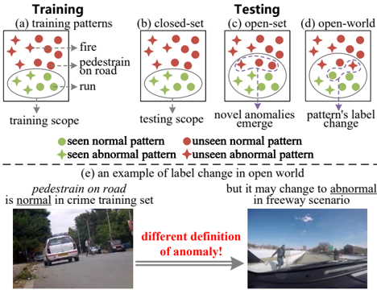
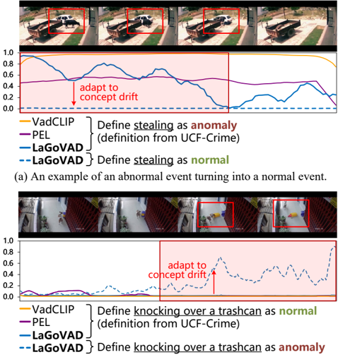

## Language-guided Open-world Video Anomaly Detection

Zihao Liu, Xiaoyu Wu * *, Jianqin Wu, Xuxu Wang, Linlin Yang Communication University of China

{liuzihao, wuxiaoyu}@cuc.edu.cn {wujianqin, wangxuxu}@mails.cuc.edu.cn mu4yang@gmail.com

## Abstract

Video anomaly detection models aim to detect anomalies that deviate from what is expected. In open-world scenarios, the expected events may change as requirements change. For example, not wearing a mask is considered abnormal during a flu outbreak but normal otherwise. However, existing methods assume that the definition of anomalies is invariable, and thus are not applicable to the open world. To address this, we propose a novel open-world VAD paradigm with variable definitions, allowing guided detection through user-provided natural language at inference time. This paradigm necessitates establishing a robust mapping from video and textual definition to anomaly score. Therefore, we propose LaGoVAD (Language-guided Openworld VAD), a model that dynamically adapts anomaly definitions through two regularization strategies: diversifying the relative durations of anomalies via dynamic video synthesis, and enhancing feature robustness through contrastive learning with negative mining. Training such adaptable models requires diverse anomaly definitions, but existing datasets typically provide given labels without semantic descriptions. To bridge this gap, we collect PreVAD (Pre-training Video Anomaly Dataset), the largest and most diverse video anomaly dataset to date, featuring 35,279 annotated videos with multi-level category labels and descriptions that explicitly define anomalies. Zero-shot experiments on seven datasets demonstrate SOTA performance. Data and code will be released.

## 1. Introduction

Video Anomaly Detection (VAD) aims to identify frames in videos that deviate from expected patterns [5 , 33], which is applicable in fields such as intelligent surveillance and monitoring [20]. In recent years, many VAD methods have achieved commendable performance employing weak supervision [6 , 14 , 21 , 25 , 35 , 37] or semi-supervision [24 , 31] in the closed-set setting. However, there is a consensus

* Corresponding author

[20 , 34 , 45 , 46] that the algorithm should detect anomalies beyond the training data in open-world scenarios.

Figure 1. Comparison of different VAD paradigms. Closed-set methods (b) can only detect anomalies in the training scope, while open-set methods (c) can detect novel anomalies. Our open-world approach (d) can deal with changes to the pattern's label in openworld scenarios, with an example in (e).
AhiFi1hii

, p()
As shown in Fig. 1a, the training data for VAD models encompass patterns labeled as normal or abnormal, where normal patterns include activities such as running and abnormal patterns comprise events like explosions. Conventional closed-set methods (Fig. 1b) [21 , 35] aim to detect patterns identical to those encountered during training when applied to test sets, thereby restricting their application in open-world scenarios. In contrast, open-set approaches (Fig. 1c) [46] (including open-vocabulary [34] and domain generalization [2 , 13 , 30] methods) are able to detect novel patterns absent from the training data without tuning. However, these methods neglect the critical issue of potential label alteration during testing (Fig. 1d), i.e., patterns originally labeled as normal may be redefined as abnormal (and vice versa). A representative example from Fig. 1e demonstrates this phenomenon: while pedestrian on road is regarded as a normal behavior in conventional crime anomaly datasets [25], this same pattern would typically be classified as abnormal in freeway surveillance scenarios. The cause

of such label alteration lies in the user's different definition of what constitutes anomalies, driven by environments or temporal policies. Formally, this is a concept drift issue, as defined in [18], which refers to the divergence between the conditional probability distributions of training and testing phases, i.e ., Pt Ptrain (y|v) ̸= Ptest(y|v), where v are videos and y are anomaly labels. While some attempts have begun to address this, critical limitations remain. Scene-dependent methods [2 , 4 , 8] associate the anomaly definition with scenes, neglecting user-specific requirements (e.g., hospital administrators may require detecting the anomaly of not wearing masks during influenza outbreaks but not at other times). Meanwhile, a dataset-dependent method [9] explores anomaly conflicts across datasets, but remains constrained by predefined categories of training datasets, lacking generalizability to open-world dynamics. Besides the limitation of task paradigms, existing methods are evaluated only on limited scenes with small-scale data, lacking extensive zero-shot cross-domain comparisons to verify the open-world capability.

To address the aforementioned concept drift challenge, we propose a novel open-world paradigm. First, we explicitly model the anomaly definition as a stochastic variable instead of fixing it as one or a few realizations. Then, we condition predictions y on both the video v and the anomaly definition z , i.e., learning a mapping Φ : (v, z) → y. Since we take the changing definition of anomalies into account, we effectively avoid concept drift (as detailed in Sec. 3). Finally, to enable natural interaction, we employ textual anomaly definition, allowing users to dynamically define anomalies via language.

However, learning Φ requires modeling a more complex multimodal space, resulting in decaying sample density that leads to overfitting. To address this, we mitigate it from both model and dataset perspectives. We propose a Language-Guided Open-world Video Anomaly Detector (LaGoVAD), which employs two regularization strategies to reduce overfitting: 1) We align vision and language through contrastive learning with negative sample mining, which helps the model learn more robust features. 2) We incorporate a novel dynamic video synthesis module that generates long videos and pseudo-labels on the fly, which functions as a form of data augmentation to diversify the relative duration of abnormal events.

We construct a large-scale diversified Pre-training Video Anomaly Dataset (PreVAD), which is collected through a scalable data curation pipeline utilizing foundation models to automate data cleaning and annotation, significantly reducing manual labeling costs while ensuring high quality. PreVAD comprises 35,279 videos annotated with multilevel categories and anomaly descriptions. To our knowledge, PreVAD surpasses existing datasets in diversity and scale. To evaluate the open-world capability, we set up

Figure 2. Comparison of zero-shot performance between LaGoVAD and other methods across seven datasets [1 , 17 , 25 , 27 , 32 , 38 , 45]. Except for XD-Violence which uses the AP as metric, all other datasets adopt the AUC metric for evaluation. LaGoVAD significantly outperforms existing state-of-the-art methods on all datasets.

a new benchmark that performs zero-shot anomaly detection on seven VAD datasets (UCF-Crime [25], XD-Violence [32], MSAD [45], UBNormal [1], DoTA [38], TAD [17], LAD [27]). Our contributions are summarized as follows:

1. We reformulate open-world VAD that pioneers the formulation of the concept drift in VAD and proposes a language-guided paradigm to avoid it.
2. We propose a novel language-guided video anomaly detection model, LaGoVAD, which implements the proposed paradigm and incorporates two regularization strategies to mitigate overfitting.
3. We build a large-scale and diverse dataset, PreVAD, annotated with multi-level taxonomy and anomaly descriptions to enhance generalization under the new paradigm.
4. We conduct zero-shot evaluation across seven datasets to validate the generalization of our method, and LaGoVAD achieves state-of-the-art performance (Fig. 2).

## 2. Related Work

## 2.1. Video Anomaly Datasets

We summarize the characteristics of existing video anomaly datasets in Tab. 1 .

Scale. The largest standalone dataset [32] contains only 5K videos, with ensemble datasets reaching 7.8K [26]. The data scarcity limits the performance of VAD.

Domain &amp; Category. Many datasets focus only on a single scene, such as traffic or campus. The few datasets that cover multiple scenes overlook domains like mishaps, animal-related violence, and production accidents.

Text Annotation. Existing VAD datasets are labeled with anomaly categories, which introduces semantic ambiguity. Although [12 , 26 , 39 , 41 , 43] provide different types of text annotation, they focus on understanding or captioning tasks and cannot provide a fine-grained overall description of the anomaly in a video.

Table 1. Comparisons between PreVAD and existing datasets. Our dataset 1) has the largest scale and broadest domain coverage, 2) is annotated with abnormal video descriptions, 3) does not integrate data from existing VAD datasets.

| Dataset              | # videos
 (# abnormal videos)    | Domain                                     | # categories    | Text Annotation     | Source        |
|----------------------|----------------------------------|--------------------------------------------|-----------------|---------------------|---------------|
| ShanghaiTech [42]    | 437 (107)                        | campus                                     | 13              | -                   | recording     |
| UCF-Crime [25]       | 1900 (950)                       | crime                                      | 14              | -                   | web           |
| XD-Violence [32]     | 4754 (2405)                      | crime                                      | 7               | -                   | web,movi      |
| UBI-Fights [10]      | 1000 (216)                       | violence                                   | 2               | -                   | web           |
| LAD [27]             | 2000 (762)                       | crime, traffic, animal, mishap             | 14              | -                   | web           |
| TAD [17]             | 500 (250)                        | crime                                      | 8               | -                   | web           |
| UBNormal [1]         | 543 (278)                        | pedestrian                                 | 28              | -                   | synthesis     |
| DoTA [38]            | 5677 (5677)                      | traffic                                    | 9               | -                   | web           |
| NWPU-Campus [4]      | 547 (124)                        | campus                                     | 28              | -                   | recordin      |
| MSAD [45]            | 720 (240)                        | crime, traffic, mishap                     | 55              | -                   | web           |
| UCCD [43]            | 1012 (382)                       | crime                                      | -               | dense               | UCF           |
| UCA [39]             | 1854 (944)                       | crime                                      | -               | dense               | UCF           |
| VAD-Instruct50k [41] | 5547 (2715)                      | crime                                      | -               | instructio          | UCF+XD        |
| HAWK [26]            | 7852 (6677)                      | crime, traffic                             | -               | instruction         | 7 VAD dataset |
| CUVA [12]            | 1000 (1000)                      | crime, traffic, pedestrian, animal         | 42              | instructio          | web           |
| PreVAD               | 35279 (11979)                    | crime, traffic, animal, mishap, production | 35              | anomaly description | web           |

Source. Current datasets are mainly from public web videos, while others rely on synthetic generation [1 , 19 , 34] or movie clips [34]. However, synthetic datasets suffer from misalignment with the real world, and movie data raises concerns about potential copyright infringement.

In this paper, we propose a scalable data curation pipeline to collect a novel dataset, which has large-scale diversified videos with multi-level taxonomy and anomaly descriptions.

## 2.2. Open-world Video Anomaly Detection Methods

Intuitively, open-world VAD models should detect novel anomalies beyond the training set, as discussed in [13 , 26 , 34 , 46]. From a task paradigm perspective, early attempts adopt open-set and domain generalization strategies [1 , 13 , 46]. Then, [34] extends this paradigm with openvocabulary VAD, enabling both detection and classification of unseen anomalies. However, these approaches implicitly assume a fixed anomaly definition and restrict model exposure to partial categories during training, unable to deal with the concept drift issue. Recent studies explore the dynamic anomaly definition: [2 , 4 , 8] posit that anomaly is scene-dependent (e.g., identical behaviors classified differently across scenes), training models to infer scene-anomaly correlations from data, and [9] trains dataset-specific classifiers. Despite these efforts, they lack the ability of usercustomizable anomaly definition, limiting their applicability in open-world scenarios. Additionally, [26] explores open-world video understanding for video-QA tasks but lacks detection capabilities.

From a model design perspective, current advancements primarily adopt two pathways: 1) data-driven approaches [1 , 13 , 19 , 34 , 46] enhance generalization by utilizing more data, while 2) cross-modal alignment approaches [6 , 34 , 35 ,

37] aim to construct more robust feature spaces by aligning vision and language. However, they neglect the problem of duration distribution shifts when leveraging more data and only align videos to class-level text embeddings without further fine-grained aligning.

Our work introduces a novel open-world VAD paradigm that allows users to flexibly define anomalies to guide detection, thereby avoiding concept drift. We implement this paradigm via a model featuring dynamic video synthesis and contrastive learning with hard negative mining. This model synthesizes videos of variable durations and achieves fine-grained modal alignment.

## 3. Paradigm: Language-guided Open-world Video Anomaly Detection

We define open-world video anomaly detection as the task of identifying video frames containing abnormal patterns, where the definition of abnormality may change during testing. Abnormal patterns manifest as events, behaviors, or actions (e.g., running). In practice, the definition of anomalies may change as users' requirements change, influenced by cultural differences, policy updates, and specific environments. The user may expand the definition to detect new anomalies or narrow the definition to remove those of no interest, which causes the abnormality label of a particular pattern to change. For instance, while running is generally normal behavior, it becomes abnormal in libraries or offices. Formally, this is a concept drift issue [18]:

<!-- formula-not-decoded -->

Figure 3. Architecture of our proposed LaGoVAD. We implement the language-guided VAD paradigm by adding an anomaly definition branch (z → G → U). The model is trained with two novel regularization strategies: dynamic video synthesis Ldvs (Sec. 4.1) and contrastive learning loss with negative mining L neg (Sec. 4.2).

where V denotes the video and Y denotes the label. This conditional probability distribution can be expanded as:

<!-- formula-not-decoded -->

where Z denotes the anomaly definition. We hypothesize that Y is solely determined by Z and V , i.e., the result only depends on the video to be detected and the anomaly definition. Therefore, the concept drift happens due to the change of P(Z|V ) .

Existing methods can be seen as modeling Φ : v → y and performing detection based on a fixed definition z sampled form Z:

<!-- formula-not-decoded -->

where θ denotes the parameters of the model Φ, and L denotes the loss function. It is worth emphasizing that some methods that can detect unknown anomalies also belong to this paradigm, including open-set [1 , 46], domain generalization [30] and open-vocabulary [34] methods, because they assume a fixed category set under a specific definition and only a subset are available in training. Under their assumption, an abnormal pattern would never change to normal, and thus they are unable to deal with the concept drift in open world.

In contrast, we propose a paradigm that directly models Φ : (v, z) → y to avoid the concept drift. It assumes a dynamic anomaly definition and conditions predictions on both the video and the definition. Formally,

<!-- formula-not-decoded -->

During training, the model Φ learns an optimal group of parameters θ that detect anomalies in video v under the guidance of definition z. We implement z in the form of natural language, but theoretically, it could be image, video, audio, or a learned embedding. Our paradigm is especially applicable when the user needs to temporarily specify an abnormal behavior, e.g., detecting not wearing a mask during a flu outbreak.

## 4. Method: LaGoVAD

We implement the language-guided VAD paradigm via LaGoVAD. We first introduce the overall architecture, followed by details of two proposed regularization terms (i.e ., dynamic video synthesis and negative mining). As illustrated in Fig. 3, we take video v and anomaly definition z as inputs. The video is synthesized by a non-parametric dynamic video synthesis module. The anomaly definition is a category set z = {z0, z1, . . . , zC − 1 }, where each class ziis defined by a class name or a description and C is the number of categories in a certain definition. During training, we randomly choose either the class names or the anomaly descriptions within a batch as the definition. Specially, z0 denotes the normal class. We extract and encode features of videos with F, which includes a pretrained CLIP image encoder [22] and a Transformer-based temporal encoder. And the text features are extracted with CLIP text encoder G. Then, the encoded features are fused by a Transformer-based fusion module U. Finally, the fused features are fed into a detection head H bin to obtain the anomaly score y bin ∈ R L×1 and a classification head H mul to obtain the classification probability y mul ∈ R L×C , where L is the length of video. Formally,

<!-- formula-not-decoded -->

<!-- formula-not-decoded -->

<!-- formula-not-decoded -->

<!-- formula-not-decoded -->

where N, A are normal and abnormal video sets, Synthesis(· , · ) is the dynamic video synthesis module, y
p is the pseudo-label generated during synthesis, v t , z t are encoded features and v u , z u are fused features. In this paper, we address the challenge of concept drift in open-world scenarios to enhance model generalization. To this end, we build a model with intentionally simplified architecture.

During training, we optimize the model through four losses under weak supervision. Following [9 , 21 , 25 , 34 , 35], we use multiple instance learning loss LMIL to optimize detection. And we employ MIL-align loss LMIL-align to optimize classification following [34 , 35]. Our paradigm operates in multimodal joint spaces (P(v, z, y)) that inherently suffer from exponentially decaying sample density, thereby inducing overfitting problems. Specifically, the algorithm may establish a wrong mapping or suppress a certain modality. Therefore, we leverage more diverse videos via a dynamic video synthesis loss Ldvs to learn better mappings. We also incorporate a contrastive learning loss with hard negative mining L neg to better align two modalities and mitigate the imbalance of two modalities. Formally,

<!-- formula-not-decoded -->

## 4.1. Dynamic Video Synthesis

In real-world scenarios, anomalies typically occupy only a small portion of a lengthy video, whereas current datasets predominantly contain videos with high anomaly ratios due to web-sourced data limitations. To mitigate this bias, we dynamically synthesize videos with varying durations and compute a loss based on the pseudo label generated during synthesis, which is inspired by Mosaic [3] and Cutout [11] augmentation. The module initially determines whether to generate a normal or abnormal video, followed by specifying the number of segments. It then selects an anchor video and randomly selects similar videos from k-nearest neighbors to construct a semantically coherent sequence, where the anchor's position is transformed to a binary pseudo label y p ∈ {0 , 1} L , where L denotes the feature length. Notably, the distance metrics required for retrieval are pre-computed, effectively reducing computational overhead during training. Finally, a dynamic video synthesis is calculated as:

<!-- formula-not-decoded -->

<!-- formula-not-decoded -->

<!-- formula-not-decoded -->

where σ denotes the Sigmoid function, yˆ ˆ denotes the videolevel ground truth, Ω a k and Ω n k are indices of Top-K scores of synthetic abnormal and normal videos, respectively.

## 4.2. Contrastive Loss with Hard Negative Mining

Given the ambiguous boundary between normal and abnormal frames in anomaly videos, we incorporate contrastive learning with hard negative mining as a regularization term to enhance their discriminability. Specifically, we first aggregate the frame-level visual features into video-level features with binary abnormal scores as weights:

<!-- formula-not-decoded -->

<!-- formula-not-decoded -->

where v t i denotes the i-th feature in v t , η denotes the temperature, v˜ ˜ pos denotes the aggregated foreground feature and v ˜ neg denotes the aggregated background feature. The background feature in an abnormal video is the normal part of it, which could be considered as the hard negative to its corresponding anomaly description. Therefore, we obtain v ˜ pos of all samples and v˜ ˜ neg of only abnormal samples in a batch, forming V ˜ ∈ R
(B1+B2)×E, where B 1 is the batch size, B2 is the number of abnormal videos in a batch, and E is the feature dimension. We also obtain text features before fusing, forming Z ˜ ∈ R B 2×E. The contrastive loss is as follows:

<!-- formula-not-decoded -->

<!-- formula-not-decoded -->

<!-- formula-not-decoded -->

<!-- formula-not-decoded -->

where Norm is L2 normalization and τ denotes the temperature.

During inference, the user can input either descriptions or class names as the anomaly definition. For the classification head, we select the minimum value of the normal class and the maximum value of the abnormal class over the temporal axis and use these values after applying Softmax as probabilities. More details are provided in supp(Sec. B).

## 5. Dataset: PreVAD

As in Eq. (4), our new paradigm requires diverse (v, z, y) triples for training. Therefore, we propose PreVAD—a large-scale video anomaly detection dataset, which is collected through a scalable curation pipeline.

|                   | PreVAD (209.5 hours)
 Train Val
 PreVAD (209.5 hours)
 Train Val   | PreVAD (209.5 hours)
 Train Val
 PreVAD (209.5 hours)
 Train Val   | PreVAD (209.5 hours)
 Train Val
 PreVAD (209.5 hours)
 Train Val   | PreVAD (209.5 hours)
 Train Val
 PreVAD (209.5 hours)
 Train Val   |
|-------------------|--------------------------------------------------------------------|--------------------------------------------------------------------|--------------------------------------------------------------------|--------------------------------------------------------------------|
|                   | Train 
 normal 
 Train 
 normal                                    | NormaNorma                                                         | Abnormal Abnormal                                                  | NormalNormal                                                       |
| # videos # videos | 10673 10673                                                        | 22000 22000                                                        | 1306 1306                                                          | 13001300                                                           |
| duration duration | 49.26h 49.26h                                                      | 145.6h145.6h                                                       | 6.33h 6.33h                                                        | 8.26h8.26h                                                         |

Figure 4. The statistics of PreVAD.

## 5.1. Data Curation Pipeline

Our pipeline encompasses three stages: source, cleansing, and annotation, leveraging multiple foundation models to ensure cost efficiency while maximizing data quality. We aggregate videos from three sources. We first leverage existing video-text datasets [16 , 29 , 36 , 44] to retrieve anomaly videos through text-based video retrieval. Second, we expand the collection through curated web resources, including 1) accident compilations, self-defense tutorials, and fail videos; 2) driving vlogs and travel documentaries; 3) violence recognition datasets [7]. Last, we obtain normal surveillance videos from YouTube streams and traffic camera videos from government-released road camera streams.

In the cleansing stage, we first use PySceneDetect to remove irrelevant segments such as intros and outros. Next, a multimodal LLM (MLLM) generates detailed video descriptions, and a vision-language model (VLM) verifies the consistency between the descriptions and video content. Finally, an LLM evaluates the descriptions to confirm the presence of anomalies, decreasing false positives and ensuring high-quality data.

The annotation stage involves a weakly supervised labeling approach with hybrid human-AI annotation. We annotate each video with a video-level category and annotate each validation-set video with a frame-level label. Additionally, an MLLM generates fine-grained anomaly descriptions for each video under constrained prompts, which include human-labeled categories, and is able to guide MLLM to describe only the anomaly in the video. Notably, we do not additionally label a test set, as we will conduct zero-shot evaluations on other existing VAD datasets. More details can be found in the supp (Sec. C)

Figure 5. Comparison between PreVAD and existing datasets.

Figure 6. A sample of PreVAD, which includes multi-level category label and precise description of the anomaly.

## 5.2. Dataset Statistics

Our model stands out on a larger scale, with a wider variety of anomaly types and high-quality anomaly descriptions.

Scale. As in Fig. 4b, PreVAD comprises 35,279 videos, with 11,979 abnormal videos and 23,300 normal videos, partitioned into training and validation sets, which is the largest video anomaly dataset up to now.

Anomaly Types. The diversity of a dataset is related to both the granularity and breadth of its taxonomy. Our dataset features a hierarchical taxonomy comprising 7 first-level categories (i.e ., Violence, Vehicle Accident, Firerelated Accident, Robbery, Daily Accident, Animal-related Violence, Production Accident) and 35 subcategories (e.g ., carjacking, mugging, sport fail, war). Our taxonomy spans minor (e.g., fall to the ground) to severe anomalies (e.g ., shooting), covering most of the common types of anomaly under surveillance. Moreover, the hierarchical design helps model learning diverse definitions.

Anomaly Descriptions. Each abnormal video is annotated with a text description, which has a total vocabulary size of 5,298 words and an average of 22.9 words per description. As shown in Figure 6, our annotation accurately describes the abnormal objects and behaviors in a fine-grained manner, which enables the model to learn better alignment.

Statistics. The videos have an average duration of 21.38 seconds (as in Fig. 4a), with the majority of them clustering within 5 to 20 seconds. And there are over 2000

Table 2. Zero-shot comparison with other methods in video anomaly detection. We reproduced models marked with ⋆ using their open-source codes, and the rest of the data are taken from their publications. Results marked with † are from [40].

| Methods        | Training-set    | UCF    | XD    | MSAD    | Test-set
 AD UBN    | DoTA    | A TAD    | LAD   |
|----------------|-----------------|--------|-------|---------|---------------------|---------|----------|-------|
| OVVAD[34]      | AIGC+XD         | 82.42  | -     | -       | -                   | -       | -        | -     |
| LaGoVAD        | PreVAD+XD       | 82.81  | -     | -       | -                   | -       | -        | -     |
| OVVAD          | AIGC+UCF        | -      | 63.74 | -       | -                   | -       | -        | -     |
| LaGoVAD        | PreVAD+UCF      | -      | 76.28 | -       | -                   | -       | -        | -     |
| CLIP†[22]      | -               | 53.16  | 17.83 | -       | -                   | -       | -        | -     |
| LLaVA1.5†[15]  | -               | 72.84  | 50.26 | -       | -                   | -       | -        | -     |
| LAVAD[40]      | -               | 80.28  | 62.0  | -       | -                   | -       | -        | -     |
| MIL[25]        | UCF             | -      | -     |         | 49.50               | -       | -        | -     |
| CMRL[8]        | UCF             | -      | 46.74 | -       | -                   | -       | -        | -     |
| MultiDomain[9] | Multiple        | 78.55  | -     | -       | -                   | -       | 79.2     | 77.36 |
| PEL⋆[21]       | UCF             | -      | 43.53 | 79.82   | 54.02               | 53.05   | 86.27    | 69.99 |
| PEL⋆           | XD              | 54.52  | -     | 68.25   | 49.55               | 44.97   | 43.02    | 30.82 |
| VadCLIP⋆[35]   | UCF             | -      | 58.29 | 88.09   | 56.24               | 50.93   | 74.4     | 74.29 |
| VadCLIP⋆       | XD              | 80.16  | -     | 88.48   | 57.41               | 49.00   | 83.5     | 74.46 |
| VadCLIP⋆       | PreVAD          | 79.37  | 67.43 | 89.79   | 55.66               | 50.59   | 85.96    | 75.02 |
| LaGoVAD        | PreVAD          | 81.12  | 74.25 | 90.41   | 58.07               | 62.60   | 89.56    | 78.91 |

videos that exceed one minute. Unlike UCF-Crime [25] and XD-Violence [32], PreVAD does not include untrimmed videos that last for tens of minutes or even several hours, as this would lack diversity and be detrimental to both training and validation. As shown in Fig. 4c, most of the videos are from existing video-text datasets or streaming, significantly reducing the overhead of manual clipping and retrieval. Unlike datasets assembled by merging existing VAD datasets, PreVAD obtains videos independently, enabling cross-dataset validation as a new generalization benchmark. Please refer to the supplementary material for more details (Sec. C).

## 6. Experiments

## 6.1. Experiment Setup

Datasets &amp; Metrics This study aims to enhance the openworld generalization of VAD models. We therefore conduct comprehensive evaluations across seven datasets: UCFCrime (UCF) [25], XD-Violence (XD) [32], MSAD [45], UBNormal (UBN) [1], DoTA [38], TAD [17], and LAD [27], which encompass diverse anomaly types. The validation set of our proposed PreVAD is utilized for in-domain performance analysis and ablation studies. During zeroshot evaluation, we use manual designed prompts based on the class name of the corresponding dataset as the anomaly definition. For detection metrics, we follow others using Average Precision (AP) for XD-Violence, while employing Area Under the Curve of the frame-level receiver operating characteristic (AUC) for other datasets. For classification metrics, there is currently no consensus evaluating classification performance in video anomaly detection. [35] uses

Table 3. Zero-shot comparison with other methods in video anomaly classification. The results for other models are obtained with their open-source codes and weights. † denotes providing ground-truth segments when classifying abnormal videos.

| Method          | Training    | UCF    | UCF    | XD    | XD    |
|-----------------|-------------|--------|--------|-------|-------|
| Method          | Training    | Acc.   | F1     | Acc.  | F1    |
| CLIP [22]       | -           | 19.31  | 12.08  | 56.25 | 45.04 |
| CLIP†           | -           | 20.34  | 11.10  | 64.25 | 54.61 |
| ActionCLIP [28] | K400        | 18.62  | 16.12  | 38.75 | 37.11 |
| ActionCLIP†     | K400        | 19.31  | 13.85  | 41.37 | 38.58 |
| ViFi-CLIP [23]  | K400        | 20.34  | 15.67  | 53.75 | 50.33 |
| VadCLIP [35]    | UCF         | -      | -      | 46.38 | 26.16 |
| VadCLIP         | XD          | 38.28  | 10.52  | -     | -     |
| VadCLIP         | PreVAD      | 45.52  | 17.81  | 71.38 | 57.99 |
| LaGoVAD         | PreVAD      | 51.72  | 16.64  | 78.13 | 63.80 |

mAP, and [34] uses accuracy for abnormal videos, but they neglect the evaluation of classifying normal videos. Therefore, we measure using accuracy and F1-score on both abnormal and normal videos.

Baselines Given the absence of prior zero-shot evaluations on all seven datasets, we reproduce PEL [21] and VadCLIP [35] using publicly available weights and code for comparison. For classification, we further benchmark against zero-shot action recognition models [23 , 28]. To ensure fairness in comparisons with CLIP-based methods, we use the identical ViT/B-16 variant.

Details of the implementation, evaluation datasets, and reproduced baselines are provided in the supp (Secs. B.2 , D and E)

## 6.2. Comparison with State-of-the-Arts

As demonstrated in Fig. 2 and Tabs. 2 and 3, our method achieves state-of-the-art performance in both zero-shot detection and classification. In Tab. 2, LaGoVAD outperforms existing approaches, including the LLM-based method [40], vision-language aligned methods [21 , 35], and the multidomain generalization method [9] on detection. Notably, on XD-Violence, our approach achieves a 20% improvement over prior methods. For fair comparison with OVVAD [34], which leverages AIGC-augmented training, we construct a comparable set and still observe superior performance. In Tab. 3, empirical results demonstrate that our approach outperforms both the CLIP baseline and state-ofthe-art action recognition models under identical CLIP variants, attributable to its capacity for selectively attending to abnormal patterns in videos. While sharing the same feature extractor and a similar two-branch architecture capable of detection and classification, our framework achieves comprehensive improvements over VadCLIP [35]. Notably, it exhibits a 27% gain in detection performance (measured

Table 4. Ablation on each component. guided refers to guiding the detection with language. Det. Avg. refers to the average zero-shot detection performance on seven datasets. Cls. Avg. refers to the average zero-shot classification performance on UCF-Crime and XD-Violence.

| Ldvs    | Lneg    | guided    |   PreVAD  |   Det. Avg.  |   Cls. Avg. |
|---------|---------|-----------|-----------|--------------|-------------|
| ✓       | ✓       | ✓         |     69.98 |        76.42 |       52.57 |
|         | ✓       | ✓         |     65.73 |        73.51 |       51.73 |
| ✓       |         | ✓         |     68.92 |        73.96 |       51.85 |
|         |         | ✓         |     67.35 |        71.31 |       48.81 |
| ✓       | ✓       |           |     69.87 |        73.84 |       46.23 |

by AP) and a 68% improvement in classification accuracy on XD-Violence.

## 6.3. Ablation Studies

Dataset Effectiveness To quantify dataset impacts, we compare VadCLIP [35] trained by three datasets in Tabs. 2 and 3 via average metrics in detection and classification. Experimental results reveal that the model trained with PreVAD outperforms the one trained with UCF-Crime by 14% in detection (average metrics on six other datasets) and 88% in classification (average metrics on XD-Violence) while surpassing the one trained with XD-Violence by 7.6% in detection and 44% in classification, respectively. This substantial margin validates that a larger and more diverse dataset can significantly improve zero-shot performance.

Architecture Effectiveness As demonstrated in Tabs. 2 and 3, when trained on identical datasets, our LaGoVAD framework achieves consistent improvements over VadCLIP, with gains of 7.2% in average detection performance on seven datasets and 2.8% in classification across two datasets. This confirms the superiority of our paradigm in open-world scenarios.

Module Effectiveness We conduct a series of ablations to validate each module of our model in Tab. 4. Removing either the dynamic video synthesis module or the contrastive learning with hard negative mining led to a noticeable degradation in detection and classification performance. When both are removed, the model exhibits a significant decline in zero-shot performance. We also validate the effect of language guidance by removing it in our experiments. When disabling the language guidance, we followed approaches in [34 , 35] to place the fusion module after the detection stage, which does not condition detection results on the given text. Experiment shows that without language guidance, in-domain performance only slightly dropped, while cross-domain performance decreased significantly. It indicates that the conventional paradigm lack the

(b) An example of a normal event turning into an abnormal event.

Figure 7. Visualization of predicted anomaly scores for two cases where concept drift occurs in open-world scenarios, compared with VadCLIP [35] and PEL [21] trained on UCF-Crime [25]. Both videos are from the UCF-Crime dataset, where (a) is labeled as abnormal and (b) is labeled as normal.

capacity to incorporate user-defined guidance for detection, thereby limiting their adaptability to open-world scenarios.

## 6.4. Qualitative Results

Figure 7 visualizes the prediction results of PEL [21], VadCLIP [35] and our proposed LaGoVAD under concept drift. As illustrated in Fig. 7a, the video depicts an incident of stealing a cattle, which is considered as abnormal in the UCF-Crime dataset. When users exclude such categories (e.g., in traffic or violence detection scenarios), our method could dynamically adapt to it by redefining anomalies. In Fig. 7b, the video shows a dog knocking over a trashcan, labeled as normal in UCF-Crime. However, when users explicitly define this behavior as an anomaly, our method seamlessly adjusts its detection logic. In contrast, the two other methods are not able to address concept drift under different user requirements. These results validate the practicability and effectiveness of our paradigm in open-world video anomaly detection. More ablations and visualizations are in the supp (Sec. F).

## 7. Conclusion

In this work, we propose a novel paradigm, languageguided open-world video anomaly detection, to deal with

concept drift in the open-world scenario. It assumes that the definition of anomaly is dynamic and models it as a stochastic variable input to the network. To support training this model, we build a large-scale video anomaly dataset that is annotated by multi-level taxonomy and anomaly descriptions. We empirically verify the effectiveness of the proposed framework through state-of-the-art zero-shot performance and sufficient ablations on seven datasets.

## References

- [1] Andra Acsintoae, Andrei Florescu, Mariana-Iuliana Georgescu, Tudor Mare, Paul Sumedrea, Radu Tudor Ionescu, Fahad Shahbaz Khan, and Mubarak Shah. Ubnormal: New benchmark for supervised open-set video anomaly detection. In CVPR, pages 20111–20121, New Orleans, USA, 2022. IEEE. 2 , 3 , 4 , 7
- [2] Abhishek Aich, Kuan-Chuan Peng, and Amit K. RoyChowdhury. Cross-domain video anomaly detection without target domain adaptation. In WACV, pages 2578–2590. IEEE, 2023. 1 , 2 , 3
- [3] Alexey Bochkovskiy, Chien-Yao Wang, and HongYuan Mark Liao. Yolov4: Optimal speed and accuracy of object detection. arxiv preprint, abs/2004.10934, 2020. 5
- [4] Congqi Cao, Yue Lu, Peng Wang, and Yanning Zhang. A new comprehensive benchmark for semi-supervised video anomaly detection and anticipation. In CVPR, pages 20392– 20401, Vancouver, Canada, 2023. IEEE. 2 , 3
- [5] S. Chandrakala, K. Deepak, and G. Revathy. Anomaly detection in surveillance videos: a thematic taxonomy of deep models, review and performance analysis. Artif. Intell. Rev. , 56(4):3319–3368, 2023. 1
- [6] Weiling Chen, Keng Teck Ma, Zi Jian Yew, Minhoe Hur, and David Aik-Aun Khoo. TEVAD: improved video anomaly detection with captions. In CVPRW, pages 5549–5559, Vancouver, CA, 2023. IEEE. 1 , 3
- [7] Ming Cheng, Kunjing Cai, and Ming Li. RWF-2000: an open large scale video database for violence detection. In ICPR, pages 4183–4190. IEEE, 2020. 6
- [8] MyeongAh Cho, Minjung Kim, Sangwon Hwang, Chaewon Park, Kyungjae Lee, and Sangyoun Lee. Look around for anomalies: Weakly-supervised anomaly detection via context-motion relational learning. In CVPR, pages 12137– 12146, Vancouver, CA, 2023. IEEE. 2 , 3 , 7
- [9] MyeongAh Cho, Taeoh Kim, Minho Shim, Dongyoon Wee, and Sangyoun Lee. Towards multi-domain learning for generalizable video anomaly detection. In NIPS, Vancouver, CA, 2024. 2 , 3 , 5 , 7
- [10] Bruno Degardin and Hugo Proenc¸a. Human activity analysis: Iterative weak/self-supervised learning frameworks for detecting abnormal events. In IEEE IJCB, pages 1–7, Houston, USA, 2020. IEEE. 3
- [11] Terrance Devries and Graham W. Taylor. Improved regularization of convolutional neural networks with cutout. arxiv preprint, abs/1708.04552, 2017. 5
- [12] Hang Du, Sicheng Zhang, Binzhu Xie, Guoshun Nan, Jiayang Zhang, Junrui Xu, Hangyu Liu, Sicong Leng, Jiang-
13. ming Liu, Hehe Fan, Dajiu Huang, Jing Feng, Linli Chen, Can Zhang, Xuhuan Li, Hao Zhang, Jianhang Chen, Qimei Cui, and Xiaofeng Tao. Uncovering what, why and how: A comprehensive benchmark for causation understanding of video anomaly. In CVPR, pages 18793–18803. IEEE, 2024. 2 , 3
- [13] Yashika Jain, Ali Dabouei, and Min Xu. Cross-domain learning for video anomaly detection with limited supervision. In ECCV, pages 468–484. Springer, 2024. 1 , 3
- [14] Hyekang Kevin Joo, Khoa Vo, Kashu Yamazaki, and Ngan Le. CLIP-TSA: clip-assisted temporal self-attention for weakly-supervised video anomaly detection. In ICIP, pages 3230–3234, Kuala Lumpur, Malaysia, 2023. IEEE. 1
- [15] Haotian Liu, Chunyuan Li, Yuheng Li, and Yong Jae Lee. Improved baselines with visual instruction tuning. CVPR , pages 26286–26296, 2023. 7
- [16] Jing Liu, Sihan Chen, Xingjian He, Longteng Guo, Xinxin Zhu, Weining Wang, and Jinhui Tang. VALOR: vision-audio-language omni-perception pretraining model and dataset. IEEE Trans. Pattern Anal. Mach. Intell., 47(2): 708–724, 2025. 6
- [17] Hui Lv, Chuanwei Zhou, Zhen Cui, Chunyan Xu, Yong Li, and Jian Yang. Localizing anomalies from weakly-labeled videos. TIP, 30:4505–4515, 2021. 2 , 3 , 7
- [18] Jose G. Moreno-Torres, Troy Raeder, Roc ´ ´ıo Ala ´ ızRodr ´ ´ıguez, Nitesh V. Chawla, and Francisco Herrera. A unifying view on dataset shift in classification. Pattern Recognit., 45(1):521–530, 2012. 2 , 3
- [19] Pradeep Narwade, Ryosuke Kawamura, Gaurav Gajbhiye, and Koichiro Niinuma. Synthetic video generation for weakly supervised cross-domain video anomaly detection. In ICPR, pages 375–391. Springer, 2024. 3
- [20] Guansong Pang, Chunhua Shen, Longbing Cao, and Anton van den Hengel. Deep learning for anomaly detection: A review. arxiv preprint, abs/2007.02500, 2020. 1
- [21] Yujiang Pu, Xiaoyu Wu, Lulu Yang, and Shengjin Wang. Learning prompt-enhanced context features for weaklysupervised video anomaly detection. TIP, 33:4923–4936, 2024. 1 , 5 , 7 , 8
- [22] Alec Radford, Jong Wook Kim, Chris Hallacy, Aditya Ramesh, Gabriel Goh, Sandhini Agarwal, Girish Sastry, Amanda Askell, Pamela Mishkin, Jack Clark, Gretchen Krueger, and Ilya Sutskever. Learning transferable visual models from natural language supervision. In ICML, pages 8748–8763, Virtual Event, 2021. PMLR. 4 , 7
- [23] Hanoona Abdul Rasheed, Muhammad Uzair Khattak, Muhammad Maaz, Salman H. Khan, and Fahad Shahbaz Khan. Fine-tuned CLIP models are efficient video learners. In CVPR, pages 6545–6554, Vancouver, CA, 2023. IEEE. 7
- [24] Sorina Smeureanu, Radu Tudor Ionescu, Marius Popescu, and Bogdan Alexe. Deep appearance features for abnormal behavior detection in video. In Int. Conf. Image Anal. Proc. , pages 779–789. Springer, 2017. 1
- [25] Waqas Sultani, Chen Chen, and Mubarak Shah. Real-world anomaly detection in surveillance videos. In CVPR, pages 6479–6488. Computer Vision Foundation / IEEE Computer Society, 2018. 1 , 2 , 3 , 5 , 7 , 8

- [26] Jiaqi Tang, Hao LU, RUIZHENG WU, Xiaogang Xu, Ke Ma, Cheng Fang, Bin Guo, Jiangbo Lu, Qifeng Chen, and Yingcong Chen. Hawk: Learning to understand open-world video anomalies. In NIPS, pages 139751–139785, 2024. 2 , 3
- [27] Boyang Wan, Wenhui Jiang, Yuming Fang, Zhiyuan Luo, and Guanqun Ding. Anomaly detection in video sequences: A benchmark and computational model. IET Image Process. , 15(14):3454–3465, 2021. 2 , 3 , 7
- [28] Mengmeng Wang, Jiazheng Xing, and Yong Liu. Actionclip: A new paradigm for video action recognition. arxiv preprint , abs/2109.08472, 2021. 7
- [29] Xin Eric Wang, Jiawei Wu, Junkun Chen, Lei Li, Yuan-fang Wang, and William Yang Wang. Vatex: A large-scale, highquality multilingual dataset for video-and-language research. In ICCV, pages 4580–4590. IEEE/CVF, 2019. 6
- [30] Zhiqiang Wang, Xiaojing Gu, Huaicheng Yan, and Xingsheng Gu. Domain generalization for video anomaly detection considering diverse anomaly types. Signal Image Video Process., 18(4):3691–3704, 2024. 1 , 4
- [31] Peng Wu, Jing Liu, and Fang Shen. A deep one-class neural network for anomalous event detection in complex scenes. IEEE Trans. Neural Networks Learn. Syst., 31(7): 2609–2622, 2020. 1
- [32] Peng Wu, Jing Liu, Yujia Shi, Yujia Sun, Fangtao Shao, Zhaoyang Wu, and Zhiwei Yang. Not only look, but also listen: Learning multimodal violence detection under weak supervision. In ECCV, pages 322–339. Springer, 2020. 2 , 3 , 7
- [33] Peng Wu, Chengyu Pan, Yuting Yan, Guansong Pang, Peng Wang, and Yanning Zhang. Deep learning for video anomaly detection: A review. arxiv preprint, abs/2409.05383, 2024. 1
- [34] Peng Wu, Xuerong Zhou, Guansong Pang, Yujia Sun, Jing Liu, Peng Wang, and Yanning Zhang. Open-vocabulary video anomaly detection. In CVPR, pages 18297–18307, Seattle, USA, 2024. IEEE. 1 , 3 , 4 , 5 , 7 , 8
- [35] Peng Wu, Xuerong Zhou, Guansong Pang, Lingru Zhou, Qingsen Yan, Peng Wang, and Yanning Zhang. Vadclip: Adapting vision-language models for weakly supervised video anomaly detection. In AAAI, pages 6074–6082, Vancouver, Canada, 2024. AAAI Press. 1 , 3 , 5 , 7 , 8
- [36] Jun Xu, Tao Mei, Ting Yao, and Yong Rui. Msr-vtt: A large video description dataset for bridging video and language. In CVPR, pages 5288–5296. IEEE, 2016. 6
- [37] Zhiwei Yang, Jing Liu, and Peng Wu. Text prompt with normality guidance for weakly supervised video anomaly detection. In CVPR, pages 18899–18908, Seattle, USA, 2024. IEEE. 1 , 3
- [38] Yu Yao, Xizi Wang, Mingze Xu, Zelin Pu, Yuchen Wang, Ella Atkins, and David Crandall. Dota: unsupervised detection of traffic anomaly in driving videos. PAMI, 2022. 2 , 3 , 7
- [39] Tongtong Yuan, Xuange Zhang, Kun Liu, Bo Liu, Chen Chen, Jian Jin, and Zhenzhen Jiao. Towards surveillance video-and-language understanding: New dataset, baselines, and challenges. In CVPR, pages 22052–22061, Seattle, USA, 2024. IEEE. 2 , 3
- [40] Luca Zanella, Willi Menapace, Massimiliano Mancini, Yiming Wang, and Elisa Ricci. Harnessing large language models for training-free video anomaly detection. In CVPR , pages 18527–18536, Seattle, USA, 2024. IEEE. 7
- [41] Huaxin Zhang, Xiaohao Xu, Xiang Wang, Jialong Zuo, Chuchu Han, Xiaonan Huang, Changxin Gao, Yuehuan Wang, and Nong Sang. Holmes-vad: Towards unbiased and explainable video anomaly detection via multi-modal LLM. arXiv preprint, abs/2406.12235, 2024. 2 , 3
- [42] Jia-Xing Zhong, Nannan Li, Weijie Kong, Shan Liu, Thomas H. Li, and Ge Li. Graph convolutional label noise cleaner: Train a plug-and-play action classifier for anomaly detection. In CVPR, pages 1237–1246, Long Beach, USA, 2019. Computer Vision Foundation / IEEE. 3
- [43] Lingru Zhou, Yiqi Gao, Manqing Zhang, Peng Wu, Peng Wang, and Yanning Zhang. Human-centric behavior description in videos: New benchmark and model. IEEE Trans. Multim., 26:10867–10878, 2024. 2 , 3
- [44] Bin Zhu, Bin Lin, Munan Ning, Yang Yan, Jiaxi Cui, Hongfa Wang, Yatian Pang, Wenhao Jiang, Junwu Zhang, Zongwei Li, Caiwan Zhang, Zhifeng Li, Wei Liu, and Li Yuan. Languagebind: Extending video-language pretraining to nmodality by language-based semantic alignment. In ICLR . OpenReview.net, 2024. 6
- [45] Liyun Zhu, Lei Wang, Arjun Raj, Tom Gedeon, and Chen Chen. Advancing video anomaly detection: A concise review and a new dataset. In NeurIPS, pages 89943–89977. Curran Associates, Inc., 2024. 1 , 2 , 3 , 7
- [46] Yuansheng Zhu, Wentao Bao, and Qi Yu. Towards open set video anomaly detection. In ECCV, pages 395–412, Tel Aviv,Israel, 2022. Springer. 1 , 3 , 4