## Learning to Understand Open-World Video Anomalies

Jiaqi Tang 1 , 2 , 3∗ Hao Lu 1 , 2∗ Ruizheng Wu 4 Xiaogang Xu 5 , 6 Ke Ma 7 Cheng Fang 7 Bin Guo 7 Jiangbo Lu 3 , 4 Qifeng Chen 2 Ying-Cong Chen 1 , 2 , 3†

1 The Hong Kong University of Science and Technology (Guangzhou)

2 The Hong Kong University of Science and Technology 3 HKUST(GZ) – SmartMore Joint Lab 4 SmartMore Corporation 5 The Chinese University of Hong Kong 6 Zhejiang University 7 Northwestern Polytechnical University {jtang092, hlu585}@connect.hkust-gz.edu.cn {ruizheng.wu, jiangbo}@smartmore.com xiaogangxu00@gmail.com {2544552413,sura}@mail.nwpu.edu.cn guob@nwpu.edu.cn cqf@ust.hk yingcongchen@hkust-gz.edu.cn

## Abstract

Video Anomaly Detection (VAD) systems can autonomously monitor and identify disturbances, reducing the need for manual labor and associated costs. However, current VAD systems are often limited by their superficial semantic understanding of scenes and minimal user interaction. Additionally, the prevalent data scarcity in existing datasets restricts their applicability in open-world scenarios. In this paper, we introduce HAWK, a novel framework that leverages interactive large Visual Language Models (VLM) to interpret video anomalies precisely. Recognizing the difference in motion information between abnormal and normal videos, HAWK explicitly integrates motion modality to enhance anomaly identification. To reinforce motion attention, we construct an auxiliary consistency loss within the motion and video space, guiding the video branch to focus on the motion modality. Moreover, to improve the interpretation of motion-to-language, we establish a clear supervisory relationship between motion and its linguistic representation. Furthermore, we have annotated over 8,000 anomaly videos with language descriptions, enabling effective training across diverse open-world scenarios, and also created 8,000 question-answering pairs for users' open-world questions. The final results demonstrate that HAWK achieves SOTA performance, surpassing existing baselines in both video description generation and question-answering. Our codes/dataset/demo will be released at https://github.com/jqtangust/hawk .

## 1 Introduction

"Have eyes like a HAWK!" – Longman Dictionary

In recent years, the deployment of Video Anomaly Detection (VAD) systems has seen a significant uptick across a diverse array of domains, including but not limited to, autonomous driving [42 , 22], surveillance [5 , 20], and crime scene analysis [30]. The inherent capability of these systems to autonomously monitor and identify disturbances within a scene has markedly diminished the reliance on manual labor, thereby streamlining operational efficiency and reducing associated costs.

* Equal contribution.

† Corresponding author.

Preprint. Under review.

Figure 1: Different framework in video anomaly detection. (A) shows traditional video anomaly detection methods, which use binary classifiers to detect anomalies. (B), following (A), introduces a multi-class classifier for integrating semantic information, allowing users to obtain different types of anomaly information. Neither (A) nor (B) can interact with users. (C) is a previous video understanding framework that can interactively provide richer semantic information for users, but cannot specifically locate video anomalies. Our framework (D) enhances the anomaly understanding capability and provides annotated labels with rich semantic information.

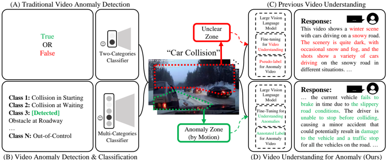

Despite the extensive focus on anomaly detection in most existing VAD systems [20 , 41 , 30 , 28 , 7 , 10 , 16 , 31 , 37 , 45 , 49] (as shown in Fig. 1 (A)), there is often a lack of deeper semantic understanding of the scenes and insufficient interaction with users. While Pu et al. [28] and Wu et al. [39] incorporated semantic information for video anomaly detection, their frameworks are limited as multiple-class classifiers (as displayed in Fig. 1 (B)). Consequently, the functionality of these systems is confined to the detection of anomalous frames, necessitating further manual analysis by users to analyze the detected anomalies comprehensively. Although Lv et al. [24] has pioneered the development of a large language model for the video anomaly explanation, their approach primarily relies on pseudo labels for training. The lack of robust training data severely constrains its practical applicability. Besides, such a method focuses more on acquiring long-range context information rather than anomaly-related features on anomaly understanding (as exhibited in Fig. 1 (C)).

To solve the above challenges, we propose an interactive large visual-language model [18 , 15 , 26], HAWK, for precisely understanding video anomalies (as illustrated in Fig. 1 (D)). Considering that the motion in normal and abnormal videos is significantly different [41 , 49], we explicitly integrate motion modality by a dual-branch framework in HAWK to enhance the understanding of anomalies (Section 4.1). Besides, to reinforce motion attention, we construct an auxiliary consistency loss based on the mutual information between the original video (appearance feature) and its motion in tight space (Section 4.2), to implicitly guide the video branch to focus on motion-related features. However, the interpretation of motion to the corresponding language remains unclear. Therefore, we extract the motion-related language (verbs and their entities) from the original description to directly supervise the visual and linguistic representations of motion, for accurately enhancing the interpretation of video anomaly in HAWK (Section 4.3).

Furthermore, we also collect seven video anomaly datasets from various scenarios and generate language descriptions for each video. Besides, to address the open-ended questions raised by users, we utilize language descriptions of the videos to generate potential question-answer pairs for training. Since these datasets cover a range of scenarios (Section 3), including crime (UCF-Crime [30]), campus environments (ShanghaiTech [19] and CUHK Avenue [20]), pedestrian walkways (UCSD Ped1 [5] and Ped2 [34]), traffic situations (DoTA [42]), and human behavior (UBnormal [2]), and finally, the model tends to generalize to open-world scenarios.

To train our framework, we initially pre-train it on WebVid [3] to equip it with the capability to understand general videos. Then, we fine-tuned it on our proposed video anomaly dataset to enhance its understanding of video anomalies across multiple scenarios. Compared to other baselines, our

model achieves SOTA performance in both Text-Level and GPT-Guided Metrics. Our contributions are summarized as follows:

- We propose a novel video-language framework, HAWK, aiming at understanding video anomalies, which incorporates motion modality to enhance its capability.
- We generate rich language descriptions for seven different video anomaly datasets. Meanwhile, considering the diversity of open-world problems, we also generate question-answer pairs to tackle potential user inquiries.
- Compared to other large video models, our framework demonstrates SOTA performance for video anomaly understanding and question-answering across multiple scenarios, which will help open-world anomaly understanding in the future.

## 2 Related Work

Video Anomaly Detection Video Anomaly Detection (VAD) usually focuses on identifying unexpected events from the video and it has been widely applied in various fields, including autonomous driving [42], public surveillance [5 , 20], and crime scene analysis [30] etc. Previous VAD methods [24 , 30 , 20 , 41 , 7 , 10 , 16 , 31 , 37 , 45 , 49] are designed in numerous pathways. Lu et al. [20] designed to learn video features only from normal videos, and hand-craft features or deep-learningbased features are leveraged. Sultani et al. [30] proposed multiple instance learning (MIL), which is the main paradigm for many weakly-supervised learning methods. Recently, Lv et al. [24] first proposed video-based large language models in the framework of VAD.

However, these methods lack sufficient semantic comprehension of scenes and offer inadequate user interaction. Several approaches [28 , 39] have introduced multi-class classifiers to integrate semantic information with various types of anomaly information. Nevertheless, their output is still limited. In contrast, our framework not only integrates more comprehensive semantic information as a general video understanding system but also provides advanced interaction capabilities for users.

Large Model in Video Understanding Recent studies have demonstrated the reliable capabilities of large models in video understanding. Beyond powerful vision-language models [13 , 48 , 18 , 21], recent research has increasingly explored more modalities [24 , 15 , 25 , 43 , 23]. Bain et al.[3] introduced a large-scale dataset with general video content descriptions. Several LLM-based works[15 , 25 , 43 , 23] aim to comprehend visual content. Additionally, Video-LLaMa [46] extends comprehension to both auditory and visual information, while Su et al.[29] utilize multi-modal encoders to understand across six modalities. Recently, Lv et al.[24] proposed video-based large language models for VAD tasks in a weakly supervised framework. In this paper, we introduce the motion modality in our proposed vision-language model, which enhances the model's ability to locate anomalies by prioritizing relevant video content.

## 3 Data Engineering

Previous datasets are inadequate for addressing our problem. Most existing VAD datasets, such as UBnormal [2] and DoTA [42], only contain simple video category labels and lack detailed language descriptions. This results in video understanding models lacking accurate and comprehensive supervision, creating a significant obstacle to identifying anomalies in videos. Recently, Lv et al.[24] attempted to create pseudo language descriptions for anomaly videos. However, these descriptions are naive combinations of labels and fixed text, relying on a rigid format that offers only limited information. Other datasets, like WebVid[3], include only general descriptions of video content, which may not direct the model's focus on anomalies.

Our Principle To tackle the above problems, we annotate detailed language descriptions specifically for anomaly scenes in seven different existing &lt;VIDEO&gt; datasets. These seven datasets include a variety of anomalous scenarios such as crime (UCF-Cirme [30]), campus (ShanghaiTech [19] and CUHK Avenue [20]), pedestrian walkways (UCSD Ped1 [5] and Ped2 [34]), traffic (DoTA [42]), and human behavior (UBnormal [2]). With the support of these visual scenarios, we can perform comprehensive fine-tuning for various abnormal scenarios, being closer to open-world scenarios.

Figure 2: Generation pipeline of our dataset. In the first line, we first segment videos into clips and generate dense captions for each segment, including a comprehensive description of the video content. Then, we use GPT-4 to guide the generation of corresponding anomalous video descriptions based on these descriptions, which are then manually checked to reduce mistakes . In the second line, to generate user-centered QA pairs, we first use GPT-4 to generate open-ended questions based on the proposed two principles. Then, the questions and video descriptions are jointly input into GPT-4 to provide possible answers .

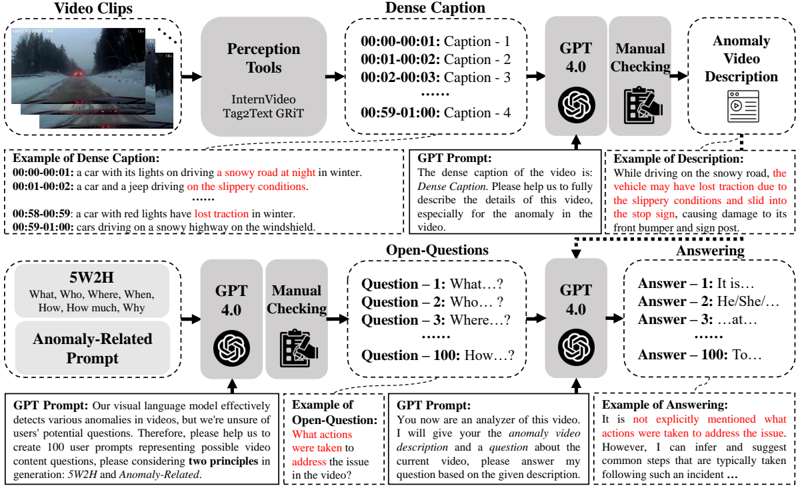

Moreover, to better account for real-world user situations, we believe that language descriptions should not only include descriptions of the video anomalies themselves, but also address open questions asked by users. Therefore, we construct open-ended question-answer pairs for each scenario to further enhance model's practical ability to answer users' varying questions. The procedure for answering users' questions is shown in Fig. 2. The data format of can be described by the Eq. (1),

```
<VIDEO>: {DIS: <DESCRIPTION> | QA: <QUESTION> → <ANSWERING>} . (1)
```

Anomaly Video Description Generation To construct natural language descriptions &lt;DESCRIPTION&gt; for anomalous video datasets, we refer to previous research such as LLaVa [18] and VideoChat [15], and employ GPT-4 [1] as an assistant. We first split the video into dense clips to ensure key information is captured. Following VideoChat [15], we use perception tools (InternVideo [35], Tag2Text [11], or GRiT [36]) to automatically generate captions for each key clip, obtaining a dense representation of the videos (except for the UCF-Crime dataset, which already has a dense representation built in [44]). Next, we use GPT-4 [1] to generate anomaly-related descriptions based on the captions for each video. Unlike other general video understanding datasets [18 , 15], we provide prompts for GPT-4 to generate specific descriptions closely related to video anomalies. Finally, due to varying quality of dense captions, some videos may have incorrect annotations. Thus, we manually recheck the final generated video anomaly descriptions to ensure label accuracy.

Human-Centric Question-Answering Pairs Generation So far, we have obtained nearly accurate descriptions of anomaly videos. However, our framework may still face challenges with more openended questions from users. Therefore, anomaly-related question-answering is a significant practical requirement. Given the diversity of open-world scenes, users may ask questions involving various pronouns. Thus, we mainly consider these two principles: 1 Anomaly-related, our questions should be strongly related to the anomaly in the video. 2 5W2H, we introduce seven different question pronouns (What, Who, Where, When, How, How much, and Why) to simulate various question formats that users may employ. This enables us to address a wide range of open questions related to

video anomalies. We input these two principles into GPT-4 [1] to generate open questions for anomaly videos. We then manually review and select the 100 most suitable questions, which are randomly assigned to each video. Finally, GPT-4 [1] will generate &lt;ANSWERS&gt; to these &lt;QUESTIONS&gt;.

Our data is more practical compared to previous ones: it not only understands multiple anomalies in videos but also supports question-answering in open scenarios (More details in Appendix D).

## 4 Methodology

To construct a practical framework for understanding video anomalies, our goal is to accurately interpret these anomalies into natural language. However, most previous studies [15 , 46 , 26 , 17 , 24] focus on enhancing general video understanding capabilities while neglecting video anomalies. This oversight results in equal attention being given to all parts of the video, such as the background and human appearances, often at the expense of key anomaly features, as shown in Fig. 1 (C). Consequently, these approaches are not effective in accurately focusing on anomaly-related features.

Overview of Solution The core of our solution is guiding visual instruction to focus on anomalies. Previous studies in video anomaly detection [41 , 49] have demonstrated that motion-related feature help identify multiple anomalies. Therefore, in Section 4.1, we first explicitly integrate a motion modality into our proposed framework to target anomaly-related features. Subsequently, in Section 4.2, we maintain mutual information consistency between the appearance and motion modalities within a tight feature space, implicitly guiding the appearance branch to reinforce motion attention. Finally, in Section 4.3, to improve the interpretation of motion-to-language, we extract motion-related language descriptions to directly match the motion and its corresponding motion-related language.

## 4.1 Explicit Motion Modality Integration

To enhance the capability of interpreting anomalies, we build a framework, HAWK, to explicitly integrate motion modality. HAWK has a dual-branch architecture, with fv fv as the original video understanding network and fm fm for motion understanding. Inspired by Video-LLaMA [46], fv fv and fm fm share the same architecture but separate parameters in Fig. 3. Eq. (2) denotes our framework as,

<!-- formula-not-decoded -->

where X v ∈ R T ×C×H×W represents the &lt;VIDEO&gt; input for extracting appearance feature, and T denotes the temporal dimension. X m = M(X v ), with M(·) being the motion extractor.

fv fv (·) and fm fm (·) are the frozen pre-trained video encoders from BLIP-2 [14], which consist of one EVA-CLIP [8] and one pre-trained Video Q-Former to output embeddings. Then, the output embeddings from fv fv (·) and fm fm (·) are passed through learnable projection networks for video and motion, Pv Pv (·) and Pm Pm (·), respectively. These networks aim to project visual (video and motion) embedding into the language feature space for interpreting. ft(·) is the frozen text token to embedding projection, that makes textual information can be inputted into LLaMA-2 [32]. ⊕ is for combining our input prompt, we define our prompt as: "Here is the input video embedding: &lt;VIDEO\_EMBEDDING&gt; and motion embedding &lt;MOTION\_EMBEDDING&gt; in different frames, please help me to &lt;DE-SCRIBE\_VIDEO&gt; | &lt;QUESTION&gt;.". &lt;DESCRIBE\_VIDEO&gt; and &lt;QUESTION&gt; are the question classes for video description generation and video question answering respectively (Details see Appendix D). By combining the visual token embedding with the textual embedding, ft(T), LLaMA2 [32], is employed to generate the final language response, Y. This framework explicitly integrates the motion modality during visual instruction tuning, significantly targeting anomaly-related features.

## 4.2 Implicitly Motion Attention Reinforcement

Although we integrate the motion modality to facilitate fine-tuning of HAWK, motion and video branches operate independently. Therefore, we cannot expect the original video branch to extract appearance features that focus on the region where the anomaly occurred (i.e., motion). To help HAWK focus more on these regions, we observed the containment relationship in mutual information between motion and the original video. We use this relationship to construct an auxiliary consistency loss function, implicitly reinforcing the motion attention (Fig. 4 2 ).

Figure 3: Overview of HAWK. During training (Black and Gray path), we aim to optimize for videolanguage matching loss, along with Video-Motion Consistency and Motion-Language Matching. During inference (only Gray path), we generate language descriptions using video, motion, and text.

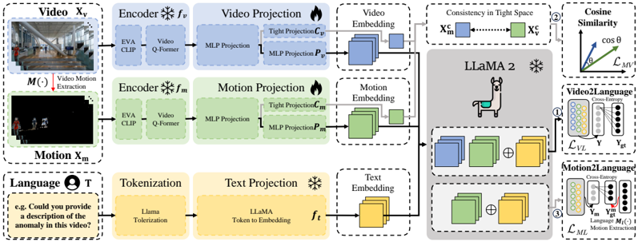

Extract Motion Specifically, to obtain motion, we employ a motion describer M(·), which generates motion between two successive frames as shown in Eq. (3),

<!-- formula-not-decoded -->

where M(t)( · ) is the motion describer at the time step t, we currently use Gunnar Farneback's algorithm [9], and X (t) v , X (t−1) v ∈ R 1×C×H×W denote the video frames at time steps t and t − 1 .

X (t) Motion ∈ R 2×H×W includes two channels motion vector in X (horizontal) and Y (vertical) directions. We use the optical flow magnitude from these channels as a Mask, normalized to [0 , 1] and multiplied with the original video appearance, to hide other non-motion regions, as Eq. (4),

<!-- formula-not-decoded -->

where × is the operator of pixel-wise multiplication. X (t) v , X (t) m ∈ R 1×C×H×W donate the original video and our input motion information at time step t, respectively. We usually extract T frames as motion input X m ∈ R T ×C×H×W , same as X v.

Build L MV Loss Then, we consider that X m only contains key information for anomaly and it is contained in X v , and feature space from X v is more sparse. Therefore, we compact features from X m and X v into a tight space. At this space, we aim to maintain the mutual information between X m and X v consistency, and in this way, the appearance feature can be focused on the motion region. Therefore, we construct an auxiliary loss to promote X v 's motion attention, as in Eq. (5),

<!-- formula-not-decoded -->

where X c v = Cv Cv (fv fv (X v )) and X c m = Cm Cm (fm fm (X m )) denote the tightly compressed representations of X v and X m , respectively, by the compression functions Cv Cv and Cm Cm. Cv Cv and Cm Cm share some initial shallow layer parameters with Pv Pv and Pm Pm (as Fig. 3). Then, following a subsequent tight projection to compresses both X v and X m into a more compacted space.

Finally, with this auxiliary loss, we can reinforce the mo- tion attention in the appearance feature, and HAWK's feature space will focus on more abnormal related features, which will promote the understanding of anomalies in the whole framework.

Figure 4: Visualization of HAWK's loss. 1 is the original video-to-language loss. 2 is the cosine similarity loss for motion modality adaptation. 3 is the motion-to-language loss.

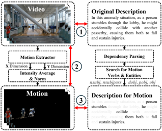

## 4.3 Interpreting Motion-to-Language

Although HAWK has already accommodated the motion modality in visual input, the corresponding motion from language is still unclear. This limitation hinders HAWK's interpretation in motion modality. Hence, to augment this relationship, we aim to reinforce the correspondence between motion and their linguistic representation.

Extract Motion-related Language Previous studies [4 , 33 , 40 , 12] have proved that the representation of motion in the language is predominantly from verbs and their corresponding entities . Therefore, to extract linguistic representation, the first step is to do dependency parsing for the original sentences, as Eq. (6),

<!-- formula-not-decoded -->

where D(·) is the dependency parsing and Ygt is the ground truth. Ggt represents the graph of the dependency structure, which symbolizes the syntactic relationships among the words in a sentence.

Based on this graph, we can extract predicates (verbs) V, and also entities closely related to these predicates, such as subjects S, objects O, indirect subjects Si, and indirect objects Oi. These elements are then combined to form short phrases representing motion, as in Eq. (7),

<!-- formula-not-decoded -->

where Ml(·) is the language motion extraction operator, and Y m gt is the motion-related language.

Build L ML Loss After obtaining motion-related language, we can establish strong supervision between motion in both vision and linguistic representation (as Fig. 4 3 ), significantly enhancing the ability to interpret motion to language in HAWK. Consequently, we design a motion-language matching as an auxiliary loss, as Eq. (8),

<!-- formula-not-decoded -->

where L ML (·) is the cross-entropy loss, which contains N words.

Optimization Goal Finally, our total loss L shows as, L = t0 × LV L + t1 × LMV + t2 × LML , where L V L is original video to language loss (as Fig. 4 1 ), and t0 , t 1 and t 2 is the hyper-parameter.

## 5 Experiments

This section introduces training, testing, baselines, evaluations, and ablation experiments of HAWK .

Training &amp; Testing To enhance our framework's anomaly understanding capabilities, we've structured our training and testing process into three stages, as Fig. 5 . Stage 1 involves pre-training on the WebVid dataset [3] to acquire a general understanding of video content. In Stage 2, we finetune the model's focus towards video anomaly understanding by employing a specially curated dataset described in Section 1, consisting of over 8 , 000 videos. We use 90% of these videos for training and allocate the remaining 10% for testing purposes. We jointly train on two tasks: video &lt;DESCRIPTION&gt; generation and video &lt;QUESTION&gt;→&lt;ANSWERING&gt;. In Stage 3 ,

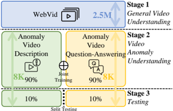

Split Testing

Figure 5: Training &amp; Testing.

we evaluate these two tasks independently in the testing set to ensure our model’s effectiveness.

Baselines To evaluate the anomaly understanding performance of our proposed framework, we conduct comparisons with SOTA video understanding baselines. We select five baselines: VideoChatGPT [26], VideoChat [15], Video-LLaMA [46], LLaMA-Adapter [47], and Video-LLaVA [17]. The purpose of our comparison is to determine whether these baselines can fully understand and interpret video anomalies.

Table 1: Quantitative performance of (A) anomaly video description generation and (B) video question-answering. Red indicates the best performance, while blue denotes the second best. (A) Anomaly Video Description Generation

|                               | Text-Level (↑) [27]           | Text-Level (↑) [27]           | Text-Level (↑) [27]           | Text-Level (↑) [27]           | GPT-Guided (↑) [18]           | GPT-Guided (↑) [18]           | GPT-Guided (↑) [18]           |
|-------------------------------|-------------------------------|-------------------------------|-------------------------------|-------------------------------|-------------------------------|-------------------------------|-------------------------------|
| Method                        | BLEU-1                        | BLEU-2                        | BLEU-3                        | BLEU-4                        | Reasonability                 | Detail                        | Consistency                   |
| Video-ChatGPT [26]            | 0.107                         | 0.046                         | 0.017                         | 0.008                         | 0.084                         | 0.108                         | 0.055                         |
| VideoChat [15]                | 0.053                         | 0.023                         | 0.008                         | 0.003                         | 0.107                         | 0.205                         | 0.054                         |
| Video-LLaMA [46]              | 0.062                         | 0.025                         | 0.009                         | 0.004                         | 0.120                         | 0.217                         | 0.066                         |
| LLaMA-Adapter [47]            | 0.132                         | 0.052                         | 0.018                         | 0.008                         | 0.060                         | 0.091                         | 0.038                         |
| Video-LLaVA [17]              | 0.071                         | 0.030                         | 0.012                         | 0.005                         | 0.077                         | 0.115                         | 0.038                         |
| Ours                          | 0.270                         | 0.139                         | 0.074                         | 0.043                         | 0.283                         | 0.320                         | 0.218                         |
| maly Video Question-Answering | maly Video Question-Answering | maly Video Question-Answering | maly Video Question-Answering | maly Video Question-Answering | maly Video Question-Answering | maly Video Question-Answering | maly Video Question-Answering |
|                               | Text-Level (↑) [27]           | Text-Level (↑) [27]           | Text-Level (↑) [27]           | Text-Level (↑) [27]           | GPT-Guided (↑) [18]           | GPT-Guided (↑) [18]           | GPT-Guided (↑) [18]           |
| Method                        | BLEU-1                        | BLEU-2                        | BLEU-3                        | BLEU-4                        | Reasonability                 | Detail                        | Consistency                   |
| Video-ChatGPT [26]            | 0.177                         | 0.096                         | 0.058                         | 0.038                         | 0.508                         | 0.430                         | 0.421                         |
| VideoChat [15]                | 0.261                         | 0.133                         | 0.074                         | 0.043                         | 0.699                         | 0.631                         | 0.598                         |
| Video-LLaMA [46]              | 0.156                         | 0.081                         | 0.045                         | 0.027                         | 0.586                         | 0.485                         | 0.497                         |
| LLaMA-Adapter [47]            | 0.199                         | 0.109                         | 0.067                         | 0.043                         | 0.646                         | 0.559                         | 0.549                         |
| Video-LLaVA [17]              | 0.094                         | 0.054                         | 0.034                         | 0.023                         | 0.393                         | 0.274                         | 0.316                         |
| Ours                          | 0.319                         | 0.179                         | 0.112                         | 0.073                         | 0.840                         | 0.794                         | 0.753                         |

Evaluation Metrics To accurately evaluate our model's performance in understanding video anomalies, we firstly adopt four Text-Level metrics, from BLEU (Bilingual Evaluation Understudy) [27]-1 to BLEU-4 to measure word overlap between the model-generated text and the ground truth. This approach enables us to objectively assess the similarity and also take into account various levels of granularity at the text-level, thus providing a clear indicator of how well the model understands and describes anomalies.

Besides, we expand our evaluation framework by incorporating insights from recent research in LLaVa [18] or Video-ChatGPT [26], utilizing GPT-Guided [1] methods to assess the quality of the generated text. GPT [1] serves as a critical evaluator, generating scores for three key aspects of the language produced, with each aspect scored on a scale from 0 to 1. These three aspects are as,

- Reasonability: evaluates the logical reasoning and coherence of the generated language.
- Detail: assesses the level of detail and specificity of the generated language.
- Consistency: evaluates the coherence and consistency of the generated language.

By leveraging GPT [1] as an evaluative tool, we aim to provide a nuanced understanding of the text's quality, focusing on aspects that traditional metrics may overlook.

Quantitative Evaluation Table 1 (A) and (B) demonstrate the effectiveness of our model to describe abnormal phenomena. Our proposed model significantly outperforms the previous baselines, achieving SOTA performance in every metric for both Text-level and GPT-guided metrics, thus it can generate text that more closely aligns with actual scenarios.

Qualitative Evaluation Table 2 (A) and (B) demonstrate that our proposed framework achieves optimal qualitative performance in video description generation and question-answering, respectively. Compared with other baselines, HAWK can accurately understand and focus on video anomalies. For example, in Table 2 (A) - Video-LLaMa [46], it pays more attention to the clothing information from the people (wearing blue and red jacket), while ignoring the motion-related anomaly (slipping). In Table 2 (B) - Video-ChatGPT, it may produce hallucinations (two people... who were hit by the car), which differ from the original video anomaly (car suddenly braking). In contrast, HAWK generates descriptions that are close to the real semantics (driver losing control).

Ablation Study We conducted ablation experiments on three key structures proposed in this paper and analyzed their impact on the overall performance in Table 3 (A) and (B).

Table 2: Qualitative performance on (A) anomaly video description generation, and (B) questionanswering. Red texts indicate key semantic inconsistencies, whereas Green texts signify that the generated results are closely aligned with the Ground Truth. [YELLOW] indicates the text problem.

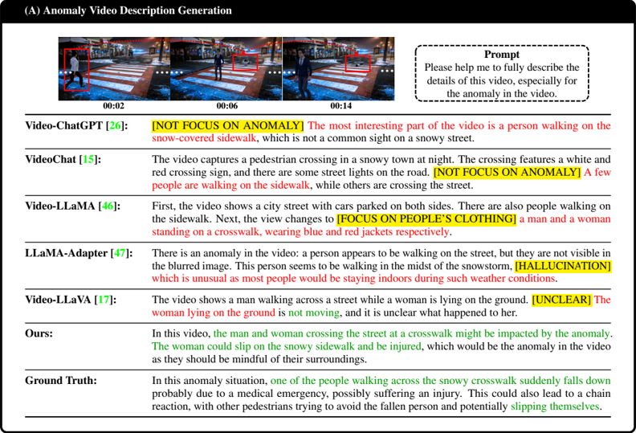

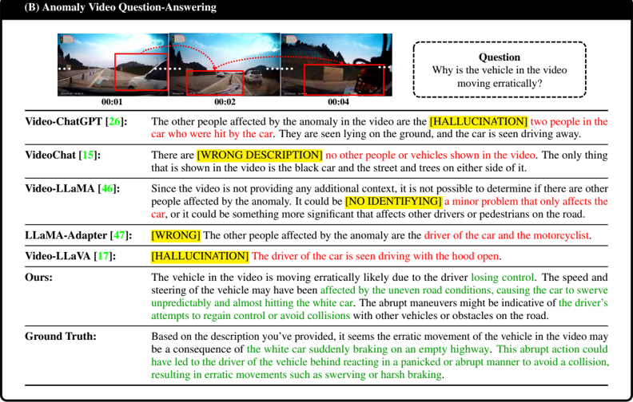

- Effectiveness of Motion Information: We ablate all the motion components, including fm fm, Pm Pm and the motion input X m for proving the effectiveness of introducing motion modality. When explicit motion information is lacking, the model's ability to describe the motionsrelated anomaly diminishes, leading to inaccurate descriptions or even hallucinations (Table 4 w/o Motion Information), then impedes the overall performance (Table 3).

Table 3: Ablation study of (A) anomaly video description generation and (B) video questionanswering. Red indicates the best performance, while blue denotes the second best.

(A) Anomaly Video Description Generation

|                                   | Text-Level (↑) [27]    | Text-Level (↑) [27]    | Text-Level (↑) [27]    | Text-Level (↑) [27]    | GPT-Guieded (↑) [18]   | GPT-Guieded (↑) [18]   | GPT-Guieded (↑) [18]   |
|-----------------------------------|------------------------|------------------------|------------------------|------------------------|------------------------|------------------------|------------------------|
|                                   | BLEU-1                 | BLEU-2                 | BLEU-3                 | BLEU-4                 | Reasonability          | Detail                 | Consistency            |
| w/o Motion Information            | 0.249                  | 0.121                  | 0.062                  | 0.034                  | 0.253                  | 0.306                  | 0.189                  |
| w/o Video-Motion Consistency      | 0.249                  | 0.123                  | 0.064                  | 0.036                  | 0.261                  | 0.295                  | 0.194                  |
| w/o Motion-Language Matching Loss | 0.270                  | 0.135                  | 0.073                  | 0.041                  | 0.276                  | 0.320                  | 0.212                  |
| Ours                              | 0.270                  | 0.139                  | 0.074                  | 0.043                  | 0.283                  | 0.320                  | 0.218                  |

(B) Anomaly Video Question-Answering

|                                   | Text-Level (↑) [27]    | Text-Level (↑) [27]    | Text-Level (↑) [27]    | Text-Level (↑) [27]    | GPT-Guieded (↑) [18]   | GPT-Guieded (↑) [18]   | GPT-Guieded (↑) [18]   |
|-----------------------------------|------------------------|------------------------|------------------------|------------------------|------------------------|------------------------|------------------------|
|                                   | BLEU-1                 | BLEU-2                 | BLEU-3                 | BLEU-4                 | Reasonability          | Detail                 | Consistency            |
| w/o Motion Information            | 0.309                  | 0.171                  | 0.105                  | 0.065                  | 0.837                  | 0.790                  | 0.743                  |
| w/o Video-Motion Consistency      | 0.313                  | 0.172                  | 0.105                  | 0.066                  | 0.833                  | 0.784                  | 0.742                  |
| w/o Motion-Language Matching Loss | 0.316                  | 0.176                  | 0.109                  | 0.069                  | 0.836                  | 0.788                  | 0.752                  |
| Ours                              | 0.319                  | 0.179                  | 0.112                  | 0.073                  | 0.840                  | 0.794                  | 0.753                  |

Table 4: Qualitative evaluation of ablation study. Red/Green texts indicate language semantic inconsistency/consistency with the Ground Truth respectively. [YELLOW] indicates the text problem.

| w/o Motion Information:       | While driving down the [UNRELATED INFORMATION] snowy street, the vehicle suddenly skids on 
 patch of ice , causing it to veer into another car that was [HALLUCINATION] parked beside a tree o
 the side of the road.                                                                              |
|-------------------------------|-----------------------------------------------------------------------------------------------------------------------------------------------------------------------------------------------------------------------------------------------------------------------------------------------------|
| w/o Video-Motion Consistency: | In this video, the car fails to stop in time due to the [WRONG CONDITION] slippery road caused b
 the snowy conditions. As a result, it skids and sideswipes the white car parked on the side of the road
 causing minor damage to both vehicles.                                                   |
| w/o Motion-Language Matching: | As the white truck drives down the street, it suddenly skids on the wet road surface, losing control, and
 sideswiping the parked white car. The impact results in visible damage to both vehicles, [UNCLEAR
 CONDITION] with smoke emitting from the truck’s side and the car’s mirrors shattering |
| Ours:                         | While driving down a narrow street with cars parked on both sides, the current vehicle’s front right side
 scrapes against a parked car, causing minor damage to both vehicles.                                                                                                                     |
| Ground Truth:                 | While driving down the street, the silver car suddenly swerves to avoid a parked car, but clips its rear
 bumper, causing minor damage to both vehicles.                                                                                                                                            |

- Effectiveness of Video-Motion Consistency: The absence of video-motion consistency constraints reduces the generative model's ability to adapt to the motion modality, causing difficulties in accurately understanding motion scenes (Table 4 w/o Video-Motion Consistency), then impedes the overall performance (Table 3).
- Effectiveness of Motion-Language Matching: Without motion-language matching loss, the correlation between motion and language becomes unclear. This ambiguity leads to the generation of language that includes unspecified motion information (Table 4 w/o Motion-Language Matching), subsequently degrading the overall performance (Table 3).

## 6 Conclusion

In conclusion, we have developed a novel video-language framework for understanding video anomalies across various scenarios. By incorporating motion features and constructing rich linguistic descriptions, our model demonstrates SOTA performance in the open world. It has the potential to benefit practical applications in diverse domains and paves the way for improving the model's interactivity with users, enabling more efficient and effective communication in addressing userspecific inquiries related to video anomalies.

## References

- [1] Achiam, J., Adler, S., Agarwal, S., Ahmad, L., Akkaya, I., Aleman, F.L., Almeida, D., Altenschmidt, J., Altman, S., Anadkat, S., et al.: Gpt-4 technical report. arXiv preprint arXiv:2303.08774 (2023) 4 , 5 , 8

- [2] Acsintoae, A., Florescu, A., Georgescu, M.I., Mare, T., Sumedrea, P., Ionescu, R.T., Khan, F.S., Shah, M.: Ubnormal: New benchmark for supervised open-set video anomaly detection. In: Proceedings of the IEEE/CVF Conference on Computer Vision and Pattern Recognition. pp. 20143–20153 (2022) 2 , 3 , 15 , 24
- [3] Bain, M., Nagrani, A., Varol, G., Zisserman, A.: Frozen in time: A joint video and image encoder for end-to-end retrieval. In: IEEE International Conference on Computer Vision (2021) 2 , 3 , 7 , 14
- [4] Cadiot, P., Lebas, F., Visetti, Y.M.: The semantics of the motion verbs. Space in Languages: Linguistic Systems and Cognitive Categories 66, 175 (2006) 7
- [5] Chan, A.B., Vasconcelos, N.: Modeling, clustering, and segmenting video with mixtures of dynamic textures. IEEE transactions on pattern analysis and machine intelligence 30(5), 909–926 (2008) 1 , 2 , 3 , 15 , 25
- [6] Du, H., Zhang, S., Xie, B., Nan, G., Zhang, J., Xu, J., Liu, H., Leng, S., Liu, J., Fan, H., Huang, D., Feng, J., Chen, L., Zhang, C., Li, X., Zhang, H., Chen, J., Cui, Q., Tao, X.: Uncovering what, why and how: A comprehensive benchmark for causation understanding of video anomaly. In: IEEE Conference on Computer Vision and Pattern Recognition (CVPR) (2024) 19
- [7] Dubey, S., Boragule, A., Jeon, M.: 3d resnet with ranking loss function for abnormal activity detection in videos. In: 2019 International Conference on Control, Automation and Information Sciences (ICCAIS). pp. 1–6. IEEE (2019) 2 , 3
- [8] Fang, Y., Wang, W., Xie, B., Sun, Q.S., Wu, L.Y., Wang, X., Huang, T., Wang, X., Cao, Y.: Eva: Exploring the limits of masked visual representation learning at scale. 2023 IEEE/CVF Conference on Computer Vision and Pattern Recognition (CVPR) pp. 19358–19369 (2022) 5
- [9] Farneback, G.: Fast and accurate motion estimation using orientation tensors and parametric motion models. In: Proceedings 15th International Conference on Pattern Recognition. ICPR2000. vol. 1, pp. 135–139. IEEE (2000) 6
- [10] He, C., Shao, J., Sun, J.: An anomaly-introduced learning method for abnormal event detection. Multimedia Tools and Applications 77, 29573–29588 (2018) 2 , 3
- [11] Huang, X., Zhang, Y., Ma, J., Tian, W., Feng, R., Zhang, Y., Li, Y., Guo, Y., Zhang, L.: Tag2text: Guiding vision-language model via image tagging. arXiv preprint arXiv:2303.05657 (2023) 4
- [12] Langacker, R.W.: Nouns and verbs. Language pp. 53–94 (1987) 7
- [13] Li, J., Li, D., Savarese, S., Hoi, S.: Blip-2: Bootstrapping language-image pre-training with frozen image encoders and large language models. arXiv preprint arXiv:2301.12597 (2023) 3
- [14] Li, J., Li, D., Savarese, S., Hoi, S.C.H.: Blip-2: Bootstrapping language-image pre-training with frozen image encoders and large language models. In: International Conference on Machine Learning (2023) 5
- [15] Li, K., He, Y., Wang, Y., Li, Y., Wang, W., Luo, P., Wang, Y., Wang, L., Qiao, Y.: Videochat: Chat-centric video understanding. arXiv preprint arXiv:2305.06355 (2023) 2 , 3 , 4 , 5 , 7 , 8 , 9 , 20 , 21 , 22 , 23 , 24 , 25
- [16] Li, S., Liu, F., Jiao, L.: Self-training multi-sequence learning with transformer for weakly supervised video anomaly detection. In: Proceedings of the AAAI Conference on Artificial Intelligence. vol. 36, pp. 1395–1403 (2022) 2 , 3
- [17] Lin, B., Zhu, B., Ye, Y., Ning, M., Jin, P., Yuan, L.: Video-llava: Learning united visual representation by alignment before projection. arXiv preprint arXiv:2311.10122 (2023) 5 , 7 , 8 , 9 , 20 , 21 , 22 , 23 , 24 , 25
- [18] Liu, H., Li, C., Wu, Q., Lee, Y.J.: Visual instruction tuning. Advances in neural information processing systems 36 (2024) 2 , 3 , 4 , 8 , 10

- [19] Liu, W., W. Luo, D.L., Gao, S.: Future frame prediction for anomaly detection – a new baseline. In: 2018 IEEE Conference on Computer Vision and Pattern Recognition (CVPR) (2018) 2 , 3 , 14 , 23
- [20] Lu, C., Shi, J., Jia, J.: Abnormal event detection at 150 fps in matlab. In: Proceedings of the IEEE international conference on computer vision. pp. 2720–2727 (2013) 1 , 2 , 3 , 14 , 21
- [21] Lu, H., Niu, X., Wang, J., Wang, Y., Hu, Q., Tang, J., Zhang, Y., Yuan, K., Huang, B., Yu, Z., et al.: Gpt as psychologist? preliminary evaluations for gpt-4v on visual affective computing. 2024 IEEE/CVF Conference on Computer Vision and Pattern Recognition (CVPR) workshop (2024) 3
- [22] Lu, H., Tang, J., Xu, X., Cao, X., Zhang, Y., Wang, G., Du, D., Chen, H., Chen, Y.: Scaling multi-camera 3d object detection through weak-to-strong eliciting. arXiv (2024) 1
- [23] Luo, R., Zhao, Z., Yang, M., Dong, J., Qiu, M., Lu, P., Wang, T., Wei, Z.: Valley: Video assistant with large language model enhanced ability. arXiv preprint arXiv:2306.07207 (2023) 3
- [24] Lv, H., Sun, Q.: Video anomaly detection and explanation via large language models. arXiv preprint arXiv:2401.05702 (2024) 2 , 3 , 5
- [25] Maaz, M., Rasheed, H., Khan, S., Khan, F.S.: Video-chatgpt: Towards detailed video understanding via large vision and language models. arXiv preprint arXiv:2306.05424 (2023) 3
- [26] Muhammad Maaz, Hanoona Rasheed, S.K., Khan, F.: Video-chatgpt: Towards detailed video understanding via large vision and language models. ArXiv 2306.05424 (2023) 2 , 5 , 7 , 8 , 9 , 20 , 21 , 22 , 23 , 24 , 25
- [27] Papineni, K., Roukos, S., Ward, T., Zhu, W.J.: Bleu: a method for automatic evaluation of machine translation. In: Proceedings of the 40th annual meeting of the Association for Computational Linguistics. pp. 311–318 (2002) 8 , 10
- [28] Pu, Y., Wu, X., Wang, S.: Learning prompt-enhanced context features for weakly-supervised video anomaly detection. arXiv preprint arXiv:2306.14451 (2023) 2 , 3
- [29] Su, Y., Lan, T., Li, H., Xu, J., Wang, Y., Cai, D.: Pandagpt: One model to instruction-follow them all. arXiv preprint arXiv:2305.16355 (2023) 3
- [30] Sultani, W., Chen, C., Shah, M.: Real-world anomaly detection in surveillance videos. In: Proceedings of the IEEE conference on computer vision and pattern recognition. pp. 6479–6488 (2018) 1 , 2 , 3 , 14 , 22
- [31] Tian, Y., Pang, G., Chen, Y., Singh, R., Verjans, J.W., Carneiro, G.: Weakly-supervised video anomaly detection with robust temporal feature magnitude learning. In: Proceedings of the IEEE/CVF international conference on computer vision. pp. 4975–4986 (2021) 2 , 3
- [32] Touvron, H., Martin, L., Stone, K., Albert, P., Almahairi, A., Babaei, Y., Bashlykov, N., Batra, S., Bhargava, P., Bhosale, S., et al.: Llama 2: Open foundation and fine-tuned chat models. arXiv preprint arXiv:2307.09288 (2023) 5
- [33] Vo, N.P.A., Manotas, I., Sheinin, V., Popescu, O.: Identifying motion entities in natural language and a case study for named entity recognition. In: Proceedings of the 28th International Conference on Computational Linguistics. pp. 5250–5258 (2020) 7
- [34] Wang, S., Miao, Z.: Anomaly detection in crowd scene. In: IEEE 10th International Conference on Signal Processing Proceedings. pp. 1220–1223. IEEE (2010) 2 , 3 , 15
- [35] Wang, Y., Li, K., Li, Y., He, Y., Huang, B., Zhao, Z., Zhang, H., Xu, J., Liu, Y., Wang, Z., et al.: Internvideo: General video foundation models via generative and discriminative learning. arXiv preprint arXiv:2212.03191 (2022) 4
- [36] Wu, J., Wang, J., Yang, Z., Gan, Z., Liu, Z., Yuan, J., Wang, L.: Grit: A generative region-to-text transformer for object understanding. arXiv preprint arXiv:2212.00280 (2022) 4

- [37] Wu, P., Liu, J.: Learning causal temporal relation and feature discrimination for anomaly detection. IEEE Transactions on Image Processing 30, 3513–3527 (2021) 2 , 3
- [38] Wu, P., Liu, j., Shi, Y., Sun, Y., Shao, F., Wu, Z., Yang, Z.: Not only look, but also listen: Learning multimodal violence detection under weak supervision. In: European Conference on Computer Vision (ECCV) (2020) 18
- [39] Wu, P., Zhou, X., Pang, G., Sun, Y., Liu, J., Wang, P., Zhang, Y.: Open-vocabulary video anomaly detection. In: IEEE Conference on Computer Vision and Pattern Recognition (CVPR) (2024) 2 , 3
- [40] Wunderlich, D.: Cause and the structure of verbs. Linguistic inquiry pp. 27–68 (1997) 7
- [41] Xu, D., Ricci, E., Yan, Y., Song, J., Sebe, N.: Learning deep representations of appearance and motion for anomalous event detection. arXiv preprint arXiv:1510.01553 (2015) 2 , 3 , 5
- [42] Yao, Y., Wang, X., Xu, M., Pu, Z., Wang, Y., Atkins, E., Crandall, D.J.: Dota: unsupervised detection of traffic anomaly in driving videos. IEEE transactions on pattern analysis and machine intelligence 45(1), 444–459 (2022) 1 , 2 , 3 , 15 , 20
- [43] Ye, Q., Xu, H., Xu, G., Ye, J., Yan, M., Zhou, Y., Wang, J., Hu, A., Shi, P., Shi, Y., et al.: mplug-owl: Modularization empowers large language models with multimodality. arXiv preprint arXiv:2304.14178 (2023) 3
- [44] Yuan, T., Zhang, X., Liu, K., Liu, B., Chen, C., Jin, J., Jiao, Z.: Towards surveillance video-andlanguage understanding: New dataset, baselines, and challenges (2023) 4
- [45] Zaheer, M.Z., Mahmood, A., Astrid, M., Lee, S.I.: Claws: Clustering assisted weakly supervised learning with normalcy suppression for anomalous event detection. In: Computer Vision–ECCV 2020: 16th European Conference, Glasgow, UK, August 23–28, 2020, Proceedings, Part XXII 16. pp. 358–376. Springer (2020) 2 , 3
- [46] Zhang, H., Li, X., Bing, L.: Video-llama: An instruction-tuned audio-visual language model for video understanding. arXiv preprint arXiv:2306.02858 (2023) 3 , 5 , 7 , 8 , 9 , 20 , 21 , 22 , 23 , 24 , 25
- [47] Zhang, R., Han, J., Liu, C., Gao, P., Zhou, A., Hu, X., Yan, S., Lu, P., Li, H., Qiao, Y.: Llama-adapter: Efficient fine-tuning of language models with zero-init attention. arXiv preprint arXiv:2303.16199 (2023) 7 , 8 , 9 , 20 , 21 , 22 , 23 , 24 , 25
- [48] Zhu, D., Chen, J., Shen, X., Li, X., Elhoseiny, M.: MiniGPT-4: Enhancing vision-language understanding with advanced large language models. In: The Twelfth International Conference on Learning Representations (2024) 3
- [49] Zhu, Y., Newsam, S.: Motion-aware feature for improved video anomaly detection. arXiv preprint arXiv:1907.10211 (2019) 2 , 3 , 5

## A Summary of Appendix

This appendix provides supplementary information that was not included in the main paper. Firstly, we address the security statement of our study, ensuring the confidentiality and integrity of the data used. Additionally, we provide detailed explanations of the training and testing resources utilized, including information on the hardware and software configurations. We also present statistics and distribution of the training data, along with the costs associated with human resources involved in the study. Furthermore, we describe the evaluation metrics employed to assess the performance of our method. Moreover, we present additional qualitative results comparisons, showcasing the effectiveness of our approach. Additionally, we provide an open-world demo, demonstrating the real-world applicability of our method. Finally, we discuss the existing limitations of our paper and propose potential avenues for future research.

## B Security Statement

To prevent any potential misuse and ensure responsible use, we have strictly limited the application scope of our proposed method, HAWK. Unless authorized, HAWK is only permitted for use in research domains.

Additionally, access to the proposed dataset is restricted to qualified institutions and organizations, who must provide a clear purpose for its use. We explicitly prohibit the application of the dataset in situations that may cause potential danger or have a significant social impact.

These measures are in place to ensure the ethical and responsible use of our research.

## C Details in Training and Testing

Computational Resource During the pre-training phase, we utilized four Nvidia GTX A6000 GPUs * to train on the WebVid dataset [3] for approximately 120 hours. In the fine-tuning phase, we employed two Nvidia GTX A6000 GPUs to fine-tune on our proposed dataset for about 80 hours.

Efficiency During testing, the average model response time for each round of conversation with HAWK is approximately 2ms. Additionally, considering the available graphics memory, the model can handle video clips of up to 32 frames. Therefore, it is necessary to extract different frames from longer videos.

Hyper-parameters In the loss function, t0 is set to 1 for our main task, video-to-language, and t1 and t 2 are set to 0.1, as two auxiliary tasks for balancing different loss values.

## D Details in Dataset

Dataset Introduction and Statistics Our study utilizes seven video anomaly datasets, each encompassing different scenes. The detailed statistics and introduction of these datasets are as follows:

- UCF-Cirme [30]: The UCF-Crime dataset comprises an extensive collection of 128 hours of video. It consists of 1,900 long and untrimmed real-world surveillance videos, featuring 13 distinct classes of realistic anomalies. These anomalies are carefully chosen due to their notable implications for public safety.
- ShanghaiTech [19]: The ShanghaiTech Campus dataset comprises 13 scenes characterized by complex light conditions and varied camera angles. It encompasses 130 instances of abnormal events and encompasses over 270,000 training frames. Notably, this dataset includes annotations for both frame-level and pixel-level ground truth of abnormal events, providing comprehensive insight into anomaly detection and localization tasks.
- CUHK Avenue [20]: The CUHK Avenue Dataset comprises 16 training and 21 testing video clips designed for abnormal event detection. Captured within the CUHK campus avenue,

* https://www.nvidia.com/en-us/design-visualization/rtx-a6000/

these videos encompass a total of 30,652 frames, divided into 15,328 frames for training and 15,324 frames for testing. The training videos capture normal situations, while the testing videos include both normal and abnormal events.

- UCSD Dataset [5 , 34]: The UCSD Anomaly Detection Dataset was captured using a stationary camera positioned at an elevation, providing an overhead view of pedestrian walkways. The crowd density within these walkways exhibits variability, spanning from sparsely populated areas to densely crowded environments. It is split into 2 subsets, each corresponding to a different scene. Ped1 [5] includes a total of 34 training video samples and 36 testing video samples, while Ped2 [34] consists of 16 training video samples and 12 testing video samples.
- DoTA [42]: The Detection of Traffic Anomaly (DOTA) Dataset introduces the When-WhereWhat pipeline with temporal, spatial, and categorical annotations. It contains 4677 videos, all with a resolution of 1280 x 720 pixels. Notably, the original videos were extracted at a frame rate of 10 fps in this dataset.
- UBnormal [2]: The UBnormal dataset is a supervised open-set benchmark designed explicitly for video anomaly detection, comprising diverse virtual scenes. It introduces abnormal events annotated at the pixel level during training, which enables the utilization of fullysupervised learning techniques for abnormal event detection.

In our study, we extend upon these existing datasets by implementing our data engineering pipeline. This pipeline generates comprehensive descriptions of video anomalies and formulates open questions derived from these anomalies.

Data Distribution To demonstrate the applicability of our data in an open-world scenario, we conducted a statistical analysis of the data distribution. Figure 6 illustrates the data distribution of all the datasets we utilized, indicating that our method can effectively support various open-world datasets. Besides, we acknowledge the need to expand our dataset further to enhance the model's applicability in this task.

Figure 6: Violin plot of data distribution. We use PCA dimensional reduction to measure the feature distribution of different datasets, where there are significant differences in the feature distribution.

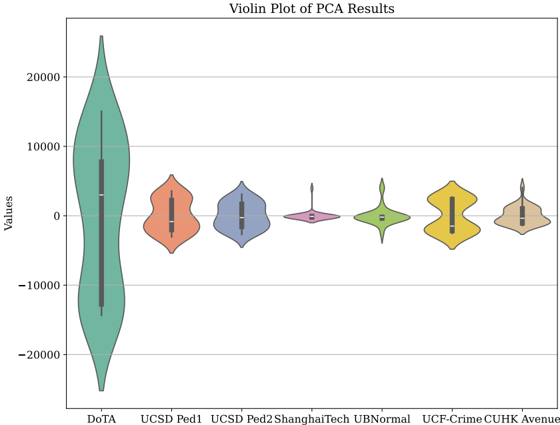

Manual Checking Before conducting the experiments, we performed the manual checking on the textual descriptions generated for the videos. Specifically, we consider the following aspects:

1. Error Correction: We removed text descriptions that contained obvious errors about the video content and supplemented the correct object, behavior, and scene information. (For instance, GPT tends to misidentify dogs in videos, describe running pedestrians as skateboards and motorcycles, and mistake scenes containing water as rainy days.)
2. Detail Enhancement: We provided more detailed textual descriptions of anomalies in the video (such as pedestrians lingering or jumping in the middle of the road).
3. Human Resource Cost: We formed a team of five annotators to conduct Manual Checking on all the videos. Since most of the videos already had automatically generated annotations, each annotator invested approximately 30 hours of work during the labeling process, processing about 1700 videos.

&lt;DESCRIBE\_VIDEO&gt; and Generated Open-World &lt;QUESTION&gt; We set 20 problems for &lt;DESCRIBE\_VIDEO&gt;, and during each iteration in training, we randomly select one of them.

```
1. Can you describe the anomaly in the video? 2. How would you detail the anomaly found in the video? 3. What anomaly can you identify in the video? 4. Could you explain the anomaly observed in the video? 5. Can you point out the anomaly in the video? 6. What ' s the anomaly depicted in the video? 7. Could you specify the anomaly present in the video? 8. How do you perceive the anomaly in the video? 9. Can you highlight the anomaly within the video? 10. What anomaly is noticeable in the video? 11. Could you characterize the anomaly seen in the video? 12. Can you detail the specific anomaly encountered in the video? 13. How would you describe the particular anomaly in the video? 14. What details can you provide about the anomaly in the video? 15. Could you elucidate on the anomaly detected in the video? 16. Can you illustrate the nature of the anomaly in the video? 17. What features of the anomaly in the video can you describe? 18. Could you outline the anomaly observed in the video? 19. How does the anomaly in the video manifest? 20. Can you clarify the aspects of the anomaly in the video?
```

We have also generated 100 &lt;QUESTIONS&gt; for open-world anomalies. To mimic user behavior, some of these questions are closely related to the video scene, while others are less closely related. However, all of these questions are potential inquiries in an open-world scenario.

```
1. Who is causing the disturbance in the video? 2. What is the unusual activity happening in the video? 3. When did the anomaly occur in the video? 4. Where is the strange event taking place in the video? 5. Why is the object in the video behaving abnormally? 6. How is the anomaly in the video affecting the surroundings? 7. How much damage was caused by the incident in the video? 8. Who is the main person involved in the unusual event? 9. What is the cause of the sudden change in the video? 10. When does the suspicious activity start in the video? 11. Where can I find more information about the incident in the video? 12. Why are the people in the video reacting in that way? 13. How can I identify the source of the problem in the video? 14. How much time does the abnormal event last in the video? 15. Who are the other people affected by the anomaly in the video? 16. What actions were taken to address the issue in the video? 17. When was the video recorded, and is it a recent event? 18. Where else can I find similar incidents in other videos? 19. Why is the vehicle in the video moving erratically? 20. How can I prevent such anomalies from occurring in the future? 21. How much impact does the abnormal event have on the overall situation? 22. Who should I contact if I notice a similar anomaly in another video? 23. What steps can I take to investigate the issue further? 24. When is the best time to report an unusual event in a video? 25. Where can I find resources to help me understand the anomaly better? 26. Why did the equipment in the video malfunction? 27. How can I differentiate between normal and abnormal behavior in a video? 28. How much does it cost to implement a system that detects anomalies in videos? 29. Who can provide expert advice on handling video anomalies? 30. What is the most common type of anomaly found in videos? 31. When should I be concerned about an anomaly in a video? 32. Where can I find a list of known video anomalies and their descriptions? 33. Why is it important to detect and analyze anomalies in videos? 34. How can I improve my ability to spot anomalies in videos? 35. How much training is required to become proficient in detecting video anomalies?
```

```
36. Who can I collaborate with to better understand video anomalies? 37. What are the potential consequences of ignoring an anomaly in a video? 38. When did the trend of analyzing anomalies in videos begin? 39. Where can I find examples of successfully resolved video anomaly cases? 40. Why do some anomalies in videos go unnoticed? 41. How can I report a video anomaly to the appropriate authorities? 42. How much time is needed to thoroughly analyze a video anomaly? 43. Who is responsible for monitoring and addressing video anomalies? 44. What are the best tools to use for detecting anomalies in videos? 45. When is it necessary to escalate a video anomaly for further investigation? 46. Where can I find guidelines on how to handle video anomalies? 47. Why do some video anomalies lead to serious consequences? 48. How can I ensure the accuracy of my video anomaly detection system? 49. How much effort is needed to maintain a video anomaly detection system? 50. Who should be informed when a video anomaly is detected? 51. What are the signs that indicate a potential anomaly in a video? 52. When should I perform a follow-up analysis on a detected video anomaly? 53. Where can I find support for dealing with video anomalies? 54. Why is it crucial to act quickly when a video anomaly is detected? 55. How can I improve the efficiency of my video anomaly detection process? 56. How much data is needed to accurately detect anomalies in videos? 57. Who can help me fine-tune my video anomaly detection system? 58. What are the key factors to consider when analyzing video anomalies? 59. When should I update my video anomaly detection system? 60. Where can I find the latest research on video anomaly detection techniques? 61. Why is it necessary to have a video anomaly detection system in place? 62. How can I minimize false alarms in my video anomaly detection system? 63. How much does it cost to maintain a video anomaly detection system? 64. Who can I consult if I encounter difficulties with my video anomaly detection system? 65. What are the best practices for dealing with video anomalies? 66. When is it appropriate to involve law enforcement in a video anomaly case? 67. Where can I find a community of professionals who specialize in video anomaly detection? 68. Why do some video anomalies require immediate attention? 69. How can I enhance the performance of my video anomaly detection system? 70. How much should I invest in a video anomaly detection system? 71. Who can provide training on how to detect and analyze video anomalies? 72. What are the most effective methods for detecting anomalies in videos? 73. When should I seek external help for a video anomaly case? 74. Where can I find a comprehensive database of video anomalies? 75. Why is it important to continuously monitor videos for anomalies? 76. How can I validate the results of my video anomaly detection system? 77. How much influence do external factors have on video anomalies? 78. Who can I reach out to for assistance with a complex video anomaly case? 79. What are the main challenges in detecting and analyzing video anomalies? 80. When is it necessary to involve other stakeholders in a video anomaly case? 81. Where can I find case studies on successful video anomaly detection projects? 82. Why is it essential to have a systematic approach to video anomaly detection? 83. How can I optimize my video anomaly detection system for different scenarios? 84. How much storage is needed to archive video anomalies for future analysis? 85. Who should be held accountable for undetected video anomalies? 86. What are the most common reasons for video anomalies to occur? 87. When should I reevaluate my video anomaly detection system? 88. Where can I find information on the latest video anomaly detection technologies? 89. Why is it beneficial to collaborate with others in the field of video anomaly detection? 90. How can I ensure the confidentiality of video anomaly cases? 91. How much should I rely on automated systems for video anomaly detection? 92. Who can I contact for technical support with my video anomaly detection system? 93. What are the ethical considerations when dealing with video anomalies? 94. When should I notify the public about a video anomaly case? 95. Where can I find reliable sources of information on video anomalies? 96. Why is it important to have a backup plan for dealing with video anomalies? 97. How can I customize my video anomaly detection system for specific use cases? 98. How much time should I allocate for analyzing video anomalies? 99. Who can I turn to for guidance on handling sensitive video anomaly cases? 100. What are the most critical factors to consider when choosing a video anomaly detection system?
```

## E Details in GPT-Guided Metrics

In the GPT-Guided metrics, we employ GPT-4 as an auxiliary tool to evaluate the generated response of HAWK. Our evaluation focuses on three primary dimensions: Reasonability, Detail, and Consistency.

We first set the system prompt as follows: Initially, we establish the system prompt as shown below:

```
{"role": "system", "content": "You are an intelligent chatbot designed for evaluating the generative outputs for video-based pairs. you will be given two answers, one reference ground truth and one our generated, but this does not mean that the reference GT is the only answer. Your task is to give the ,→ ,→ ,→ ,→ ,→ ,→ ,→ ,→
```

- score of the predicted answers."}

Our system prompt is designed to compare the degree of matching between image pairs. However, this does not imply fine-grained matching at the text level. Instead, it emphasizes the semantic information-related aspects.

```
To assess a particular dimension of the metric, we employ the following prompt: {"role": "user", "content": "### Video Description Generation Please evaluate the following video-based video description pair: Reference: <DESCRIPTION_GT> Ours: <DESCRIPTION_Ours> ### Video Question-Answering Please evaluate the following video-based video question-answer pair: Question: <QUESTION> Reference: <ANSWER_GT> Ours: <ANSWER_Ours>
```

Provide your evaluation only as a &lt;Reasonability|Detail|Consistency&gt; score

- where the &lt;Reasonability|Detail|Consistency&gt; score is a FLOAT value between 0 and 1, with 1 indicating the highest level of &lt;Reasonability|Detail|Consistency&gt;. Please generate the response in the form of a Python dictionary string with key ' score ' , where its value is the &lt;Reasonability|Detail|Consistency&gt; score in FLOAT, not STRING. DO NOT PROVIDE ANY OTHER OUTPUT TEXT OR EXPLANATION. Only provide the Python dictionary string. For example, your response should look like this: { ' score ' : 0.675}."} ,→ ,→ ,→ ,→ ,→ ,→ ,→ ,→ ,→ ,→ ,→ ,→ ,→ ,→ ,→ ,→

We have developed distinct prompts for two tasks: Video Description Generation and Video QuestionAnswering. The primary difference is the addition of the &lt;QUESTION&gt; field in Video QuestionAnswering, which indicates what kind of question the model should answer. &lt;DESCRIPTION\_GT&gt; and &lt;DESCRIPTION\_Ours&gt; represent the Ground Truth and our generated video description, respectively. Similarly, &lt;ANSWER\_GT&gt; and &lt;ANSWER\_Ours&gt; signify the Ground Truth and our generated video answers, respectively. &lt; Reasonability | Detail | Consistency &gt; represents the three dimensions we aim to evaluate. Lastly, besides the essential reminders, we have constrained GPT's output format to {'score': 0.675}.

## F More Results

Table (A), (B), (C), (D), (E), and (F) below present additional qualitative results from different datasets. In the tables, red texts indicate key semantic inconsistencies with the Ground Truth, while green texts signify that the generated results closely align with the Ground Truth.

## G Open-World Video Anomaly Understanding Demo

We present a demo showcasing the use of HAWK in an open-world scenario, using XD-Violence [38] (which is not included in our dataset). The practical capability of the system in an unknown scenario in the open world is depicted in Fig.7 and Fig.8. Furthermore, HAWK can provide accurate answers to users' questions and engage in long dialogues in the open world.

## H Limitations

Hallucination Although most of the hallucinations can be decreased through motion, some error motion may still also cause hallucinations. Future work may need to consider the connection between the hallucination and the abnormal region more precisely.

Video-level v.s. Streaming Data The goal of this paper is video-level video anomaly understanding. However, for a video anomaly detection system, anomaly detection in streaming is essential, so to increase the practical application ability, we need to design a more practical system for streaming data.

Data Limitations While our dataset includes multiple anomaly scenarios and our framework is designed for an open-world setting, the limitations of our data make it difficult to fully support open-world scenarios. This is a significant drawback of our study. To address this limitation, we recommend building larger and more diverse open datasets.

## I Future Work

In this section, we discuss potential avenues for future research to build upon this paper.

Expanding Applicability One possible direction for future work is to expand the applicability of the model to a wider range of scenarios (like most recent research by Du et al. [6]). While our current dataset includes multiple anomaly scenarios, there are still many diverse scenarios the model may not handle. We could explore ways to incorporate additional data sources or create new datasets that cover a broader range of scenarios. Additionally, we could investigate ways to deploy the model in cloud, edge, and hybrid computing environments to support more diverse deployment scenarios.

Enriching Task Capabilities While our current model is able to detect anomalies in videos, it does not provide location information where the anomaly occurs. This information could be valuable for certain applications, such as security monitoring or surveillance. Therefore, a valuable direction for future work would be to investigate ways to improve the model's ability to localize anomalies. By improving the model's ability to locate the scene of an anomaly, we could further enhance its usability and expand its range of applications.

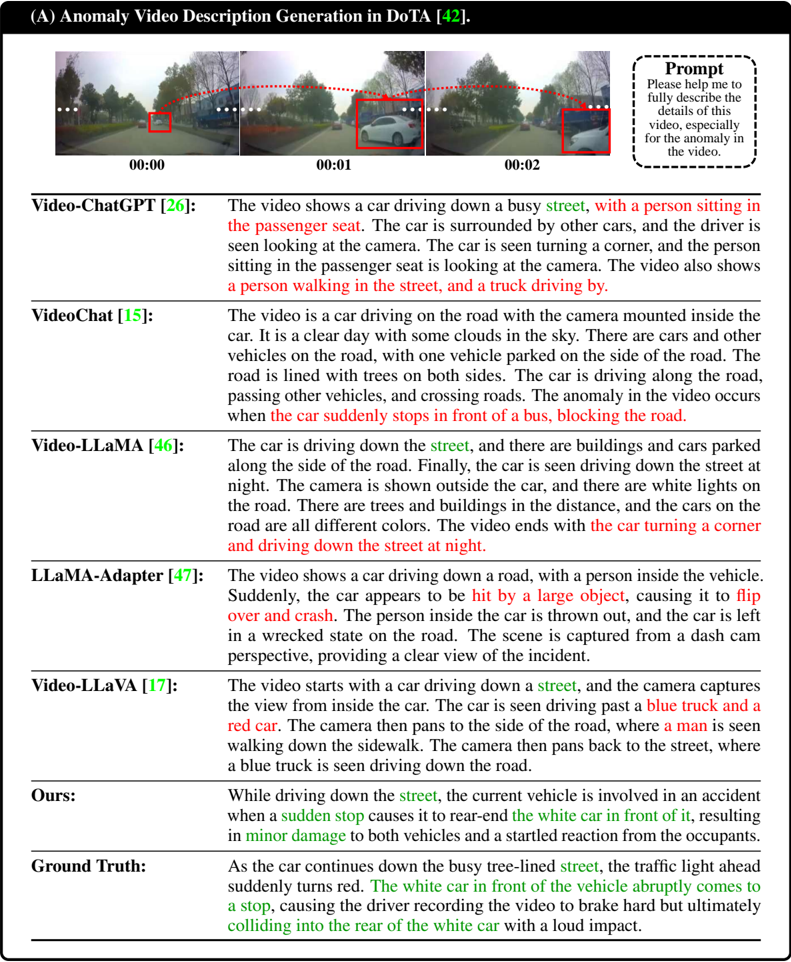

| …… ……
 00:00 00:01 00:02
 Prompt
 Please help me to 
 fully describe the 
 details of this 
 video, especially 
 for the anomaly in 
 the video.
 …… ……   | …… ……
 00:00 00:01 00:02
 Prompt
 Please help me to 
 fully describe the 
 details of this 
 video, especially 
 for the anomaly in 
 the video.
 …… ……                                                                                                                                                                                                                                                                                                                 |
|-----------------------------------------------------------------------------------------------------------------------------------------------------------|-------------------------------------------------------------------------------------------------------------------------------------------------------------------------------------------------------------------------------------------------------------------------------------------------------------------------------------------------------------------------------------------------------------------------------------------------------------------------|
| 00:00                                                                                                                                                     | 00:01 00:02                                                                                                                                                                                                                                                                                                                                                                                                                                                             |
| Video-ChatGPT [26]:                                                                                                                                       | The video shows a car driving down a busy street, with a person sitting in
 the passenger seat. The car is surrounded by other cars, and the driver is
 seen looking at the camera. The car is seen turning a corner, and the person
 sitting in the passenger seat is looking at the camera. The video also shows
 a person walking in the streetand a truck driving by                                                                                                |
| Video-ChatGPT [26]:                                                                                                                                       | The video shows a car driving down a busy street, with a person sitting in
 the passenger seat. The car is surrounded by other cars, and the driver is
 seen looking at the camera. The car is seen turning a corner, and the person
 sitting in the passenger seat is looking at the camera. The video also shows
 a person walking in the street, and a truck driving by.                                                                                             |
| VideoChat [15]:                                                                                                                                           | pg g y
 The video is a car driving on the road with the camera mounted inside the
 car. It is a clear day with some clouds in the sky. There are cars and other
 vehicles on the road, with one vehicle parked on the side of the road. The
 road is lined with trees on both sides. The car is driving along the road,
 passing other vehicles, and crossing roads. The anomaly in the video occurs
 when the car suddenly stops in front of a bus, blocking the road. |
| VideoChat [15]:                                                                                                                                           | Suddenly, the car appears to be hit by a large object, causing it to flip
 over and crash. The person inside the car is thrown out, and the car is left
 in a wrecked state on the road. The scene is captured from a dash cam
 perspective, providing a clear view of the incident.
 The video starts with a car driving down a streetand the camera captures                                                                                                          |
| VideoChat [15]:                                                                                                                                           | car. It is a clear day with some clouds in the sky. There are cars and other
 vehicles on the road, with one vehicle parked on the side of the road. The
 road is lined with trees on both sides. The car is driving along the road,
 passing other vehicles, and crossing roads. The anomaly in the video occurs
 when the car suddenly stops in front of a bus, blocking the road.
 Thidiidthttd thbildid kd                                                          |
| Video-LLaMA [46]:                                                                                                                                         | The video is a car driving on the road with the camera mounted inside the
 car. It is a clear day with some clouds in the sky. There are cars and other
 vehicles on the road, with one vehicle parked on the side of the road. The
 road is lined with trees on both sides. The car is driving along the road
 passing other vehicles, and crossing roads. The anomaly in the video occurs
 when the car suddenly stops in front of a busblocking the road             |
| Video-LLaMA [46]:                                                                                                                                         | The video starts with a car driving down a street, and the camera captures
 the view from inside the car. The car is seen driving past a blue truck and a
 red car. The camera then pans to the side of the road, where a man is seen
 walking down the sidewalk. The camera then pans back to the street, where
 a blue truck is seen driving down the road.                                                                                                           |
| Video-LLaMA [46]:                                                                                                                                         | The video starts with a car driving down a street, and the camera captures
 the view from inside the car. The car is seen driving past a blue truck and a
 red car. The camera then pans to the side of the road, where a man is seen
 walking down the sidewalk. The camera then pans back to the street, where
 a blue truck is seen driving down the road.                                                                                                           |
| Ours:                                                                                                                                                     | While driving down the street, the current vehicle is involved in an acciden
 when a sudden stop causes it to rear-end the white car in front of it, resultin                                                                                                                                                                                                                                                                                                           |
| Ours:                                                                                                                                                     | While driving down the street, the current vehicle is involved in an acciden
 when a sudden stop causes it to rear-end the white car in front of it, resulting                                                                                                                                                                                                                                                                                                          |

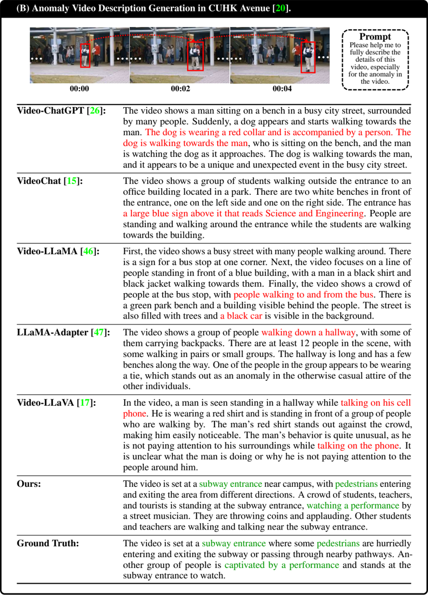

| …… ……
 Prompt
 Please help me to 
 fully describe the 
 details of this 
 video, especially 
 for the anomaly in 
 thid
 …… ……   | …… ……
 Prompt
 Please help me to 
 fully describe the 
 details of this 
 video, especially 
 for the anomaly in 
 thid
 …… ……                                                                                                                                                                                                                                                                                                                                                             |
|----------------------------------------------------------------------------------------------------------------------------------|--------------------------------------------------------------------------------------------------------------------------------------------------------------------------------------------------------------------------------------------------------------------------------------------------------------------------------------------------------------------------------------------------------------------------------------------------------------------------------------------|
| 00:00                                                                                                                            |                                                                                                                                                                                                                                                                                                                                                                                                                                                                                            |
| Video-ChatGPT [26]:                                                                                                              | The video shows a man sitting on a bench in a busy city street, surrounded
 by many people. Suddenly, a dog appears and starts walking towards the
 man. The dog is wearing a red collar and is accompanied by a person. The
 dog is walking towards the man, who is sitting on the bench, and the man
 is watching the dog as it approaches. The dog is walking towards the man,
 and it appears to be a unique and unexpected event in the busy city street.                             |
| VideoChat [15]:                                                                                                                  | he video shows a group of students walking outside the entrance to an
 ffice building located in a park. There are two white benches in front of
 he entrance, one on the left side and one on the right side. The entrance has
 large blue sign above it that reads Science and Engineering. People are
 tanding and walking around the entrance while the students are walking
 owards the building                                                                                      |
| Video-LLaMA [46]:                                                                                                                | g
 First, the video shows a busy street with many people walking around. There
 is a sign for a bus stop at one corner. Next, the video focuses on a line of
 people standing in front of a blue building, with a man in a black shirt and
 black jacket walking towards them. Finally, the video shows a crowd of
 people at the bus stop, with people walking to and from the bus. There is
 a green park bench and a building visible behind the people. The street is                  |
|                                                                                                                                  | some walking in pairs or small groups. The hallway is long and has a few
 benches along the way. One of the people in the group appears to be wearing
 a tie, which stands out as an anomaly in the otherwise casual attire of the
 other individuals.
 In the video, a man is seen standing in a hallway while talking on his cell
 phone. He is wearing a red shirt and is standing in front of a group of people
 who are walking by. The man’s red shirt stands out against the crowd, |
| Ours:                                                                                                                            | The video is set at a subway entrance near campus, with pedestrians entering
 and exiting the area from different directions. A crowd of students, teachers,
 and tourists is standing at the subway entrance, watching a performance by
 a street musician. They are throwing coins and applauding. Other students
 and teachers are walking and talking near the subway entrance.                                                                                                        |
| Ground Truth:                                                                                                                    | The video is set at a subway entrance near campus, with pedestrians entering
 and exiting the area from different directions. A crowd of students, teachers,
 and tourists is standing at the subway entrance, watching a performance by
 a street musician. They are throwing coins and applauding. Other students
 and teachers are walking and talking near the subway entrance.                                                                                                        |
| Ground Truth:                                                                                                                    | The video is set at a subway entrance where some pedestrians are hurriedly
 entering and exiting the subway or passing through nearby pathways. Another group of people is captivated by a performance and stands at the
 subway entrance to watch.                                                                                                                                                                                                                                       |

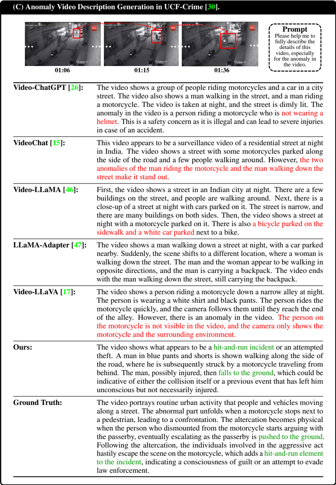

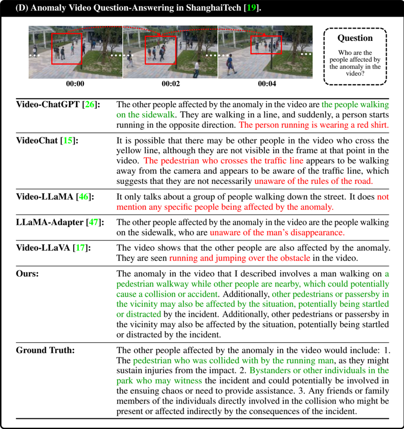

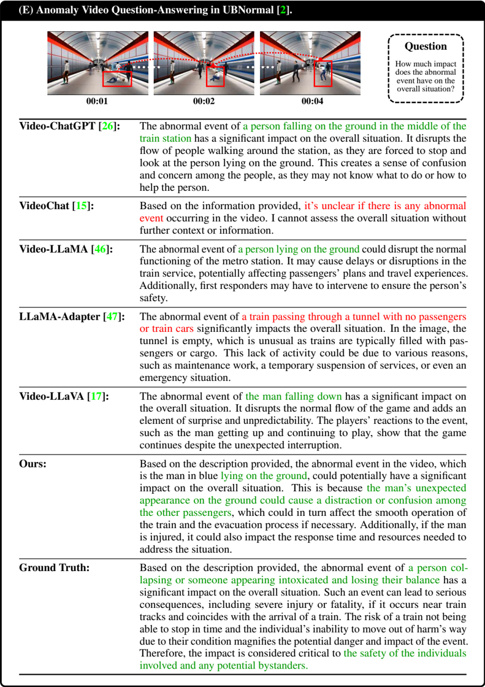

| …… ……
 00:01 00:02 00:04
 Question
 How much impact 
 does the abnormal 
 event have on the 
 overall situation?
 …… ……   | …… ……
 00:01 00:02 00:04
 Question
 How much impact 
 does the abnormal 
 event have on the 
 overall situation?
 …… ……                                                                                                                                                                                                                                                                                      |
|---------------------------------------------------------------------------------------------------------------------------|--------------------------------------------------------------------------------------------------------------------------------------------------------------------------------------------------------------------------------------------------------------------------------------------------------------------------------------------------------------------------------------------------------------|
| 00:01 
 dChtGPT [26]                                                                                                      | 2 00:04                                                                                                                                                                                                                                                                                                                                                                                                      |
| Video-ChatGPT [26]:                                                                                                       | The abnormal event of a person falling on the ground in the middle of the
 train station has a significant impact on the overall situation. It disrupts the
 flow of people walking around the station, as they are forced to stop and
 look at the person lying on the ground. This creates a sense of confusion
 and concern among the people, as they may not know what to do or how to
 help the person. |
| VideoChat [15]:                                                                                                           | ased on the information provided, it’s unclear if there is any abnormal
 ent occurring in the video. I cannot assess the overall situation without
 rther context or information.                                                                                                                                                                                                                            |
| LLMAAdt[47]                                                                                                               | functioning of the metro station. It may cause delays or disruptions in the
 train service, potentially affecting passengers’ plans and travel experiences
 Additionally, first responders may have to intervene to ensure the person’s
 safety.
 The abnormal event of a train passing through a tunnel with no passengers
 or train cars significantly impacts the overall situation. In the image, the    |
| Video-LLaVA [17]:                                                                                                         | emergency situation.
 The abnormal event of the man falling down has a significant impact on
 he overall situation. It disrupts the normal flow of the game and adds an
 element of surprise and unpredictability. The players’ reactions to the event
 such as the man getting up and continuing to play, show that the game
 continues despite the unexpected interruption.                                |

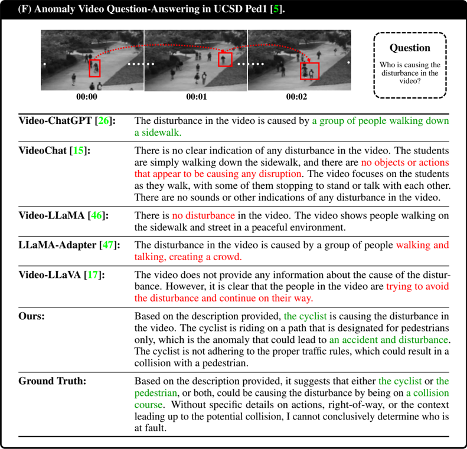

Figure 7: Demo on Open-World Video Anomaly Understanding. (Part 1)

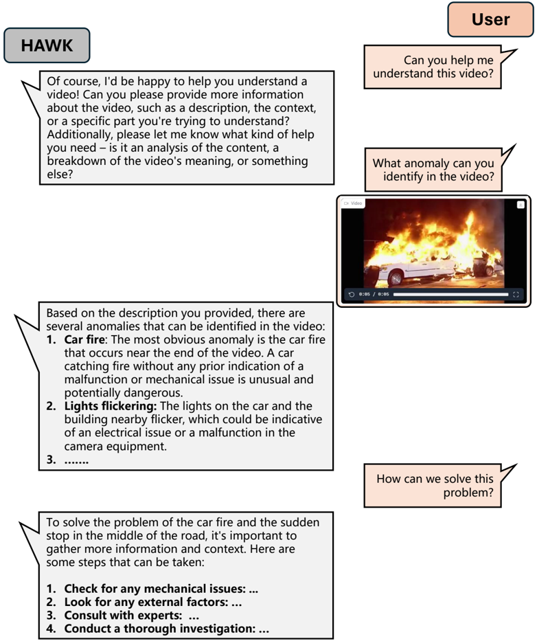

Figure 8: Demo on Open-World Video Anomaly Understanding. (Part 2)

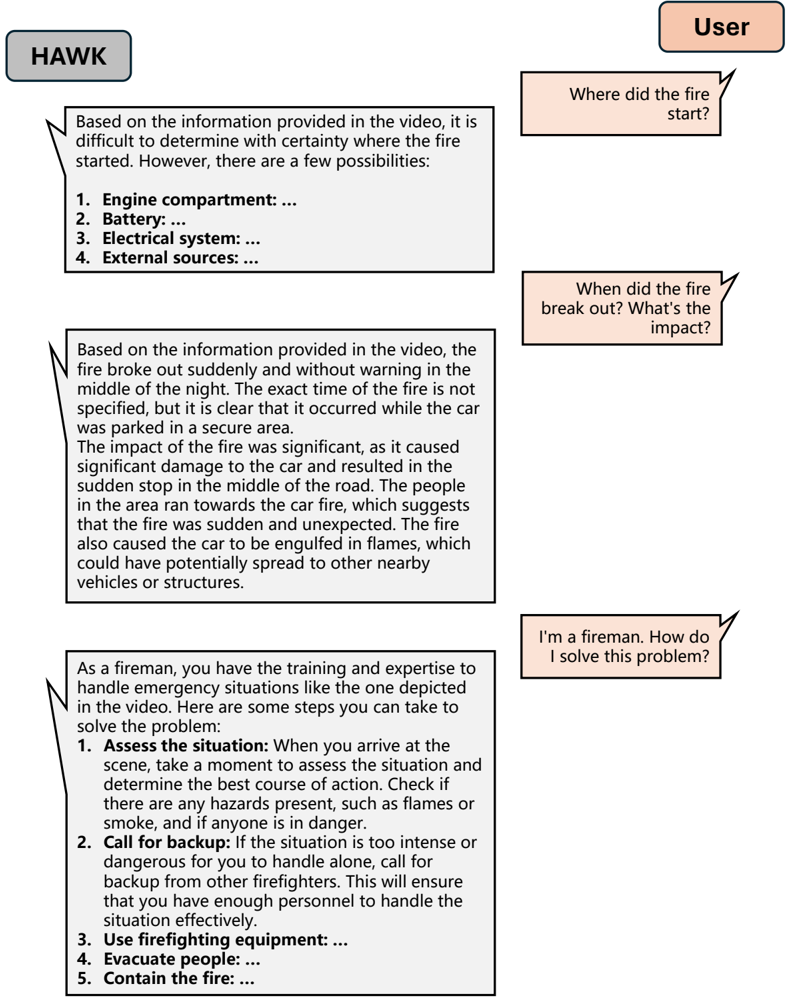