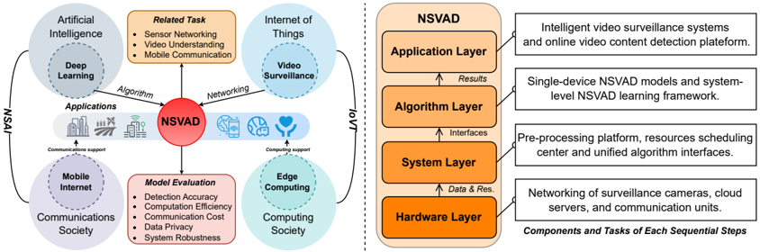
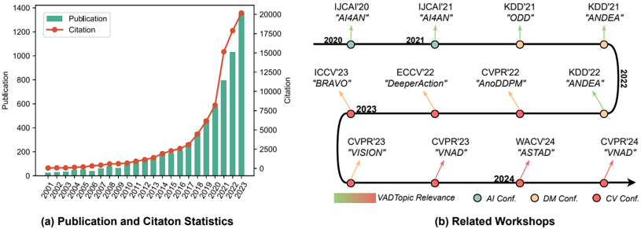
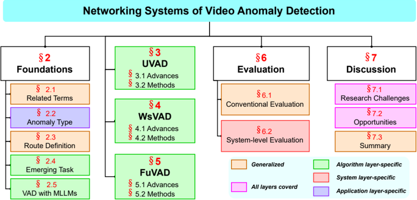
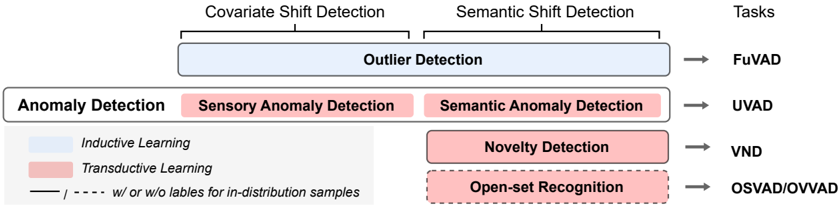
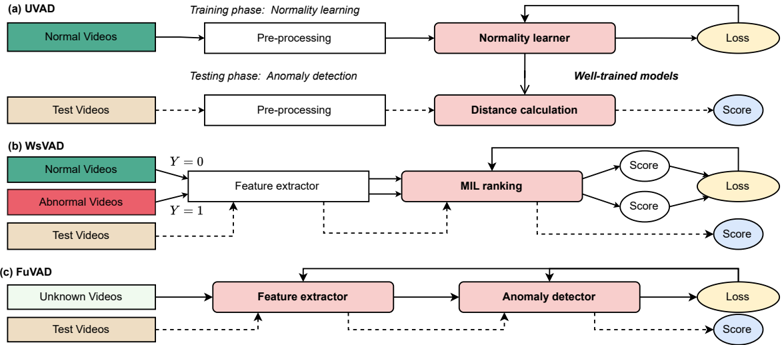
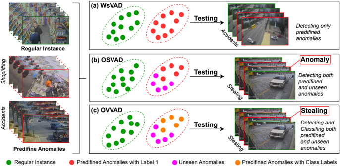
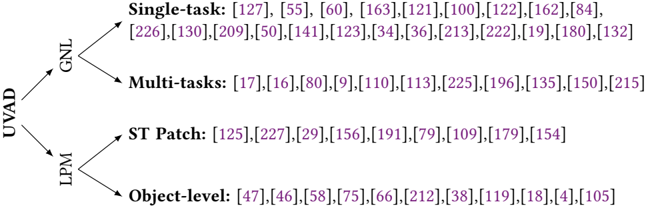
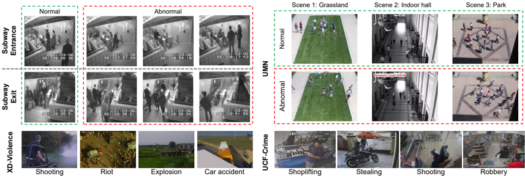
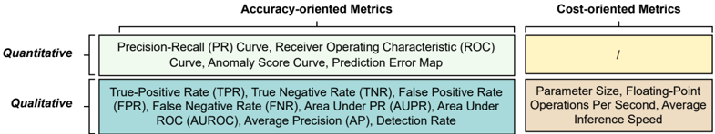

## Networking Systems for Video Anomaly Detection: A Tutorial and Survey

JING LIU , Fudan University, China, The University of British Columbia, Canada, and Duke Kunshan University,

## China

YANG LIU ∗

, Soochow University, China

JIEYU LIN , University of Toronto, Canada

JIELIN LI , The University of Hong Kong, Hong Kong SAR

LIANG CAO , Massachusetts Institute of Technology, United States

PENG SUN ∗ , Duke Kunshan University, China

BO HU ∗ , Fudan University, China

LIANG SONG ∗

, Fudan University, China

AZZEDINE BOUKERCHE , University of Ottawa, Canada

VICTOR C.M. LEUNG , Shenzhen MSU-BIT University, China, Shenzhen University, China, and The University of

## British Columbia, Canada

The increasing utilization of surveillance cameras in smart cities, coupled with the surge of online video applications, has heightened concerns regarding public security and privacy protection, which propelled automated Video Anomaly Detection (VAD) into a fundamental research task within the Artificial Intelligence (AI) community. With the advancements in deep learning and edge computing, VAD has made significant progress and advances synergized with emerging applications in smart cities and video internet, which has moved beyond the conventional research scope of algorithm engineering to deployable Networking Systems for VAD (NSVAD), a practical hotspot for intersection exploration in the AI, IoVT, and computing fields. In this article, we delineate the

∗ Corresponding authors.

Authors' addresses: Jing Liu, jingliu19@fudan.edu.cn, Fudan University, School of Information Science and Technology, 220 Handan Road, Shanghai, 200433, China and The University of British Columbia, Department of Electrical and Computer Engineering, 2329 West Mall, Vancouver, British Columbia, V6T 1Z4, Canada and Duke Kunshan University, Division of Natural and Applied Sciences, 8 Duke Avenue, Kunshan, Jiangsu Province, 215316, China; Yang Liu, yangliu@cs.toronto.edu, Soochow University, School of Future Science and Engineering, 1 Jiuyong West Road, Wujiang District, Suzhou, Jiangsu Province, 215222, China; Jieyu Lin, jieyu.lin@mail.utoronto.ca, University of Toronto, Department of Electrical and Computer Engineering, 27 King's College Circle, Toronto, Ontario, M5S 1A1, Canada; Jielin Li, jielinli@connect.hku.hk, The University of Hong Kong, Department of Computer Science, Pokfulam Road, Hong Kong, Hong Kong SAR; Liang Cao, liangcao@mit.edu, Massachusetts Institute of Technology, Department of Chemical Engineering, 77 Massachusetts Avenue, Cambridge, Massachusetts, 02139, United States; Peng Sun, peng.sun568@duke.edu, Duke Kunshan University, Division of Natural and Applied Sciences, 8 Duke Avenue, Kunshan, Jiangsu Province, 215316, China; Bo Hu, bohu@fudan.edu.cn, Fudan University, School of Information Science and Technology, 220 Handan Road, Shanghai, 200433, China; Liang Song, songl@fudan.edu.cn, Fudan University, Academy for Engineering &amp; Technology, 220 Handan Road, Shanghai, 200433, China; Azzedine Boukerche, aboukerc@uOttawa.ca, University of Ottawa, School of Electrical Engineering and Computer Science, 75 Laurier Avenue East, Ottawa, Ontario, K1N 6N5, Canada; Victor C.M. Leung, vleung@ece.ubc.ca, Shenzhen MSU-BIT University, Artificial Intelligence Research institute, 1 International University Park Road, Dayun New Town, Shenzhen, Guangdong Province, 518172, China and Shenzhen University, College of Computer Science and Software Engineering, 3688 Nanhai Avenue, Shenzhen, Guangdong Province, 518060, China and The University of British Columbia, Department of Electrical and Computer Engineering, 2329 West Mall, Vancouver, British Columbia, V6T 1Z4, Canada.

Permission to make digital or hard copies of all or part of this work for personal or classroom use is granted without fee provided that copies are not made or distributed for profit or commercial advantage and that copies bear this notice and the full citation on the first page. Copyrights for components of this work owned by others than the author(s) must be honored. Abstracting with credit is permitted. To copy otherwise, or republish, to post on servers or to redistribute to lists, requires prior specific permission and/or a fee. Request permissions from permissions@acm.org. © 2025 Copyright held by the owner/author(s). Publication rights licensed to ACM.

Manuscript submitted to ACM

foundational assumptions, learning frameworks, and applicable scenarios of various deep learning-driven VAD routes, offering an exhaustive tutorial for novices in NSVAD. In addition, this article elucidates core concepts by reviewing recent advances and typical solutions and aggregating available research resources accessible at https://github.com/fdjingliu/NSVAD. Lastly, this article projects future development trends and discusses how the integration of AI and computing technologies can address existing research challenges and promote open opportunities, serving as an insightful guide for prospective researchers and engineers.

CCS Concepts: • General and reference → Surveys and overviews; • Information systems → Multimedia information systems

Additional Key Words and Phrases: Video anomaly detection, intelligent surveillance, representation learning, normality learning

## ACM Reference Format:

Jing Liu, Yang Liu, Jieyu Lin, Jielin Li, Liang Cao, Peng Sun, Bo Hu, Liang Song, Azzedine Boukerche, and Victor C.M. Leung. 2025. Networking Systems for Video Anomaly Detection: A Tutorial and Survey. 1, 1 (April 2025), 36 pages. https://doi.org/XXXXXXX. XXXXXXX

## 1 INTRODUCTION

As one of the core technologies of the ubiquitous Internet of Video Things (IoVT), Video Anomaly Detection (VAD) aims to use video sensors to automatically discover unexpected spatial-temporal patterns and detect unusual events that may cause security problems or economic losses, such as traffic accidents, violent behaviors, and offending contents [118]. With the widespread use of surveillance cameras in smart cities [149] and the boom of online video applications powered by 4/5G communication technologies, traditional human inspection is no longer able to accurately monitor the video data generated around the clock, which is not only time-consuming and labor-intensive but also poses the risk of leaking important information (e.g., biometrics and sensitive speech). In contrast, VAD-empowered IoVT applications [67], such as Intelligent Video Surveillance Systems (IVSS) and automated content analysis platforms, can process massive video streams online and detect events of interest in real-time, sending only noteworthy anomaly parts for human review, significantly reducing data storage and communication costs, and helping to eliminate public concerns about data security and privacy protection. As a result, VAD has gained widespread attention in academia and industry over the last decade and has been used in emerging fields [11 , 13 , 142] such as information forensics [211], industrial manufacturing [106 , 185] in smart cities as well as online content analysis in mobile video applications [210].

VAD extends the data scope of conventional Anomaly Detection (AD) from time series, images, and graphs to video, which not only needs to cope with the endogenous data complexity, but also needs to take into account the computational and communication costs in resource-limited devices [68]. Specifically, the inherent high-dimensional structure of video data, high information density and redundancy, heterogeneity of temporal and spatial patterns, and feature entanglement between foreground targets and background scenes make VAD more challenging than traditional AD tasks at the levels of representation learning and anomaly discrimination [128]. Existing studies [4 , 77 , 100 , 111] have shown that high-performance VAD models need to target the modeling of appearance and motion information, i.e., the difference between regular events and anomalous examples in both spatial and temporal dimensions. In contrast to time series AD which mainly measures periodic temporal patterns of variables, and image AD which only focuses on spatial contextual deviations, VAD needs to extract both discriminative spatial and temporal features from a large amount of redundant information (e.g., repetitive temporal contexts and label-independent data shifts), as well as to learn the differences between normal and anomalous events in terms of the local appearances and global motions [91 , 99 , 145].

However, video anomalies are ambiguous and subjective [88 , 89]. The same driving behavior can be classified differently depending on road conditions and contextual environments. For example, riding a horse in a grassland is Manuscript submitted to ACM

.

Fig. 1. Topology diagram of research scope of NSAVD (Left) and its key sequential steps (Right).

usually normal, whereas a horse appearing on a highway would be considered an anomaly. On the one hand, compared to regular events, anomalies in the real world are difficult to be comprehensively predefined and have a much lower overall frequency of occurrence, making them difficult to collect. Labeling a sufficient number of all possible abnormal samples for model training is almost impossible. As a result, traditional supervised learning-based classification models are usually ineffective in dealing with AD tasks [126]. On the other hand, since video storage and transmission costs are significantly higher than other data modalities, engineers favor processing such data on the end or edge side to reduce communication overhead. As we all know, such devices, including surveillance cameras, smartphones, and local servers, are computationally resource-limited. Therefore, it is highly practical to develop deployable VAD systems for real-world applications, which requires concerted efforts by AI beyond communities.

In this article, we extend the conventional scope of VAD from algorithm engineering on spatial-temporal anomaly detection to practical research towards real-world applications, termed Networking Systems for Video Anomaly Detection (NSVAD), to engage a broader readership from the IoT and computing communities. According to research objectives and involved domains, NSVAD is delineated into the hierarchical architecture shown in Fig. 1, encompassing: 1) Hardware Layer, consisting of various video sensors, communication units, and computing servers, etc, responsible for data acquisition, transmission, processing, and result reporting, as well as device networking; 2) System Layer, targeting resource optimization and algorithm deployment platforms for large-scale IoT applications, linking the Hardware Layer and the Algorithm Layer, supporting the configurable deployment of VAD tasks on various terminals; 3) Algorithm Layer, focusing on the development of detection algorithms and scene-specific models driven by artificial intelligence, especially deep learning; 4) Application Layer, encompassing IVSS in modern factories, agriculture, and smart cities, as well as various online video applications powered mobile internet. Most existing works belong to the Algorithm layer and solely concentrate on VAD model design, overlooking resource costs and challenges in real-world scenarios. For large-scale IoT and mobile video internet, NSVAD with stable performance and reasonable overheads that support online detection necessitates sensor networking research and support for resource optimization from computing communities. We review the recent advancements and typical methods in the algorithm layer and provide our latest explorations in the system layer to inspire readers to develop NSVAD toward real-world scenarios.

Thanks to the development of edge AI [177] and artificial neural networks [85], deep learning-driven NSVAD algorithms have made significant progress in recent years and derived Unsupervised (UVAD), Weakly-supervised (WsVAD), and Fully-unsupervised (FuVAD) routes [118]. They have liberated human beings from massive videos Manuscript submitted to ACM

analysis works and alleviated public information security concerns. Compared to early manual feature engineering, deep architectures such as convolutional neural networks and attention mechanisms can extract spatial-temporal representations from video sequences end-to-end without applying human a priori, empowering IVSS to process videos in different resolutions and scenarios. Therefore, researchers in this field are currently focusing on deep structure design and optimization learning strategies. They have creatively proposed multimodal VAD [174 , 192 , 193], OpenSet AVD (OSVAD) [1 , 233], Open-Vocabulary VAD (OVVAD) [194], video anomaly segmentation [173], and anomaly retrieval [190] tasks as well as integrated detection systems that can be deployed in practical scenes, such as modern manufacturing [111], smart city [116], and automated driving [180]. In addition to algorithm design, researchers from Networking Systems of AI (i.e., research on the deep convergence of communication and AI) [164] and IoVT (i.e., subfields of IoT focusing on video sensor design, networking, and data processing) [90] have begun to explore the design deployment-oriented VAD systems to collaboratively deal with multiple challenges (e.g., multi-view cross-scene heterogeneous videos and communication overheads) that come from the dynamic scenarios at the application layer and the limited resources at the hardware layer. These explorations and progress greatly expand the research boundaries and application scenarios of VAD, promoting it as an intelligent system science, i.e., NSVAD.

Although there have been some reviews [30 , 139 , 159 , 160] focusing on AD and combing its related work, due to the limited research horizon, the early works usually regard VAD as a fringe research task in the AD community. They focus on time series or images but lack an illuminating analysis of the AD task in video data. Recent survey papers [15 , 131 , 149] continue to focus on unsupervised NSVAD routes in the same vein as the conventional AD task, i.e., using only normal samples to train generative models to learn the prototypical patterns of regular events and to discriminate uncharacterizable test samples as anomalies [122]. Such reviews, while providing a comprehensive taxonomy of VAD research from the outlier detection perspective, have been informative in the last decade when unsupervised methods have dominated the NSVAD algorithm research. However, they ignore the emerging weakly-supervised [42 , 174] and fully unsupervised [140 , 216] routes, which are of limited value in guiding further research.

Considering the differences in knowledge bases and orientations of readers, this article provides an in-depth analysis of the basic concepts, related knowledge, and recent advances involved in NSVAD research and summarizes the available research resources. We systematically analyze the assumptions, frameworks, scenarios, advantages, and disadvantages of unsupervised, weakly supervised, and fully unsupervised VAD routes and explain in detail the relevant domain knowledge involved in each route. In addition, we introduce our NSVAD systems designed for dynamic environments in complex scenarios such as industrial IoT [12] and smart cities [115] to guide the NSVAD research in specific applications. Finally, we forecast the research challenges, trends, and possible opportunities to inspire future exploration.

## 1.1 Attention Analysis

We searched the number of publications and citations with the topic of "video anomaly detection" in various mainstream academic databases (e.g., IEEE Xplore, ACM Digital Library, SpringerLink, ScienceDirect, and DBLP) to quantitatively present the research hotness, as shown in Fig. 2(a). Early VAD works were limited by hand-crafted features, which cannot handle complicated videos and rely on human a priori, thus having a slow start. Encouraged by the remarkable success of deep learning in video understanding tasks (e.g., action recognition, scene understanding, expression recognition [182] and multimodal perception [201]), VAD research saw a boom after 2010, with an explosive growth in the number of publications and citations that continues to the present. On the one hand, the spread of surveillance cameras and streaming media platforms has provided sufficient data support for NSVAD research, making it possible to train largescale deep models with high-performance GPUs. On the other hand, the increasing demand for offending video content Manuscript submitted to ACM

Fig. 2. Research hotness analysis. We count (a) the number of NSVAD-related publications and their citations in the past 23 years and organize (b) the AD-related workshops in conferences on Artificial Intelligence (AI), Data Mining (DM), and Computer Vision (CV).

Table 1. Comparison with related survey papers and conference tutorials.

| Year    | Ref.    | Perspective & Main Focus             | Type    | Type    | Research Routes & Open Task    | Research Routes & Open Task    | Research Routes & Open Task    | Research Routes & Open Task    | Research Routes & Open Task    | Content Analysis   | Content Analysis   | Content Analysis   |
|---------|---------|--------------------------------------|---------|---------|--------------------------------|--------------------------------|--------------------------------|--------------------------------|--------------------------------|--------------------|--------------------|--------------------|
| Year    | Ref.    | p                                    | Survey  | Tutoria | UVAD                           | WsVAD                          | FuVAD                          | OSVAD                          | OVVAD                          | Advances Review    | Basic Knowledg     | Practical Cases    |
| 2018    | [74]    | Un- and semi-supervised VAD          | !       |         |                                | #                              | G#                             | #                              | #                              |                    | #                  | #                  |
| 2019    | [30]    | Time series AD in IoT                | !       |         | ⊙                              | ⊙                              | ⊙                              | ⊙                              | ⊙                              |                    |                    | #                  |
| 2020    | [160]   | VAD in traffic scene                 | !       |         |                                | G#                             | #                              | #                              | #                              |                    | #                  | #                  |
| 2022    | [149]   | Unsupervised VAD in single-scene     | !       |         |                                | G#                             | G#                             | #                              | #                              |                    |                    | #                  |
| 2021    | [131]   | Deep learning-based unsupervised VAD | !       |         |                                | #                              | #                              | #                              | #                              |                    | #                  | #                  |
| 2021    | [152]   | Unsupervised VAD in crowd sence      | !       |         |                                | #                              | #                              | #                              | #                              |                    | #                  | #                  |
| 2021    | [139    | Deep learing-based unsupervised AD   | !       |         | ⊙                              | ⊙                              | ⊙                              | ⊙                              | ⊙                              |                    |                    | #                  |
| 2021    | [7]     | Time series AD                       | !       |         | ⊙                              | ⊙                              | ⊙                              | ⊙                              | ⊙                              |                    | #                  | #                  |
| 2022    | [15]    | Unsupervised and supervised VAD      | !       |         |                                | G#                             | #                              | #                              | #                              |                    | #                  | #                  |
| 2022    | [148]   | Unsupervised VAD                     | !       |         |                                |                                | #                              | #                              | #                              |                    | #                  | #                  |
| 2023    | -       | Un- and weakly-supervised VAD        |         | !       |                                |                                | #                              | #                              | #                              |                    | G#                 | #                  |
| 2024    | [118]   | Generalized VAD                      | !       |         |                                |                                |                                | G#                             | #                              |                    | #                  | #                  |
| 2024    | Ours    | NSVAD routes in video IoT            |         | !       |                                |                                |                                |                                |                                |                    |                    |                    |

- : Systematic compendium and presentation to the routes/tasks/contents. G#: Briefly mentioned. #: Not presented. ⊙: Not applicable.

detection in various scenarios drives many researchers and engineers from AI and IoT fields to devote themselves to NSVAD research.

Fig. 2(b) presents the AD-related workshops in the top computer science conferences in the past four years. The changes in data types and application scenarios in these workshops show that AD tasks on visual data, especially videos, have dominated the community. For example, the "DeeperAction" workshop explicitly identified anomalous behavior recognition in surveillance videos as the following research hotspot in behavior analysis. The first "ASTAD" workshop at WACV'24 centered on anomalous detection of spatial-temporal data and its application to computer vision tasks. In addition, the latest workshops, "BRAVO" and "VISION", explored the application of AD technology in areas such as autonomous driving and modern manufacturing, further demonstrating the high hotness and broad application prospects of VAD. To make it easier for beginners to navigate these workshops, we have categorized all the available resources, please see our public GitHub repository at https://github.com/fdjingliu/NSVAD .

## 1.2 Related Work

To our knowledge, this is the first tutorial-type paper on NSVAD, providing a systematic overview of the basics, recent advances, and practical applications of various VAD routes. Previous papers [15 , 74 , 118 , 149] primarily focus on Manuscript submitted to ACM

Fig. 3. Content navigation of this article.

literature reviews, while conference tutorials lack systematic content, as shown in Table 1. Considering non-specialists' limited background knowledge, this article emphasizes clear explanations of basic concepts and models. We introduce task definitions and learning frameworks for unsupervised, weakly supervised, and fully unsupervised VAD, as well as emerging tasks like open-set [233], open vocabulary [194], and glance VAD [218].

Initially, VAD was considered a fringe topic in the broader AD community and only briefly mentioned in AD overviews [30 , 139], lacking comprehensive surveys. Recent efforts have started organizing the state of VAD research [15 , 133 , 148 , 149], but they focus mainly on unsupervised methods and overlook rising research routes like WsVAD [167] and FuVAD [192]. These routes offer reliable performance in real-world applications, and their importance is increasingly recognized. Fully unsupervised methods, in particular, allow efficient VAD model learning from large-scale video streams. Recent works, such as [118], summarize these developments but do not cover emerging tasks like OSVAD [1 , 233] and OVVAD [194], which are of crucial value for IoT applications.

Researchers in the AD community have paid attention to the continued progress and application prospects of VAD and introduced it to attendees through conference tutorials. For example, Pang et al. 1 organized a tutorial titled "Recent Advances in Anomaly Detection" at CVPR2023, focusing on recent work on deep learning-driven unsupervised and weakly supervised VAD. We think this is a good start and highly appreciate the contribution of the organizers to the field. However, a more unified conceptual statement, more comprehensive documentation, and more systematic analysis of challenges and opportunities are necessary to inspire a wider community of readers.

## 1.3 Contribution Summary

Given that NSVAD research has become an explicit hotspot in AI, computing, and IoT communities, and shows great potential for applications in emerging scenarios such as smart cities and mobile internet, we aim to provide systematic and inspiring guidance. This article is aimed at researchers and engineers who understand the main concepts and basic knowledge of AI but have no experience in NSVAD. We provide a comprehensive statement of unsupervised, weakly supervised, and fully unsupervised VAD routes, as well as various types of emerging tasks to satisfy readers with different backgrounds and needs. The contributions of this article can be summarized in the following four points:

1 https://cvpr.thecvf.com/virtual/2023/tutorial/18560

- To the best of our knowledge, this article will be the first tutorial-type paper focusing on Networking Systems for Video Anomaly detection, which not only provides a well-structured guide for non-specialized readers but also promises to bring together researchers from AI, IoT, and computing societies to promote NSVAD research.
- Focusing on AD in IoVT from the NSAI perspective, we comprehensively sort out the UVAD, WsVAD, and FuVAD routes and state their basic assumptions, learning paradigms, and applicability scenarios of each scheme.
- We open source available resources (e.g., benchmark datasets, code bases, literature, workshops, and tutorials) and provide our studies on NSAVD in industry and smart cities.
- We analyze the development sequence between various research routes by empirically reviewing the recent advances and discussing the future vision of NSVAD in the context of trends and concerns in NSAI and IoVT.

## 1.4 Section Navigation

Based on the relationship between the content of the individual sections and the NSVAD architecture shown in Fig. 1 , we organize the remainder of this article and provide an intuitive navigation map shown in Fig. 3. Specifically, Section 2 states the general basics of VAD, including the task definition, type of anomalies, and application areas. Sections 3∼5 elaborate on the learning paradigms and typical models of UVAD, WsVAD and FuVAD, respectively. We provide detailed explanations of classic methods for readers to understand the core ideas and implementations better. To assist readers to conduct research instantly, we provide a comprehensive introduction to existing datasets and evaluation metrics involved in the current work in Section 6. Finally, Section 7 discusses the future vision of NSVAD, providing an in-depth analysis of its existing challenges, development trends, and possible opportunities. This tutorial paper is intended for non-specialists, so we prioritize conceptual clarification and research horizon construction in the main papers. Content that may overlap with existing work (e.g., itemized introductions to reviewed papers, detailed explanations of classical methods, and comprehensive presentations of research cases) is relegated to the Supplement .

## 2 GENERALIZED FOUNDATIONS OF NSVAD

As a cross-cutting topic, NSVAD has attracted researchers from deep learning, video surveillance, mobile internet, and edge computing communities. Initially, VAD followed the conventional setting of AD problems, where anomalies were treated as outliers with different distributions [149]. Corresponding unsupervised methods [10 , 53 , 208] aimed to learn prototypical representations of regular events, considering test videos outside the distribution as anomalies. To address video's high-dimensional and complex backgrounds, AD researchers introduced efficient video representation learning techniques like Auto-Encoders (AEs) [141], Generative Adversarial Networks (GANs) [65 , 170 , 189], Transformers [43], Mamba [86], and diffusion models [5 , 83 , 95]. With large-scale video datasets and high-performance GPUs, deep learning-driven Video Understanding (VU) techniques have advanced, shifting VAD research to cross-cutting topics of VU and AD. New VAD routes emerged, such as WsVAD with multiple instance learning [167] and FuVAD with iterative learning [140]. These methods challenge the open-world assumption under unsupervised AD, where real-world anomalies are varied and unbounded. WsVAD incorporates anomaly instances in training to differentiate between negative and positive samples. While WsVAD requires collecting and labeling anomalies, it outputs more reliable results for specific types of abnormal events. FuVAD avoids the data constraints of UVAD and WsVAD by learning anomaly detectors directly from raw videos, reducing data preparation costs and preventing mislabeling issues.

In recent years, the rise of multimodal learning [40 , 198] and large language models [147] have brought a new windfall for VAD. Researchers have proposed new tasks such as open-set VAD [1 , 233], open-vocabulary VAD [194], and

Manuscript submitted to ACM

Fig. 4. Illustration of AD-related terms’ connection with NSVAD. The categorization is inspired by [204].

Video Anomaly Retrieval (VAR) [190], indicating the trend of integration between VAD and generative AI research. We understand the cognitive differences resulting from the research backgrounds of these fields and view the emergence of new routes and tasks as a positive signal to promote VAD to systematic NSVAD research. In addition, NSVAD systems deployed in real-world scenarios must face the challenge of domain bias due to multi-view, cross-scenario videos and consider the limited storage and communication resources of end devices. Recent NSVAD advances [111 , 192] have begun considering both algorithm optimization and model deployment to balance performance and overhead.

## 2.1 Related Terms

We introduce key AD-related terms, including Anomaly Detection (AD), Novelty Detection (ND), Open Set Recognition (OSR), and Outlier Detection (OD). These terms often confuse researchers from the computer vision community [98 , 184], and AD practitioners struggle with inconsistent definitions [204]. We follow community consensus and our experience to clarify these terms, as shown in Fig. 4 .

AD detects samples that deviate from normality as defined by training data [92]. Such deviations include: 1) covariate shift, i.e., label-independent distributional differences due to factors like image style or equipment, and 2) semantic shift, i.e., samples from different categories. The former is addressed by Sensory Anomaly Detection (SenAD), which includes tasks like domain adaptation. UVAD, by contrast, focuses on detecting anomalous samples with different semantic labels, termed Semantic AD (SemAD).

ND is often confused with AD since its goal is also to detect samples from unknown categories [153]. ND is modeled as a binary classification problem, identifying unknown categories without concern for secondary labels [204]. Unlike SemAD, ND views unknown data positively, making UVAD similar to video novelty detection.

OSR trains a Multi-Class Classifier (MCC) to categorize in-distribution data while detecting unknown data during testing [45]. VAD generally does not categorize normal events but focuses on identifying anomalies. However, complex systems like autonomous cars require both anomaly detection and fine-grained categorization, leading to the integration of OSR and VAD in Open Vocabulary VAD (OVVAD).

OD detects outliers, samples significantly different from others [8]. Unlike AD, ND, and OSR, which detect out-ofdistribution samples only during testing, OD accepts all data types during training, similar to FuVAD. FuVAD handles unfiltered videos to learn anomaly classifiers, making it superior for large-scale real-time video streams in IoVT systems. Manuscript submitted to ACM

Fig. 5. Illustration of general learning framework of (a) UVAD, (b) WsVAD, and (c) FuVAD research routes.

## 2.2 Definition and Type of Anomaly

Defining anomalies and understanding their types is essential for real-world NSVAD applications. UVAD and FuVAD follow the setups of SemAD and OD tasks, where anomalies are relative, meaning anything differing from common data is considered an anomaly [26]. In contrast, WsVAD focuses on specific pre-defined anomalies.

Specifically, anomalies are usually categorized as sensory (raw data deviations) or semantic (label differences). VAD targets semantic anomalies, ignoring irrelevant factors like the scene or camera angle changes. Anomalies in UVAD and FuVAD fall into appearance-only, motion-only, or appearance-motion categories, corresponding to deviations in spatial, temporal, or spatial-temporal interactions. For example, in the CUHK Avenue dataset [120], a red bag on a lawn is an appearance-only anomaly. More complex anomalies often involve misalignments in appearance-motion interactions, making them harder to detect with single-dimensional models. Therefore, effective UVAD models must understand regular event patterns in appearance, motion, and spatial-temporal contexts. Multi-proxy task-based models address this by improving the model's ability to distinguish between normal and anomalous events across different dimensions. WsVAD focuses on real-world hazardous events, such as crimes in the UCF-Crime dataset [167] and violent incidents in XD-Violence [192]. Although WsVAD cannot detect arbitrary anomalies, its results are more reliable. WsVAD anomalies are often categorized as short-term, long-term, or crowd anomalies, aligning with real-world concerns.

## 2.3 Definition of Various NSVAD Routes

UVAD refers to NSVAD schemes that use only easily collected routine events to train models to learn the spatialtemporal pattern boundaries of normal samples [149 , 220]. UVAD dominated early VAD research because it follows the open-world assumptions in the same vein as the AD community, circumventing predefinitions and collecting anomalous instances [64 , 109]. In Fig. 5, we show the general learning framework of UVAD and compare it with WsVAD and FuVAD. Specifically, UVAD assumes that models trained on regular events will only describe normal spatial-temporal patterns and will exhibit significant deviations when confronted with unseen anomalous examples, such as probability distributions [6 , 27 , 155 , 158], distances [32 , 33 , 157], and proxy task errors [50 , 55 , 111 , 113]. Early approaches first Manuscript submitted to ACM

used local binary operators [61 , 129 , 221], spatial-temporal points of interest [35], etc. to characterize spatial-temporal features that are normal events, and then employed One-Class (OC) classifiers (e.g., OC support vector machines and OC neural networks) [66 , 168] to learn the pattern boundaries, and considered test samples whose features fell outside the boundaries as anomalous. Such methods rely on manual features and are prone to dimensionality disasters.

In recent years, deep learning-driven UVAD integrates feature extraction and normality learning into a unified framework with two phases, training and testing, which corresponds to normality learning via the use of negative samples and anomaly detection via the detection of out-of-distribution samples [118]. In the normality learning phase, the network learnable parameters are optimized by minimizing a loss function overall negative samples. Whereas, in the testing phase, the degree of anomaly is measured by quantifying the distance between the test samples and the learned normality. Among them, reconstruction-based methods have dominated UVAD research in recent years [50 , 100 , 111 , 113 , 141]. On the one hand, most of the challenges faced by such methods, such as global motion modeling, temporal normality learning, and spatial detail inference, have been intensively studied in video self-supervised learning. As a result, many methods have driven the development of UVAD by drawing inspiration from existing methods, such as video prediction [138 , 183 , 224]. On the other hand, since reconstruction/prediction methods aim to learn a generative model that can reason about regular events, their basic settings and optimization goals are clear and unambiguous, and thus easy to implement and follow. Essentially, UVAD is transductive learning, i.e., model training and testing are relatively independent. Numerous studies have shown that the performance of models in the normality learning phase on the agent task does not show a positive correlation with downstream anomaly detection. Due to the diversity of events, the spatial-temporal features of normal and abnormal samples overlap, and UVAD usually fails to actively recognize discriminative features and incorrectly learns some shared patterns when only regular events are available for model training [116]. In addition, Park et al. [141] pointed out that overpowered deep neural networks may be able to effectively reason about unseen anomalous events during the testing phase due to overgeneralization performance, which may lead to underdetection. In response, the researchers proposed a memory network enhancement approach to weaken the model's ability to generalize representations of anomalies by recording prototypical features.

WsVAD uses weakly semantic video-level labels to supervise the output of strong semantic frame-level labels, i.e., frame-by-frame anomaly scores, by the sequencing model, thus enabling temporal localization of anomalous events [71 , 112]. The first weakly-supervised approach is the multiple instance ranking framework proposed by Sultani et al. [167] in 2018, which lays out the basic MIL architecture of the WsVAD route, and whose concurrently publicly available UCF-Crime dataset has become the most widely used weakly-supervised benchmark. They consider a video as a collection of multiple examples (video clips), where clips containing abnormal frames are positive examples, while clips with all normal frames are labeled as negative examples. Obviously, a normal video with label 0 produces all examples called negative bags, and the example-level labels are all 0. An abnormal video with the label 1 constitutes a positive packet, which contains both positive and negative instances. Inspired by multiple instance learning, WsVAD aims to train a scoring model to output the anomaly scores of each example using video-level labels. The authors introduce a MIL ranking loss inspired by the hinge loss, which encourages the model to output high anomaly scores close to 1 for anomalous clips by maximizing the difference between the anomaly scores of the largest-scoring instances in the positive and negative bags while scoring regular clips as close to 0 as possible. In fact, WsVAD does not belong to any of the classes of out-of-distribution detection tasks introduced in Section 2.1, but is rather a type of multiple instance learning under weak semantic labeling supervision.

Compared to UVAD, the weakly supervised approach introduces anomalous videos in the training set and provides video-level labels for all training samples. Although anomalous examples are diverse and unenumerable in the real world, Manuscript submitted to ACM

Fig. 6. Illustration of the objectives of (a) WsVAD, (b) Open-Set VAD, and (c) Open vocabulary VAD. WsVAD only detects pre-defined types of anomalies in the training set, whereas OSVA has the open-set detection capability, which can recognize anomalies that have not been seen in the training phase. In contrast to (a) and (b), which treat anomalies as a single class, OVVAD can output specific semantic labels for both pre-defined and unseen anomalies.

noteworthy anomalous events in specific scenarios are usually limited and easy to collect, such as thefts, robberies, and traffic accidents, which can be obtained in large quantities from surveillance IoT systems and online video platforms. In addition, the labor cost of video-level tagging, which only requires marking whether a video contains an anomaly without worrying about the specific timing location (frame-level labeling) and detailed anomaly category, is usually affordable. For example, the UCF-Crime dataset is much larger than the one used by UVAD, but only 1,900 discrete [0 , 1] labels need to be provided. Due to the introduction of an additional human prior and the fact that the model has seen anomalous events during the training phase, WsVAD results are typically more reliable than UVAD, achieving excellent and consistent performance in detecting specific anomalous events. As a result, WsVAD has become a mainstream VAD scheme and is considered as the most promising research route for deployment in intelligent surveillance systems. The latest research attempts to mine anomaly-related clues from audio or subtitle text accompanying video frames, and proposes the multimodal WsVAD [206].

FuVAD attempts to learn anomaly classifiers directly from large-scale raw videos without any editing and labeling [140 , 216]. Specifically, FuVAD's training data contains both positive and negative samples, and due to the low frequency of anomalous examples compared to regular events, the anomalous samples to be detected can be regarded as outliers with different patterns from the main data. In essence, the FuVAD model is transductive learning and does not follow the training-testing process of UVAD. Fully unsupervised methods have become a research hotspot in the internet era, where data preparation is costly, by virtue of the fact that they do not require any constraints on the training data, and can be used to train the model by directly accessing huge amounts of videos from the real world [118].

## 2.4 Emerging Research Tasks

In Section 2.1, we mentioned one of the inherent drawbacks of WsVAD, which violates the open-set problem property of the AD task by only detecting specific anomalies predefined in the training set and not being able to cope with diverse and arbitrary anomalous events in the open world. Action Recognition (AR) [76 , 169] and VAD aim to understand Manuscript submitted to ACM

specific behaviors. They can learn from each other's research ideas in data modality and feature learning, and the pre-trained AR models on large-scale video datasets are expected to be directly used for feature extraction and anomaly semantic cue mining in VAD. However, AR follows the closed-set task setting, which can only model the spatial-temporal patterns of known categories of behaviors but cannot empower the model to recognize out-of-distribution samples. In response, researchers have proposed various open-set VAD [1 , 233] schemes to break through the above barriers, as shown in Fig. 6(b). Zhang et al. [218] introduced the concept of glance annotation, where a single frame from an anomalous event is randomly labeled and used as an enhanced supervision signal for training weakly supervised VAD models. They provided glance annotations for UCF-Crime and XD-Violence datasets, achieving a 5% improvement in frame-level AUC compared to the state-of-the-art, demonstrating this setting's outstanding potential for balancing annotation costs and model performance.

OpenVAD in [233] aims to integrate the advantages of UVAD, which can handle arbitrary anomalous events, and WAED, which has a low false alarm rate in detecting specific anomalies. The proposed method integrates evidential deep learning and normalized flow into the MIL to equip WsVAD with the ability to identify unknown anomalies by quantifying uncertainty. Acsintoae et al. [1] propose a dataset for supervised OSVAD, named UBnormal, that maintains the task's open-set properties. Since the anomalous behavior in this dataset is generated through the VAD engine, it comes with fine pixel-level labels, making it possible to train VAD models in supervised learning. In short, this dataset attempts to bridge closed supervised learning and open anomaly detection, and experiments show that it can improve performance without compromising the open-set properties of existing VAD models. OVVAD is closest in setting to the OSR task and aims to learn a multi-classifier capable of detecting and classifying all known and unknown anomalous events. Compared to OSVAD, OVVAD is more in line with the display requirements of scenarios such as autonomous driving. The first OVVAD model proposed by Wu et al. [194] splits the task into two complementary tasks, i.e., AD and anomaly classification, and jointly optimizes them using the knowledge from the large models.

## 2.5 VAD with Multimodal Large Language Models

Large Language Models (LLMs) like Generative Pre-Training (GPT) [146] exhibit outstanding zero-shot learning and multimodal information processing abilities, showing great potential in VAD. Research has shown that multimodal LLMs can learn prototype patterns of normal events without training and describe any anomalies in open-set settings, significantly improving the generality and adaptability of VAD models. Zanella et al. [217] proposed Language-based VAD (LAVAD), an unsupervised learning paradigm that leverages pre-trained LLMs and existing VLMs to train video anomaly detectors. They used VLMs to generate textual descriptions of video frames and designed a prompt mechanism to unlock LLMs' potential in temporal aggregation and anomaly score estimation, enabling direct VAD execution. Lv et al. [124] introduced Video-LLaMA into VAD, aiming to break threshold limitations and improve model interpretability. The authors proposed a three-stage training method to improve the training efficiency of VLLM. In the AnomalyRuler, during the inductive stage, a small set of normal reference videos was provided to the LLM, enabling it to summarize normal patterns to induce rules for anomaly detection. In the Deduction stage, these induced rules were applied to detect anomalous frames in test videos. Hawk in [171] uses an interactive VLM to accurately interpret video anomalies, answering VAD-related questions. It constructs an auxiliary consistency loss within the motion and video space, guiding the video branch to focus on motion modalities and establishing explicit supervision between actions and language to improve the accuracy of interpretation. Zhang et al. [219] developed a large-scale multimodal VAD instruction tuning benchmark called VAD-Instruct50k, used to build unbiased and interpretable VAD systems, as well as Holmes-VAD for anomaly event localization and interpretation.

Manuscript submitted to ACM

## 3 UNSUPERVISED VIDEO ANOMALY DETECTION

UVAD follows the general setup of semantic anomaly detection tasks, where only easily collectible regular instances are used to train models describing the normality of videos, detecting anomalies by measuring deviations between test samples and the learned model [24 , 25 , 178]. From traditional machine learning to deep representation learning [186 , 202 , 205], UVAD has undergone multiple advancements in feature extraction and normality learning, leading VAD to become a key issue in the AD and CV communities. With its close ties to the AD community and its long-standing development history, UVAD has long been regarded by researchers as the mainstream research route of NSVAD algorithms. As a result, existing surveys [131 , 149] typically focus on reviewing UVAD literature, lacking in-depth discussion of emerging weakly supervised [42 , 174] and fully unsupervised [140 , 216] routes, and overlooking novel tasks such as open-set and open-word detection. This article not only systematically reviews the latest developments in these new routes and tasks but also provides foundational knowledge and classic methods of UVAD in this section.

Based on the means of normality learning and deviation calculation principles, existing deep learning methods are generally divided into three categories: distance-based [32 , 33 , 157], probability-based [6 , 27 , 155 , 158], and reconstruction-based [4 , 111 , 117 , 121]. From our perspective, distance-based UVAD methods are a more general form of probability-based and reconstruction-based methods because probability deviation and reconstruction error calculation are fundamentally just different distance measurement methods. Specifically, distance-based methods include using single-classifier learning of video sequence spatial-temporal representations in the deep feature space, such as OC-SVM and OC-NN [66 , 168]. The drawback of such methods is that the trained models cannot be incrementally compatible with new data, leading to the need to retrain classifiers from scratch when new data is generated, such as in scenarios involving scene transitions. Another type of distance-based method is to use Gaussian mixture models [195] to model video feature normal vectors and measure deviations using Mahalanobis distance. In contrast, probabilitybased methods attempt to map the spatial-temporal representations of regular events into a probability framework and discriminate anomaly instances by measuring differences in probability distributions. Such methods tend to use traditional models such as Markov random fields [6] to build probability space. Deep learning-based attempts have encountered significant increases in computational costs and are noticeably slower in inference speeds.

In fact, the most prevailing deep UVAD approach is reconstruction-based [149]. On the one hand, reconstructionbased methods [100 , 111 , 141] aim to train models to represent the general spatial-temporal patterns of regular events through self-supervised proxy tasks, benefiting from advances in video self-supervised learning [69] and deep neural networks. On the other hand, such methods avoid complex mathematical computations, which are easy to implement and exhibit excellent performance, thus being widely praised by existing researchers. The premise of reconstructionbased methods is that generative models trained on massive normal samples can effectively infer the spatial-temporal patterns of regular events. For anomalous events, the performance of proxy tasks will significantly decrease, and the resulting error can be used as a quantitative basis for measuring deviations to calculate anomaly scores. Common generative models include deep autoencoders [28 , 55 , 110 , 113 , 141], variational autoencoders [41 , 200], and generative adversarial networks [20 , 99 , 134]. Proxy tasks include reconstructing input sequences and predicting future frames, which belong to pixel-level image generation. However, most reconstruction-based methods only calculate frame-level errors as anomaly scores without performing spatial localization, as the spatial contribution of anomalies is typically not significant. Spatial localization can only serve as a quantitative visualization result.

Table 2. Systematic Taxonomy of UVAD.

## 3.1 Taxonomy and Advances

This article also systematically reviews deep learning-driven UVAD methods, providing a taxonomy that can aid in understanding the current state of research and inspire further exploration. However, due to space constraints and the emphasis of the tutorial paper on guiding beginners, we only present the underlying logic of the proposed taxonomy and summarize the research trends of the latest advances in the main text message. For a more detailed description of the existing UVAD methods, please refer to Section 1.1 of Supplement .

The methods based on distance and probability described earlier focus more on handcrafted features [27 , 161] and traditional classification [176] models, which have been primarily surpassed by distance-based methods in the era of deep learning. Therefore, existing classification systems appear outdated in delineating recent advancements and reflecting research trends, failing to highlight the latest challenges and directions. To address this, inspired by data preprocessing techniques and forms of deep learning modeling, we categorize UVAD into two main classes: Global Normality Learning (GNL) and Local Prototype Modeling (LPM).

GNL utilizes the entire video sequence as input, often requiring no additional preprocessing such as spatial-temporal cube partitioning or foreground object extraction, and employs end-to-end deep neural networks to directly learn video ecologies [17 , 50 , 63 , 111 , 116 , 141]. Over the years, researchers have believed that videos possess two informational dimensions, namely spatial and temporal, corresponding to appearance and motion, requiring different approaches to capture their normality. Therefore, within our UVAD taxonomy, GNL is further subdivided into Single-Proxy Task [50 , 100 , 141] and Multi-Proxy Task methods [17 , 111 , 113]. In contrast, LPM methods argue that video data contain a plethora of redundant information tantamount to clues related to normality. Thus, they opt to use spatial-temporal cubes [109 , 125 , 154 , 156] or foreground objects [4 , 105] containing dense and effective information as network inputs instead of the entire video sequence, focusing on prototype feature learning of local patch. We classify such methods into spatial-temporal Patch-based and Object-driven methods.

UVAD methods can be grouped into single-task, multi-task, spatial-temporal patch-based, and foreground objectdriven approaches. The first two categories, which input either full RGB frames or optical flow sequences, are considered global normality learning methods. In contrast, the latter two approaches focus on modeling local image patches or salient foreground objects, which are categorized under local prototype modeling. A taxonomy of these methods is presented in Table 2, showcasing their latest developments and interrelations. Specifically, single-task methods treat the spatial and temporal patterns in video as entangled, typically employing a single network structure to execute a unified task for learning spatiotemporal normality. These methods are easy to design and train but may perform Manuscript submitted to ACM

suboptimally in handling diverse anomalies in complex scenes. In comparison, multi-task methods regard appearance and motion as distinct information dimensions, using multi-branch networks (e.g., parallel autoencoders or encoderdecoder architectures) to perform different tasks for learning spatial and motion normality separately. This approach effectively handles anomalies involving appearance, motion, or a combination of both and has demonstrated outstanding performance in industrial, traffic, and medical applications. LPM methods address the redundant information in raw image sequences, which increases data processing costs and introduces noise that can degrade model performance. These methods first identify relevant spatiotemporal regions through preprocessing techniques before modeling them. Specifically, spatial-temporal patch (STP) methods assume that anomalies occupy small spatiotemporal regions in the video, and thus, modeling local cubes of data allows for precise spatiotemporal anomaly localization. Foreground object-driven (FOD) methods focus on analyzing patterns of foreground objects, leveraging pre-trained object detection models to extract the regions of interest for subsequent modeling.

3.1.1 Global Normality Learning. Convolutional neural network-driven deep representation models can directly learn task-relevant spatial-temporal representations from raw video sequences and can adapt to different scale inputs and feature dimension requirements through simple structural adjustments. Global normality learning aims to learn video normality directly from complete RGB videos or optical flow sequences [108]. Compared to local prototype modeling, GNL requires no additional data preparation and is easy to optimize.

The earliest methods did not distinguish between spatial and temporal information, typically using only RGB videos as input and employing a single self-supervised proxy task (e.g., sequence reconstruction or future frame prediction [223]) to broadly learn spatial-temporal normality. Generally, methods based on a single proxy task focus on designing more efficient single-stream end-to-end deep structures. Recent efforts include the introduction of 3D convolutional networks [50] and convolutional long short-term memory networks [121] to enhance the representation capability of spatial-temporal features. Subsequent researchers discovered that spatial and temporal information have different characteristics, with the former focusing on local pixel inference and the latter on modeling global dynamics. Moreover, the addition of proxy tasks such as reconstruction and prediction losses often brings additional performance gains without significantly increasing training costs. Thus, they proposed introducing additional proxy tasks within the GNL framework. In addition to the separation of spatial-temporal normality learning [16 , 113] and simple proxy task stacking [19 , 225], recent work has also explored novel tasks such as appearance-motion consistency [9], spatial-temporal coherence [23 , 136], and correlation [222].

3.1.2 Local Prototype Modeling. In contrast, local prototype modeling [4 , 105 , 109 , 125 , 154 , 156] treats a video as an information cube with dimensions ℎ × 𝑤 × 𝑙, where ℎ and 𝑤 denote the spatial height and width, and 𝑙 represents the number of frames. It is observed that background information repeats across frames. On one hand, anomalies of interest typically occupy only a small portion of the information volume within the entire cube, and direct learning from the complete sequence often entails high computational costs. On the other hand, separating regions with different information densities and modeling their relationships with each other is beneficial for understanding the interaction between events. To address this, researchers have proposed the method of local prototype modeling, aiming to mitigate the handling of repetitive information to reduce training costs and model the relationship between foreground targets and background scenes to enhance anomaly detection performance. According to the data preprocessing methods, we categorize such methods into those based on Spatial-Temporal Patch-based (STP) and Foreground Object-Driven (FOD). The former employs simple spatial-temporal segmentation to divide the video into several information bodies, while

the latter relies on pre-trained object detection models (e.g., RCNN [48], FPN [197], and YOLO [151]) to selectively learn the spatial-temporal normality of specific subjects.

## 3.2 Classic UVAD Models

Considering the limited guiding value of a mere progress review for beginners, this article has chosen representative methods of UVAD to provide a detailed introduction to the research motivations and core ideas. The selected methods include: 1) Future Frame Prediction (FFP) framework [100], which introduces the video prediction into the VAD task for the first time. 2) Memory-Guided Normality Learning (MGNL) [141], the first memory network for VAD. We elaborate on the implementation process and comprehensively review the related basic knowledge in Section 2.1 of Supplement .

## 4 WEAKLY-SUPERVISED VIDEO ANOMALY DETECTION

Inspired by multiple instance learning (MIL) [57], WsVAD organizes videos into bags containing several instances. All segment instances from the same bag share a video-level label [62]. Under this setting, 𝑌 = 0 indicates negative bags while 𝑌 = 1 indicates positive ones containing at least one anomalous instance. WsVAD strikes a balance between performance and data preparation cost, bridging the gap between UVAD with unreliable results and supervised learning with fine labels. Specifically, unlike unsupervised methods that train models only on regular events and simply consider all unseen samples as anomalies, WsVAD is trained with positive samples, enabling it to effectively understand the inherent differences between normal and anomalous instances. Consequently, existing research indicates that WsVAD yields more reliable results and outperforms UVAD schemes with lower false alarm rates in real-world tasks, such as crime behavior identification and traffic accident detection [93]. Annotating long video sequences frame by frame for supervised learning is often impractical. For instance, the training set of the UCF-Crime dataset includes 1,610 long videos containing 13,741,393 frames in total. In contrast, WsVAD only requires coarse semantic video-level annotations, with each video needing only a discrete binary label. Various types of anomalies are roughly labeled as 1, requiring minimal expert involvement in data annotation and significantly reducing labor costs compared to fine-grained labeling. Thus, although WsVAD no longer adheres to the open-world task setting of the AD community and can only detect specific anomalies, it has garnered widespread attention in recent years due to its stable performance and reliable results. Subsequent works typically adopt the MIL regression task setting proposed by Sultani et al. [167] and utilize their concurrently open-sourced UCF-Crime dataset as a benchmark. To further validate the generalization ability of weakly-supervised models, some researchers relocate positive samples from the test set of UVAD datasets to the training sets and provide video-level labels, proposing reconfigured datasets such as UCSD Ped2 and ShanghaiTech Weakly for WsVAD validation.

## 4.1 Taxonomy and Advances

The superior performance of WsVAD on real-world videos has inspired researchers to develop VAD models tailored to the complexities of real-life scenarios. In 2020, Wu et al. [192] extended the research scope of VAD from single-modal video pattern analysis to multimodal learning to leverage heterogeneous data in real-world scenes for enhanced anomaly event detection. Their collected XD-violence dataset is the first multimodal VAD benchmark, comprising RGB images and audio modalities, focusing on violence behavior detection in complex scenes. This work not only provides the first multimodal VAD dataset and solution but also motivates researchers in the community to explore anomaly clues Manuscript submitted to ACM

from multimodal data such as audio and text, leading to a new wave of VAD development: multimodal WsVAD. In this section, we comprehensively review the latest advancements in both single-modal and multimodal WsVAD, and illustrate the foundational knowledge and specific implementations required for WsVAD using the Multiple Instance Regression (MIR) framework and the Local-Global Network (HL-Net) as examples.

Unimodal methods take only visual data as input and attempt to learn the pattern differences between normal and anomalous events based on the appearance and motion semantics reflected in the RGB sequences. In contrast, multimodal methods explore additional data modalities beyond visuals, such as audio and text, using them as complementary semantics to improve the model's anomaly detection capabilities. Although the inclusion of additional modalities increases the data processing and model training costs, existing studies show that audio and text can significantly enhance WsVAD's ability to detect anomalies, especially in cases where visual information alone cannot distinguish anomalies effectively. Since multimodal methods still need to model spatiotemporal patterns in the visual modality and continue to use the same weak supervision task setup and multi-instance learning strategies as unimodal approaches, certain strategies already explored and validated in unimodal WsVAD—such as dataset bias correction, label noise reduction, and hinge loss optimization—can be incorporated into multimodal WsVAD methods, particularly for the visual data processing branch.

4.1.1 Unimodal Methods. Unimodal WsVAD (UWsVAD) methods focus on extracting anomaly-related cues from RGB image sequences [114]. These methods generally follow a three-step process: 1) preprocessing videos into several non-overlapping segments, 2) extracting spatial-temporal features using models like Convolutional 3D Networks [175] and Inflated 3D Networks [14], and 3) computing anomaly scores using a multi-instance ranking loss to differentiate between normal and anomalous instances. The Multi-Instance Ranking (MIR) framework [167] first introduced MIL to WsVAD with a focus on predicting higher anomaly scores for anomalous segments while minimizing score fluctuations. For a more detailed description of the existing UWsVAD methods, please refer to Section 1.2.1 of Supplement. Moreover, given that VsVAD datasets are typically collected from real-world scenarios and contain identity-sensitive information such as faces, Fioresi et al. [44] proposed a privacy-preserving VAD framework named TeD-SPAD. They first anonymized video frames using a UNet to eliminate privacy information before using the I3D network to extract spatial-temporal features. Results showed that TeD-SPAD successfully prevented 32% of visual information leakage.

4.1.2 Multimodal Methods. Multimodal approaches in WsVAD integrate various data types, primarily focusing on the fusion of video with audio [188] and text [190]. These methods face significant challenges due to limited benchmark datasets and standard comparison metrics, which have hindered their widespread adoption.

One of the hallmark advancements in multimodal VAD is the effective fusion of video and audio data. Existing research [143 , 187 , 214] primarily uses the XD-Violence [192] dataset as the evaluation benchmark, which introduces the audio into video violence detection. More information about the video-audio-based VAD methods is provided in Section 1.2.2 of Supplement .

Moreover, with the rise of Visual-Language Learning (VLL), particularly through the emergence of LLMs, researchers have begun to leverage textual information to further enhance VAD models' performance. Pre-trained Vision Vision LLMs can describe appearance and motion information in videos without prior samples, embedding such text as prompts into visual representations. This integration represents a significant advancement in the fusion of video and text, which improves the model's ability to express complex anomalies. The incorporation of textual information not only enhances generalizability and interpretability but also gives rise to new research tasks of practical value, such as video anomaly retrieval [190] and open vocabulary VAD [194], as illustrated in Sections 2.4 .

Specifically, VLL models [203] can provide accurate textual descriptions of video frames, enhancing the semantic mining capability of existing vision-based VAD models. For instance, Chen et al. [21] used a language model-based captioning network to obtain textual descriptions of video sequences, which, after being embedded in a text embedding network, were fused with visual features as inputs to the anomaly detector. Their proposed Text Empowered Video Anomaly Detection (TEVAD) efficiently captures abstract semantics of anomaly events and enhances the interpretability of VAD models. Pu et al. [144] introduced a Prompt-Enhanced Learning (PEL) module, using knowledge-based prompts to incorporate semantic priors, improving the discriminative power of visual features in weakly supervised VAD, while ensuring separability between anomalous subcategories. Wu et al. [190] proposed VAR, which efficiently detects specific anomalies based on cross-modal learning (e.g., language descriptions and synchronized audio). They designed an Anomaly-Led Alignment Network (ALAN) using BERT [72] to process text information and incorporate a pretext task to enhance semantic alignment between video-text fine-grained representations.

In addition, visual-language associations can serve as effective cues for detecting video anomalies, and the pre-learned visual-text consistency in large VLL models can be efficiently transferred to VAD. Kim et al. [73] used large language models to generate textual descriptions of video frames and detected anomalous frames by calculating the cosine similarity between input frames and their textual descriptions using CLIP. Text Prompt with Normality Guidance [206] leverages the language-visual knowledge of the CLIP model to align video frames with textual descriptions of events, generating more accurate pseudo-labels for WsVAD, thus improving model performance.

In surveillance videos, it is often difficult to capture synchronized audio or text data, making unimodal methods the mainstream approach. However, with the rise of live streaming platforms and the film industry, multimodal methods will play a crucial role in online video moderation and content detection for TV shows, films, and animations. On the one hand, the context of such content is often highly varied, with anomalies taking many forms, such as visual violence or non-compliant audio or text, making it difficult for unimodal methods relying solely on RGB sequences to handle effectively. On the other hand, these types of videos typically capture synchronized audio and provide subtitles or other multimodal data, allowing multimodal methods to function without additional data preparation costs.

## 4.2 Classic WsVAD Models

We select two representative methods from unimodal and multimodal WsVAD, i.e., MIR [167] and HL-Net [192], to elaborate on the concepts of MIL and multimodal information processing in WsVAD research, respectively. Specifically, MIR has laid the foundation for the MIL-based solution, marking a milestone in VAD research. However, its optimization objectives and detailed implementation are challenging for many researchers in the AD and CV communities to understand. Therefore, we provide a comprehensive exposition of the motivation, theoretical logic, and related knowledge. In contrast, HL-Net is the first model for multimodal violence detection. The simultaneously released XD-violence dataset has inspired lots of researchers from the AD and multimodal understanding fields to delve into the emerging hotspot of multimodal VAD. We choose this method as a case study to disseminate knowledge of multimodal understanding to the AD community, aiming to propel multimodal VAD from simple-modal fusion towards systematic multimodal anomaly clues exploration, please see Section 2.2 of Supplement for more information.

## 5 FULLY UNSUPERVISED VIDEO ANOMALY DETECTION

FuVAD follows the transductive learning setup of traditional outlier detection tasks, aiming to directly learn an anomaly classifier from all unfiltered observations to detect samples significantly different from the primary data. Manuscript submitted to ACM

Existing methods, partly inspired by time series outlier detection research, utilize deep clustering to identify pattern centers of the data and consider samples far from the learned centers as anomalies. However, the pattern dimension of video data is much higher than that of time series, and due to reasons such as similar environmental backgrounds, normal and abnormal event spatial-temporal patterns often overlap, making it infeasible to determine pattern boundaries through clustering when dealing with complex datasets. In recent years, researchers have proposed FuVAD schemes based on iterative learning, gradually amplifying the pattern differences between anomalous samples and dominant normal data through the cooperation of feature extraction modules and anomaly models. Compared to other VAD research routes, FuVAD does not require filtering and labeling training data, directly utilizing unclipped unlabeled monitoring videos to train models, which aligns with the data state-agnostic condition in online learning.

## 5.1 Recent Advances

Inspired by unmasking, Liu et al. [107] connect heuristic unmasking with multiple classifier two-sample tests, introducing a history sampling method to enhance testing capabilities in video anomaly detection and a motion feature calculation method for better representation and generalization. Li et al. [81] use a distribution clustering to identify anomaly example groups, then train an autoencoder with normal data subsets to learn representations of normalcy, iterating this process to refine the encoder's ability to describe regular events.

Drawing from the Masked Autoencoder (MAE) [56], the Temporal Masked Auto-Encoder (TMAE) [59] aims to learn high-quality representations for anomaly detection by employing a visual transformer for completion tasks on spatial-temporal cubes, recognizing the significance of the temporal dimension in video anomalies. This approach is designed to efficiently complete regular events, highlighting anomalies due to their significant loss during completion.

An end-to-end self-training deep ordinal regression (SDOR) framework [140] iteratively learns pseudo-normal and anomaly scores from raw sequences, starting with identifying potential anomaly frames using existing algorithms and employing ResNet50 and neural networks for score computation, leveraging self-training for simultaneous optimization of feature learning and anomaly scoring. Generative Cooperative Learning (GCL) [216] learns anomaly detectors from unlabeled mixed data by exploiting anomaly events' low frequency, featuring a generator G and discriminator D working cooperatively. The G focuses on regular event representations and uses negative learning for anomalies, generating pseudo-labels for D, which estimates anomaly probabilities to further refine G .

## 5.2 Classic FuVAD Models

We introduce two typical deep learning-based FuVAD schemes in Section 2.3 of Supplement, including 1) Self-trained Deep Ordinal Regression (SDOR) [140], which utilizes self-training to jointly optimize feature learning and anomaly scorer, and 2) Generative Cooperative Learning [216], which leverages the low-frequency nature of real-world anomalies to construct pseudo-labels for FuVAD. SDOR [140] is the first deep NSVAD method designed for unfiltered and unlabeled videos, which explicitly points out the limited applicability of UVAD and WsVAD in realist scenarios due to the constraints on data and the performance reliance on feature learning. GCL [216] introduces negative learning to increase the contrast between regular sequences and potential anomalies, directly learning the differences between anomalies and the majority of samples (normal) through the interplay of generator and discriminator.

## 6 MODEL EVALUATION

Table 3. Statistical results of the NSVAD dataset.

| Labeling           | Year    | Dataset             | #Videos    | #Videos    | #Videos    | #Frames    | #Frames    | #Frames    | #Frames    | #Frames    | #Scenes    | #Classes    | #Anomalies   |
|--------------------|---------|---------------------|------------|------------|------------|------------|------------|------------|------------|------------|------------|-------------|--------------|
| Labeling           | Year    | Dataset             | Total      | Training   | Testing    | Total      | Training   | Testing    | Norma      | Abnormal   | #Scenes    | #Classes    | #Anomalies   |
|                    | 2008    | Subway Entrance     | -          | -          | -          | 144,250    | 76,543     | 67,797     | 132,138    | 12,112     | 1          | 5           | 51           |
|                    | 2008    | Subway Exit         | -          | -          | -          | 64,901     | 22,500     | 42,401     | 60,410     | 4,491      | 1          | 3           | 14           |
|                    | 2011    | UMN†                | -          | -          | -          | 7,741      | -          | -          | 6,165      | 1,576      | 3          | 3           | 11           |
|                    | 2013    | UCSD Ped1           | 70         | 34         | 36         | 14,000     | 6,800      | 7,200      | 9,995      | 4,005      | 1          | 5           | 61           |
| Unsupervised       | 2013    | UCSD Ped2           | 28         | 16         | 12         | 4,560      | 2,550      | 2,010      | 2,924      | 1,636      | 1          | 5           | 21           |
| Unsupervised       | 2013    | CUHK Avenue         | 37         | 16         | 21         | 30,652     | 15,328     | 15,324     | 26,832     | 3,820      | 1          | 5           | 77           |
| Unsupervised       | 2018    | ShanghaiTech        | -          | -          | -          | 317,398    | 274,515    | 42,883     | 300,308    | 17,090     | 13         | 11          | 158          |
| Unsupervised       | 2020    | Street Scene        | 81         | 46         | 35         | 203,257    | 56,847     | 146,410    | 159,341    | 43,916     | 205        | 17          | 17           |
| Unsupervised       | 2023    | NWPU Campus         | 547        | 305        | 242        | 1,466,073  | 1,082,014  | 384,059    | 1,400,807  | 65,266     | 43         | 28          | -            |
| Weakly
 Supervised | 2018    | UCF-Crime           | 1,900      | 1,610      | 290        | 13,741,393 | 12,631,211 | 1,110,182  | -          | -          | -          | 13          | 950          |
| Weakly
 Supervised | 2019    | ShanghaiTech Weakly | 437        | 330        | 107        | -          | -          | -          | -          | -          | -          | 11          | -            |
| Weakly
 Supervised | 2020    | XD-Violance         | 4,754      | 3,954      | 800        | -          | -          | -          | -          | -          | -          | 6           | -            |
| Weakly
 Supervised | 2020    | TAD                 | 500        | 400        | 100        | 540,272    | -          | -          | -          | -          | -          | 7           | 250          |
| Supervised         | 2022    | Ubnormal‡           | 543        | 268        | 211        | 236,902    | 116,087    | 92,640     | 147,887    | 89,015     | 29         | -           | 660          |

† The frame rate is set to 15 fps. ‡The Ubnormal contains a validation set with 64 videos totaling 14,237 normal and 13,938 abnormal frames.

Fig. 7. Exapmles of classical UVAD (Subway [2] and UMN [31]) and WsVAD (UCF-Crime [167] and XD-Violence [192]) dataets.

In this section, we elaborate on the characteristics of prevailing datasets and common evaluation metrics. Based on the annotations, we categorize existing datasets into unsupervised, weakly supervised, and supervised, as presented in Table 3. The examples of UVAD (e.g., Subway [2] and UMN [31]) and WsVAD (e.g., UCF-Crime [167] and XD-Violence [192]) datasets are illustrated in Fig. 7. Since such datasets have been extensively surveyed, we only present their details in Section 4 of Supplement. We provide a systematic WSVAD evaluation system in this section, categorizing existing metrics into accuracy-oriented and cost-oriented as well as introducing system-level performance indicators.

## 6.1 Conventional Evaluation

The existing works typically evaluate the proposed method from two perspectives: detection accuracy and model cost. On the one hand, models are expected to detect noteworthy anomalies as accurately as possible. Considering the varying influences of false positives and false negatives, along with the highly imbalanced data, researchers have proposed multiple quantitative metrics such as Area Under the Receiver Operating Characteristic curve (AUROC), Area Under Precision-Recall curve (AUPR), and detection rate, to assess model accuracy. Additionally, anomaly score curves are commonly used to qualitatively demonstrate the sensitivity to abnormal intervals, while prediction error maps are widely employed in reconstruction-based UVAD methods to visualize the performance of spatial localization. Manuscript submitted to ACM

Fig. 8. Conventional evaluation metrics.

On the other hand, metrics like parameter size and inference speed determine whether the model can be deployed on resource-constrained devices. Thus, we categorize conventional metrics based on the orientation and evaluation dimension, as illustrated in Fig. 8 .

6.1.1 Accuracy-oriented metrics. Accuracy-oriented metrics aim to evaluate a model's ability to distinguish between normal and abnormal events, including quantitative metrics such as AUROC, AUPR, false alarm rate, and detection rate, as well as qualitative metrics like anomaly score curves and prediction error maps. While the task definitions vary across different VAD routes, they all aim to learn an anomaly detector capable of quantitatively measuring the abnormality level of test samples. Specifically, UVAD is a one-class classification task to train a model using regular events to describe normal patterns while considering all uncharacterizable samples as anomalies. The abnormality degree is computed by measuring the deviation to the learned normality model, which is typically normalized to the range of [0 , 1] as anomaly scores. In contrast, WsVAD treats VAD as a regression task, using video-level labels to supervise fully connected networks directly outputting instance-level anomaly scores, similar to the FuVAD model. Therefore, despite differences in task settings and anomaly discrimination processes, metrics from binary classification tasks can be used to evaluate VAD models.

In most cases, the anomaly scores computed by NSVAD models are continuous values in the range [0 , 1], while the given data labels are binary discrete values, where 0 denotes negative (normal events) and 1 represents positive (anomalous events). Therefore, it's necessary to select a threshold to convert relative abnormality scores into definitive binary labels for comparison. For example, with a threshold of 0.5, samples with scores lower than 0.5 are considered negative by the model, while those greater than or equal to 0.5 are considered positive. Thus, we can compute True Positive Rate (𝑇 𝑃𝑅), False Positive Rate (𝐹𝑃𝑅), True Negative Rate (𝑇 𝑁 𝑅), and False Negative Rate (𝑇 𝑁 𝑅), as follows:

<!-- formula-not-decoded -->

where 𝑇 𝑃 , 𝐹𝑃 , 𝐹𝑁, and 𝑇 𝑁 represent correctly detected positive samples, negative samples misclassified as positive, correctly detected negative samples, and positive samples misclassified as negative, respectively.

Due to the highly imbalanced nature of positive and negative samples in NSVAD, some common evaluation metrics for classification tasks, such as accuracy, are not applicable. For example, a model biased towards outputting label 0 thus missing anomalous events, would be incorrectly evaluated as good under such metrics. Using a single threshold to simply assess a model's ability to differentiate between normal and abnormal patterns is not wise. For instance, with a threshold of 0.5, a model that consistently outputs scores slightly below 0.5 for regular events and slightly above 0.5 for anomalies would be considered perfect because it would show optimal performance across various metrics. However, such a model may not have learned the inherent differences between normal and abnormal patterns well, resulting in

Manuscript submitted to ACM

minimal score gaps between the two, which could lead to failure in detecting subtle anomalies and normal instances with data bias in complex scenarios. Therefore, researchers have introduced Receiver Operating Characteristic (ROC) curves, which measure VAD models more comprehensively by selecting multiple thresholds. Specifically, this curve plots the TNR against the TPR at various thresholds. The area under the curve, known as AUROC, has been the most widely used VAD evaluation metric. An ideal AUROC value of 1 indicates a model that outputs a score of 0 for all negative samples and 1 for all positive samples, aligning with our expectations. Considering that TN usually exceeds TP, researchers argue that Average Precision, i.e., the Area Under the Precision-Recall (AUPR) curve, is more suitable for evaluating anomaly detection tasks. The PR curve depicts precision and recall (i.e., TPR) at specific thresholds. The point on this curve where Precision equals Recall is the balance point. Currently, multimodal anomaly detection models primarily use AP for quantitative evaluation. An anomaly score curve is commonly used to intuitively demonstrate the model's response to anomalous events, presenting the temporal localization capability. In contrast, prediction error maps are often used to assess UVAD model's spatial localization capability.

6.1.2 Cost-oriented metrics. Current research primarily focuses on developing high-performance detection models while neglecting to evaluate the models' deployment potential. A lightweight model is crucial in driving the application of NSVAD. Thus, we compile deployment-oriented metrics, including parameter size, Floating-Point Operations Per Second (FLOPS), and average inference speed. Specifically, parameter size indicates the number of learnable parameters, reflecting the complexity and storage cost of the model. In the real world, while complex models may offer performance gains, the resulting increase in memory and computational resource requirements may be unacceptable. Therefore, NSAVD should balance detection performance with model parameters. FLOPs represent the number of floating-point operations the model needs to perform during inference. This metric is crucial for end devices, as excessive FLOPs may lead to performance bottlenecks and reduced hardware lifespan. Some existing works report average inference speed, i.e., the number of frames the model can process during testing, to quantitatively reflect the model's run time. However, due to inconsistent experimental environments, it cannot serve as an instructive and convincing metric in most cases. Due to space constraints and fairness of the comparison, we have collected the performance reported by existing methods but only organized these results in our GitHub 1 repository for reference.

## 6.2 System-level Evaluation

While conventional metrics focus on the detection accuracy and cost of individual models, evaluating the performance of NSVAD in real-world deployments requires a more holistic, system-level perspective. Beyond model-specific metrics, the entire system's effectiveness depends on various factors such as latency, communication cost, bandwidth efficiency, data security, user privacy, and system robustness [94]. These metrics collectively assess the performance and feasibility of deploying NSVAD in large-scale, distributed, and resource-constrained environments. To this end, we categorize system-level metrics into three primary groups: efficiency, privacy, and robustness.

6.2.1 Efficiency-oriented metrics. Efficiency-oriented system metrics assess the efficiency and scalability of the NSVAD system in a distributed setting. One key metric is latency, which measures the end-to-end delay from the moment video data is captured to the final detection output. For real-time anomaly detection, minimizing latency is critical, particularly in scenarios such as public safety monitoring or autonomous driving, where any detection delay could result in catastrophic outcomes. Latency can be broken down into communication latency, processing latency, and system response time, each reflecting different aspects of delay within the system. Reducing these latencies often requires optimizing the placement of inference tasks across edge and cloud nodes. Communication cost evaluates Manuscript submitted to ACM

the data transmission overhead between distributed nodes, especially in edge-cloud architectures. Given the high bandwidth demands of video data, optimizing communication efficiency becomes crucial for deploying NSVAD at scale. Common metrics used here include the total data transmitted (measured in megabytes or gigabytes) and the number of communication rounds required for model updates in federated learning-based systems. To address these challenges, techniques such as video compression, parameter pruning, and model quantization are often employed to reduce communication overhead. Another essential metric is bandwidth utilization, which measures the efficiency of the network resources. High bandwidth usage may congest the network, causing delays and performance degradation, particularly in multi-client or large-scale environments. Methods such as asynchronous communication and bandwidth allocation prioritization can be leveraged to optimize utilization without sacrificing detection performance.

6.2.2 Privacy-oriented metrics. In NSVAD systems, maintaining data security and user privacy is paramount, particularly in applications involving sensitive environments such as healthcare [78] or public surveillance. Data security is typically evaluated using metrics such as encryption overhead, which measures the computational cost introduced by encryption techniques, and key management efficiency, which assesses how well the system handles the distribution and renewal of cryptographic keys in a large-scale deployment. Robust encryption algorithms, such as AES or homomorphic encryption, are commonly used to ensure that video data remains secure during transmission and processing. User privacy is another critical concern in video anomaly detection systems. Metrics such as the privacy leakage rate evaluate how much sensitive information (e.g., identities, personal activities) can be inferred from the system's outputs. Differential privacy, federated learning, and encrypted video coding are among the techniques employed to minimize privacy risks. Privacy-preserving methods are evaluated based on the degree of anonymization they provide, often measured in terms of the privacy budget, which balances privacy protection against utility loss.

6.2.3 Robustness-oriented metrics. Robustness metrics aim to assess the system's ability to maintain reliable performance in the presence of adversarial conditions, such as network disruptions, data corruption, or malicious attacks. One critical metric is fault tolerance, which measures the system's capacity to continue operating when certain components fail [51 , 52]. This is especially important in distributed settings where failures in edge devices or communication links can affect the overall detection pipeline. Techniques such as redundancy, dynamic task migration, and edge-cloud coordination can enhance the system's fault tolerance. Adversarial robustness evaluates the system's resilience to attacks designed to manipulate or mislead the anomaly detection model. Adversarial attacks may involve injecting malicious data, such as perturbing video frames or manipulating model parameters. The robustness against such attacks is typically quantified by the system's ability to maintain high detection accuracy even when exposed to adversarial perturbations. Metrics such as adversarial success rate and robust accuracy are often used. Lastly, scalability measures the system's ability to handle increasing workloads, including the number of video streams and distributed clients. This is typically evaluated through stress testing, where system performance is analyzed under different load conditions to ensure it can maintain efficiency and reliability as deployment scales up. A scalable NSVAD system should efficiently distribute workloads across edge devices and cloud servers without degrading performance.

## 7 DISCUSSION AND SUMMARY

## 7.1 Research Challenges

Sections 3 -5 introduced the key challenges addressed by various NSVAD algorithms. Here, we further elaborate on unresolved problems from the perspectives of data, labels, models, and systems. In contrast to previous works that emphasize only algorithm design, we also explore the NSVAD-specialized bottlenecks encountered in real-world deployments, such as communication and computing overhead, large-scale detection demand, and privacy concerns.

7.1.1 Data. Real-world videos exhibit label-independent domain shifts due to variations in scenes, camera angles, and device configurations [39]. These subtle differences in spatial-temporal patterns, while easily comprehended by humans, often lead to high false positive rates in NSVAD models [116]. Existing methods typically validate their models on datasets from a single scene to avoid this issue [149]. For instance, the UCSD dataset [82] includes two distinct perspectives, but they are treated as separate datasets. The ShanghaiTech dataset [100], despite spanning 13 scenes, is often treated as a single scene, leading to performance drops when compared to simpler datasets like UCSD Ped2 [82] and CUHK Avenue [120]. In real-world applications, such scene and device variations are inevitable, making it impractical to develop specialized models for every setup. To address this, some researchers [1] have proposed using virtual engines to simulate anomaly events and generate richer positive samples. However, datasets like XD-Violence [192], which include movie and game scenes, differ from real-world anomalies, limiting the effectiveness of models trained on them. Bridging this domain gap between virtual and real anomalies is essential for deployable NSVAD systems. Additionally, multimodal NSVAD, while a growing field, remains confined to the fusion of RGB images and synchronized audio, neglecting novel modalities like language [190] and texts [144], limiting its application in media streaming and broadcasting.

7.1.2 Label. Despite the acknowledged rarity and diversity of anomalies, most models are trained unsupervised [181 , 199 , 207], using only normal samples. However, as discussed in Section 2.1, unsupervised models still require anomaly-free samples during training. Challenges include the impact of pixel noise on model performance and the cost of labeling large-scale datasets for supervised methods. Moreover, UVAD methods rely on data filtering to avoid contaminated training sets, preventing online learning directly from raw video streams, as seen in FuVAD [140]. Conversely, WsVAD utilizes video-level labels to reduce labor costs [167], but improving the stability of FuVAD/UVAD in complex environments or creating hybrid models that can mitigate label noise remain future directions.

7.1.3 Model. Unsupervised NSVAD models benefit from self-supervised learning for spatial-temporal feature representation but face challenges with over-generalization, which can lead to missed anomalies [141]. The key challenge is balancing representation and generalization to reduce both false positives and negatives [111]. Approaches like memory networks and causal representation learning [116] have shown promise, but performance on complex datasets remains inconsistent. In contrast, WsVAD can only detect predefined anomaly events, limiting its adaptability and failing to meet open-world requirements. While WsVAD models generally offer more reliable results than UVAD and FuVAD, their reliance on ranking loss is still debated. To advance NSVAD, there is a need for interpretable models and systems that integrate data encryption to address privacy concerns.

7.1.4 System. Current NSVAD research primarily focuses on improving algorithmic performance on existing datasets, overlooking practical deployment challenges like device heterogeneity and resource constraints. Different applications, such as surveillance analysis, content monitoring, and non-real-time video detection, require distinct task setups and data modalities. However, most work has concentrated on surveillance video detection, neglecting applications Manuscript submitted to ACM

like short video analysis and live streaming. Additionally, mobile devices, with their limited storage, computing, and communication resources, necessitate lightweight model designs. Moving forward, NSVAD should focus on the synchronous optimization of detection performance and system cost.

7.1.5 NSVAD-specialized. For real-world applications, NSVAD needs to handle vast data streams from urban surveillance cameras while addressing long-term anomaly detection. These systems also face public concerns regarding data overhead and privacy security. Unlike algorithmic research, NSVAD for large-scale applications presents three distinct challenges: (i) Efficient data exchange and task offloading [37] between millions of cameras and distributed servers. Current research focuses on enhancing algorithms but neglects the costs of data acquisition and transmission, which are critical in large-scale deployments. NSVAD must adopt new video compression [49] and transmission protocols to handle the expanding network of cameras and increasing video resolution. Distributed machine learning techniques can also facilitate global model training without aggregating all data. (ii) Detecting anomalies across large spatial and temporal scales. Video IoT systems collect information from entire cities, but current NSVAD models [165 , 232], designed for discrete scenes, struggle with large-scale data. For example, traffic anomalies like congestion may be easily detected at intersections, but large-scale crowd movements might be misinterpreted as anomalous gatherings. (iii) Privacy protection and ethical concerns. NSVAD systems collect identifiable information such as faces and clothing, raising concerns about privacy breaches and biases related to race, gender, and skin color [137 , 166 , 166]. While identity-agnostic data (e.g., encrypted video [22]) and privacy-preserving techniques (e.g., federated learning [3]) are promising, ensuring transparency and fairness remains a significant challenge for NSVAD development.

## 7.2 Trends and Opportunities

Based on the sequential steps of NSVAD depicted in Fig. 1, we have summarized the trends and open opportunities from hardware, system, algorithm, and application layers by incorporating the development trends of artificial intelligence and communication technologies, as well as the application requirements of NSVAD in smart cities and mobile internet, aiming to guide researchers in various fields to engage in relevant work.

7.2.1 Hardware Layer. The deployment of billions of cameras in roads, factories, and public places not only provides diverse application scenarios but also offers ample data support for training large-scale NSVAD models. Next-generation communication devices and image processing units can provide communication and computational support for building large-scale NSVAD systems, making it feasible for cloud-based global model learning in end-cloud collaborative architecture [70 , 172]. Additionally, emerging sensing devices such as thermal imaging, motion cameras, and event cameras will expand the application potential of NSVAD in scenarios like military and sports. Therefore, we believe that the advancement and innovation of hardware devices strongly drive the development and application of NSVAD technology, and developing deployable NSVAD systems for new types of sensors and large-scale IoT systems will become a trend.

7.2.2 System Layer. The system layer aims to bridge the hardware and algorithm layers, providing interfaces for model deployment on terminal devices and supporting the collaborative optimization of computation and communication execution in NSVAD systems. Previous NSVAD research focused on algorithm design while neglecting system layer development for a long time. With the further development of edge artificial intelligence and mobile communication networks, new solutions will be sought for communication strategy optimization, computation offloading, distributed

Manuscript submitted to ACM

model aggregation, and interface flexibility faced by the system layer, promoting NSVAD towards integration and intelligence.

7.2.3 Algorithm Layer. Combining the latest advancements and domain concerns, we believe the development opportunities for algorithms include: 1) the introduction of large-scale heterogeneous datasets; 2) the adaptability transfer of efficient representation learning and reinforcement learning methods [87 , 96 , 97]; 3) innovative combinations of emerging artificial intelligence tasks with NSVAD; and 4) assistance from implicit knowledge in large models [54]. Specifically, expanding business scenarios from smart transportation and modern factories provide rich data sources for VSVAD, making it possible to train large-scale models. The rise of online video networks and streaming platforms provides additional data modalities beyond images, such as audio, subtitles, and language, aiding in exploring complex anomaly clues. Furthermore, the development of virtual data engines allows easy emulation of rare anomaly events and provides pixel-level annotations. The rarity and diversity of anomalies and the difficulty of collecting cross-scene videos will no longer be bottlenecks for NSVAD model development. Rich data modalities and volume will drive the development of multimodal and cross-scene NSVAD models and are expected to foster supervised interpretable research routes. The development of deep learning will free NSVAD algorithms from manual features and enable them to extract spatial-temporal features end-to-end and model video normality [101 , 102 , 230 , 231], while the continuous advancement of deep neural networks (such as attention, Transformer, masked autoencoders) [103 , 104 , 228 , 229] and emerging representation learning methods (such as video self-supervised learning and causal representation learning) will further improve NSVAD's learning capability. The advancement of emerging artificial intelligence technologies will provide references for addressing specific concerns of NSVAD. For example, unsupervised NSVAD recovers from label-agnostic data biases in complex environments, often encountering significant performance degradation when dealing with diverse common events, a problem long studied in domain generalization tasks. We believe the combination of domain generalization and NSVAD research will help address the negative impact of data bias in unsupervised solutions. Data security and privacy protection have always been concerns for users and researchers when building deployable NSVAD systems for large-scale IoT. Federated learning will provide feasible solutions. The rise of large models will propel generative artificial intelligence research to a climax and give birth to numerous phenomenon-level applications, reshaping industries, and NSVAD is no exception. We believe that large models contain implicit knowledge related to anomalous events, which is crucial for understanding the fundamental differences between normal and abnormal and developing interpretable NSVAD models.

7.2.4 Application Layer. On the one hand, applications such as smart transportation and live content monitoring provide ample validation scenarios for NSVAD models, driving the development of cross-scene perspective robust models for real-world deployment. On the other hand, business requirements in specific scenarios will spur new research tasks. For example, thermal imaging, as a completely passive sensing method, has been widely used in autonomous driving and the modern military to overcome the limitations of optical cameras at night. NSVAD model design based on thermal sensing devices will address texture loss and boundary entanglement caused by blackbody radiation, facilitating all-weather anomaly event detection. Additionally, the limited resources of terminal devices and the perceptual range of local systems indicate that lightweight models and the development of end-cloud collaborative NSVAD systems for large-scale applications are worth exploring.

## 7.3 Summary

NSVAD has emerged as a significant area of research with broad implications for smart cities and the mobile internet, exerting essential influence across various domains such as traffic management, industrial manufacturing, and the operations of online video platforms. This influence is critical for maintaining urban safety and ensuring a clear cyberspace. Originating from the confluence of anomaly detection and video understanding, NSVAD has expanded beyond mere algorithm design, transforming into a multifaceted subject of interest that spans AI, IoT, and computing. As the pioneering tutorial-type paper on NSVAD, this article comprehensively outlines its research landscape, clarifying the foundational concepts and developmental trajectories across various research avenues. In particular, we examine recent advancements in unsupervised, weakly supervised, and fully unsupervised methods, providing detailed explanations of classical solutions. Remarkably, this article centrally presents our latest explorations to NSVAD in modern industry, smart cities, and complex systems. Finally, leveraging our experiences, we analyze the challenges, trends, and opportunities within the future vision of NSVAD, aiming to spark inspiration for following engineers and researchers.

## ACKNOWLEDGMENTS

This work was supported in part by the National Natural Science Foundation of China (NSFC) under Grant 62250410368; the Kunshan Municipal Special Project under Grant 24KKSGR024; the Guangdong Pearl River Talent Recruitment Program under Grant 2019ZT08X603; the Guangdong Pearl River Talent Plan under Grant 2019JC01X235; and the National Key Research and Development Program of China under Project No. 2024YFE0200700 (Subject No. 2024YFE0200703). Additional support was provided in part by the Specific Research Fund of the Innovation Platform for Academicians of Hainan Province under Grant YSPTZX202314; the Shanghai Key Research Laboratory of NSAI and the Joint Laboratory on Networked AI Edge Computing, Fudan University-Changan; the China Mobile Research Fund of MOE under Grant KEH2310029; and the NSFC under Grant 62250410368. The authors sincerely thank Liangyu Teng, Yuntian Shi, and Hao Yang from Fudan University for their help in revising this article. Finally, the authors would like to express their gratitude to the anonymous reviewers for their insightful comments and valuable suggestions.

## REFERENCES

- [1] Andra Acsintoae, Andrei Florescu, Mariana-Iuliana Georgescu, Tudor Mare, Paul Sumedrea, Radu Tudor Ionescu, Fahad Shahbaz Khan, and Mubarak Shah. 2022. UBnormal: New Benchmark for Supervised Open-Set Video Anomaly Detection. In Proceedings of the IEEE/CVF Conference on Computer Vision and Pattern Recognition. 20143–20153.
- [2] Amit Adam, Ehud Rivlin, Ilan Shimshoni, and Daviv Reinitz. 2008. Robust real-time unusual event detection using multiple fixed-location monitors. IEEE transactions on pattern analysis and machine intelligence 30, 3 (2008), 555–560.
- [3] Anas Al-Lahham, Muhammad Zaigham Zaheer, Nurbek Tastan, and Karthik Nandakumar. 2024. Collaborative Learning of Anomalies with Privacy (CLAP) for Unsupervised Video Anomaly Detection: A New Baseline. In Proceedings of the IEEE/CVF Conference on Computer Vision and Pattern Recognition. 12416–12425.
- [4] Qianyue Bao, Fang Liu, Yang Liu, Licheng Jiao, Xu Liu, and Lingling Li. 2022. Hierarchical scene normality-binding modeling for anomaly detection in surveillance videos. In Proceedings of the 30th ACM International Conference on Multimedia. 6103–6112.
- [5] Suvramalya Basak and Anjali Gautam. 2024. Diffusion-based normality pre-training for weakly supervised video anomaly detection. Expert Systems with Applications (2024), 124013.
- [6] Yannick Benezeth, P-M Jodoin, Venkatesh Saligrama, and Christophe Rosenberger. 2009. Abnormal events detection based on spatio-temporal co-occurences. In 2009 IEEE conference on computer vision and pattern recognition. IEEE, 2458–2465.
- [7] Ane Blázquez-García, Angel Conde, Usue Mori, and Jose A Lozano. 2021. A review on outlier/anomaly detection in time series data. ACM Computing Surveys (CSUR) 54, 3 (2021), 1–33.
- [8] Azzedine Boukerche, Lining Zheng, and Omar Alfandi. 2020. Outlier detection: Methods, models, and classification. ACM Computing Surveys (CSUR) 53, 3 (2020), 1–37.
- [9] Ruichu Cai, Hao Zhang, Wen Liu, Shenghua Gao, and Zhifeng Hao. 2021. Appearance-motion memory consistency network for video anomaly detection. In Proceedings of the AAAI Conference on Artificial Intelligence, Vol. 35. 938–946.

- [10] Congqi Cao, Yue Lu, and Yanning Zhang. 2024. Context recovery and knowledge retrieval: A novel two-stream framework for video anomaly detection. IEEE Transactions on Image Processing (2024).
- [11] Liang Cao, Xiaolu Ji, Yankai Cao, and Bhushan Gopaluni. 2025. Adaptive Process Monitoring for Multimode Industrial Processes through Machine Learning. IEEE Journal of Emerging and Selected Topics in Industrial Electronics (2025).
- [12] Liang Cao, Jianping Su, Emilio Conde, Lim C Siang, Yankai Cao, and Bhushan Gopaluni. 2025. A novel automated soft sensor design tool for industrial applications based on machine learning. Control Engineering Practice 160 (2025), 106322.
- [13] Liang Cao, Jianping Su, Jack Saddler, Yankai Cao, Yixiu Wang, Gary Lee, Lim C Siang, Robert Pinchuk, Jin Li, and R Bhushan Gopaluni. 2024. Real-time tracking of renewable carbon content with AI-aided approaches during co-processing of biofeedstocks. Applied Energy 360 (2024), 122815.
- [14] Joao Carreira and Andrew Zisserman. 2017. Quo vadis, action recognition? a new model and the kinetics dataset. In proceedings of the IEEE Conference on Computer Vision and Pattern Recognition. 6299–6308.
- [15] S Chandrakala, K Deepak, and G Revathy. 2022. Anomaly detection in surveillance videos: a thematic taxonomy of deep models, review and performance analysis. Artificial Intelligence Review (2022), 1–50.
- [16] Yunpeng Chang, Zhigang Tu, Wei Xie, Bin Luo, Shifu Zhang, Haigang Sui, and Junsong Yuan. 2021. Video anomaly detection with spatio-temporal dissociation. Pattern Recognition 122 (2021), 108213.
- [17] Yunpeng Chang, Zhigang Tu, Wei Xie, and Junsong Yuan. 2020. Clustering driven deep autoencoder for video anomaly detection. In European Conference on Computer Vision. Springer, 329–345.
- [18] Chengwei Chen, Yuan Xie, Shaohui Lin, Angela Yao, Guannan Jiang, Wei Zhang, Yanyun Qu, Ruizhi Qiao, Bo Ren, and Lizhuang Ma. 2022. Comprehensive Regularization in a Bi-directional Predictive Network for Video Anomaly Detection. In Proceedings of the American association for artificial intelligence. 1–9.
- [19] Dongyue Chen, Pengtao Wang, Lingyi Yue, Yuxin Zhang, and Tong Jia. 2020. Anomaly detection in surveillance video based on bidirectional prediction. Image and Vision Computing 98 (2020), 103915.
- [20] Dongyue Chen, Lingyi Yue, Xingya Chang, Ming Xu, and Tong Jia. 2021. NM-GAN: Noise-modulated generative adversarial network for video anomaly detection. Pattern Recognition 116 (2021), 107969.
- [21] Weiling Chen, Keng Teck Ma, Zi Jian Yew, Minhoe Hur, and David Aik-Aun Khoo. 2023. TEVAD: Improved video anomaly detection with captions. In Proceedings of the IEEE/CVF Conference on Computer Vision and Pattern Recognition. 5548–5558.
- [22] Hang Cheng, Ximeng Liu, Huaxiong Wang, Yan Fang, Meiqing Wang, and Xiaopeng Zhao. 2020. SecureAD: A secure video anomaly detection framework on convolutional neural network in edge computing environment. IEEE Transactions on Cloud Computing 10, 2 (2020), 1413–1427.
- [23] Kai Cheng, Yang Liu, and Xinhua Zeng. 2023. Learning graph enhanced spatial-temporal coherence for video anomaly detection. IEEE Signal Processing Letters 30 (2023), 314–318.
- [24] Kai Cheng, Yaning Pan, Yang Liu, Xinhua Zeng, and Rui Feng. 2024. Denoising Diffusion-Augmented Hybrid Video Anomaly Detection via Reconstructing Noised Frames. In Proceedings of the Thirty-Third International Joint Conference on Artificial Intelligence, IJCAI-24. 695–703.
- [25] Kai Cheng, Xinhua Zeng, Yang Liu, Yaning Pan, and Xinzhe Li. 2024. Normality learning reinforcement for anomaly detection in surveillance videos. Knowledge-Based Systems 297 (2024), 111942.
- [26] Kai Cheng, Xinhua Zeng, Yang Liu, Mengyang Zhao, Chengxin Pang, and Xing Hu. 2023. Spatial-temporal graph convolutional network boosted flow-frame prediction for video anomaly detection. In ICASSP 2023-2023 IEEE International Conference on Acoustics, Speech and Signal Processing (ICASSP). IEEE, 1–5.
- [27] Kai-Wen Cheng, Yie-Tarng Chen, and Wen-Hsien Fang. 2015. Video anomaly detection and localization using hierarchical feature representation and Gaussian process regression. In Proceedings of the IEEE Conference on Computer Vision and Pattern Recognition. 2909–2917.
- [28] Yong Shean Chong and Yong Haur Tay. 2017. Abnormal event detection in videos using spatiotemporal autoencoder. In International symposium on neural networks. Springer, 189–196.
- [29] Peter Christiansen, Lars N Nielsen, Kim A Steen, Rasmus N Jørgensen, and Henrik Karstoft. 2016. DeepAnomaly: Combining background subtraction and deep learning for detecting obstacles and anomalies in an agricultural field. Sensors 16, 11 (2016), 1904.
- [30] Andrew A Cook, Göksel Mısırlı, and Zhong Fan. 2019. Anomaly detection for IoT time-series data: A survey. IEEE Internet of Things Journal 7, 7 (2019), 6481–6494.
- [31] Xinyi Cui, Qingshan Liu, Mingchen Gao, and Dimitris N Metaxas. 2011. Abnormal detection using interaction energy potentials. In CVPR 2011 . IEEE, 3161–3167.
- [32] Navneet Dalal and Bill Triggs. 2005. Histograms of oriented gradients for human detection. In 2005 IEEE computer society conference on computer vision and pattern recognition (CVPR'05), Vol. 1. Ieee, 886–893.
- [33] Navneet Dalal, Bill Triggs, and Cordelia Schmid. 2006. Human detection using oriented histograms of flow and appearance. In European conference on computer vision. Springer, 428–441.
- [34] K Deepak, S Chandrakala, and C Krishna Mohan. 2021. Residual spatiotemporal autoencoder for unsupervised video anomaly detection. Signal, Image and Video Processing 15, 1 (2021), 215–222.
- [35] Piotr Dollár, Vincent Rabaud, Garrison Cottrell, and Serge Belongie. 2005. Behavior recognition via sparse spatio-temporal features. In 2005 IEEE international workshop on visual surveillance and performance evaluation of tracking and surveillance. IEEE, 65–72.

- [36] Fei Dong, Yu Zhang, and Xiushan Nie. 2020. Dual discriminator generative adversarial network for video anomaly detection. IEEE Access 8 (2020), 88170–88176.
- [37] Shi Dong, Junxiao Tang, Khushnood Abbas, Ruizhe Hou, Joarder Kamruzzaman, Leszek Rutkowski, and Rajkumar Buyya. 2024. Task offloading strategies for mobile edge computing: A survey. Computer Networks (2024), 110791.
- [38] Keval Doshi and Yasin Yilmaz. 2021. Online anomaly detection in surveillance videos with asymptotic bound on false alarm rate. Pattern Recognition 114 (2021), 107865.
- [39] Huu-Thanh Duong, Viet-Tuan Le, and Vinh Truong Hoang. 2023. Deep learning-based anomaly detection in video surveillance: A survey. Sensors 23, 11 (2023), 5024.
- [40] Yasha Ektefaie, George Dasoulas, Ayush Noori, Maha Farhat, and Marinka Zitnik. 2023. Multimodal learning with graphs. Nature Machine Intelligence 5, 4 (2023), 340–350.
- [41] Yaxiang Fan, Gongjian Wen, Deren Li, Shaohua Qiu, Martin D Levine, and Fei Xiao. 2020. Video anomaly detection and localization via gaussian mixture fully convolutional variational autoencoder. Computer Vision and Image Understanding 195 (2020), 102920.
- [42] Jia-Chang Feng, Fa-Ting Hong, and Wei-Shi Zheng. 2021. Mist: Multiple instance self-training framework for video anomaly detection. In Proceedings of the IEEE/CVF conference on computer vision and pattern recognition. 14009–14018.
- [43] Xinyang Feng, Dongjin Song, Yuncong Chen, Zhengzhang Chen, Jingchao Ni, and Haifeng Chen. 2021. Convolutional transformer based dual discriminator generative adversarial networks for video anomaly detection. In Proceedings of the 29th ACM International Conference on Multimedia . 5546–5554.
- [44] Joseph Fioresi, Ishan Rajendrakumar Dave, and Mubarak Shah. 2023. Ted-spad: Temporal distinctiveness for self-supervised privacy-preservation for video anomaly detection. In Proceedings of the IEEE/CVF International Conference on Computer Vision. 13598–13609.
- [45] Chuanxing Geng, Sheng-jun Huang, and Songcan Chen. 2020. Recent advances in open set recognition: A survey. IEEE transactions on pattern analysis and machine intelligence 43, 10 (2020), 3614–3631.
- [46] Mariana-Iuliana Georgescu, Antonio Barbalau, Radu Tudor Ionescu, Fahad Shahbaz Khan, Marius Popescu, and Mubarak Shah. 2021. Anomaly detection in video via self-supervised and multi-task learning. In Proceedings of the IEEE/CVF conference on computer vision and pattern recognition . 12742–12752.
- [47] Mariana Iuliana Georgescu, Radu Tudor Ionescu, Fahad Shahbaz Khan, Marius Popescu, and Mubarak Shah. 2021. A background-agnostic framework with adversarial training for abnormal event detection in video. IEEE transactions on pattern analysis and machine intelligence 44, 9 (2021), 4505–4523.
- [48] Ross Girshick. 2015. Fast r-cnn. In Proceedings of the IEEE international conference on computer vision. 1440–1448.
- [49] Carlos Gomes, Roberto Azevedo, and Christopher Schroers. 2023. Video compression with entropy-constrained neural representations. In Proceedings of the IEEE/CVF Conference on Computer Vision and Pattern Recognition. 18497–18506.
- [50] Dong Gong, Lingqiao Liu, Vuong Le, Budhaditya Saha, Moussa Reda Mansour, Svetha Venkatesh, and Anton van den Hengel. 2019. Memorizing normality to detect anomaly: Memory-augmented deep autoencoder for unsupervised anomaly detection. In Proceedings of the IEEE/CVF International Conference on Computer Vision. 1705–1714.
- [51] Juncen Guo, Xiaoguang Zhu, Lianlong Sun, Liangyu Teng, Di Li, Yang Liu, and Liang Song. 2025. Feature Calibration enhanced Parameter Synthesis for CLIP-based Class-incremental Learning. arXiv preprint (2025).
- [52] Juncen Guo, Xiaoguang Zhu, Liangyu Teng, Hao Yang, Jing Liu, Yang Liu, and Liang Song. 2025. Adaptive Weighted Parameter Fusion with CLIP for Class-Incremental Learning. arXiv preprint (2025).
- [53] Xingshuo Han, Xiao Wang, Kui Jiang, Wei Liu, Ruimin Hu, Xuefeng Pan, and Xin Xu. 2024. Mutuality Attribute Makes Better Video Anomaly Detection. In ICASSP 2024-2024 IEEE International Conference on Acoustics, Speech and Signal Processing (ICASSP). IEEE, 2670–2674.
- [54] Zeyu Han, Chao Gao, Jinyang Liu, Sai Qian Zhang, et al . 2024. Parameter-Efficient Fine-Tuning for Large Models: A Comprehensive Survey. arXiv preprint arXiv:2403.14608 (2024).
- [55] Mahmudul Hasan, Jonghyun Choi, Jan Neumann, Amit K Roy-Chowdhury, and Larry S Davis. 2016. Learning temporal regularity in video sequences. In Proceedings of the IEEE conference on computer vision and pattern recognition. 733–742.
- [56] Kaiming He, Xinlei Chen, Saining Xie, Yanghao Li, Piotr Dollár, and Ross Girshick. 2022. Masked autoencoders are scalable vision learners. In Proceedings of the IEEE/CVF Conference on Computer Vision and Pattern Recognition. 16000–16009.
- [57] Francisco Herrera, Sebastián Ventura, Rafael Bello, Chris Cornelis, Amelia Zafra, Dánel Sánchez-Tarragó, Sarah Vluymans, Francisco Herrera, Sebastián Ventura, Rafael Bello, et al. 2016. Multiple instance learning. Springer.
- [58] Ryota Hinami, Tao Mei, and Shin'ichi Satoh. 2017. Joint detection and recounting of abnormal events by learning deep generic knowledge. In Proceedings of the IEEE international conference on computer vision. 3619–3627.
- [59] Jingtao Hu, Guang Yu, Siqi Wang, En Zhu, Zhiping Cai, and Xinzhong Zhu. 2022. Detecting Anomalous Events from Unlabeled Videos via Temporal Masked Auto-Encoding. In 2022 IEEE International Conference on Multimedia and Expo (ICME). IEEE, 1–6.
- [60] Xing Hu, Shiqiang Hu, Yingping Huang, Huanlong Zhang, and Hanbing Wu. 2016. Video anomaly detection using deep incremental slow feature analysis network. IET Computer Vision 10, 4 (2016), 258–267.
- [61] Xing Hu, Yingping Huang, Xiumin Gao, Lingkun Luo, and Qianqian Duan. 2018. Squirrel-cage local binary pattern and its application in video anomaly detection. IEEE Transactions on Information Forensics and Security 14, 4 (2018), 1007–1022.

- [62] Chao Huang, Chengliang Liu, Jie Wen, Lian Wu, Yong Xu, Qiuping Jiang, and Yaowei Wang. 2024. Weakly Supervised Video Anomaly Detection via Self-Guided Temporal Discriminative Transformer. IEEE Transactions on Cybernetics (2024).
- [63] Chao Huang, Yabo Liu, Zheng Zhang, Chengliang Liu, Jie Wen, Yong Xu, and Yaowei Wang. 2022. Hierarchical Graph Embedded Pose Regularity Learning via Spatio-Temporal Transformer for Abnormal Behavior Detection. In 30th ACM International Conference on Multimedia. 307–315.
- [64] Chao Huang, Jie Wen, Chengliang Liu, and Yabo Liu. 2024. Long Short-Term Dynamic Prototype Alignment Learning for Video Anomaly Detection. Proceedings of the Thirty-Two International Joint Conference on Artificial Intelligence (IJCAI-24) (April 2024).
- [65] Chao Huang, Jie Wen, Yong Xu, Qiuping Jiang, Jian Yang, Yaowei Wang, and David Zhang. 2023. Self-Supervised Attentive Generative Adversarial Networks for Video Anomaly Detection. IEEE Transactions on Neural Networks and Learning Systems 34, 11 (Nov. 2023), 9389–9403.
- [66] Radu Tudor Ionescu, Fahad Shahbaz Khan, Mariana-Iuliana Georgescu, and Ling Shao. 2019. Object-centric auto-encoders and dummy anomalies for abnormal event detection in video. In Proceedings of the IEEE/CVF Conference on Computer Vision and Pattern Recognition. 7842–7851.
- [67] Behrouz Jedari, Gopika Premsankar, Gazi Illahi, Mario Di Francesco, Abbas Mehrabi, and Antti Ylä-Jääski. 2020. Video caching, analytics, and delivery at the wireless edge: A survey and future directions. IEEE Communications Surveys &amp; Tutorials 23, 1 (2020), 431–471.
- [68] Xiantao Jiang, F Richard Yu, Tian Song, and Victor CM Leung. 2021. A survey on multi-access edge computing applied to video streaming: Some research issues and challenges. IEEE Communications Surveys &amp; Tutorials 23, 2 (2021), 871–903.
- [69] Longlong Jing and Yingli Tian. 2020. Self-supervised visual feature learning with deep neural networks: A survey. IEEE transactions on pattern analysis and machine intelligence 43, 11 (2020), 4037–4058.
- [70] Bobo Ju, Kun Yang, Yang Liu, Jing Liu, Peng Sun, Wei Ni, and Liang Song. 2024. Open Service for Networking Systems of AI: A Case Study in Adaptation Optimization. In 2024 IEEE 10th World Forum on Internet of Things (WF-IoT). IEEE, 1–6.
- [71] Hamza Karim, Keval Doshi, and Yasin Yilmaz. 2024. Real-time weakly supervised video anomaly detection. In Proceedings of the IEEE/CVF winter conference on applications of computer vision. 6848–6856.
- [72] Jacob Devlin Ming-Wei Chang Kenton and Lee Kristina Toutanova. 2019. Bert: Pre-training of deep bidirectional transformers for language understanding. In Proceedings of naacL-HLT, Vol. 1. Minneapolis, Minnesota, 2.
- [73] Jaehyun Kim, Seongwook Yoon, Taehyeon Choi, and Sanghoon Sull. 2023. Unsupervised video anomaly detection based on similarity with predefined text descriptions. Sensors 23, 14 (2023), 6256.
- [74] B Ravi Kiran, Dilip Mathew Thomas, and Ranjith Parakkal. 2018. An overview of deep learning based methods for unsupervised and semi-supervised anomaly detection in videos. Journal of Imaging 4, 2 (2018), 36.
- [75] Kwang-Eun Ko and Kwee-Bo Sim. 2018. Deep convolutional framework for abnormal behavior detection in a smart surveillance system. Engineering Applications of Artificial Intelligence 67 (2018), 226–234.
- [76] Yu Kong and Yun Fu. 2022. Human action recognition and prediction: A survey. International Journal of Computer Vision 130, 5 (2022), 1366–1401.
- [77] Chaobo Li, Hongjun Li, and Guoan Zhang. 2024. Cross-modality integration framework with prediction, perception and discrimination for video anomaly detection. Neural Networks 172 (2024), 106138.
- [78] Chengfang Li, Hanqi Wang, Yang Liu, Xiaoguang Zhu, and Liang Song. 2024. Silent EEG classification using cross-fusion adaptive graph convolution network for multilingual neurolinguistic signal decoding. Biomedical Signal Processing and Control 87 (2024), 105524.
- [79] Nanjun Li, Faliang Chang, and Chunsheng Liu. 2020. Spatial-temporal cascade autoencoder for video anomaly detection in crowded scenes. IEEE Transactions on Multimedia 23 (2020), 203–215.
- [80] Tong Li, Xinyue Chen, Fushun Zhu, Zhengyu Zhang, and Hua Yan. 2021. Two-stream deep spatial-temporal auto-encoder for surveillance video abnormal event detection. Neurocomputing 439 (2021), 256–270.
- [81] Tangqing Li, Zheng Wang, Siying Liu, and Wen-Yan Lin. 2021. Deep unsupervised anomaly detection. In Proceedings of the IEEE/CVF Winter Conference on Applications of Computer Vision. 3636–3645.
- [82] Weixin Li, Vijay Mahadevan, and Nuno Vasconcelos. 2013. Anomaly detection and localization in crowded scenes. IEEE transactions on pattern analysis and machine intelligence 36, 1 (2013), 18–32.
- [83] Wenhao Li, Xiu Su, Shan You, Fei Wang, Chen Qian, and Chang Xu. 2023. Diffnas: Bootstrapping diffusion models by prompting for better architectures. In 2023 IEEE International Conference on Data Mining (ICDM). IEEE, 1121–1126.
- [84] Yuanyuan Li, Yiheng Cai, Jiaqi Liu, Shinan Lang, and Xinfeng Zhang. 2019. Spatio-Temporal Unity Networking for Video Anomaly Detection. IEEE Access 7 (2019), 172425–172432.
- [85] Zewen Li, Fan Liu, Wenjie Yang, Shouheng Peng, and Jun Zhou. 2021. A survey of convolutional neural networks: analysis, applications, and prospects. IEEE transactions on neural networks and learning systems (2021).
- [86] Zhangxun Li, Mengyang Zhao, Xuan Yang, Yang Liu, Jiamu Sheng, Xinhua Zeng, Tian Wang, Kewei Wu, and Yu-Gang Jiang. 2024. STNMamba: Mamba-based Spatial-Temporal Normality Learning for Video Anomaly Detection. arXiv preprint arXiv:2412.20084 (2024).
- [87] Jinmei Liu, Wenbin Li, Xiangyu Yue, Shilin Zhang, Chunlin Chen, and Zhi Wang. 2024. Continual offline reinforcement learning via diffusion-based dual generative replay. arXiv preprint arXiv:2404.10662 (2024).
- [88] Jing Liu, Yang Liu, Di Li, Hanqi Wang, Xiaohong Huang, and Liang Song. 2023. DSDCLA: Driving style detection via hybrid CNN-LSTM with multi-level attention fusion. Applied Intelligence 53, 16 (2023), 19237–19254.
- [89] Jing Liu, Yang Liu, Jieyu Lin, Donglai Wei, Xu Xia, Wei Ni, Xiaohong Huang, and Liang Song. 2021. One-Dimensional Convolutional Neural Network Model for Abnormal Driving Behaviors Detection Using Smartphone Sensors. In 2021 International Conference on Networking Systems of AI (INSAI). 143–150. https://doi.org/10.1109/insai54028.2021.00035

- [90] Jing Liu, Yang Liu, Chengwen Tian, Donglai Wei, Mengyang Zhao, Wei Ni, Xinhua Zeng, and Liang Song. 2021. A Survey of Recent Advances in Driving Behavior Analysis. In 2021 3rd International Symposium on Smart and Healthy Cities (ISHC). 145–157. https://doi.org/10.1109/ishc54333. 2021.00035
- [91] Jing Liu, Yang Liu, Chengwen Tian, Mengyang Zhao, Xinhua Zeng, and Liang Song. 2022. Multi-Level Attention Fusion for Multimodal Driving Maneuver Recognition. In 2022 IEEE International Symposium on Circuits and Systems (ISCAS). 2609–2613. https://doi.org/10.1109/iscas48785.2022. 9937710
- [92] Jing Liu, Yang Liu, Donglai Wei, Wei Ni, Xinhua Zeng, and Liang Song. 2022. Attention-Based Auto-Encoder Framework for Abnormal Driving Detection. In 2022 IEEE International Symposium on Circuits and Systems (ISCAS). 3150–3154. https://doi.org/10.1109/iscas48785.2022.9937548
- [93] Jing Liu, Yang Liu, Wei Zhu, Xiaoguang Zhu, and Liang Song. 2023. Distributional and spatial-temporal robust representation learning for transportation activity recognition. Pattern Recognition 140 (2023), 109568.
- [94] Jing Liu, Yang Liu, and Xiaoguang Zhu. 2024. Privacy-Preserving Video Anomaly Detection: A Survey. arXiv preprint arXiv:2411.14565 (2024).
- [95] Jing Liu, Zhenchao Ma, Zepu Wang, Chenxuanyin Zou, Jiayang Ren, Zehua Wang, Liang Song, Bo Hu, Yang Liu, and Victor Leung. 2025. A Survey on Diffusion Models for Anomaly Detection. arXiv preprint arXiv:2501.11430 (2025).
- [96] Jinmei Liu, Zhi Wang, and Chunlin Chen. 2022. Fast probabilistic policy reuse via reward function fitting. In 2022 International Joint Conference on Neural Networks (IJCNN). IEEE, 1–7.
- [97] Jinmei Liu, Zhi Wang, Chunlin Chen, and Daoyi Dong. 2023. Efficient Bayesian policy reuse with a scalable observation model in deep reinforcement learning. IEEE Transactions on Neural Networks and Learning Systems (2023).
- [98] Jing Liu, Donglai Wei, Yang Liu, Sipeng Zhang, Tong Yang, and Victor C. M. Leung. 2024. SCMM: Calibrating Cross-modal Representations for Text-Based Person Search. arXiv:2304.02278
- [99] Jing Liu, Wei Zhu, Di Li, Xing Hu, and Liang Song. 2025. Domain Generalization with Semi-Supervised Learning for People-Centric Activity Recognition. Science China Information Sciences 68, 1 (Jan. 2025), 112103. https://doi.org/10.1007/s11432-022-3860-y
- [100] Wen Liu, Weixin Luo, Dongze Lian, and Shenghua Gao. 2018. Future frame prediction for anomaly detection–a new baseline. In Proceedings of the IEEE conference on computer vision and pattern recognition. 6536–6545.
- [101] Weide Liu, Zhonghua Wu, Yiming Wang, Henghui Ding, Fayao Liu, Jie Lin, and Guosheng Lin. 2024. LCReg: Long-tailed image classification with
13. latent categories based recognition. Pattern Recognition 145 (2024), 109971.
- [102] Weide Liu, Zhonghua Wu, Yang Zhao, Yuming Fang, Chuan-Sheng Foo, Jun Cheng, and Guosheng Lin. 2024. Harmonizing base and novel classes: A class-contrastive approach for generalized few-shot segmentation. International Journal of Computer Vision 132, 4 (2024), 1277–1291.
- [103] Weide Liu, Chi Zhang, Henghui Ding, Tzu-Yi Hung, and Guosheng Lin. 2022. Few-shot segmentation with optimal transport matching and message flow. IEEE Transactions on Multimedia 25 (2022), 5130–5141.
- [104] Weide Liu, Chi Zhang, Guosheng Lin, and Fayao Liu. 2022. Crcnet: Few-shot segmentation with cross-reference and region–global conditional networks. International Journal of Computer Vision 130, 12 (2022), 3140–3157.
- [105] Yang Liu, Zhengliang Guo, Jing Liu, Chengfang Li, and Liang Song. 2023. Osin: Object-centric scene inference network for unsupervised video anomaly detection. IEEE Signal Processing Letters 30 (2023), 359–363.
- [106] Yang Liu, Bobo Ju, Dingkang Yang, Liyuan Peng, Di Li, Peng Sun, Chengfang Li, Hao Yang, Jing Liu, and Liang Song. 2024. Memory-enhanced spatial-temporal encoding framework for industrial anomaly detection system. Expert Systems with Applications (2024), 123718.
- [107] Yusha Liu, Chun-Liang Li, and Barnabás Póczos. 2018. Classifier Two Sample Test for Video Anomaly Detections.. In BMVC. 71.
- [108] Yang Liu, Di Li, Wei Zhu, Dingkang Yang, Jing Liu, and Liang Song. 2023. MSN-net: Multi-scale normality network for video anomaly detection. In ICASSP 2023-2023 IEEE International Conference on Acoustics, Speech and Signal Processing (ICASSP). IEEE, 1–5.
- [109] Yang Liu, Shuang Li, Jing Liu, Hao Yang, Mengyang Zhao, Xinhua Zeng, Wei Ni, and Liang Song. 2021. Learning Attention Augmented Spatialtemporal Normality for Video Anomaly Detection. In 2021 3rd International Symposium on Smart and Healthy Cities (ISHC). IEEE, 137–144.
- [110] Yang Liu, Jing Liu, Jieyu Lin, Mengyang Zhao, and Liang Song. 2022. Appearance-Motion United Auto-Encoder Framework for Video Anomaly Detection. IEEE Transactions on Circuits and Systems II: Express Briefs 69, 5 (2022), 2498–2502.
- [111] Yang Liu, Jing Liu, Kun Yang, Bobo Ju, Siao Liu, Yuzheng Wang, Dingkang Yang, Peng Sun, and Liang Song. 2024. AMP-Net: Appearance-Motion Prototype Network Assisted Automatic Video Anomaly Detection System. IEEE Transactions on Industrial Informatics 20, 2 (2024), 2843–2855.
- [112] Yang Liu, Jing Liu, Mengyang Zhao, Shuang Li, and Liang Song. 2022. Collaborative Normality Learning Framework for Weakly Supervised Video Anomaly Detection. IEEE Transactions on Circuits and Systems II: Express Briefs 69, 5 (2022), 2508–2512.

[113] Yang Liu, Jing Liu, Mengyang Zhao, Dingkang Yang, Xiaoguang Zhu, and Liang Song. 2022. Learning Appearance-Motion Normality for Video

Anomaly Detection. In 2022 IEEE International Conference on Multimedia and Expo (ICME). IEEE, 1–6.

- [114] Yang Liu, Jing Liu, Xiaoguang Zhu, Donglai Wei, Xiaohong Huang, and Liang Song. 2022. Learning Task-Specific Representation for Video Anomaly Detection with Spatial-Temporal Attention. In ICASSP 2022-2022 IEEE International Conference on Acoustics, Speech and Signal Processing (ICASSP) . IEEE, 2190–2194.
- [115] Yang Liu, Hongjin Wang, Zepu Wang, Xiaoguang Zhu, Jing Liu, Peng Sun, Rui Tang, Jianwei Du, Victor C.M. Leung, and Liang Song. 2025. CRCL: Causal Representation Consistency Learning for Anomaly Detection in Surveillance Videos. arXiv preprint (2025).
- [116] Yang Liu, Zhaoyang Xia, Mengyang Zhao, Donglai Wei, Yuzheng Wang, Liu Siao, Bobo Ju, Gaoyun Fang, Jing Liu, and Liang Song. 2023. Learning Causality-inspired Representation Consistency for Video Anomaly Detection. In 31st ACM International Conference on Multimedia. 203–212.

- [117] Yang Liu, Dingkang Yang, Gaoyun Fang, Yuzheng Wang, Donglai Wei, Mengyang Zhao, Kai Cheng, Jing Liu, and Liang Song. 2023. Stochastic video normality network for abnormal event detection in surveillance videos. Knowledge-Based Systems 280 (2023), 110986.
- [118] Yang Liu, Dingkang Yang, Yan Wang, Jing Liu, Jun Liu, Azzedine Boukerche, Peng Sun, and Liang Song. 2024. Generalized video anomaly event detection: Systematic taxonomy and comparison of deep models. Comput. Surveys 56, 7 (2024), 1–38.
- [119] Zhian Liu, Yongwei Nie, Chengjiang Long, Qing Zhang, and Guiqing Li. 2021. A hybrid video anomaly detection framework via memory-augmented flow reconstruction and flow-guided frame prediction. In Proceedings of the IEEE/CVF International Conference on Computer Vision. 13588–13597.
- [120] Cewu Lu, Jianping Shi, and Jiaya Jia. 2013. Abnormal event detection at 150 fps in matlab. In Proceedings of the IEEE international conference on computer vision. 2720–2727.
- [121] Weixin Luo, Wen Liu, and Shenghua Gao. 2017. Remembering history with convolutional lstm for anomaly detection. In 2017 IEEE International Conference on Multimedia and Expo (ICME). IEEE, 439–444.
- [122] Weixin Luo, Wen Liu, Dongze Lian, and Shenghua Gao. 2021. Future frame prediction network for video anomaly detection. IEEE Transactions on Pattern Analysis and Machine Intelligence (2021).
- [123] Weixin Luo, Wen Liu, Dongze Lian, Jinhui Tang, Lixin Duan, Xi Peng, and Shenghua Gao. 2019. Video anomaly detection with sparse coding inspired deep neural networks. IEEE transactions on pattern analysis and machine intelligence 43, 3 (2019), 1070–1084.
- [124] Hui Lv and Qianru Sun. 2024. Video anomaly detection and explanation via large language models. arXiv preprint arXiv:2401.05702 (2024).
- [125] Vijay Mahadevan, Weixin Li, Viral Bhalodia, and Nuno Vasconcelos. 2010. Anomaly detection in crowded scenes. In 2010 IEEE computer society conference on computer vision and pattern recognition. IEEE, 1975–1981.
- [126] Michaela Mašková, Matěj Zorek, Tomáš Pevny, and Václav Šmídl. 2024. Deep anomaly detection on set data: Survey and comparison. ` ` Pattern Recognition (2024), 110381.
- [127] Jefferson Ryan Medel and Andreas Savakis. 2016. Anomaly detection in video using predictive convolutional long short-term memory networks. arXiv preprint arXiv:1612.00390 (2016).
- [128] Pratik K Mishra, Alex Mihailidis, and Shehroz S Khan. 2024. Skeletal Video Anomaly Detection Using Deep Learning: Survey, Challenges, and Future Directions. IEEE Transactions on Emerging Topics in Computational Intelligence (2024).
- [129] Ruwan Nawarathna, JungHwan Oh, Jayantha Muthukudage, Wallapak Tavanapong, Johnny Wong, Piet C De Groen, and Shou Jiang Tang. 2014. Abnormal image detection in endoscopy videos using a filter bank and local binary patterns. Neurocomputing 144 (2014), 70–91.
- [130] Rashmika Nawaratne, Damminda Alahakoon, Daswin De Silva, and Xinghuo Yu. 2019. Spatiotemporal anomaly detection using deep learning for real-time video surveillance. IEEE Transactions on Industrial Informatics 16, 1 (2019), 393–402.
- [131] Rashmiranjan Nayak, Umesh Chandra Pati, and Santos Kumar Das. 2021. A comprehensive review on deep learning-based methods for video anomaly detection. Image and Vision Computing 106 (2021), 104078.
- [132] Rashmiranjan Nayak, Umesh Chandra Pati, and Santos Kumar Das. 2023. Video Anomaly Detection Using Self-Attention-Enabled Convolutional Spatiotemporal Autoencoder. In 2023 22nd International Symposium on Communications and Information Technologies (ISCIT). IEEE, 70–75.
- [133] Rashmiranjan Nayak, Umesh Chandra Pati, and Santos Kumar Das. 2024. A comprehensive review of datasets for detection and localization of video anomalies: a step towards data-centric artificial intelligence-based video anomaly detection. Multimedia Tools and Applications 83, 21 (2024), 59617–59674.
- [134] Khac-Tuan Nguyen, Dat-Thanh Dinh, Minh N Do, and Minh-Triet Tran. 2020. Anomaly detection in traffic surveillance videos with gan-based future frame prediction. In Proceedings of the 2020 International Conference on Multimedia Retrieval. 457–463.
- [135] Trong-Nguyen Nguyen and Jean Meunier. 2019. Anomaly detection in video sequence with appearance-motion correspondence. In Proceedings of the IEEE/CVF international conference on computer vision. 1273–1283.
- [136] Zhiyuan Ning, Zile Wang, Yang Liu, Jing Liu, and Liang Song. 2024. Memory-enhanced appearance-motion consistency framework for video anomaly detection. Computer Communications 216 (2024), 159–167.
- [137] Ghazal Alinezhad Noghre, Shanle Yao, Armin Danesh Pazho, Babak Rahimi Ardabili, Vinit Katariya, and Hamed Tabkhi. 2024. PHEVA: A Privacy-preserving Human-centric Video Anomaly Detection Dataset. arXiv preprint arXiv:2408.14329 (2024).
- [138] Sergiu Oprea, Pablo Martinez-Gonzalez, Alberto Garcia-Garcia, John Alejandro Castro-Vargas, Sergio Orts-Escolano, Jose Garcia-Rodriguez, and Antonis Argyros. 2020. A review on deep learning techniques for video prediction. IEEE Transactions on Pattern Analysis and Machine Intelligence 44, 6 (2020), 2806–2826.
- [139] Guansong Pang, Chunhua Shen, Longbing Cao, and Anton Van Den Hengel. 2021. Deep learning for anomaly detection: A review. ACM Computing Surveys (CSUR) 54, 2 (2021), 1–38.
- [140] Guansong Pang, Cheng Yan, Chunhua Shen, Anton van den Hengel, and Xiao Bai. 2020. Self-trained deep ordinal regression for end-to-end video anomaly detection. In Proceedings of the IEEE/CVF conference on computer vision and pattern recognition. 12173–12182.
- [141] Hyunjong Park, Jongyoun Noh, and Bumsub Ham. 2020. Learning memory-guided normality for anomaly detection. In Proceedings of the IEEE/CVF Conference on Computer Vision and Pattern Recognition. 14372–14381.
- [142] Liyuan Peng, Yujie Huang, Mingyu Wang, Wenhong Li, Minge Jing, and Xiaoyang Zeng. 2025. Defective Pixel Corrector for Line Scan and Area Scan Image Sensors. IEEE Transactions on Circuits and Systems I: Regular Papers (2025).
- [143] Yujiang Pu and Xiaoyu Wu. 2022. Audio-Guided Attention Network for Weakly Supervised Violence Detection. In 2022 2nd International Conference on Consumer Electronics and Computer Engineering (ICCECE). IEEE, 219–223.

- [144] Yujiang Pu, Xiaoyu Wu, Lulu Yang, and Shengjin Wang. 2024. Learning prompt-enhanced context features for weakly-supervised video anomaly detection. IEEE Transactions on Image Processing (2024).
- [145] Shaoming Qiu, Jingfeng Ye, Jiancheng Zhao, Lei He, Liangyu Liu, E Bicong, and Xinchen Huang. 2024. Video anomaly detection guided by clustering learning. Pattern Recognition (2024), 110550.
- [146] Alec Radford. 2018. Improving language understanding by generative pre-training. (2018).
- [147] Alec Radford, Jong Wook Kim, Chris Hallacy, Aditya Ramesh, Gabriel Goh, Sandhini Agarwal, Girish Sastry, Amanda Askell, Pamela Mishkin, Jack Clark, et al . 2021. Learning transferable visual models from natural language supervision. In International conference on machine learning. PMLR, 8748–8763.
- [148] Rohit Raja, Prakash Chandra Sharma, Md Rashid Mahmood, and Dinesh Kumar Saini. 2022. Analysis of anomaly detection in surveillance video: recent trends and future vision. Multimedia Tools and Applications (2022), 1–17.
- [149] Bharathkumar Ramachandra, Michael J Jones, and Ranga Raju Vatsavai. 2020. A survey of single-scene video anomaly detection. IEEE transactions on pattern analysis and machine intelligence 44, 5 (2020), 2293–2312.
- [150] Mahdyar Ravanbakhsh, Enver Sangineto, Moin Nabi, and Nicu Sebe. 2019. Training adversarial discriminators for cross-channel abnormal event detection in crowds. In 2019 IEEE Winter Conference on Applications of Computer Vision (WACV). IEEE, 1896–1904.
- [151] Joseph Redmon, Santosh Divvala, Ross Girshick, and Ali Farhadi. 2016. You only look once: Unified, real-time object detection. In Proceedings of the IEEE conference on computer vision and pattern recognition. 779–788.
- [152] Khosro Rezaee, Sara Mohammad Rezakhani, Mohammad R Khosravi, and Mohammad Kazem Moghimi. 2021. A survey on deep learning-based real-time crowd anomaly detection for secure distributed video surveillance. Personal and Ubiquitous Computing (2021), 1–17.
- [153] Ryne Roady, Tyler L Hayes, Hitesh Vaidya, and Christopher Kanan. 2020. Stream-51: Streaming classification and novelty detection from videos. In Proceedings of the IEEE/CVF Conference on Computer Vision and Pattern Recognition Workshops. 228–229.
- [154] Mehrsan Javan Roshtkhari and Martin D Levine. 2013. An on-line, real-time learning method for detecting anomalies in videos using spatio-temporal compositions. Computer vision and image understanding 117, 10 (2013), 1436–1452.
- [155] Mohammad Sabokrou, Mahmood Fathy, Mojtaba Hoseini, and Reinhard Klette. 2015. Real-time anomaly detection and localization in crowded scenes. In Proceedings of the IEEE conference on computer vision and pattern recognition workshops. 56–62.

[156] Mohammad Sabokrou, Mohsen Fayyaz, Mahmood Fathy, and Reinhard Klette. 2017. Deep-cascade: Cascading 3d deep neural networks for fast anomaly detection and localization in crowded scenes. IEEE Transactions on Image Processing 26, 4 (2017), 1992–2004.

- [157] Venkatesh Saligrama and Zhu Chen. 2012. Video anomaly detection based on local statistical aggregates. In 2012 IEEE Conference on computer vision and pattern recognition. IEEE, 2112–2119.
- [158] Venkatesh Saligrama, Janusz Konrad, and Pierre-Marc Jodoin. 2010. Video anomaly identification. IEEE Signal Processing Magazine 27, 5 (2010), 18–33.
- [159] Yau Alhaji Samaila, Patrick Sebastian, Narinderjit Singh Sawaran Singh, Aliyu Nuhu Shuaibu, Syed Saad Azhar Ali, Temitope Ibrahim Amosa, Ghulam E Mustafa Abro, and Isiaka Shuaibu. 2024. Video Anomaly Detection: A Systematic Review of Issues and Prospects. Neurocomputing (2024), 127726.
- [160] Kelathodi Kumaran Santhosh, Debi Prosad Dogra, and Partha Pratim Roy. 2020. Anomaly detection in road traffic using visual surveillance: A survey. ACM Computing Surveys (CSUR) 53, 6 (2020), 1–26.
- [161] Ting Shi, Wu Yang, and Junfei Qiao. 2021. Research on Nonlinear Systems Modeling Methods Based on Neural Networks. In Journal of Physics: Conference Series, Vol. 2095. IOP Publishing, 012037.
- [162] Prakhar Singh and Vinod Pankajakshan. 2018. A Deep Learning Based Technique for Anomaly Detection in Surveillance Videos. In 2018 Twenty Fourth National Conference on Communications (NCC). 1–6.
- [163] Sorina Smeureanu, Radu Tudor Ionescu, Marius Popescu, and Bogdan Alexe. 2017. Deep appearance features for abnormal behavior detection in video. In International Conference on Image Analysis and Processing. Springer, 779–789.
- [164] Liang Song, Xing Hu, Guanhua Zhang, Petros Spachos, Konstantinos N Plataniotis, and Hequan Wu. 2022. Networking systems of AI: on the convergence of computing and communications. IEEE Internet of Things Journal 9, 20 (2022), 20352–20381.
- [165] Yong Su, Yuyu Tan, Simin An, Meng Xing, and Zhiyong Feng. 2025. Semantic-driven dual consistency learning for weakly supervised video anomaly detection. Pattern Recognition 157 (2025), 110898.
- [166] Yong Su, Haohao Zhu, Yuyu Tan, Simin An, and Meng Xing. 2023. Prime: privacy-preserving video anomaly detection via motion exemplar guidance. Knowledge-Based Systems 278 (2023), 110872.
- [167] Waqas Sultani, Chen Chen, and Mubarak Shah. 2018. Real-world anomaly detection in surveillance videos. In Proceedings of the IEEE conference on computer vision and pattern recognition. 6479–6488.
- [168] Jiayu Sun, Jie Shao, and Chengkun He. 2019. Abnormal event detection for video surveillance using deep one-class learning. Multimedia Tools and Applications 78, 3 (2019), 3633–3647.
- [169] Zehua Sun, Qiuhong Ke, Hossein Rahmani, Mohammed Bennamoun, Gang Wang, and Jun Liu. 2022. Human action recognition from various data modalities: A review. IEEE transactions on pattern analysis and machine intelligence 45, 3 (2022), 3200–3225.
- [170] Zhe Sun, Panpan Wang, Wang Zheng, and Meng Zhang. 2024. Dual GroupGAN: An unsupervised Four-Competitor (2V2) approach for video anomaly detection. Pattern Recognition (2024), 110500.

- [171] Jiaqi Tang, Hao Lu, Ruizheng Wu, Xiaogang Xu, Ke Ma, Cheng Fang, Bin Guo, Jiangbo Lu, Qifeng Chen, and Ying-Cong Chen. 2024. Hawk: Learning to Understand Open-World Video Anomalies. arXiv preprint arXiv:2405.16886 (2024).
- [172] Liangyu Teng, Yang Liu, Jing Liu, and Liang Song. 2024. End-Cloud Collaboration Framework for Advanced AI Customer Service in E-commerce. arXiv preprint arXiv:2410.07122 (2024).
- [173] Beiwen Tian, Huan-ang Gao, Leiyao Cui, Yupeng Zheng, Lan Luo, Baofeng Wang, Rong Zhi, Guyue Zhou, and Hao Zhao. 2024. Latency-aware Road Anomaly Segmentation in Videos: A Photorealistic Dataset and New Metrics. arXiv preprint arXiv:2401.04942 (2024).
- [174] Yu Tian, Guansong Pang, Yuanhong Chen, Rajvinder Singh, Johan W Verjans, and Gustavo Carneiro. 2021. Weakly-supervised video anomaly detection with robust temporal feature magnitude learning. In Proceedings of the IEEE/CVF International Conference on Computer Vision. 4975–4986.
- [175] Du Tran, Lubomir Bourdev, Rob Fergus, Lorenzo Torresani, and Manohar Paluri. 2015. Learning spatiotemporal features with 3d convolutional networks. In Proceedings of the IEEE international conference on computer vision. 4489–4497.
- [176] Hung Vu, Dinh Phung, Tu Dinh Nguyen, Anthony Trevors, and Svetha Venkatesh. 2017. Energy-based models for video anomaly detection. arXiv preprint arXiv:1708.05211 (2017).
- [177] Guneet Kaur Walia, Mohit Kumar, and Sukhpal Singh Gill. 2023. AI-empowered fog/edge resource management for IoT applications: A comprehensive review, research challenges and future perspectives. IEEE Communications Surveys &amp; Tutorials (2023).
- [178] Hanqi Wang, Xing Hu, Liang Song, Guanhua Zhang, Yang Liu, Jing Liu, and Linhua Jiang. 2021. Stack Multiple Shallow Autoencoders into a Strong One: A New Reconstruction-Based Method to Detect Anomaly. In International Conference on Neural Information Processing. Springer, 103–115.
- [179] Tian Wang, Meina Qiao, Zhiwei Lin, Ce Li, Hichem Snoussi, Zhe Liu, and Chang Choi. 2018. Generative neural networks for anomaly detection in crowded scenes. IEEE Transactions on Information Forensics and Security 14, 5 (2018), 1390–1399.
- [180] Xuanzhao Wang, Zhengping Che, Bo Jiang, Ning Xiao, Ke Yang, Jian Tang, Jieping Ye, Jingyu Wang, and Qi Qi. 2021. Robust unsupervised video anomaly detection by multipath frame prediction. IEEE transactions on neural networks and learning systems (2021).
- [181] Yang Wang, Tianying Liu, Jiaogen Zhou, and Jihong Guan. 2023. Video anomaly detection based on spatio-temporal relationships among objects. Neurocomputing 532 (2023), 141–151.
- [182] Yan Wang, Yixuan Sun, Wei Song, Shuyong Gao, Yiwen Huang, Zhaoyu Chen, Weifeng Ge, and Wenqiang Zhang. 2022. DPCNet: Dual Path Multi-Excitation Collaborative Network for Facial Expression Representation Learning in Videos. In Proceedings of the 30th ACM International Conference on Multimedia. 101–110.
- [183] Yunbo Wang, Haixu Wu, Jianjin Zhang, Zhifeng Gao, Jianmin Wang, S Yu Philip, and Mingsheng Long. 2022. Predrnn: A recurrent neural network for spatiotemporal predictive learning. IEEE Transactions on Pattern Analysis and Machine Intelligence 45, 2 (2022), 2208–2225.
- [184] Yan Wang, Shaoqi Yan, Yang Liu, Wei Song, Jing Liu, Yang Chang, Xinji Mai, Xiping Hu, Wenqiang Zhang, and Zhongxue Gan. 2024. A Survey on Facial Expression Recognition of Static and Dynamic Emotions. arXiv preprint arXiv:2408.15777 (2024).
- [185] Yan Wang, Shaoqi Yan, Wei Song, Antonio Liotta, Jing Liu, Dingkang Yang, Shuyong Gao, and Wenqiang Zhang. 2024. MGR3Net: Multigranularity Region Relation Representation Network for Facial Expression Recognition in Affective Robots. IEEE Transactions on Industrial Informatics (2024), 1–11.
- [186] Yuzheng Wang, Dingkang Yang, Zhaoyu Chen, Yang Liu, Siao Liu, Wenqiang Zhang, Lihua Zhang, and Lizhe Qi. 2024. De-confounded Data-free Knowledge Distillation for Handling Distribution Shifts. In Proceedings of the IEEE/CVF Conference on Computer Vision and Pattern Recognition . 12615–12625.
- [187] Donglai Wei, Yang Liu, Xiaoguang Zhu, Jing Liu, and Xinhua Zeng. 2022. MSAF: Multimodal Supervise-Attention Enhanced Fusion for Video Anomaly Detection. IEEE Signal Processing Letters 29 (2022), 2178–2182.
- [188] Dong-Lai Wei, Chen-Geng Liu, Yang Liu, Jing Liu, Xiao-Guang Zhu, and Xin-Hua Zeng. 2022. Look, Listen and Pay More Attention: Fusing Multi-Modal Information for Video Violence Detection. In ICASSP 2022-2022 IEEE International Conference on Acoustics, Speech and Signal Processing (ICASSP). IEEE, 1980–1984.
- [189] Lian Wu, Chao Huang, Lunke Fei, Shuping Zhao, Jianchuan Zhao, Zhongwei Cui, and Yong Xu. 2024. Video-Based Fall Detection Using Human Pose and Constrained Generative Adversarial Network. IEEE Transactions on Circuits and Systems for Video Technology 34, 4 (April 2024), 2179–2194.
- [190] Peng Wu, Jing Liu, Xiangteng He, Yuxin Peng, Peng Wang, and Yanning Zhang. 2024. Toward Video Anomaly Retrieval From Video Anomaly Detection: New Benchmarks and Model. IEEE Transactions on Image Processing 33 (2024), 2213–2225.
- [191] Peng Wu, Jing Liu, and Fang Shen. 2019. A deep one-class neural network for anomalous event detection in complex scenes. IEEE transactions on neural networks and learning systems 31, 7 (2019), 2609–2622.
- [192] Peng Wu, Jing Liu, Yujia Shi, Yujia Sun, Fangtao Shao, Zhaoyang Wu, and Zhiwei Yang. 2020. Not only look, but also listen: Learning multimodal violence detection under weak supervision. In European conference on computer vision. Springer, 322–339.
- [193] Peng Wu, Xiaotao Liu, and Jing Liu. 2022. Weakly supervised audio-visual violence detection. IEEE Transactions on Multimedia (2022).
- [194] Peng Wu, Xuerong Zhou, Guansong Pang, Yujia Sun, Jing Liu, Peng Wang, and Yanning Zhang. 2024. Open-Vocabulary Video Anomaly Detection. In Proceedings of the IEEE/CVF Conference on Computer Vision and Pattern Recognition .
- [195] Shandong Wu, Brian E Moore, and Mubarak Shah. 2010. Chaotic invariants of lagrangian particle trajectories for anomaly detection in crowded scenes. In 2010 IEEE computer society conference on computer vision and pattern recognition. IEEE, 2054–2060.
- [196] Dan Xu, Yan Yan, Elisa Ricci, and Nicu Sebe. 2017. Detecting anomalous events in videos by learning deep representations of appearance and motion. Computer Vision and Image Understanding 156 (2017), 117–127.

- [197] Hang Xu, Lewei Yao, Wei Zhang, Xiaodan Liang, and Zhenguo Li. 2019. Auto-fpn: Automatic network architecture adaptation for object detection beyond classification. In Proceedings of the IEEE/CVF international conference on computer vision. 6649–6658.
- [198] Peng Xu, Xiatian Zhu, and David A Clifton. 2023. Multimodal learning with transformers: A survey. IEEE Transactions on Pattern Analysis and Machine Intelligence (2023).
- [199] Cheng Yan, Shiyu Zhang, Yang Liu, Guansong Pang, and Wenjun Wang. 2023. Feature prediction diffusion model for video anomaly detection. In Proceedings of the IEEE/CVF International Conference on Computer Vision. 5527–5537.
- [200] Shiyang Yan, Jeremy S Smith, Wenjin Lu, and Bailing Zhang. 2018. Abnormal event detection from videos using a two-stream recurrent variational autoencoder. IEEE Transactions on Cognitive and Developmental Systems 12, 1 (2018), 30–42.
- [201] Dingkang Yang, Shuai Huang, Shunli Wang, Yang Liu, Peng Zhai, Liuzhen Su, Mingcheng Li, and Lihua Zhang. 2022. Emotion Recognition for Multiple Context Awareness. In European Conference on Computer Vision. Springer, 144–162.
- [202] Dingkang Yang, Mingcheng Li, Dongling Xiao, Yang Liu, Kun Yang, Zhaoyu Chen, Yuzheng Wang, Peng Zhai, Ke Li, and Lihua Zhang. 2024. Towards multimodal sentiment analysis debiasing via bias purification. arXiv preprint arXiv:2403.05023 (2024).
- [203] Hao Yang, Hongyuan Lu, Xinhua Zeng, Yang Liu, Xiang Zhang, Haoran Yang, Yumeng Zhang, Yiran Wei, and Wai Lam. 2024. Stephanie: Step-by-Step Dialogues for Mimicking Human Interactions in Social Conversations. arXiv preprint arXiv:2407.04093 (2024).
- [204] Jingkang Yang, Kaiyang Zhou, Yixuan Li, and Ziwei Liu. 2021. Generalized out-of-distribution detection: A survey. arXiv preprint arXiv:2110.11334 (2021).
- [205] Kun Yang, Dingkang Yang, Jingyu Zhang, Mingcheng Li, Yang Liu, Jing Liu, Hanqi Wang, Peng Sun, and Liang Song. 2023. Spatio-temporal domain awareness for multi-agent collaborative perception. In Proceedings of the IEEE/CVF International Conference on Computer Vision, 23383-23392. 2.
- [206] Zhiwei Yang, Jing Liu, and Peng Wu. 2024. Text Prompt with Normality Guidance for Weakly Supervised Video Anomaly Detection. arXiv preprint arXiv:2404.08531 (2024).
- [207] Zhiwei Yang, Jing Liu, Zhaoyang Wu, Peng Wu, and Xiaotao Liu. 2023. Video event restoration based on keyframes for video anomaly detection. In Proceedings of the IEEE/CVF Conference on Computer Vision and Pattern Recognition. 14592–14601.
- [208] Hongyu Ye, Ke Xu, Xinghao Jiang, and Tanfeng Sun. 2024. Learning Spatio-Temporal Relations with Multi-Scale Integrated Perception for Video Anomaly Detection. In ICASSP 2024-2024 IEEE International Conference on Acoustics, Speech and Signal Processing (ICASSP). IEEE, 4020–4024.
- [209] Muchao Ye, Xiaojiang Peng, Weihao Gan, Wei Wu, and Yu Qiao. 2019. Anopcn: Video anomaly detection via deep predictive coding network. In Proceedings of the 27th ACM International Conference on Multimedia. 1805–1813.
- [210] Yafeng Yin, Lei Xie, Zhiwei Jiang, Fu Xiao, Jiannong Cao, and Sanglu Lu. 2024. A Systematic Review of Human Activity Recognition Based On Mobile Devices: Overview, Progress and Trends. IEEE Communications Surveys &amp; Tutorials (2024).
- [211] Guang Yu, Siqi Wang, Zhiping Cai, Xinwang Liu, En Zhu, and Jianping Yin. 2023. Video Anomaly Detection via Visual Cloze Tests. IEEE Transactions on Information Forensics and Security (2023).
- [212] Guang Yu, Siqi Wang, Zhiping Cai, En Zhu, Chuanfu Xu, Jianping Yin, and Marius Kloft. 2020. Cloze test helps: Effective video anomaly detection via learning to complete video events. In Proceedings of the 28th ACM International Conference on Multimedia. 583–591.
- [213] Jongmin Yu, Younkwan Lee, Kin Choong Yow, Moongu Jeon, and Witold Pedrycz. 2021. Abnormal event detection and localization via adversarial event prediction. IEEE Transactions on Neural Networks and Learning Systems (2021).
- [214] Jiashuo Yu, Jinyu Liu, Ying Cheng, Rui Feng, and Yuejie Zhang. 2022. Modality-Aware Contrastive Instance Learning with Self-Distillation for Weakly-Supervised Audio-Visual Violence Detection. In Proceedings of the 30th ACM International Conference on Multimedia. 6278–6287.
- [215] Muhammad Zaigham Zaheer, Jin-ha Lee, Marcella Astrid, and Seung-Ik Lee. 2020. Old is gold: Redefining the adversarially learned one-class classifier training paradigm. In Proceedings of the IEEE/CVF Conference on Computer Vision and Pattern Recognition. 14183–14193.

[216] M Zaigham Zaheer, Arif Mahmood, M Haris Khan, Mattia Segu, Fisher Yu, and Seung-Ik Lee. 2022. Generative Cooperative Learning for

Unsupervised Video Anomaly Detection. In Proceedings of the IEEE/CVF Conference on Computer Vision and Pattern Recognition. 14744–14754.

- [217] Luca Zanella, Willi Menapace, Massimiliano Mancini, Yiming Wang, and Elisa Ricci. 2024. Harnessing Large Language Models for Training-free Video Anomaly Detection. In Proceedings of the IEEE/CVF Conference on Computer Vision and Pattern Recognition. 18527–18536.
- [218] Huaxin Zhang, Xiang Wang, Xiaohao Xu, Xiaonan Huang, Chuchu Han, Yuehuan Wang, Changxin Gao, Shanjun Zhang, and Nong Sang. 2024. GlanceVAD: Exploring Glance Supervision for Label-efficient Video Anomaly Detection. arXiv preprint arXiv:2403.06154 (2024).
- [219] Huaxin Zhang, Xiaohao Xu, Xiang Wang, Jialong Zuo, Chuchu Han, Xiaonan Huang, Changxin Gao, Yuehuan Wang, and Nong Sang. 2024. Holmes-VAD: Towards Unbiased and Explainable Video Anomaly Detection via Multi-modal LLM. arXiv preprint arXiv:2406.12235 (2024).
- [220] Menghao Zhang, Jingyu Wang, Qi Qi, Haifeng Sun, Zirui Zhuang, Pengfei Ren, Ruilong Ma, and Jianxin Liao. 2024. Multi-Scale Video Anomaly Detection by Multi-Grained Spatio-Temporal Representation Learning. In Proceedings of the IEEE/CVF Conference on Computer Vision and Pattern Recognition. 17385–17394.
- [221] Zhenzhen Zhang, Jianjun Hou, Qinglong Ma, and Zhaohong Li. 2015. Efficient video frame insertion and deletion detection based on inconsistency of correlations between local binary pattern coded frames. Security and Communication networks 8, 2 (2015), 311–320.
- [222] Mengyang Zhao, Yang Liu, Jing Liu, and Xinhua Zeng. 2022. Exploiting Spatial-temporal Correlations for Video Anomaly Detection. In 2022 26th International Conference on Pattern Recognition (ICPR). IEEE, 1727–1733.
- [223] Mengyang Zhao, Xinhua Zeng, Yang Liu, Jing Liu, and Chengxin Pang. 2024. Rethinking prediction-based video anomaly detection from local-global normality perspective. Expert Systems with Applications (2024), 125581.

- [224] Mengyang Zhao, Xinhua Zeng, Yang Liu, Jing Liu, and Chengxin Pang. 2025. Rethinking prediction-based video anomaly detection from local–global normality perspective. Expert Systems with Applications 262 (2025), 125581.
- [225] Yiru Zhao, Bing Deng, Chen Shen, Yao Liu, Hongtao Lu, and Xian-Sheng Hua. 2017. Spatio-temporal autoencoder for video anomaly detection. In Proceedings of the 25th ACM international conference on Multimedia. 1933–1941.
- [226] Joey Tianyi Zhou, Jiawei Du, Hongyuan Zhu, Xi Peng, Yong Liu, and Rick Siow Mong Goh. 2019. Anomalynet: An anomaly detection network for video surveillance. IEEE Transactions on Information Forensics and Security 14, 10 (2019), 2537–2550.
- [227] Shifu Zhou, Wei Shen, Dan Zeng, Mei Fang, Yuanwang Wei, and Zhijiang Zhang. 2016. Spatial–temporal convolutional neural networks for anomaly detection and localization in crowded scenes. Signal Processing: Image Communication 47 (2016), 358–368.
- [228] Wei Zhou, Zhibo Chen, and Weiping Li. 2019. Dual-stream interactive networks for no-reference stereoscopic image quality assessment. IEEE Transactions on Image Processing 28, 8 (2019), 3946–3958.
- [229] Wei Zhou and Zhou Wang. 2022. Quality assessment of image super-resolution: Balancing deterministic and statistical fidelity. In Proceedings of the 30th ACM international conference on multimedia. 934–942.
- [230] Wei Zhou and Zhou Wang. 2024. Perceptual depth quality assessment of stereoscopic omnidirectional images. IEEE Transactions on Circuits and Systems for Video Technology (2024).
- [231] Wei Zhou, Qi Yang, Wu Chen, Qiuping Jiang, Guangtao Zhai, and Weisi Lin. 2024. Blind quality assessment of dense 3D point clouds with structure guided resampling. ACM Transactions on Multimedia Computing, Communications and Applications 20, 8 (2024), 1–21.
- [232] Yixuan Zhou, Yi Qu, Xing Xu, Fumin Shen, Jingkuan Song, and Heng Tao Shen. 2024. Batchnorm-based weakly supervised video anomaly detection. IEEE Transactions on Circuits and Systems for Video Technology (2024).
- [233] Yuansheng Zhu, Wentao Bao, and Qi Yu. 2022. Towards open set video anomaly detection. In European Conference on Computer Vision. Springer, 395–412.